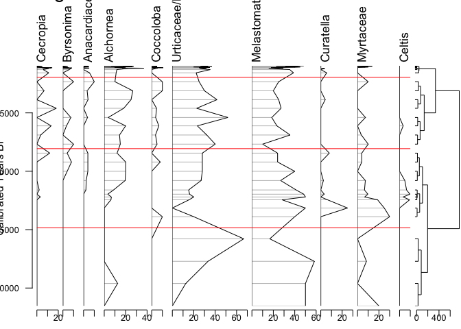

## Introducción

El objetivo de este documento es mostrar como usar el paquete de R para la base de datos Neotoma, `neotoma2`.

La [librería neotoma2](https://github.com/NeotomaDB/neotoma2) está disponible en GitHub y actualmente la documentación sólo está en inglés - trabajamos para tenerla en español próximamente. 

## ¿Qué aprenderemos?

Los objetivos de aprendizaje de este taller son:  

- Aprender cómo se organiza la información dentro de Neotoma (Sitios, Unidades de colección y Conjuntos de datos)  

- Cómo se traduce esta estructura en el paquete neotoma2 para R:  

## En R:

  * Busqueda de sitios: Buscar sitios a partir de nombres o parámetros geográficos.  
  * Filtrar resultados: Filtración de resultados utilizando parametros temporales o espaciales.  
  * Exploración de datos: Obtener información de muestras para los grupos de datos seleccionados. 
  * Visualizar datos:  Realizar gráficos estratigráficos básicos. 

1. [Búsqueda de Sitios](#3-site-searches): Buscar sitios a partir de nombres o parámetros geográficos.  
2. [Filtrar Resultados](#33-filter-records-tabset): Filtración de resultados utilizando parametros temporales o espaciales.
3. [Exploración de Datos](#34-pulling-in-sample-data): Obtener información de muestras para los grupos de datos seleccionados. 
4. [Visualizar Datos](#4-simple-analytics):  Realizar gráficos estratigráficos básicos.  

## Antecedentes

### Obtener ayuda coh Neotoma

Si estás planeando trabajar con Neotoma, te invitamos a unirte a nuestro canal de [Slack](https://join.slack.com/t/neotomadb/shared_invite/zt-cvsv53ep-wjGeCTkq7IhP6eUNA9NxYQ), donde tenemos un espacio específico para preguntas sobre el paquete en R: el canal #it_r (también hay #it_r_es si prefieres ayuda en español).

También puedes unirte a la comunidad de Neotoma a través de nuestras listas de correo en Google Groups. Para hacerlo, revisa la información en nuestro sitio web o [contáctanos](mailto:neotoma-contact@googlegroups.com) para ser agregado.

### La estrucura de Neotoma
Los datos en la base de datos de Neotoma están organizados como un conjunto de relaciones conectadas que permiten representar los distintos elementos de un análisis paleoecológico:

- Espacio y tiempo:
    - ¿Dónde está ubicada una muestra (latitud y longitud)?
    - ¿A qué profundidad fue tomada dentro de un perfil estratigráfico?
    - ¿Qué edad estimada tiene esa muestra?
    - ¿Qué edad tienen los elementos encontrados dentro o cerca de esa muestra?

- Observaciones:
    - ¿Qué se está contando o midiendo?
    - ¿Qué unidades se están usando?
    - ¿Quién lo observó?

- Métodos científicos
    - ¿Qué modelo estadístico se usó para calcular la edad?
    - ¿Qué tipo de incertidumbre se consideró para describir esa observación?

- Modelos conceptuales de datos
    - ¿Cómo se relacionan las observaciones dentro de una muestra con otras muestras de la misma colección?
    - ¿Cómo se vincula una observación fósil con especies actuales o extintas relacionadas?

La paleoecología es un campo amplio y en constante evolución por lo que estas relaciones pueden ser bastante complejas. Por eso, la base de datos está altamente estructurada y normalizada, lo que permite agregar nuevos conocimientos sin afectar el modelo de datos central.

Si quieres profundizar en cómo está organizada la base de datos, puedes leer el Manual de la base de datos de Neotoma o revisar directamente el esquema del modelo relacional.

#### Estructura de Datos en Neotoma

{width=75%}  
  
En Neotoma, los datos se asocian a **sitios** -- ubicaciones específicas con coordenadas de latitud y longitud.

Dentro de un **sitio**, puede haber una o más [**unidades de colecta**](https://open.neotomadb.org/manual/dataset-collection-related-tables-1.html#CollectionUnits) -- que son los puntos específicos donde se recolectan físicamente las uestras dentro del sitio. Por ejemplo:

* Una **cueva** es un sitio que puede tener más de una **colección**, con entidades específicas (espeleotemas)
* Un **sitio arqueológico** puede tener una o más **colecciones**, como pozos dentro de una excavación.
* Un **sitio** de muestreo de polen puede tener varias **colecciones** -- es decir, diferentes núcleos dentro de la cuenca del lago.
* Una ciénaga es un **sitio** que puede tener diversas **colecciones** -- una transecta con varias muestras de superficie.

Las unidades de colección pueden tener coordenadas GPS de mayor resolución que el sitio general, pero siguen considerándose parte del mismo sitio.

Los datos dentro de una **colección** son recopilados a partir de diferentes [**unidades de análisis**](https://open.neotomadb.org/manual/sample-related-tables-1.html#AnalysisUnits), por ejemplo:

* Todo el sedimento a 10cm de profundidad en un perfil de corte (la colección) a lo largo de un lago meándrico (el sitio) es una unidad de análisis;
* Todo el material en una muestra de superficie (colección) tomada de una ciénaga (el sitio) es una unidad de análisis;
* Todos los restos fósiles en una capa enterrada de huesos (colección) en una cueva (el sitio) también forman una unidad de análisis.

Los datos recolectados en una unidad de análisis se agrupan según su tipo de conjunto de datos (carbón, diatomeas, dinoflagelados, etc.) y se organizan como una [**muestra**](https://open.neotomadb.org/manual/sample-related-tables-1.html#Samples). El conjunto de muestras de una colección  para un tipo de datos determinado se asigna a un [**conjunto de datos**](https://open.neotomadb.org/manual/dataset-collection-related-tables-1.html#Datasets).

* Una muestra puede ser todas las diatomeas (conjunto de datos) extraídas del sedimento a 12 cm de profundidad (unidad de análisis) en un núcleo (colección) de un lago (el sitio).
* Otra muestra puede ser el registro de un solo hueso de mamut (muestra y unidad de análisis, tipo de datos: vertebrados) encontrado en la ribera de un río (sitio y unidad de colección).

#### Estructura de Datos en `neotoma2` {#222-data-structures-in-neotoma2}

  

Si observamos el [diagrama UML](https://es.wikipedia.org/wiki/Lenguaje_unificado_de_modelado) podemos observar que la estructura de datos en el paquete `neotoma2` refleja la estructura original de la base de datos. 

Como veremos en la sección [Búsqueda de Sitios](#3-site-searches), podemos buscar estos objetos y empezar a trabajar con ellos (en la sección [Análisis Simple](#4-simple-analytics)).

Un punto que debemos tener en cuenta, *en el paquete `neotoma2`, la mayoría de los objetos son de la clase `sites` , que contienen mayor o menor información*.  Hay diferentes funciones que operan sobre `sites`. Cuando queremos obtener mayor información sobre los sitios `sites`, utilizamos las funciones `get_datasets()` o `get_downloads()` que pueblan con mayor información los sitios.


## Búsqueda de sitios

### `get_sites()`

Hay diferentes maneras de encontrar sitios en `neotoma2`. Debémos pensar en los `sitios` como objetos espaciales. Tienen nombre, ubicación y pueden ser encontrados bajo en contexto de unidades geopolíticas. Sin embargo, bajo el contexto de la API y del paquete de R, los sitios en sí mismos no contienen datos sobre la taxonomía, el grupo de datos o las edades. Simplemente es un contenedor al que le podemos agregar más información. Es así que cuando buscamos por sitio, lo hacemos usando los siguientes atributos (en inglés):

| Parámetro     | Descripción                                                                 |
| ------------- | --------------------------------------------------------------------------- |
| sitename      | Un nombre válido, usando `%` como comodín.        |
| siteid        | Un identificador numérico único del sitio en la base de datos de Neotoma.   |
| loc           | Un vector de caja delimitadora, GeoJSON o cadena WKT.                       |
| altmin        | Límite inferior de altitud para los sitios.                                 |
| altmax        | Límite superior de altitud para los sitios.                                 |
| database      | La base de datos específica de donde se extraen los registros.              |
| datasettype   | El tipo de conjunto de datos (ver `get_tables(datasettypes)`).              |
| datasetid     | Identificador numérico único del conjunto de datos en Neotoma.              |
| doi           | Un DOI válido para un conjunto de datos en Neotoma.                         |
| gpid          | Un ID numérico único o cadena de texto que identifica una unidad geopolítica. |
| keywords      | Palabras clave únicas para muestras registradas en Neotoma.                 |
| contacts      | Un nombre o ID numérico de personas asociadas con los sitios.               |
| taxa          | IDs numéricos únicos o nombres de taxones asociados con los sitios.         |

#### Nombre del sitio: `sitename="%Lago%"` {.tabset}

Hay ocasiones en las que sabremos exactamente el nombre del sitio que estamos buscando ("Lago Titicaca"), y habrà ocasiones en las que tendremos una idea aproximada sobre el nombre (por ejemplo, sabemos que el nombre es parecido a "Lago Titicaca", o "Lake Titicaca", pero no estamos seguros de como fue ingresado a la base de datos).

De forma general, utilizamos el formato: `get_sites(sitename="XXXXX")` para buscar un sitio por nombre.

PostgreSQL (y la API) utilizan el signo de porcentaje como comodín. De esta forma, `"%Titicaca%"` seleccionará ["Lake Titicaca"](https://data.neotomadb.org/21984) y en caso de existir, también seleccionaría "Lago Titicaca" y "Pantano **Titicaca**". La búsqueda tampoco distingue entre mayúsculas y minúsculas, por lo que simplemente podría escribir `"%titicaca%"`.

##### Code


``` r
lago_titicaca <- neotoma2::get_sites(sitename = "%titicaca%")
lago_titicaca
```

##### Result


```
##  siteid
##   14104
##   14202
##   24301
##                                                                      sitename
##  Lago Huiñaimarca - Lake Titicaca [Lago Menor][Lago Pequeno][Lago Winaymarca]
##                                                                 Lake Titicaca
##  Lago Huiñaimarca - Lake Titicaca [Lago Menor][Lago Pequeno][Lago Winaymarca]
##        lat      long altitude
##  -16.28412 -68.72699     3811
##  -16.12887 -69.50345     3809
##  -16.29474 -68.73378     3811
```

#### Ubicación: `loc=c()` {.tabset}

El paquete `neotoma` utilizaba un cuadro delimitador para buscar por ubicación. El cuadro estaba estructurado como un vector con valores de latitud y longitud: `c(xmin, ymin, xmax, ymax)`.  En `neotoma2` se puede utilizar esta misma caja delimitadora o podemos definir objetos espaciales más complejos con el [paquete `sf`](https://r-spatial.github.io/sf/). El paquete `sf` nos permite trabajar con datos ráster y polígonos en R, para seleccionar sitios existentes en objetos espaciales más complejos. El parametro `loc` trabaja con vectores simples, objetos [WKT](https://arthur-e.github.io/Wicket/sandbox-gmaps3.html), objetos [geoJSON](http://geojson.io/#map=2/20.0/0.0) y objectos `sf` en R.  **Notar que** el paquete `neotoma2` es un función contenedora API que utiliza un URL ([api.neotomadb.org](https://api.neotomadb.org)). 

Buscar sitios utilizando una ubicación. En el siguiente código hay tres representaciones de Sudamérica: geoJSON, WKT y con un cuadro delimitador. También hemos transformado el elemento `sa$geoJSON` a un objeto del paquete `sf`. Podemos utilizar cualquiera de estas cuatro representaciones para trabajar con el paquete `neotoma2`.


``` r
sa <- list(geoJSON = '{"type": "Polygon",
        "coordinates": [[
            [-79.66, -5.97],
            [-70.06, -19.07],
            [-74.38, -55.59],
            [-34.67, -6.52],
            [-76.41, 8.37],
            [-79.66, -5.97]
            ]]}',
        WKT = 'POLYGON ((-79.66, -5.97,
                         -70.06, -19.07,
                         -74.38, -55.59,
                         -34.67, -6.52,
                         -76.41, 8.37,
                         -79.66, -5.97))',
        bbox = c(-79.66, -55.59, -34.67, 8.37))

sa$sf <- geojsonsf::geojson_sf(sa$geoJSON)

sa_sites <- neotoma2::get_sites(loc = sa$sf, all_data = TRUE)
```

Puedes siempre hacer un gráfico de los `sites` obtenidos con `plot()`, pero los datos perderan el contexto geográfico. La función `plotLeaflet()` regresa un mapa de la librería `leaflet()` y permite mayor personalización o agregar datos espaciales adicionales (como nuestro cuadro delimitador, `sa$sf`, que funciona directamente con el paquete `leaflet`):

##### Code

Note the use of the `%>%` pipe here. If you are not familiar with this symbol, check our ["Piping in R" section](#piping-in-r) of the Appendix.


``` r
neotoma2::plotLeaflet(sa_sites) %>% 
  leaflet::addPolygons(map = ., 
                       data = sa$sf, 
                       color = "green")
```

##### Result


```{=html}
<div class="leaflet html-widget html-fill-item" id="htmlwidget-b77c26f6f140fa051e83" style="width:672px;height:480px;"></div>
<script type="application/json" data-for="htmlwidget-b77c26f6f140fa051e83">{"x":{"options":{"crs":{"crsClass":"L.CRS.EPSG3857","code":null,"proj4def":null,"projectedBounds":null,"options":{}}},"calls":[{"method":"addTiles","args":["https://{s}.tile.openstreetmap.org/{z}/{x}/{y}.png",null,null,{"minZoom":0,"maxZoom":18,"tileSize":256,"subdomains":"abc","errorTileUrl":"","tms":false,"noWrap":false,"zoomOffset":0,"zoomReverse":false,"opacity":1,"zIndex":1,"detectRetina":false,"attribution":"&copy; <a href=\"https://openstreetmap.org/copyright/\">OpenStreetMap<\/a>,  <a href=\"https://opendatacommons.org/licenses/odbl/\">ODbL<\/a>"}]},{"method":"addCircleMarkers","args":[[-23.08333,-23.5,-23.83333,-18.25,-15.23333,-3.16667,-17.56667,-40,-0.03333,-16.36667,-16.36667,-16.25,-15.21667,-38.58333,-51.58333,-16.35,0.26667,-40.66667,-24.66667,-14.8,-46.63333,-41.05833,-16.4,-23.48333,-11.78333,-11.75,-11.66667,-41.33333,-41.25,-51.51667,-50.46667,-17.025,-16.21667,-40.66667,-39.36667,-16.43333,-18.16667,-35.33333,-19,-32.25,-39.00639,-40.58306,-23.31667,-23.31667,-23.95,-36.858462,-36.88333,-36.68333,-17.53333,-13.263406,-13.348328,-18.662,-18.68115,-42.35216,-42.491774,-41.511176,-41.359924,-43.437558,-41.070972,-13.61481,-52.037524,-45.689698,-7.635362,-41.75184,-13.951252,-48.941316,-36.06427,-21.644252,-21.731844,-21.510544,-21.58938,-21.548518,-21.572444,-21.62443,-22.213146,-22.511808,-22.797418,-21.643868,-21.658684,-21.619452,4.576458,4.586102,-14.428682,-0.68774,4.44909,4.658768,4.969924000000001,3.95414,4.593188,3.301312,3.366262,-14.48487,-13.09194,-13.09489,-13.099234,3.95275,4,6.22204,-0.602128,3.0833,2.36575,5.77789,1.066076,5.453394,4.696032,6.17704,6.478214,2.474422,-0.7003,-0.706,-0.70373,4.09922,3.965954,3.952946,2.446182,6.37587,6.38712,6.38741,6.36657,6.365814,6.365004,2.00948,2.00948,2.43268,3.10116,3.981382,2.10005,5.07352,5.215432,4.99445,-16.28412,4.90185,4.89292,-15.737202,6.47451,-16.128872,-4.06333,-20.323644,-2.96404,-2.98469,-2.0795,-6.29879,-4.18985,-4.00684,-4.04586,-4.00244,-3.98092,-12.73079,-16.294744,-44.90858,-2.83533,-10.04542,-4.25547,-3.975,-4.04586,-3.97467,-3.98978,-0.60078,-18.09183,-12.99739,-0.34583,-0.42342,-4.37461,-47.64356,-44.2797,-4.37461,-44.01033,-4.25658,-4.11608,-2.836632,-4.04382,-37.91177,0.28602,-4.14972,-13.61667,-0.96577,-18.5799,-15.749926,-22.24549,-14.46667,-23.725,-34.84352,-17.07932,-12.99739,-12.99739,-12.99739,-12.99739,-12.99739,-12.99739,-12.99739,-12.99739,-12.99739,-6.922,-11.89798,-13.38339,-12.65164,-12.65038,-12.64622,-12.64348,-12.63996,-13.16115,-13.19914,-13.16846,-13.06996,-12.64711,-12.64424,-11.90506,-12.63,-11.9714,-1.1,-11.9283,-16.08938,-16.38547,-3.04393,-3.04345,-3.04345,-3.04319,-3.04384,-3.04604,-3.0463,-3.0511,-15.90268,-15.40938,-16.57995,-16.7818,-11.9295,-11.97,-11.983,-12.035,-12.041,-12.126,-16.33795,-12.1,-16.5782,-16.36297,-15.6623,-16.73398,-16.1327,-16.58133,-2.82879,-2.82952,-2.83032,-2.83111,-2.83171,-15.74625,-16.52877,-15.69945,-15.65503,-15.43527,-16.67815,-16.62463,-16.51303,-6.72,-16.52245,-2.30558,-2.30558,-2.30558,-2.30576,-2.23706,-2.23718,-2.23896,-2.23985,-2.24073,-2.24051,-2.23957,-2.23726,-15.88223,-11.909,-16.42715,-15.57517,-1.46207,-1.46093,-1.46095,-1.46122,-1.46123,-1.46119,-1.45876,-1.46009,-1.45419,-1.44745,-14.98958,-15.77695,-6.7,-11.9331,-15.68798,-16.18325,-0.65989,-0.65913,-0.6571900000000001,-0.65695,-0.65494,-0.65366,-0.65264,-0.6541400000000001,-0.68142,-0.68164,-0.68188,-0.6815099999999999,-16.2,-0.62865,-0.6307199999999999,-0.63152,-0.63187,-0.62943,-0.62619,-0.62521,-0.59384,-0.59462,-0.91093,-0.91078,-0.91006,-0.90987,-0.9129,-0.90848,-0.9044,-0.90302,-0.90352,-0.90403,-0.90456,-0.90522,-0.9083599999999999,-15.69795,-15.78345,-15.53652,-15.7196,-13.28411,-15.17,0.6288899999999999,-0.599,-13.4,-13.4,-13.18934,-13.15148,-13.1872,-13.18984,-13.17959,-13.18144,-13.1895,-13.17369,-13.1895,-12.93094,-12.96574,-13.14411,-13.18954,-13.18953,-12.945,-12.9449,-12.94501,-13.18029,-13.09413,-13.18976,-12.93631,-13.13789,-13.13674,-13.15212,-13.15202,-13.19063,-13.15182,-13.18761,-13.19037,-12.92134,-13.14329,-12.93146,-13.17484,-13.17484,-5.82,-12.17731,-1.63,-40.12282,-15.845,-12.97288,-38.21397,-17.83413,-32.072,-31.838452,-31.84346,0.13,-3.86069,-33.53628],[-67.40000000000001,-67.58333,-65.75,-69.2,-68.98333,-44.98333,-65.93333,-72,-78.03333000000001,-68.15000000000001,-68.15000000000001,-68.5,-69.09999999999999,-70.66667,-72.63333,-68.04167,-66.68333,-71.13333,-50.21667,-69.18333,-72.83333,-71.51667,-71.15000000000001,-67.68333,-75.21666999999999,-75.25,-75,-71.58333,-71.46666999999999,-72.05,-73,-67.34999999999999,-71.08333,-71.18333,-70.93333,-68.13333,-68.88333,-69.75,-46.76667,-69.33333,-63.775,-62.67389,-67.78333000000001,-67.78333000000001,-67.78333000000001,-71.04893199999999,-70.38333,-70.41667,-65.81667,-63.710252,-63.527964,-69.54518,-69.62459799999999,-71.29005599999999,-71.40179999999999,-71.50831600000001,-71.50931800000001,-71.562236,-71.49449,-73.32216000000001,-71.87814400000001,-71.83966599999999,-77.474976,-71.4288,-68.991618,-71.257034,-70.51521200000001,-68.08443800000001,-67.944672,-68.013352,-68.067682,-67.87869000000001,-68.051204,-68.069598,-67.78801399999999,-67.504344,-67.839478,-68.08608600000001,-67.80596799999999,-68.06313200000001,-71.33243400000001,-71.32755399999999,-67.92124799999999,-76.43841999999999,-70.53919399999999,-71.456344,-69.521698,-73.05444399999999,-71.44119999999999,-73.36311400000001,-73.416544,-67.87635,-71.708254,-71.70530599999999,-71.70319599999999,-74.16054600000001,-74.25,-72.76666,-72.399604,-76.5333,-76.70941000000001,-73.06724,-77.158492,-73.75322199999999,-74.278154,-72.792974,-72.390912,-76.606542,-72.05172,-72.05962,-72.05567000000001,-74.25136999999999,-74.09325,-74.300016,-77.688114,-72.33748,-72.34629,-72.34639,-72.33238,-72.325524,-72.31772599999999,-77.12067999999999,-77.12067999999999,-76.78055000000001,-76.52225,-74.158564,-77.05422200000001,-74.10008000000001,-74.00398399999999,-74.15685999999999,-68.72699,-75.22958,-75.21022000000001,-70.75483800000001,-76.09258,-69.503452,-73.19499999999999,-67.96472200000001,-75.92534000000001,-76.32691,-75.06914999999999,-74.67440000000001,-74.31612,-75.96303,-79.15958000000001,-79.05958,-79.07447000000001,-71.83614799999999,-68.733778,-71.56444,-55.042308,-67.85505999999999,-79.11214,-79.07361,-79.15958000000001,-79.11761,-79.14519,-77.84689,-57.56267,-65.98614000000001,-64.49889,-78.01792,-79.11153,-72.97521999999999,-71.52330000000001,-79.11153,-71.49151999999999,-79.12092,-79.17206,-77.962086,-79.16257,-71.04079,-66.67672,-79.15694000000001,-61.55,-78.40662,-69.1606,-70.18767200000001,-68.14253000000001,-61.06667,-67.77556,-69.91789,-45.1114,-65.98614000000001,-65.98614000000001,-65.98614000000001,-65.98614000000001,-65.98614000000001,-65.98614000000001,-65.98614000000001,-65.98614000000001,-65.98614000000001,-78.587,-71.40481,-71.90203,-71.24875,-71.26121000000001,-71.26776,-71.27419999999999,-71.26776,-71.59969,-71.61751,-71.60087,-71.56527,-71.26836,-71.27697000000001,-71.34083,-70.11,-71.2945,-75.8,-71.3383,-68.88500000000001,-70.37052,-78.0334,-78.03360000000001,-78.03360000000001,-78.0343,-78.0363,-78.0364,-78.03619999999999,-78.0343,-70.51197000000001,-70.20377000000001,-68.15618000000001,-68.29667999999999,-71.32402999999999,-71.2559,-71.238,-71.16500000000001,-71.155,-71.815,-68.04259999999999,-71.1092,-68.16758,-70.39303,-70.19553000000001,-68.30175,-68.3617,-68.39060000000001,-77.9704,-77.97,-77.9678,-77.96729999999999,-77.96639999999999,-70.6765,-68.39032,-70.20528,-70.19568,-70.16755000000001,-68.31545,-68.27482000000001,-68.49198,-76.248,-68.45883000000001,-78.1421,-78.1421,-78.1421,-78.1442,-78.04259999999999,-78.04600000000001,-78.0501,-78.0505,-78.0513,-78.05159999999999,-78.05200000000001,-78.05,-70.56458000000001,-71.34399999999999,-68.14258,-70.20845,-78.2111,-78.21129999999999,-78.212,-78.2123,-78.2132,-78.2145,-78.21599999999999,-78.22069999999999,-78.2209,-78.2213,-70.12608,-70.61478,-76.217,-71.30500000000001,-70.19425,-68.33817000000001,-77.59229999999999,-77.59220000000001,-77.5917,-77.5916,-77.5915,-77.5917,-77.5933,-77.5942,-77.59780000000001,-77.5979,-77.5975,-77.5975,-68.34999999999999,-77.84099999999999,-77.84139999999999,-77.84139999999999,-77.84050000000001,-77.8415,-77.8421,-77.84139999999999,-77.8779,-77.8772,-77.84139999999999,-77.8415,-77.8415,-77.84099999999999,-77.8402,-77.8404,-77.8425,-77.8437,-77.84350000000001,-77.843,-77.8428,-77.8428,-77.8419,-70.19755000000001,-70.6001,-70.04575,-70.15237999999999,-72.04848,-70,-61.67917,-75.48399999999999,-72.134,-72.134,-71.58911999999999,-71.63867,-71.59278999999999,-71.5912,-71.58749,-71.58975,-71.58684,-71.62641000000001,-71.58684,-71.79476,-71.77793,-71.6319,-71.59441,-71.59441,-71.79219000000001,-71.79219000000001,-71.79219000000001,-71.62698,-71.70350000000001,-71.5926,-71.79027000000001,-71.61878,-71.64807,-71.63987,-71.63822999999999,-71.59231,-71.63934,-71.59323000000001,-71.59174,-71.79622000000001,-71.63794,-71.78731999999999,-71.62665,-71.62665,-77.95,-69.09765,-53.59,-72.21727,-68.27652999999999,-65.57617,-71.73403,-64.71889,-71.48999999999999,-71.51327000000001,-71.51854,-78.25722,-79.06113999999999,-66.64454000000001],10,null,null,{"interactive":true,"draggable":false,"keyboard":true,"title":"","alt":"","zIndexOffset":0,"opacity":1,"riseOnHover":true,"riseOffset":250,"stroke":true,"color":"#03F","weight":5,"opacity.1":0.5,"fill":true,"fillColor":"#03F","fillOpacity":0.2},{"showCoverageOnHover":true,"zoomToBoundsOnClick":true,"spiderfyOnMaxZoom":true,"removeOutsideVisibleBounds":true,"spiderLegPolylineOptions":{"weight":1.5,"color":"#222","opacity":0.5},"freezeAtZoom":false},null,["<b>Aguas Calientes<\/b><br><b>Description:<\/b> Mire.<br><a href=http://apps.neotomadb.org/explorer/?siteids=13>Explorer Link<\/a>","<b>Aguas Calientes 2<\/b><br><b>Description:<\/b> Mire.<br><a href=http://apps.neotomadb.org/explorer/?siteids=14>Explorer Link<\/a>","<b>Aguilar<\/b><br><b>Description:<\/b> Fen along creek above Mina Aguilar. Physiography: bog cut by creek draining endmoraines. Surrounding vegetation: Altiplano paramo grassland.<br><a href=http://apps.neotomadb.org/explorer/?siteids=15>Explorer Link<\/a>","<b>Ajata<\/b><br><b>Description:<\/b> Mire.<br><a href=http://apps.neotomadb.org/explorer/?siteids=17>Explorer Link<\/a>","<b>Amarete<\/b><br><b>Description:<\/b> Mire.<br><a href=http://apps.neotomadb.org/explorer/?siteids=32>Explorer Link<\/a>","<b>Lago do Aquiri<\/b><br><b>Description:<\/b> Natural lake, sometimes flooded by river. Physiography: soft rolling area with flood plains. Surrounding vegetation: anthropog. palm forest, swamp savanna.<br><a href=http://apps.neotomadb.org/explorer/?siteids=211>Explorer Link<\/a>","<b>Cala Conto<\/b><br><b>Description:<\/b> Interandean plain.<br><a href=http://apps.neotomadb.org/explorer/?siteids=323>Explorer Link<\/a>","<b>Caunahue<\/b><br><b>Description:<\/b> Outcrop along Caunahue river (L. Ranco). Physiography: within end-moraines. Surrounding vegetation: Valdivian rainforest.<br><a href=http://apps.neotomadb.org/explorer/?siteids=342>Explorer Link<\/a>","<b>Cayambe<\/b><br><b>Description:<\/b> NA<br><a href=http://apps.neotomadb.org/explorer/?siteids=343>Explorer Link<\/a>","<b>Chacaltaya 1<\/b><br><b>Description:<\/b> NA<br><a href=http://apps.neotomadb.org/explorer/?siteids=347>Explorer Link<\/a>","<b>Chacaltaya 2<\/b><br><b>Description:<\/b> NA<br><a href=http://apps.neotomadb.org/explorer/?siteids=348>Explorer Link<\/a>","<b>Cerro Calvario<\/b><br><b>Description:<\/b> NA<br><a href=http://apps.neotomadb.org/explorer/?siteids=483>Explorer Link<\/a>","<b>Cotapampa<\/b><br><b>Description:<\/b> NA<br><a href=http://apps.neotomadb.org/explorer/?siteids=497>Explorer Link<\/a>","<b>Cueva Haichol<\/b><br><b>Description:<\/b> Rockshelter. Physiography: about 50m above valley. Surrounding vegetation: scrub steppe with Maytenus and Schinus.<br><a href=http://apps.neotomadb.org/explorer/?siteids=521>Explorer Link<\/a>","<b>Cueva Milodon<\/b><br><b>Description:<\/b> Cave N Puerto Natales, Ultima Esperanza. Physiography: large cave in conglomerate facing west. Surrounding vegetation: Nothofagus pumilio woodland.<br><a href=http://apps.neotomadb.org/explorer/?siteids=522>Explorer Link<\/a>","<b>Cumbre Unduavi<\/b><br><b>Description:<\/b> NA<br><a href=http://apps.neotomadb.org/explorer/?siteids=523>Explorer Link<\/a>","<b>Lagoa das Patas<\/b><br><b>Description:<\/b> Lake, 300m x 7m on low inselberg. Physiography: small closed basin with flat bottom. Surrounding vegetation: dense, lowland tropical rain forest.<br><a href=http://apps.neotomadb.org/explorer/?siteids=532>Explorer Link<\/a>","<b>Encantado<\/b><br><b>Description:<\/b> Cave, La Centinela rock spire. Physiography: pre-Andean basalt plateaus. Surrounding vegetation: Austrocedrus/steppe.<br><a href=http://apps.neotomadb.org/explorer/?siteids=778>Explorer Link<\/a>","<b>Serra Campos Gerais<\/b><br><b>Description:<\/b> Peat bog. Physiography: highland plain, next to a river vally. Surrounding vegetation: farmland.<br><a href=http://apps.neotomadb.org/explorer/?siteids=843>Explorer Link<\/a>","<b>Katantica<\/b><br><b>Description:<\/b> NA<br><a href=http://apps.neotomadb.org/explorer/?siteids=1406>Explorer Link<\/a>","<b>La Esperanza<\/b><br><b>Description:<\/b> NA<br><a href=http://apps.neotomadb.org/explorer/?siteids=1536>Explorer Link<\/a>","<b>Lago Moreno<\/b><br><b>Description:<\/b> Small lake near Lago Nahuel Huapi. Physiography: glaciated region of southern Andes. Surrounding vegetation: Nothofagus dombeyi/Austrocedrus forest.<br><a href=http://apps.neotomadb.org/explorer/?siteids=1538>Explorer Link<\/a>","<b>Laguna Salinas<\/b><br><b>Description:<\/b> Peat bog at lake border. Physiography: high andean basin, surrounded by volcano. Surrounding vegetation: puna steppe.<br><a href=http://apps.neotomadb.org/explorer/?siteids=1539>Explorer Link<\/a>","<b>Lejía<\/b><br><b>Description:<\/b> Playa. Surrounding vegetation: desert.<br><a href=http://apps.neotomadb.org/explorer/?siteids=1578>Explorer Link<\/a>","<b>Laguna Jeronimo<\/b><br><b>Description:<\/b> Moraine dammed lake. Physiography: Eastern Cordillera of the Andes. Surrounding vegetation: Ichu grass.<br><a href=http://apps.neotomadb.org/explorer/?siteids=1595>Explorer Link<\/a>","<b>Laguna Pomacocha<\/b><br><b>Description:<\/b> Moraine dammed lake. Physiography: Eastern Cordillera of the Andes. Surrounding vegetation: Ichu grass.<br><a href=http://apps.neotomadb.org/explorer/?siteids=1621>Explorer Link<\/a>","<b>Laguna Tuctua<\/b><br><b>Description:<\/b> Moraine dammed lake. Physiography: easternmost ridge of Eastern Cordillera. Surrounding vegetation: Ichu grass.<br><a href=http://apps.neotomadb.org/explorer/?siteids=1625>Explorer Link<\/a>","<b>Mallin Book<\/b><br><b>Description:<\/b> Sedge bog behind L. Mascardi beach. Physiography: glacially carved valley. Surrounding vegetation: Nothofagus dombeyi/Austrocedrus forest.<br><a href=http://apps.neotomadb.org/explorer/?siteids=1639>Explorer Link<\/a>","<b>Lago Mascardi-Gutierrez<\/b><br><b>Description:<\/b> Bog. Physiography: sediments deposited in morainedamed lake. Surrounding vegetation: Mixed Nothfagus dombeyi-Austrocedrus chi.<br><a href=http://apps.neotomadb.org/explorer/?siteids=1655>Explorer Link<\/a>","<b>Meseta Latorre<\/b><br><b>Description:<\/b> Cyperaceae bog. Physiography: Meseta high plain. Surrounding vegetation: dwarf shrubs of high Andean type.<br><a href=http://apps.neotomadb.org/explorer/?siteids=1685>Explorer Link<\/a>","<b>Moreno Glacier Bog<\/b><br><b>Description:<\/b> Peatbog in valley east Moreno Gl.lookout. Physiography: glacier carved valley. Surrounding vegetation: Nothofagus pumilio forest.<br><a href=http://apps.neotomadb.org/explorer/?siteids=1714>Explorer Link<\/a>","<b>Monte Blanco<\/b><br><b>Description:<\/b> NA<br><a href=http://apps.neotomadb.org/explorer/?siteids=1717>Explorer Link<\/a>","<b>Nevado Sabancaya<\/b><br><b>Description:<\/b> NA<br><a href=http://apps.neotomadb.org/explorer/?siteids=1737>Explorer Link<\/a>","<b>Primavera<\/b><br><b>Description:<\/b> Cave in andesitic rock formation. Physiography: rock spire near fullglacial endmoraine. Surrounding vegetation: Nothofagus antarctica shrub/steppe.<br><a href=http://apps.neotomadb.org/explorer/?siteids=1910>Explorer Link<\/a>","<b>Rahue<\/b><br><b>Description:<\/b> Outcrop in Sierra Catan Lil above Rahue. Physiography: diatomites and peats. Surrounding vegetation: steppe with Rhamnaceae shrubs.<br><a href=http://apps.neotomadb.org/explorer/?siteids=1948>Explorer Link<\/a>","<b>Río Kaluyo<\/b><br><b>Description:<\/b> NA<br><a href=http://apps.neotomadb.org/explorer/?siteids=1994>Explorer Link<\/a>","<b>Sajama<\/b><br><b>Description:<\/b> NA<br><a href=http://apps.neotomadb.org/explorer/?siteids=2244>Explorer Link<\/a>","<b>Salado<\/b><br><b>Description:<\/b> Bog in the upper Ao. Yaucha/L. Diamante. Physiography: volcanic region, glaciated. Surrounding vegetation: high Andean grassland.<br><a href=http://apps.neotomadb.org/explorer/?siteids=2247>Explorer Link<\/a>","<b>Lagoa Campestre de Salitre<\/b><br><b>Description:<\/b> Peat bog in a depression. Physiography: depression. Surrounding vegetation: semideciduous forest/dry forest.<br><a href=http://apps.neotomadb.org/explorer/?siteids=2248>Explorer Link<\/a>","<b>Salina 2<\/b><br><b>Description:<\/b> Peat mound near playa Uspallata Valley. Physiography: bajadas with spring mounds. Surrounding vegetation: Monte desert with Larrea divaricata.<br><a href=http://apps.neotomadb.org/explorer/?siteids=2249>Explorer Link<\/a>","<b>Salina Anzoátegui<\/b><br><b>Description:<\/b> Salt-lake. Physiography: closed depression. Surrounding vegetation: Espinal-Monte transition.<br><a href=http://apps.neotomadb.org/explorer/?siteids=2250>Explorer Link<\/a>","<b>Salina Piedra<\/b><br><b>Description:<\/b> Salt-lake close to the Atlantic ocean. Physiography: clossed depression. Surrounding vegetation: Espinal-Monte transition.<br><a href=http://apps.neotomadb.org/explorer/?siteids=2251>Explorer Link<\/a>","<b>Tumbre 1<\/b><br><b>Description:<\/b> NA<br><a href=http://apps.neotomadb.org/explorer/?siteids=2572>Explorer Link<\/a>","<b>Tumbre 2<\/b><br><b>Description:<\/b> NA<br><a href=http://apps.neotomadb.org/explorer/?siteids=2573>Explorer Link<\/a>","<b>Tuyajto<\/b><br><b>Description:<\/b> NA<br><a href=http://apps.neotomadb.org/explorer/?siteids=2579>Explorer Link<\/a>","<b>Mallín Vaca Lauquen<\/b><br><b>Description:<\/b> Site is a seasonally inundated wet meadow on the east side of the Andes. Modern vegitation is impoverished high-elevation bunchgrass steppe with Festuca pallescens and shrubs in the families Asteraceae (Baccharis ssp., Chiliotrichium rosmarinifolium, Chuquiraga ssp., Mutisia ssp., Perezia ssp.) and Rhamnaceae (Colletia spinosissima), as well as Berberis rosmarinifolia, Ephedra frustillata and Eryngium paniculatum (Apiaceae). Native herbs include Osmorhiza berteroi (Apiaceae), Calceolaria biflora (Scrophulariaceae), Quinchamalium chilense (Santalaceae) and Phacelia sp. (Hydrophyllaceae), among others. Introduced herbs include Rumex acetosella and Plantago lanceolata. The mountain slopes are covered by the northernmost extent of southern beech (Nothofagus) forest, which is occurs to treeline at 1700 m elevation. Nothofagus obliqua dominates lower elevation forests, while N. pumilio and N. antarctica grow at higher elevations, forming a krummholz belt above the treeline in the transition zone to the Andean tundra. N. antarctica also grows on poor soils at all elevations. Few Austrocedrus chilensis trees grow at lower elevations, and burnt and dead trees of Nothofagus obliqua in the watershed offer abundant evidence of fires in recent times.<br><a href=http://apps.neotomadb.org/explorer/?siteids=2802>Explorer Link<\/a>","<b>Veranada Pelan<\/b><br><b>Description:<\/b> Cyperaceae bog. Physiography: small basin of glacial origin. Surrounding vegetation: High Andean dwarf shrubs.<br><a href=http://apps.neotomadb.org/explorer/?siteids=2811>Explorer Link<\/a>","<b>Veranada Vulkanpickel<\/b><br><b>Description:<\/b> Cyperaceae bog. Physiography: small glacial basin. Surrounding vegetation: dwarf shrubs.<br><a href=http://apps.neotomadb.org/explorer/?siteids=2812>Explorer Link<\/a>","<b>Wasa Mayu<\/b><br><b>Description:<\/b> NA<br><a href=http://apps.neotomadb.org/explorer/?siteids=2827>Explorer Link<\/a>","<b>Laguna Granja<\/b><br><b>Description:<\/b> Oxbow lake 300 m from the modern San Martín River. Upland vegetation: seasonal southern Amazonian rainforest; immediate vegetation is riverine forest dominated by Vochysia mapirensis and Buchenavia oxycarpa; wider region dominated by closed-canopy terra firme evergreen rainforest, which is degraded by modern anthropogenic disturbance to a distance of 5 km from the lake. Littoral margins of the lake dominated by floating mats of aquatic vegetation, including Marsilea polycarpa and Eichhornia azurea. The ring-ditch archaeological site Granja del Padre lies 100 m from the eastern shore of the lake.<br><a href=http://apps.neotomadb.org/explorer/?siteids=9685>Explorer Link<\/a>","<b>Laguna Orícore<\/b><br><b>Description:<\/b> Large, shallow, flat-bottomed lake in the Beni Basin. Upland vegetation: seasonal southern Amazonian rainforest; the Beni Basin is seasonally inundated savanna mosaic. Terra firma pre-Cambrian shield outcrops at the northeast margin of the lake and lies 3 km north of the lake. The terra firma is covered with evergreen humid rainforest.<br><a href=http://apps.neotomadb.org/explorer/?siteids=9686>Explorer Link<\/a>","<b>Quebrada La Higuera Upper Middens<\/b><br><b>Description:<\/b> Site is a shallow canyon that cuts east–west through the western Andean precordillera of northern Chile, connecting the Altiplano with the hyperarid Atacama Desert.<br><a href=http://apps.neotomadb.org/explorer/?siteids=9700>Explorer Link<\/a>","<b>Quebrada La Higuera Lower Middens<\/b><br><b>Description:<\/b> Site is a shallow canyon that cuts east–west through the western Andean precordillera of northern Chile, connecting the Altiplano with the hyperarid Atacama Desert.<br><a href=http://apps.neotomadb.org/explorer/?siteids=9707>Explorer Link<\/a>","<b>Laguna del Cóndor<\/b><br><b>Description:<\/b> Moraine dammed lake near the terminal Pleistocene moraines. Located within the transition from open Austrocedrus chilensis woodland to steppe.<br><a href=http://apps.neotomadb.org/explorer/?siteids=10049>Explorer Link<\/a>","<b>Lago Mosquito<\/b><br><b>Description:<\/b> Located in a glacial valley near the terminal Pleistocene moraines, but dammed by aluvial fans emanating from tributary valleys. Located within the transition from open Austrocedrus chilensis woodland to steppe.<br><a href=http://apps.neotomadb.org/explorer/?siteids=10059>Explorer Link<\/a>","<b>Lago Huala Hué<\/b><br><b>Description:<\/b> Lake dammed by a glacial delta associated with late-Pleistocene meltwater from ice complexes from the north. Surrounding vegetation Nothofagus dombeyi-Austrocedrus forest.<br><a href=http://apps.neotomadb.org/explorer/?siteids=10060>Explorer Link<\/a>","<b>Laguna Padre Laguna<\/b><br><b>Description:<\/b> Lake dammed by a postglacial alluvial fan. Surrounding vegetation Nothofagus dombeyi-Austrocedrus forest.<br><a href=http://apps.neotomadb.org/explorer/?siteids=10063>Explorer Link<\/a>","<b>Lago Theobald<\/b><br><b>Description:<\/b> Glacial scour lake. Modern vegetation mixture of Nothofagus, Austrocedrus, and steppe taxa.<br><a href=http://apps.neotomadb.org/explorer/?siteids=10071>Explorer Link<\/a>","<b>Laguna el Trébol<\/b><br><b>Description:<\/b> Surrounded by closed forest dominated by Nothofagus dombeyi and lesser amounts of Austrocedrus chilensis<br><a href=http://apps.neotomadb.org/explorer/?siteids=10072>Explorer Link<\/a>","<b>Laguna de Pacucha<\/b><br><b>Description:<\/b> Lago Pacucha lies in an unglaciated section of the central valley of the Peruvian Andes. Surrounding vegetation: Cultivated fields, Eucalyptus plantations, limited native vegetation. Native vegetation would have been Andean cloud forest.<br><a href=http://apps.neotomadb.org/explorer/?siteids=10130>Explorer Link<\/a>","<b>Rio Rubens Bog<\/b><br><b>Description:<\/b> Ombrotrophic peat bog, located east of the Andean cordillera in the Chilean part of southern Patagonia. Site lies in a meltwater channel outside the Late Glacial Macimum Bog is dominated by the dwarf shrub Empetrum rubrum and the moss Polytrichum strictum. Site is situated at the steppe-forest ecotone. The original Nothofagus pumilio forests have been largely replaced by open Nothofagus antarctica and N. pumilio woodlands, Chiliotrichium diffusum shrub, and grasslands.<br><a href=http://apps.neotomadb.org/explorer/?siteids=10161>Explorer Link<\/a>","<b>Mallin Pollux<\/b><br><b>Description:<\/b> Sedge fen located behind a low ridge a few meters above the southeastern shore of Lago Pollux. A dense shrub belt of Nothofagus antarctica and Escallonia rubra covers the drier areas of the fen. Native Nothofagus pumilio forest has been mostly cleared and converted to pastureland.<br><a href=http://apps.neotomadb.org/explorer/?siteids=10175>Explorer Link<\/a>","<b>Laguna de Chochos<\/b><br><b>Description:<\/b> Moraine dammed lake that lies on the eastern flang of the eastern cordillera of the northern Peruvian Andes. The lake is partially encircled by timberline forest and is situated in an ecotone, with tropical alpine vegetation (known locally as páramo or puna). Within these grasslands are tussock-forming Calamagrostis, Cortaderia, and Festuca, with poorly drained areas dominated by sedges (Carex, Isolepis, Oreobolus, Scirpus, Uncinia). The lake has abundant submerged Isoëtes lechleri.<br><a href=http://apps.neotomadb.org/explorer/?siteids=10194>Explorer Link<\/a>","<b>Cordón Serrucho Norte wetland<\/b><br><b>Description:<\/b> Wetland lies within the North Patagonian fold-and-thrust belt in a narrow longitudinal depression on the southwest facing slope of the mountain range. Surface vegetation Scirpus and Empetrum nigrum with Sphagnum magellanicum hummocks in small areas. Stands of Nothofagus antarctica, Pilgerodendron uviferum, and Fitzroya cupressoides occur around the edges. Post-fire stands of Nothofagus dombeyi and Austrocedrus chilensis occur on slopes above and below the wetland.<br><a href=http://apps.neotomadb.org/explorer/?siteids=11799>Explorer Link<\/a>","<b>Lake Consuelo<\/b><br><b>Description:<\/b> Lake Consuelo is constantly immersed in ground-level clouds on most days and sits at 1360 m asl, 2500 m down slope from the Bolivian Altiplano and Lake Titicaca. The lake is located within a small, closed basin with moderately steep slopes that result in thin soils with duff layers thickening above 1400 m asl. Lake Consuelo is located very close to the Manu super-humid region identified by Killeen et al., (2007) as biodiversity hotspots.<br><a href=http://apps.neotomadb.org/explorer/?siteids=11877>Explorer Link<\/a>","<b>Lago Cardiel<\/b><br><b>Description:<\/b> The lake lies in an endorheic basin on the Patagonian Plateau between the Andean Cordillera and the Atlantic coast. Present-day vegetation is Patagonian steppe-scrub, with patches of tall shrubs in the valley bottoms (Schinus patagonicus, Berberis empetrifolia, Lycium chilense and Verbena tridens). Exposed mud flats around the lake margin are covered by dense growth of Amaranthaceae and other weedy taxa, some of European origin. Subantarctic Nothofagus antarctica woodland and Nothofagus pumilio forest grow on the higher-elevation mountains about 50 km to the northwest beyond the lake catchment.<br><a href=http://apps.neotomadb.org/explorer/?siteids=11932>Explorer Link<\/a>","<b>Laguna del Maule<\/b><br><b>Description:<\/b> Lake in a large caldera in the west-central Chilean Andes in the Andean Southern Volcanic Zone. Site is located in the transition zone between temperate semi-arid, summer warm and dry-cool high-mountain climate zones. Modern vegetation is high Andean Shrubland dominated by subshrubs and cushion species. A dam constructed in 1946-1958 raised water level 40 m, which increased volume from ~600,000 dam3 to 2,000,000 dam3.<br><a href=http://apps.neotomadb.org/explorer/?siteids=13289>Explorer Link<\/a>","<b>Lake Ballivian<\/b><br><b>Description:<\/b> NA<br><a href=http://apps.neotomadb.org/explorer/?siteids=13459>Explorer Link<\/a>","<b>Cachi Laguna<\/b><br><b>Description:<\/b> NA<br><a href=http://apps.neotomadb.org/explorer/?siteids=13460>Explorer Link<\/a>","<b>Lago Canapa<\/b><br><b>Description:<\/b> NA<br><a href=http://apps.neotomadb.org/explorer/?siteids=13461>Explorer Link<\/a>","<b>Chiar Kkota Lake<\/b><br><b>Description:<\/b> NA<br><a href=http://apps.neotomadb.org/explorer/?siteids=13462>Explorer Link<\/a>","<b>Lake Chulluncani<\/b><br><b>Description:<\/b> NA<br><a href=http://apps.neotomadb.org/explorer/?siteids=13463>Explorer Link<\/a>","<b>Laguna Hedionda<\/b><br><b>Description:<\/b> NA<br><a href=http://apps.neotomadb.org/explorer/?siteids=13464>Explorer Link<\/a>","<b>Laguna Pujio<\/b><br><b>Description:<\/b> NA<br><a href=http://apps.neotomadb.org/explorer/?siteids=13465>Explorer Link<\/a>","<b>Laguna Colorada<\/b><br><b>Description:<\/b> NA<br><a href=http://apps.neotomadb.org/explorer/?siteids=13470>Explorer Link<\/a>","<b>Laguna Puripica<\/b><br><b>Description:<\/b> NA<br><a href=http://apps.neotomadb.org/explorer/?siteids=13471>Explorer Link<\/a>","<b>Laguna Verde<\/b><br><b>Description:<\/b> NA<br><a href=http://apps.neotomadb.org/explorer/?siteids=13472>Explorer Link<\/a>","<b>Ramaditas Lake<\/b><br><b>Description:<\/b> NA<br><a href=http://apps.neotomadb.org/explorer/?siteids=13473>Explorer Link<\/a>","<b>Pastos Grandes<\/b><br><b>Description:<\/b> NA<br><a href=http://apps.neotomadb.org/explorer/?siteids=13474>Explorer Link<\/a>","<b>Laguna Honda<\/b><br><b>Description:<\/b> NA<br><a href=http://apps.neotomadb.org/explorer/?siteids=13878>Explorer Link<\/a>","<b>Laguna Carimagua<\/b><br><b>Description:<\/b> Laguna Carimagua is an isolated, shallow lake lying in a relatively flat area in the central part of the Llanos Orientales, above the large river system of the Rio Meta in the north. Surrounding vegetation: savanna and gallery forest. The lake is surrounded by stands of Mauritiella and some Mauritia. At the. northern edge, the lake is surrounded by grassland, whereas the other parts of the lake are bordered by small patches of forest.<br><a href=http://apps.neotomadb.org/explorer/?siteids=13962>Explorer Link<\/a>","<b>Laguna Carimagua-Bosque<\/b><br><b>Description:<\/b> Laguna Carimagua lies in the Llanos Orientales. The lake is shallow, 1-2 m deep, and lies in a fluvial channel. The study area is characterized by ‘bosque tipo morichal’, and the main taxa are Mauritia flexuosa, Hedyosmum bonplandianum, Trichantera gigantea, Miconia scorpioides, Caraipa llanorum, Alchornea triplinervia, and species belonging to the genera Protium, Vochysia, and Cecropia.<br><a href=http://apps.neotomadb.org/explorer/?siteids=13963>Explorer Link<\/a>","<b>Lake Chalalán<\/b><br><b>Description:<\/b> The lake, which lies approximately 10 m above the modern level of Rio Tuichi, has an oval basin c. 900 m long by 500 m at its widest part. This steepsided lake reaches depths of 5 m within 5 m of the current shoreline. Secchi depth in Lake Chalalan is reached at c. 2 m, suggesting mesotrophic conditions. Surrounding modern vegetation is lowland evergreen forest dominated by Iriartea deltoidea, Mauritia flexuosa, Oenocarpus bataua, Hura crepitans, Ceiba pentandra, Pentaplaris davidsmithii, and Cecropia spp. Located west of the rural community of Rurrenabaque in the Upper Beni River, in the Bolivian Amazon. Mean annual precipitation at Rurrenabaque is 2550 mm while mean annual temperature is 26°C.<br><a href=http://apps.neotomadb.org/explorer/?siteids=13964>Explorer Link<\/a>","<b>Maxus Site 5<\/b><br><b>Description:<\/b> The site is an old and partially filled river oxbow. Surrounding vegetation: Evergreen tropical rainforest.<br><a href=http://apps.neotomadb.org/explorer/?siteids=13965>Explorer Link<\/a>","<b>Laguna Angel<\/b><br><b>Description:<\/b> Laguna Angel is a circular-shaped and shallow lake in a flat area between two rivers which are at least 5-10 km distant from the lake.<br><a href=http://apps.neotomadb.org/explorer/?siteids=13966>Explorer Link<\/a>","<b>Laguna El Piñal<\/b><br><b>Description:<\/b> Laguna El Pinal lies in a relatively flat area in the central part of the Llanos Orientales, above the large river system of the Rio Meta in the north. The lake is shallow, ~1.2 km long and ~300 m, and lies in the upper reaches of a modern stream channel, which may be an old channel of the Meta River.<br><a href=http://apps.neotomadb.org/explorer/?siteids=13967>Explorer Link<\/a>","<b>Laguna Sardinas<\/b><br><b>Description:<\/b> Fluvial origin lake in floodplain of the Rio Torno. Surrounding vegetation: savanna and gallery forest.<br><a href=http://apps.neotomadb.org/explorer/?siteids=13968>Explorer Link<\/a>","<b>Laguna Mozambique<\/b><br><b>Description:<\/b> A herb community dominated by Trachypogon vestitus and Axonopus purpusii occurs on seasonally inundated alluvial areas. On the well-drained higher plains, a grassy vegetation dominated by Paspalum pectinatum and Trachypogon occurs. The most important genera of the grass savanna are Adropogon, Aristida, Axonopus, Eragrostis, Paspalum and Ctenium. Characteristic shrubs are Clitoria, Miconia, Pavonia, Sida, Tibouchina and Waltheria. Characteristic low trees of higher stature are Byrsonima crassifolia, Curatella americana and Palicourea rigida. Dense gallery forest occurs along the river borders, and extends to areas that may have served as drainage channels in the past.<br><a href=http://apps.neotomadb.org/explorer/?siteids=13969>Explorer Link<\/a>","<b>Laguna Chenevo<\/b><br><b>Description:<\/b> Lake is located in a fluvial channel. A herb community dominated by Trachypogon vestitus and Axonopus purpusii occurs on seasonally inundated alluvial areas. On the well-drained higher plains, a grassy vegetation dominated by Paspalum pectinatum and Trachypogon occurs. The most important genera of the grass savanna are Adropogon, Aristida, Axonopus, Eragrostis, Paspalum and Ctenium. Characteristic shrubs are Clitoria, Miconia, Pavonia, Sida, Tibouchina and Waltheria. Characteristic low trees of higher stature are Byrsonima crassifolia, Curatella americana and Palicourea rigida. Dense gallery forest occurs along the river borders, and extends to areas that may have served as drainage channels in the past.<br><a href=http://apps.neotomadb.org/explorer/?siteids=13970>Explorer Link<\/a>","<b>Laguna Loma Linda<\/b><br><b>Description:<\/b> Naturally dammed lake. Rolling terrain. The lake is located in the contact zone between the savanna of the Llanos Orientales and the Amazonian rainforest. Large areas have been transformed into pasture land. A few patches of probable secondary forest and stands of Mauritia occur around the lake.<br><a href=http://apps.neotomadb.org/explorer/?siteids=13971>Explorer Link<\/a>","<b>Laguna Las Margaritas<\/b><br><b>Description:<\/b> Shallow fluvial origin lake. Regional vegetation is open savanna in which trees occur mainly in gallery forest dominated by taxa in the families Burseraceae and Moraceae. Present-day vegetation is degraded due to human impact. Hilltops are covered with grass (dominant: Paspalum, Bulbostylis). Under undisturbed conditions, continuous cover of wet evergreen rainforest starts between 30 and 80 km from the site. Stands of Mauritia palm swamp forest occur around the lake in stagnant water.<br><a href=http://apps.neotomadb.org/explorer/?siteids=13972>Explorer Link<\/a>","<b>Lake Santa Rosa<\/b><br><b>Description:<\/b> The long, narrow lake lies on a terrace ~15 m above Rio Tiuchi in a sharply defined depression ~7–10 m deep, suggesting that its catchment area is fairly small relative to the water surface area. Bathymetrically, the lake slopes gently down from 1 to 6 m depth in about 2 km. A small farm located about 300 m from the northern shore, where crops and fruits are cultivated, is the only evident human disturbance in this landscape. The rest of the vegetation around the lake is forest dominated by Iriartea deltoidea, Mauritia flexuosa, Oenocarpus bataua, Hura crepitans, Ceiba pentandra, Pentaplaris davidsmithii, and Cecropia spp. Cyperaceae, Liliaceace, and Sagittaria grow as a narrow marsh around the lake.<br><a href=http://apps.neotomadb.org/explorer/?siteids=13976>Explorer Link<\/a>","<b>Lake Refugio 1<\/b><br><b>Description:<\/b> Glacail origin lake, probably moraine dammed. Native vegetation was Andean forest. Today is grazing lands with scattered forest relicts in wet areas and on fire-protected slopes. The modern tree line, or the upper altitudinal boundary of continuous forest, lies approximately 50 m downslope from the lakes. Poaceae, Asteraceae and scattered Blechnum dominate the grassland or puna vegetation. In the transitional vegetation between forest and grasslands, Weinmannia, Clethra, Blechnum, Alchemilla, Myrsine, Cavendishia, and Escallonia are common. Near the lake, Symplocos psiloclada dominants, along with Weinmannia fagaroides, Miconia setulosa, Clethra cuneata, and taxa from the families Ericaceae, Loganiaceae, Myrsinaceae and Celastraceae). Polylepis and Alnus do not occur near the lakes today.<br><a href=http://apps.neotomadb.org/explorer/?siteids=13981>Explorer Link<\/a>","<b>Lake Refugio 2<\/b><br><b>Description:<\/b> Glacail origin lake, probably moraine dammed. Native vegetation was Andean forest. Today is grazing lands with scattered forest relicts in wet areas and on fire-protected slopes. The modern tree line, or the upper altitudinal boundary of continuous forest, lies approximately 50 m downslope from the lakes. Poaceae, Asteraceae and scattered Blechnum dominate the grassland or puna vegetation. In the transitional vegetation between forest and grasslands, Weinmannia, Clethra, Blechnum, Alchemilla, Myrsine, Cavendishia, and Escallonia are common. Near the lake, Symplocos psiloclada dominants, along with Weinmannia fagaroides, Miconia setulosa, Clethra cuneata, and taxa from the families Ericaceae, Loganiaceae, Myrsinaceae and Celastraceae). Polylepis and Alnus do not occur near the lakes today.<br><a href=http://apps.neotomadb.org/explorer/?siteids=13982>Explorer Link<\/a>","<b>Lake Refugio 3<\/b><br><b>Description:<\/b> Glacail origin lake, probably moraine dammed. Native vegetation was Andean forest. Today is grazing lands with scattered forest relicts in wet areas and on fire-protected slopes. The modern tree line, or the upper altitudinal boundary of continuous forest, lies approximately 50 m downslope from the lakes. Poaceae, Asteraceae and scattered Blechnum dominate the grassland or puna vegetation. In the transitional vegetation between forest and grasslands, Weinmannia, Clethra, Blechnum, Alchemilla, Myrsine, Cavendishia, and Escallonia are common. Near the lake, Symplocos psiloclada dominants, along with Weinmannia fagaroides, Miconia setulosa, Clethra cuneata, and taxa from the families Ericaceae, Loganiaceae, Myrsinaceae and Celastraceae). Polylepis and Alnus do not occur near the lakes today.<br><a href=http://apps.neotomadb.org/explorer/?siteids=13986>Explorer Link<\/a>","<b>Laguna La Guitarra<\/b><br><b>Description:<\/b> Laguna La Guitarra lies in the climatically humid eastern side of the Eastern Cordillera in the Sumapaz area, but in the rain shadow of the Nevado de Sumapaz. Upland vegetation is dominated by dwarf srhub stands (upper páramo) and lowest grass páramo.<br><a href=http://apps.neotomadb.org/explorer/?siteids=13987>Explorer Link<\/a>","<b>Cuchilla La Rabona<\/b><br><b>Description:<\/b> This section was taken from a peaty soil on the western side of the Eastern Cordillera in the Sumapaz area. Local vegetation was bamboo páramo with Chusquea (Swallenochloa), Senecio, Espeletia, and Lachemilla cf. L. nivalis, with abundant bryophytes.<br><a href=http://apps.neotomadb.org/explorer/?siteids=13988>Explorer Link<\/a>","<b>Laguna de los Bobos<\/b><br><b>Description:<\/b> Laguna de los Bobos is a typical cirque-glacial lake, located on a small plane surrounded by rocks and steep slopes. Lake is near treeline. Dwarf 'forest' with Aragoa, Weinmannia, Rapanea and llex occurs in small valleys, hollows, and other protected sites to about 3800 m altitude.<br><a href=http://apps.neotomadb.org/explorer/?siteids=13989>Explorer Link<\/a>","<b>Quebrada del Amor<\/b><br><b>Description:<\/b> Quebrada del Amor is a location on the Araracaura sandstone plateau formation. It consists of parallel cores, collected at the edge of the Araracuara air-strip in a Bonnetia martiana shrubland.<br><a href=http://apps.neotomadb.org/explorer/?siteids=13994>Explorer Link<\/a>","<b>La Teta-2<\/b><br><b>Description:<\/b> The La Teta wetland is located in the Cauca Valley near the foothills of the Western Cordillera. The mire probably formed within an inflled lake cut off from the main drainage system. Today, the Cauca Valley is presently almost completely deforested and crops of sugar cane dominate. The original vegetation was neotropical dry forest.<br><a href=http://apps.neotomadb.org/explorer/?siteids=13997>Explorer Link<\/a>","<b>Rio Timbio<\/b><br><b>Description:<\/b> The Rio Timbio coring site is located in the southern part of a saddleshaped area which forms a kind of high plain ('altiplanicie de Popayan'). The site is located in a swamp of ~60 m diameter in a small depression, as the coring site has been filled with organic-rich sediments. A small shallow creek crosses the depression from east to west. The catchment area extends only a few hundred meters from the coring site. The natural vegetation of the study area is almost completely replaced by commercial forestry, coffee plantations, and farmland. small patches of possibly secondary forest fringe the rivers. Natural vegetation was humid to very humid low montane forest.<br><a href=http://apps.neotomadb.org/explorer/?siteids=14000>Explorer Link<\/a>","<b>Pantano de Vargas 1<\/b><br><b>Description:<\/b> The surface of the sediments represent the floor of an ancient lake which received water from the Chicamocha River. The palaeo-lake and swamps were drained some 50 yr ago for agricultural development. The gulley of the former Chicamocha River, now a quiet water current, lies several meters below the surface of the lake sediments suggesting that the main stream line in the palaeolake had stabilized for a very long time while the remaining surface of the palaeolake accumulated sediments continuously. The area today is mostly agricultural. Natural vegetation was at the transition from subandean to andean forest.<br><a href=http://apps.neotomadb.org/explorer/?siteids=14001>Explorer Link<\/a>","<b>Laguna De La Cocha<\/b><br><b>Description:<\/b> La Cocha lies in a tectonic 'pull-apart' basin formed along the Algeciras fault system. The lake lies in the Andean forest zone with frequent elements of Weinmannia, Alnus, Myrica, Styloceras, Podocarpus, Clusia, Myrsine, Juglans, Ilex, and Hedyosmum. Today most forest has bee replaced by pasture, meadows, and agricultural fields. Forest remnants are dominated by Ocotea guianensis and Weinmannia pubescens. The shrubs Miconia harlineii and Miconia sp. along with the ferns Ascotrichyum arborium, Polypodium, Anthurium and Cavendishia.<br><a href=http://apps.neotomadb.org/explorer/?siteids=14003>Explorer Link<\/a>","<b>Laguna de Fúquene<\/b><br><b>Description:<\/b> Laguna Fúquene lies the Ubaté-Chiquinquirá Valley, a large tectonic basin. At time of Spanish conquest, the lake level was 10-15 m higher than today. Lake area has declined from ~100 sq km in 1934 to ~30 sq km today and has dropped by 1 m. The lake is located in the dry low montane forest zone. Natural vegetation is much altered by human activities. Secondary vegetation includes Dodonaea viscosa, Baccharis, Barnadesia spinosa, Schinus molle, Solanum, Phyllanthus salviaefolius, Croton, Montanoa, Durantha mutisii, Oreopanax, Tara spinosa, Prunus capuli, and Escallonia. A few Quercus occur. Natural vegetation may have been dominated by Quercus or Weinmannia, with Phyllanthus, Croton, and Oreopanax.<br><a href=http://apps.neotomadb.org/explorer/?siteids=14004>Explorer Link<\/a>","<b>Laguna de la Herrera<\/b><br><b>Description:<\/b> The Laguna de La Herrera is a lake situated on the western border of the Sabana de Bogotá. It is a shallow, marshy remnant of Pleistocene Lake Humboldt. This part of the Sabana has a relatively dry climate and it bears therefore a xerophytic vegetation generally not higher than ca 20 cm, domminated by Poaceae, Ophioglossum nudicaule, Selaginella sellowi, Evolvulus, Plantago, Cardionema, Artemisia sodiroi, and Malacocarpus. Woody semi-shrubs, up to ca 80 cm, are Solanum lycioides, Salvia bogotensis, Eupatorium leyvensis, Stevia lucida, Lantana cf. L. boyacana, and probably Dodonaea. Opuntia cactus my grow several metres high. Bordering the is a zone of marsh vegetation, including Juncus, Rumex, Polygonum, Jussiaea, and Hydrocotyle. The western slopes of the bordering mountains have a much higher rainfall, are almost continuously clouded, and support Quercus dominated cloud-forest.<br><a href=http://apps.neotomadb.org/explorer/?siteids=14020>Explorer Link<\/a>","<b>Ciénaga del Visitador<\/b><br><b>Description:<\/b> Cienaga del Visitador is a large mountain mire. in the Paramo del Desaguadero. It is situated at an altitude of 3300 m in an old and wide glacial valley-system in the Eastern Cordillera.<br><a href=http://apps.neotomadb.org/explorer/?siteids=14028>Explorer Link<\/a>","<b>Laguna Ciega<\/b><br><b>Description:<\/b> Laguna Ciega is a completely infilled lake lying on Drift 3 of the Rio Nevado stade. The site is located in the central-western part of the Sierra Nevada del Cocuy, which is the highest part of the Colombian Cordillera Oriental. Geologically the area consists of a series of folded and faulted sandstones, shales and occasional lenses of limestone, the folds having a north-south strike. The higher crests and ridges are formed by sandstones dipping westward; the main bodies of ice are present on these dip-slopes. The lake lies near the boundary of Andean forest and subpáramo. Local vegetation is marshy and open, with stands of Espeletia nearby.<br><a href=http://apps.neotomadb.org/explorer/?siteids=14029>Explorer Link<\/a>","<b>Pantano de Genagra<\/b><br><b>Description:<\/b> Site is a swamp in a steep-side, U-shaped valley, ~200 m long and 50 m wide. The valley has an outlet to the small river Quebrada Piedras. Modern landscape pastoral farming, coffee plantations, and commercial forestry. Secondary forest remains along rivers and some stands of Quercus humboldti. Natural vegetation was subandean forest.<br><a href=http://apps.neotomadb.org/explorer/?siteids=14030>Explorer Link<\/a>","<b>Pantano de Mónica 1<\/b><br><b>Description:<\/b> Large swamp located on the lower terrace of the Rio Caquetá. Regional vegetation is dense, tall tropical rainforest, except for savanna on samller areas of sandstone plateaus. Local vegetation is a dense stand of tall trees, primarily Clusia. Mauritia also occurs in the swamp, which also has open water and moss polsters.<br><a href=http://apps.neotomadb.org/explorer/?siteids=14041>Explorer Link<\/a>","<b>Pantano de Mónica 2<\/b><br><b>Description:<\/b> Small swamp located on the lower terrace of the Rio Caquetá. Regional vegetation is dense, tall tropical rainforest, except for savanna on samller areas of sandstone plateaus. The swamp is covered by tall tress (~10 m), mainly Fabales.<br><a href=http://apps.neotomadb.org/explorer/?siteids=14042>Explorer Link<\/a>","<b>Pantano de Mónica 3<\/b><br><b>Description:<\/b> Small hollow basin in a forested area located on the lower terrace of the Rio Caquetá. Regional vegetation is dense, tall tropical rainforest, except for savanna on samller areas of sandstone plateaus. Euterpe is frequent at the site.<br><a href=http://apps.neotomadb.org/explorer/?siteids=14043>Explorer Link<\/a>","<b>Andabobos<\/b><br><b>Description:<\/b> This section was taken from a level Plantago rigida cushion bog covering a former glacial lake on the western side of the Sumapaz watershed. Vegetation is grass-paramo, with Espeletia-Calamagrostis effusa bunch-grass paramo. Bog surface has Diplostephietum revoluti with Swallenochloa, Sphagnum, and Riccardia.<br><a href=http://apps.neotomadb.org/explorer/?siteids=14050>Explorer Link<\/a>","<b>Laguna Negra de Alsacia<\/b><br><b>Description:<\/b> Site is collected on the eastern side of the Cordillera Oriental Core is from a lake-marginal Scirpus californicus fen. More towards the edge of the lake a Carex jamesonii zone is present. Surrounding Andean forest contains Chusquea, Escallonia, and Melastomataceae.<br><a href=http://apps.neotomadb.org/explorer/?siteids=14052>Explorer Link<\/a>","<b>Laguna Gobernador<\/b><br><b>Description:<\/b> Laguna Gobernador is located on the western slope of the Cordillera Oriental. Grass paramo surronds the lake, with Espeletia, Calamagrostis effusa, and Swallenochloa. A small dwarf forest of Diplostephium revolutum grows near the sampling site. The littoral zone of the lake has Isoëtes cleefii, Calypogeia andicola, and Cryptochila grandiflora. Present at the coring site were Drepanocladus, Ditrichum submersum, and Mougeotia.<br><a href=http://apps.neotomadb.org/explorer/?siteids=14053>Explorer Link<\/a>","<b>Laguna El Caimito<\/b><br><b>Description:<\/b> Laguna El Caimito has steep slopes, (prevents growth of a shore vegetation) which are breached by the outlet creek. The main inlets to the lake come from the east and northeast.The vegetation around the lake consists of tropical evergreen rain forest.<br><a href=http://apps.neotomadb.org/explorer/?siteids=14057>Explorer Link<\/a>","<b>Valle de Lagunillas V<\/b><br><b>Description:<\/b> Valle de Lagunillas contains a series of end moraines with a chain of existing and former lakes. The valley lies west of the main central ridge of the Sierra Nevada de Cocuy. The site a former lake within the area of Drift II as defined by Gonzalez et al. (1965). Surrounding vegetation is páramo, with meadows of Poaceae and with Espeletia as the most characteristic plant.<br><a href=http://apps.neotomadb.org/explorer/?siteids=14059>Explorer Link<\/a>","<b>Valle de Lagunillas VIII<\/b><br><b>Description:<\/b> Valle de Lagunillas contains a series of end moraines with a chain of existing and former lakes. The valley lies west of the main central ridge of the Sierra Nevada de Cocuy. The site is a small basin lying between two end moraines of Drift II as defined by Gonzalez et al. (1965). Surrounding vegetation is páramo, with meadows of Poaceae and with Espeletia as the most characteristic plant.<br><a href=http://apps.neotomadb.org/explorer/?siteids=14060>Explorer Link<\/a>","<b>Valle de Lagunillas VII<\/b><br><b>Description:<\/b> Valle de Lagunillas contains a series of end moraines with a chain of existing and former lakes. The valley lies west of the main central ridge of the Sierra Nevada de Cocuy. The site is a small basin lying between two end moraines of Drift II as defined by Gonzalez et al. (1965). Surrounding vegetation is páramo, with meadows of Poaceae and with Espeletia as the most characteristic plant.<br><a href=http://apps.neotomadb.org/explorer/?siteids=14061>Explorer Link<\/a>","<b>Valle de la Bocatoma XI<\/b><br><b>Description:<\/b> Valle de la Bocatoma is a tributary of Valle de Lagunillas. The valley contains a series of end moraines with a chain of existing and former lakes. Glacial ice lies at its head. The valley lies west of the main central ridge of the Sierra Nevada de Cocuy. The site lies in the valley bottom along a stream behind end moraines of Drift III as defined by Gonzalez et al. (1965). Surrounding upland vegetation is páramo, with meadows of Poaceae and with Espeletia as the most characteristic plant.<br><a href=http://apps.neotomadb.org/explorer/?siteids=14062>Explorer Link<\/a>","<b>Valle de la Bocatoma IX<\/b><br><b>Description:<\/b> Valle de la Bocatoma is a tributary of Valle de Lagunillas. The valley contains a series of end moraines with a chain of existing and former lakes. Glacial ice lies at its head. The valley lies west of the main central ridge of the Sierra Nevada de Cocuy. The site is a fen dominated by Distichia muscoides (D. tolimensis), which lies in the valley bottom along a stream behind end moraines of Drift III as defined by Gonzalez et al. (1965). Surrounding upland vegetation is páramo, with meadows of Poaceae and with Espeletia as the most characteristic plant.<br><a href=http://apps.neotomadb.org/explorer/?siteids=14063>Explorer Link<\/a>","<b>Valle de la Bocatoma X<\/b><br><b>Description:<\/b> Valle de la Bocatoma is a tributary of Valle de Lagunillas. The valley contains a series of end moraines with a chain of existing and former lakes. Glacial ice lies at its head. The valley lies west of the main central ridge of the Sierra Nevada de Cocuy. The site is a small lake behind a moraine in Drift IV as defined by Gonzalez et al. (1965). Surrounding upland vegetation is sparse and irregular super páramo. The most characteristic species are Senecio spp., Cerastium, Draba, Agrostis, Bromus, Poa and Luzula.<br><a href=http://apps.neotomadb.org/explorer/?siteids=14064>Explorer Link<\/a>","<b>El Patía-1<\/b><br><b>Description:<\/b> Site is a swamp located in the eastern foothills of the Western Cordillera of Colombia. It lies on the floodplain of the Patía River. Today the area is almost completely deforested. Patches of secondary forest are mixed with pasture and coffee plantations. Natural vegetation was tropical dry forest.<br><a href=http://apps.neotomadb.org/explorer/?siteids=14072>Explorer Link<\/a>","<b>El Patía-2<\/b><br><b>Description:<\/b> Site is a swamp located in the eastern foothills of the Western Cordillera of Colombia. It lies on the floodplain of the Patía River. Today the area is almost completely deforested. Patches of secondary forest are mixed with pasture and coffee plantations. Natural vegetation was tropical dry forest.<br><a href=http://apps.neotomadb.org/explorer/?siteids=14075>Explorer Link<\/a>","<b>Piagua<\/b><br><b>Description:<\/b> It is a small swampy area, about 100 x 100 m in size, in a depression which is crossed by a small shallow creek draining in a westerly direction. The catchment area of the depression is almost 1 km in diameter. The location lies in the subandean forest belt. The natural vegetation is almost completely replaced by commercial forestry, coffee plantations and farmland.<br><a href=http://apps.neotomadb.org/explorer/?siteids=14077>Explorer Link<\/a>","<b>Quilichao-1<\/b><br><b>Description:<\/b> The Quilichao basin lies on a terrace close to the Cauca River. The Cauca valley is presently almost completely deforested and crops of sugar cane dominate. Natural egetation is tropical dry forest.<br><a href=http://apps.neotomadb.org/explorer/?siteids=14078>Explorer Link<\/a>","<b>Laguna La Primavera<\/b><br><b>Description:<\/b> Laguna la Primavera is located in Páramo de Sumapaz, on the western side of the Eastern Cordillera. The lake is at present surrounded by zonal vegetation of the lower open bunch-grass paramo type, with Espeletia grandiflora and Oreobolus. In more humid places surrounding the marshy littoral zone, stands of a Sphagnum-bamboo community are present.<br><a href=http://apps.neotomadb.org/explorer/?siteids=14079>Explorer Link<\/a>","<b>Potrerillo-2<\/b><br><b>Description:<\/b> The Patía Valley is a dry enclave that forms part of a transversal inter-Andean valley. Potrerillo-2 is located in the eastern foothills of the Western Cordillera. The core was collected from a swamp which is located in a depression in the flood plain of the Patía River. The rocks outcropping in the surrounding hills are mainly of volcanic origin, but limestone and shale are also present. Nowadays the Patía Valley is almost cleared from forests due to intensive human activities. However, small remnants of dry forest vegetation still occur.<br><a href=http://apps.neotomadb.org/explorer/?siteids=14080>Explorer Link<\/a>","<b>Páramo de Peña Negra 1<\/b><br><b>Description:<\/b> This lake is situated at the northwestern periphery of the high plain of Bogota in the Cordillera Oriental. It forms the northernmost part of the eastern main water divide of the Subachoque valley. It is a glacially eroded basin, bounded by a moraine, with a flat bottom and no fluvial inflow. The site is located in the lower grass páramo. The section was taken from the edge of a hummock in the Sphagnum-Swallenochloa tessellata peatbog.<br><a href=http://apps.neotomadb.org/explorer/?siteids=14082>Explorer Link<\/a>","<b>Páramo de Laguna Verde<\/b><br><b>Description:<\/b> Páramo de Laguna Verde is situated at the northern periphery of the high plain of Bogota in the Colombian Cordillera Oriental. The site is a complex of lakes and wetlands, including Laguna Verde proper, located in the lower grass páramo, dominated by tussocks of Calamagrostis and Espeletiinae. The dwarf shrubs Aragoa and Arcytophyllum nitidum are scattered.<br><a href=http://apps.neotomadb.org/explorer/?siteids=14086>Explorer Link<\/a>","<b>Páramo de Agua Blanca<\/b><br><b>Description:<\/b> The site is a Sphagnum-Espeletia fen formed in a small weathering depression formed in sandstones of the Guadalupe Formation. The site lies at the upper timberline of the andean forest belt. The land is presently being used for cattle and cultivation of potatoes. Locally on the slopes are patches of partly secondary forest, dominated by Weinmannia, Melastomataceae, Asteraceae, and Ericaceae. Other woody taxa include Myrica, Gaiadendron, Vallea, and Oreopanax.<br><a href=http://apps.neotomadb.org/explorer/?siteids=14101>Explorer Link<\/a>","<b>Lago Huiñaimarca - Lake Titicaca [Lago Menor][Lago Pequeno][Lago Winaymarca]<\/b><br><b>Description:<\/b> Southern basin of Lake Titicaca.  The western part of the South basin is in Peru.  The eastern portion in Bolivia.<br><a href=http://apps.neotomadb.org/explorer/?siteids=14104>Explorer Link<\/a>","<b>Rosarito<\/b><br><b>Description:<\/b> Site is a road-cut exposure that rests on moraine material of the Early Murillo glacial stade. The site lies in the Andean forest zone.<br><a href=http://apps.neotomadb.org/explorer/?siteids=14144>Explorer Link<\/a>","<b>Rosarito Grande<\/b><br><b>Description:<\/b> Site is a road-cut exposure that rests on moraine material (on block lava) of the Early Río Recio glacial stade. The site lies in the Andean forest zone.<br><a href=http://apps.neotomadb.org/explorer/?siteids=14148>Explorer Link<\/a>","<b>Lago Lagunillas<\/b><br><b>Description:<\/b> Currently has dammed outlets and active outflow, but may have been a closed-basin lake in the past.<br><a href=http://apps.neotomadb.org/explorer/?siteids=14151>Explorer Link<\/a>","<b>Llano Grande Mire<\/b><br><b>Description:<\/b> Site is located in the Llano Grande basin which is part of the Páramo de Frontino, the largest tropical montane grassland in the Western Cordillera of Colombia. The site is located at the upper forest line.<br><a href=http://apps.neotomadb.org/explorer/?siteids=14154>Explorer Link<\/a>","<b>Lake Titicaca<\/b><br><b>Description:<\/b> NA<br><a href=http://apps.neotomadb.org/explorer/?siteids=14202>Explorer Link<\/a>","<b>San Jorge<\/b><br><b>Description:<\/b> The study site is named after the adjacent village, and is a domed peatland bordering the Amazon River. It lies within a large subsiding tectonic basin characterised by a mosaic landscape with river systems and floodplains belonging to the Ucayali, Marañón, and Amazon rivers and their tributaries, surrounded by higher, un-flooded, older terraces with different vegetation and underlying geology. Annual ainfall is > 3000 mm yr− 1, and remains above 100 mm per month even in the dry season (Marengo, 1998). Mean annual temperature is c. 25 °C, with high relative humidity of 80–90% throughout the year (Marengo, 1998). The San Jorge peatland has a shallow domed structure (as confirmed by a topographic survey undertaken by Lähteenoja et al., 2009b), pole forest vegetation, and thick peat.<br><a href=http://apps.neotomadb.org/explorer/?siteids=18835>Explorer Link<\/a>","<b>Salar De Uyuni<\/b><br><b>Description:<\/b> NA<br><a href=http://apps.neotomadb.org/explorer/?siteids=22553>Explorer Link<\/a>","<b>Maynas-1<\/b><br><b>Description:<\/b> Located in the Marañón Basin, which is located northeastern Peru between the Iquitos uplands to the east and the Andean foothills to the west. It is the present-day foredeep depozone of the Northern Amazonian retro-arc foreland basin.<br><a href=http://apps.neotomadb.org/explorer/?siteids=23527>Explorer Link<\/a>","<b>Tucunare-1X<\/b><br><b>Description:<\/b> Located in the Marañón Basin, which is located northeastern Peru between the Iquitos uplands to the east and the Andean foothills to the west. It is the present-day foredeep depozone of the Northern Amazonian retro-arc foreland basin.<br><a href=http://apps.neotomadb.org/explorer/?siteids=23576>Explorer Link<\/a>","<b>Arabela-1X<\/b><br><b>Description:<\/b> Block 192. Located in the Marañón Basin, which is located northeastern Peru between the Iquitos uplands to the east and the Andean foothills to the west. It is the present-day foredeep depozone of the Northern Amazonian retro-arc foreland basin.<br><a href=http://apps.neotomadb.org/explorer/?siteids=23666>Explorer Link<\/a>","<b>La Frontera-1<\/b><br><b>Description:<\/b> BP 164 Block. Located in the Marañón Basin, which is located northeastern Peru between the Iquitos uplands to the east and the Andean foothills to the west. It is the present-day foredeep depozone of the Northern Amazonian retro-arc foreland basin.<br><a href=http://apps.neotomadb.org/explorer/?siteids=23670>Explorer Link<\/a>","<b>Nahuapa-24X<\/b><br><b>Description:<\/b> Located in the Marañón Basin, which is located northeastern Peru between the Iquitos uplands to the east and the Andean foothills to the west. It is the present-day foredeep depozone of the Northern Amazonian retro-arc foreland basin.<br><a href=http://apps.neotomadb.org/explorer/?siteids=23675>Explorer Link<\/a>","<b>Tigrillo-30X<\/b><br><b>Description:<\/b> Located in the Marañón Basin, which is located northeastern Peru between the Iquitos uplands to the east and the Andean foothills to the west. It is the present-day foredeep depozone of the Northern Amazonian retro-arc foreland basin.<br><a href=http://apps.neotomadb.org/explorer/?siteids=23695>Explorer Link<\/a>","<b>Cocha Caranga Forest<\/b><br><b>Description:<\/b> Site is located in upper montane forest. The core site Cocha Caranga forest is a forest patch of about 500 m2, southeast and just 10 m below the lake. The surrounding landscape is characterised by grassy vegetation with forest patches. The valleys and slopes below the lake are strongly degraded by pastures, many terraces at lower slope areas may be point to agricultural use in past. Following the mountain ridge to the southeast, closed forest vegetation occurs after 500 m.<br><a href=http://apps.neotomadb.org/explorer/?siteids=23758>Explorer Link<\/a>","<b>Estación Científica San Francisco Cerro de Consuelo<\/b><br><b>Description:<\/b> The study site is located on the eastern slope of the eastern Cordillera (Cordillera Real) between the cities of Loja (2,200 m) and Zamora (1,000 m), north of the Podocarpus National Park in the E–W exposed upper Rio. San Francisco valley. The ECSF research area, covering about 1,100 ha, is a part of the study. site located west of the small village of Sabanilla on a mountain ridge system about 5 km long with a north–south orientation, between 1,800 and 3,200 m in elevation. Site is located in (sub-)páramos.<br><a href=http://apps.neotomadb.org/explorer/?siteids=23759>Explorer Link<\/a>","<b>Estación Científica San Francisco T2/250<\/b><br><b>Description:<\/b> The study site is located on the eastern slope of the eastern Cordillera (Cordillera Real) between the cities of Loja (2,200 m) and Zamora (1,000 m), north of the Podocarpus National Park in the E–W exposed upper Rio. San Francisco valley. The ECSF research area, covering about 1,100 ha, is a part of the study. site located west of the small village of Sabanilla on a mountain ridge system about 5 km long with a north–south orientation, between 1,800 and 3,200 m in elevation. Site is located in lower mountain (Andean) forest.<br><a href=http://apps.neotomadb.org/explorer/?siteids=23760>Explorer Link<\/a>","<b>Callanga<\/b><br><b>Description:<\/b> Moss polsters were collected along a transect at discrete elevations. Samples collected at an average 250-m altitudinal interval and extended from mid-elevations (1500 m a.s.l.) to upper montane forests (3570m a.s.l.). Mean low and high annual temperatures (°C): 23-24. Mean annual precipitation (mm/yr): 1960. Wettest-Driest quarter precipitation (mm): 620-140<br><a href=http://apps.neotomadb.org/explorer/?siteids=23762>Explorer Link<\/a>","<b>Lago Huiñaimarca - Lake Titicaca [Lago Menor][Lago Pequeno][Lago Winaymarca]<\/b><br><b>Description:<\/b> A southern basin of Lake Titicaca. Chua sub-basin.<br><a href=http://apps.neotomadb.org/explorer/?siteids=24301>Explorer Link<\/a>","<b>Mallín Fontanito<\/b><br><b>Description:<\/b> M. Fontanito is a fen wetland located along the south margin of L. Fontana. M. Fontanito is in recently-logged mixed Nothofagus pumilio and N. antarctica forest, approximately 25 km west of steppe vegetation.\r\n\r\nThe wetland may have originated as an embayment of the larger proglacial lake or formed in an isolated ice-block depression along the lateral moraine system. Upper treeline lies above 1300 m elevation to the west and includes N. pumilio, Berberis illicifolia. East of M. Fontanito, the forest is replaced by shrubland that includes N. antarctica, Schinus, Berberis serratodentata, and Baccharis patagonica. Grass-shrub steppe to the east is dominated by tussock grasses (e.g., Stipa, Poa) intermingled with cushion shrubs (e.g., Mulinum spinosum, Adesmia boronioides, Senecio filaginoides, Nassauvia darwinii), and herbs (e.g., Asteraceae subfamily Asteroideae, Arenaria, Geum magellanicum). Forest cover at the site was extensively reduced by 19th- and 20th- century land clearance, fire, and livestock grazing. Disturbed areas support N. antarctica, Escallonia alpina, Gunnera chilensis, Acaena splendens, and A. magellanica, as well as introduced weeds (e.g., Taraxacum officinalis, Holcus lanatus, Rumex acetosella).<br><a href=http://apps.neotomadb.org/explorer/?siteids=24591>Explorer Link<\/a>","<b>Lake Caranã<\/b><br><b>Description:<\/b> Flat bottomed lake located on the fluvial terrace on the eastern bank of the Rio Tapajós at the base of the Belterra Plateau. The lake occupies a small closed basin separated from the main river channel except during extreme flood events by a depositional sand berm. Vegetation is dense terra firme humid evergreen rainforest.<br><a href=http://apps.neotomadb.org/explorer/?siteids=26166>Explorer Link<\/a>","<b>Lago Amapá<\/b><br><b>Description:<\/b> It is a 3 km-long, U-shaped oxbow lake of the Acre River. The current vegetation in the area is strongly altered and consists of large areas of pastures, crops and urban settlement. The natural vegetation is semi-evergreen tropical rainforest with a mixture of palm trees and bamboo. The lake is surrounded by small patches of tropical rain forest, crops and fishery ponds.<br><a href=http://apps.neotomadb.org/explorer/?siteids=26897>Explorer Link<\/a>","<b>Laguna Rabadilla de Vaca<\/b><br><b>Description:<\/b> Site is located in páramo.<br><a href=http://apps.neotomadb.org/explorer/?siteids=26899>Explorer Link<\/a>","<b>Estación Científica San Francisco Refugio<\/b><br><b>Description:<\/b> The study site  is located on the eastern slope of the eastern Cordillera (Cordillera Real) between the cities of Loja (2,200 m) and Zamora (1,000 m), north of the Podocarpus National Park in the E–W exposed upper Rio\r\nSan Francisco valley. The ECSF research area, covering about 1,100 ha, is a part of the study site located west of the small village of Sabanilla on a mountain ridge system about 5 km long with a north–south orientation, between 1,800 and 3,200 m in elevation. Site is located in upper mountain (Andean) forest. Soil monoliths taken on a flat mountain ridge.<br><a href=http://apps.neotomadb.org/explorer/?siteids=26900>Explorer Link<\/a>","<b>Laguna Cocha Caranga<\/b><br><b>Description:<\/b> Site is located in upper montane forest<br><a href=http://apps.neotomadb.org/explorer/?siteids=26903>Explorer Link<\/a>","<b>Laguna Zurita<\/b><br><b>Description:<\/b> Site located in upper mountain forest. The study site is located on the eastern slope of the eastern Cordillera (Cordillera Real) between the cities of Loja (2200 m) and Zamora (1000 m), north of the Podocarpus National Park in the E–W exposed upper Rio San Francisco valley.<br><a href=http://apps.neotomadb.org/explorer/?siteids=26985>Explorer Link<\/a>","<b>EL Tiro-Pass<\/b><br><b>Description:<\/b> Site is in the eastern Cordillera, North of the Podocarpus National Park. Surrounding vegetation is subpáramo. Site is adjacent to the main road from Loja to Zamorra. The El Tiro Pass is about 10 km from Loja. The average precipitation rate near the El Tiro-Pass\r\n(2880 m)<br><a href=http://apps.neotomadb.org/explorer/?siteids=26987>Explorer Link<\/a>","<b>Vinillos<\/b><br><b>Description:<\/b> The exposure is located on the eastern side of the Cosanga Valley, and was uncovered during construction of the Troncal Amazónica (E45); the highway adjacent to the Río Cosanga.\r\n\r\nThe Vinillos section is situated within tropical montane cloud forest vegetation \r\nThe modern vegetation at Vinillos is composed primarily of Andean forest elements such as Arecaceae, Betulaceae (Alnus), Chloranthaceae (Hedyosmum), Cunoniaceae (Weinmannia), Ericaceae, Fabaceae, Lauraceae, Melastomataceae, Moraceae, Rubiaceae and Urticaceae (Cecropia) with abundant epiphytic mosses, lichens, ferns, Bromeliaceae, Araceae and Orchidaceae<br><a href=http://apps.neotomadb.org/explorer/?siteids=26988>Explorer Link<\/a>","<b>Laguna Mandioré<\/b><br><b>Description:<\/b> Laguna Mandioré is a large, shallow, flat bottomed lake (~152 km2, 92 m a.s.l., depth ~4-6m) located along a fault between the Bolivian Chiquitano semi-deciduous dry forest to the west and the Brazilian Pantanal wetlands to the east.  On the eastern shore of Laguna Mandiorée dry forest grades into cerrado upland savannah as elevation increases, and soils become thinner, up a series of large hills (Amolar hills, ~900 m a.s.l.) which separate the majority of the lake margin from the Pantanal wetlands. The geology of the surrounding area is a complex of coalesced alluvial fans from incoming rivers across the Pantanal, as well as outcrops of crystalline rock, limestone and iron and manganese oxides which form the Amolar hills (~900 m.a.s.l.) (Hamilton, 2002).<br><a href=http://apps.neotomadb.org/explorer/?siteids=27005>Explorer Link<\/a>","<b>Lago Rogaguado<\/b><br><b>Description:<\/b> Located in the Llanos de Moxos. Lake likely formed within a river valley flooded as a result of neotectonic events. No major permanent inflows or outflows, but receives floodwater during the rainy season from swamp areas located southwest of the lake.<br><a href=http://apps.neotomadb.org/explorer/?siteids=27006>Explorer Link<\/a>","<b>Lake Acarabixi<\/b><br><b>Description:<\/b> The Lake Acarabixi is a floodplain lake in the middle-upper part of Rio Negro. The vegetation growing near the lake is igapó forest.The canopy height averages about 15–20m with few emergent trees up to 30m. Lake has a direct connection to the Rio Negro during extreme high water stands.<br><a href=http://apps.neotomadb.org/explorer/?siteids=27010>Explorer Link<\/a>","<b>Lake Huila<\/b><br><b>Description:<\/b> Lake Huila is approximately 35 m in diameter. Based on local knowledge the lake has not been known to dry up completely during living memory. The lake is enclosed within a small drainage basin of ca. 7000 m², with no obvious source or output.<br><a href=http://apps.neotomadb.org/explorer/?siteids=27071>Explorer Link<\/a>","<b>Cerro Toledo<\/b><br><b>Description:<\/b> Core site characterised by small depressions occupied by peat bogs.The site is situated inside the Podocarpus National Park. The analysed core is situated close to the exposed crest near the Cerro Toledo pass, which is today a paved road.<br><a href=http://apps.neotomadb.org/explorer/?siteids=27211>Explorer Link<\/a>","<b>Mallin Casanova<\/b><br><b>Description:<\/b> Nothofagus betuloides-Pilgerodendron forest with open shrub/grassland and Sphagnum peatland<br><a href=http://apps.neotomadb.org/explorer/?siteids=27214>Explorer Link<\/a>","<b>Laguna La Pava<\/b><br><b>Description:<\/b> Extensive bare rock outcrops with an open forest mosaic vegetation<br><a href=http://apps.neotomadb.org/explorer/?siteids=27215>Explorer Link<\/a>","<b>Cerro Toledo<\/b><br><b>Description:<\/b> Core site characterised by small depressions occupied by peat bogs. The site is situated inside the Podocarpus National Park.\r\nThe analysed core is situated close to the exposed crest near the Cerro Toledo pass, which is today a paved road.<br><a href=http://apps.neotomadb.org/explorer/?siteids=27220>Explorer Link<\/a>","<b>Lago Los Niños<\/b><br><b>Description:<\/b> Mosaic of forest and steppe vegetation.<br><a href=http://apps.neotomadb.org/explorer/?siteids=27221>Explorer Link<\/a>","<b>Rabadilla de Vaca mire<\/b><br><b>Description:<\/b> Peat bog on a slope at the transition from upper montane rainforest to subparamo vegetation.<br><a href=http://apps.neotomadb.org/explorer/?siteids=27223>Explorer Link<\/a>","<b>Valle Pequeño<\/b><br><b>Description:<\/b> Valle Pequeño bog is a small isolated valley 4 x 20 square meter filled with organic-rich sediment deposits. Located near the Cajanuma entrance close to te border of the Podocarpus National Park, within the sub-páramo vegetation.<br><a href=http://apps.neotomadb.org/explorer/?siteids=27239>Explorer Link<\/a>","<b>Lake Kumpaka<\/b><br><b>Description:<\/b> Volcanic origin lake. Natural vegetation tropical rainforest. In 2014, patches of secondary forest and pastures form a fragmented landscape. Common secondary forest taxa include Didymopanax, Piptocoma, Cordia, Terminalia, Caryodendron, Croton and Inga. vegetation closest to lake shore dominated by remnant forest taxa, including Mauritia, Wettinia, Symphonia, Sapium, Deguelia, Erythrina, Ficus, Virola, Hieronyma, Triplaris and Homalium.<br><a href=http://apps.neotomadb.org/explorer/?siteids=27240>Explorer Link<\/a>","<b>Cocha Caranga Mire<\/b><br><b>Description:<\/b> Site is located in upper montane forest.<br><a href=http://apps.neotomadb.org/explorer/?siteids=27246>Explorer Link<\/a>","<b>Laguna Portezuelo<\/b><br><b>Description:<\/b> L. Portezuelo lies within heavily grazed steppe composed of native Acaena, Azorella trifulata, Berberis empetrifolia, Colliguaja integerrima, Fabiana spp., Stipa spp., and members of Rhamnaceae (including Ochetophila trinervis).  Stands of Araucaria araucana grow less than a kilometer from the site and extensive A. araucana forests are present ~4 km to the southwest and northwest (Fig. 1).  Nothofagus antarctica shrubland grows nearby in moist and protected habitats.  Scirpus is present along the lake margin, and Myriophyllum and Potamogeton grow as aquatics.<br><a href=http://apps.neotomadb.org/explorer/?siteids=27250>Explorer Link<\/a>","<b>Lake Pata<\/b><br><b>Description:<\/b> Bush et al. 2020, \"Habitat Quality\" field: Mature<br><a href=http://apps.neotomadb.org/explorer/?siteids=27297>Explorer Link<\/a>","<b>Cajanuma valley<\/b><br><b>Description:<\/b> The study area is located at the western slope of the eastern cordillera (Cordillera Real) in the Podocarpus National Park (PNP). \r\nThe surrounding landscape is characterised by páramo with small forest patches at lower slopes. The area around the study site is not disturbed.<br><a href=http://apps.neotomadb.org/explorer/?siteids=27298>Explorer Link<\/a>","<b>Laguna Bella Vista<\/b><br><b>Description:<\/b> The site is situated in the Noel Kempff Mercado National Park near the southern margin of Amazonia. The site is located ~120 km north of the southern limit of the Amazon humid evergreen rain forest<br><a href=http://apps.neotomadb.org/explorer/?siteids=27353>Explorer Link<\/a>","<b>Anteojos Valley<\/b><br><b>Description:<\/b> The study area Lagunas de Anteojos is located in the páramo area of the Llanganates National Park (LNP), on the eastern slope of the eastern Cordillera (Cordillera Real) in the central Ecuadorian Andes.\r\nThe vegetation of the study area is classified into three different vegetation types: lower and upper mountain rainforest and páramo. The present vegetation around the LNP is partially degraded due to deforestation and land conversion into pastures and cultivations.<br><a href=http://apps.neotomadb.org/explorer/?siteids=27494>Explorer Link<\/a>","<b>Lauca Basin<\/b><br><b>Description:<\/b> A single, 31-m thick-sedimentary section from the Lauca Basin (northern Chilean Altiplano), which contains variably fluvial and lacustrine sedimentary sequences spanning the interval from 8.7 to 2.3 Ma.<br><a href=http://apps.neotomadb.org/explorer/?siteids=27498>Explorer Link<\/a>","<b>Lago Umayo<\/b><br><b>Description:<\/b> NA<br><a href=http://apps.neotomadb.org/explorer/?siteids=27539>Explorer Link<\/a>","<b>Toconce<\/b><br><b>Description:<\/b> The Toconce area sits within the Puna vegetation belt in the highlands of the Atacama desert. Surrounding vegetation: Fabiana ramulosa, F. denudata, Ephedra americana, Baccharis tola, B. boliviensis, Lampayo medicinalis, and Adesmia rahmeri. Above<br><a href=http://apps.neotomadb.org/explorer/?siteids=28174>Explorer Link<\/a>","<b>Laguna Chaplin<\/b><br><b>Description:<\/b> The site is located in the Noel Kempff Mercado\r\nNational Park, ~120 km north of the southern limit of Amazon humid evergreen rain forest<br><a href=http://apps.neotomadb.org/explorer/?siteids=28189>Explorer Link<\/a>","<b>Laguna Miscanti<\/b><br><b>Description:<\/b> NA<br><a href=http://apps.neotomadb.org/explorer/?siteids=28218>Explorer Link<\/a>","<b>Laguna El Sosneado<\/b><br><b>Description:<\/b> At present L. El Sosneado lies within a heavily grazed grass- and shrub-steppe with the nearest forest to the west of the Andean crest. Herbaceous steppe species include Stipa chrysophylla, Poa ligularis, and Tropaeolum incium. The dominant shrubs are Adesmia pinnifolia, Anarthrophyllum rigidum, Baccharis darwinii, Chuquiraga oppositifolia, Ephedra triandra, Nassauvia axillaris, Pantacantha ameguinoi, Schinus polygama, Senecio filaginoides, and Senna arnottiana. The lake margin supports Amaranthaceae, Azorella trifurcata, Cortaderia spp., Cyperaceae, Juncus spp., Plantago, Ranunculaceae, and scattered Baccharis darwinii and Schinus polygama; aquatic Myriophyllum, Potamogeton, and Typha grow in the littoral zone.<br><a href=http://apps.neotomadb.org/explorer/?siteids=28268>Explorer Link<\/a>","<b>Vereda São José<\/b><br><b>Description:<\/b> Palm swamp in the Paracatu hydrographic basic on the Buritizeiro plateau. Previously would have been Cerrado vegetation but now mostly pasture and crops<br><a href=http://apps.neotomadb.org/explorer/?siteids=28347>Explorer Link<\/a>","<b>Rogaguado site 1<\/b><br><b>Description:<\/b> Inundated savannah<br><a href=http://apps.neotomadb.org/explorer/?siteids=28876>Explorer Link<\/a>","<b>Rogaguado site 2<\/b><br><b>Description:<\/b> Inundated savannah<br><a href=http://apps.neotomadb.org/explorer/?siteids=28877>Explorer Link<\/a>","<b>Rogaguado site 3<\/b><br><b>Description:<\/b> Cerrado<br><a href=http://apps.neotomadb.org/explorer/?siteids=28878>Explorer Link<\/a>","<b>Rogaguado site 4<\/b><br><b>Description:<\/b> Wetland<br><a href=http://apps.neotomadb.org/explorer/?siteids=28879>Explorer Link<\/a>","<b>Rogaguado site 5<\/b><br><b>Description:<\/b> Wetland<br><a href=http://apps.neotomadb.org/explorer/?siteids=28880>Explorer Link<\/a>","<b>Rogaguado site 6<\/b><br><b>Description:<\/b> Gallery forest<br><a href=http://apps.neotomadb.org/explorer/?siteids=28881>Explorer Link<\/a>","<b>Rogaguado site 7<\/b><br><b>Description:<\/b> Gallery forest<br><a href=http://apps.neotomadb.org/explorer/?siteids=28882>Explorer Link<\/a>","<b>Rogaguado site 8<\/b><br><b>Description:<\/b> Sediment surface<br><a href=http://apps.neotomadb.org/explorer/?siteids=28883>Explorer Link<\/a>","<b>Rogaguado site 9<\/b><br><b>Description:<\/b> Sediment surface<br><a href=http://apps.neotomadb.org/explorer/?siteids=28884>Explorer Link<\/a>","<b>laCompuerta<\/b><br><b>Description:<\/b> Bush et al. 2020, \"Habitat Quality\" field: Grazed And Farmed<br><a href=http://apps.neotomadb.org/explorer/?siteids=29904>Explorer Link<\/a>","<b>Cocha_landing<\/b><br><b>Description:<\/b> Bush et al. 2020, \"Habitat Quality\" field: Mature<br><a href=http://apps.neotomadb.org/explorer/?siteids=29905>Explorer Link<\/a>","<b>Manu<\/b><br><b>Description:<\/b> Bush et al. 2020, \"Habitat Quality\" field: Grazed And Farmed<br><a href=http://apps.neotomadb.org/explorer/?siteids=29906>Explorer Link<\/a>","<b>Manu470<\/b><br><b>Description:<\/b> Bush et al. 2020, \"Habitat Quality\" field: Mature<br><a href=http://apps.neotomadb.org/explorer/?siteids=29907>Explorer Link<\/a>","<b>Manu550<\/b><br><b>Description:<\/b> Bush et al. 2020, \"Habitat Quality\" field: Mature<br><a href=http://apps.neotomadb.org/explorer/?siteids=29908>Explorer Link<\/a>","<b>Manu670<\/b><br><b>Description:<\/b> Bush et al. 2020, \"Habitat Quality\" field: Mature<br><a href=http://apps.neotomadb.org/explorer/?siteids=29909>Explorer Link<\/a>","<b>Manu770<\/b><br><b>Description:<\/b> Bush et al. 2020, \"Habitat Quality\" field: Mature<br><a href=http://apps.neotomadb.org/explorer/?siteids=29910>Explorer Link<\/a>","<b>Manu880<\/b><br><b>Description:<\/b> Bush et al. 2020, \"Habitat Quality\" field: Mature<br><a href=http://apps.neotomadb.org/explorer/?siteids=29911>Explorer Link<\/a>","<b>Manutest1<\/b><br><b>Description:<\/b> Bush et al. 2020, \"Habitat Quality\" field: Mature<br><a href=http://apps.neotomadb.org/explorer/?siteids=29912>Explorer Link<\/a>","<b>Manutest2<\/b><br><b>Description:<\/b> Bush et al. 2020, \"Habitat Quality\" field: Mature Flood Forest<br><a href=http://apps.neotomadb.org/explorer/?siteids=29913>Explorer Link<\/a>","<b>Manutest3<\/b><br><b>Description:<\/b> Bush et al. 2020, \"Habitat Quality\" field: Mature<br><a href=http://apps.neotomadb.org/explorer/?siteids=29914>Explorer Link<\/a>","<b>Manutest4<\/b><br><b>Description:<\/b> Bush et al. 2020, \"Habitat Quality\" field: Mature<br><a href=http://apps.neotomadb.org/explorer/?siteids=29915>Explorer Link<\/a>","<b>Manutest5<\/b><br><b>Description:<\/b> Bush et al. 2020, \"Habitat Quality\" field: Mature<br><a href=http://apps.neotomadb.org/explorer/?siteids=29916>Explorer Link<\/a>","<b>Manutest6<\/b><br><b>Description:<\/b> Bush et al. 2020, \"Habitat Quality\" field: Mature<br><a href=http://apps.neotomadb.org/explorer/?siteids=29917>Explorer Link<\/a>","<b>oxbow<\/b><br><b>Description:<\/b> Bush et al. 2020, \"Habitat Quality\" field: Mature<br><a href=http://apps.neotomadb.org/explorer/?siteids=29918>Explorer Link<\/a>","<b>Sloaneaswamp<\/b><br><b>Description:<\/b> Bush et al. 2020, \"Habitat Quality\" field: Mature<br><a href=http://apps.neotomadb.org/explorer/?siteids=29919>Explorer Link<\/a>","<b>vine_swamp<\/b><br><b>Description:<\/b> Bush et al. 2020, \"Habitat Quality\" field: Mature<br><a href=http://apps.neotomadb.org/explorer/?siteids=29920>Explorer Link<\/a>","<b>Maxus ten cm<\/b><br><b>Description:<\/b> NA<br><a href=http://apps.neotomadb.org/explorer/?siteids=29921>Explorer Link<\/a>","<b>27N-Agu<\/b><br><b>Description:<\/b> Bush et al. 2020, \"Habitat Quality\" field: Mature<br><a href=http://apps.neotomadb.org/explorer/?siteids=29937>Explorer Link<\/a>","<b>Aquihui<\/b><br><b>Description:<\/b> Bush et al. 2020, \"Habitat Quality\" field: Grazed And Farmed<br><a href=http://apps.neotomadb.org/explorer/?siteids=29938>Explorer Link<\/a>","<b>Asiruni<\/b><br><b>Description:<\/b> Bush et al. 2020, \"Habitat Quality\" field: Grazed And Farmed<br><a href=http://apps.neotomadb.org/explorer/?siteids=29939>Explorer Link<\/a>","<b>Ayauchi120<\/b><br><b>Description:<\/b> Bush et al. 2020, \"Habitat Quality\" field: Secondary<br><a href=http://apps.neotomadb.org/explorer/?siteids=29940>Explorer Link<\/a>","<b>Ayauchi121<\/b><br><b>Description:<\/b> Bush et al. 2020, \"Habitat Quality\" field: Secondary<br><a href=http://apps.neotomadb.org/explorer/?siteids=29941>Explorer Link<\/a>","<b>Ayauchi121Moss<\/b><br><b>Description:<\/b> Bush et al. 2020, \"Habitat Quality\" field: Secondary<br><a href=http://apps.neotomadb.org/explorer/?siteids=29942>Explorer Link<\/a>","<b>Ayauchi122<\/b><br><b>Description:<\/b> Bush et al. 2020, \"Habitat Quality\" field: Secondary<br><a href=http://apps.neotomadb.org/explorer/?siteids=29943>Explorer Link<\/a>","<b>Ayauchi123<\/b><br><b>Description:<\/b> Bush et al. 2020, \"Habitat Quality\" field: Secondary<br><a href=http://apps.neotomadb.org/explorer/?siteids=29944>Explorer Link<\/a>","<b>Ayauchi124<\/b><br><b>Description:<\/b> Bush et al. 2020, \"Habitat Quality\" field: Secondary<br><a href=http://apps.neotomadb.org/explorer/?siteids=29945>Explorer Link<\/a>","<b>Ayauchi125<\/b><br><b>Description:<\/b> Bush et al. 2020, \"Habitat Quality\" field: Secondary<br><a href=http://apps.neotomadb.org/explorer/?siteids=29946>Explorer Link<\/a>","<b>Ayauchi126<\/b><br><b>Description:<\/b> Bush et al. 2020, \"Habitat Quality\" field: Secondary<br><a href=http://apps.neotomadb.org/explorer/?siteids=29947>Explorer Link<\/a>","<b>Calzada<\/b><br><b>Description:<\/b> Bush et al. 2020, \"Habitat Quality\" field: Grazed<br><a href=http://apps.neotomadb.org/explorer/?siteids=29952>Explorer Link<\/a>","<b>Chacas<\/b><br><b>Description:<\/b> Bush et al. 2020, \"Habitat Quality\" field: Grazed<br><a href=http://apps.neotomadb.org/explorer/?siteids=29956>Explorer Link<\/a>","<b>CharaNkkota<\/b><br><b>Description:<\/b> Bush et al. 2020, \"Habitat Quality\" field: Grazed<br><a href=http://apps.neotomadb.org/explorer/?siteids=29957>Explorer Link<\/a>","<b>Chijtacolla<\/b><br><b>Description:<\/b> Bush et al. 2020, \"Habitat Quality\" field: Grazed<br><a href=http://apps.neotomadb.org/explorer/?siteids=29958>Explorer Link<\/a>","<b>ct1_7<\/b><br><b>Description:<\/b> Bush et al. 2020, \"Habitat Quality\" field: Mature<br><a href=http://apps.neotomadb.org/explorer/?siteids=29959>Explorer Link<\/a>","<b>E_gray<\/b><br><b>Description:<\/b> Bush et al. 2020, \"Habitat Quality\" field: Mature<br><a href=http://apps.neotomadb.org/explorer/?siteids=29960>Explorer Link<\/a>","<b>E_lag2<\/b><br><b>Description:<\/b> Bush et al. 2020, \"Habitat Quality\" field: Mature<br><a href=http://apps.neotomadb.org/explorer/?siteids=29961>Explorer Link<\/a>","<b>E-isla<\/b><br><b>Description:<\/b> Bush et al. 2020, \"Habitat Quality\" field: Mature<br><a href=http://apps.neotomadb.org/explorer/?siteids=29962>Explorer Link<\/a>","<b>E-lag<\/b><br><b>Description:<\/b> Bush et al. 2020, \"Habitat Quality\" field: Mature<br><a href=http://apps.neotomadb.org/explorer/?siteids=29963>Explorer Link<\/a>","<b>E-paki<\/b><br><b>Description:<\/b> Bush et al. 2020, \"Habitat Quality\" field: Mature<br><a href=http://apps.neotomadb.org/explorer/?siteids=29964>Explorer Link<\/a>","<b>Estrellani<\/b><br><b>Description:<\/b> Bush et al. 2020, \"Habitat Quality\" field: Grazed<br><a href=http://apps.neotomadb.org/explorer/?siteids=29965>Explorer Link<\/a>","<b>Facus1_2<\/b><br><b>Description:<\/b> Bush et al. 2020, \"Habitat Quality\" field: Mature<br><a href=http://apps.neotomadb.org/explorer/?siteids=29966>Explorer Link<\/a>","<b>JachchaKkota<\/b><br><b>Description:<\/b> Bush et al. 2020, \"Habitat Quality\" field: Grazed<br><a href=http://apps.neotomadb.org/explorer/?siteids=29972>Explorer Link<\/a>","<b>Jacumarini<\/b><br><b>Description:<\/b> Bush et al. 2020, \"Habitat Quality\" field: Grazed<br><a href=http://apps.neotomadb.org/explorer/?siteids=29973>Explorer Link<\/a>","<b>Jaluncocha<\/b><br><b>Description:<\/b> Bush et al. 2020, \"Habitat Quality\" field: Grazed<br><a href=http://apps.neotomadb.org/explorer/?siteids=29974>Explorer Link<\/a>","<b>Jayokota<\/b><br><b>Description:<\/b> Bush et al. 2020, \"Habitat Quality\" field: Grazed<br><a href=http://apps.neotomadb.org/explorer/?siteids=29975>Explorer Link<\/a>","<b>KharaKkotaNorth<\/b><br><b>Description:<\/b> Bush et al. 2020, \"Habitat Quality\" field: Grazed<br><a href=http://apps.neotomadb.org/explorer/?siteids=29976>Explorer Link<\/a>","<b>Khota_a<\/b><br><b>Description:<\/b> Bush et al. 2020, \"Habitat Quality\" field: Grazed<br><a href=http://apps.neotomadb.org/explorer/?siteids=29977>Explorer Link<\/a>","<b>Kumpak113<\/b><br><b>Description:<\/b> Bush et al. 2020, \"Habitat Quality\" field: Secondary<br><a href=http://apps.neotomadb.org/explorer/?siteids=29978>Explorer Link<\/a>","<b>Kumpak114<\/b><br><b>Description:<\/b> Bush et al. 2020, \"Habitat Quality\" field: Secondary<br><a href=http://apps.neotomadb.org/explorer/?siteids=29979>Explorer Link<\/a>","<b>Kumpak116<\/b><br><b>Description:<\/b> Bush et al. 2020, \"Habitat Quality\" field: Secondary<br><a href=http://apps.neotomadb.org/explorer/?siteids=29980>Explorer Link<\/a>","<b>Kumpak117<\/b><br><b>Description:<\/b> Bush et al. 2020, \"Habitat Quality\" field: Secondary<br><a href=http://apps.neotomadb.org/explorer/?siteids=29981>Explorer Link<\/a>","<b>Kumpak118<\/b><br><b>Description:<\/b> Bush et al. 2020, \"Habitat Quality\" field: Secondary<br><a href=http://apps.neotomadb.org/explorer/?siteids=29982>Explorer Link<\/a>","<b>Lagunillas<\/b><br><b>Description:<\/b> Bush et al. 2020, \"Habitat Quality\" field: Grazed<br><a href=http://apps.neotomadb.org/explorer/?siteids=29983>Explorer Link<\/a>","<b>Laja<\/b><br><b>Description:<\/b> Bush et al. 2020, \"Habitat Quality\" field: Grazed<br><a href=http://apps.neotomadb.org/explorer/?siteids=29984>Explorer Link<\/a>","<b>Lake03<\/b><br><b>Description:<\/b> Bush et al. 2020, \"Habitat Quality\" field: Grazed<br><a href=http://apps.neotomadb.org/explorer/?siteids=29985>Explorer Link<\/a>","<b>Lake06<\/b><br><b>Description:<\/b> Bush et al. 2020, \"Habitat Quality\" field: Grazed<br><a href=http://apps.neotomadb.org/explorer/?siteids=29986>Explorer Link<\/a>","<b>Lake12<\/b><br><b>Description:<\/b> Bush et al. 2020, \"Habitat Quality\" field: Grazed<br><a href=http://apps.neotomadb.org/explorer/?siteids=29987>Explorer Link<\/a>","<b>Lake23<\/b><br><b>Description:<\/b> Bush et al. 2020, \"Habitat Quality\" field: Grazed<br><a href=http://apps.neotomadb.org/explorer/?siteids=29988>Explorer Link<\/a>","<b>Lake27<\/b><br><b>Description:<\/b> Bush et al. 2020, \"Habitat Quality\" field: Grazed<br><a href=http://apps.neotomadb.org/explorer/?siteids=29989>Explorer Link<\/a>","<b>Lake29<\/b><br><b>Description:<\/b> Bush et al. 2020, \"Habitat Quality\" field: Grazed<br><a href=http://apps.neotomadb.org/explorer/?siteids=29990>Explorer Link<\/a>","<b>Limon<\/b><br><b>Description:<\/b> Bush et al. 2020, \"Habitat Quality\" field: Mature<br><a href=http://apps.neotomadb.org/explorer/?siteids=29991>Explorer Link<\/a>","<b>Luky<\/b><br><b>Description:<\/b> Bush et al. 2020, \"Habitat Quality\" field: Grazed<br><a href=http://apps.neotomadb.org/explorer/?siteids=29993>Explorer Link<\/a>","<b>Macas127A<\/b><br><b>Description:<\/b> Bush et al. 2020, \"Habitat Quality\" field: Secondary<br><a href=http://apps.neotomadb.org/explorer/?siteids=29994>Explorer Link<\/a>","<b>Macas127B<\/b><br><b>Description:<\/b> Bush et al. 2020, \"Habitat Quality\" field: Secondary<br><a href=http://apps.neotomadb.org/explorer/?siteids=29995>Explorer Link<\/a>","<b>Macas127Moss<\/b><br><b>Description:<\/b> Bush et al. 2020, \"Habitat Quality\" field: Secondary<br><a href=http://apps.neotomadb.org/explorer/?siteids=29996>Explorer Link<\/a>","<b>Macas128<\/b><br><b>Description:<\/b> Bush et al. 2020, \"Habitat Quality\" field: Secondary<br><a href=http://apps.neotomadb.org/explorer/?siteids=29997>Explorer Link<\/a>","<b>Macas129<\/b><br><b>Description:<\/b> Bush et al. 2020, \"Habitat Quality\" field: Secondary<br><a href=http://apps.neotomadb.org/explorer/?siteids=29998>Explorer Link<\/a>","<b>Macas130<\/b><br><b>Description:<\/b> Bush et al. 2020, \"Habitat Quality\" field: Secondary<br><a href=http://apps.neotomadb.org/explorer/?siteids=29999>Explorer Link<\/a>","<b>Macas131<\/b><br><b>Description:<\/b> Bush et al. 2020, \"Habitat Quality\" field: Secondary<br><a href=http://apps.neotomadb.org/explorer/?siteids=30000>Explorer Link<\/a>","<b>Macas132<\/b><br><b>Description:<\/b> Bush et al. 2020, \"Habitat Quality\" field: Secondary<br><a href=http://apps.neotomadb.org/explorer/?siteids=30001>Explorer Link<\/a>","<b>Macas133<\/b><br><b>Description:<\/b> Bush et al. 2020, \"Habitat Quality\" field: Secondary<br><a href=http://apps.neotomadb.org/explorer/?siteids=30002>Explorer Link<\/a>","<b>Macas134<\/b><br><b>Description:<\/b> Bush et al. 2020, \"Habitat Quality\" field: Secondary<br><a href=http://apps.neotomadb.org/explorer/?siteids=30003>Explorer Link<\/a>","<b>Macas135<\/b><br><b>Description:<\/b> Bush et al. 2020, \"Habitat Quality\" field: Secondary<br><a href=http://apps.neotomadb.org/explorer/?siteids=30004>Explorer Link<\/a>","<b>Macas136<\/b><br><b>Description:<\/b> Bush et al. 2020, \"Habitat Quality\" field: Secondary<br><a href=http://apps.neotomadb.org/explorer/?siteids=30005>Explorer Link<\/a>","<b>Maquera<\/b><br><b>Description:<\/b> Bush et al. 2020, \"Habitat Quality\" field: Grazed Puna<br><a href=http://apps.neotomadb.org/explorer/?siteids=30006>Explorer Link<\/a>","<b>MOD1<\/b><br><b>Description:<\/b> Bush et al. 2020, \"Habitat Quality\" field: Mature<br><a href=http://apps.neotomadb.org/explorer/?siteids=30007>Explorer Link<\/a>","<b>MuruKkota<\/b><br><b>Description:<\/b> Bush et al. 2020, \"Habitat Quality\" field: Grazed<br><a href=http://apps.neotomadb.org/explorer/?siteids=30008>Explorer Link<\/a>","<b>Pocu_a<\/b><br><b>Description:<\/b> Bush et al. 2020, \"Habitat Quality\" field: Grazed<br><a href=http://apps.neotomadb.org/explorer/?siteids=30009>Explorer Link<\/a>","<b>Puyo137<\/b><br><b>Description:<\/b> Bush et al. 2020, \"Habitat Quality\" field: Secondary<br><a href=http://apps.neotomadb.org/explorer/?siteids=30010>Explorer Link<\/a>","<b>Puyo138<\/b><br><b>Description:<\/b> Bush et al. 2020, \"Habitat Quality\" field: Secondary<br><a href=http://apps.neotomadb.org/explorer/?siteids=30011>Explorer Link<\/a>","<b>Puyo139<\/b><br><b>Description:<\/b> Bush et al. 2020, \"Habitat Quality\" field: Secondary<br><a href=http://apps.neotomadb.org/explorer/?siteids=30012>Explorer Link<\/a>","<b>Puyo140<\/b><br><b>Description:<\/b> Bush et al. 2020, \"Habitat Quality\" field: Secondary<br><a href=http://apps.neotomadb.org/explorer/?siteids=30013>Explorer Link<\/a>","<b>Puyo141<\/b><br><b>Description:<\/b> Bush et al. 2020, \"Habitat Quality\" field: Secondary<br><a href=http://apps.neotomadb.org/explorer/?siteids=30014>Explorer Link<\/a>","<b>Puyo142<\/b><br><b>Description:<\/b> Bush et al. 2020, \"Habitat Quality\" field: Secondary<br><a href=http://apps.neotomadb.org/explorer/?siteids=30015>Explorer Link<\/a>","<b>Puyo143<\/b><br><b>Description:<\/b> Bush et al. 2020, \"Habitat Quality\" field: Secondary<br><a href=http://apps.neotomadb.org/explorer/?siteids=30016>Explorer Link<\/a>","<b>Puyo144<\/b><br><b>Description:<\/b> Bush et al. 2020, \"Habitat Quality\" field: Secondary<br><a href=http://apps.neotomadb.org/explorer/?siteids=30017>Explorer Link<\/a>","<b>Puyo145<\/b><br><b>Description:<\/b> Bush et al. 2020, \"Habitat Quality\" field: Secondary<br><a href=http://apps.neotomadb.org/explorer/?siteids=30018>Explorer Link<\/a>","<b>Puyo146<\/b><br><b>Description:<\/b> Bush et al. 2020, \"Habitat Quality\" field: Secondary<br><a href=http://apps.neotomadb.org/explorer/?siteids=30019>Explorer Link<\/a>","<b>Salinas<\/b><br><b>Description:<\/b> Bush et al. 2020, \"Habitat Quality\" field: Grazed<br><a href=http://apps.neotomadb.org/explorer/?siteids=30021>Explorer Link<\/a>","<b>SaraCocha<\/b><br><b>Description:<\/b> Bush et al. 2020, \"Habitat Quality\" field: Grazed<br><a href=http://apps.neotomadb.org/explorer/?siteids=30022>Explorer Link<\/a>","<b>Sauce<\/b><br><b>Description:<\/b> Bush et al. 2020, \"Habitat Quality\" field: Grazed And Farmed<br><a href=http://apps.neotomadb.org/explorer/?siteids=30023>Explorer Link<\/a>","<b>sege_pool<\/b><br><b>Description:<\/b> Bush et al. 2020, \"Habitat Quality\" field: Mature<br><a href=http://apps.neotomadb.org/explorer/?siteids=30024>Explorer Link<\/a>","<b>Sollata<\/b><br><b>Description:<\/b> Bush et al. 2020, \"Habitat Quality\" field: Grazed<br><a href=http://apps.neotomadb.org/explorer/?siteids=30029>Explorer Link<\/a>","<b>SoraKkota<\/b><br><b>Description:<\/b> Bush et al. 2020, \"Habitat Quality\" field: Grazed<br><a href=http://apps.neotomadb.org/explorer/?siteids=30030>Explorer Link<\/a>","<b>Sumaco165<\/b><br><b>Description:<\/b> Bush et al. 2020, \"Habitat Quality\" field: Secondary<br><a href=http://apps.neotomadb.org/explorer/?siteids=30031>Explorer Link<\/a>","<b>Sumaco166<\/b><br><b>Description:<\/b> Bush et al. 2020, \"Habitat Quality\" field: Secondary<br><a href=http://apps.neotomadb.org/explorer/?siteids=30032>Explorer Link<\/a>","<b>Sumaco167<\/b><br><b>Description:<\/b> Bush et al. 2020, \"Habitat Quality\" field: Secondary<br><a href=http://apps.neotomadb.org/explorer/?siteids=30033>Explorer Link<\/a>","<b>Sumaco168<\/b><br><b>Description:<\/b> Bush et al. 2020, \"Habitat Quality\" field: Secondary<br><a href=http://apps.neotomadb.org/explorer/?siteids=30034>Explorer Link<\/a>","<b>Sumaco170<\/b><br><b>Description:<\/b> Bush et al. 2020, \"Habitat Quality\" field: Secondary<br><a href=http://apps.neotomadb.org/explorer/?siteids=30035>Explorer Link<\/a>","<b>Sumaco171<\/b><br><b>Description:<\/b> Bush et al. 2020, \"Habitat Quality\" field: Secondary<br><a href=http://apps.neotomadb.org/explorer/?siteids=30036>Explorer Link<\/a>","<b>Sumaco172<\/b><br><b>Description:<\/b> Bush et al. 2020, \"Habitat Quality\" field: Secondary<br><a href=http://apps.neotomadb.org/explorer/?siteids=30037>Explorer Link<\/a>","<b>Sumaco173<\/b><br><b>Description:<\/b> Bush et al. 2020, \"Habitat Quality\" field: Secondary<br><a href=http://apps.neotomadb.org/explorer/?siteids=30038>Explorer Link<\/a>","<b>Sumaco174<\/b><br><b>Description:<\/b> Bush et al. 2020, \"Habitat Quality\" field: Secondary<br><a href=http://apps.neotomadb.org/explorer/?siteids=30039>Explorer Link<\/a>","<b>Sumaco175<\/b><br><b>Description:<\/b> Bush et al. 2020, \"Habitat Quality\" field: Secondary<br><a href=http://apps.neotomadb.org/explorer/?siteids=30040>Explorer Link<\/a>","<b>Sumaco176<\/b><br><b>Description:<\/b> Bush et al. 2020, \"Habitat Quality\" field: Secondary<br><a href=http://apps.neotomadb.org/explorer/?siteids=30041>Explorer Link<\/a>","<b>Sumaco177<\/b><br><b>Description:<\/b> Bush et al. 2020, \"Habitat Quality\" field: Secondary<br><a href=http://apps.neotomadb.org/explorer/?siteids=30042>Explorer Link<\/a>","<b>Taypi<\/b><br><b>Description:<\/b> Bush et al. 2020, \"Habitat Quality\" field: Grazed And Farmed<br><a href=http://apps.neotomadb.org/explorer/?siteids=30043>Explorer Link<\/a>","<b>Tena182<\/b><br><b>Description:<\/b> Bush et al. 2020, \"Habitat Quality\" field: Secondary<br><a href=http://apps.neotomadb.org/explorer/?siteids=30044>Explorer Link<\/a>","<b>Tena183<\/b><br><b>Description:<\/b> Bush et al. 2020, \"Habitat Quality\" field: Secondary<br><a href=http://apps.neotomadb.org/explorer/?siteids=30045>Explorer Link<\/a>","<b>Tena184<\/b><br><b>Description:<\/b> Bush et al. 2020, \"Habitat Quality\" field: Secondary<br><a href=http://apps.neotomadb.org/explorer/?siteids=30046>Explorer Link<\/a>","<b>Tena185<\/b><br><b>Description:<\/b> Bush et al. 2020, \"Habitat Quality\" field: Secondary<br><a href=http://apps.neotomadb.org/explorer/?siteids=30047>Explorer Link<\/a>","<b>Tena187<\/b><br><b>Description:<\/b> Bush et al. 2020, \"Habitat Quality\" field: Secondary<br><a href=http://apps.neotomadb.org/explorer/?siteids=30048>Explorer Link<\/a>","<b>Tena188<\/b><br><b>Description:<\/b> Bush et al. 2020, \"Habitat Quality\" field: Secondary<br><a href=http://apps.neotomadb.org/explorer/?siteids=30049>Explorer Link<\/a>","<b>Tena189<\/b><br><b>Description:<\/b> Bush et al. 2020, \"Habitat Quality\" field: Secondary<br><a href=http://apps.neotomadb.org/explorer/?siteids=30050>Explorer Link<\/a>","<b>Tena190<\/b><br><b>Description:<\/b> Bush et al. 2020, \"Habitat Quality\" field: Secondary<br><a href=http://apps.neotomadb.org/explorer/?siteids=30051>Explorer Link<\/a>","<b>Tena191<\/b><br><b>Description:<\/b> Bush et al. 2020, \"Habitat Quality\" field: Secondary<br><a href=http://apps.neotomadb.org/explorer/?siteids=30052>Explorer Link<\/a>","<b>TenaTrail149<\/b><br><b>Description:<\/b> Bush et al. 2020, \"Habitat Quality\" field: Secondary<br><a href=http://apps.neotomadb.org/explorer/?siteids=30053>Explorer Link<\/a>","<b>TenaTrail150<\/b><br><b>Description:<\/b> Bush et al. 2020, \"Habitat Quality\" field: Secondary<br><a href=http://apps.neotomadb.org/explorer/?siteids=30054>Explorer Link<\/a>","<b>TenaTrail151<\/b><br><b>Description:<\/b> Bush et al. 2020, \"Habitat Quality\" field: Secondary<br><a href=http://apps.neotomadb.org/explorer/?siteids=30055>Explorer Link<\/a>","<b>TenaTrail152<\/b><br><b>Description:<\/b> Bush et al. 2020, \"Habitat Quality\" field: Secondary<br><a href=http://apps.neotomadb.org/explorer/?siteids=30056>Explorer Link<\/a>","<b>TenaTrail153<\/b><br><b>Description:<\/b> Bush et al. 2020, \"Habitat Quality\" field: Secondary<br><a href=http://apps.neotomadb.org/explorer/?siteids=30057>Explorer Link<\/a>","<b>TenaTrail155<\/b><br><b>Description:<\/b> Bush et al. 2020, \"Habitat Quality\" field: Secondary<br><a href=http://apps.neotomadb.org/explorer/?siteids=30058>Explorer Link<\/a>","<b>TenaTrail158<\/b><br><b>Description:<\/b> Bush et al. 2020, \"Habitat Quality\" field: Secondary<br><a href=http://apps.neotomadb.org/explorer/?siteids=30059>Explorer Link<\/a>","<b>TenaTrail159<\/b><br><b>Description:<\/b> Bush et al. 2020, \"Habitat Quality\" field: Secondary<br><a href=http://apps.neotomadb.org/explorer/?siteids=30060>Explorer Link<\/a>","<b>TenaTrail160<\/b><br><b>Description:<\/b> Bush et al. 2020, \"Habitat Quality\" field: Secondary<br><a href=http://apps.neotomadb.org/explorer/?siteids=30061>Explorer Link<\/a>","<b>TenaTrail161<\/b><br><b>Description:<\/b> Bush et al. 2020, \"Habitat Quality\" field: Secondary<br><a href=http://apps.neotomadb.org/explorer/?siteids=30062>Explorer Link<\/a>","<b>TenaTrail162<\/b><br><b>Description:<\/b> Bush et al. 2020, \"Habitat Quality\" field: Secondary<br><a href=http://apps.neotomadb.org/explorer/?siteids=30063>Explorer Link<\/a>","<b>TenaTrail163<\/b><br><b>Description:<\/b> Bush et al. 2020, \"Habitat Quality\" field: Secondary<br><a href=http://apps.neotomadb.org/explorer/?siteids=30064>Explorer Link<\/a>","<b>TenaTrail164<\/b><br><b>Description:<\/b> Bush et al. 2020, \"Habitat Quality\" field: Secondary<br><a href=http://apps.neotomadb.org/explorer/?siteids=30065>Explorer Link<\/a>","<b>Tunuipiju<\/b><br><b>Description:<\/b> Bush et al. 2020, \"Habitat Quality\" field: Grazed<br><a href=http://apps.neotomadb.org/explorer/?siteids=30067>Explorer Link<\/a>","<b>Ululumas<\/b><br><b>Description:<\/b> Bush et al. 2020, \"Habitat Quality\" field: Grazed<br><a href=http://apps.neotomadb.org/explorer/?siteids=30068>Explorer Link<\/a>","<b>Umapata<\/b><br><b>Description:<\/b> Bush et al. 2020, \"Habitat Quality\" field: Grazed<br><a href=http://apps.neotomadb.org/explorer/?siteids=30069>Explorer Link<\/a>","<b>Umayo<\/b><br><b>Description:<\/b> Bush et al. 2020, \"Habitat Quality\" field: Grazed<br><a href=http://apps.neotomadb.org/explorer/?siteids=30070>Explorer Link<\/a>","<b>Yanacocha<\/b><br><b>Description:<\/b> Bush et al. 2020, \"Habitat Quality\" field: Grazed Puna<br><a href=http://apps.neotomadb.org/explorer/?siteids=30071>Explorer Link<\/a>","<b>Huinaymarca<\/b><br><b>Description:<\/b> NA<br><a href=http://apps.neotomadb.org/explorer/?siteids=30197>Explorer Link<\/a>","<b>Tapajos0cm<\/b><br><b>Description:<\/b> Bush et al. 2020, \"Habitat Quality\" field: Secondary<br><a href=http://apps.neotomadb.org/explorer/?siteids=30198>Explorer Link<\/a>","<b> Lake Zancudococha<\/b><br><b>Description:<\/b> One of the largest permanent lakes in the Ecuadorian Amazon.  On each of the western and eastern shores of Zancudococha, there is a patch of terra firme forest in what is otherwise a swampy igapo shoreline in which we observed Montrichardia arborescens, grasses, and some small trees, e.g., Mauritiella, Ficus, Cecropia, Coccoloba, Mauritia flexuosa, Sloanea, Pachira, Bactris, and Inga<br><a href=http://apps.neotomadb.org/explorer/?siteids=30199>Explorer Link<\/a>","<b>HuaypoB<\/b><br><b>Description:<\/b> Bush et al. 2020, \"Habitat Quality\" field: Grazed And Farmed<br><a href=http://apps.neotomadb.org/explorer/?siteids=30200>Explorer Link<\/a>","<b>HuaypoC<\/b><br><b>Description:<\/b> Bush et al. 2020, \"Habitat Quality\" field: Mature Flood Forest<br><a href=http://apps.neotomadb.org/explorer/?siteids=30201>Explorer Link<\/a>","<b>F11t-TI-4C7.5cm<\/b><br><b>Description:<\/b> Bush et al. 2020, \"Habitat Quality\" field: Mature<br><a href=http://apps.neotomadb.org/explorer/?siteids=30210>Explorer Link<\/a>","<b>F12t-PGPE2L1<\/b><br><b>Description:<\/b> Bush et al. 2020, \"Habitat Quality\" field: Mature<br><a href=http://apps.neotomadb.org/explorer/?siteids=30211>Explorer Link<\/a>","<b>F13t-PE4WL1<\/b><br><b>Description:<\/b> Bush et al. 2020, \"Habitat Quality\" field: Mature<br><a href=http://apps.neotomadb.org/explorer/?siteids=30212>Explorer Link<\/a>","<b>F14t-PE5WL1<\/b><br><b>Description:<\/b> Bush et al. 2020, \"Habitat Quality\" field: Mature<br><a href=http://apps.neotomadb.org/explorer/?siteids=30213>Explorer Link<\/a>","<b>F15t-PE1WL1<\/b><br><b>Description:<\/b> Bush et al. 2020, \"Habitat Quality\" field: Mature<br><a href=http://apps.neotomadb.org/explorer/?siteids=30214>Explorer Link<\/a>","<b>F16t-PI2WL1<\/b><br><b>Description:<\/b> Bush et al. 2020, \"Habitat Quality\" field: Mature<br><a href=http://apps.neotomadb.org/explorer/?siteids=30215>Explorer Link<\/a>","<b>F1t-TI6C17cm<\/b><br><b>Description:<\/b> Bush et al. 2020, \"Habitat Quality\" field: Mature<br><a href=http://apps.neotomadb.org/explorer/?siteids=30216>Explorer Link<\/a>","<b>F2t-644.1A2-3cm<\/b><br><b>Description:<\/b> Bush et al. 2020, \"Habitat Quality\" field: Mature<br><a href=http://apps.neotomadb.org/explorer/?siteids=30217>Explorer Link<\/a>","<b>F3t-TI-6A4cm<\/b><br><b>Description:<\/b> Bush et al. 2020, \"Habitat Quality\" field: Mature<br><a href=http://apps.neotomadb.org/explorer/?siteids=30218>Explorer Link<\/a>","<b>F8t-3831.1A1-2cm<\/b><br><b>Description:<\/b> Bush et al. 2020, \"Habitat Quality\" field: Mature<br><a href=http://apps.neotomadb.org/explorer/?siteids=30219>Explorer Link<\/a>","<b>P10t-2354.4M1-2cm<\/b><br><b>Description:<\/b> Bush et al. 2020, \"Habitat Quality\" field: Mature<br><a href=http://apps.neotomadb.org/explorer/?siteids=30220>Explorer Link<\/a>","<b>P11t-T3466.2A1-2cm<\/b><br><b>Description:<\/b> Bush et al. 2020, \"Habitat Quality\" field: Mature<br><a href=http://apps.neotomadb.org/explorer/?siteids=30221>Explorer Link<\/a>","<b>P13t-TI-1A2cm<\/b><br><b>Description:<\/b> Bush et al. 2020, \"Habitat Quality\" field: Mature<br><a href=http://apps.neotomadb.org/explorer/?siteids=30222>Explorer Link<\/a>","<b>P14t-3831.2M1-2cm<\/b><br><b>Description:<\/b> Bush et al. 2020, \"Habitat Quality\" field: Mature<br><a href=http://apps.neotomadb.org/explorer/?siteids=30223>Explorer Link<\/a>","<b>P15t-P14A2-3cm<\/b><br><b>Description:<\/b> Bush et al. 2020, \"Habitat Quality\" field: Mature<br><a href=http://apps.neotomadb.org/explorer/?siteids=30224>Explorer Link<\/a>","<b>P1t-P14M1-3cm<\/b><br><b>Description:<\/b> Bush et al. 2020, \"Habitat Quality\" field: Mature<br><a href=http://apps.neotomadb.org/explorer/?siteids=30225>Explorer Link<\/a>","<b>P2t-P14C2-3cm<\/b><br><b>Description:<\/b> Bush et al. 2020, \"Habitat Quality\" field: Mature<br><a href=http://apps.neotomadb.org/explorer/?siteids=30226>Explorer Link<\/a>","<b>P3t-T644-3D1-2cm<\/b><br><b>Description:<\/b> Bush et al. 2020, \"Habitat Quality\" field: Mature<br><a href=http://apps.neotomadb.org/explorer/?siteids=30227>Explorer Link<\/a>","<b>P4t-35M2cm<\/b><br><b>Description:<\/b> Bush et al. 2020, \"Habitat Quality\" field: Mature<br><a href=http://apps.neotomadb.org/explorer/?siteids=30228>Explorer Link<\/a>","<b>P5t-TI2A2cm<\/b><br><b>Description:<\/b> Bush et al. 2020, \"Habitat Quality\" field: Mature<br><a href=http://apps.neotomadb.org/explorer/?siteids=30229>Explorer Link<\/a>","<b>P7t-3985.4A1-2cm<\/b><br><b>Description:<\/b> Bush et al. 2020, \"Habitat Quality\" field: Mature<br><a href=http://apps.neotomadb.org/explorer/?siteids=30230>Explorer Link<\/a>","<b>P8t-3393.3C1-2cm<\/b><br><b>Description:<\/b> Bush et al. 2020, \"Habitat Quality\" field: Mature<br><a href=http://apps.neotomadb.org/explorer/?siteids=30231>Explorer Link<\/a>","<b>P9t-1736B.2M1-2cm<\/b><br><b>Description:<\/b> Bush et al. 2020, \"Habitat Quality\" field: Mature<br><a href=http://apps.neotomadb.org/explorer/?siteids=30232>Explorer Link<\/a>","<b>T10t-PGTE1L1<\/b><br><b>Description:<\/b> Bush et al. 2020, \"Habitat Quality\" field: Mature<br><a href=http://apps.neotomadb.org/explorer/?siteids=30233>Explorer Link<\/a>","<b>T11t-PGTE2L1<\/b><br><b>Description:<\/b> Bush et al. 2020, \"Habitat Quality\" field: Mature<br><a href=http://apps.neotomadb.org/explorer/?siteids=30234>Explorer Link<\/a>","<b>T12t-PE6WL1<\/b><br><b>Description:<\/b> Bush et al. 2020, \"Habitat Quality\" field: Mature<br><a href=http://apps.neotomadb.org/explorer/?siteids=30235>Explorer Link<\/a>","<b>T13t-PGTI1L1<\/b><br><b>Description:<\/b> Bush et al. 2020, \"Habitat Quality\" field: Mature<br><a href=http://apps.neotomadb.org/explorer/?siteids=30236>Explorer Link<\/a>","<b>T14t-PE4WL1<\/b><br><b>Description:<\/b> Bush et al. 2020, \"Habitat Quality\" field: Mature<br><a href=http://apps.neotomadb.org/explorer/?siteids=30237>Explorer Link<\/a>","<b>T15t-PI6WL1<\/b><br><b>Description:<\/b> Bush et al. 2020, \"Habitat Quality\" field: Mature<br><a href=http://apps.neotomadb.org/explorer/?siteids=30238>Explorer Link<\/a>","<b>T4t-T3364.2M1-2cm<\/b><br><b>Description:<\/b> Bush et al. 2020, \"Habitat Quality\" field: Mature<br><a href=http://apps.neotomadb.org/explorer/?siteids=30239>Explorer Link<\/a>","<b>T5t-12M1-2cm<\/b><br><b>Description:<\/b> Bush et al. 2020, \"Habitat Quality\" field: Mature<br><a href=http://apps.neotomadb.org/explorer/?siteids=30240>Explorer Link<\/a>","<b>T6t-2989.4B1-2cm<\/b><br><b>Description:<\/b> Bush et al. 2020, \"Habitat Quality\" field: Mature<br><a href=http://apps.neotomadb.org/explorer/?siteids=30241>Explorer Link<\/a>","<b>T7t-644.2D2-3cm<\/b><br><b>Description:<\/b> Bush et al. 2020, \"Habitat Quality\" field: Mature<br><a href=http://apps.neotomadb.org/explorer/?siteids=30242>Explorer Link<\/a>","<b>T8t-644.2B1-2cm<\/b><br><b>Description:<\/b> Bush et al. 2020, \"Habitat Quality\" field: Mature<br><a href=http://apps.neotomadb.org/explorer/?siteids=30243>Explorer Link<\/a>","<b>Pomacochas<\/b><br><b>Description:<\/b> NA<br><a href=http://apps.neotomadb.org/explorer/?siteids=30244>Explorer Link<\/a>","<b>Werth0cm<\/b><br><b>Description:<\/b> Bush et al. 2020, \"Habitat Quality\" field: Secondary<br><a href=http://apps.neotomadb.org/explorer/?siteids=30330>Explorer Link<\/a>","<b>SantaMaria<\/b><br><b>Description:<\/b> NA<br><a href=http://apps.neotomadb.org/explorer/?siteids=30331>Explorer Link<\/a>","<b>Caunahue A<\/b><br><b>Description:<\/b> Section of laminated lacustrine deposits in a low-terrace of the Rio Caunahue located about 1 km downstream from the confluence of the Estero Chaichaguen and about 500m upstream from the main Rio Caunahue section.<br><a href=http://apps.neotomadb.org/explorer/?siteids=30409>Explorer Link<\/a>","<b>Escalerani<\/b><br><b>Description:<\/b> Eastern side of Cordillera Real near glacier formations. Water originates from a nearly extinct glcaier 600 m higher. Wet summers, dry winters. Cushions of Plantago tubulosa dominate accompanied by Poaceae and Gentianaceae. Polylepis pepei forest grows in the vicinity. Site is grazed.<br><a href=http://apps.neotomadb.org/explorer/?siteids=30988>Explorer Link<\/a>","<b>Ginebra<\/b><br><b>Description:<\/b> Located on the palaeofloodplain of the River Beni. The Beni area comprises seasonally flooded savannas, wetlands with forest islands, gallery forests on poorly drained Quaternary fluvial deposits in central and southern Beni, and neotropical woody savannas called Cerrado Beniano, on lateritic soils in northern Beni. The plains form a complex mosaic of humid seasonal forest in a matrix of seasonal savanna where annual flooding and fire are important ecological factors.<br><a href=http://apps.neotomadb.org/explorer/?siteids=30989>Explorer Link<\/a>","<b>Laguna Verde<\/b><br><b>Description:<\/b> Verde Lake is a small, closed basin lake located in a subalpine zone. Its vegetation is dominated by the long-lived conifer Araucaria araucana and the deciduous southern beech Nothofagus pumilio. Shrub and subarboreal layers are composed by Azara alpina, Myrceugenia exsucca, Drimys andina, and Maytenus disticha while the bamboo Chusquea culeou and Festuca scabriuscula are abundant in the understory.<br><a href=http://apps.neotomadb.org/explorer/?siteids=31036>Explorer Link<\/a>","<b>Siberia<\/b><br><b>Description:<\/b> The modern-day vegetation of the area comprises three main ecosystems, the distribution of which is related to the presence of the cloud moisture supply in winter: cloud forest with Escallonia myrtilloides, Weinmannia microphylla, and Symplocos, as dominants; open forest (transition) represented by Vallea, Brachyotum, Senna, Alnus acuminata and Puna, a high-elevation grassland with herbs such as Cerastium, Azorella villoba, Polyclita, Perezia, and Gentianaceae sp.<br><a href=http://apps.neotomadb.org/explorer/?siteids=31400>Explorer Link<\/a>","<b>Palo Colorado<\/b><br><b>Description:<\/b> Floristically very distinctive swamp forests in the area dominated by myrtles (mainly Myrceugenia exsucca and Luma chequen) associated with other arboreal species such as Drimys  winteri, Escallonia revoluta, Rhaphithamnus spinosusand the vine Cissus striata.<br><a href=http://apps.neotomadb.org/explorer/?siteids=31520>Explorer Link<\/a>","<b>Ñague-III<\/b><br><b>Description:<\/b> Swamp forests dominated by Myrtaceae trees and shrubs restricted to hygrophilous habitats subjected to periodic or permanent flooding.\r\nThe dominant vegetation in the coastal semiarid region is the Jaral Costero. It corresponds to an open scrub, dominated by Baccharis vernalis and Schinus polygama. Other vegetation formations present in the coastal plain are sand dune and salt marsh herbaceous vegetation, occurring near low-energy water courses.<br><a href=http://apps.neotomadb.org/explorer/?siteids=31521>Explorer Link<\/a>","<b>Ñague-I<\/b><br><b>Description:<\/b> Swamp forests dominated by Myrtaceae trees and shrubs restricted to hygrophilous habitats subjected to periodic or permanent flooding.\r\nThe  dominant  vegetation  in  the  coastal  semiarid  region  is the Jaral Costero. It corresponds to an open scrub, dominated by Baccharis vernalis and Schinus polygama. Other vegetation formations present in the coastal plain are sand dune and salt marsh herbaceous vegetation, occurring near low-energy water courses.<br><a href=http://apps.neotomadb.org/explorer/?siteids=31522>Explorer Link<\/a>","<b>Mojanda<\/b><br><b>Description:<\/b> Laguna Grande de Mojanda is occupied by paramo vegetation and Polylepis forests. Three main types of vegetation are distinguished: lake marshes ang bogs, tussock paramo vegetation and high mountain forests<br><a href=http://apps.neotomadb.org/explorer/?siteids=31964>Explorer Link<\/a>","<b>El Cristal<\/b><br><b>Description:<\/b> The study area El Cristal is located on the eastern slope of the Cordillera Real between the Saraguro villages of El Tibio and El Cristal in the protective  Forest Corazón de Oro.\r\nThe area around the study sites is very disturbed by human activity (slash and burn fields, clear cuttings, fire and paths).<br><a href=http://apps.neotomadb.org/explorer/?siteids=32020>Explorer Link<\/a>","<b>Salinas del Bebedero III<\/b><br><b>Description:<\/b> NA<br><a href=http://apps.neotomadb.org/explorer/?siteids=32600>Explorer Link<\/a>"],null,null,{"interactive":false,"permanent":false,"direction":"auto","opacity":1,"offset":[0,0],"textsize":"10px","textOnly":false,"className":"","sticky":true},null]},{"method":"addPolygons","args":[[[[{"lng":[-79.66,-70.06,-74.38,-34.67,-76.41,-79.66],"lat":[-5.97,-19.07,-55.59,-6.52,8.369999999999999,-5.97]}]]],null,null,{"interactive":true,"className":"","stroke":true,"color":"green","weight":5,"opacity":0.5,"fill":true,"fillColor":"green","fillOpacity":0.2,"smoothFactor":1,"noClip":false},null,null,null,{"interactive":false,"permanent":false,"direction":"auto","opacity":1,"offset":[0,0],"textsize":"10px","textOnly":false,"className":"","sticky":true},null]}],"limits":{"lat":[-55.59,8.369999999999999],"lng":[-79.66,-34.67]}},"evals":[],"jsHooks":[]}</script>
```

#### Auxiliares para objetos de tipo Sitios {.tabset}


Si observamos al [diagrama UML](https://es.wikipedia.org/wiki/Lenguaje_unificado_de_modelado) para los objetos de `neotoma2` podemos ver que hay un conjunto de funciones qeu operan a nivel de `sites` (sitios). Conforme vamos agregando información a los objetos `sites` mediante las funciones `get_datasets()` o `get_downloads()`, podemos utilizar un mayor número de funciones auxiliares. Podemos así, tomar ventaja de funciones como `summary()` para tener un mejor entendimiento de los diferentes tipos de datos que tenemos en este conjunto de sitios. El código a continuación regresa la tabla de resumen. Hacemos después un poco de magia con R para cambiar el formato en que los datos están siendo representados  (convirtiéndolo a un objeto `datatable()`), pero la pieza principal es la llamada a la función `summary()`.

##### Code


``` r
# Give information about the sites themselves, site names &cetera.
neotoma2::summary(sa_sites)
# Give the unique identifiers for sites, collection units and datasets found at those sites.
neotoma2::getids(sa_sites)
```

##### Result


```{=html}
<div class="datatables html-widget html-fill-item" id="htmlwidget-75404c9da05057ed5fe0" style="width:100%;height:auto;"></div>
<script type="application/json" data-for="htmlwidget-75404c9da05057ed5fe0">{"x":{"filter":"none","vertical":false,"data":[["13","14","14","15","15","17","17","32","32","211","211","323","323","342","342","343","343","347","347","348","348","483","483","497","497","521","521","522","522","523","523","532","532","778","778","843","843","843","1406","1406","1536","1536","1538","1538","1538","1539","1539","1578","1595","1595","1595","1621","1621","1621","1625","1625","1625","1639","1639","1655","1655","1685","1685","1685","1685","1714","1714","1717","1717","1717","1717","1737","1737","1910","1910","1948","1948","1994","1994","2244","2244","2247","2247","2248","2248","2248","2248","2249","2249","2250","2250","2250","2250","2250","2251","2251","2572","2572","2573","2573","2579","2579","2802","2802","2802","2802","2802","2802","2811","2811","2812","2812","2827","2827","9685","9685","9686","9686","9700","9700","9700","9700","9700","9700","9700","9700","9700","9700","9700","9700","9700","9700","9700","9700","9700","9700","9700","9700","9700","9700","9700","9700","9700","9700","9700","9700","9700","9700","9700","9700","9700","9700","9700","9700","9700","9700","9700","9700","9700","9700","9700","9700","9700","9700","9700","9700","9700","9700","9700","9700","9700","9700","9700","9707","9707","9707","9707","9707","9707","9707","9707","9707","9707","9707","9707","9707","9707","9707","10049","10049","10059","10059","10060","10060","10063","10063","10071","10071","10072","10072","10130","10130","10130","10161","10161","10161","10161","10175","10175","10175","10194","10194","10194","10194","11799","11799","11799","11877","11877","11877","11877","11877","11877","11932","11932","11932","13289","13289","13289","13289","13459","13459","13460","13460","13461","13461","13462","13462","13463","13463","13463","13463","13464","13464","13465","13465","13470","13470","13470","13470","13471","13471","13472","13472","13473","13473","13474","13474","13474","13474","13474","13474","13474","13474","13474","13474","13474","13474","13474","13474","13474","13474","13474","13474","13474","13474","13474","13474","13474","13474","13474","13474","13474","13474","13474","13474","13878","13878","13962","13962","13963","13963","13964","13964","13965","13965","13966","13966","13967","13967","13968","13968","13969","13969","13970","13970","13971","13971","13972","13972","13972","13972","13976","13976","13976","13981","13981","13981","13981","13982","13982","13982","13982","13986","13986","13986","13987","13987","13988","13988","13989","13989","13994","13994","13997","13997","14000","14000","14001","14001","14003","14003","14003","14004","14004","14020","14020","14028","14028","14029","14029","14029","14029","14030","14030","14041","14041","14042","14042","14043","14043","14050","14050","14052","14052","14053","14053","14057","14057","14059","14059","14060","14060","14061","14062","14063","14064","14072","14072","14075","14075","14077","14077","14078","14078","14079","14079","14079","14079","14080","14080","14082","14082","14086","14086","14101","14101","14101","14101","14101","14101","14104","14104","14104","14104","14144","14144","14148","14151","14151","14154","14154","14202","14202","14202","14202","14202","14202","14202","14202","14202","14202","14202","14202","14202","14202","14202","14202","14202","14202","14202","14202","14202","14202","14202","14202","14202","14202","14202","14202","14202","14202","14202","14202","14202","14202","18835","18835","22553","22553","23527","23576","23666","23670","23675","23695","23758","23758","23758","23759","23759","23759","23760","23760","23760","23762","23762","23762","23762","23762","23762","23762","23762","23762","24301","24301","24301","24301","24591","24591","24591","24591","26166","26166","26166","26166","26166","26897","26897","26899","26899","26899","26900","26900","26900","26903","26903","26903","26985","26985","26985","26987","26987","26987","26988","26988","26988","26988","26988","27005","27005","27005","27006","27006","27006","27010","27010","27010","27071","27071","27071","27071","27211","27211","27211","27214","27214","27215","27215","27215","27220","27220","27220","27221","27221","27221","27223","27223","27223","27239","27239","27239","27240","27240","27240","27246","27246","27246","27250","27250","27250","27297","27297","27297","27298","27298","27298","27353","27353","27494","27494","27494","27498","27498","27498","27539","27539","27539","28174","28174","28174","28174","28174","28174","28174","28174","28174","28174","28174","28174","28174","28174","28174","28174","28174","28174","28174","28174","28174","28174","28174","28174","28174","28174","28174","28174","28174","28174","28174","28174","28174","28174","28174","28174","28174","28174","28174","28174","28174","28174","28174","28174","28174","28174","28174","28174","28174","28174","28174","28174","28174","28174","28174","28174","28174","28174","28174","28174","28174","28174","28174","28174","28174","28174","28174","28174","28174","28174","28174","28174","28174","28174","28174","28174","28174","28174","28174","28174","28174","28174","28174","28174","28174","28174","28174","28174","28174","28174","28174","28174","28174","28189","28189","28218","28218","28268","28268","28268","28268","28268","28268","28347","28347","28876","28877","28878","28879","28880","28881","28882","28883","28884","29904","29905","29906","29906","29906","29906","29906","29906","29906","29906","29906","29906","29906","29906","29906","29906","29906","29906","29906","29906","29906","29906","29906","29906","29906","29906","29906","29906","29906","29906","29906","29906","29906","29906","29907","29908","29909","29910","29911","29912","29913","29914","29915","29916","29917","29918","29919","29920","29921","29937","29938","29939","29940","29941","29942","29943","29944","29945","29946","29947","29952","29956","29957","29958","29959","29960","29961","29962","29963","29964","29965","29966","29972","29973","29974","29975","29976","29977","29978","29979","29980","29981","29982","29983","29984","29985","29986","29987","29988","29989","29990","29991","29993","29994","29995","29996","29997","29998","29999","30000","30001","30002","30003","30004","30005","30006","30007","30008","30009","30010","30011","30012","30013","30014","30015","30016","30017","30018","30019","30021","30022","30023","30024","30029","30030","30031","30032","30033","30034","30035","30036","30037","30038","30039","30040","30041","30042","30043","30044","30045","30046","30047","30048","30049","30050","30051","30052","30053","30054","30055","30056","30057","30058","30059","30060","30061","30062","30063","30064","30065","30067","30068","30069","30070","30071","30197","30198","30199","30199","30199","30200","30201","30210","30211","30212","30213","30214","30215","30216","30217","30218","30219","30220","30221","30222","30223","30224","30225","30226","30227","30228","30229","30230","30231","30232","30233","30234","30235","30236","30237","30238","30239","30240","30241","30242","30243","30244","30330","30331","30409","30409","30988","30988","30989","30989","31036","31036","31400","31400","31520","31520","31521","31521","31522","31522","31964","31964","32020","32020","32600","32600"],["Aguas Calientes","Aguas Calientes 2","Aguas Calientes 2","Aguilar","Aguilar","Ajata","Ajata","Amarete","Amarete","Lago do Aquiri","Lago do Aquiri","Cala Conto","Cala Conto","Caunahue","Caunahue","Cayambe","Cayambe","Chacaltaya 1","Chacaltaya 1","Chacaltaya 2","Chacaltaya 2","Cerro Calvario","Cerro Calvario","Cotapampa","Cotapampa","Cueva Haichol","Cueva Haichol","Cueva Milodon","Cueva Milodon","Cumbre Unduavi","Cumbre Unduavi","Lagoa das Patas","Lagoa das Patas","Encantado","Encantado","Serra Campos Gerais","Serra Campos Gerais","Serra Campos Gerais","Katantica","Katantica","La Esperanza","La Esperanza","Lago Moreno","Lago Moreno","Lago Moreno","Laguna Salinas","Laguna Salinas","Lejía","Laguna Jeronimo","Laguna Jeronimo","Laguna Jeronimo","Laguna Pomacocha","Laguna Pomacocha","Laguna Pomacocha","Laguna Tuctua","Laguna Tuctua","Laguna Tuctua","Mallin Book","Mallin Book","Lago Mascardi-Gutierrez","Lago Mascardi-Gutierrez","Meseta Latorre","Meseta Latorre","Meseta Latorre","Meseta Latorre","Moreno Glacier Bog","Moreno Glacier Bog","Monte Blanco","Monte Blanco","Monte Blanco","Monte Blanco","Nevado Sabancaya","Nevado Sabancaya","Primavera","Primavera","Rahue","Rahue","Río Kaluyo","Río Kaluyo","Sajama","Sajama","Salado","Salado","Lagoa Campestre de Salitre","Lagoa Campestre de Salitre","Lagoa Campestre de Salitre","Lagoa Campestre de Salitre","Salina 2","Salina 2","Salina Anzoátegui","Salina Anzoátegui","Salina Anzoátegui","Salina Anzoátegui","Salina Anzoátegui","Salina Piedra","Salina Piedra","Tumbre 1","Tumbre 1","Tumbre 2","Tumbre 2","Tuyajto","Tuyajto","Mallín Vaca Lauquen","Mallín Vaca Lauquen","Mallín Vaca Lauquen","Mallín Vaca Lauquen","Mallín Vaca Lauquen","Mallín Vaca Lauquen","Veranada Pelan","Veranada Pelan","Veranada Vulkanpickel","Veranada Vulkanpickel","Wasa Mayu","Wasa Mayu","Laguna Granja","Laguna Granja","Laguna Orícore","Laguna Orícore","Quebrada La Higuera Upper Middens","Quebrada La Higuera Upper Middens","Quebrada La Higuera Upper Middens","Quebrada La Higuera Upper Middens","Quebrada La Higuera Upper Middens","Quebrada La Higuera Upper Middens","Quebrada La Higuera Upper Middens","Quebrada La Higuera Upper Middens","Quebrada La Higuera Upper Middens","Quebrada La Higuera Upper Middens","Quebrada La Higuera Upper Middens","Quebrada La Higuera Upper Middens","Quebrada La Higuera Upper Middens","Quebrada La Higuera Upper Middens","Quebrada La Higuera Upper Middens","Quebrada La Higuera Upper Middens","Quebrada La Higuera Upper Middens","Quebrada La Higuera Upper Middens","Quebrada La Higuera Upper Middens","Quebrada La Higuera Upper Middens","Quebrada La Higuera Upper Middens","Quebrada La Higuera Upper Middens","Quebrada La Higuera Upper Middens","Quebrada La Higuera Upper Middens","Quebrada La Higuera Upper Middens","Quebrada La Higuera Upper Middens","Quebrada La Higuera Upper Middens","Quebrada La Higuera Upper Middens","Quebrada La Higuera Upper Middens","Quebrada La Higuera Upper Middens","Quebrada La Higuera Upper Middens","Quebrada La Higuera Upper Middens","Quebrada La Higuera Upper Middens","Quebrada La Higuera Upper Middens","Quebrada La Higuera Upper Middens","Quebrada La Higuera Upper Middens","Quebrada La Higuera Upper Middens","Quebrada La Higuera Upper Middens","Quebrada La Higuera Upper Middens","Quebrada La Higuera Upper Middens","Quebrada La Higuera Upper Middens","Quebrada La Higuera Upper Middens","Quebrada La Higuera Upper Middens","Quebrada La Higuera Upper Middens","Quebrada La Higuera Upper Middens","Quebrada La Higuera Upper Middens","Quebrada La Higuera Upper Middens","Quebrada La Higuera Upper Middens","Quebrada La Higuera Upper Middens","Quebrada La Higuera Upper Middens","Quebrada La Higuera Upper Middens","Quebrada La Higuera Upper Middens","Quebrada La Higuera Upper Middens","Quebrada La Higuera Upper Middens","Quebrada La Higuera Upper Middens","Quebrada La Higuera Lower Middens","Quebrada La Higuera Lower Middens","Quebrada La Higuera Lower Middens","Quebrada La Higuera Lower Middens","Quebrada La Higuera Lower Middens","Quebrada La Higuera Lower Middens","Quebrada La Higuera Lower Middens","Quebrada La Higuera Lower Middens","Quebrada La Higuera Lower Middens","Quebrada La Higuera Lower Middens","Quebrada La Higuera Lower Middens","Quebrada La Higuera Lower Middens","Quebrada La Higuera Lower Middens","Quebrada La Higuera Lower Middens","Quebrada La Higuera Lower Middens","Laguna del Cóndor","Laguna del Cóndor","Lago Mosquito","Lago Mosquito","Lago Huala Hué","Lago Huala Hué","Laguna Padre Laguna","Laguna Padre Laguna","Lago Theobald","Lago Theobald","Laguna el Trébol","Laguna el Trébol","Laguna de Pacucha","Laguna de Pacucha","Laguna de Pacucha","Rio Rubens Bog","Rio Rubens Bog","Rio Rubens Bog","Rio Rubens Bog","Mallin Pollux","Mallin Pollux","Mallin Pollux","Laguna de Chochos","Laguna de Chochos","Laguna de Chochos","Laguna de Chochos","Cordón Serrucho Norte wetland","Cordón Serrucho Norte wetland","Cordón Serrucho Norte wetland","Lake Consuelo","Lake Consuelo","Lake Consuelo","Lake Consuelo","Lake Consuelo","Lake Consuelo","Lago Cardiel","Lago Cardiel","Lago Cardiel","Laguna del Maule","Laguna del Maule","Laguna del Maule","Laguna del Maule","Lake Ballivian","Lake Ballivian","Cachi Laguna","Cachi Laguna","Lago Canapa","Lago Canapa","Chiar Kkota Lake","Chiar Kkota Lake","Lake Chulluncani","Lake Chulluncani","Lake Chulluncani","Lake Chulluncani","Laguna Hedionda","Laguna Hedionda","Laguna Pujio","Laguna Pujio","Laguna Colorada","Laguna Colorada","Laguna Colorada","Laguna Colorada","Laguna Puripica","Laguna Puripica","Laguna Verde","Laguna Verde","Ramaditas Lake","Ramaditas Lake","Pastos Grandes","Pastos Grandes","Pastos Grandes","Pastos Grandes","Pastos Grandes","Pastos Grandes","Pastos Grandes","Pastos Grandes","Pastos Grandes","Pastos Grandes","Pastos Grandes","Pastos Grandes","Pastos Grandes","Pastos Grandes","Pastos Grandes","Pastos Grandes","Pastos Grandes","Pastos Grandes","Pastos Grandes","Pastos Grandes","Pastos Grandes","Pastos Grandes","Pastos Grandes","Pastos Grandes","Pastos Grandes","Pastos Grandes","Pastos Grandes","Pastos Grandes","Pastos Grandes","Pastos Grandes","Laguna Honda","Laguna Honda","Laguna Carimagua","Laguna Carimagua","Laguna Carimagua-Bosque","Laguna Carimagua-Bosque","Lake Chalalán","Lake Chalalán","Maxus Site 5","Maxus Site 5","Laguna Angel","Laguna Angel","Laguna El Piñal","Laguna El Piñal","Laguna Sardinas","Laguna Sardinas","Laguna Mozambique","Laguna Mozambique","Laguna Chenevo","Laguna Chenevo","Laguna Loma Linda","Laguna Loma Linda","Laguna Las Margaritas","Laguna Las Margaritas","Laguna Las Margaritas","Laguna Las Margaritas","Lake Santa Rosa","Lake Santa Rosa","Lake Santa Rosa","Lake Refugio 1","Lake Refugio 1","Lake Refugio 1","Lake Refugio 1","Lake Refugio 2","Lake Refugio 2","Lake Refugio 2","Lake Refugio 2","Lake Refugio 3","Lake Refugio 3","Lake Refugio 3","Laguna La Guitarra","Laguna La Guitarra","Cuchilla La Rabona","Cuchilla La Rabona","Laguna de los Bobos","Laguna de los Bobos","Quebrada del Amor","Quebrada del Amor","La Teta-2","La Teta-2","Rio Timbio","Rio Timbio","Pantano de Vargas 1","Pantano de Vargas 1","Laguna De La Cocha","Laguna De La Cocha","Laguna De La Cocha","Laguna de Fúquene","Laguna de Fúquene","Laguna de la Herrera","Laguna de la Herrera","Ciénaga del Visitador","Ciénaga del Visitador","Laguna Ciega","Laguna Ciega","Laguna Ciega","Laguna Ciega","Pantano de Genagra","Pantano de Genagra","Pantano de Mónica 1","Pantano de Mónica 1","Pantano de Mónica 2","Pantano de Mónica 2","Pantano de Mónica 3","Pantano de Mónica 3","Andabobos","Andabobos","Laguna Negra de Alsacia","Laguna Negra de Alsacia","Laguna Gobernador","Laguna Gobernador","Laguna El Caimito","Laguna El Caimito","Valle de Lagunillas V","Valle de Lagunillas V","Valle de Lagunillas VIII","Valle de Lagunillas VIII","Valle de Lagunillas VII","Valle de la Bocatoma XI","Valle de la Bocatoma IX","Valle de la Bocatoma X","El Patía-1","El Patía-1","El Patía-2","El Patía-2","Piagua","Piagua","Quilichao-1","Quilichao-1","Laguna La Primavera","Laguna La Primavera","Laguna La Primavera","Laguna La Primavera","Potrerillo-2","Potrerillo-2","Páramo de Peña Negra 1","Páramo de Peña Negra 1","Páramo de Laguna Verde","Páramo de Laguna Verde","Páramo de Agua Blanca","Páramo de Agua Blanca","Páramo de Agua Blanca","Páramo de Agua Blanca","Páramo de Agua Blanca","Páramo de Agua Blanca","Lago Huiñaimarca - Lake Titicaca [Lago Menor][Lago Pequeno][Lago Winaymarca]","Lago Huiñaimarca - Lake Titicaca [Lago Menor][Lago Pequeno][Lago Winaymarca]","Lago Huiñaimarca - Lake Titicaca [Lago Menor][Lago Pequeno][Lago Winaymarca]","Lago Huiñaimarca - Lake Titicaca [Lago Menor][Lago Pequeno][Lago Winaymarca]","Rosarito","Rosarito","Rosarito Grande","Lago Lagunillas","Lago Lagunillas","Llano Grande Mire","Llano Grande Mire","Lake Titicaca","Lake Titicaca","Lake Titicaca","Lake Titicaca","Lake Titicaca","Lake Titicaca","Lake Titicaca","Lake Titicaca","Lake Titicaca","Lake Titicaca","Lake Titicaca","Lake Titicaca","Lake Titicaca","Lake Titicaca","Lake Titicaca","Lake Titicaca","Lake Titicaca","Lake Titicaca","Lake Titicaca","Lake Titicaca","Lake Titicaca","Lake Titicaca","Lake Titicaca","Lake Titicaca","Lake Titicaca","Lake Titicaca","Lake Titicaca","Lake Titicaca","Lake Titicaca","Lake Titicaca","Lake Titicaca","Lake Titicaca","Lake Titicaca","Lake Titicaca","San Jorge","San Jorge","Salar De Uyuni","Salar De Uyuni","Maynas-1","Tucunare-1X","Arabela-1X","La Frontera-1","Nahuapa-24X","Tigrillo-30X","Cocha Caranga Forest","Cocha Caranga Forest","Cocha Caranga Forest","Estación Científica San Francisco Cerro de Consuelo","Estación Científica San Francisco Cerro de Consuelo","Estación Científica San Francisco Cerro de Consuelo","Estación Científica San Francisco T2/250","Estación Científica San Francisco T2/250","Estación Científica San Francisco T2/250","Callanga","Callanga","Callanga","Callanga","Callanga","Callanga","Callanga","Callanga","Callanga","Lago Huiñaimarca - Lake Titicaca [Lago Menor][Lago Pequeno][Lago Winaymarca]","Lago Huiñaimarca - Lake Titicaca [Lago Menor][Lago Pequeno][Lago Winaymarca]","Lago Huiñaimarca - Lake Titicaca [Lago Menor][Lago Pequeno][Lago Winaymarca]","Lago Huiñaimarca - Lake Titicaca [Lago Menor][Lago Pequeno][Lago Winaymarca]","Mallín Fontanito","Mallín Fontanito","Mallín Fontanito","Mallín Fontanito","Lake Caranã","Lake Caranã","Lake Caranã","Lake Caranã","Lake Caranã","Lago Amapá","Lago Amapá","Laguna Rabadilla de Vaca","Laguna Rabadilla de Vaca","Laguna Rabadilla de Vaca","Estación Científica San Francisco Refugio","Estación Científica San Francisco Refugio","Estación Científica San Francisco Refugio","Laguna Cocha Caranga","Laguna Cocha Caranga","Laguna Cocha Caranga","Laguna Zurita","Laguna Zurita","Laguna Zurita","EL Tiro-Pass","EL Tiro-Pass","EL Tiro-Pass","Vinillos","Vinillos","Vinillos","Vinillos","Vinillos","Laguna Mandioré","Laguna Mandioré","Laguna Mandioré","Lago Rogaguado","Lago Rogaguado","Lago Rogaguado","Lake Acarabixi","Lake Acarabixi","Lake Acarabixi","Lake Huila","Lake Huila","Lake Huila","Lake Huila","Cerro Toledo","Cerro Toledo","Cerro Toledo","Mallin Casanova","Mallin Casanova","Laguna La Pava","Laguna La Pava","Laguna La Pava","Cerro Toledo","Cerro Toledo","Cerro Toledo","Lago Los Niños","Lago Los Niños","Lago Los Niños","Rabadilla de Vaca mire","Rabadilla de Vaca mire","Rabadilla de Vaca mire","Valle Pequeño","Valle Pequeño","Valle Pequeño","Lake Kumpaka","Lake Kumpaka","Lake Kumpaka","Cocha Caranga Mire","Cocha Caranga Mire","Cocha Caranga Mire","Laguna Portezuelo","Laguna Portezuelo","Laguna Portezuelo","Lake Pata","Lake Pata","Lake Pata","Cajanuma valley","Cajanuma valley","Cajanuma valley","Laguna Bella Vista","Laguna Bella Vista","Anteojos Valley","Anteojos Valley","Anteojos Valley","Lauca Basin","Lauca Basin","Lauca Basin","Lago Umayo","Lago Umayo","Lago Umayo","Toconce","Toconce","Toconce","Toconce","Toconce","Toconce","Toconce","Toconce","Toconce","Toconce","Toconce","Toconce","Toconce","Toconce","Toconce","Toconce","Toconce","Toconce","Toconce","Toconce","Toconce","Toconce","Toconce","Toconce","Toconce","Toconce","Toconce","Toconce","Toconce","Toconce","Toconce","Toconce","Toconce","Toconce","Toconce","Toconce","Toconce","Toconce","Toconce","Toconce","Toconce","Toconce","Toconce","Toconce","Toconce","Toconce","Toconce","Toconce","Toconce","Toconce","Toconce","Toconce","Toconce","Toconce","Toconce","Toconce","Toconce","Toconce","Toconce","Toconce","Toconce","Toconce","Toconce","Toconce","Toconce","Toconce","Toconce","Toconce","Toconce","Toconce","Toconce","Toconce","Toconce","Toconce","Toconce","Toconce","Toconce","Toconce","Toconce","Toconce","Toconce","Toconce","Toconce","Toconce","Toconce","Toconce","Toconce","Toconce","Toconce","Toconce","Toconce","Toconce","Toconce","Laguna Chaplin","Laguna Chaplin","Laguna Miscanti","Laguna Miscanti","Laguna El Sosneado","Laguna El Sosneado","Laguna El Sosneado","Laguna El Sosneado","Laguna El Sosneado","Laguna El Sosneado","Vereda São José","Vereda São José","Rogaguado site 1","Rogaguado site 2","Rogaguado site 3","Rogaguado site 4","Rogaguado site 5","Rogaguado site 6","Rogaguado site 7","Rogaguado site 8","Rogaguado site 9","laCompuerta","Cocha_landing","Manu","Manu","Manu","Manu","Manu","Manu","Manu","Manu","Manu","Manu","Manu","Manu","Manu","Manu","Manu","Manu","Manu","Manu","Manu","Manu","Manu","Manu","Manu","Manu","Manu","Manu","Manu","Manu","Manu","Manu","Manu","Manu","Manu470","Manu550","Manu670","Manu770","Manu880","Manutest1","Manutest2","Manutest3","Manutest4","Manutest5","Manutest6","oxbow","Sloaneaswamp","vine_swamp","Maxus ten cm","27N-Agu","Aquihui","Asiruni","Ayauchi120","Ayauchi121","Ayauchi121Moss","Ayauchi122","Ayauchi123","Ayauchi124","Ayauchi125","Ayauchi126","Calzada","Chacas","CharaNkkota","Chijtacolla","ct1_7","E_gray","E_lag2","E-isla","E-lag","E-paki","Estrellani","Facus1_2","JachchaKkota","Jacumarini","Jaluncocha","Jayokota","KharaKkotaNorth","Khota_a","Kumpak113","Kumpak114","Kumpak116","Kumpak117","Kumpak118","Lagunillas","Laja","Lake03","Lake06","Lake12","Lake23","Lake27","Lake29","Limon","Luky","Macas127A","Macas127B","Macas127Moss","Macas128","Macas129","Macas130","Macas131","Macas132","Macas133","Macas134","Macas135","Macas136","Maquera","MOD1","MuruKkota","Pocu_a","Puyo137","Puyo138","Puyo139","Puyo140","Puyo141","Puyo142","Puyo143","Puyo144","Puyo145","Puyo146","Salinas","SaraCocha","Sauce","sege_pool","Sollata","SoraKkota","Sumaco165","Sumaco166","Sumaco167","Sumaco168","Sumaco170","Sumaco171","Sumaco172","Sumaco173","Sumaco174","Sumaco175","Sumaco176","Sumaco177","Taypi","Tena182","Tena183","Tena184","Tena185","Tena187","Tena188","Tena189","Tena190","Tena191","TenaTrail149","TenaTrail150","TenaTrail151","TenaTrail152","TenaTrail153","TenaTrail155","TenaTrail158","TenaTrail159","TenaTrail160","TenaTrail161","TenaTrail162","TenaTrail163","TenaTrail164","Tunuipiju","Ululumas","Umapata","Umayo","Yanacocha","Huinaymarca","Tapajos0cm"," Lake Zancudococha"," Lake Zancudococha"," Lake Zancudococha","HuaypoB","HuaypoC","F11t-TI-4C7.5cm","F12t-PGPE2L1","F13t-PE4WL1","F14t-PE5WL1","F15t-PE1WL1","F16t-PI2WL1","F1t-TI6C17cm","F2t-644.1A2-3cm","F3t-TI-6A4cm","F8t-3831.1A1-2cm","P10t-2354.4M1-2cm","P11t-T3466.2A1-2cm","P13t-TI-1A2cm","P14t-3831.2M1-2cm","P15t-P14A2-3cm","P1t-P14M1-3cm","P2t-P14C2-3cm","P3t-T644-3D1-2cm","P4t-35M2cm","P5t-TI2A2cm","P7t-3985.4A1-2cm","P8t-3393.3C1-2cm","P9t-1736B.2M1-2cm","T10t-PGTE1L1","T11t-PGTE2L1","T12t-PE6WL1","T13t-PGTI1L1","T14t-PE4WL1","T15t-PI6WL1","T4t-T3364.2M1-2cm","T5t-12M1-2cm","T6t-2989.4B1-2cm","T7t-644.2D2-3cm","T8t-644.2B1-2cm","Pomacochas","Werth0cm","SantaMaria","Caunahue A","Caunahue A","Escalerani","Escalerani","Ginebra","Ginebra","Laguna Verde","Laguna Verde","Siberia","Siberia","Palo Colorado","Palo Colorado","Ñague-III","Ñague-III","Ñague-I","Ñague-I","Mojanda","Mojanda","El Cristal","El Cristal","Salinas del Bebedero III","Salinas del Bebedero III"],["AGUASC1","AGUASC2","AGUASC2","AGUILAR","AGUILAR","AJATA","AJATA","AMARETE","AMARETE","AQUIRI","AQUIRI","CALACONT","CALACONT","CAUNAHU1","CAUNAHU1","CAYAMBE","CAYAMBE","CHACALT1","CHACALT1","CHACALT2","CHACALT2","COCALVAR","COCALVAR","COTAPAMP","COTAPAMP","CUEVAHAI","CUEVAHAI","CUEVAMIL","CUEVAMIL","CUMBREUN","CUMBREUN","DASPATAS","DASPATAS","ENCANT","ENCANT","GERAIS","GERAIS","GERAIS","KATANTI","KATANTI","LAESP","LAESP","LAGOMOR1","LAGOMOR1","LAGOMOR3","LAGSAL","LAGSAL","LEJIA","LJERONIM","LJERONIM","LJERONIM","LPOMACOC","LPOMACOC","LPOMACOC","LTUCTUA","LTUCTUA","LTUCTUA","MALLINBO","MALLINBO","MASCARDI","MASCARDI","MESETAL1","MESETAL1","MESETAL2","MESETAL2","MORENOGL","MORENOGL","MTBLANC2","MTBLANC2","MTBLANCO","MTBLANCO","NEVADASA","NEVADASA","PRIMAVER","PRIMAVER","RAHUE","RAHUE","RIOKALUY","RIOKALUY","SAJAMA1","SAJAMA1","SALADO","SALADO","SALILC3","SALILC3","SALILC91","SALILC91","SALINA2","SALINA2","SALINAAN","SALINAAN","SALINAAN","SALINAAN","SALINAAN","SALINAPI","SALINAPI","TUMBRE1","TUMBRE1","TUMBRE2","TUMBRE2","TUYAJTO","TUYAJTO","VACALAUQ","VACALAUQ","VLNOASH","VLNOASH","VLNOASH","VLNOASH","VERNADAP","VERNADAP","VERNADAV","VERNADAV","WASAMAYU","WASAMAYU","GRANJA","GRANJA","ORICORE","ORICORE","QLH182A","QLH182A","QLH182A","QLH182A","QLH182B","QLH182B","QLH182B","QLH182B","QLH183","QLH183","QLH183","QLH183","QLH184","QLH184","QLH184","QLH184","QLH271","QLH271","QLH271","QLH279","QLH279","QLH279","QLH279","QLH280","QLH280","QLH280","QLH280","QLH281","QLH281","QLH281","QLH281","QLH282","QLH282","QLH282","QLH282","QLH285","QLH285","QLH285","QLH285","QLH287","QLH287","QLH287","QLH287","QLH289","QLH289","QLH289","QLH289","QLH86","QLH86","QLH86","QLH86","QLH99","QLH99","QLH99","QLH99","QLH185A2","QLH185A2","QLH185A2","QLH185A2","QLH371C","QLH371C","QLH371C","QLH371C","QLH85-1","QLH85-1","QLH85-1","QLH85-2","QLH85-2","QLH85-2","QLH85-2","CONDOR","CONDOR","MOSQUITO","MOSQUITO","HUALAHUE","HUALAHUE","PADRE","PADRE","THEOBALD","THEOBALD","TREBOL","TREBOL","B20_421","PACUCHA","PACUCHA","RIORUBEN","RIORUBEN","RIORUBEN","RIORUBEN","POLLUX","POLLUX","POLLUX","B20_148","CHOCHOS","CHOCHOS","CHOCHOS","SERRUCHO","SERRUCHO","SERRUCHO","B20_158","B20_159","CONSUELO1","CONSUELO1","CONSUELO2","CONSUELO2","CAR982L","CAR982L","CAR982L","MAULE","MAULE","MAULE","MAULE","BALLIVIAN","BALLIVIAN","CACHILAG","CACHILAG","CANAPA","CANAPA","CHIAKKOT","CHIAKKOT","CHULLUNC","CHULLUNC","CHULLUNC9","CHULLUNC9","LAGUHEDI","LAGUHEDI","LAGPUJIO","LAGPUJIO","COLORAD16","COLORAD16","COLORAD24","COLORAD24","PURIPICA","PURIPICA","VERDE","VERDE","RAMADITAS","RAMADITAS","PG114","PG114","PG116","PG116","PG23","PG23","PG41","PG41","PG43","PG43","PG45","PG45","PG47","PG47","PG72","PG72","PG73","PG73","PG74","PG74","PG76","PG76","PG78","PG78","PG82","PG82","PG84","PG84","PG97","PG97","HONDA","HONDA","CARIMAGUA","CARIMAGUA","CABOSQUE","CABOSQUE","CHALALAN","CHALALAN","MAXUS5","MAXUS5","ANGEL","ANGEL","EL_PINAL","EL_PINAL","SARDINAS","SARDINAS","MOZAMBIQ","MOZAMBIQ","CHENEVO","CHENEVO","LOMALIND","LOMALIND","MARGARIT","MARGARIT","MARGARIT","MARGARIT","SANTROSA","SANTROSA","SANTROSA","B20_493","REFUGIO1","REFUGIO1","REFUGIO1","B20_494","REFUGIO2","REFUGIO2","REFUGIO2","REFUGIO3","REFUGIO3","REFUGIO3","GUITARRA","GUITARRA","RABONA","RABONA","LOSBOBOS","LOSBOBOS","QUEBAMOR","QUEBAMOR","TETA2","TETA2","TIMBIO","TIMBIO","PVARGAS1","PVARGAS1","LACOCHA3","LACOCHA3","LACOCHA3","FUQUENE2","FUQUENE2","HERRERA","HERRERA","VISITADOR","VISITADOR","CIEGAI","CIEGAI","CIEGAIII","CIEGAIII","GENAGRA","GENAGRA","MONICA1","MONICA1","MONICA2","MONICA2","MONICA3","MONICA3","ANDABOBS","ANDABOBS","ALSACIA","ALSACIA","GOBER","GOBER","CAIMITO","CAIMITO","VL-V","VL-V","VL-VIII","VL-VIII","VL-VII","VL-XI","VL-IX","VL-X","PATIA1","PATIA1","PATIA2","PATIA2","PIAGUA","PIAGUA","QUIL-1","QUIL-1","PRIMAV1","PRIMAV1","PRIMAV2","PRIMAV2","POTRER2","POTRER2","PPN1","PPN1","PLVERDE1","PLVERDE1","PAB-I","PAB-I","PAB-II","PAB-II","PAB-III","PAB-III","CHUA3","CHUA3","LT01-3B","LT01-3B","ROSARITO","ROSARITO","ROSAGRND","LAGUNILL","LAGUNILL","LLGRANDE","LLGRANDE","04-VI971","04-VI972","04-VI973","04-VI974","04-VI975","04-VI976","04-VI977","05-VI971","05-VI972","05-VI973","05-VI974","05-VI975","05-VI976","08-VI973","B20_601","LT01-2B","LT01-2B","NE98-10B","NE98-11B","NE98-1BX","NE98-3BXB","NE98-4BXB","NE98-5BXB","NE98-6B","NE98-9BX","YU-100","YU-101","YU-61","YU-67","YU-84","YU-85","YU-86","YU-87","YU-88","SANJORGE","SANJORGE","SALAR_UY","SALAR_UY","MAYNAS-1","TUCUNARE1X","ARABELA-1X","FRONTERA-1","NAHUAPA24X","TIGRILL30X","CARANGFO","CARANGFO","CARANGFO","ECSF_CON","ECSF_CON","ECSF_CON","ECSF-T2","ECSF-T2","ECSF-T2","CALL1500","CALL1750","CALL2000","CALL2250","CALL2500","CALL2750","CALL3000","CALL3250","CALL3570","CHUALT01","CHUALT01","LT01","LT01","FONT","FONT","FONT","FONT","CARANA","CARANA","CARANA","CARANA","CARANA","AMAPA","AMAPA","RABAVACA","RABAVACA","RABAVACA","ECSF_REF","ECSF_REF","ECSF_REF","COCHACAR","COCHACAR","COCHACAR","ZURITA","ZURITA","ZURITA","ELTIRO","ELTIRO","ELTIRO","VINILLOS","VINILLOS","VINILLOS","VINILLOS","VINILLOS","MANDIORE","MANDIORE","MANDIORE","ROGAGUADO","ROGAGUADO","ROGAGUADO","ACARABIX","ACARABIX","ACARABIX","HUILA","HUILA","HUILA","HUILA","CERTOLCT","CERTOLCT","CERTOLCT","CASANOVA","CASANOVA","PAVA","PAVA","PAVA","CERTOCTB","CERTOCTB","CERTOCTB","NINOS","NINOS","NINOS","RABAVACAM","RABAVACAM","RABAVACAM","VALPEQ","VALPEQ","VALPEQ","KUMPAKA","KUMPAKA","KUMPAKA","CARANGAM","CARANGAM","CARANGAM","LP","LP","LP","PATA","PATA","PATA","CAJANUMA","CAJANUMA","CAJANUMA","BELLVIS","BELLVIS","ANTEOJOS","ANTEOJOS","ANTEOJOS","LB-SCT31","LB-SCT31","LB-SCT31","UMAYO09","UMAYO09","UMAYO09","TOC 183","TOC 183","TOC 183","TOC 184 A","TOC 184 A","TOC 184 A","TOC 184 B","TOC 184 B","TOC 184 B","TOC 185","TOC 185","TOC 185","TOC 186","TOC 186","TOC 186","TOC 187 A","TOC 187 A","TOC 187 A","TOC 187 B","TOC 187 B","TOC 187 B","TOC 188","TOC 188","TOC 188","TOC 189 A","TOC 189 A","TOC 189 A","TOC 189 B","TOC 189 B","TOC 189 B","TOC 803","TOC 803","TOC 803","TOC 834 A","TOC 834 A","TOC 834 A","TOC 834 B","TOC 834 B","TOC 834 B","TOC 835 A","TOC 835 A","TOC 835 A","TOC 835 B","TOC 835 B","TOC 835 B","TOC 836 A","TOC 836 A","TOC 836 A","TOC 836 B","TOC 836 B","TOC 836 B","TOC 836 C","TOC 836 C","TOC 836 C","TOC 837 A","TOC 837 A","TOC 837 A","TOC 837 B","TOC 837 B","TOC 837 B","TOC 838","TOC 838","TOC 838","TOC 839","TOC 839","TOC 839","TOC 840 A","TOC 840 A","TOC 840 A","TOC 840 B","TOC 840 B","TOC 840 B","TOC 841","TOC 841","TOC 841","TOC 842","TOC 842","TOC 842","TOC 843 A","TOC 843 A","TOC 843 A","TOC 843 B","TOC 843 B","TOC 843 B","TOC 843 C","TOC 843 C","TOC 843 C","TOC 844 A","TOC 844 A","TOC 844 A","TOC 844 B","TOC 844 B","TOC 844 B","CHAPLIN","CHAPLIN","MISCANTI","MISCANTI","LES","LES","LES","LESVEGA","LESVEGA","LESVEGA","SAOJOSE","SAOJOSE","ROGAGU01","ROGAGU02","ROGAGU03","ROGAGU04","ROGAGU05","ROGAGU06","ROGAGU07","ROGAGU08","ROGAGU09","B20_301","B20_150","B20_334","B20_335","B20_336","B20_337","B20_338","B20_339","B20_340","B20_341","B20_342","B20_343","B20_344","B20_345","B20_346","B20_347","B20_348","B20_349","B20_350","B20_351","B20_352","B20_353","B20_354","B20_355","B20_356","B20_357","B20_358","B20_359","B20_360","B20_361","B20_362","B20_363","B20_364","B20_365","B20_366","B20_367","B20_368","B20_369","B20_370","B20_371","B20_372","B20_373","B20_374","B20_375","B20_376","B20_406","B20_535","B20_610","B20_378","B20_001","B20_009","B20_010","B20_016","B20_017","B20_018","B20_019","B20_020","B20_021","B20_022","B20_023","B20_122","B20_137","B20_139","B20_142","B20_161","B20_213","B20_214","B20_215","B20_216","B20_217","B20_240","B20_251","B20_285","B20_286","B20_287","B20_289","B20_293","B20_294","B20_296","B20_297","B20_298","B20_299","B20_300","B20_304","B20_305","B20_306","B20_307","B20_308","B20_309","B20_310","B20_311","B20_316","B20_320","B20_322","B20_323","B20_324","B20_325","B20_326","B20_327","B20_328","B20_329","B20_330","B20_331","B20_332","B20_333","B20_377","B20_382","B20_394","B20_476","B20_482","B20_483","B20_484","B20_485","B20_486","B20_487","B20_488","B20_489","B20_490","B20_491","B20_501","B20_526","B20_527","B20_529","B20_538","B20_539","B20_542","B20_543","B20_544","B20_545","B20_546","B20_547","B20_548","B20_549","B20_550","B20_551","B20_552","B20_553","B20_573","B20_577","B20_578","B20_579","B20_580","B20_581","B20_582","B20_583","B20_584","B20_585","B20_586","B20_587","B20_588","B20_589","B20_590","B20_591","B20_592","B20_593","B20_594","B20_595","B20_596","B20_597","B20_598","B20_605","B20_606","B20_607","B20_608","B20_628","B20_281","B20_572","B20_632","ZANCUDO","ZANCUDO","B20_279","B20_280","B20_241","B20_242","B20_243","B20_244","B20_245","B20_246","B20_247","B20_248","B20_249","B20_250","B20_407","B20_408","B20_409","B20_410","B20_411","B20_412","B20_413","B20_414","B20_415","B20_416","B20_417","B20_418","B20_419","B20_554","B20_555","B20_556","B20_557","B20_558","B20_559","B20_560","B20_561","B20_562","B20_563","B20_564","B20_478","B20_623","B20_519","CAUNAHUE A","CAUNAHUE A","ESCALERANI","ESCALERANI","GINEBRA","GINEBRA","VERD01","VERD01","SIBERIA","SIBERIA","PALCOLO","PALCOLO","NAGUE3","NAGUE3","NAGUE1","NAGUE1","MOJANDA","MOJANDA","ELCRISTAL","ELCRISTAL","SALBEBE","SALBEBE"],[0,0,0,0,0,0,0,0,0,0,0,0,0,0,0,0,0,0,0,0,0,0,0,0,0,0,0,0,0,0,0,0,0,0,0,0,0,0,0,0,0,0,0,0,0,0,0,0,0,0,0,0,0,0,0,0,0,0,0,0,0,0,0,0,0,0,0,0,0,0,0,0,0,0,0,0,0,0,0,0,0,0,0,0,0,0,0,0,0,0,0,0,0,0,0,0,0,0,0,0,0,0,0,0,0,0,0,0,0,0,0,0,0,0,0,0,0,0,0,0,0,0,0,0,0,0,0,0,0,0,0,0,0,0,0,0,0,0,0,0,0,0,0,0,0,0,0,0,0,0,0,0,0,0,0,0,0,0,0,0,0,0,0,0,0,0,0,0,0,0,0,0,0,0,0,0,0,0,0,0,0,0,0,0,0,0,0,0,0,0,0,0,0,0,0,0,0,0,0,0,0,0,0,0,0,0,0,0,0,0,0,0,0,0,0,0,0,0,0,0,0,0,0,0,0,0,0,0,0,0,0,0,0,0,0,0,0,0,0,0,0,0,0,0,0,0,0,0,0,0,0,0,0,0,0,0,0,0,0,0,0,0,0,0,0,0,0,0,0,0,0,0,0,0,0,0,0,0,0,0,0,0,0,0,0,0,0,0,0,0,0,0,0,0,0,0,0,0,0,0,0,0,0,0,0,0,0,0,0,0,0,0,0,0,0,0,0,0,0,0,0,0,0,0,0,0,0,0,0,0,0,0,0,0,0,0,0,0,0,0,0,0,0,0,0,0,0,0,0,0,0,0,0,0,0,0,0,0,0,0,0,0,0,0,0,0,0,0,0,0,0,0,0,0,0,0,0,0,0,0,0,0,0,0,0,0,0,0,0,0,0,0,0,0,0,0,0,0,0,0,0,0,0,0,0,0,0,0,0,0,0,0,0,0,0,0,0,0,0,0,0,0,0,0,0,0,0,0,0,0,0,0,0,0,0,0,0,0,0,0,0,0,0,0,0,0,0,0,0,0,0,0,0,0,0,0,0,0,0,0,0,0,0,0,0,0,0,0,0,0,0,0,0,0,0,0,0,0,0,0,0,0,0,0,0,0,0,0,0,0,0,0,0,0,0,0,0,0,0,0,0,0,0,0,0,0,0,0,0,0,0,0,0,0,0,0,0,0,0,0,0,0,0,0,0,0,0,0,0,0,0,0,0,0,0,0,0,0,0,0,0,0,0,0,0,0,0,0,0,0,0,0,0,0,0,0,0,0,0,0,0,0,0,0,0,0,0,0,0,0,0,0,0,0,0,0,0,0,0,0,0,0,0,0,0,0,0,0,0,0,0,0,0,0,0,0,0,0,0,0,0,0,0,0,0,0,0,0,0,0,0,0,0,0,0,0,0,0,0,0,0,0,0,0,0,0,0,0,0,0,0,0,0,0,0,0,0,0,0,0,0,0,0,0,0,0,0,0,0,0,0,0,0,0,0,0,0,0,0,0,0,0,0,0,0,0,0,0,0,0,0,0,0,0,0,0,0,0,0,0,0,0,0,0,0,0,0,0,0,0,0,0,0,0,0,0,0,0,0,0,0,0,0,0,0,0,0,0,0,0,0,0,0,0,0,0,0,0,0,0,0,0,0,0,0,0,0,0,0,0,0,0,0,0,0,0,0,0,0,0,0,0,0,0,0,0,0,0,0,0,0,0,0,0,0,0,0,0,0,0,0,0,0,0,0,0,0,0,0,0,0,0,0,0,0,0,0,0,0,0,0,0,0,0,0,0,0,0,0,0,0,0,0,0,0,0,0,0,0,0,0,0,0,0,0,0,0,0,0,0,0,0,0,0,0,0,0,0,0,0,0,0,0,0,0,0,0,0,0,0,0,0,0,0,0,0,0,0,0,0,0,0,0,0,0,0,0,0,0,0,0,0,0,0,0,0,0,0,0,0,0,0,0,0,0,0,0,0,0,0,0,0,0,0,0,0,0,0,0,0,0,0,0,0,0,0,0,0,0,0,0,0,0,0,0,0,0,0,0,0,0,0,0,0,0,0,0,0,0,0,0,0,0],[1,1,1,1,1,1,1,1,1,1,1,1,1,1,1,1,1,1,1,1,1,1,1,1,1,1,1,1,1,1,1,1,1,1,1,1,1,1,1,1,1,1,1,1,1,1,1,1,1,1,1,1,1,1,1,1,1,1,1,1,1,1,1,1,1,1,1,1,1,1,1,1,1,1,1,1,1,1,1,1,1,1,1,1,1,1,1,1,1,1,1,1,1,1,1,1,1,1,1,1,1,1,1,1,1,1,1,1,1,1,1,1,1,1,1,1,1,1,1,1,1,1,1,1,1,1,1,1,1,1,1,1,1,1,1,1,1,1,1,1,1,1,1,1,1,1,1,1,1,1,1,1,1,1,1,1,1,1,1,1,1,1,1,1,1,1,1,1,1,1,1,1,1,1,1,1,1,1,1,1,1,1,1,1,1,1,1,1,1,1,1,1,1,1,1,1,1,1,1,1,1,1,1,1,1,1,1,1,1,1,1,1,1,1,1,1,1,1,1,1,1,1,1,1,1,1,1,1,1,1,1,1,1,1,1,1,1,1,1,1,1,1,1,1,1,1,1,1,1,1,1,1,1,1,1,1,1,1,1,1,1,1,1,1,1,1,1,1,1,1,1,1,1,1,1,1,1,1,1,1,1,1,1,1,1,1,1,1,1,1,1,1,1,1,1,1,1,1,1,1,1,1,1,1,1,1,1,1,1,1,1,1,1,1,1,1,1,1,1,1,1,1,1,1,1,1,1,1,1,1,1,1,1,1,1,1,1,1,1,1,1,1,1,1,1,1,1,1,1,1,1,1,1,1,1,1,1,1,1,1,1,1,1,1,1,1,1,1,1,1,1,1,1,1,1,1,1,1,1,1,1,1,1,1,1,1,1,1,1,1,1,1,1,1,1,1,1,1,1,1,1,1,1,1,1,1,1,1,1,1,1,1,1,1,1,1,1,1,1,1,1,1,1,1,1,1,1,1,1,1,1,1,1,1,1,1,1,1,1,1,1,1,1,1,1,1,1,1,1,1,1,1,1,1,1,1,1,1,1,1,1,1,1,1,1,1,1,1,1,1,1,1,1,1,1,1,1,1,1,1,1,1,1,1,1,1,1,1,1,1,1,1,1,1,1,1,1,1,1,1,1,1,1,1,1,1,1,1,1,1,1,1,1,1,1,1,1,1,1,1,1,1,1,1,1,1,1,1,1,1,1,1,1,1,1,1,1,1,1,1,1,1,1,1,1,1,1,1,1,1,1,1,1,1,1,1,1,1,1,1,1,1,1,1,1,1,1,1,1,1,1,1,1,1,1,1,1,1,1,1,1,1,1,1,1,1,1,1,1,1,1,1,1,1,1,1,1,1,1,1,1,1,1,1,1,1,1,1,1,1,1,1,1,1,1,1,1,1,1,1,1,1,1,1,1,1,1,1,1,1,1,1,1,1,1,1,1,1,1,1,1,1,1,1,1,1,1,1,1,1,1,1,1,1,1,1,1,1,1,1,1,1,1,1,1,1,1,1,1,1,1,1,1,1,1,1,1,1,1,1,1,1,1,1,1,1,1,1,1,1,1,1,1,1,1,1,1,1,1,1,1,1,1,1,1,1,1,1,1,1,1,1,1,1,1,1,1,1,1,1,1,1,1,1,1,1,1,1,1,1,1,1,1,1,1,1,1,1,1,1,1,1,1,1,1,1,1,1,1,1,1,1,1,1,1,1,1,1,1,1,1,1,1,1,1,1,1,1,1,1,1,1,1,1,1,1,1,1,1,1,1,1,1,1,1,1,1,1,1,1,1,1,1,1,1,1,1,1,1,1,1,1,1,1,1,1,1,1,1,1,1,1,1,1,1,1,1,1,1,1,1,1,1,1,1,1,1,1,1,1,1,1,1,1,1,1,1,1,1,1,1,1,1,1,1,1,1,1,1,1,1,1,1,1,1,1,1,1,1,1,1,1,1,1,1,1,1,1,1,1,1,1,1,1,1,1,1,1,1,1,1,1,1,1,1,1,1,1,1,1,1,1,1,1,1,1,1,1,1,1,1,1,1,1,1,1,1,1,1,1,1,1,1],["pollen","pollen","geochronologic","pollen","geochronologic","pollen","geochronologic","pollen","geochronologic","pollen","geochronologic","pollen","geochronologic","pollen","geochronologic","pollen","geochronologic","pollen","geochronologic","pollen","geochronologic","pollen","geochronologic","pollen","geochronologic","pollen","geochronologic","pollen","geochronologic","pollen","geochronologic","pollen","geochronologic","pollen","geochronologic","pollen","geochronologic","charcoal","pollen","geochronologic","pollen","geochronologic","pollen","geochronologic","pollen","pollen","geochronologic","pollen","loss-on-ignition","pollen","geochronologic","loss-on-ignition","pollen","geochronologic","loss-on-ignition","pollen","geochronologic","pollen","geochronologic","pollen","geochronologic","pollen","geochronologic","pollen","geochronologic","pollen","geochronologic","pollen","geochronologic","pollen","geochronologic","pollen","geochronologic","pollen","geochronologic","pollen","geochronologic","pollen","geochronologic","pollen","geochronologic","pollen","geochronologic","pollen","geochronologic","pollen","geochronologic","pollen","geochronologic","pollen","geochronologic","physical sedimentology","geochemistry","loss-on-ignition","pollen","geochronologic","pollen","geochronologic","pollen","geochronologic","pollen","geochronologic","pollen","geochronologic","geochronologic","plant macrofossil","charcoal","pollen","pollen","geochronologic","pollen","geochronologic","pollen","geochronologic","geochronologic","pollen","geochronologic","pollen","geochronologic","vertebrate fauna","plant macrofossil","pollen","geochronologic","vertebrate fauna","plant macrofossil","pollen","geochronologic","vertebrate fauna","plant macrofossil","pollen","geochronologic","vertebrate fauna","plant macrofossil","pollen","geochronologic","vertebrate fauna","plant macrofossil","geochronologic","vertebrate fauna","plant macrofossil","pollen","geochronologic","vertebrate fauna","plant macrofossil","pollen","geochronologic","vertebrate fauna","plant macrofossil","pollen","geochronologic","vertebrate fauna","plant macrofossil","pollen","geochronologic","vertebrate fauna","plant macrofossil","pollen","geochronologic","vertebrate fauna","plant macrofossil","pollen","geochronologic","vertebrate fauna","plant macrofossil","pollen","geochronologic","vertebrate fauna","plant macrofossil","pollen","geochronologic","vertebrate fauna","plant macrofossil","pollen","geochronologic","vertebrate fauna","plant macrofossil","pollen","geochronologic","vertebrate fauna","plant macrofossil","pollen","geochronologic","vertebrate fauna","plant macrofossil","geochronologic","vertebrate fauna","plant macrofossil","pollen","geochronologic","pollen","geochronologic","pollen","geochronologic","pollen","geochronologic","pollen","geochronologic","pollen","geochronologic","pollen","pollen surface sample","geochronologic","pollen","geochronologic","plant macrofossil","charcoal","pollen","geochronologic","charcoal","pollen","pollen surface sample","geochronologic","charcoal","pollen","geochronologic","charcoal","pollen","pollen surface sample","pollen surface sample","geochronologic","pollen","geochronologic","pollen","geochronologic","charcoal","pollen","geochronologic","testate amoebae","pollen","diatom","water chemistry","diatom surface sample","water chemistry","diatom surface sample","water chemistry","diatom surface sample","water chemistry","diatom surface sample","water chemistry","diatom surface sample","water chemistry","diatom surface sample","water chemistry","diatom surface sample","water chemistry","diatom surface sample","water chemistry","diatom surface sample","water chemistry","diatom surface sample","water chemistry","diatom surface sample","water chemistry","diatom surface sample","water chemistry","diatom surface sample","water chemistry","diatom surface sample","water chemistry","diatom surface sample","water chemistry","diatom surface sample","water chemistry","diatom surface sample","water chemistry","diatom surface sample","water chemistry","diatom surface sample","water chemistry","diatom surface sample","water chemistry","diatom surface sample","water chemistry","diatom surface sample","water chemistry","diatom surface sample","water chemistry","diatom surface sample","water chemistry","diatom surface sample","water chemistry","diatom surface sample","water chemistry","diatom surface sample","water chemistry","diatom surface sample","water chemistry","diatom surface sample","geochronologic","pollen","geochronologic","pollen","geochronologic","pollen","geochronologic","pollen","geochronologic","pollen","geochronologic","pollen","geochronologic","pollen","geochronologic","pollen","geochronologic","pollen","geochronologic","pollen","geochronologic","charcoal","loss-on-ignition","pollen","geochronologic","charcoal","pollen","pollen surface sample","geochronologic","charcoal","pollen","pollen surface sample","geochronologic","charcoal","pollen","geochronologic","charcoal","pollen","geochronologic","pollen","geochronologic","pollen","geochronologic","pollen","geochronologic","pollen","geochronologic","pollen","geochronologic","pollen","geochronologic","pollen","geochronologic","charcoal","pollen","geochronologic","pollen","geochronologic","pollen","geochronologic","pollen","geochronologic","pollen","geochronologic","pollen","geochronologic","pollen","geochronologic","pollen","geochronologic","pollen","geochronologic","pollen","geochronologic","pollen","geochronologic","pollen","geochronologic","pollen","geochronologic","pollen","geochronologic","pollen","geochronologic","pollen","pollen","pollen","pollen","pollen","geochronologic","pollen","geochronologic","pollen","geochronologic","pollen","geochronologic","pollen","geochronologic","pollen","geochronologic","pollen","geochronologic","pollen","geochronologic","pollen","geochronologic","pollen","geochronologic","pollen","geochronologic","pollen","geochronologic","pollen","geochronologic","diatom","geochronologic","pollen","geochronologic","pollen","pollen","geochronologic","diatom","geochronologic","pollen","diatom surface sample","diatom surface sample","diatom surface sample","diatom surface sample","diatom surface sample","diatom surface sample","diatom surface sample","diatom surface sample","diatom surface sample","diatom surface sample","diatom surface sample","diatom surface sample","diatom surface sample","diatom surface sample","pollen surface sample","geochronologic","diatom","diatom surface sample","diatom surface sample","diatom surface sample","diatom surface sample","diatom surface sample","diatom surface sample","diatom surface sample","diatom surface sample","diatom surface sample","diatom surface sample","diatom surface sample","diatom surface sample","diatom surface sample","diatom surface sample","diatom surface sample","diatom surface sample","diatom surface sample","geochronologic","pollen","geochronologic","diatom","pollen","pollen","pollen","pollen","pollen","pollen","geochronologic","charcoal","pollen","geochronologic","charcoal","pollen","geochronologic","charcoal","pollen","pollen surface sample","pollen surface sample","pollen surface sample","pollen surface sample","pollen surface sample","pollen surface sample","pollen surface sample","pollen surface sample","pollen surface sample","geochronologic","diatom","geochronologic","diatom","geochronologic","charcoal","pollen","charcoal","geochronologic","pollen","loss-on-ignition","charcoal","paleomagnetic","geochronologic","pollen","geochronologic","charcoal","pollen","geochronologic","charcoal","pollen","geochronologic","charcoal","pollen","geochronologic","charcoal","pollen","geochronologic","charcoal","pollen","geochronologic","pollen","macrocharcoal","microcharcoal","pollen","geochronologic","pollen","charcoal","geochronologic","charcoal","pollen","geochronologic","charcoal","pollen","geochronologic","microcharcoal","pollen","macrocharcoal","geochronologic","charcoal","pollen","geochronologic","pollen","geochronologic","charcoal","pollen","geochronologic","charcoal","pollen","geochronologic","charcoal","pollen","geochronologic","charcoal","pollen","geochronologic","charcoal","pollen","geochronologic","pollen","macrocharcoal","geochronologic","charcoal","pollen","geochronologic","pollen","charcoal","geochronologic","charcoal","pollen","geochronologic","charcoal","pollen","geochronologic","pollen","geochronologic","charcoal","pollen","geochronologic","diatom","stable isotope","geochronologic","diatom","stable isotope","geochronologic","charcoal","pollen","geochronologic","charcoal","pollen","geochronologic","charcoal","pollen","geochronologic","charcoal","pollen","geochronologic","charcoal","pollen","geochronologic","charcoal","pollen","geochronologic","charcoal","pollen","geochronologic","charcoal","pollen","geochronologic","charcoal","pollen","geochronologic","charcoal","pollen","geochronologic","charcoal","pollen","geochronologic","charcoal","pollen","geochronologic","charcoal","pollen","geochronologic","charcoal","pollen","geochronologic","charcoal","pollen","geochronologic","charcoal","pollen","geochronologic","charcoal","pollen","geochronologic","charcoal","pollen","geochronologic","charcoal","pollen","geochronologic","charcoal","pollen","geochronologic","charcoal","pollen","geochronologic","charcoal","pollen","geochronologic","charcoal","pollen","geochronologic","charcoal","pollen","geochronologic","charcoal","pollen","geochronologic","charcoal","pollen","geochronologic","charcoal","pollen","geochronologic","charcoal","pollen","geochronologic","charcoal","pollen","geochronologic","charcoal","pollen","geochronologic","charcoal","pollen","geochronologic","pollen","geochronologic","pollen","geochronologic","pollen","charcoal","geochronologic","pollen","pollen","geochronologic","pollen","pollen surface sample","pollen surface sample","pollen surface sample","pollen surface sample","pollen surface sample","pollen surface sample","pollen surface sample","pollen surface sample","pollen surface sample","pollen surface sample","pollen surface sample","pollen surface sample","pollen surface sample","pollen surface sample","pollen surface sample","pollen surface sample","pollen surface sample","pollen surface sample","pollen surface sample","pollen surface sample","pollen surface sample","pollen surface sample","pollen surface sample","pollen surface sample","pollen surface sample","pollen surface sample","pollen surface sample","pollen surface sample","pollen surface sample","pollen surface sample","pollen surface sample","pollen surface sample","pollen surface sample","pollen surface sample","pollen surface sample","pollen surface sample","pollen surface sample","pollen surface sample","pollen surface sample","pollen surface sample","pollen surface sample","pollen surface sample","pollen surface sample","pollen surface sample","pollen surface sample","pollen surface sample","pollen surface sample","pollen surface sample","pollen surface sample","pollen surface sample","pollen surface sample","pollen surface sample","pollen surface sample","pollen surface sample","pollen surface sample","pollen surface sample","pollen surface sample","pollen surface sample","pollen surface sample","pollen surface sample","pollen surface sample","pollen surface sample","pollen surface sample","pollen surface sample","pollen surface sample","pollen surface sample","pollen surface sample","pollen surface sample","pollen surface sample","pollen surface sample","pollen surface sample","pollen surface sample","pollen surface sample","pollen surface sample","pollen surface sample","pollen surface sample","pollen surface sample","pollen surface sample","pollen surface sample","pollen surface sample","pollen surface sample","pollen surface sample","pollen surface sample","pollen surface sample","pollen surface sample","pollen surface sample","pollen surface sample","pollen surface sample","pollen surface sample","pollen surface sample","pollen surface sample","pollen surface sample","pollen surface sample","pollen surface sample","pollen surface sample","pollen surface sample","pollen surface sample","pollen surface sample","pollen surface sample","pollen surface sample","pollen surface sample","pollen surface sample","pollen surface sample","pollen surface sample","pollen surface sample","pollen surface sample","pollen surface sample","pollen surface sample","pollen surface sample","pollen surface sample","pollen surface sample","pollen surface sample","pollen surface sample","pollen surface sample","pollen surface sample","pollen surface sample","pollen surface sample","pollen surface sample","pollen surface sample","pollen surface sample","pollen surface sample","pollen surface sample","pollen surface sample","pollen surface sample","pollen surface sample","pollen surface sample","pollen surface sample","pollen surface sample","pollen surface sample","pollen surface sample","pollen surface sample","pollen surface sample","pollen surface sample","pollen surface sample","pollen surface sample","pollen surface sample","pollen surface sample","pollen surface sample","pollen surface sample","pollen surface sample","pollen surface sample","pollen surface sample","pollen surface sample","pollen surface sample","pollen surface sample","pollen surface sample","pollen surface sample","pollen surface sample","pollen surface sample","pollen surface sample","pollen surface sample","pollen surface sample","pollen surface sample","pollen surface sample","pollen surface sample","pollen surface sample","pollen surface sample","pollen surface sample","pollen surface sample","pollen surface sample","pollen surface sample","pollen surface sample","pollen surface sample","pollen surface sample","pollen surface sample","pollen surface sample","pollen surface sample","pollen surface sample","pollen surface sample","pollen surface sample","pollen surface sample","pollen surface sample","pollen surface sample","pollen surface sample","pollen surface sample","pollen surface sample","pollen surface sample","geochronologic","pollen","pollen surface sample","pollen surface sample","pollen surface sample","pollen surface sample","pollen surface sample","pollen surface sample","pollen surface sample","pollen surface sample","pollen surface sample","pollen surface sample","pollen surface sample","pollen surface sample","pollen surface sample","pollen surface sample","pollen surface sample","pollen surface sample","pollen surface sample","pollen surface sample","pollen surface sample","pollen surface sample","pollen surface sample","pollen surface sample","pollen surface sample","pollen surface sample","pollen surface sample","pollen surface sample","pollen surface sample","pollen surface sample","pollen surface sample","pollen surface sample","pollen surface sample","pollen surface sample","pollen surface sample","pollen surface sample","pollen surface sample","pollen surface sample","pollen surface sample","pollen surface sample","pollen surface sample","geochronologic","insect","geochronologic","pollen","geochronologic","pollen","geochronologic","pollen","geochronologic","pollen","geochronologic","pollen","geochronologic","pollen","geochronologic","pollen","geochronologic","pollen","geochronologic","pollen","geochronologic","pollen"]],"container":"<table class=\"display\">\n  <thead>\n    <tr>\n      <th>siteid<\/th>\n      <th>sitename<\/th>\n      <th>collectionunit<\/th>\n      <th>chronologies<\/th>\n      <th>datasets<\/th>\n      <th>types<\/th>\n    <\/tr>\n  <\/thead>\n<\/table>","options":{"scrollX":"100%","dom":"t","columnDefs":[{"className":"dt-right","targets":[3,4]},{"name":"siteid","targets":0},{"name":"sitename","targets":1},{"name":"collectionunit","targets":2},{"name":"chronologies","targets":3},{"name":"datasets","targets":4},{"name":"types","targets":5}],"order":[],"autoWidth":false,"orderClasses":false}},"evals":[],"jsHooks":[]}</script>
```

Podemos ver que no hay cronologías asociadas con el objeto `sites`. Esto es porque, por el momento, no hemos extraído la información necesaria de los `dataset`. Todo lo que sabemos, tras la llamada `get_sites()` son los tipos de conjuntos de datos con los que contamos.

### Búsqueda de conjuntos de datos (`get_datasets()`): {.tabset}

Sabemos que las `colecciones` y los `conjuntos de datos` están contenidos en los `sitios`. Similarmente, un objeto de tipo `sites` contienen `collectionunits` que contienen `datasets`.  En la tabla anterior podemos ver que algunos de los sitios contienen registros de diatomeas. Dicho esto, solo tenemos la información de `sites`, pero por conveniencia, la API devuelve información adicional sobre los conjuntos de datos lo que nos permite navegar de manera más fácil los registros.

Con un objeto `sites` podemos llamar directamente a la función `get_datasets()`, que nos permitirá extraer metadatos sobre los conjuntos de datos. Podemos utilizar la función `datasets()` en cualqueir momento para obtener más información de los conjuntos de datos que un objeto `sites` pueda contener. Comparemos la información impresa `datasets(sa_sites)` contra una llamada similar utilizando el siguiente código.

#### Code


``` r
# This may be slow, because there's a lot of sites!
sa_datasets <- neotoma2::get_datasets(sa_sites, all_data = TRUE)
datasets(sa_datasets)
```

#### Result


```{=html}
<div class="datatables html-widget html-fill-item" id="htmlwidget-902c138fe7614f76fb06" style="width:100%;height:auto;"></div>
<script type="application/json" data-for="htmlwidget-902c138fe7614f76fb06">{"x":{"filter":"none","vertical":false,"data":[["1","2","3","4","5","6","7","8","9","10","11","12","13","14","15","16","17","18","19","20","21","22","23","24","25","26","27","28","29","30","31","32","33","34","35","36","37","38","39","40","41","42","43","44","45","46","47","48","49","50","51","52","53","54","55","56","57","58","59","60","61","62","63","64","65","66","67","68","69","70","71","72","73","74","75","76","77","78","79","80","81","82","83","84","85","86","87","88","89","90","91","92","93","94","95","96","97","98","99","100","101","102","103","104","105","106","107","108","109","110","111","112","113","114","115","116","117","118","119","120","121","122","123","124","125","126","127","128","129","130","131","132","133","134","135","136","137","138","139","140","141","142","143","144","145","146","147","148","149","150","151","152","153","154","155","156","157","158","159","160","161","162","163","164","165","166","167","168","169","170","171","172","173","174","175","176","177","178","179","180","181","182","183","184","185","186","187","188","189","190","191","192","193","194","195","196","197","198","199","200","201","202","203","204","205","206","207","208","209","210","211","212","213","214","215","216","217","218","219","220","221","222","223","224","225","226","227","228","229","230","231","232","233","234","235","236","237","238","239","240","241","242","243","244","245","246","247","248","249","250","251","252","253","254","255","256","257","258","259","260","261","262","263","264","265","266","267","268","269","270","271","272","273","274","275","276","277","278","279","280","281","282","283","284","285","286","287","288","289","290","291","292","293","294","295","296","297","298","299","300","301","302","303","304","305","306","307","308","309","310","311","312","313","314","315","316","317","318","319","320","321","322","323","324","325","326","327","328","329","330","331","332","333","334","335","336","337","338","339","340","341","342","343","344","345","346","347","348","349","350","351","352","353","354","355","356","357","358","359","360","361","362","363","364","365","366","367","368","369","370","371","372","373","374","375","376","377","378","379","380","381","382","383","384","385","386","387","388","389","390","391","392","393","394","395","396","397","398","399","400","401","402","403","404","405","406","407","408","409","410","411","412","413","414","415","416","417","418","419","420","421","422","423","424","425","426","427","428","429","430","431","432","433","434","435","436","437","438","439","440","441","442","443","444","445","446","447","448","449","450","451","452","453","454","455","456","457","458","459","460","461","462","463","464","465","466","467","468","469","470","471","472","473","474","475","476","477","478","479","480","481","482","483","484","485","486","487","488","489","490","491","492","493","494","495","496","497","498","499","500","501","502","503","504","505","506","507","508","509","510","511","512","513","514","515","516","517","518","519","520","521","522","523","524","525","526","527","528","529","530","531","532","533","534","535","536","537","538","539","540","541","542","543","544","545","546","547","548","549","550","551","552","553","554","555","556","557","558","559","560","561","562","563","564","565","566","567","568","569","570","571","572","573","574","575","576","577","578","579","580","581","582","583","584","585","586","587","588","589","590","591","592","593","594","595","596","597","598","599","600","601","602","603","604","605","606","607","608","609","610","611","612","613","614","615","616","617","618","619","620","621","622","623","624","625","626","627","628","629","630","631","632","633","634","635","636","637","638","639","640","641","642","643","644","645","646","647","648","649","650","651","652","653","654","655","656","657","658","659","660","661","662","663","664","665","666","667","668","669","670","671","672","673","674","675","676","677","678","679","680","681","682","683","684","685","686","687","688","689","690","691","692","693","694","695","696","697","698","699","700","701","702","703","704","705","706","707","708","709","710","711","712","713","714","715","716","717","718","719","720","721","722","723","724","725","726","727","728","729","730","731","732","733","734","735","736","737","738","739","740","741","742","743","744","745","746","747","748","749","750","751","752","753","754","755","756","757","758","759","760","761","762","763","764","765","766","767","768","769","770","771","772","773","774","775","776","777","778","779","780","781","782","783","784","785","786","787","788","789","790","791","792","793","794","795","796","797","798","799","800","801","802","803","804","805","806","807","808","809","810","811","812","813","814","815","816","817","818","819","820","821","822","823","824","825","826","827","828","829","830","831","832","833","834","835","836","837","838","839","840","841","842","843","844","845","846","847","848","849","850","851","852","853","854","855","856","857","858","859","860","861","862","863","864","865","866","867","868","869","870","871","872","873","874","875","876","877","878","879","880","881","882","883","884","885","886","887","888","889","890","891","892","893","894","895","896","897","898","899","900","901","902","903","904","905","906","907","908","909","910","911","912","913"],["13","14","7862","15","7863","17","7865","32","7874","212","7889","330","7968","350","7984","351","7985","355","7987","356","7988","495","8009","509","8020","535","8038","536","8039","537","8040","547","8046","798","8092","872","8138","10483","1443","8239","1575","8289","8292","1579","1624","1674","1673","8359","1678","1679","8360","1694","8368","1711","8380","8413","1771","1795","8430","8522","1976","8539","2017","2069","8559","2323","8580","2326","8583","2328","8585","2329","10519","8586","10449","10466","2330","8587","8699","2665","8700","2666","2674","8706","2908","8730","2909","8731","2924","8738","14263","14264","14265","14266","15060","15061","15100","15101","15102","15103","15114","15115","15129","15130","15131","15132","15306","15303","15304","15305","15330","15331","15329","17872","17873","17871","18123","18122","18121","19818","19815","19816","19817","20201","20202","20203","20204","20205","20206","20207","20208","20214","20213","20216","20215","20230","20231","20232","20233","20234","20235","21278","21279","21532","21533","21534","21535","21536","21537","21538","21539","21540","21541","21542","21543","21544","21545","21548","21549","21550","21551","21552","21553","21554","21555","21556","21557","21579","21578","21580","21644","21643","21645","21647","21646","21648","21649","21650","21651","21666","21667","21674","21675","21699","21700","21701","21702","21706","21705","21704","21708","21707","21744","21743","21762","21761","21767","21768","21793","21794","21795","21796","21797","21798","21811","21812","21815","21816","21817","21818","21827","21828","21835","21836","21837","21838","21839","21840","21841","21845","21894","21895","21902","21903","21912","21913","21914","21915","21920","21921","21925","21926","21937","21938","22074","22075","22084","22094","22095","22100","22101","32261","32262","39168","39169","40652","40785","40947","40956","40965","40995","41116","41117","41118","41119","41120","41121","41122","41123","41124","43293","43294","43295","43296","45628","45629","45630","45632","45633","46992","46993","46996","46997","46998","46999","47000","47001","47009","47010","47011","47500","47501","47502","47503","47504","47762","47763","47868","47560","47561","52163","47562","47563","47564","47569","47570","47571","47664","47665","47666","47667","48612","48613","48614","48620","48621","48622","48623","48624","48631","48632","48633","48636","48637","48638","48643","48644","48645","48701","48702","48703","48704","48705","48706","48731","48732","48733","48835","48836","48837","48838","48839","48840","49062","49063","49360","49361","49362","49370","49371","49372","49469","49470","49475","52453","52454","52515","52516","52834","52835","54006","54007","54008","54009","54010","54011","54012","54013","54014","56851","56852","56885","56886","56887","56888","56889","56890","56891","56892","56893","56894","56895","56896","56897","56898","56899","56932","56933","56934","56935","56936","56937","56938","56939","56940","56941","56942","56947","56951","56952","56953","56954","56955","56956","56957","56958","56959","56960","56961","56967","56968","56969","56970","56971","56972","56973","56974","56975","56976","56977","56978","56979","56980","56981","56982","56983","56984","56985","56986","56988","56989","56990","56991","56992","56993","56994","56995","56996","56997","56998","56999","57000","57001","57002","57003","57004","57005","57006","57007","57008","57009","57010","57011","57012","57013","57014","57016","57017","57018","57019","57024","57025","57026","57027","57028","57029","57030","57031","57032","57033","57034","57035","57036","57037","57038","57039","57040","57041","57042","57043","57044","57045","57046","57047","57048","57049","57050","57051","57052","57053","57054","57055","57056","57057","57058","57059","57060","57062","57063","57064","57065","57066","57204","57205","57207","57208","57221","57222","57223","57224","57225","57226","57227","57228","57229","57230","57231","57232","57233","57234","57235","57236","57237","57238","57239","57240","57241","57242","57243","57244","57245","57246","57247","57248","57249","57250","57251","57252","57253","57254","57255","57369","57372","57592","57591","58632","58631","58634","58633","58699","58698","59600","59601","59602","59603","59604","59605","60149","60150","60210","60211","60895","60896","1578","8291","3466","1645","1646","8337","1741","8399","3489","8822","1774","8416","3494","8825","2327","8584","8849","3610","8721","2899","18104","18103","18102","18101","14292","14293","14294","14295","14303","14302","14301","14300","14307","14304","14305","14306","14311","14312","14313","14314","14315","14316","14317","14318","14319","14320","14321","14322","14323","14324","14325","14326","14330","14329","14328","14327","14331","14332","14333","14334","14335","14336","14337","14338","14339","14340","14341","14342","14343","14344","14345","14346","14347","14348","14349","14350","14351","14352","14353","14354","14355","14356","14357","14358","14359","14360","14361","14362","14363","14364","14365","14366","14367","14368","15246","15247","56900","15364","15365","15366","57256","17994","17995","18050","18051","56929","56930","20209","20210","20211","20212","20226","20227","20228","20229","20236","20237","20238","20239","20240","20241","20242","20243","20244","20245","20246","20247","20248","20249","20250","20251","20252","20253","20254","20255","20256","20257","20258","20259","20260","20261","20262","20263","20264","20265","21601","21602","21603","56901","21606","21604","21605","56902","21765","21766","21763","21764","21916","21917","21918","21919","21977","21978","22046","22047","22048","22049","21983","21984","42746","42747","22191","22192","53772","53773","53774","53775","53776","53777","53778","53779","53780","53781","53782","53783","53784","53785","53786","53787","53788","53789","53790","53791","53792","53793","53794","53795","53796","53797","53798","53799","53800","53801","53802","56931","41128","41129","41130","41131","41132","41133","41134","41135","41136","42773","42774","42883","42884","47495","47496","47497","48751","48752","48753","52308","52309","52310","52311","52312","52313","52314","52315","52316","52317","52318","52319","52320","52321","52322","52323","52324","52325","52326","52327","52328","52329","52330","52331","52332","52333","52334","52335","52336","52337","52341","52342","52343","52344","52345","52346","52347","52348","52349","52350","52351","52352","52353","52354","52355","52356","52357","52358","52359","52360","52361","52362","52363","52364","52365","52366","52367","52368","52369","52370","52371","52372","52373","52374","52375","52376","52377","52378","52379","52380","52381","52382","52383","52384","52385","52386","52387","52388","52392","52393","52394","52395","52396","52397","52398","52399","52400","52338","52339","52340","52389","52390","52391","52656","52657","52705","52658","52659","52706","56853","56854","56855","56856","56857","56858","56859","56860","56861","56862","56863","56864","56865","56866","56867","56868","56869","56870","56871","56872","56873","56874","56875","56876","56877","56878","56879","56880","56881","56882","56883","56884","57206","62010","62011","59189","59190"],["Latin American Pollen Database","Latin American Pollen Database","Latin American Pollen Database","Latin American Pollen Database","Latin American Pollen Database","Latin American Pollen Database","Latin American Pollen Database","Latin American Pollen Database","Latin American Pollen Database","Latin American Pollen Database","Latin American Pollen Database","Latin American Pollen Database","Latin American Pollen Database","Latin American Pollen Database","Latin American Pollen Database","Latin American Pollen Database","Latin American Pollen Database","Latin American Pollen Database","Latin American Pollen Database","Latin American Pollen Database","Latin American Pollen Database","Latin American Pollen Database","Latin American Pollen Database","Latin American Pollen Database","Latin American Pollen Database","Latin American Pollen Database","Latin American Pollen Database","Latin American Pollen Database","Latin American Pollen Database","Latin American Pollen Database","Latin American Pollen Database","Latin American Pollen Database","Latin American Pollen Database","Latin American Pollen Database","Latin American Pollen Database","Latin American Pollen Database","Latin American Pollen Database",null,"Latin American Pollen Database","Latin American Pollen Database","Latin American Pollen Database","Latin American Pollen Database","Latin American Pollen Database","Latin American Pollen Database","Latin American Pollen Database","Latin American Pollen Database","Latin American Pollen Database","Latin American Pollen Database","Latin American Pollen Database","Latin American Pollen Database","Latin American Pollen Database","Latin American Pollen Database","Latin American Pollen Database","Latin American Pollen Database","Latin American Pollen Database","Latin American Pollen Database","Latin American Pollen Database","Latin American Pollen Database","Latin American Pollen Database","Latin American Pollen Database","Latin American Pollen Database","Latin American Pollen Database","Latin American Pollen Database","Latin American Pollen Database","Latin American Pollen Database","Latin American Pollen Database","Latin American Pollen Database","Latin American Pollen Database","Latin American Pollen Database","Latin American Pollen Database","Latin American Pollen Database","Latin American Pollen Database",null,"Latin American Pollen Database",null,null,"Latin American Pollen Database","Latin American Pollen Database","Latin American Pollen Database","Latin American Pollen Database","Latin American Pollen Database","Latin American Pollen Database","Latin American Pollen Database","Latin American Pollen Database","Latin American Pollen Database","Latin American Pollen Database","Latin American Pollen Database","Latin American Pollen Database","Latin American Pollen Database","Latin American Pollen Database","Latin American Pollen Database","Latin American Pollen Database","Latin American Pollen Database","Latin American Pollen Database","Latin American Pollen Database","Latin American Pollen Database","Latin American Pollen Database","Latin American Pollen Database","Latin American Pollen Database","Latin American Pollen Database","Latin American Pollen Database","Latin American Pollen Database","Latin American Pollen Database","Latin American Pollen Database","Latin American Pollen Database","Latin American Pollen Database","Latin American Pollen Database","Latin American Pollen Database","Latin American Pollen Database","Latin American Pollen Database","Latin American Pollen Database","Latin American Pollen Database","Latin American Pollen Database","Latin American Pollen Database","Latin American Pollen Database","Latin American Pollen Database","Latin American Pollen Database","Latin American Pollen Database","Latin American Pollen Database","Neotoma","Neotoma","Neotoma","Latin American Pollen Database","Academy of Natural Sciences of Drexel University","Academy of Natural Sciences of Drexel University","Academy of Natural Sciences of Drexel University","Academy of Natural Sciences of Drexel University","Academy of Natural Sciences of Drexel University","Academy of Natural Sciences of Drexel University","Academy of Natural Sciences of Drexel University","Academy of Natural Sciences of Drexel University","Academy of Natural Sciences of Drexel University","Academy of Natural Sciences of Drexel University","Academy of Natural Sciences of Drexel University","Academy of Natural Sciences of Drexel University","Academy of Natural Sciences of Drexel University","Academy of Natural Sciences of Drexel University","Academy of Natural Sciences of Drexel University","Academy of Natural Sciences of Drexel University","Academy of Natural Sciences of Drexel University","Academy of Natural Sciences of Drexel University","Academy of Natural Sciences of Drexel University","Academy of Natural Sciences of Drexel University","Latin American Pollen Database","Latin American Pollen Database","Latin American Pollen Database","Latin American Pollen Database","Latin American Pollen Database","Latin American Pollen Database","Latin American Pollen Database","Latin American Pollen Database","Latin American Pollen Database","Latin American Pollen Database","Latin American Pollen Database","Latin American Pollen Database","Latin American Pollen Database","Latin American Pollen Database","Latin American Pollen Database","Latin American Pollen Database","Latin American Pollen Database","Latin American Pollen Database","Latin American Pollen Database","Latin American Pollen Database","Latin American Pollen Database","Latin American Pollen Database","Latin American Pollen Database","Latin American Pollen Database","Latin American Pollen Database","Latin American Pollen Database","Latin American Pollen Database","Latin American Pollen Database","Latin American Pollen Database","Latin American Pollen Database","Latin American Pollen Database","Latin American Pollen Database","Latin American Pollen Database","Latin American Pollen Database","Latin American Pollen Database","Latin American Pollen Database","Latin American Pollen Database","Latin American Pollen Database","Latin American Pollen Database","Latin American Pollen Database","Latin American Pollen Database","Latin American Pollen Database","Latin American Pollen Database","Latin American Pollen Database","Latin American Pollen Database","Latin American Pollen Database","Latin American Pollen Database","Latin American Pollen Database","Latin American Pollen Database","Latin American Pollen Database","Latin American Pollen Database","Latin American Pollen Database","Latin American Pollen Database","Latin American Pollen Database","Latin American Pollen Database","Latin American Pollen Database","Latin American Pollen Database","Latin American Pollen Database","Latin American Pollen Database","Latin American Pollen Database","Latin American Pollen Database","Latin American Pollen Database","Latin American Pollen Database","Latin American Pollen Database","Latin American Pollen Database","Latin American Pollen Database","Latin American Pollen Database","Latin American Pollen Database","Latin American Pollen Database","Latin American Pollen Database","Latin American Pollen Database","Latin American Pollen Database","Latin American Pollen Database","Latin American Pollen Database","Latin American Pollen Database","Latin American Pollen Database","Latin American Pollen Database","Latin American Pollen Database","Latin American Pollen Database","Latin American Pollen Database","Latin American Pollen Database","Latin American Pollen Database","Latin American Pollen Database","Latin American Pollen Database","Latin American Pollen Database","Latin American Pollen Database","Latin American Pollen Database","Latin American Pollen Database","Latin American Pollen Database","Latin American Pollen Database","Latin American Pollen Database","Latin American Pollen Database","Latin American Pollen Database","Latin American Pollen Database","Academy of Natural Sciences of Drexel University","Academy of Natural Sciences of Drexel University","Latin American Pollen Database","Latin American Pollen Database","Latin American Pollen Database","Latin American Pollen Database","Diatom Paleolimnology Data Cooperative (DPDC)","Diatom Paleolimnology Data Cooperative (DPDC)","Deep-Time Palynology Database","Deep-Time Palynology Database","Deep-Time Palynology Database","Deep-Time Palynology Database","Deep-Time Palynology Database","Deep-Time Palynology Database","Latin American Pollen Database","Latin American Pollen Database","Latin American Pollen Database","Latin American Pollen Database","Latin American Pollen Database","Latin American Pollen Database","Latin American Pollen Database","Latin American Pollen Database","Latin American Pollen Database","Latin American Pollen Database","Neotoma Charcoal Data","Latin American Pollen Database","Neotoma Charcoal Data","Latin American Pollen Database","Latin American Pollen Database","Latin American Pollen Database","Latin American Pollen Database","Latin American Pollen Database","Latin American Pollen Database","Latin American Pollen Database","Latin American Pollen Database","Latin American Pollen Database","Latin American Pollen Database","Latin American Pollen Database","Latin American Pollen Database","Latin American Pollen Database","Latin American Pollen Database","Latin American Pollen Database","Latin American Pollen Database","Latin American Pollen Database","Latin American Pollen Database","Latin American Pollen Database","Latin American Pollen Database","Latin American Pollen Database","Latin American Pollen Database","Latin American Pollen Database","Latin American Pollen Database","Latin American Pollen Database","Latin American Pollen Database","Latin American Pollen Database","Latin American Pollen Database","Latin American Pollen Database","Latin American Pollen Database","Latin American Pollen Database","Latin American Pollen Database","Latin American Pollen Database","Latin American Pollen Database","Latin American Pollen Database","Latin American Pollen Database","Latin American Pollen Database","Latin American Pollen Database","Latin American Pollen Database","Latin American Pollen Database","Latin American Pollen Database","Latin American Pollen Database","Latin American Pollen Database","Latin American Pollen Database","Latin American Pollen Database","Latin American Pollen Database","Latin American Pollen Database","Latin American Pollen Database","Latin American Pollen Database","Latin American Pollen Database","Latin American Pollen Database","Latin American Pollen Database","Latin American Pollen Database","Latin American Pollen Database","Latin American Pollen Database","Latin American Pollen Database","Latin American Pollen Database","Latin American Pollen Database","Latin American Pollen Database","Latin American Pollen Database","Latin American Pollen Database","Latin American Pollen Database","Latin American Pollen Database","Latin American Pollen Database","Latin American Pollen Database","Latin American Pollen Database","Latin American Pollen Database","Latin American Pollen Database","Latin American Pollen Database","Latin American Pollen Database","Latin American Pollen Database","Latin American Pollen Database","Latin American Pollen Database","Latin American Pollen Database","Academy of Natural Sciences of Drexel University","Academy of Natural Sciences of Drexel University","Academy of Natural Sciences of Drexel University","Academy of Natural Sciences of Drexel University","Academy of Natural Sciences of Drexel University","Academy of Natural Sciences of Drexel University","Latin American Pollen Database","Latin American Pollen Database","Latin American Pollen Database","Latin American Pollen Database","Latin American Pollen Database","Latin American Pollen Database","Neotoma","Neotoma","Neotoma","Neotoma","Neotoma","Neotoma","Neotoma","Neotoma","Neotoma","Latin American Pollen Database","Latin American Pollen Database","Latin American Pollen Database","Latin American Pollen Database","Latin American Pollen Database","Latin American Pollen Database","Latin American Pollen Database","Latin American Pollen Database","Latin American Pollen Database","Latin American Pollen Database","Latin American Pollen Database","Latin American Pollen Database","Latin American Pollen Database","Latin American Pollen Database","Latin American Pollen Database","Latin American Pollen Database","Latin American Pollen Database","Latin American Pollen Database","Latin American Pollen Database","Latin American Pollen Database","Latin American Pollen Database","Latin American Pollen Database","Latin American Pollen Database","Latin American Pollen Database","Latin American Pollen Database","Latin American Pollen Database","Latin American Pollen Database","Latin American Pollen Database","Latin American Pollen Database","Latin American Pollen Database","Latin American Pollen Database","Latin American Pollen Database","Latin American Pollen Database","Latin American Pollen Database","Latin American Pollen Database","Latin American Pollen Database","Latin American Pollen Database","Latin American Pollen Database","Latin American Pollen Database","Latin American Pollen Database","Latin American Pollen Database","Latin American Pollen Database","Latin American Pollen Database","Latin American Pollen Database","Latin American Pollen Database","Latin American Pollen Database","Latin American Pollen Database","Latin American Pollen Database","Latin American Pollen Database","Latin American Pollen Database","Latin American Pollen Database","Latin American Pollen Database","Latin American Pollen Database","Latin American Pollen Database","Latin American Pollen Database","Latin American Pollen Database","Latin American Pollen Database","Latin American Pollen Database","Latin American Pollen Database","Latin American Pollen Database","Latin American Pollen Database","Latin American Pollen Database","Latin American Pollen Database","Latin American Pollen Database","Latin American Pollen Database","Latin American Pollen Database","Latin American Pollen Database","Latin American Pollen Database","Latin American Pollen Database","Latin American Pollen Database","Latin American Pollen Database","Latin American Pollen Database","Latin American Pollen Database","Latin American Pollen Database","Latin American Pollen Database","Latin American Pollen Database","Latin American Pollen Database","Latin American Pollen Database","Latin American Pollen Database","Latin American Pollen Database","Latin American Pollen Database","Latin American Pollen Database","Latin American Pollen Database","Latin American Pollen Database","Latin American Pollen Database","Latin American Pollen Database","Latin American Pollen Database","Latin American Pollen Database","Latin American Pollen Database","Latin American Pollen Database","Latin American Pollen Database","Latin American Pollen Database","Latin American Pollen Database","Latin American Pollen Database","Latin American Pollen Database","Latin American Pollen Database","Latin American Pollen Database","Latin American Pollen Database","Latin American Pollen Database","Latin American Pollen Database","Latin American Pollen Database","Latin American Pollen Database","Latin American Pollen Database","Latin American Pollen Database","Latin American Pollen Database","Latin American Pollen Database","Latin American Pollen Database","Latin American Pollen Database","Latin American Pollen Database","Latin American Pollen Database","Latin American Pollen Database","Latin American Pollen Database","Latin American Pollen Database","Latin American Pollen Database","Latin American Pollen Database","Latin American Pollen Database","Latin American Pollen Database","Latin American Pollen Database","Latin American Pollen Database","Latin American Pollen Database","Latin American Pollen Database","Latin American Pollen Database","Latin American Pollen Database","Latin American Pollen Database","Latin American Pollen Database","Latin American Pollen Database","Latin American Pollen Database","Latin American Pollen Database","Latin American Pollen Database","Latin American Pollen Database","Latin American Pollen Database","Latin American Pollen Database","Latin American Pollen Database","Latin American Pollen Database","Latin American Pollen Database","Latin American Pollen Database","Latin American Pollen Database","Latin American Pollen Database","Latin American Pollen Database","Latin American Pollen Database","Latin American Pollen Database","Latin American Pollen Database","Latin American Pollen Database","Latin American Pollen Database","Latin American Pollen Database","Latin American Pollen Database","Latin American Pollen Database","Latin American Pollen Database","Latin American Pollen Database","Latin American Pollen Database","Latin American Pollen Database","Latin American Pollen Database","Latin American Pollen Database","Latin American Pollen Database","Latin American Pollen Database","Latin American Pollen Database","Latin American Pollen Database","Latin American Pollen Database","Latin American Pollen Database","Latin American Pollen Database","Latin American Pollen Database","Latin American Pollen Database","Latin American Pollen Database","Latin American Pollen Database","Latin American Pollen Database","Latin American Pollen Database","Latin American Pollen Database","Latin American Pollen Database","Latin American Pollen Database","Latin American Pollen Database","Latin American Pollen Database","Latin American Pollen Database","Latin American Pollen Database","Latin American Pollen Database","NDSU Insect Database","NDSU Insect Database","Latin American Pollen Database","Latin American Pollen Database","Latin American Pollen Database","Latin American Pollen Database","Latin American Pollen Database","Latin American Pollen Database","Latin American Pollen Database","Latin American Pollen Database","Latin American Pollen Database","Latin American Pollen Database","Latin American Pollen Database","Latin American Pollen Database","Latin American Pollen Database","Latin American Pollen Database","Latin American Pollen Database","Latin American Pollen Database","Latin American Pollen Database","Latin American Pollen Database","Latin American Pollen Database","Latin American Pollen Database","Latin American Pollen Database","Latin American Pollen Database","Latin American Pollen Database","Latin American Pollen Database","Latin American Pollen Database","Latin American Pollen Database","Latin American Pollen Database","Latin American Pollen Database","Latin American Pollen Database","Latin American Pollen Database","Latin American Pollen Database","Latin American Pollen Database","Latin American Pollen Database","Latin American Pollen Database","Latin American Pollen Database","Latin American Pollen Database","Latin American Pollen Database","Latin American Pollen Database","Latin American Pollen Database","Latin American Pollen Database","Latin American Pollen Database","Latin American Pollen Database","Neotoma Midden Database","Neotoma Midden Database","Neotoma Midden Database","Neotoma Midden Database","Neotoma Midden Database","Neotoma Midden Database","Neotoma Midden Database","Neotoma Midden Database","Neotoma Midden Database","Neotoma Midden Database","Neotoma Midden Database","Neotoma Midden Database","Neotoma Midden Database","Neotoma Midden Database","Neotoma Midden Database","Neotoma Midden Database","Neotoma Midden Database","Neotoma Midden Database","Neotoma Midden Database","Neotoma Midden Database","Neotoma Midden Database","Neotoma Midden Database","Neotoma Midden Database","Neotoma Midden Database","Neotoma Midden Database","Neotoma Midden Database","Neotoma Midden Database","Neotoma Midden Database","Neotoma Midden Database","Neotoma Midden Database","Neotoma Midden Database","Neotoma Midden Database","Neotoma Midden Database","Neotoma Midden Database","Neotoma Midden Database","Neotoma Midden Database","Neotoma Midden Database","Neotoma Midden Database","Neotoma Midden Database","Neotoma Midden Database","Neotoma Midden Database","Neotoma Midden Database","Neotoma Midden Database","Neotoma Midden Database","Neotoma Midden Database","Neotoma Midden Database","Neotoma Midden Database","Neotoma Midden Database","Neotoma Midden Database","Neotoma Midden Database","Neotoma Midden Database","Neotoma Midden Database","Neotoma Midden Database","Neotoma Midden Database","Neotoma Midden Database","Neotoma Midden Database","Neotoma Midden Database","Neotoma Midden Database","Neotoma Midden Database","Neotoma Midden Database","Neotoma Midden Database","Neotoma Midden Database","Neotoma Midden Database","Neotoma Midden Database","Neotoma Midden Database","Neotoma Midden Database","Neotoma Midden Database","Neotoma Midden Database","Neotoma Midden Database","Neotoma Midden Database","Latin American Pollen Database","Latin American Pollen Database","Latin American Pollen Database","Latin American Pollen Database","Latin American Pollen Database","Latin American Pollen Database","Latin American Pollen Database","Latin American Pollen Database","Latin American Pollen Database","Latin American Pollen Database","Latin American Pollen Database","Latin American Pollen Database","Latin American Pollen Database","Academy of Natural Sciences of Drexel University","Academy of Natural Sciences of Drexel University","Academy of Natural Sciences of Drexel University","Academy of Natural Sciences of Drexel University","Academy of Natural Sciences of Drexel University","Academy of Natural Sciences of Drexel University","Academy of Natural Sciences of Drexel University","Academy of Natural Sciences of Drexel University","Academy of Natural Sciences of Drexel University","Academy of Natural Sciences of Drexel University","Academy of Natural Sciences of Drexel University","Academy of Natural Sciences of Drexel University","Academy of Natural Sciences of Drexel University","Academy of Natural Sciences of Drexel University","Academy of Natural Sciences of Drexel University","Academy of Natural Sciences of Drexel University","Academy of Natural Sciences of Drexel University","Academy of Natural Sciences of Drexel University","Academy of Natural Sciences of Drexel University","Academy of Natural Sciences of Drexel University","Academy of Natural Sciences of Drexel University","Academy of Natural Sciences of Drexel University","Academy of Natural Sciences of Drexel University","Academy of Natural Sciences of Drexel University","Academy of Natural Sciences of Drexel University","Academy of Natural Sciences of Drexel University","Academy of Natural Sciences of Drexel University","Academy of Natural Sciences of Drexel University","Academy of Natural Sciences of Drexel University","Academy of Natural Sciences of Drexel University","Academy of Natural Sciences of Drexel University","Academy of Natural Sciences of Drexel University","Academy of Natural Sciences of Drexel University","Academy of Natural Sciences of Drexel University","Academy of Natural Sciences of Drexel University","Academy of Natural Sciences of Drexel University","Academy of Natural Sciences of Drexel University","Academy of Natural Sciences of Drexel University","Latin American Pollen Database","Latin American Pollen Database","Latin American Pollen Database","Latin American Pollen Database","Latin American Pollen Database","Latin American Pollen Database","Latin American Pollen Database","Latin American Pollen Database","Latin American Pollen Database","Latin American Pollen Database","Latin American Pollen Database","Latin American Pollen Database","Latin American Pollen Database","Latin American Pollen Database","Latin American Pollen Database","Latin American Pollen Database","Latin American Pollen Database","Latin American Pollen Database","Latin American Pollen Database","Latin American Pollen Database","Latin American Pollen Database","Latin American Pollen Database","Latin American Pollen Database","Latin American Pollen Database","Academy of Natural Sciences of Drexel University","Academy of Natural Sciences of Drexel University","Academy of Natural Sciences of Drexel University","Academy of Natural Sciences of Drexel University","Academy of Natural Sciences of Drexel University","Academy of Natural Sciences of Drexel University","Academy of Natural Sciences of Drexel University","Academy of Natural Sciences of Drexel University","Academy of Natural Sciences of Drexel University","Academy of Natural Sciences of Drexel University","Academy of Natural Sciences of Drexel University","Academy of Natural Sciences of Drexel University","Academy of Natural Sciences of Drexel University","Academy of Natural Sciences of Drexel University","Academy of Natural Sciences of Drexel University","Academy of Natural Sciences of Drexel University","Academy of Natural Sciences of Drexel University","Academy of Natural Sciences of Drexel University","Academy of Natural Sciences of Drexel University","Academy of Natural Sciences of Drexel University","Academy of Natural Sciences of Drexel University","Academy of Natural Sciences of Drexel University","Academy of Natural Sciences of Drexel University","Academy of Natural Sciences of Drexel University","Academy of Natural Sciences of Drexel University","Academy of Natural Sciences of Drexel University","Academy of Natural Sciences of Drexel University","Academy of Natural Sciences of Drexel University","Academy of Natural Sciences of Drexel University","Academy of Natural Sciences of Drexel University","Academy of Natural Sciences of Drexel University","Academy of Natural Sciences of Drexel University","Academy of Natural Sciences of Drexel University","Academy of Natural Sciences of Drexel University","Academy of Natural Sciences of Drexel University","Latin American Pollen Database","Latin American Pollen Database","Latin American Pollen Database","Latin American Pollen Database","Latin American Pollen Database","Latin American Pollen Database","Latin American Pollen Database","Latin American Pollen Database","Latin American Pollen Database","Latin American Pollen Database","Academy of Natural Sciences of Drexel University","Academy of Natural Sciences of Drexel University","Academy of Natural Sciences of Drexel University","Academy of Natural Sciences of Drexel University","Latin American Pollen Database","Latin American Pollen Database","Latin American Pollen Database","Latin American Pollen Database","Latin American Pollen Database","Neotoma Charcoal Data","Latin American Pollen Database","Latin American Pollen Database","Latin American Pollen Database","Latin American Pollen Database","Latin American Pollen Database","Latin American Pollen Database","Latin American Pollen Database","Latin American Pollen Database","Latin American Pollen Database","Latin American Pollen Database","Latin American Pollen Database","Latin American Pollen Database","Latin American Pollen Database","Latin American Pollen Database","Latin American Pollen Database","Latin American Pollen Database","Latin American Pollen Database","Latin American Pollen Database","Latin American Pollen Database","Latin American Pollen Database","Latin American Pollen Database","Latin American Pollen Database","Latin American Pollen Database","Latin American Pollen Database","Latin American Pollen Database","Latin American Pollen Database","Latin American Pollen Database","Latin American Pollen Database","Latin American Pollen Database","Latin American Pollen Database","Latin American Pollen Database","Latin American Pollen Database","Latin American Pollen Database","Latin American Pollen Database","Latin American Pollen Database","Latin American Pollen Database","Latin American Pollen Database","Latin American Pollen Database","Latin American Pollen Database","Latin American Pollen Database","Latin American Pollen Database","Latin American Pollen Database","Latin American Pollen Database","Latin American Pollen Database","Latin American Pollen Database","Latin American Pollen Database","Latin American Pollen Database","Latin American Pollen Database","Latin American Pollen Database","Latin American Pollen Database","Latin American Pollen Database","Latin American Pollen Database","Latin American Pollen Database","Latin American Pollen Database","Latin American Pollen Database","Latin American Pollen Database","Latin American Pollen Database","Latin American Pollen Database","Latin American Pollen Database","Latin American Pollen Database","Latin American Pollen Database","Latin American Pollen Database","Latin American Pollen Database","Latin American Pollen Database","Latin American Pollen Database","Latin American Pollen Database","Latin American Pollen Database","Latin American Pollen Database","Latin American Pollen Database","Latin American Pollen Database","Latin American Pollen Database","Latin American Pollen Database","Latin American Pollen Database","Latin American Pollen Database","Latin American Pollen Database","Latin American Pollen Database","Latin American Pollen Database","Latin American Pollen Database","Latin American Pollen Database","Latin American Pollen Database","Latin American Pollen Database","Latin American Pollen Database","Latin American Pollen Database","Latin American Pollen Database","Latin American Pollen Database","Latin American Pollen Database","Latin American Pollen Database","Latin American Pollen Database","Latin American Pollen Database","Latin American Pollen Database","Latin American Pollen Database","Latin American Pollen Database","Latin American Pollen Database","Latin American Pollen Database","Latin American Pollen Database","Neotoma Charcoal Data","Latin American Pollen Database","Latin American Pollen Database","Neotoma Charcoal Data","Latin American Pollen Database","Latin American Pollen Database","Latin American Pollen Database","Latin American Pollen Database","Latin American Pollen Database","Latin American Pollen Database","Latin American Pollen Database","Latin American Pollen Database","Latin American Pollen Database","Latin American Pollen Database","Latin American Pollen Database","Latin American Pollen Database","Latin American Pollen Database","Latin American Pollen Database","Latin American Pollen Database","Latin American Pollen Database","Latin American Pollen Database","Latin American Pollen Database","Latin American Pollen Database","Latin American Pollen Database","Latin American Pollen Database","Latin American Pollen Database","Latin American Pollen Database","Latin American Pollen Database","Latin American Pollen Database","Latin American Pollen Database","Latin American Pollen Database","Latin American Pollen Database","Latin American Pollen Database","Latin American Pollen Database","Latin American Pollen Database","Latin American Pollen Database","Latin American Pollen Database","Latin American Pollen Database","Latin American Pollen Database","Latin American Pollen Database","Latin American Pollen Database"],["pollen","pollen","geochronologic","pollen","geochronologic","pollen","geochronologic","pollen","geochronologic","pollen","geochronologic","pollen","geochronologic","pollen","geochronologic","pollen","geochronologic","pollen","geochronologic","pollen","geochronologic","pollen","geochronologic","pollen","geochronologic","pollen","geochronologic","pollen","geochronologic","pollen","geochronologic","pollen","geochronologic","pollen","geochronologic","pollen","geochronologic","charcoal","pollen","geochronologic","pollen","geochronologic","geochronologic","pollen","pollen","pollen","loss-on-ignition","geochronologic","loss-on-ignition","pollen","geochronologic","pollen","geochronologic","pollen","geochronologic","geochronologic","pollen","pollen","geochronologic","geochronologic","pollen","geochronologic","pollen","pollen","geochronologic","pollen","geochronologic","pollen","geochronologic","pollen","geochronologic","pollen","loss-on-ignition","geochronologic","physical sedimentology","geochemistry","pollen","geochronologic","geochronologic","pollen","geochronologic","pollen","pollen","geochronologic","pollen","geochronologic","pollen","geochronologic","pollen","geochronologic","geochronologic","pollen","geochronologic","pollen","geochronologic","pollen","geochronologic","pollen","geochronologic","pollen","geochronologic","pollen","geochronologic","pollen","geochronologic","pollen","pollen","geochronologic","plant macrofossil","charcoal","charcoal","pollen","geochronologic","charcoal","pollen","geochronologic","pollen","charcoal","geochronologic","diatom","geochronologic","testate amoebae","pollen","water chemistry","diatom surface sample","water chemistry","diatom surface sample","water chemistry","diatom surface sample","water chemistry","diatom surface sample","diatom surface sample","water chemistry","diatom surface sample","water chemistry","water chemistry","diatom surface sample","water chemistry","diatom surface sample","water chemistry","diatom surface sample","water chemistry","diatom surface sample","geochronologic","pollen","geochronologic","pollen","geochronologic","pollen","geochronologic","pollen","geochronologic","pollen","geochronologic","pollen","geochronologic","pollen","geochronologic","pollen","geochronologic","pollen","geochronologic","pollen","geochronologic","charcoal","loss-on-ignition","pollen","charcoal","geochronologic","pollen","charcoal","geochronologic","pollen","pollen","geochronologic","geochronologic","pollen","geochronologic","pollen","geochronologic","pollen","geochronologic","pollen","geochronologic","pollen","geochronologic","pollen","pollen","charcoal","geochronologic","pollen","geochronologic","pollen","geochronologic","pollen","geochronologic","geochronologic","pollen","geochronologic","pollen","geochronologic","pollen","geochronologic","pollen","geochronologic","pollen","geochronologic","pollen","geochronologic","pollen","geochronologic","pollen","geochronologic","pollen","geochronologic","pollen","pollen","pollen","pollen","pollen","geochronologic","pollen","geochronologic","pollen","geochronologic","pollen","geochronologic","pollen","geochronologic","pollen","geochronologic","pollen","geochronologic","pollen","geochronologic","pollen","pollen","geochronologic","diatom","geochronologic","pollen","geochronologic","pollen","geochronologic","diatom","pollen","pollen","pollen","pollen","pollen","pollen","geochronologic","charcoal","pollen","geochronologic","charcoal","pollen","geochronologic","charcoal","pollen","geochronologic","charcoal","pollen","charcoal","geochronologic","pollen","loss-on-ignition","charcoal","paleomagnetic","geochronologic","pollen","geochronologic","charcoal","pollen","geochronologic","charcoal","pollen","geochronologic","charcoal","pollen","geochronologic","charcoal","pollen","geochronologic","pollen","macrocharcoal","microcharcoal","pollen","geochronologic","pollen","charcoal","geochronologic","charcoal","pollen","geochronologic","charcoal","pollen","geochronologic","microcharcoal","pollen","macrocharcoal","geochronologic","charcoal","pollen","geochronologic","pollen","geochronologic","charcoal","pollen","geochronologic","charcoal","pollen","geochronologic","charcoal","pollen","geochronologic","charcoal","pollen","geochronologic","charcoal","pollen","geochronologic","pollen","macrocharcoal","geochronologic","charcoal","pollen","geochronologic","charcoal","pollen","geochronologic","charcoal","pollen","geochronologic","pollen","geochronologic","charcoal","pollen","geochronologic","diatom","stable isotope","geochronologic","diatom","stable isotope","geochronologic","pollen","geochronologic","pollen","geochronologic","pollen","pollen surface sample","pollen surface sample","pollen surface sample","pollen surface sample","pollen surface sample","pollen surface sample","pollen surface sample","pollen surface sample","pollen surface sample","pollen surface sample","pollen surface sample","pollen surface sample","pollen surface sample","pollen surface sample","pollen surface sample","pollen surface sample","pollen surface sample","pollen surface sample","pollen surface sample","pollen surface sample","pollen surface sample","pollen surface sample","pollen surface sample","pollen surface sample","pollen surface sample","pollen surface sample","pollen surface sample","pollen surface sample","pollen surface sample","pollen surface sample","pollen surface sample","pollen surface sample","pollen surface sample","pollen surface sample","pollen surface sample","pollen surface sample","pollen surface sample","pollen surface sample","pollen surface sample","pollen surface sample","pollen surface sample","pollen surface sample","pollen surface sample","pollen surface sample","pollen surface sample","pollen surface sample","pollen surface sample","pollen surface sample","pollen surface sample","pollen surface sample","pollen surface sample","pollen surface sample","pollen surface sample","pollen surface sample","pollen surface sample","pollen surface sample","pollen surface sample","pollen surface sample","pollen surface sample","pollen surface sample","pollen surface sample","pollen surface sample","pollen surface sample","pollen surface sample","pollen surface sample","pollen surface sample","pollen surface sample","pollen surface sample","pollen surface sample","pollen surface sample","pollen surface sample","pollen surface sample","pollen surface sample","pollen surface sample","pollen surface sample","pollen surface sample","pollen surface sample","pollen surface sample","pollen surface sample","pollen surface sample","pollen surface sample","pollen surface sample","pollen surface sample","pollen surface sample","pollen surface sample","pollen surface sample","pollen surface sample","pollen surface sample","pollen surface sample","pollen surface sample","pollen surface sample","pollen surface sample","pollen surface sample","pollen surface sample","pollen surface sample","pollen surface sample","pollen surface sample","pollen surface sample","pollen surface sample","pollen surface sample","pollen surface sample","pollen surface sample","pollen surface sample","pollen surface sample","pollen surface sample","pollen surface sample","pollen surface sample","pollen surface sample","pollen surface sample","pollen surface sample","pollen surface sample","pollen surface sample","pollen surface sample","pollen surface sample","pollen surface sample","pollen surface sample","pollen surface sample","pollen surface sample","pollen surface sample","pollen surface sample","pollen surface sample","pollen surface sample","pollen surface sample","pollen surface sample","pollen surface sample","pollen surface sample","pollen surface sample","pollen surface sample","pollen surface sample","pollen surface sample","pollen surface sample","pollen surface sample","pollen surface sample","pollen surface sample","pollen surface sample","pollen surface sample","pollen surface sample","pollen surface sample","pollen surface sample","pollen surface sample","pollen surface sample","pollen surface sample","pollen surface sample","pollen surface sample","pollen surface sample","pollen surface sample","pollen surface sample","pollen surface sample","pollen surface sample","pollen surface sample","pollen surface sample","pollen surface sample","pollen surface sample","pollen surface sample","pollen surface sample","pollen surface sample","pollen surface sample","pollen surface sample","pollen surface sample","pollen surface sample","pollen surface sample","pollen surface sample","pollen surface sample","pollen surface sample","pollen surface sample","pollen surface sample","pollen surface sample","pollen surface sample","pollen surface sample","pollen surface sample","pollen surface sample","pollen surface sample","pollen surface sample","pollen surface sample","pollen surface sample","pollen surface sample","pollen surface sample","pollen surface sample","pollen surface sample","pollen surface sample","pollen surface sample","pollen surface sample","pollen surface sample","insect","geochronologic","pollen","geochronologic","pollen","geochronologic","pollen","geochronologic","geochronologic","pollen","geochronologic","pollen","geochronologic","pollen","geochronologic","pollen","geochronologic","pollen","geochronologic","pollen","pollen","geochronologic","pollen","loss-on-ignition","pollen","geochronologic","pollen","geochronologic","pollen","geochronologic","pollen","geochronologic","pollen","geochronologic","pollen","geochronologic","geochronologic","pollen","geochronologic","pollen","pollen","charcoal","plant macrofossil","geochronologic","geochronologic","vertebrate fauna","plant macrofossil","pollen","pollen","plant macrofossil","vertebrate fauna","geochronologic","pollen","geochronologic","vertebrate fauna","plant macrofossil","geochronologic","vertebrate fauna","plant macrofossil","pollen","geochronologic","vertebrate fauna","plant macrofossil","pollen","geochronologic","vertebrate fauna","plant macrofossil","pollen","geochronologic","vertebrate fauna","plant macrofossil","pollen","pollen","plant macrofossil","vertebrate fauna","geochronologic","geochronologic","vertebrate fauna","plant macrofossil","pollen","geochronologic","vertebrate fauna","plant macrofossil","pollen","geochronologic","vertebrate fauna","plant macrofossil","pollen","geochronologic","vertebrate fauna","plant macrofossil","geochronologic","vertebrate fauna","plant macrofossil","pollen","geochronologic","vertebrate fauna","plant macrofossil","pollen","geochronologic","vertebrate fauna","plant macrofossil","pollen","geochronologic","vertebrate fauna","plant macrofossil","pollen","geochronologic","vertebrate fauna","plant macrofossil","pollen","geochronologic","vertebrate fauna","plant macrofossil","geochronologic","pollen","pollen surface sample","geochronologic","charcoal","pollen","pollen surface sample","geochronologic","pollen","geochronologic","pollen","pollen surface sample","pollen surface sample","water chemistry","diatom surface sample","water chemistry","diatom surface sample","water chemistry","diatom surface sample","water chemistry","diatom surface sample","water chemistry","diatom surface sample","water chemistry","diatom surface sample","water chemistry","diatom surface sample","water chemistry","diatom surface sample","water chemistry","diatom surface sample","water chemistry","diatom surface sample","water chemistry","diatom surface sample","water chemistry","diatom surface sample","water chemistry","diatom surface sample","water chemistry","diatom surface sample","water chemistry","diatom surface sample","water chemistry","diatom surface sample","water chemistry","diatom surface sample","water chemistry","diatom surface sample","water chemistry","diatom surface sample","geochronologic","charcoal","pollen","pollen surface sample","pollen","geochronologic","charcoal","pollen surface sample","geochronologic","pollen","geochronologic","pollen","geochronologic","pollen","geochronologic","pollen","geochronologic","pollen","geochronologic","pollen","geochronologic","pollen","geochronologic","pollen","geochronologic","diatom","geochronologic","diatom","diatom surface sample","diatom surface sample","diatom surface sample","diatom surface sample","diatom surface sample","diatom surface sample","diatom surface sample","diatom surface sample","diatom surface sample","diatom surface sample","diatom surface sample","diatom surface sample","diatom surface sample","diatom surface sample","diatom surface sample","diatom surface sample","diatom surface sample","diatom surface sample","diatom surface sample","diatom surface sample","diatom surface sample","diatom surface sample","diatom surface sample","diatom surface sample","diatom surface sample","diatom surface sample","diatom surface sample","diatom surface sample","diatom surface sample","diatom surface sample","diatom surface sample","pollen surface sample","pollen surface sample","pollen surface sample","pollen surface sample","pollen surface sample","pollen surface sample","pollen surface sample","pollen surface sample","pollen surface sample","pollen surface sample","geochronologic","diatom","geochronologic","diatom","geochronologic","charcoal","pollen","geochronologic","pollen","charcoal","geochronologic","charcoal","pollen","geochronologic","charcoal","pollen","geochronologic","charcoal","pollen","geochronologic","charcoal","pollen","geochronologic","charcoal","pollen","geochronologic","charcoal","pollen","geochronologic","charcoal","pollen","geochronologic","charcoal","pollen","geochronologic","charcoal","pollen","geochronologic","charcoal","pollen","geochronologic","charcoal","pollen","geochronologic","charcoal","pollen","geochronologic","charcoal","pollen","geochronologic","charcoal","pollen","geochronologic","charcoal","pollen","geochronologic","charcoal","pollen","geochronologic","charcoal","pollen","geochronologic","charcoal","pollen","geochronologic","charcoal","pollen","geochronologic","charcoal","pollen","geochronologic","charcoal","pollen","geochronologic","charcoal","pollen","geochronologic","charcoal","pollen","geochronologic","charcoal","pollen","geochronologic","charcoal","pollen","geochronologic","charcoal","pollen","geochronologic","charcoal","pollen","geochronologic","charcoal","pollen","geochronologic","charcoal","pollen","geochronologic","charcoal","pollen","geochronologic","charcoal","pollen","geochronologic","pollen","charcoal","geochronologic","pollen","pollen","pollen surface sample","pollen surface sample","pollen surface sample","pollen surface sample","pollen surface sample","pollen surface sample","pollen surface sample","pollen surface sample","pollen surface sample","pollen surface sample","pollen surface sample","pollen surface sample","pollen surface sample","pollen surface sample","pollen surface sample","pollen surface sample","pollen surface sample","pollen surface sample","pollen surface sample","pollen surface sample","pollen surface sample","pollen surface sample","pollen surface sample","pollen surface sample","pollen surface sample","pollen surface sample","pollen surface sample","pollen surface sample","pollen surface sample","pollen surface sample","pollen surface sample","pollen surface sample","pollen surface sample","geochronologic","pollen","geochronologic","pollen"],[null,null,null,9822,null,2839,null,9321,null,7453,null,36533,null,19239,null,6224,null,7655,null,10920,null,8361,null,13060,null,7856,null,13470,null,27904,null,62604,null,1260,null,15354,null,null,7719,null,232,null,null,14732,null,12747,null,null,null,null,null,17046,null,10163,null,null,9550,12648,null,null,4375,null,31128,10323,null,4397,null,4321,null,6507,null,10353,null,null,null,null,4247,null,null,7500,null,null,14894,null,10890,null,7783,null,null,null,null,6135,null,5683,null,10443,null,9516,null,13378,null,5304,null,12537,null,20444,17551,null,null,17551,18013,18013,null,16621,16621,null,11192,11192,null,728,null,527,728,-28,-28,-28,-28,-28,-28,-28,-28,-28,-28,-28,-28,-28,-28,-28,-28,-28,-28,-28,-28,null,9478,null,1170,null,17529,null,79493,null,11864,null,22504,null,13860,null,3872,null,8296,null,10206,null,11641,11641,11641,16570,null,16375,13363,null,13363,19192,null,null,8089,null,8070,null,154,null,10337,null,32512,null,10895,3782,3782,null,45786,null,6002,null,17943,null,null,52000,null,15329,null,4481,null,3803,null,18589,null,32122,null,12921,null,3932,null,14814,null,11314,8053,13115,7840,null,null,9899,null,8805,null,21911,null,15326,null,9463,null,18754,null,6522,null,30193,48405,null,8224.536382,null,17670,null,2437,null,136642,23000000,17680000,23900000,22960000,22980000,23000000,null,199,199,null,1402,1402,null,null,null,null,19053,19053,18050.2,null,4881,8650,8707,8438,null,null,null,13083,13083,null,null,null,null,12719,12719,null,20609,20609,null,46746,46789,46789,46746,null,11248,11446,null,7920,7920,null,11021,11021,null,670,670,685,null,20966,20966,null,10322,null,112500,112500,null,18086,18086,null,16988,16988,null,2053.029,2053.029,null,1633,1633,null,2544,2623,null,1647,1647,null,7593,7593,null,18124,18124,null,76814,null,null,null,null,null,null,null,6655.885766,6655.885766,null,56152,null,13604.24,null,16111,-63,-63,-63,-63,-63,-63,-63,-63,-63,-51,-52,-52,-52,-52,-52,-52,-52,-52,-52,-52,-52,-52,-52,-52,-52,-51,-52,-55,-55,-66,-66,-66,-66,-66,-66,-66,-66,-55,-55,-55,-55,-52,-52,-52,-52,-52,-52,-55,-52,-55,-55,-55,-55,-55,-55,-66,-66,-66,-66,-66,-55,-55,-55,-55,-55,-55,-55,-55,-64,-55,-66,-66,-66,-66,-66,-66,-66,-66,-66,-66,-66,-66,-55,-52,-55,-55,-54,-54,-54,-54,-54,-54,-54,-54,-54,-54,-55,-55,-60,-52,-55,-55,-66,-66,-66,-66,-66,-66,-66,-66,-67,-67,-67,-67,-55,-67,-67,-67,-67,-67,-67,-67,-67,-67,-66,-66,-66,-66,-56,-66,-66,-66,-66,-66,-66,-66,-66,-55,-55,-55,-55,-55,-56,-53,-59,-59,-59,-59,-59,-59,-59,-59,-59,-59,-59,-59,-59,-59,-59,-59,-59,-59,-59,-59,-59,-59,-59,-59,-59,-59,-59,-55,-59,-59,-55,-59,-59,-59,-59,-59,-62,-51,-53,6495,null,7529,null,9157.200000000001,null,2012.8,null,null,816,null,5956,null,6176,null,3399.247,null,18551,null,11402,14596,null,3362,null,13457,null,5269,null,7119,null,1273,null,8325,null,65511,null,null,5750,null,11258,16716,16716,16754,null,null,0,0,0,135,135,135,null,241,null,241,241,null,242,242,242,null,251,251,251,null,253,253,253,null,277,277,277,285,285,285,null,null,321,321,321,null,438,438,438,null,489,489,489,null,555,555,null,629,629,629,null,645,645,645,null,636,636,636,null,38319,38319,38319,null,60000,60000,60000,null,100000,100000,null,25207,-56,null,17298,17298,-46,null,46627,null,6673,-53,-53,-28,-28,-28,-28,-28,-28,-28,-28,-28,-28,-28,-28,-28,-28,-28,-28,-28,-28,-28,-28,-28,-28,-28,-28,-28,-28,-28,-28,-28,-28,-28,-28,-28,-28,-28,-28,-28,-28,null,19214,19060,-59,22108,null,22108,-59,null,37808,null,37833,null,8434,null,14410,null,407474,null,9501,null,9952,null,225988,null,851.2,null,322926,-40,-40,-40,-40,-40,-40,-40,-40,-40,-40,-40,-40,-40,-40,-40,-40,-40,-40,-40,-40,-40,-40,-40,-40,-40,-40,-40,-40,-40,-40,-40,-51,-54,-54,-54,-54,-54,-54,-54,-54,-54,null,851.2,null,851.2,null,1165,1165,null,10964,11127,null,0,0,null,45,45,null,117,117,null,96,96,null,117,117,null,132,132,null,143,143,null,158,158,null,170,170,null,184,184,null,219,219,null,235,235,null,259,259,null,327,327,null,402,402,null,402,402,null,506,506,null,533,533,null,604,604,null,805,805,null,866,866,null,928,928,null,934,934,null,944,944,null,1013,1013,null,1056,1056,null,2004,2004,null,3790,3790,null,4000,4000,null,213,213,null,1265,1265,null,2669,2345,null,3682,3674,-52,-52,-52,-52,-52,-52,-52,-52,-52,-52,-52,-52,-52,-52,-52,-52,-52,-52,-52,-52,-52,-52,-52,-52,-52,-52,-52,-52,-52,-52,-52,-52,-42,null,2119,null,8860],[null,null,null,0,null,0,null,0,null,6190,null,10077,null,2810,null,360,null,89,null,0,null,4630,null,-97,null,-19,null,10832,null,-219,null,-124,null,295,null,-47,null,null,51,null,7,null,null,0,null,-92,null,null,null,null,null,103,null,129,null,null,0,6355,null,null,1835,null,25000,136,null,0,null,22,null,100,null,9,null,null,null,null,0,null,null,247,null,null,1045,null,5,null,39,null,null,null,null,0,null,0,null,-51,null,7,null,-57,null,-61,null,-60,null,-20,-46,null,null,-46,-50,-50,null,-50,-50,null,-48,-48,null,-62,null,183,-65,-28,-28,-28,-28,-28,-28,-28,-28,-28,-28,-28,-28,-28,-28,-28,-28,-28,-28,-28,-28,null,1175,null,-49,null,-56,null,-47,null,-49,null,894,null,-49,null,-20,null,-53,null,76,null,309,447,309,-51,null,1,-59,null,-59,140,null,null,-23,null,-8,null,-58,null,-50,null,136,null,1650,-57,-57,null,-13,null,-2,null,-2,null,null,-28,null,4023,null,-51,null,-48,null,408,null,1894,null,-26,null,-18,null,894,null,104,108,9541,346,null,null,-53,null,-53,null,-50,null,-48,null,0,null,-33,null,-30,null,1588,27380,null,1530.554168,null,-51,null,-41,null,20161,11800000,14440000,11760000,3700000,13340000,13080000,null,-58,-58,null,636,636,null,null,null,null,-60,-60,-60.4,null,-69,-62,-67,-66,null,null,null,-53,-53,null,null,null,null,-188,-188,null,25,25,null,39924,39877,39924,39924,null,-30,-30,null,-68,-68,null,532,532,null,-63,-63,-63,null,-58,-58,null,-66,null,53,53,null,-103,-103,null,100,100,null,-55,-55,null,-57,-57,null,-66,-66,null,-15,-15,null,-59,-59,null,-62,-62,null,-64,null,null,null,null,null,null,null,127.0870265,127.0870265,null,-59,null,87.34,null,-612,-63,-63,-63,-63,-63,-63,-63,-63,-63,-51,-52,-52,-52,-52,-52,-52,-52,-52,-52,-52,-52,-52,-52,-52,-52,-51,-52,-55,-55,-66,-66,-66,-66,-66,-66,-66,-66,-55,-55,-55,-55,-52,-52,-52,-52,-52,-52,-55,-52,-55,-55,-55,-55,-55,-55,-66,-66,-66,-66,-66,-55,-55,-55,-55,-55,-55,-55,-55,-64,-55,-66,-66,-66,-66,-66,-66,-66,-66,-66,-66,-66,-66,-55,-52,-55,-55,-54,-54,-54,-54,-54,-54,-54,-54,-54,-54,-55,-55,-60,-52,-55,-55,-66,-66,-66,-66,-66,-66,-66,-66,-67,-67,-67,-67,-55,-67,-67,-67,-67,-67,-67,-67,-67,-67,-66,-66,-66,-66,-56,-66,-66,-66,-66,-66,-66,-66,-66,-55,-55,-55,-55,-55,-56,-53,-59,-59,-59,-59,-59,-59,-59,-59,-59,-59,-59,-59,-59,-59,-59,-59,-59,-59,-59,-59,-59,-59,-59,-59,-59,-59,-59,-55,-59,-59,-55,-59,-59,-59,-59,-59,-62,-51,-53,4853,null,-23,null,-23.8,null,197.2,null,null,-55,null,-55,null,-55,null,-60,null,-15,null,54,1681,null,689,null,-105,null,63,null,245,null,38,null,935,null,2380,null,null,55,null,0,-49,-49,-46,null,null,-7,-7,-7,-7,-7,-7,null,-6,null,-6,-6,null,-6,-6,-6,null,1,1,1,null,1,1,1,null,1,1,1,148,148,148,null,null,160,160,160,null,289,289,289,null,326,326,326,null,526,526,null,542,542,542,null,554,554,554,null,552,552,552,null,36576,36576,36576,null,45700,45700,45700,null,49700,49700,null,-56,-56,null,-22,-22,-46,null,5143,null,104,-53,-53,-28,-28,-28,-28,-28,-28,-28,-28,-28,-28,-28,-28,-28,-28,-28,-28,-28,-28,-28,-28,-28,-28,-28,-28,-28,-28,-28,-28,-28,-28,-28,-28,-28,-28,-28,-28,-28,-28,null,-59,-59,-59,-58,null,-58,-59,null,5,null,-2,null,14,null,9606,null,-35,null,-28,null,-16,null,-3,null,37.4,null,3531,-50,-50,-50,-50,-50,-50,-50,-50,-50,-50,-50,-50,-50,-50,-50,-50,-50,-50,-50,-50,-50,-50,-50,-50,-50,-50,-50,-50,-50,-50,-50,-51,-54,-54,-54,-54,-54,-54,-54,-54,-54,null,37.4,null,37.4,null,-65,-65,null,-62,-62,null,0,0,null,45,45,null,117,117,null,96,96,null,117,117,null,132,132,null,143,143,null,158,158,null,170,170,null,184,184,null,219,219,null,235,235,null,259,259,null,327,327,null,402,402,null,402,402,null,506,506,null,533,533,null,604,604,null,805,805,null,866,866,null,928,928,null,934,934,null,944,944,null,1013,1013,null,1056,1056,null,2004,2004,null,3790,3790,null,4000,4000,null,213,213,null,1265,1265,null,-57,-53,null,1963,2203,-52,-52,-52,-52,-52,-52,-52,-52,-52,-52,-52,-52,-52,-52,-52,-52,-52,-52,-52,-52,-52,-52,-52,-52,-52,-52,-52,-52,-52,-52,-52,-52,-42,null,-61,null,1],[null,null,null,"Radiocarbon years BP",null,"Radiocarbon years BP",null,"Radiocarbon years BP",null,"Radiocarbon years BP",null,"Radiocarbon years BP",null,"Calibrated radiocarbon years BP",null,"Radiocarbon years BP",null,"Radiocarbon years BP",null,"Radiocarbon years BP",null,"Radiocarbon years BP",null,"Calibrated radiocarbon years BP",null,"Calibrated radiocarbon years BP",null,"Radiocarbon years BP",null,"Calibrated radiocarbon years BP",null,"Calibrated radiocarbon years BP",null,"Radiocarbon years BP",null,"Calibrated radiocarbon years BP",null,null,"Radiocarbon years BP",null,"Radiocarbon years BP",null,null,"Radiocarbon years BP",null,"Calibrated radiocarbon years BP",null,null,null,null,null,"Calibrated radiocarbon years BP",null,"Radiocarbon years BP",null,null,"Radiocarbon years BP","Calibrated radiocarbon years BP",null,null,"Radiocarbon years BP",null,"Radiocarbon years BP","Radiocarbon years BP",null,"Radiocarbon years BP",null,"Radiocarbon years BP",null,"Radiocarbon years BP",null,"Radiocarbon years BP",null,null,null,null,"Radiocarbon years BP",null,null,"Radiocarbon years BP",null,null,"Radiocarbon years BP",null,"Radiocarbon years BP",null,"Radiocarbon years BP",null,null,null,null,"Calibrated radiocarbon years BP",null,"Calibrated radiocarbon years BP",null,"Calibrated radiocarbon years BP",null,"Calibrated radiocarbon years BP",null,"Calibrated radiocarbon years BP",null,"Calibrated radiocarbon years BP",null,"Calibrated radiocarbon years BP",null,"Calibrated radiocarbon years BP","Calibrated radiocarbon years BP",null,null,"Calibrated radiocarbon years BP","Calibrated radiocarbon years BP","Calibrated radiocarbon years BP",null,"Calibrated radiocarbon years BP","Calibrated radiocarbon years BP",null,"Calibrated radiocarbon years BP","Calibrated radiocarbon years BP",null,"Calendar years BP",null,"Calendar years BP","Calendar years BP","Calendar years BP","Calendar years BP","Calendar years BP","Calendar years BP","Calendar years BP","Calendar years BP","Calendar years BP","Calendar years BP","Calendar years BP","Calendar years BP","Calendar years BP","Calendar years BP","Calendar years BP","Calendar years BP","Calendar years BP","Calendar years BP","Calendar years BP","Calendar years BP","Calendar years BP","Calendar years BP",null,"Calibrated radiocarbon years BP",null,"Calibrated radiocarbon years BP",null,"Calibrated radiocarbon years BP",null,"Calibrated radiocarbon years BP",null,"Calibrated radiocarbon years BP",null,"Calibrated radiocarbon years BP",null,"Calibrated radiocarbon years BP",null,"Calibrated radiocarbon years BP",null,"Calibrated radiocarbon years BP",null,"Calibrated radiocarbon years BP",null,"Calibrated radiocarbon years BP","Calibrated radiocarbon years BP","Calibrated radiocarbon years BP","Calibrated radiocarbon years BP",null,"Calibrated radiocarbon years BP","Calibrated radiocarbon years BP",null,"Calibrated radiocarbon years BP","Calibrated radiocarbon years BP",null,null,"Calibrated radiocarbon years BP",null,"Calibrated radiocarbon years BP",null,"Calibrated radiocarbon years BP",null,"Calibrated radiocarbon years BP",null,"Calibrated radiocarbon years BP",null,"Calibrated radiocarbon years BP","Calibrated radiocarbon years BP","Calibrated radiocarbon years BP",null,"Calibrated radiocarbon years BP",null,"Calibrated radiocarbon years BP",null,"Calibrated radiocarbon years BP",null,null,"Calibrated radiocarbon years BP",null,"Calibrated radiocarbon years BP",null,"Calibrated radiocarbon years BP",null,"Calibrated radiocarbon years BP",null,"Calibrated radiocarbon years BP",null,"Calibrated radiocarbon years BP",null,"Calibrated radiocarbon years BP",null,"Calibrated radiocarbon years BP",null,"Calibrated radiocarbon years BP",null,"Calibrated radiocarbon years BP","Calibrated radiocarbon years BP","Calibrated radiocarbon years BP","Calibrated radiocarbon years BP",null,null,"Calibrated radiocarbon years BP",null,"Calibrated radiocarbon years BP",null,"Calibrated radiocarbon years BP",null,"Calibrated radiocarbon years BP",null,"Calibrated radiocarbon years BP",null,"Calibrated radiocarbon years BP",null,"Calibrated radiocarbon years BP",null,"Calibrated radiocarbon years BP","Calibrated radiocarbon years BP",null,"Calendar years BP",null,"Calibrated radiocarbon years BP",null,"Calibrated radiocarbon years BP",null,"Calendar years BP","Calendar years BP","Calendar years BP","Calendar years BP","Calendar years BP","Calendar years BP","Calendar years BP",null,"Calibrated radiocarbon years BP","Calibrated radiocarbon years BP",null,"Calibrated radiocarbon years BP","Calibrated radiocarbon years BP",null,null,null,null,"Calibrated radiocarbon years BP","Calibrated radiocarbon years BP","Calibrated radiocarbon years BP",null,"Calibrated radiocarbon years BP","Calibrated radiocarbon years BP","Calibrated radiocarbon years BP","Calibrated radiocarbon years BP",null,null,null,"Calibrated radiocarbon years BP","Calibrated radiocarbon years BP",null,null,null,null,"Calibrated radiocarbon years BP","Calibrated radiocarbon years BP",null,"Calibrated radiocarbon years BP","Calibrated radiocarbon years BP",null,"Calibrated radiocarbon years BP","Calibrated radiocarbon years BP","Calibrated radiocarbon years BP","Calibrated radiocarbon years BP",null,"Calibrated radiocarbon years BP","Calibrated radiocarbon years BP",null,"Calibrated radiocarbon years BP","Calibrated radiocarbon years BP",null,"Calibrated radiocarbon years BP","Calibrated radiocarbon years BP",null,"Calibrated radiocarbon years BP","Calibrated radiocarbon years BP","Calibrated radiocarbon years BP",null,"Calibrated radiocarbon years BP","Calibrated radiocarbon years BP",null,"Calibrated radiocarbon years BP",null,"Calibrated radiocarbon years BP","Calibrated radiocarbon years BP",null,"Calibrated radiocarbon years BP","Calibrated radiocarbon years BP",null,"Calibrated radiocarbon years BP","Calibrated radiocarbon years BP",null,"Calibrated radiocarbon years BP","Calibrated radiocarbon years BP",null,"Calibrated radiocarbon years BP","Calibrated radiocarbon years BP",null,"Calibrated radiocarbon years BP","Calibrated radiocarbon years BP",null,"Calibrated radiocarbon years BP","Calibrated radiocarbon years BP",null,"Calibrated radiocarbon years BP","Calibrated radiocarbon years BP",null,"Calibrated radiocarbon years BP","Calibrated radiocarbon years BP",null,"Calibrated radiocarbon years BP",null,null,null,null,null,null,null,"Radiocarbon years BP","Radiocarbon years BP",null,"Calibrated radiocarbon years BP",null,"Calibrated radiocarbon years BP",null,"Calibrated radiocarbon years BP","Calendar years BP","Calendar years BP","Calendar years BP","Calendar years BP","Calendar years BP","Calendar years BP","Calendar years BP","Calendar years BP","Calendar years BP","Calendar years BP","Calendar years BP","Calendar years BP","Calendar years BP","Calendar years BP","Calendar years BP","Calendar years BP","Calendar years BP","Calendar years BP","Calendar years BP","Calendar years BP","Calendar years BP","Calendar years BP","Calendar years BP","Calendar years BP","Calendar years BP","Calendar years BP","Calendar years BP","Calendar years BP","Calendar years BP","Calendar years BP","Calendar years BP","Calendar years BP","Calendar years BP","Calendar years BP","Calendar years BP","Calendar years BP","Calendar years BP","Calendar years BP","Calendar years BP","Calendar years BP","Calendar years BP","Calendar years BP","Calendar years BP","Calendar years BP","Calendar years BP","Calendar years BP","Calendar years BP","Calendar years BP","Calendar years BP","Calendar years BP","Calendar years BP","Calendar years BP","Calendar years BP","Calendar years BP","Calendar years BP","Calendar years BP","Calendar years BP","Calendar years BP","Calendar years BP","Calendar years BP","Calendar years BP","Calendar years BP","Calendar years BP","Calendar years BP","Calendar years BP","Calendar years BP","Calendar years BP","Calendar years BP","Calendar years BP","Calendar years BP","Calendar years BP","Calendar years BP","Calendar years BP","Calendar years BP","Calendar years BP","Calendar years BP","Calendar years BP","Calendar years BP","Calendar years BP","Calendar years BP","Calendar years BP","Calendar years BP","Calendar years BP","Calendar years BP","Calendar years BP","Calendar years BP","Calendar years BP","Calendar years BP","Calendar years BP","Calendar years BP","Calendar years BP","Calendar years BP","Calendar years BP","Calendar years BP","Calendar years BP","Calendar years BP","Calendar years BP","Calendar years BP","Calendar years BP","Calendar years BP","Calendar years BP","Calendar years BP","Calendar years BP","Calendar years BP","Calendar years BP","Calendar years BP","Calendar years BP","Calendar years BP","Calendar years BP","Calendar years BP","Calendar years BP","Calendar years BP","Calendar years BP","Calendar years BP","Calendar years BP","Calendar years BP","Calendar years BP","Calendar years BP","Calendar years BP","Calendar years BP","Calendar years BP","Calendar years BP","Calendar years BP","Calendar years BP","Calendar years BP","Calendar years BP","Calendar years BP","Calendar years BP","Calendar years BP","Calendar years BP","Calendar years BP","Calendar years BP","Calendar years BP","Calendar years BP","Calendar years BP","Calendar years BP","Calendar years BP","Calendar years BP","Calendar years BP","Calendar years BP","Calendar years BP","Calendar years BP","Calendar years BP","Calendar years BP","Calendar years BP","Calendar years BP","Calendar years BP","Calendar years BP","Calendar years BP","Calendar years BP","Calendar years BP","Calendar years BP","Calendar years BP","Calendar years BP","Calendar years BP","Calendar years BP","Calendar years BP","Calendar years BP","Calendar years BP","Calendar years BP","Calendar years BP","Calendar years BP","Calendar years BP","Calendar years BP","Calendar years BP","Calendar years BP","Calendar years BP","Calendar years BP","Calendar years BP","Calendar years BP","Calendar years BP","Calendar years BP","Calendar years BP","Calendar years BP","Calendar years BP","Calendar years BP","Calendar years BP","Calendar years BP","Calendar years BP","Calendar years BP","Calendar years BP","Calendar years BP","Calendar years BP","Calibrated radiocarbon years BP",null,"Calendar years BP",null,"Calendar years BP",null,"Calendar years AD/BC",null,null,"Calibrated radiocarbon years BP",null,"Calibrated radiocarbon years BP",null,"Calibrated radiocarbon years BP",null,"Calibrated radiocarbon years BP",null,"Calendar years BP",null,"Calibrated radiocarbon years BP","Radiocarbon years BP",null,"Radiocarbon years BP",null,"Calibrated radiocarbon years BP",null,"Radiocarbon years BP",null,"Radiocarbon years BP",null,"Radiocarbon years BP",null,"Radiocarbon years BP",null,"Radiocarbon years BP",null,null,"Radiocarbon years BP",null,"Radiocarbon years BP","Calibrated radiocarbon years BP","Calibrated radiocarbon years BP","Calibrated radiocarbon years BP",null,null,"Calibrated radiocarbon years BP","Calibrated radiocarbon years BP","Calibrated radiocarbon years BP","Calibrated radiocarbon years BP","Calibrated radiocarbon years BP","Calibrated radiocarbon years BP",null,"Calibrated radiocarbon years BP",null,"Calibrated radiocarbon years BP","Calibrated radiocarbon years BP",null,"Calibrated radiocarbon years BP","Calibrated radiocarbon years BP","Calibrated radiocarbon years BP",null,"Calibrated radiocarbon years BP","Calibrated radiocarbon years BP","Calibrated radiocarbon years BP",null,"Calibrated radiocarbon years BP","Calibrated radiocarbon years BP","Calibrated radiocarbon years BP",null,"Calibrated radiocarbon years BP","Calibrated radiocarbon years BP","Calibrated radiocarbon years BP","Calibrated radiocarbon years BP","Calibrated radiocarbon years BP","Calibrated radiocarbon years BP",null,null,"Calibrated radiocarbon years BP","Calibrated radiocarbon years BP","Calibrated radiocarbon years BP",null,"Calibrated radiocarbon years BP","Calibrated radiocarbon years BP","Calibrated radiocarbon years BP",null,"Calibrated radiocarbon years BP","Calibrated radiocarbon years BP","Calibrated radiocarbon years BP",null,"Calibrated radiocarbon years BP","Calibrated radiocarbon years BP",null,"Calibrated radiocarbon years BP","Calibrated radiocarbon years BP","Calibrated radiocarbon years BP",null,"Calibrated radiocarbon years BP","Calibrated radiocarbon years BP","Calibrated radiocarbon years BP",null,"Calibrated radiocarbon years BP","Calibrated radiocarbon years BP","Calibrated radiocarbon years BP",null,"Calibrated radiocarbon years BP","Calibrated radiocarbon years BP","Calibrated radiocarbon years BP",null,"Calibrated radiocarbon years BP","Calibrated radiocarbon years BP","Calibrated radiocarbon years BP",null,"Calibrated radiocarbon years BP","Calibrated radiocarbon years BP",null,"Calibrated radiocarbon years BP","Calendar years BP",null,"Calibrated radiocarbon years BP","Calibrated radiocarbon years BP","Calendar years BP",null,"Calibrated radiocarbon years BP",null,"Calibrated radiocarbon years BP","Calendar years BP","Calendar years BP","Calendar years BP","Calendar years BP","Calendar years BP","Calendar years BP","Calendar years BP","Calendar years BP","Calendar years BP","Calendar years BP","Calendar years BP","Calendar years BP","Calendar years BP","Calendar years BP","Calendar years BP","Calendar years BP","Calendar years BP","Calendar years BP","Calendar years BP","Calendar years BP","Calendar years BP","Calendar years BP","Calendar years BP","Calendar years BP","Calendar years BP","Calendar years BP","Calendar years BP","Calendar years BP","Calendar years BP","Calendar years BP","Calendar years BP","Calendar years BP","Calendar years BP","Calendar years BP","Calendar years BP","Calendar years BP","Calendar years BP","Calendar years BP","Calendar years BP","Calendar years BP",null,"Calibrated radiocarbon years BP","Calibrated radiocarbon years BP","Calendar years BP","Calibrated radiocarbon years BP",null,"Calibrated radiocarbon years BP","Calendar years BP",null,"Calibrated radiocarbon years BP",null,"Calibrated radiocarbon years BP",null,"Calibrated radiocarbon years BP",null,"Calibrated radiocarbon years BP",null,"Calibrated radiocarbon years BP",null,"Calibrated radiocarbon years BP",null,"Calibrated radiocarbon years BP",null,"Calibrated radiocarbon years BP",null,"Radiocarbon years BP",null,"Varve years BP","Calendar years BP","Calendar years BP","Calendar years BP","Calendar years BP","Calendar years BP","Calendar years BP","Calendar years BP","Calendar years BP","Calendar years BP","Calendar years BP","Calendar years BP","Calendar years BP","Calendar years BP","Calendar years BP","Calendar years BP","Calendar years BP","Calendar years BP","Calendar years BP","Calendar years BP","Calendar years BP","Calendar years BP","Calendar years BP","Calendar years BP","Calendar years BP","Calendar years BP","Calendar years BP","Calendar years BP","Calendar years BP","Calendar years BP","Calendar years BP","Calendar years BP","Calendar years BP","Calendar years BP","Calendar years BP","Calendar years BP","Calendar years BP","Calendar years BP","Calendar years BP","Calendar years BP","Calendar years BP","Calendar years BP",null,"Radiocarbon years BP",null,"Radiocarbon years BP",null,"Calibrated radiocarbon years BP","Calibrated radiocarbon years BP",null,"Calibrated radiocarbon years BP","Calibrated radiocarbon years BP",null,"Calibrated radiocarbon years BP","Calibrated radiocarbon years BP",null,"Calibrated radiocarbon years BP","Calibrated radiocarbon years BP",null,"Calibrated radiocarbon years BP","Calibrated radiocarbon years BP",null,"Calibrated radiocarbon years BP","Calibrated radiocarbon years BP",null,"Calibrated radiocarbon years BP","Calibrated radiocarbon years BP",null,"Calibrated radiocarbon years BP","Calibrated radiocarbon years BP",null,"Calibrated radiocarbon years BP","Calibrated radiocarbon years BP",null,"Calibrated radiocarbon years BP","Calibrated radiocarbon years BP",null,"Calibrated radiocarbon years BP","Calibrated radiocarbon years BP",null,"Calibrated radiocarbon years BP","Calibrated radiocarbon years BP",null,"Calibrated radiocarbon years BP","Calibrated radiocarbon years BP",null,"Calibrated radiocarbon years BP","Calibrated radiocarbon years BP",null,"Calibrated radiocarbon years BP","Calibrated radiocarbon years BP",null,"Calibrated radiocarbon years BP","Calibrated radiocarbon years BP",null,"Calibrated radiocarbon years BP","Calibrated radiocarbon years BP",null,"Calibrated radiocarbon years BP","Calibrated radiocarbon years BP",null,"Calibrated radiocarbon years BP","Calibrated radiocarbon years BP",null,"Calibrated radiocarbon years BP","Calibrated radiocarbon years BP",null,"Calibrated radiocarbon years BP","Calibrated radiocarbon years BP",null,"Calibrated radiocarbon years BP","Calibrated radiocarbon years BP",null,"Calibrated radiocarbon years BP","Calibrated radiocarbon years BP",null,"Calibrated radiocarbon years BP","Calibrated radiocarbon years BP",null,"Calibrated radiocarbon years BP","Calibrated radiocarbon years BP",null,"Calibrated radiocarbon years BP","Calibrated radiocarbon years BP",null,"Calibrated radiocarbon years BP","Calibrated radiocarbon years BP",null,"Calibrated radiocarbon years BP","Calibrated radiocarbon years BP",null,"Calibrated radiocarbon years BP","Calibrated radiocarbon years BP",null,"Calibrated radiocarbon years BP","Calibrated radiocarbon years BP",null,"Calibrated radiocarbon years BP","Calibrated radiocarbon years BP",null,"Calibrated radiocarbon years BP","Calibrated radiocarbon years BP",null,"Calibrated radiocarbon years BP","Calibrated radiocarbon years BP",null,"Calibrated radiocarbon years BP","Calibrated radiocarbon years BP",null,"Calibrated radiocarbon years BP","Calibrated radiocarbon years BP","Calendar years BP","Calendar years BP","Calendar years BP","Calendar years BP","Calendar years BP","Calendar years BP","Calendar years BP","Calendar years BP","Calendar years BP","Calendar years BP","Calendar years BP","Calendar years BP","Calendar years BP","Calendar years BP","Calendar years BP","Calendar years BP","Calendar years BP","Calendar years BP","Calendar years BP","Calendar years BP","Calendar years BP","Calendar years BP","Calendar years BP","Calendar years BP","Calendar years BP","Calendar years BP","Calendar years BP","Calendar years BP","Calendar years BP","Calendar years BP","Calendar years BP","Calendar years BP","Calendar years BP",null,"Calibrated radiocarbon years BP",null,"Calibrated radiocarbon years BP"],[null,null,null,null,null,null,null,null,null,null,null,null,null,null,null,null,null,null,null,null,null,null,null,null,null,null,null,"Samples are Milodon (ground sloth) faeces. Samples are not stratigraphic, and sample numbers are arbitrary.",null,null,null,"Replaced author var &lt;Arecaceae (excluding Mauritia)&gt; with its equivalent &lt;Arecaceae undiff.&gt; since both Iriartea and Mauritia are also present.",null,null,null,null,null,null,null,null,null,null,null,null,null,null,null,null,null,null,null,null,null,null,null,null,null,null,null,null,null,null,null,null,null,null,null,null,null,null,null,null,null,null,null,null,null,null,null,null,null,null,null,null,null,null,null,null,null,null,null,null,null,null,null,"Depths have been adjusted by subtracting tephras.","Depths have been adjusted by subtracting tephras.",null,"Depths were adjusted by removing tephras.","Depths were adjusted by removing tephras.",null,null,null,null,null,null,null,null,null,null,"Charcoal in pollen slides.","Depths of pollen samples have been adjusted by subtracting tephras at 460-485 cm (-25 cm).","Depths of radiocarbon samples have been adjusted by subtracting tephras at 460-485 cm (-25 cm) and 1109-1151 cm (-42 cm). This adjustment makes the depths compatible with the adjusted pollen-sample depths. These adjustments differ slightly from Table 1 in Markgraf et al. (2007), but were verified in an email to E.C. Grimm on 11 March 2015.",null,null,null,null,"Margraf et al. (2003) is the publication for the pollen data; however, the charcoal data are not presented.",null,"Depths are actual depths.","The 137Cs/210Pb activities were measured by gamma-ray spectrometry, using a high-resolution, low-energy coaxial HPGe detector coupled to an amplifier at St Croix Watershed Research Station Laboratory, Science Museum of Minnesota. 210Pb chronology was estimated by applying the constant rate of supply (CRS) model. The depths for the 210Pb dates are the bases of the intervals. The depths for the 137Cs and 14C dates are the midpoints of the intervals. Depths are actual depths.",null,"Depths are actual depths.",null,null,null,null,null,null,null,null,null,null,null,null,null,null,null,null,null,null,null,null,"According to Behling &amp; Hooghiemstra (1999), the last ~1400 years are missing from the top of the core.","Data processed with a grant from the Royal Dutch Academy of Sciences, Data Archiving and Network Services.",null,"Data processed with a grant from the Royal Dutch Academy of Sciences, Data Archiving and Network Services.","Dates are in Urrego et al. (2012). Additional metadata submitted by D. H. Urrego.","Samples below 560 cm have very low pollen counts. Data processed with a grant from the Royal Dutch Academy of Sciences, Data Archiving and Network Services.",null,null,null,null,"Similar ages at 2 and 24 cm suggest that the topcore sediments are disturbed or absent.",null,null,null,null,null,null,null,null,null,null,null,null,null,null,null,null,null,null,"Pollen preservation is poor below 25 cm depth.","Pollen was counted by M. Lebouille and A. Meijer.",null,null,null,null,null,"Sample depths are the tops of 1-cm sections.","Sample depths are the tops of 1-cm sections.",null,null,null,"Pollen is not preserved between 205 cm and 110 cm and below 499 cm.",null,null,null,null,null,null,null,null,null,null,null,null,"Local vegetation: swamp vegetation.",null,null,null,null,null,null,null,null,null,null,null,null,null,null,null,null,null,null,null,null,null,null,null,null,null,null,null,null,null,null,null,null,null,null,null,null,null,null,null,"Depths are the tops of the interval","Depths are the top of the core",null,null,null,null,null,null,"Depths are in feet. Analysis unit depths are midpoints of sections.","Depths are in feet. Analysis unit depths are midpoints of sections.","Depths are in feet. Analysis unit depths are midpoints of sections.","Depths are in feet. Analysis unit depths are midpoints of sections.","Depths are in feet. Analysis unit depths are midpoints of sections.","Depths are in feet. Analysis unit depths are midpoints of sections.",null,null,null,null,null,null,"No age model",null,null,"Submitted to the National Ocean Sciences Accelerator Mass Spectrometry facility",null,"Core subsampled into 1-cm sections, placed in Whirl-Paks, and refrigerated at MSU, Bozeman, MT, USA.","Depths are bottoms of 1-cm-thick sections",null,null,null,"Depths are the tops of the 0.5-cm thick sections.","magnetic susceptibility measured using a Bartington ring sensor equipped with a 75 mm aperture.","No age-depth model",null,null,null,null,"No age model",null,null,null,null,null,null,null,null,null,null,null,null,"Types designated \"Fungi (type X)\", e.g. \"Fungi (type 18)\", were designated \"Fungal_NPP_V.X\", e.g. \"Fungal_NPP_V.18\", in the original submission. V = Vinillos. None of these types have been formally described.",null,null,null,null,null,"Some taxa with large pollen grains/spores were counted after the rest of the sample had been counted and the Lycopodium spike was used to estimate their abundance. This applies to Alternanthera, Anadendanthera polyad type 8, Azolla, Ceratopteris, Isoetes, Ludwigia, Malvaceae, Mauritia/Mauritiella-type, Persicaria, and the Unknown monolete.","Large hiatus at 44 cm and there is lack of sediment between 176-145 cm",null,null,null,null,null,null,"There is a slump of sand layer between 31.5-6 cm",null,null,null,null,null,null,null,null,null,null,"Not a straightforward core! Three cores - ashort one form the lake and two longer ones from the adjacent fen - were spliced using magnestic susceptibility and tephra. Tephras &gt;1 cm thickness were removed before making an age model and were assumed to have been laid down instantly.","Data for Sample 118 cm NA","The depths have been adjusted by removing tephra layers &gt;1 cm.\r\nSpike data for Sample 118 cm NA",null,null,null,null,null,null,null,null,null,null,null,null,null,null,null,null,"Charcoal particles correspond to the concentration of Lycopodium clavatum spores (marker). Charcoal particles were counted up to a total count of 100 Lycopodium clavatum spores.",null,null,null,null,"Charcoal particles correspond to the concentration of Lycopodium clavatum spores (marker). Charcoal particles were counted up to a total count of 100 Lycopodium clavatum spores.",null,"Only 2 intervals were dated.","From Feitl et al :\r\nAges for samples near the base and top of the outcrop (LB-5 and LB-\r\n36) were established through detrital zircon geochronology on volcanic\r\ntuffs. Measurements were made at the Arizona LaserChronCenter of the\r\nUniversity of Arizona by laser ablation–multicollector–inductively\r\ncoupled plasma–mass spectrometry (LA-MC-ICP-MS) following established\r\nprocedures (Gehrels, 2014). This analysis entailed, for both\r\nsamples, that zircons were extracted from the sediments by crushing\r\nand grinding. Zircon grains were subsequently separated from the rest\r\nof the matrix by Wilfley table, heavy liquids, and a Frantz magnetic\r\nseparator. The zircon grains were then mounted in an epoxy puck\r\nalongside three primary standards (Sri Lanka, FC-1, R33), prior to being\r\nabraded down to a depth of ~20 μm and polished. Pucks were imaged\r\nusing back-scattered electron images (BSE) and cathode luminescence\r\n(CL).\r\nFor sample LB-5, a total of 50 unknowns were targeted for LA-ICPMS\r\nanalyses, whereas 28 unknown grains were targeted for sample LB-\r\n36. For sample LB-5, 46 out of 50 dates were retained for age calculation.\r\nSample LB-36 had 27 out of 28 dates retained for age\r\ncalculation. Ages were not retained if their ages were discordant (outside\r\nof the 95% confidence interval of their age group). Maximum depositional\r\nages were determined by grouping the youngest significant\r\nage group and calculating a pooled age from this subset. The true depositional\r\nage is likely younger than this maximum age constraint,\r\nwhich should be interpreted as a hard-maximum age. These data are\r\ncompared to and integrated with earlier ages from the site derived from\r\nK/Ar geochronology (Kött et al., 1995; Gaupp et al., 1997; Wörner\r\net al., 2000).\r\nLuticula neoventricosa is an invalid name. Was changed to Luticula ventricosa.\r\n\r\nSamples with&lt;50 valves after five transects were considered as sparse diatom content and were removed from analysis.","From Feitl et al :\r\nAges for samples near the base and top of the outcrop (LB-5 and LB-\r\n36) were established through detrital zircon geochronology on volcanic\r\ntuffs. Measurements were made at the Arizona LaserChronCenter of the\r\nUniversity of Arizona by laser ablation–multicollector–inductively\r\ncoupled plasma–mass spectrometry (LA-MC-ICP-MS) following established\r\nprocedures (Gehrels, 2014). This analysis entailed, for both\r\nsamples, that zircons were extracted from the sediments by crushing\r\nand grinding. Zircon grains were subsequently separated from the rest\r\nof the matrix by Wilfley table, heavy liquids, and a Frantz magnetic\r\nseparator. The zircon grains were then mounted in an epoxy puck\r\nalongside three primary standards (Sri Lanka, FC-1, R33), prior to being\r\nabraded down to a depth of ~20 μm and polished. Pucks were imaged\r\nusing back-scattered electron images (BSE) and cathode luminescence\r\n(CL).\r\nFor sample LB-5, a total of 50 unknowns were targeted for LA-ICPMS\r\nanalyses, whereas 28 unknown grains were targeted for sample LB-\r\n36. For sample LB-5, 46 out of 50 dates were retained for age calculation.\r\nSample LB-36 had 27 out of 28 dates retained for age\r\ncalculation. Ages were not retained if their ages were discordant (outside\r\nof the 95% confidence interval of their age group). Maximum depositional\r\nages were determined by grouping the youngest significant\r\nage group and calculating a pooled age from this subset. The true depositional\r\nage is likely younger than this maximum age constraint,\r\nwhich should be interpreted as a hard-maximum age. These data are\r\ncompared to and integrated with earlier ages from the site derived from\r\nK/Ar geochronology (Kött et al., 1995; Gaupp et al., 1997; Wörner\r\net al., 2000).\r\nLuticula neoventricosa is an invalid name. Was changed to Luticula ventricosa.\r\n\r\nSamples with&lt;50 valves after five transects were considered as sparse diatom content and were removed from analysis.","Depths are the midpoints of the intervals","Depths are the top of the core sections. Sediment depth intervals adjusted to depth below surface from depth below coring device(59.5 subtracted from each interval). Chronology was provided by data contributors. Errors estimates for model date not provided. Attempts were made by data processors to create a new bacon chronology.But there was significiant disagreement in original chronology, so bacon dates were not uploaded to Neotoma. A new bacon model could be calculated sometime in the future.","Depths are the midpoints of the core sections. Sediment depth intervals adjusted to depth below surface from depth below coring device(59.5 subtracted from each interval).Oxygen stable isotope measured on carbonate fine fraction of sediment. Chronology was provided by data contributors. Errors estimates for model date not provided. Attempts were made by data processors to create a new bacon chronology.But there was significiant disagreement in original chronology, so bacon dates were not uploaded to Neotoma. A new bacon model could be calculated sometime in the future.",null,null,null,null,null,null,null,null,null,null,null,null,null,null,null,null,null,null,null,null,null,null,null,null,null,null,null,null,null,null,null,null,null,null,null,null,null,null,null,null,null,null,null,null,null,null,null,null,null,null,null,null,null,null,null,null,null,null,null,null,null,null,null,null,null,null,null,null,null,null,null,null,null,null,null,null,null,null,null,null,null,null,null,null,null,null,null,null,null,null,null,null,null,null,null,null,null,null,null,null,null,null,null,null,null,null,null,null,null,null,null,null,null,null,null,null,null,null,null,null,null,null,null,null,null,null,null,null,null,null,null,null,null,null,null,null,null,null,null,null,null,null,null,null,null,null,null,null,null,null,null,null,null,null,null,null,null,null,null,null,null,null,null,null,null,null,null,null,null,null,null,null,null,null,null,null,null,null,null,null,null,null,null,null,null,null,null,null,null,null,null,null,null,null,null,"Lycopodium clavatum used as spike. minimum count for samples was 350 terrestrial pollen grains.",null,null,null,null,null,null,null,null,null,null,null,null,null,null,null,null,null,null,null,null,null,null,null,null,null,null,null,null,null,null,null,null,null,"Depths have been adjusted to subtract three pumiceous ash layers.","Depths have been adjusted to subtract three pumiceous ash layers.","Depths have been adjusted to subtract three pumiceous ash layers.","Depths have been adjusted to subtract three pumiceous ash layers.",null,null,null,null,null,null,null,null,null,null,null,null,null,null,null,null,null,null,null,null,null,null,null,null,null,null,null,null,null,null,null,null,null,null,null,null,null,null,null,null,null,null,null,null,null,null,null,null,null,null,null,null,null,null,null,null,null,null,null,null,null,null,null,null,null,null,null,null,null,null,null,null,null,null,null,null,null,"The chronology was derived from 22 (CON1) and 4 (CON2) 14C AMS dates from bulk gyttja and macrofossils. Calibrations of 14C dates in previous publications (Bush et al., 2004b; Urrego et al., 2005) were calibrated using the CALIB 5.0 computer program (Stuiver and Reimer, 1993) and the dataset of Stuiver and Reimer (2005) for ages between modern and 20,000 14C yr BP. Additionally, Calpal-2004 (Weninger et al., 2004) was used to calibrate ages &gt;20,000 14C yr BP. Here we present the most revised and updated age model for Lake Consuelo. The radiocarbon calibration has been revised based on the calibration curve Fairbanks0107 (Chiu et al., 2007; Fairbanks et al., 2005). The Fairbanks0107 was chosen over CALIB (Stuiver and Reimer, 2005) and the updated Calpal-2007Hulu (Weninger and Jöris, 2008) curves, because it produced more stable calibrations and reduced calendar year uncertainties. Calibrated sample ages were based on means. Ages were linearly interpolated between dates for both cores, and in CON2 extrapolated for the youngest sediments assuming a modern top age.","Sediment subsamples (0.5 cm3) were collected at c. 400-yr intervals for pollen analysis. Samples were spiked with exotic Lycopodium spores (Stockmarr, 1972) to calculate concentration and influx. Pollen extraction followed the standard techniques of Faegri and Iversen (1989). A minimum of 300 terrestrial pollen grains was counted from each sample. Spores and aquatic pollen grains were also counted and, although excluded from the pollen sum, their percentages were calculated based on the total sum of terrestrial elements. Charcoal particules were not observed in the pollen slides. Diatom extractions were attempted but apparent rapid downcore dissolution prevented analysis. Additional subsamples were taken for loss-onignition (LOI) at 5-cm and 2.5-cm in CON1 and at 1-cm intervals in CON2, with the purpose to achieve a 100-yr resolution. Percentage weight by loss on ignition (LOI) at 550°C and 1000°C were determined to estimate organic carbon and carbonate contents, respectively (after Dean, 1974). Fossil pollen data were analyzed using purpose-designed transfer functions to infer paleotemperatures using the CON1 record. Nonparametric empirical probability distributions were fit for 26 pollen taxa in S-PLUS 6.1 (Insightful Corp., 2002). Taxa used were: Alchornea, Alnus, Alsophylla, Begonia, Bocconia, Celtis, Clethra, Cyathea, Cystopteris, Dictyocaryum, Gaiadendron, Hedyosmum, Hyeronima, Ilex, Juglans, Myrica, Myrsine, Piper, Podocarpus, Polylepis, Symplocos, Trema, Vallea, Weinmannia, Wettinia, and Zanthoxylum. We used modern distributional data from herbarium collections grouped at the same level as observed pollen taxa to estimate the probability of a collection of that taxon coming from a given altitude. Taxa were included in the elevation model for a sample when they exceeded 10% or their maximum representation. Cut-offs of 5 and 15% did not affect the conclusions for the model. We first estimated the probability Pr (taxon A | elevation). Bayes’ theorem was then used with a uniform prior to estimate the most likely elevation from which a given set of taxa originates, Pr (elevation | taxa A, B, C). This method gives a probability distribution of elevation for a group of observed pollen taxa that can also be used to infer a “paleoelevation” for fossil pollen spectra. We used an adiabatic lapse rate of moist air to translate 'paleoelevation' into a change in temperature. Because the pollen record suggests the continuous presence of mesic forest and correspondingly moist air throughout the record, the modern empirically derived lapse rate of 0.0055°C/m was applied.","The chronology was derived from 22 (CON1) and 4 (CON2) 14C AMS dates from bulk gyttja and macrofossils. Calibrations of 14C dates in previous publications (Bush et al., 2004b; Urrego et al., 2005) were calibrated using the CALIB 5.0 computer program (Stuiver and Reimer, 1993) and the dataset of Stuiver and Reimer (2005) for ages between modern and 20,000 14C yr BP. Additionally, Calpal-2004 (Weninger et al., 2004) was used to calibrate ages &gt;20,000 14C yr BP. The paper Urrego et al 2010 presents the most revised and updated age model for Lake Consuelo. The radiocarbon calibration has been revised based on the calibration curve Fairbanks0107 (Chiu et al., 2007; Fairbanks et al., 2005). The Fairbanks0107 was chosen over CALIB (Stuiver and Reimer, 2005) and the updated Calpal-2007Hulu (Weninger and Jöris, 2008) curves, because it produced more stable calibrations and reduced calendar year uncertainties. Calibrated sample ages were based on means. Ages were linearly interpolated between dates for both cores, and in CON2 extrapolated for the youngest sediments assuming a modern top age.","Sediment subsamples (0.5 cm3) were collected at c. 400-yr intervals for pollen analysis. Samples were spiked with exotic Lycopodium spores (Stockmarr, 1972) to calculate concentration and influx. Pollen extraction followed the standard techniques of Faegri and Iversen (1989). A minimum of 300 terrestrial pollen grains was counted from each sample. Spores and aquatic pollen grains were also counted and, although excluded from the pollen sum, their percentages were calculated based on the total sum of terrestrial elements. Charcoal particules were not observed in the pollen slides. Diatom extractions were attempted but apparent rapid downcore dissolution prevented analysis. Additional subsamples were taken for loss-onignition (LOI) at 5-cm and 2.5-cm in CON1 and at 1-cm intervals in CON2, with the purpose to achieve a 100-yr resolution. Percentage weight by loss on ignition (LOI) at 550°C and 1000°C were determined to estimate organic carbon and carbonate contents, respectively (after Dean, 1974). Fossil pollen data were analyzed using purpose-designed transfer functions to infer paleotemperatures using the CON1 record. Nonparametric empirical probability distributions were fit for 26 pollen taxa in S-PLUS 6.1 (Insightful Corp., 2002). Taxa used were: Alchornea, Alnus, Alsophylla, Begonia, Bocconia, Celtis, Clethra, Cyathea, Cystopteris, Dictyocaryum, Gaiadendron, Hedyosmum, Hyeronima, Ilex, Juglans, Myrica, Myrsine, Piper, Podocarpus, Polylepis, Symplocos, Trema, Vallea, Weinmannia, Wettinia, and Zanthoxylum. We used modern distributional data from herbarium collections grouped at the same level as observed pollen taxa to estimate the probability of a collection of that taxon coming from a given altitude. Taxa were included in the elevation model for a sample when they exceeded 10% or their maximum representation. Cut-offs of 5 and 15% did not affect the conclusions for the model. We first estimated the probability Pr (taxon A | elevation). Bayes’ theorem was then used with a uniform prior to estimate the most likely elevation from which a given set of taxa originates, Pr (elevation | taxa A, B, C). This method gives a probability distribution of elevation for a group of observed pollen taxa that can also be used to infer a “paleoelevation” for fossil pollen spectra. We used an adiabatic lapse rate of moist air to translate 'paleoelevation' into a change in temperature. Because the pollen record suggests the continuous presence of mesic forest and correspondingly moist air throughout the record, the modern empirically derived lapse rate of 0.0055°C/m was applied.",null,null,null,null,null,null,null,null,null,null,null,"Diatom counts estimated from relative abundance (%) data by assuming the smallest relative abundance at a given depth was equal to a count of 1.\r\nNo date was given for collection, only 'summer 1978.'",null,"Diatom counts estimated from relative abundance (%) data by assuming the smallest relative abundance at a given depth was equal to a count of 1.\r\n",null,"Diatom counts estimated from relative abundance (%) data by assuming the smallest relative abundance at a given depth was equal to a count of 1.\r\n",null,"Diatom counts estimated from relative abundance (%) data by assuming the smallest relative abundance at a given depth was equal to a count of 1.",null,"Diatom counts estimated from relative abundance (%) data by assuming the smallest relative abundance at a given depth was equal to a count of 1.",null,"Diatom counts estimated from relative abundance (%) data by assuming the smallest relative abundance at a given depth was equal to a count of 1.",null,"Diatom counts estimated from relative abundance (%) data by assuming the smallest relative abundance at a given depth was equal to a count of 1.",null,"Diatom counts estimated from relative abundance (%) data by assuming the smallest relative abundance at a given depth was equal to a count of 1.",null,"Diatom counts estimated from relative abundance (%) data by assuming the smallest relative abundance at a given depth was equal to a count of 1.",null,"Diatom counts estimated from relative abundance (%) data by assuming the smallest relative abundance at a given depth was equal to a count of 1.",null,"Diatom counts estimated from relative abundance (%) data by assuming the smallest relative abundance at a given depth was equal to a count of 1.",null,"Diatom counts estimated from relative abundance (%) data by assuming the smallest relative abundance at a given depth was equal to a count of 1.",null,"Diatom counts estimated from relative abundance (%) data by assuming the smallest relative abundance at a given depth was equal to a count of 1.",null,"Diatom counts estimated from relative abundance (%) data by assuming the smallest relative abundance at a given depth was equal to a count of 1.",null,"Diatom counts estimated from relative abundance (%) data by assuming the smallest relative abundance at a given depth was equal to a count of 1.",null,null,null,null,null,null,null,null,null,null,null,null,null,null,null,null,null,null,null,null,null,null,null,null,null,"This dataset includes diatom counts of individual valves for sediment intervals 0-1 to 31 cm.  Raw count data were available for these intervals only.  Percents of diatom taxa exist for 85 intervals from 0 to 173 intervals, but are not included in this dataset.\r\n\r\nThe microscope slides are archived in Sherilyn Fritz's lab at University of Nebraska, Lincoln.",null,"All taxa whose genus is followed by 'spp.' were originally input with 'sp.' but edited to convey presumed meaning",null,null,null,null,null,null,null,null,null,null,null,null,null,null,null,null,null,null,null,null,null,null,null,null,null,null,null,null,null,null,null,null,null,null,null,null,null,null,null,null,null,null,"The microscope slides are archived in Sherilyn Fritz's lab at University of Nebraska, Lincoln.",null,"Composite dataset using data from core CHUA3 ( core collected 2013) and core LT01-03 (core collected 2001).\r\n\r\nThe microscope slides are archived in Sherilyn Fritz's lab at University of Nebraska, Lincoln.\r\n\r\nComposite Depth 113.25 was deleted on account of containing irregular data.",null,null,null,null,null,null,null,null,null,null,null,null,null,null,null,null,null,null,null,null,null,null,null,null,null,null,null,null,null,null,null,null,null,null,null,null,null,null,null,null,null,null,null,null,null,null,null,null,null,null,null,null,null,null,null,null,null,null,null,null,null,null,null,null,null,null,null,null,null,null,null,null,null,null,null,null,null,null,null,null,null,null,null,null,null,null,null,null,null,null,null,null,null,null,null,null,null,null,null,"Submitted to NOSAMS for 14C dating",null,null,"Samples submitted to NOSAMS for AMS 14C dating",null,null,null,null,null,null,null,null,null,null,null,null,null,null,null,null,null,null,null,null,null,null,null,null,null,null,null,null,null,null,null,null,null,null,null,null,null,null,null]],"container":"<table class=\"display\">\n  <thead>\n    <tr>\n      <th> <\/th>\n      <th>datasetid<\/th>\n      <th>database<\/th>\n      <th>datasettype<\/th>\n      <th>age_range_old<\/th>\n      <th>age_range_young<\/th>\n      <th>age_units<\/th>\n      <th>notes<\/th>\n    <\/tr>\n  <\/thead>\n<\/table>","options":{"scrollX":"100%","dom":"t","columnDefs":[{"className":"dt-right","targets":[4,5]},{"orderable":false,"targets":0},{"name":" ","targets":0},{"name":"datasetid","targets":1},{"name":"database","targets":2},{"name":"datasettype","targets":3},{"name":"age_range_old","targets":4},{"name":"age_range_young","targets":5},{"name":"age_units","targets":6},{"name":"notes","targets":7}],"order":[],"autoWidth":false,"orderClasses":false}},"evals":[],"jsHooks":[]}</script>
```

### Filtrar Registros con `filter()` {.tabset}
  
Si decidimos únicamente obtener registros de un sólo tipo de datos, o si requerimos de mayor filtración, debemos considerar filtrar antes de descargar todos los datos y muestras. Para ello, utilizaremos la función `filter()`.  Por ejemplo, si requerimos únicamente los registros de polen, podemos filtrar de la siguiente forma:

#### Code


``` r
sa_pollen <- sa_sites %>% 
  neotoma2::filter(datasettype == "pollen")
neotoma2::summary(sa_pollen)
```

#### Result


```{=html}
<div class="datatables html-widget html-fill-item" id="htmlwidget-2a808abfa0ed043faad8" style="width:100%;height:auto;"></div>
<script type="application/json" data-for="htmlwidget-2a808abfa0ed043faad8">{"x":{"filter":"none","vertical":false,"data":[["1","2","3","4","5","6","7","8","9","10","11","12","13","14","15","16","17","18","19","20","21","22","23","24","25","26","27","28","29","30","31","32","33","34","35","36","37","38","39","40","41","42","43","44","45","46","47","48","49","50","51","52","53","54","55","56","57","58","59","60","61","62","63","64","65","66","67","68","69","70","71","72","73","74","75","76","77","78","79","80","81","82","83","84","85","86","87","88","89","90","91","92","93","94","95","96","97","98","99","100","101","102","103","104","105","106","107","108","109","110","111","112","113","114","115","116","117","118","119","120","121","122","123","124","125","126","127","128","129","130","131","132","133","134","135","136","137","138","139","140","141","142","143","144","145","146","147","148","149","150","151","152","153","154","155","156","157","158","159","160","161","162","163","164","165","166","167","168","169","170","171","172","173","174","175","176","177","178","179","180","181","182","183","184","185","186","187","188","189","190","191","192","193","194","195","196","197","198","199","200","201","202","203","204","205","206","207","208","209","210","211","212","213","214","215","216","217","218","219","220","221","222","223","224","225","226","227","228","229","230","231","232","233","234","235","236","237","238","239","240","241","242","243","244","245","246","247","248","249","250","251","252","253","254","255","256","257","258","259","260","261","262","263","264","265","266","267","268","269","270","271","272","273","274","275","276","277","278","279","280","281","282","283","284","285","286","287","288","289","290","291","292","293","294","295","296","297","298","299","300","301","302","303","304","305","306","307","308","309","310","311","312","313","314","315","316","317","318","319","320","321","322","323","324","325","326","327","328","329","330","331","332","333","334","335","336","337","338","339","340","341","342","343","344","345","346","347","348","349","350","351","352","353","354","355","356","357","358","359","360","361","362","363","364","365","366","367","368","369","370","371","372","373","374","375","376","377","378","379","380","381","382","383","384","385","386","387","388","389","390","391","392","393","394","395","396","397","398","399","400","401","402","403","404","405","406","407","408","409","410","411","412","413","414","415","416","417","418","419","420","421","422","423","424","425","426","427","428","429","430","431","432","433","434","435","436","437","438","439","440","441","442","443","444","445","446","447","448","449","450","451","452","453","454","455","456","457","458","459","460","461","462","463","464","465","466","467","468","469","470","471","472","473","474","475","476","477","478","479","480","481","482","483","484","485","486","487","488","489","490","491","492","493","494","495","496","497","498","499","500","501","502","503","504","505","506","507","508","509","510","511","512","513","514","515","516","517","518","519","520","521","522","523","524","525","526","527","528","529","530","531","532","533","534","535","536","537","538","539","540","541","542","543","544","545","546","547","548","549","550","551","552","553","554","555","556","557","558","559","560","561","562","563","564","565","566"],["13","14","14","15","15","17","17","32","32","211","211","323","323","342","342","343","343","347","347","348","348","483","483","497","497","521","521","522","522","523","523","532","532","778","778","843","843","843","1406","1406","1536","1536","1538","1538","1538","1539","1539","1578","1595","1595","1595","1621","1621","1621","1625","1625","1625","1639","1639","1655","1655","1685","1685","1685","1685","1714","1714","1717","1717","1717","1717","1737","1737","1910","1910","1948","1948","1994","1994","2244","2244","2247","2247","2248","2248","2248","2248","2249","2249","2250","2250","2250","2250","2250","2251","2251","2572","2572","2573","2573","2579","2579","2802","2802","2802","2802","2802","2802","2811","2811","2812","2812","2827","2827","9685","9685","9686","9686","9700","9700","9700","9700","9700","9700","9700","9700","9700","9700","9700","9700","9700","9700","9700","9700","9700","9700","9700","9700","9700","9700","9700","9700","9700","9700","9700","9700","9700","9700","9700","9700","9700","9700","9700","9700","9700","9700","9700","9700","9700","9700","9700","9700","9700","9700","9700","9700","9700","9700","9700","9700","9707","9707","9707","9707","9707","9707","9707","9707","9707","9707","9707","9707","10049","10049","10059","10059","10060","10060","10063","10063","10071","10071","10072","10072","10130","10130","10161","10161","10161","10161","10175","10175","10175","10194","10194","10194","11799","11799","11799","11877","11877","11877","11877","11932","11932","11932","13289","13289","13289","13289","13962","13962","13963","13963","13964","13964","13965","13965","13966","13966","13967","13967","13968","13968","13969","13969","13970","13970","13971","13971","13972","13972","13972","13972","13976","13976","13976","13981","13981","13981","13982","13982","13982","13986","13986","13986","13987","13987","13988","13988","13989","13989","13994","13994","13997","13997","14000","14000","14001","14001","14003","14003","14003","14004","14004","14020","14020","14028","14028","14029","14029","14029","14029","14030","14030","14041","14041","14042","14042","14043","14043","14050","14050","14052","14052","14053","14053","14057","14057","14059","14059","14060","14060","14061","14062","14063","14064","14072","14072","14075","14075","14077","14077","14078","14078","14079","14079","14079","14079","14080","14080","14082","14082","14086","14086","14101","14101","14101","14101","14101","14101","14104","14104","14144","14144","14148","14154","14154","18835","18835","23527","23576","23666","23670","23675","23695","23758","23758","23758","23759","23759","23759","23760","23760","23760","24591","24591","24591","24591","26166","26166","26166","26166","26166","26897","26897","26899","26899","26899","26900","26900","26900","26903","26903","26903","26985","26985","26985","26987","26987","26987","26988","26988","26988","26988","26988","27005","27005","27005","27006","27006","27006","27010","27010","27010","27071","27071","27071","27071","27211","27211","27211","27214","27214","27215","27215","27215","27220","27220","27220","27221","27221","27221","27223","27223","27223","27239","27239","27239","27240","27240","27240","27246","27246","27246","27250","27250","27250","27297","27297","27297","27298","27298","27298","27353","27353","27494","27494","27494","28174","28174","28174","28174","28174","28174","28174","28174","28174","28174","28174","28174","28174","28174","28174","28174","28174","28174","28174","28174","28174","28174","28174","28174","28174","28174","28174","28174","28174","28174","28174","28174","28174","28174","28174","28174","28174","28174","28174","28174","28174","28174","28174","28174","28174","28174","28174","28174","28174","28174","28174","28174","28174","28174","28174","28174","28174","28174","28174","28174","28174","28174","28174","28174","28174","28174","28174","28174","28174","28174","28174","28174","28174","28174","28174","28174","28174","28174","28174","28174","28174","28174","28174","28174","28174","28174","28174","28174","28174","28174","28174","28174","28174","28189","28189","28218","28218","28268","28268","28268","28268","28268","28268","28347","28347","30199","30199","30988","30988","30989","30989","31036","31036","31400","31400","31520","31520","31521","31521","31522","31522","31964","31964","32020","32020","32600","32600"],["Aguas Calientes","Aguas Calientes 2","Aguas Calientes 2","Aguilar","Aguilar","Ajata","Ajata","Amarete","Amarete","Lago do Aquiri","Lago do Aquiri","Cala Conto","Cala Conto","Caunahue","Caunahue","Cayambe","Cayambe","Chacaltaya 1","Chacaltaya 1","Chacaltaya 2","Chacaltaya 2","Cerro Calvario","Cerro Calvario","Cotapampa","Cotapampa","Cueva Haichol","Cueva Haichol","Cueva Milodon","Cueva Milodon","Cumbre Unduavi","Cumbre Unduavi","Lagoa das Patas","Lagoa das Patas","Encantado","Encantado","Serra Campos Gerais","Serra Campos Gerais","Serra Campos Gerais","Katantica","Katantica","La Esperanza","La Esperanza","Lago Moreno","Lago Moreno","Lago Moreno","Laguna Salinas","Laguna Salinas","Lejía","Laguna Jeronimo","Laguna Jeronimo","Laguna Jeronimo","Laguna Pomacocha","Laguna Pomacocha","Laguna Pomacocha","Laguna Tuctua","Laguna Tuctua","Laguna Tuctua","Mallin Book","Mallin Book","Lago Mascardi-Gutierrez","Lago Mascardi-Gutierrez","Meseta Latorre","Meseta Latorre","Meseta Latorre","Meseta Latorre","Moreno Glacier Bog","Moreno Glacier Bog","Monte Blanco","Monte Blanco","Monte Blanco","Monte Blanco","Nevado Sabancaya","Nevado Sabancaya","Primavera","Primavera","Rahue","Rahue","Río Kaluyo","Río Kaluyo","Sajama","Sajama","Salado","Salado","Lagoa Campestre de Salitre","Lagoa Campestre de Salitre","Lagoa Campestre de Salitre","Lagoa Campestre de Salitre","Salina 2","Salina 2","Salina Anzoátegui","Salina Anzoátegui","Salina Anzoátegui","Salina Anzoátegui","Salina Anzoátegui","Salina Piedra","Salina Piedra","Tumbre 1","Tumbre 1","Tumbre 2","Tumbre 2","Tuyajto","Tuyajto","Mallín Vaca Lauquen","Mallín Vaca Lauquen","Mallín Vaca Lauquen","Mallín Vaca Lauquen","Mallín Vaca Lauquen","Mallín Vaca Lauquen","Veranada Pelan","Veranada Pelan","Veranada Vulkanpickel","Veranada Vulkanpickel","Wasa Mayu","Wasa Mayu","Laguna Granja","Laguna Granja","Laguna Orícore","Laguna Orícore","Quebrada La Higuera Upper Middens","Quebrada La Higuera Upper Middens","Quebrada La Higuera Upper Middens","Quebrada La Higuera Upper Middens","Quebrada La Higuera Upper Middens","Quebrada La Higuera Upper Middens","Quebrada La Higuera Upper Middens","Quebrada La Higuera Upper Middens","Quebrada La Higuera Upper Middens","Quebrada La Higuera Upper Middens","Quebrada La Higuera Upper Middens","Quebrada La Higuera Upper Middens","Quebrada La Higuera Upper Middens","Quebrada La Higuera Upper Middens","Quebrada La Higuera Upper Middens","Quebrada La Higuera Upper Middens","Quebrada La Higuera Upper Middens","Quebrada La Higuera Upper Middens","Quebrada La Higuera Upper Middens","Quebrada La Higuera Upper Middens","Quebrada La Higuera Upper Middens","Quebrada La Higuera Upper Middens","Quebrada La Higuera Upper Middens","Quebrada La Higuera Upper Middens","Quebrada La Higuera Upper Middens","Quebrada La Higuera Upper Middens","Quebrada La Higuera Upper Middens","Quebrada La Higuera Upper Middens","Quebrada La Higuera Upper Middens","Quebrada La Higuera Upper Middens","Quebrada La Higuera Upper Middens","Quebrada La Higuera Upper Middens","Quebrada La Higuera Upper Middens","Quebrada La Higuera Upper Middens","Quebrada La Higuera Upper Middens","Quebrada La Higuera Upper Middens","Quebrada La Higuera Upper Middens","Quebrada La Higuera Upper Middens","Quebrada La Higuera Upper Middens","Quebrada La Higuera Upper Middens","Quebrada La Higuera Upper Middens","Quebrada La Higuera Upper Middens","Quebrada La Higuera Upper Middens","Quebrada La Higuera Upper Middens","Quebrada La Higuera Upper Middens","Quebrada La Higuera Upper Middens","Quebrada La Higuera Upper Middens","Quebrada La Higuera Upper Middens","Quebrada La Higuera Upper Middens","Quebrada La Higuera Upper Middens","Quebrada La Higuera Upper Middens","Quebrada La Higuera Upper Middens","Quebrada La Higuera Lower Middens","Quebrada La Higuera Lower Middens","Quebrada La Higuera Lower Middens","Quebrada La Higuera Lower Middens","Quebrada La Higuera Lower Middens","Quebrada La Higuera Lower Middens","Quebrada La Higuera Lower Middens","Quebrada La Higuera Lower Middens","Quebrada La Higuera Lower Middens","Quebrada La Higuera Lower Middens","Quebrada La Higuera Lower Middens","Quebrada La Higuera Lower Middens","Laguna del Cóndor","Laguna del Cóndor","Lago Mosquito","Lago Mosquito","Lago Huala Hué","Lago Huala Hué","Laguna Padre Laguna","Laguna Padre Laguna","Lago Theobald","Lago Theobald","Laguna el Trébol","Laguna el Trébol","Laguna de Pacucha","Laguna de Pacucha","Rio Rubens Bog","Rio Rubens Bog","Rio Rubens Bog","Rio Rubens Bog","Mallin Pollux","Mallin Pollux","Mallin Pollux","Laguna de Chochos","Laguna de Chochos","Laguna de Chochos","Cordón Serrucho Norte wetland","Cordón Serrucho Norte wetland","Cordón Serrucho Norte wetland","Lake Consuelo","Lake Consuelo","Lake Consuelo","Lake Consuelo","Lago Cardiel","Lago Cardiel","Lago Cardiel","Laguna del Maule","Laguna del Maule","Laguna del Maule","Laguna del Maule","Laguna Carimagua","Laguna Carimagua","Laguna Carimagua-Bosque","Laguna Carimagua-Bosque","Lake Chalalán","Lake Chalalán","Maxus Site 5","Maxus Site 5","Laguna Angel","Laguna Angel","Laguna El Piñal","Laguna El Piñal","Laguna Sardinas","Laguna Sardinas","Laguna Mozambique","Laguna Mozambique","Laguna Chenevo","Laguna Chenevo","Laguna Loma Linda","Laguna Loma Linda","Laguna Las Margaritas","Laguna Las Margaritas","Laguna Las Margaritas","Laguna Las Margaritas","Lake Santa Rosa","Lake Santa Rosa","Lake Santa Rosa","Lake Refugio 1","Lake Refugio 1","Lake Refugio 1","Lake Refugio 2","Lake Refugio 2","Lake Refugio 2","Lake Refugio 3","Lake Refugio 3","Lake Refugio 3","Laguna La Guitarra","Laguna La Guitarra","Cuchilla La Rabona","Cuchilla La Rabona","Laguna de los Bobos","Laguna de los Bobos","Quebrada del Amor","Quebrada del Amor","La Teta-2","La Teta-2","Rio Timbio","Rio Timbio","Pantano de Vargas 1","Pantano de Vargas 1","Laguna De La Cocha","Laguna De La Cocha","Laguna De La Cocha","Laguna de Fúquene","Laguna de Fúquene","Laguna de la Herrera","Laguna de la Herrera","Ciénaga del Visitador","Ciénaga del Visitador","Laguna Ciega","Laguna Ciega","Laguna Ciega","Laguna Ciega","Pantano de Genagra","Pantano de Genagra","Pantano de Mónica 1","Pantano de Mónica 1","Pantano de Mónica 2","Pantano de Mónica 2","Pantano de Mónica 3","Pantano de Mónica 3","Andabobos","Andabobos","Laguna Negra de Alsacia","Laguna Negra de Alsacia","Laguna Gobernador","Laguna Gobernador","Laguna El Caimito","Laguna El Caimito","Valle de Lagunillas V","Valle de Lagunillas V","Valle de Lagunillas VIII","Valle de Lagunillas VIII","Valle de Lagunillas VII","Valle de la Bocatoma XI","Valle de la Bocatoma IX","Valle de la Bocatoma X","El Patía-1","El Patía-1","El Patía-2","El Patía-2","Piagua","Piagua","Quilichao-1","Quilichao-1","Laguna La Primavera","Laguna La Primavera","Laguna La Primavera","Laguna La Primavera","Potrerillo-2","Potrerillo-2","Páramo de Peña Negra 1","Páramo de Peña Negra 1","Páramo de Laguna Verde","Páramo de Laguna Verde","Páramo de Agua Blanca","Páramo de Agua Blanca","Páramo de Agua Blanca","Páramo de Agua Blanca","Páramo de Agua Blanca","Páramo de Agua Blanca","Lago Huiñaimarca - Lake Titicaca [Lago Menor][Lago Pequeno][Lago Winaymarca]","Lago Huiñaimarca - Lake Titicaca [Lago Menor][Lago Pequeno][Lago Winaymarca]","Rosarito","Rosarito","Rosarito Grande","Llano Grande Mire","Llano Grande Mire","San Jorge","San Jorge","Maynas-1","Tucunare-1X","Arabela-1X","La Frontera-1","Nahuapa-24X","Tigrillo-30X","Cocha Caranga Forest","Cocha Caranga Forest","Cocha Caranga Forest","Estación Científica San Francisco Cerro de Consuelo","Estación Científica San Francisco Cerro de Consuelo","Estación Científica San Francisco Cerro de Consuelo","Estación Científica San Francisco T2/250","Estación Científica San Francisco T2/250","Estación Científica San Francisco T2/250","Mallín Fontanito","Mallín Fontanito","Mallín Fontanito","Mallín Fontanito","Lake Caranã","Lake Caranã","Lake Caranã","Lake Caranã","Lake Caranã","Lago Amapá","Lago Amapá","Laguna Rabadilla de Vaca","Laguna Rabadilla de Vaca","Laguna Rabadilla de Vaca","Estación Científica San Francisco Refugio","Estación Científica San Francisco Refugio","Estación Científica San Francisco Refugio","Laguna Cocha Caranga","Laguna Cocha Caranga","Laguna Cocha Caranga","Laguna Zurita","Laguna Zurita","Laguna Zurita","EL Tiro-Pass","EL Tiro-Pass","EL Tiro-Pass","Vinillos","Vinillos","Vinillos","Vinillos","Vinillos","Laguna Mandioré","Laguna Mandioré","Laguna Mandioré","Lago Rogaguado","Lago Rogaguado","Lago Rogaguado","Lake Acarabixi","Lake Acarabixi","Lake Acarabixi","Lake Huila","Lake Huila","Lake Huila","Lake Huila","Cerro Toledo","Cerro Toledo","Cerro Toledo","Mallin Casanova","Mallin Casanova","Laguna La Pava","Laguna La Pava","Laguna La Pava","Cerro Toledo","Cerro Toledo","Cerro Toledo","Lago Los Niños","Lago Los Niños","Lago Los Niños","Rabadilla de Vaca mire","Rabadilla de Vaca mire","Rabadilla de Vaca mire","Valle Pequeño","Valle Pequeño","Valle Pequeño","Lake Kumpaka","Lake Kumpaka","Lake Kumpaka","Cocha Caranga Mire","Cocha Caranga Mire","Cocha Caranga Mire","Laguna Portezuelo","Laguna Portezuelo","Laguna Portezuelo","Lake Pata","Lake Pata","Lake Pata","Cajanuma valley","Cajanuma valley","Cajanuma valley","Laguna Bella Vista","Laguna Bella Vista","Anteojos Valley","Anteojos Valley","Anteojos Valley","Toconce","Toconce","Toconce","Toconce","Toconce","Toconce","Toconce","Toconce","Toconce","Toconce","Toconce","Toconce","Toconce","Toconce","Toconce","Toconce","Toconce","Toconce","Toconce","Toconce","Toconce","Toconce","Toconce","Toconce","Toconce","Toconce","Toconce","Toconce","Toconce","Toconce","Toconce","Toconce","Toconce","Toconce","Toconce","Toconce","Toconce","Toconce","Toconce","Toconce","Toconce","Toconce","Toconce","Toconce","Toconce","Toconce","Toconce","Toconce","Toconce","Toconce","Toconce","Toconce","Toconce","Toconce","Toconce","Toconce","Toconce","Toconce","Toconce","Toconce","Toconce","Toconce","Toconce","Toconce","Toconce","Toconce","Toconce","Toconce","Toconce","Toconce","Toconce","Toconce","Toconce","Toconce","Toconce","Toconce","Toconce","Toconce","Toconce","Toconce","Toconce","Toconce","Toconce","Toconce","Toconce","Toconce","Toconce","Toconce","Toconce","Toconce","Toconce","Toconce","Toconce","Laguna Chaplin","Laguna Chaplin","Laguna Miscanti","Laguna Miscanti","Laguna El Sosneado","Laguna El Sosneado","Laguna El Sosneado","Laguna El Sosneado","Laguna El Sosneado","Laguna El Sosneado","Vereda São José","Vereda São José"," Lake Zancudococha"," Lake Zancudococha","Escalerani","Escalerani","Ginebra","Ginebra","Laguna Verde","Laguna Verde","Siberia","Siberia","Palo Colorado","Palo Colorado","Ñague-III","Ñague-III","Ñague-I","Ñague-I","Mojanda","Mojanda","El Cristal","El Cristal","Salinas del Bebedero III","Salinas del Bebedero III"],["AGUASC1","AGUASC2","AGUASC2","AGUILAR","AGUILAR","AJATA","AJATA","AMARETE","AMARETE","AQUIRI","AQUIRI","CALACONT","CALACONT","CAUNAHU1","CAUNAHU1","CAYAMBE","CAYAMBE","CHACALT1","CHACALT1","CHACALT2","CHACALT2","COCALVAR","COCALVAR","COTAPAMP","COTAPAMP","CUEVAHAI","CUEVAHAI","CUEVAMIL","CUEVAMIL","CUMBREUN","CUMBREUN","DASPATAS","DASPATAS","ENCANT","ENCANT","GERAIS","GERAIS","GERAIS","KATANTI","KATANTI","LAESP","LAESP","LAGOMOR1","LAGOMOR1","LAGOMOR3","LAGSAL","LAGSAL","LEJIA","LJERONIM","LJERONIM","LJERONIM","LPOMACOC","LPOMACOC","LPOMACOC","LTUCTUA","LTUCTUA","LTUCTUA","MALLINBO","MALLINBO","MASCARDI","MASCARDI","MESETAL1","MESETAL1","MESETAL2","MESETAL2","MORENOGL","MORENOGL","MTBLANC2","MTBLANC2","MTBLANCO","MTBLANCO","NEVADASA","NEVADASA","PRIMAVER","PRIMAVER","RAHUE","RAHUE","RIOKALUY","RIOKALUY","SAJAMA1","SAJAMA1","SALADO","SALADO","SALILC3","SALILC3","SALILC91","SALILC91","SALINA2","SALINA2","SALINAAN","SALINAAN","SALINAAN","SALINAAN","SALINAAN","SALINAPI","SALINAPI","TUMBRE1","TUMBRE1","TUMBRE2","TUMBRE2","TUYAJTO","TUYAJTO","VACALAUQ","VACALAUQ","VLNOASH","VLNOASH","VLNOASH","VLNOASH","VERNADAP","VERNADAP","VERNADAV","VERNADAV","WASAMAYU","WASAMAYU","GRANJA","GRANJA","ORICORE","ORICORE","QLH182A","QLH182A","QLH182A","QLH182A","QLH182B","QLH182B","QLH182B","QLH182B","QLH183","QLH183","QLH183","QLH183","QLH184","QLH184","QLH184","QLH184","QLH279","QLH279","QLH279","QLH279","QLH280","QLH280","QLH280","QLH280","QLH281","QLH281","QLH281","QLH281","QLH282","QLH282","QLH282","QLH282","QLH285","QLH285","QLH285","QLH285","QLH287","QLH287","QLH287","QLH287","QLH289","QLH289","QLH289","QLH289","QLH86","QLH86","QLH86","QLH86","QLH99","QLH99","QLH99","QLH99","QLH185A2","QLH185A2","QLH185A2","QLH185A2","QLH371C","QLH371C","QLH371C","QLH371C","QLH85-2","QLH85-2","QLH85-2","QLH85-2","CONDOR","CONDOR","MOSQUITO","MOSQUITO","HUALAHUE","HUALAHUE","PADRE","PADRE","THEOBALD","THEOBALD","TREBOL","TREBOL","PACUCHA","PACUCHA","RIORUBEN","RIORUBEN","RIORUBEN","RIORUBEN","POLLUX","POLLUX","POLLUX","CHOCHOS","CHOCHOS","CHOCHOS","SERRUCHO","SERRUCHO","SERRUCHO","CONSUELO1","CONSUELO1","CONSUELO2","CONSUELO2","CAR982L","CAR982L","CAR982L","MAULE","MAULE","MAULE","MAULE","CARIMAGUA","CARIMAGUA","CABOSQUE","CABOSQUE","CHALALAN","CHALALAN","MAXUS5","MAXUS5","ANGEL","ANGEL","EL_PINAL","EL_PINAL","SARDINAS","SARDINAS","MOZAMBIQ","MOZAMBIQ","CHENEVO","CHENEVO","LOMALIND","LOMALIND","MARGARIT","MARGARIT","MARGARIT","MARGARIT","SANTROSA","SANTROSA","SANTROSA","REFUGIO1","REFUGIO1","REFUGIO1","REFUGIO2","REFUGIO2","REFUGIO2","REFUGIO3","REFUGIO3","REFUGIO3","GUITARRA","GUITARRA","RABONA","RABONA","LOSBOBOS","LOSBOBOS","QUEBAMOR","QUEBAMOR","TETA2","TETA2","TIMBIO","TIMBIO","PVARGAS1","PVARGAS1","LACOCHA3","LACOCHA3","LACOCHA3","FUQUENE2","FUQUENE2","HERRERA","HERRERA","VISITADOR","VISITADOR","CIEGAI","CIEGAI","CIEGAIII","CIEGAIII","GENAGRA","GENAGRA","MONICA1","MONICA1","MONICA2","MONICA2","MONICA3","MONICA3","ANDABOBS","ANDABOBS","ALSACIA","ALSACIA","GOBER","GOBER","CAIMITO","CAIMITO","VL-V","VL-V","VL-VIII","VL-VIII","VL-VII","VL-XI","VL-IX","VL-X","PATIA1","PATIA1","PATIA2","PATIA2","PIAGUA","PIAGUA","QUIL-1","QUIL-1","PRIMAV1","PRIMAV1","PRIMAV2","PRIMAV2","POTRER2","POTRER2","PPN1","PPN1","PLVERDE1","PLVERDE1","PAB-I","PAB-I","PAB-II","PAB-II","PAB-III","PAB-III","LT01-3B","LT01-3B","ROSARITO","ROSARITO","ROSAGRND","LLGRANDE","LLGRANDE","SANJORGE","SANJORGE","MAYNAS-1","TUCUNARE1X","ARABELA-1X","FRONTERA-1","NAHUAPA24X","TIGRILL30X","CARANGFO","CARANGFO","CARANGFO","ECSF_CON","ECSF_CON","ECSF_CON","ECSF-T2","ECSF-T2","ECSF-T2","FONT","FONT","FONT","FONT","CARANA","CARANA","CARANA","CARANA","CARANA","AMAPA","AMAPA","RABAVACA","RABAVACA","RABAVACA","ECSF_REF","ECSF_REF","ECSF_REF","COCHACAR","COCHACAR","COCHACAR","ZURITA","ZURITA","ZURITA","ELTIRO","ELTIRO","ELTIRO","VINILLOS","VINILLOS","VINILLOS","VINILLOS","VINILLOS","MANDIORE","MANDIORE","MANDIORE","ROGAGUADO","ROGAGUADO","ROGAGUADO","ACARABIX","ACARABIX","ACARABIX","HUILA","HUILA","HUILA","HUILA","CERTOLCT","CERTOLCT","CERTOLCT","CASANOVA","CASANOVA","PAVA","PAVA","PAVA","CERTOCTB","CERTOCTB","CERTOCTB","NINOS","NINOS","NINOS","RABAVACAM","RABAVACAM","RABAVACAM","VALPEQ","VALPEQ","VALPEQ","KUMPAKA","KUMPAKA","KUMPAKA","CARANGAM","CARANGAM","CARANGAM","LP","LP","LP","PATA","PATA","PATA","CAJANUMA","CAJANUMA","CAJANUMA","BELLVIS","BELLVIS","ANTEOJOS","ANTEOJOS","ANTEOJOS","TOC 183","TOC 183","TOC 183","TOC 184 A","TOC 184 A","TOC 184 A","TOC 184 B","TOC 184 B","TOC 184 B","TOC 185","TOC 185","TOC 185","TOC 186","TOC 186","TOC 186","TOC 187 A","TOC 187 A","TOC 187 A","TOC 187 B","TOC 187 B","TOC 187 B","TOC 188","TOC 188","TOC 188","TOC 189 A","TOC 189 A","TOC 189 A","TOC 189 B","TOC 189 B","TOC 189 B","TOC 803","TOC 803","TOC 803","TOC 834 A","TOC 834 A","TOC 834 A","TOC 834 B","TOC 834 B","TOC 834 B","TOC 835 A","TOC 835 A","TOC 835 A","TOC 835 B","TOC 835 B","TOC 835 B","TOC 836 A","TOC 836 A","TOC 836 A","TOC 836 B","TOC 836 B","TOC 836 B","TOC 836 C","TOC 836 C","TOC 836 C","TOC 837 A","TOC 837 A","TOC 837 A","TOC 837 B","TOC 837 B","TOC 837 B","TOC 838","TOC 838","TOC 838","TOC 839","TOC 839","TOC 839","TOC 840 A","TOC 840 A","TOC 840 A","TOC 840 B","TOC 840 B","TOC 840 B","TOC 841","TOC 841","TOC 841","TOC 842","TOC 842","TOC 842","TOC 843 A","TOC 843 A","TOC 843 A","TOC 843 B","TOC 843 B","TOC 843 B","TOC 843 C","TOC 843 C","TOC 843 C","TOC 844 A","TOC 844 A","TOC 844 A","TOC 844 B","TOC 844 B","TOC 844 B","CHAPLIN","CHAPLIN","MISCANTI","MISCANTI","LES","LES","LES","LESVEGA","LESVEGA","LESVEGA","SAOJOSE","SAOJOSE","ZANCUDO","ZANCUDO","ESCALERANI","ESCALERANI","GINEBRA","GINEBRA","VERD01","VERD01","SIBERIA","SIBERIA","PALCOLO","PALCOLO","NAGUE3","NAGUE3","NAGUE1","NAGUE1","MOJANDA","MOJANDA","ELCRISTAL","ELCRISTAL","SALBEBE","SALBEBE"],[0,0,0,0,0,0,0,0,0,0,0,0,0,0,0,0,0,0,0,0,0,0,0,0,0,0,0,0,0,0,0,0,0,0,0,0,0,0,0,0,0,0,0,0,0,0,0,0,0,0,0,0,0,0,0,0,0,0,0,0,0,0,0,0,0,0,0,0,0,0,0,0,0,0,0,0,0,0,0,0,0,0,0,0,0,0,0,0,0,0,0,0,0,0,0,0,0,0,0,0,0,0,0,0,0,0,0,0,0,0,0,0,0,0,0,0,0,0,0,0,0,0,0,0,0,0,0,0,0,0,0,0,0,0,0,0,0,0,0,0,0,0,0,0,0,0,0,0,0,0,0,0,0,0,0,0,0,0,0,0,0,0,0,0,0,0,0,0,0,0,0,0,0,0,0,0,0,0,0,0,0,0,0,0,0,0,0,0,0,0,0,0,0,0,0,0,0,0,0,0,0,0,0,0,0,0,0,0,0,0,0,0,0,0,0,0,0,0,0,0,0,0,0,0,0,0,0,0,0,0,0,0,0,0,0,0,0,0,0,0,0,0,0,0,0,0,0,0,0,0,0,0,0,0,0,0,0,0,0,0,0,0,0,0,0,0,0,0,0,0,0,0,0,0,0,0,0,0,0,0,0,0,0,0,0,0,0,0,0,0,0,0,0,0,0,0,0,0,0,0,0,0,0,0,0,0,0,0,0,0,0,0,0,0,0,0,0,0,0,0,0,0,0,0,0,0,0,0,0,0,0,0,0,0,0,0,0,0,0,0,0,0,0,0,0,0,0,0,0,0,0,0,0,0,0,0,0,0,0,0,0,0,0,0,0,0,0,0,0,0,0,0,0,0,0,0,0,0,0,0,0,0,0,0,0,0,0,0,0,0,0,0,0,0,0,0,0,0,0,0,0,0,0,0,0,0,0,0,0,0,0,0,0,0,0,0,0,0,0,0,0,0,0,0,0,0,0,0,0,0,0,0,0,0,0,0,0,0,0,0,0,0,0,0,0,0,0,0,0,0,0,0,0,0,0,0,0,0,0,0,0,0,0,0,0,0,0,0,0,0,0,0,0,0,0,0,0,0,0,0,0,0,0,0,0,0,0,0,0,0,0,0,0,0,0,0,0,0,0,0,0,0,0,0,0,0,0,0,0,0,0,0,0,0,0,0,0,0,0,0,0,0,0,0,0,0,0,0,0,0,0,0,0,0,0,0,0,0,0,0,0,0,0,0,0,0,0,0,0,0,0,0,0,0,0,0,0,0,0,0,0,0,0,0,0,0],[1,1,0,1,0,1,0,1,0,1,0,1,0,1,0,1,0,1,0,1,0,1,0,1,0,1,0,1,0,1,0,1,0,1,0,1,0,0,1,0,1,0,1,0,1,1,0,1,0,1,0,0,1,0,0,1,0,1,0,1,0,1,0,1,0,1,0,1,0,1,0,1,0,1,0,1,0,1,0,1,0,1,0,1,0,1,0,1,0,1,0,0,0,0,1,0,1,0,1,0,1,0,1,0,0,0,0,1,1,0,1,0,1,0,0,1,0,1,0,0,0,1,0,0,0,1,0,0,0,1,0,0,0,1,0,0,0,1,0,0,0,1,0,0,0,1,0,0,0,1,0,0,0,1,0,0,0,1,0,0,0,1,0,0,0,1,0,0,0,1,0,0,0,1,0,0,0,1,0,0,0,1,0,1,0,1,0,1,0,1,0,1,0,1,0,1,0,0,0,1,0,0,1,0,0,1,0,0,1,0,1,0,1,0,0,1,0,0,1,0,0,1,0,1,0,1,0,1,0,1,0,1,0,1,0,1,0,1,0,1,0,0,0,1,0,0,1,0,0,1,0,0,1,0,0,1,0,1,0,1,0,1,0,1,0,1,0,1,0,1,0,0,1,0,1,0,1,0,1,0,1,0,1,0,1,0,1,0,1,0,1,0,1,0,1,0,1,0,1,0,1,0,1,1,1,1,1,0,1,0,1,0,1,0,1,0,1,0,1,0,1,0,1,0,1,0,1,0,1,0,1,0,1,0,1,1,0,1,0,1,1,1,1,1,1,1,0,0,1,0,0,1,0,0,1,0,0,1,0,0,1,0,0,0,0,1,0,0,1,0,0,1,0,0,1,0,0,1,0,0,1,0,1,0,0,1,0,1,0,0,0,1,0,0,1,0,0,1,0,0,0,1,0,1,0,0,1,0,0,1,0,0,1,0,0,1,0,0,1,0,1,0,0,0,1,0,1,0,0,0,1,0,0,1,0,1,0,0,1,0,0,1,0,0,1,0,0,1,0,0,1,0,0,1,0,0,1,0,0,1,0,0,1,0,0,1,0,0,1,0,0,1,0,0,1,0,0,1,0,0,1,0,0,1,0,0,1,0,0,1,0,0,1,0,0,1,0,0,1,0,0,1,0,0,1,0,0,1,0,0,1,0,0,1,0,0,1,0,0,1,0,0,1,0,0,1,0,0,1,0,0,1,0,1,0,1,0,1,0,0,1,1,0,1,0,1,0,1,0,1,0,1,0,1,0,1,0,1,0,1,0,1,0,1,0,1],["pollen","pollen",null,"pollen",null,"pollen",null,"pollen",null,"pollen",null,"pollen",null,"pollen",null,"pollen",null,"pollen",null,"pollen",null,"pollen",null,"pollen",null,"pollen",null,"pollen",null,"pollen",null,"pollen",null,"pollen",null,"pollen",null,null,"pollen",null,"pollen",null,"pollen",null,"pollen","pollen",null,"pollen",null,"pollen",null,null,"pollen",null,null,"pollen",null,"pollen",null,"pollen",null,"pollen",null,"pollen",null,"pollen",null,"pollen",null,"pollen",null,"pollen",null,"pollen",null,"pollen",null,"pollen",null,"pollen",null,"pollen",null,"pollen",null,"pollen",null,"pollen",null,"pollen",null,null,null,null,"pollen",null,"pollen",null,"pollen",null,"pollen",null,"pollen",null,null,null,null,"pollen","pollen",null,"pollen",null,"pollen",null,null,"pollen",null,"pollen",null,null,null,"pollen",null,null,null,"pollen",null,null,null,"pollen",null,null,null,"pollen",null,null,null,"pollen",null,null,null,"pollen",null,null,null,"pollen",null,null,null,"pollen",null,null,null,"pollen",null,null,null,"pollen",null,null,null,"pollen",null,null,null,"pollen",null,null,null,"pollen",null,null,null,"pollen",null,null,null,"pollen",null,null,null,"pollen",null,"pollen",null,"pollen",null,"pollen",null,"pollen",null,"pollen",null,"pollen",null,"pollen",null,null,null,"pollen",null,null,"pollen",null,null,"pollen",null,null,"pollen",null,"pollen",null,"pollen",null,null,"pollen",null,null,"pollen",null,null,"pollen",null,"pollen",null,"pollen",null,"pollen",null,"pollen",null,"pollen",null,"pollen",null,"pollen",null,"pollen",null,"pollen",null,null,null,"pollen",null,null,"pollen",null,null,"pollen",null,null,"pollen",null,null,"pollen",null,"pollen",null,"pollen",null,"pollen",null,"pollen",null,"pollen",null,"pollen",null,"pollen",null,null,"pollen",null,"pollen",null,"pollen",null,"pollen",null,"pollen",null,"pollen",null,"pollen",null,"pollen",null,"pollen",null,"pollen",null,"pollen",null,"pollen",null,"pollen",null,"pollen",null,"pollen",null,"pollen","pollen","pollen","pollen","pollen",null,"pollen",null,"pollen",null,"pollen",null,"pollen",null,"pollen",null,"pollen",null,"pollen",null,"pollen",null,"pollen",null,"pollen",null,"pollen",null,"pollen",null,"pollen",null,"pollen","pollen",null,"pollen",null,"pollen","pollen","pollen","pollen","pollen","pollen","pollen",null,null,"pollen",null,null,"pollen",null,null,"pollen",null,null,"pollen",null,null,"pollen",null,null,null,null,"pollen",null,null,"pollen",null,null,"pollen",null,null,"pollen",null,null,"pollen",null,null,"pollen",null,"pollen",null,null,"pollen",null,"pollen",null,null,null,"pollen",null,null,"pollen",null,null,"pollen",null,null,null,"pollen",null,"pollen",null,null,"pollen",null,null,"pollen",null,null,"pollen",null,null,"pollen",null,null,"pollen",null,"pollen",null,null,null,"pollen",null,"pollen",null,null,null,"pollen",null,null,"pollen",null,"pollen",null,null,"pollen",null,null,"pollen",null,null,"pollen",null,null,"pollen",null,null,"pollen",null,null,"pollen",null,null,"pollen",null,null,"pollen",null,null,"pollen",null,null,"pollen",null,null,"pollen",null,null,"pollen",null,null,"pollen",null,null,"pollen",null,null,"pollen",null,null,"pollen",null,null,"pollen",null,null,"pollen",null,null,"pollen",null,null,"pollen",null,null,"pollen",null,null,"pollen",null,null,"pollen",null,null,"pollen",null,null,"pollen",null,null,"pollen",null,null,"pollen",null,null,"pollen",null,null,"pollen",null,null,"pollen",null,null,"pollen",null,null,"pollen",null,"pollen",null,"pollen",null,"pollen",null,null,"pollen","pollen",null,"pollen",null,"pollen",null,"pollen",null,"pollen",null,"pollen",null,"pollen",null,"pollen",null,"pollen",null,"pollen",null,"pollen",null,"pollen",null,"pollen"]],"container":"<table class=\"display\">\n  <thead>\n    <tr>\n      <th> <\/th>\n      <th>siteid<\/th>\n      <th>sitename<\/th>\n      <th>collectionunit<\/th>\n      <th>chronologies<\/th>\n      <th>datasets<\/th>\n      <th>types<\/th>\n    <\/tr>\n  <\/thead>\n<\/table>","options":{"scrollX":"100%","dom":"t","columnDefs":[{"className":"dt-right","targets":[4,5]},{"orderable":false,"targets":0},{"name":" ","targets":0},{"name":"siteid","targets":1},{"name":"sitename","targets":2},{"name":"collectionunit","targets":3},{"name":"chronologies","targets":4},{"name":"datasets","targets":5},{"name":"types","targets":6}],"order":[],"autoWidth":false,"orderClasses":false}},"evals":[],"jsHooks":[]}</script>
```

Podemos ver que aún faltan las cronologías para estos registros. Para obtener esta información, debemos hacer otras funciones que recolecten esta informacion desde la API.

### Obteniendo las muestras con `sample()`.

Debido a que los datos de las muestras agregan mucha sobrecarga (para Sudamérica, los datos de polen sobrecargara nuestro `sites` object más que 20 veces), por eso llamamos la función `get_downloads()` después de haber hecho un filtrado preliminar. Después de `get_datasets()`, tenemos información sufciente para filtar basados en ubicación, límites de tiempo y tipo conjunto de datos. Cuando ejecutamos`get_downloads()` podemos hacer un filtrado más fino a nivel de unidad de análisis o nivel de taxón.

El siguiente comando puede tomar algo de tiempo. Por eso, hemos guardado el resultado en un archivo RDS. Puedes intentar correr este comando por tu cuenta o puedes cargar el archivo RDS.


``` r
## This line is commented out because we've already run it for you.
sa_dl <- sa_pollen %>% get_downloads(all_data = TRUE)
```

```
## .......................................................................................................................................................................................................................................
```

``` r
saveRDS(sa_dl, "data/saDownload.RDS")
sa_dl <- readRDS("data/saDownload.RDS")
```

Una vez que hemos hecho la descarga, ahora tenemos información de cada sitio asociado a las unidades de colecta, los tipos de conjunto de datos, y a todas las muestras asociadas a estos conjuntos. Para extraer toda las muestras, utilizamos la función `samples`:


``` r
allSamp <- samples(sa_dl)
```

Una vez hecho esto, obtenemos un `data.frame` esto es una tabla con **nrow(allSamp)** renglones y **ncol(allSamp)** columnas. La razón de que esta tabla sea muy larga es porque estamos obteniendo los datos en un formato **largo**. Cada rengón contiene toda la información que se necesita para interpretarse correctamente:


```
##  [1] "age"             "agetype"         "ageolder"        "ageyounger"     
##  [5] "chronologyid"    "chronologyname"  "units"           "value"          
##  [9] "context"         "element"         "taxonid"         "symmetry"       
## [13] "taxongroup"      "elementtype"     "variablename"    "ecologicalgroup"
## [17] "analysisunitid"  "sampleanalyst"   "sampleid"        "depth"          
## [21] "thickness"       "samplename"      "datasetid"       "database"       
## [25] "datasettype"     "age_range_old"   "age_range_young" "age_units"      
## [29] "datasetnotes"    "siteid"          "sitename"        "lat"            
## [33] "long"            "area"            "sitenotes"       "description"    
## [37] "elev"            "collunitid"
```

Para algunos tipos de conjunto de datos o análisis específicos, algunas columnas podrán no ser necesarias. Sin embargo, para otros conjuntos de datos pueden ser críticamente importantes. Para permitir que el paquete `neotoma2` sea lo más útil posible para todos los usuarios, hemos incluido todas las columnas posibles.


#### Extracción de taxones {.tabset}

Si quieres saber que taxones existen en los registros, puedes utilizar la función `taxa()` en el objeto `sites`. La función `taxa()` regresa los taxones únicos junto con dos columnas adicionales `sites` y `samples` que indican en cuantos sitios y en cuantas muestras el taxón aparece, esto nos ayuda a comprender mejor que tan común es cada taxón individual.

##### Code


``` r
neotomatx <- neotoma2::taxa(sa_dl)
```

##### Results


```{=html}
<div class="datatables html-widget html-fill-item" id="htmlwidget-04fb94f939086d3238ed" style="width:100%;height:auto;"></div>
<script type="application/json" data-for="htmlwidget-04fb94f939086d3238ed">{"x":{"filter":"none","vertical":false,"data":[["NISP","NISP","NISP","NISP","NISP","NISP","NISP","NISP","NISP","NISP","NISP","NISP","NISP","NISP","NISP","NISP","NISP","NISP","NISP","NISP"],["NISP",null,null,null,null,null,null,null,null,null,null,null,null,null,null,null,null,null,null,null],["pollen","anther","area","ascospore","ascospore","ascospore","ascospore","ascospore","ascospore","ascospore","ascospore","ascospore","ascospore","ascospore","ascospore","ascospore","ascospore","ascospore","ascospore","ascospore"],[318,859,1062,2193,5413,5414,9975,9988,28090,28091,29434,29637,30479,30600,30602,30606,30607,32597,37359,37822],[null,null,null,null,null,null,null,null,null,null,null,null,null,null,null,null,null,null,null,null],["Vascular plants","Vascular plants","Charcoal","Fungi","Fungi","Fungi","Fungi","Fungi","Fungi","Fungi","Fungi","Fungi","Fungi","Fungi","Fungi","Fungi","Fungi","Fungi","Fungi","Fungi"],["pollen","anther","area","ascospore","ascospore","ascospore","ascospore","ascospore","ascospore","ascospore","ascospore","ascospore","ascospore","ascospore","ascospore","ascospore","ascospore","ascospore","ascospore","ascospore"],["Valeriana","Araceae","Charcoal","Gelasinospora","Anthostomella fuegiana","Gaeumannomyces cf. G. caricis","Helicoön","Gaeumannomyces","Sordaria-type","Sporormiella-type","Ascomycota (type B191, Melief 1985)","Ascospora","Cercophora","Coniochaeta xylariispora","Ascomycota (type 4, Helmens &amp; Kuhry 1986)","Ascomycota (type 12, Helmens &amp; Kuhry 1986)","Ascomycota (type 13, Helmens &amp; Kuhry 1986)","Coniochaeta cf. C. ligniaria","Byssothecium circinans (type 16A, HdV)","Tetraploa aristata"],["UPHE","UPHE","CHAR","FUNG","FUNG","FUNG","FUNG","FUNG","FUNG","FUNG","FUNG","FUNG","FUNG","FUNG","FUNG","FUNG","FUNG","FUNG","FUNG","FUNG"],[5,4,30,3,29,27,20,140,12,8,165,11,8,10,30,3,5,16,20,138],[1,1,1,1,2,2,1,3,1,1,2,1,1,1,1,1,1,1,1,7]],"container":"<table class=\"c(&quot;NISP&quot;, &quot;NISP&quot;, &quot;NISP&quot;, &quot;NISP&quot;, &quot;NISP&quot;, &quot;NISP&quot;, &quot;NISP&quot;, &quot;NISP&quot;, &quot;NISP&quot;, &quot;NISP&quot;, &quot;NISP&quot;, &quot;NISP&quot;, &quot;NISP&quot;, &quot;NISP&quot;, &quot;NISP&quot;, &quot;NISP&quot;, &quot;NISP&quot;, &quot;NISP&quot;, &quot;NISP&quot;, &quot;NISP&quot;, &quot;NISP&quot;, &quot;NISP&quot;, &quot;NISP&quot;, &quot;NISP&quot;, &quot;NISP&quot;, &quot;NISP&quot;, &quot;NISP&quot;, &quot;NISP&quot;, &quot;NISP&quot;, &quot;NISP&quot;, &quot;NISP&quot;, &quot;NISP&quot;, &quot;NISP&quot;, &quot;NISP&quot;, &quot;NISP&quot;, &quot;NISP&quot;, &quot;NISP&quot;, &quot;NISP&quot;, &quot;NISP&quot;, &quot;NISP&quot;, &quot;NISP&quot;, &quot;NISP&quot;, &quot;NISP&quot;, &quot;NISP&quot;, &quot;NISP&quot;, &quot;NISP&quot;, &quot;NISP&quot;, &quot;NISP&quot;, &quot;NISP&quot;, &quot;NISP&quot;, &quot;NISP&quot;, &quot;NISP&quot;, &quot;NISP&quot;, &quot;NISP&quot;, &quot;NISP&quot;, &quot;NISP&quot;, &quot;NISP&quot;, &quot;NISP&quot;, &quot;NISP&quot;, &quot;NISP&quot;, &quot;NISP&quot;, &quot;NISP&quot;, &quot;NISP&quot;, &#10;&quot;NISP&quot;, &quot;NISP&quot;, &quot;NISP&quot;, &quot;NISP&quot;, &quot;NISP&quot;, &quot;NISP&quot;, &quot;NISP&quot;, &quot;NISP&quot;, &quot;NISP&quot;, &quot;NISP&quot;, &quot;NISP&quot;, &quot;NISP&quot;, &quot;NISP&quot;, &quot;NISP&quot;, &quot;NISP&quot;, &quot;NISP&quot;, &quot;NISP&quot;, &quot;NISP&quot;, &quot;NISP&quot;, &quot;NISP&quot;, &quot;NISP&quot;, &quot;NISP&quot;, &quot;NISP&quot;, &quot;NISP&quot;, &quot;NISP&quot;, &quot;NISP&quot;, &quot;NISP&quot;, &quot;NISP&quot;, &quot;NISP&quot;, &quot;NISP&quot;, &quot;NISP&quot;, &quot;NISP&quot;, &quot;NISP&quot;, &quot;NISP&quot;, &quot;NISP&quot;, &quot;NISP&quot;, &quot;NISP&quot;, &quot;NISP&quot;, &quot;NISP&quot;, &quot;NISP&quot;, &quot;NISP&quot;, &quot;NISP&quot;, &quot;NISP&quot;, &quot;NISP&quot;, &quot;NISP&quot;, &quot;NISP&quot;, &quot;NISP&quot;, &quot;NISP&quot;, &quot;NISP&quot;, &quot;NISP&quot;, &quot;NISP&quot;, &quot;NISP&quot;, &quot;NISP&quot;, &quot;NISP&quot;, &quot;NISP&quot;, &quot;NISP&quot;, &quot;NISP&quot;, &quot;NISP&quot;, &quot;NISP&quot;, &quot;NISP&quot;, &quot;NISP&quot;, &quot;NISP&quot;, &quot;NISP&quot;, &#10;&quot;NISP&quot;, &quot;NISP&quot;, &quot;NISP&quot;, &quot;NISP&quot;, &quot;NISP&quot;, &quot;NISP&quot;, &quot;NISP&quot;, &quot;NISP&quot;, &quot;NISP&quot;, &quot;NISP&quot;, &quot;NISP&quot;, &quot;NISP&quot;, &quot;NISP&quot;, &quot;NISP&quot;, &quot;NISP&quot;, &quot;NISP&quot;, &quot;NISP&quot;, &quot;NISP&quot;, &quot;NISP&quot;, &quot;NISP&quot;, &quot;NISP&quot;, &quot;NISP&quot;, &quot;NISP&quot;, &quot;NISP&quot;, &quot;NISP&quot;, &quot;NISP&quot;, &quot;NISP&quot;, &quot;NISP&quot;, &quot;NISP&quot;, &quot;NISP&quot;, &quot;NISP&quot;, &quot;NISP&quot;, &quot;NISP&quot;, &quot;NISP&quot;, &quot;NISP&quot;, &quot;NISP&quot;, &quot;NISP&quot;, &quot;NISP&quot;, &quot;NISP&quot;, &quot;NISP&quot;, &quot;NISP&quot;, &quot;NISP&quot;, &quot;NISP&quot;, &quot;NISP&quot;, &quot;NISP&quot;, &quot;NISP&quot;, &quot;NISP&quot;, &quot;NISP&quot;, &quot;NISP&quot;, &quot;NISP&quot;, &quot;NISP&quot;, &quot;NISP&quot;, &quot;NISP&quot;, &quot;NISP&quot;, &quot;NISP&quot;, &quot;NISP&quot;, &quot;NISP&quot;, &quot;NISP&quot;, &quot;NISP&quot;, &quot;NISP&quot;, &quot;NISP&quot;, &quot;NISP&quot;, &quot;NISP&quot;, &#10;&quot;NISP&quot;, &quot;NISP&quot;, &quot;NISP&quot;, &quot;NISP&quot;, &quot;NISP&quot;, &quot;NISP&quot;, &quot;NISP&quot;, &quot;NISP&quot;, &quot;NISP&quot;, &quot;NISP&quot;, &quot;NISP&quot;, &quot;NISP&quot;, &quot;NISP&quot;, &quot;NISP&quot;, &quot;NISP&quot;, &quot;NISP&quot;, &quot;NISP&quot;, &quot;NISP&quot;, &quot;NISP&quot;, &quot;NISP&quot;, &quot;NISP&quot;, &quot;NISP&quot;, &quot;NISP&quot;, &quot;NISP&quot;, &quot;NISP&quot;, &quot;NISP&quot;, &quot;NISP&quot;, &quot;NISP&quot;, &quot;NISP&quot;, &quot;NISP&quot;, &quot;NISP&quot;, &quot;NISP&quot;, &quot;NISP&quot;, &quot;NISP&quot;, &quot;NISP&quot;, &quot;NISP&quot;, &quot;NISP&quot;, &quot;NISP&quot;, &quot;NISP&quot;, &quot;NISP&quot;, &quot;NISP&quot;, &quot;NISP&quot;, &quot;NISP&quot;, &quot;NISP&quot;, &quot;NISP&quot;, &quot;NISP&quot;, &quot;NISP&quot;, &quot;NISP&quot;, &quot;NISP&quot;, &quot;NISP&quot;, &quot;NISP&quot;, &quot;NISP&quot;, &quot;NISP&quot;, &quot;NISP&quot;, &quot;NISP&quot;, &quot;NISP&quot;, &quot;NISP&quot;, &quot;NISP&quot;, &quot;NISP&quot;, &quot;NISP&quot;, &quot;NISP&quot;, &quot;NISP&quot;, &quot;NISP&quot;, &#10;&quot;NISP&quot;, &quot;NISP&quot;, &quot;NISP&quot;, &quot;NISP&quot;, &quot;NISP&quot;, &quot;NISP&quot;, &quot;NISP&quot;, &quot;NISP&quot;, &quot;NISP&quot;, &quot;NISP&quot;, &quot;NISP&quot;, &quot;NISP&quot;, &quot;NISP&quot;, &quot;NISP&quot;, &quot;NISP&quot;, &quot;NISP&quot;, &quot;NISP&quot;, &quot;NISP&quot;, &quot;NISP&quot;, &quot;NISP&quot;, &quot;NISP&quot;, &quot;NISP&quot;, &quot;NISP&quot;, &quot;NISP&quot;, &quot;NISP&quot;, &quot;NISP&quot;, &quot;NISP&quot;, &quot;NISP&quot;, &quot;NISP&quot;, &quot;NISP&quot;, &quot;NISP&quot;, &quot;NISP&quot;, &quot;NISP&quot;, &quot;NISP&quot;, &quot;NISP&quot;, &quot;NISP&quot;, &quot;NISP&quot;, &quot;NISP&quot;, &quot;NISP&quot;, &quot;NISP&quot;, &quot;NISP&quot;, &quot;NISP&quot;, &quot;NISP&quot;, &quot;NISP&quot;, &quot;NISP&quot;, &quot;NISP&quot;, &quot;NISP&quot;, &quot;NISP&quot;, &quot;NISP&quot;, &quot;NISP&quot;, &quot;NISP&quot;, &quot;NISP&quot;, &quot;NISP&quot;, &quot;NISP&quot;, &quot;NISP&quot;, &quot;NISP&quot;, &quot;NISP&quot;, &quot;NISP&quot;, &quot;NISP&quot;, &quot;NISP&quot;, &quot;NISP&quot;, &quot;NISP&quot;, &quot;NISP&quot;, &#10;&quot;NISP&quot;, &quot;NISP&quot;, &quot;NISP&quot;, &quot;NISP&quot;, &quot;NISP&quot;, &quot;NISP&quot;, &quot;NISP&quot;, &quot;NISP&quot;, &quot;NISP&quot;, &quot;NISP&quot;, &quot;NISP&quot;, &quot;NISP&quot;, &quot;NISP&quot;, &quot;NISP&quot;, &quot;NISP&quot;, &quot;NISP&quot;, &quot;NISP&quot;, &quot;NISP&quot;, &quot;NISP&quot;, &quot;NISP&quot;, &quot;NISP&quot;, &quot;NISP&quot;, &quot;NISP&quot;, &quot;NISP&quot;, &quot;NISP&quot;, &quot;NISP&quot;, &quot;NISP&quot;, &quot;NISP&quot;, &quot;NISP&quot;, &quot;NISP&quot;, &quot;NISP&quot;, &quot;NISP&quot;, &quot;NISP&quot;, &quot;NISP&quot;, &quot;NISP&quot;, &quot;NISP&quot;, &quot;NISP&quot;, &quot;NISP&quot;, &quot;NISP&quot;, &quot;NISP&quot;, &quot;NISP&quot;, &quot;NISP&quot;, &quot;NISP&quot;, &quot;NISP&quot;, &quot;NISP&quot;, &quot;NISP&quot;, &quot;NISP&quot;, &quot;NISP&quot;, &quot;NISP&quot;, &quot;NISP&quot;, &quot;NISP&quot;, &quot;NISP&quot;, &quot;NISP&quot;, &quot;NISP&quot;, &quot;NISP&quot;, &quot;NISP&quot;, &quot;NISP&quot;, &quot;NISP&quot;, &quot;NISP&quot;, &quot;NISP&quot;, &quot;NISP&quot;, &quot;NISP&quot;, &quot;NISP&quot;, &#10;&quot;NISP&quot;, &quot;NISP&quot;, &quot;NISP&quot;, &quot;NISP&quot;, &quot;NISP&quot;, &quot;NISP&quot;, &quot;NISP&quot;, &quot;NISP&quot;, &quot;NISP&quot;, &quot;NISP&quot;, &quot;NISP&quot;, &quot;NISP&quot;, &quot;NISP&quot;, &quot;NISP&quot;, &quot;NISP&quot;, &quot;NISP&quot;, &quot;NISP&quot;, &quot;NISP&quot;, &quot;NISP&quot;, &quot;NISP&quot;, &quot;NISP&quot;, &quot;NISP&quot;, &quot;NISP&quot;, &quot;NISP&quot;, &quot;NISP&quot;, &quot;NISP&quot;, &quot;NISP&quot;, &quot;NISP&quot;, &quot;NISP&quot;, &quot;NISP&quot;, &quot;NISP&quot;, &quot;NISP&quot;, &quot;NISP&quot;, &quot;NISP&quot;, &quot;NISP&quot;, &quot;NISP&quot;, &quot;NISP&quot;, &quot;NISP&quot;, &quot;NISP&quot;, &quot;NISP&quot;, &quot;NISP&quot;, &quot;NISP&quot;, &quot;NISP&quot;, &quot;NISP&quot;, &quot;NISP&quot;, &quot;NISP&quot;, &quot;NISP&quot;, &quot;NISP&quot;, &quot;NISP&quot;, &quot;NISP&quot;, &quot;NISP&quot;, &quot;NISP&quot;, &quot;NISP&quot;, &quot;NISP&quot;, &quot;NISP&quot;, &quot;NISP&quot;, &quot;NISP&quot;, &quot;NISP&quot;, &quot;NISP&quot;, &quot;NISP&quot;, &quot;NISP&quot;, &quot;NISP&quot;, &quot;NISP&quot;, &#10;&quot;NISP&quot;, &quot;NISP&quot;, &quot;NISP&quot;, &quot;NISP&quot;, &quot;NISP&quot;, &quot;NISP&quot;, &quot;NISP&quot;, &quot;NISP&quot;, &quot;NISP&quot;, &quot;NISP&quot;, &quot;NISP&quot;, &quot;NISP&quot;, &quot;NISP&quot;, &quot;NISP&quot;, &quot;NISP&quot;, &quot;NISP&quot;, &quot;NISP&quot;, &quot;NISP&quot;, &quot;NISP&quot;, &quot;NISP&quot;, &quot;NISP&quot;, &quot;NISP&quot;, &quot;NISP&quot;, &quot;NISP&quot;, &quot;NISP&quot;, &quot;NISP&quot;, &quot;NISP&quot;, &quot;NISP&quot;, &quot;NISP&quot;, &quot;NISP&quot;, &quot;NISP&quot;, &quot;NISP&quot;, &quot;NISP&quot;, &quot;NISP&quot;, &quot;NISP&quot;, &quot;NISP&quot;, &quot;NISP&quot;, &quot;NISP&quot;, &quot;NISP&quot;, &quot;NISP&quot;, &quot;NISP&quot;, &quot;NISP&quot;, &quot;NISP&quot;, &quot;NISP&quot;, &quot;NISP&quot;, &quot;NISP&quot;, &quot;NISP&quot;, &quot;NISP&quot;, &quot;NISP&quot;, &quot;NISP&quot;, &quot;NISP&quot;, &quot;NISP&quot;, &quot;NISP&quot;, &quot;NISP&quot;, &quot;NISP&quot;, &quot;NISP&quot;, &quot;NISP&quot;, &quot;NISP&quot;, &quot;NISP&quot;, &quot;NISP&quot;, &quot;NISP&quot;, &quot;NISP&quot;, &quot;NISP&quot;, &#10;&quot;NISP&quot;, &quot;NISP&quot;, &quot;NISP&quot;, &quot;NISP&quot;, &quot;NISP&quot;, &quot;NISP&quot;, &quot;NISP&quot;, &quot;NISP&quot;, &quot;NISP&quot;, &quot;NISP&quot;, &quot;NISP&quot;, &quot;NISP&quot;, &quot;NISP&quot;, &quot;NISP&quot;, &quot;NISP&quot;, &quot;NISP&quot;, &quot;NISP&quot;, &quot;NISP&quot;, &quot;NISP&quot;, &quot;NISP&quot;, &quot;NISP&quot;, &quot;NISP&quot;, &quot;NISP&quot;, &quot;NISP&quot;, &quot;NISP&quot;, &quot;NISP&quot;, &quot;NISP&quot;, &quot;NISP&quot;, &quot;NISP&quot;, &quot;NISP&quot;, &quot;NISP&quot;, &quot;NISP&quot;, &quot;NISP&quot;, &quot;NISP&quot;, &quot;NISP&quot;, &quot;NISP&quot;, &quot;NISP&quot;, &quot;NISP&quot;, &quot;NISP&quot;, &quot;NISP&quot;, &quot;NISP&quot;, &quot;NISP&quot;, &quot;NISP&quot;, &quot;NISP&quot;, &quot;NISP&quot;, &quot;NISP&quot;, &quot;NISP&quot;, &quot;NISP&quot;, &quot;NISP&quot;, &quot;NISP&quot;, &quot;NISP&quot;, &quot;NISP&quot;, &quot;NISP&quot;, &quot;NISP&quot;, &quot;NISP&quot;, &quot;NISP&quot;, &quot;NISP&quot;, &quot;NISP&quot;, &quot;NISP&quot;, &quot;NISP&quot;, &quot;NISP&quot;, &quot;NISP&quot;, &quot;NISP&quot;, &#10;&quot;NISP&quot;, &quot;NISP&quot;, &quot;NISP&quot;, &quot;NISP&quot;, &quot;NISP&quot;, &quot;NISP&quot;, &quot;NISP&quot;, &quot;NISP&quot;, &quot;NISP&quot;, &quot;NISP&quot;, &quot;NISP&quot;, &quot;NISP&quot;, &quot;NISP&quot;, &quot;NISP&quot;, &quot;NISP&quot;, &quot;NISP&quot;, &quot;NISP&quot;, &quot;NISP&quot;, &quot;NISP&quot;, &quot;NISP&quot;, &quot;NISP&quot;, &quot;NISP&quot;, &quot;NISP&quot;, &quot;NISP&quot;, &quot;NISP&quot;, &quot;NISP&quot;, &quot;NISP&quot;, &quot;NISP&quot;, &quot;NISP&quot;, &quot;NISP&quot;, &quot;NISP&quot;, &quot;NISP&quot;, &quot;NISP&quot;, &quot;NISP&quot;, &quot;NISP&quot;, &quot;NISP&quot;, &quot;NISP&quot;, &quot;NISP&quot;, &quot;NISP&quot;, &quot;NISP&quot;, &quot;NISP&quot;, &quot;NISP&quot;, &quot;NISP&quot;, &quot;NISP&quot;, &quot;NISP&quot;, &quot;NISP&quot;, &quot;NISP&quot;, &quot;NISP&quot;, &quot;NISP&quot;, &quot;NISP&quot;, &quot;NISP&quot;, &quot;NISP&quot;, &quot;NISP&quot;, &quot;NISP&quot;, &quot;NISP&quot;, &quot;NISP&quot;, &quot;NISP&quot;, &quot;NISP&quot;, &quot;NISP&quot;, &quot;NISP&quot;, &quot;NISP&quot;, &quot;NISP&quot;, &quot;NISP&quot;, &#10;&quot;NISP&quot;, &quot;NISP&quot;, &quot;NISP&quot;, &quot;NISP&quot;, &quot;NISP&quot;, &quot;NISP&quot;, &quot;NISP&quot;, &quot;NISP&quot;, &quot;NISP&quot;, &quot;NISP&quot;, &quot;NISP&quot;, &quot;NISP&quot;, &quot;NISP&quot;, &quot;NISP&quot;, &quot;NISP&quot;, &quot;NISP&quot;, &quot;NISP&quot;, &quot;NISP&quot;, &quot;NISP&quot;, &quot;NISP&quot;, &quot;NISP&quot;, &quot;NISP&quot;, &quot;NISP&quot;, &quot;NISP&quot;, &quot;NISP&quot;, &quot;NISP&quot;, &quot;NISP&quot;, &quot;NISP&quot;, &quot;NISP&quot;, &quot;NISP&quot;, &quot;NISP&quot;, &quot;NISP&quot;, &quot;NISP&quot;, &quot;NISP&quot;, &quot;NISP&quot;, &quot;NISP&quot;, &quot;NISP&quot;, &quot;NISP&quot;, &quot;NISP&quot;, &quot;NISP&quot;, &quot;NISP&quot;, &quot;NISP&quot;, &quot;NISP&quot;, &quot;NISP&quot;, &quot;NISP&quot;, &quot;NISP&quot;, &quot;NISP&quot;, &quot;NISP&quot;, &quot;NISP&quot;, &quot;NISP&quot;, &quot;NISP&quot;, &quot;NISP&quot;, &quot;NISP&quot;, &quot;NISP&quot;, &quot;NISP&quot;, &quot;NISP&quot;, &quot;NISP&quot;, &quot;NISP&quot;, &quot;NISP&quot;, &quot;NISP&quot;, &quot;NISP&quot;, &quot;NISP&quot;, &quot;NISP&quot;, &#10;&quot;NISP&quot;, &quot;NISP&quot;, &quot;NISP&quot;, &quot;NISP&quot;, &quot;NISP&quot;, &quot;NISP&quot;, &quot;NISP&quot;, &quot;NISP&quot;, &quot;NISP&quot;, &quot;NISP&quot;, &quot;NISP&quot;, &quot;NISP&quot;, &quot;NISP&quot;, &quot;NISP&quot;, &quot;NISP&quot;, &quot;NISP&quot;, &quot;NISP&quot;, &quot;NISP&quot;, &quot;NISP&quot;, &quot;NISP&quot;, &quot;NISP&quot;, &quot;NISP&quot;, &quot;NISP&quot;, &quot;NISP&quot;, &quot;NISP&quot;, &quot;NISP&quot;, &quot;NISP&quot;, &quot;NISP&quot;, &quot;NISP&quot;, &quot;NISP&quot;, &quot;NISP&quot;, &quot;NISP&quot;, &quot;NISP&quot;, &quot;NISP&quot;, &quot;NISP&quot;, &quot;NISP&quot;, &quot;NISP&quot;, &quot;NISP&quot;, &quot;NISP&quot;, &quot;NISP&quot;, &quot;NISP&quot;, &quot;NISP&quot;, &quot;NISP&quot;, &quot;NISP&quot;, &quot;NISP&quot;, &quot;NISP&quot;, &quot;NISP&quot;, &quot;NISP&quot;, &quot;NISP&quot;, &quot;NISP&quot;, &quot;NISP&quot;, &quot;NISP&quot;, &quot;NISP&quot;, &quot;NISP&quot;, &quot;NISP&quot;, &quot;NISP&quot;, &quot;NISP&quot;, &quot;NISP&quot;, &quot;NISP&quot;, &quot;NISP&quot;, &quot;NISP&quot;, &quot;NISP&quot;, &quot;NISP&quot;, &#10;&quot;NISP&quot;, &quot;NISP&quot;, &quot;NISP&quot;, &quot;NISP&quot;, &quot;NISP&quot;, &quot;NISP&quot;, &quot;NISP&quot;, &quot;NISP&quot;, &quot;NISP&quot;, &quot;NISP&quot;, &quot;NISP&quot;, &quot;NISP&quot;, &quot;NISP&quot;, &quot;NISP&quot;, &quot;NISP&quot;, &quot;NISP&quot;, &quot;NISP&quot;, &quot;NISP&quot;, &quot;NISP&quot;, &quot;NISP&quot;, &quot;NISP&quot;, &quot;NISP&quot;, &quot;NISP&quot;, &quot;NISP&quot;, &quot;NISP&quot;, &quot;NISP&quot;, &quot;NISP&quot;, &quot;NISP&quot;, &quot;NISP&quot;, &quot;NISP&quot;, &quot;NISP&quot;, &quot;NISP&quot;, &quot;NISP&quot;, &quot;NISP&quot;, &quot;NISP&quot;, &quot;NISP&quot;, &quot;NISP&quot;, &quot;NISP&quot;, &quot;NISP&quot;, &quot;NISP&quot;, &quot;NISP&quot;, &quot;NISP&quot;, &quot;NISP&quot;, &quot;NISP&quot;, &quot;NISP&quot;, &quot;NISP&quot;, &quot;NISP&quot;, &quot;NISP&quot;, &quot;NISP&quot;, &quot;NISP&quot;, &quot;NISP&quot;, &quot;NISP&quot;, &quot;NISP&quot;, &quot;NISP&quot;, &quot;NISP&quot;, &quot;NISP&quot;, &quot;NISP&quot;, &quot;NISP&quot;, &quot;NISP&quot;, &quot;NISP&quot;, &quot;NISP&quot;, &quot;NISP&quot;, &quot;NISP&quot;, &#10;&quot;NISP&quot;, &quot;NISP&quot;, &quot;NISP&quot;, &quot;NISP&quot;, &quot;NISP&quot;, &quot;NISP&quot;, &quot;NISP&quot;, &quot;NISP&quot;, &quot;NISP&quot;, &quot;NISP&quot;, &quot;NISP&quot;, &quot;NISP&quot;, &quot;NISP&quot;, &quot;NISP&quot;, &quot;NISP&quot;, &quot;NISP&quot;, &quot;NISP&quot;, &quot;NISP&quot;, &quot;NISP&quot;, &quot;NISP&quot;, &quot;NISP&quot;, &quot;NISP&quot;, &quot;NISP&quot;, &quot;NISP&quot;, &quot;NISP&quot;, &quot;NISP&quot;, &quot;NISP&quot;, &quot;NISP&quot;, &quot;NISP&quot;, &quot;NISP&quot;, &quot;NISP&quot;, &quot;NISP&quot;, &quot;NISP&quot;, &quot;NISP&quot;, &quot;NISP&quot;, &quot;NISP&quot;, &quot;NISP&quot;, &quot;NISP&quot;, &quot;NISP&quot;, &quot;NISP&quot;, &quot;NISP&quot;, &quot;NISP&quot;, &quot;NISP&quot;, &quot;NISP&quot;, &quot;NISP&quot;, &quot;NISP&quot;, &quot;NISP&quot;, &quot;NISP&quot;, &quot;NISP&quot;, &quot;NISP&quot;, &quot;NISP&quot;, &quot;NISP&quot;, &quot;NISP&quot;, &quot;NISP&quot;, &quot;NISP&quot;, &quot;NISP&quot;, &quot;NISP&quot;, &quot;NISP&quot;, &quot;NISP&quot;, &quot;NISP&quot;, &quot;NISP&quot;, &quot;NISP&quot;, &quot;NISP&quot;, &#10;&quot;NISP&quot;, &quot;NISP&quot;, &quot;NISP&quot;, &quot;NISP&quot;, &quot;NISP&quot;, &quot;NISP&quot;, &quot;NISP&quot;, &quot;NISP&quot;, &quot;NISP&quot;, &quot;NISP&quot;, &quot;NISP&quot;, &quot;NISP&quot;, &quot;NISP&quot;, &quot;NISP&quot;, &quot;NISP&quot;, &quot;NISP&quot;, &quot;NISP&quot;, &quot;NISP&quot;, &quot;NISP&quot;, &quot;NISP&quot;, &quot;NISP&quot;, &quot;NISP&quot;, &quot;NISP&quot;, &quot;NISP&quot;, &quot;NISP&quot;, &quot;NISP&quot;, &quot;NISP&quot;, &quot;NISP&quot;, &quot;NISP&quot;, &quot;NISP&quot;, &quot;NISP&quot;, &quot;NISP&quot;, &quot;NISP&quot;, &quot;NISP&quot;, &quot;NISP&quot;, &quot;NISP&quot;, &quot;NISP&quot;, &quot;NISP&quot;, &quot;NISP&quot;, &quot;NISP&quot;, &quot;NISP&quot;, &quot;NISP&quot;, &quot;NISP&quot;, &quot;NISP&quot;, &quot;NISP&quot;, &quot;NISP&quot;, &quot;NISP&quot;, &quot;NISP&quot;, &quot;NISP&quot;, &quot;NISP&quot;, &quot;NISP&quot;, &quot;NISP&quot;, &quot;NISP&quot;, &quot;NISP&quot;, &quot;NISP&quot;, &quot;NISP&quot;, &quot;NISP&quot;, &quot;NISP&quot;, &quot;NISP&quot;, &quot;NISP&quot;, &quot;NISP&quot;, &quot;NISP&quot;, &quot;NISP&quot;, &#10;&quot;NISP&quot;, &quot;NISP&quot;, &quot;NISP&quot;, &quot;NISP&quot;, &quot;NISP&quot;, &quot;NISP&quot;, &quot;NISP&quot;, &quot;NISP&quot;, &quot;NISP&quot;, &quot;NISP&quot;, &quot;NISP&quot;, &quot;NISP&quot;, &quot;NISP&quot;, &quot;NISP&quot;, &quot;NISP&quot;, &quot;NISP&quot;, &quot;NISP&quot;, &quot;NISP&quot;, &quot;NISP&quot;, &quot;NISP&quot;, &quot;NISP&quot;, &quot;NISP&quot;, &quot;NISP&quot;, &quot;NISP&quot;, &quot;NISP&quot;, &quot;NISP&quot;, &quot;NISP&quot;, &quot;NISP&quot;, &quot;NISP&quot;, &quot;NISP&quot;, &quot;NISP&quot;, &quot;NISP&quot;, &quot;NISP&quot;, &quot;NISP&quot;, &quot;NISP&quot;, &quot;NISP&quot;, &quot;NISP&quot;, &quot;NISP&quot;, &quot;NISP&quot;, &quot;NISP&quot;, &quot;NISP&quot;, &quot;NISP&quot;, &quot;NISP&quot;, &quot;NISP&quot;, &quot;NISP&quot;, &quot;NISP&quot;, &quot;NISP&quot;, &quot;NISP&quot;, &quot;NISP&quot;, &quot;NISP&quot;, &quot;NISP&quot;, &quot;NISP&quot;, &quot;NISP&quot;, &quot;NISP&quot;, &quot;NISP&quot;, &quot;NISP&quot;, &quot;NISP&quot;, &quot;NISP&quot;, &quot;NISP&quot;, &quot;NISP&quot;, &quot;NISP&quot;, &quot;NISP&quot;, &quot;NISP&quot;, &#10;&quot;NISP&quot;, &quot;NISP&quot;, &quot;NISP&quot;, &quot;NISP&quot;, &quot;NISP&quot;, &quot;NISP&quot;, &quot;NISP&quot;, &quot;NISP&quot;, &quot;NISP&quot;, &quot;NISP&quot;, &quot;NISP&quot;, &quot;NISP&quot;, &quot;NISP&quot;, &quot;NISP&quot;, &quot;NISP&quot;, &quot;NISP&quot;, &quot;NISP&quot;, &quot;NISP&quot;, &quot;NISP&quot;, &quot;NISP&quot;, &quot;NISP&quot;, &quot;NISP&quot;, &quot;NISP&quot;, &quot;NISP&quot;, &quot;NISP&quot;, &quot;NISP&quot;, &quot;NISP&quot;, &quot;NISP&quot;, &quot;NISP&quot;, &quot;NISP&quot;, &quot;NISP&quot;, &quot;NISP&quot;, &quot;NISP&quot;, &quot;NISP&quot;, &quot;NISP&quot;, &quot;NISP&quot;, &quot;NISP&quot;, &quot;NISP&quot;, &quot;NISP&quot;, &quot;NISP&quot;, &quot;NISP&quot;, &quot;NISP&quot;, &quot;NISP&quot;, &quot;NISP&quot;, &quot;NISP&quot;, &quot;NISP&quot;, &quot;NISP&quot;, &quot;NISP&quot;, &quot;NISP&quot;, &quot;NISP&quot;, &quot;NISP&quot;, &quot;NISP&quot;, &quot;NISP&quot;, &quot;NISP&quot;, &quot;NISP&quot;, &quot;NISP&quot;, &quot;NISP&quot;, &quot;NISP&quot;, &quot;NISP&quot;, &quot;NISP&quot;, &quot;NISP&quot;, &quot;NISP&quot;, &quot;NISP&quot;, &#10;&quot;NISP&quot;, &quot;NISP&quot;, &quot;NISP&quot;, &quot;NISP&quot;, &quot;NISP&quot;, &quot;NISP&quot;, &quot;NISP&quot;, &quot;NISP&quot;, &quot;NISP&quot;, &quot;NISP&quot;, &quot;NISP&quot;, &quot;NISP&quot;, &quot;NISP&quot;, &quot;NISP&quot;, &quot;NISP&quot;, &quot;NISP&quot;, &quot;NISP&quot;, &quot;NISP&quot;, &quot;NISP&quot;, &quot;NISP&quot;, &quot;NISP&quot;, &quot;NISP&quot;, &quot;NISP&quot;, &quot;NISP&quot;, &quot;NISP&quot;, &quot;NISP&quot;, &quot;NISP&quot;, &quot;NISP&quot;, &quot;NISP&quot;, &quot;NISP&quot;, &quot;NISP&quot;, &quot;NISP&quot;, &quot;NISP&quot;, &quot;NISP&quot;, &quot;NISP&quot;, &quot;NISP&quot;, &quot;NISP&quot;, &quot;NISP&quot;, &quot;NISP&quot;, &quot;NISP&quot;, &quot;NISP&quot;, &quot;NISP&quot;, &quot;NISP&quot;, &quot;NISP&quot;, &quot;NISP&quot;, &quot;NISP&quot;, &quot;NISP&quot;, &quot;NISP&quot;, &quot;NISP&quot;, &quot;NISP&quot;, &quot;NISP&quot;, &quot;NISP&quot;, &quot;NISP&quot;, &quot;NISP&quot;, &quot;NISP&quot;, &quot;NISP&quot;, &quot;NISP&quot;, &quot;NISP&quot;, &quot;NISP&quot;, &quot;NISP&quot;, &quot;NISP&quot;, &quot;NISP&quot;, &quot;NISP&quot;, &#10;&quot;NISP&quot;, &quot;NISP&quot;, &quot;NISP&quot;, &quot;NISP&quot;, &quot;NISP&quot;, &quot;NISP&quot;, &quot;NISP&quot;, &quot;NISP&quot;, &quot;NISP&quot;, &quot;NISP&quot;, &quot;NISP&quot;, &quot;NISP&quot;, &quot;NISP&quot;, &quot;NISP&quot;, &quot;NISP&quot;, &quot;NISP&quot;, &quot;NISP&quot;, &quot;NISP&quot;, &quot;NISP&quot;, &quot;NISP&quot;, &quot;NISP&quot;, &quot;NISP&quot;, &quot;NISP&quot;, &quot;NISP&quot;, &quot;NISP&quot;, &quot;NISP&quot;, &quot;NISP&quot;, &quot;NISP&quot;, &quot;NISP&quot;, &quot;NISP&quot;, &quot;NISP&quot;, &quot;NISP&quot;, &quot;NISP&quot;, &quot;NISP&quot;, &quot;NISP&quot;, &quot;NISP&quot;, &quot;NISP&quot;, &quot;NISP&quot;, &quot;NISP&quot;, &quot;NISP&quot;, &quot;NISP&quot;, &quot;NISP&quot;, &quot;NISP&quot;, &quot;NISP&quot;, &quot;NISP&quot;, &quot;NISP&quot;, &quot;NISP&quot;, &quot;NISP&quot;, &quot;NISP&quot;, &quot;NISP&quot;, &quot;NISP&quot;, &quot;NISP&quot;, &quot;NISP&quot;, &quot;NISP&quot;, &quot;NISP&quot;, &quot;NISP&quot;, &quot;NISP&quot;, &quot;NISP&quot;, &quot;NISP&quot;, &quot;NISP&quot;, &quot;NISP&quot;, &quot;NISP&quot;, &quot;NISP&quot;, &#10;&quot;NISP&quot;, &quot;NISP&quot;, &quot;NISP&quot;, &quot;NISP&quot;, &quot;NISP&quot;, &quot;NISP&quot;, &quot;NISP&quot;, &quot;NISP&quot;, &quot;NISP&quot;, &quot;NISP&quot;, &quot;NISP&quot;, &quot;NISP&quot;, &quot;NISP&quot;, &quot;NISP&quot;, &quot;NISP&quot;, &quot;NISP&quot;, &quot;NISP&quot;, &quot;NISP&quot;, &quot;NISP&quot;, &quot;NISP&quot;, &quot;NISP&quot;, &quot;NISP&quot;, &quot;NISP&quot;, &quot;NISP&quot;, &quot;NISP&quot;, &quot;NISP&quot;, &quot;NISP&quot;, &quot;NISP&quot;, &quot;NISP&quot;, &quot;NISP&quot;, &quot;NISP&quot;, &quot;NISP&quot;, &quot;NISP&quot;, &quot;NISP&quot;, &quot;NISP&quot;, &quot;NISP&quot;, &quot;NISP&quot;, &quot;NISP&quot;, &quot;NISP&quot;, &quot;NISP&quot;, &quot;NISP&quot;, &quot;NISP&quot;, &quot;NISP&quot;, &quot;NISP&quot;, &quot;NISP&quot;, &quot;NISP&quot;, &quot;NISP&quot;, &quot;NISP&quot;, &quot;NISP&quot;, &quot;NISP&quot;, &quot;NISP&quot;, &quot;NISP&quot;, &quot;NISP&quot;, &quot;NISP&quot;, &quot;NISP&quot;, &quot;NISP&quot;, &quot;NISP&quot;, &quot;NISP&quot;, &quot;NISP&quot;, &quot;NISP&quot;, &quot;NISP&quot;, &quot;NISP&quot;, &quot;NISP&quot;, &#10;&quot;NISP&quot;, &quot;NISP&quot;, &quot;NISP&quot;, &quot;NISP&quot;, &quot;NISP&quot;, &quot;NISP&quot;, &quot;NISP&quot;, &quot;NISP&quot;, &quot;NISP&quot;, &quot;NISP&quot;, &quot;NISP&quot;, &quot;NISP&quot;, &quot;NISP&quot;, &quot;NISP&quot;, &quot;NISP&quot;, &quot;NISP&quot;, &quot;NISP&quot;, &quot;NISP&quot;, &quot;NISP&quot;, &quot;NISP&quot;, &quot;NISP&quot;, &quot;NISP&quot;, &quot;NISP&quot;, &quot;NISP&quot;, &quot;NISP&quot;, &quot;NISP&quot;, &quot;NISP&quot;, &quot;NISP&quot;, &quot;NISP&quot;, &quot;NISP&quot;, &quot;NISP&quot;, &quot;NISP&quot;, &quot;NISP&quot;, &quot;NISP&quot;, &quot;NISP&quot;, &quot;NISP&quot;, &quot;NISP&quot;, &quot;NISP&quot;, &quot;NISP&quot;, &quot;NISP&quot;, &quot;NISP&quot;, &quot;NISP&quot;, &quot;NISP&quot;, &quot;NISP&quot;, &quot;NISP&quot;, &quot;NISP&quot;, &quot;NISP&quot;, &quot;NISP&quot;, &quot;NISP&quot;, &quot;NISP&quot;, &quot;NISP&quot;, &quot;NISP&quot;, &quot;NISP&quot;, &quot;NISP&quot;, &quot;NISP&quot;, &quot;NISP&quot;, &quot;NISP&quot;, &quot;NISP&quot;, &quot;NISP&quot;, &quot;NISP&quot;, &quot;NISP&quot;, &quot;NISP&quot;, &quot;NISP&quot;, &#10;&quot;NISP&quot;, &quot;NISP&quot;, &quot;NISP&quot;, &quot;NISP&quot;, &quot;NISP&quot;, &quot;NISP&quot;, &quot;NISP&quot;, &quot;NISP&quot;, &quot;NISP&quot;, &quot;NISP&quot;, &quot;NISP&quot;, &quot;NISP&quot;, &quot;NISP&quot;, &quot;NISP&quot;, &quot;NISP&quot;, &quot;NISP&quot;, &quot;NISP&quot;, &quot;NISP&quot;, &quot;NISP&quot;, &quot;NISP&quot;, &quot;NISP&quot;, &quot;NISP&quot;, &quot;NISP&quot;, &quot;NISP&quot;, &quot;NISP&quot;, &quot;NISP&quot;, &quot;NISP&quot;, &quot;NISP&quot;, &quot;NISP&quot;, &quot;NISP&quot;, &quot;NISP&quot;, &quot;NISP&quot;, &quot;NISP&quot;, &quot;NISP&quot;, &quot;NISP&quot;, &quot;NISP&quot;, &quot;NISP&quot;, &quot;NISP&quot;, &quot;NISP&quot;, &quot;NISP&quot;, &quot;NISP&quot;, &quot;NISP&quot;, &quot;NISP&quot;, &quot;NISP&quot;, &quot;NISP&quot;, &quot;NISP&quot;, &quot;NISP&quot;, &quot;NISP&quot;, &quot;NISP&quot;, &quot;NISP&quot;, &quot;NISP&quot;, &quot;NISP&quot;, &quot;NISP&quot;, &quot;NISP&quot;, &quot;NISP&quot;, &quot;NISP&quot;, &quot;NISP&quot;, &quot;NISP&quot;, &quot;NISP&quot;, &quot;NISP&quot;, &quot;NISP&quot;, &quot;NISP&quot;, &quot;NISP&quot;, &#10;&quot;NISP&quot;, &quot;NISP&quot;, &quot;NISP&quot;, &quot;NISP&quot;, &quot;NISP&quot;, &quot;NISP&quot;, &quot;NISP&quot;, &quot;NISP&quot;, &quot;NISP&quot;, &quot;NISP&quot;, &quot;NISP&quot;, &quot;NISP&quot;, &quot;NISP&quot;, &quot;NISP&quot;, &quot;NISP&quot;, &quot;NISP&quot;, &quot;NISP&quot;, &quot;NISP&quot;, &quot;NISP&quot;, &quot;NISP&quot;, &quot;NISP&quot;, &quot;NISP&quot;, &quot;NISP&quot;, &quot;NISP&quot;, &quot;NISP&quot;, &quot;NISP&quot;, &quot;NISP&quot;, &quot;NISP&quot;, &quot;NISP&quot;, &quot;NISP&quot;, &quot;NISP&quot;, &quot;NISP&quot;, &quot;NISP&quot;, &quot;NISP&quot;, &quot;NISP&quot;, &quot;NISP&quot;, &quot;NISP&quot;, &quot;NISP&quot;, &quot;NISP&quot;, &quot;NISP&quot;, &quot;NISP&quot;, &quot;NISP&quot;, &quot;NISP&quot;, &quot;NISP&quot;, &quot;NISP&quot;, &quot;NISP&quot;, &quot;NISP&quot;, &quot;NISP&quot;, &quot;NISP&quot;, &quot;NISP&quot;, &quot;NISP&quot;, &quot;NISP&quot;, &quot;NISP&quot;, &quot;NISP&quot;, &quot;NISP&quot;, &quot;NISP&quot;, &quot;NISP&quot;, &quot;NISP&quot;, &quot;NISP&quot;, &quot;NISP&quot;, &quot;NISP&quot;, &quot;NISP&quot;, &quot;NISP&quot;, &#10;&quot;NISP&quot;, &quot;NISP&quot;, &quot;NISP&quot;, &quot;NISP&quot;, &quot;NISP&quot;, &quot;NISP&quot;, &quot;NISP&quot;, &quot;NISP&quot;, &quot;NISP&quot;, &quot;NISP&quot;, &quot;NISP&quot;, &quot;NISP&quot;, &quot;NISP&quot;, &quot;NISP&quot;, &quot;NISP&quot;, &quot;NISP&quot;, &quot;NISP&quot;, &quot;NISP&quot;, &quot;NISP&quot;, &quot;NISP&quot;, &quot;NISP&quot;, &quot;NISP&quot;, &quot;NISP&quot;, &quot;NISP&quot;, &quot;NISP&quot;, &quot;NISP&quot;, &quot;NISP&quot;, &quot;NISP&quot;, &quot;NISP&quot;, &quot;NISP&quot;, &quot;NISP&quot;, &quot;NISP&quot;, &quot;NISP&quot;, &quot;NISP&quot;, &quot;NISP&quot;, &quot;NISP&quot;, &quot;NISP&quot;, &quot;NISP&quot;, &quot;NISP&quot;, &quot;NISP&quot;, &quot;NISP&quot;, &quot;NISP&quot;, &quot;NISP&quot;, &quot;NISP&quot;, &quot;NISP&quot;, &quot;NISP&quot;, &quot;NISP&quot;, &quot;NISP&quot;, &quot;NISP&quot;, &quot;NISP&quot;, &quot;NISP&quot;, &quot;NISP&quot;, &quot;NISP&quot;, &quot;NISP&quot;, &quot;NISP&quot;, &quot;NISP&quot;, &quot;NISP&quot;, &quot;NISP&quot;, &quot;NISP&quot;, &quot;NISP&quot;, &quot;NISP&quot;, &quot;NISP&quot;, &quot;NISP&quot;, &#10;&quot;NISP&quot;, &quot;NISP&quot;, &quot;NISP&quot;, &quot;NISP&quot;, &quot;NISP&quot;, &quot;NISP&quot;, &quot;NISP&quot;, &quot;NISP&quot;, &quot;NISP&quot;, &quot;NISP&quot;, &quot;NISP&quot;, &quot;NISP&quot;, &quot;NISP&quot;, &quot;NISP&quot;, &quot;NISP&quot;, &quot;NISP&quot;, &quot;NISP&quot;, &quot;NISP&quot;, &quot;NISP&quot;, &quot;NISP&quot;, &quot;NISP&quot;, &quot;NISP&quot;, &quot;NISP&quot;, &quot;NISP&quot;, &quot;NISP&quot;, &quot;NISP&quot;, &quot;NISP&quot;, &quot;NISP&quot;, &quot;NISP&quot;, &quot;NISP&quot;, &quot;NISP&quot;, &quot;NISP&quot;, &quot;NISP&quot;, &quot;NISP&quot;, &quot;NISP&quot;, &quot;NISP&quot;, &quot;NISP&quot;, &quot;NISP&quot;, &quot;NISP&quot;, &quot;NISP&quot;, &quot;NISP&quot;, &quot;NISP&quot;, &quot;NISP&quot;, &quot;NISP&quot;, &quot;NISP&quot;, &quot;NISP&quot;, &quot;NISP&quot;, &quot;NISP&quot;, &quot;NISP&quot;, &quot;NISP&quot;, &quot;NISP&quot;, &quot;NISP&quot;, &quot;NISP&quot;, &quot;NISP&quot;, &quot;NISP&quot;, &quot;NISP&quot;, &quot;NISP&quot;, &quot;NISP&quot;, &quot;NISP&quot;, &quot;NISP&quot;, &quot;NISP&quot;, &quot;NISP&quot;, &quot;NISP&quot;, &#10;&quot;NISP&quot;, &quot;NISP&quot;, &quot;NISP&quot;, &quot;NISP&quot;, &quot;NISP&quot;, &quot;NISP&quot;, &quot;NISP&quot;, &quot;NISP&quot;, &quot;NISP&quot;, &quot;NISP&quot;, &quot;NISP&quot;, &quot;NISP&quot;, &quot;NISP&quot;, &quot;NISP&quot;, &quot;NISP&quot;, &quot;NISP&quot;, &quot;NISP&quot;, &quot;NISP&quot;, &quot;NISP&quot;, &quot;NISP&quot;, &quot;NISP&quot;, &quot;NISP&quot;, &quot;NISP&quot;, &quot;NISP&quot;, &quot;NISP&quot;, &quot;NISP&quot;, &quot;NISP&quot;, &quot;NISP&quot;, &quot;NISP&quot;, &quot;NISP&quot;, &quot;NISP&quot;, &quot;NISP&quot;, &quot;NISP&quot;, &quot;NISP&quot;, &quot;NISP&quot;, &quot;NISP&quot;, &quot;NISP&quot;, &quot;NISP&quot;, &quot;NISP&quot;, &quot;NISP&quot;, &quot;NISP&quot;, &quot;NISP&quot;, &quot;NISP&quot;, &quot;NISP&quot;, &quot;NISP&quot;, &quot;NISP&quot;, &quot;NISP&quot;, &quot;NISP&quot;, &quot;NISP&quot;, &quot;NISP&quot;, &quot;NISP&quot;, &quot;NISP&quot;, &quot;NISP&quot;, &quot;NISP&quot;, &quot;NISP&quot;, &quot;NISP&quot;, &quot;NISP&quot;, &quot;NISP&quot;, &quot;NISP&quot;, &quot;NISP&quot;, &quot;NISP&quot;, &quot;NISP&quot;, &quot;NISP&quot;, &#10;&quot;NISP&quot;, &quot;NISP&quot;, &quot;NISP&quot;, &quot;NISP&quot;, &quot;NISP&quot;, &quot;NISP&quot;, &quot;NISP&quot;, &quot;NISP&quot;, &quot;NISP&quot;, &quot;NISP&quot;, &quot;NISP&quot;, &quot;NISP&quot;, &quot;NISP&quot;, &quot;NISP&quot;, &quot;NISP&quot;, &quot;NISP&quot;, &quot;NISP&quot;, &quot;NISP&quot;, &quot;NISP&quot;, &quot;NISP&quot;, &quot;NISP&quot;, &quot;NISP&quot;, &quot;NISP&quot;, &quot;NISP&quot;, &quot;NISP&quot;, &quot;NISP&quot;, &quot;NISP&quot;, &quot;NISP&quot;, &quot;NISP&quot;, &quot;NISP&quot;, &quot;NISP&quot;, &quot;NISP&quot;, &quot;NISP&quot;, &quot;NISP&quot;, &quot;NISP&quot;, &quot;NISP&quot;, &quot;NISP&quot;, &quot;NISP&quot;, &quot;NISP&quot;, &quot;NISP&quot;, &quot;NISP&quot;, &quot;NISP&quot;, &quot;NISP&quot;, &quot;NISP&quot;, &quot;NISP&quot;, &quot;NISP&quot;, &quot;NISP&quot;, &quot;NISP&quot;, &quot;NISP&quot;, &quot;NISP&quot;, &quot;NISP&quot;, &quot;NISP&quot;, &quot;NISP&quot;, &quot;NISP&quot;, &quot;NISP&quot;, &quot;NISP&quot;, &quot;NISP&quot;, &quot;NISP&quot;, &quot;NISP&quot;, &quot;NISP&quot;, &quot;NISP&quot;, &quot;NISP&quot;, &quot;NISP&quot;, &#10;&quot;NISP&quot;, &quot;NISP&quot;, &quot;NISP&quot;, &quot;NISP&quot;, &quot;NISP&quot;, &quot;NISP&quot;, &quot;NISP&quot;, &quot;NISP&quot;, &quot;NISP&quot;, &quot;NISP&quot;, &quot;NISP&quot;, &quot;NISP&quot;, &quot;NISP&quot;, &quot;NISP&quot;, &quot;NISP&quot;, &quot;NISP&quot;, &quot;NISP&quot;, &quot;NISP&quot;, &quot;NISP&quot;, &quot;NISP&quot;, &quot;NISP&quot;, &quot;NISP&quot;, &quot;NISP&quot;, &quot;NISP&quot;, &quot;NISP&quot;, &quot;NISP&quot;, &quot;NISP&quot;, &quot;NISP&quot;, &quot;NISP&quot;, &quot;NISP&quot;, &quot;NISP&quot;, &quot;NISP&quot;, &quot;NISP&quot;, &quot;NISP&quot;, &quot;NISP&quot;, &quot;NISP&quot;, &quot;NISP&quot;, &quot;NISP&quot;, &quot;NISP&quot;, &quot;NISP&quot;, &quot;NISP&quot;, &quot;NISP&quot;, &quot;NISP&quot;, &quot;NISP&quot;, &quot;NISP&quot;, &quot;NISP&quot;, &quot;NISP&quot;, &quot;NISP&quot;, &quot;NISP&quot;, &quot;NISP&quot;, &quot;NISP&quot;, &quot;NISP&quot;, &quot;NISP&quot;, &quot;NISP&quot;, &quot;NISP&quot;, &quot;NISP&quot;, &quot;NISP&quot;, &quot;NISP&quot;, &quot;NISP&quot;, &quot;NISP&quot;, &quot;NISP&quot;, &quot;NISP&quot;, &quot;NISP&quot;, &#10;&quot;NISP&quot;, &quot;NISP&quot;, &quot;NISP&quot;, &quot;NISP&quot;, &quot;NISP&quot;, &quot;NISP&quot;, &quot;NISP&quot;, &quot;NISP&quot;, &quot;NISP&quot;, &quot;NISP&quot;, &quot;NISP&quot;, &quot;NISP&quot;, &quot;NISP&quot;, &quot;NISP&quot;, &quot;NISP&quot;, &quot;NISP&quot;, &quot;NISP&quot;, &quot;NISP&quot;, &quot;NISP&quot;, &quot;NISP&quot;, &quot;NISP&quot;, &quot;NISP&quot;, &quot;NISP&quot;, &quot;NISP&quot;, &quot;NISP&quot;, &quot;NISP&quot;, &quot;NISP&quot;, &quot;NISP&quot;, &quot;NISP&quot;, &quot;NISP&quot;, &quot;NISP&quot;, &quot;NISP&quot;, &quot;NISP&quot;, &quot;NISP&quot;, &quot;NISP&quot;, &quot;NISP&quot;, &quot;NISP&quot;, &quot;NISP&quot;, &quot;NISP&quot;, &quot;NISP&quot;, &quot;NISP&quot;, &quot;NISP&quot;, &quot;NISP&quot;, &quot;NISP&quot;, &quot;NISP&quot;, &quot;NISP&quot;, &quot;NISP&quot;, &quot;NISP&quot;, &quot;NISP&quot;, &quot;NISP&quot;, &quot;NISP&quot;, &quot;NISP&quot;, &quot;NISP&quot;, &quot;NISP&quot;, &quot;NISP&quot;, &quot;NISP&quot;, &quot;NISP&quot;, &quot;NISP&quot;, &quot;NISP&quot;, &quot;NISP&quot;, &quot;NISP&quot;, &quot;NISP&quot;, &quot;NISP&quot;, &#10;&quot;NISP&quot;, &quot;NISP&quot;, &quot;NISP&quot;, &quot;NISP&quot;, &quot;NISP&quot;, &quot;NISP&quot;, &quot;NISP&quot;, &quot;NISP&quot;, &quot;NISP&quot;, &quot;NISP&quot;, &quot;NISP&quot;, &quot;NISP&quot;, &quot;NISP&quot;, &quot;NISP&quot;, &quot;NISP&quot;, &quot;NISP&quot;, &quot;NISP&quot;, &quot;NISP&quot;, &quot;NISP&quot;, &quot;NISP&quot;, &quot;NISP&quot;, &quot;NISP&quot;, &quot;NISP&quot;, &quot;NISP&quot;, &quot;NISP&quot;, &quot;NISP&quot;, &quot;NISP&quot;, &quot;NISP&quot;, &quot;NISP&quot;, &quot;NISP&quot;, &quot;NISP&quot;, &quot;NISP&quot;, &quot;NISP&quot;, &quot;NISP&quot;, &quot;NISP&quot;, &quot;NISP&quot;, &quot;NISP&quot;, &quot;NISP&quot;, &quot;NISP&quot;, &quot;NISP&quot;, &quot;NISP&quot;, &quot;NISP&quot;, &quot;NISP&quot;, &quot;NISP&quot;, &quot;NISP&quot;, &quot;NISP&quot;, &quot;NISP&quot;, &quot;NISP&quot;, &quot;NISP&quot;, &quot;NISP&quot;, &quot;NISP&quot;, &quot;NISP&quot;, &quot;NISP&quot;, &quot;NISP&quot;, &quot;NISP&quot;, &quot;NISP&quot;, &quot;NISP&quot;, &quot;NISP&quot;, &quot;NISP&quot;, &quot;NISP&quot;, &quot;NISP&quot;, &quot;NISP&quot;, &quot;NISP&quot;, &#10;&quot;NISP&quot;, &quot;NISP&quot;, &quot;NISP&quot;, &quot;NISP&quot;, &quot;NISP&quot;, &quot;NISP&quot;, &quot;NISP&quot;, &quot;NISP&quot;, &quot;NISP&quot;, &quot;NISP&quot;, &quot;NISP&quot;, &quot;NISP&quot;, &quot;NISP&quot;, &quot;NISP&quot;, &quot;NISP&quot;, &quot;NISP&quot;, &quot;NISP&quot;, &quot;NISP&quot;, &quot;NISP&quot;, &quot;NISP&quot;, &quot;NISP&quot;, &quot;NISP&quot;, &quot;NISP&quot;, &quot;NISP&quot;, &quot;NISP&quot;, &quot;NISP&quot;, &quot;NISP&quot;, &quot;NISP&quot;, &quot;NISP&quot;, &quot;NISP&quot;, &quot;NISP&quot;, &quot;NISP&quot;, &quot;NISP&quot;, &quot;NISP&quot;, &quot;NISP&quot;, &quot;NISP&quot;, &quot;NISP&quot;, &quot;NISP&quot;, &quot;NISP&quot;, &quot;NISP&quot;, &quot;NISP&quot;, &quot;NISP&quot;, &quot;NISP&quot;, &quot;NISP&quot;, &quot;NISP&quot;, &quot;NISP&quot;, &quot;NISP&quot;, &quot;NISP&quot;, &quot;NISP&quot;, &quot;NISP&quot;, &quot;NISP&quot;, &quot;NISP&quot;, &quot;NISP&quot;, &quot;NISP&quot;, &quot;NISP&quot;, &quot;NISP&quot;, &quot;NISP&quot;, &quot;NISP&quot;, &quot;NISP&quot;, &quot;NISP&quot;, &quot;NISP&quot;, &quot;NISP&quot;, &quot;NISP&quot;, &#10;&quot;NISP&quot;, &quot;NISP&quot;, &quot;NISP&quot;, &quot;NISP&quot;, &quot;NISP&quot;, &quot;NISP&quot;, &quot;NISP&quot;, &quot;NISP&quot;, &quot;NISP&quot;, &quot;NISP&quot;, &quot;NISP&quot;, &quot;NISP&quot;, &quot;NISP&quot;, &quot;NISP&quot;, &quot;NISP&quot;, &quot;NISP&quot;, &quot;NISP&quot;, &quot;NISP&quot;, &quot;NISP&quot;, &quot;NISP&quot;, &quot;NISP&quot;, &quot;NISP&quot;, &quot;NISP&quot;, &quot;NISP&quot;, &quot;NISP&quot;, &quot;NISP&quot;, &quot;NISP&quot;, &quot;NISP&quot;, &quot;NISP&quot;, &quot;NISP&quot;, &quot;NISP&quot;, &quot;NISP&quot;, &quot;NISP&quot;, &quot;NISP&quot;, &quot;NISP&quot;, &quot;NISP&quot;, &quot;NISP&quot;, &quot;NISP&quot;, &quot;NISP&quot;, &quot;NISP&quot;, &quot;NISP&quot;, &quot;NISP&quot;, &quot;NISP&quot;, &quot;NISP&quot;, &quot;NISP&quot;, &quot;NISP&quot;, &quot;NISP&quot;, &quot;NISP&quot;, &quot;NISP&quot;, &quot;NISP&quot;, &quot;NISP&quot;, &quot;NISP&quot;, &quot;NISP&quot;, &quot;NISP&quot;, &quot;NISP&quot;, &quot;NISP&quot;, &quot;NISP&quot;, &quot;NISP&quot;, &quot;NISP&quot;, &quot;NISP&quot;, &quot;NISP&quot;, &quot;NISP&quot;, &quot;NISP&quot;, &#10;&quot;NISP&quot;, &quot;NISP&quot;, &quot;NISP&quot;, &quot;NISP&quot;, &quot;NISP&quot;, &quot;NISP&quot;, &quot;NISP&quot;, &quot;NISP&quot;, &quot;NISP&quot;, &quot;NISP&quot;, &quot;NISP&quot;, &quot;NISP&quot;, &quot;NISP&quot;, &quot;NISP&quot;, &quot;NISP&quot;, &quot;NISP&quot;, &quot;NISP&quot;, &quot;NISP&quot;, &quot;NISP&quot;, &quot;NISP&quot;, &quot;NISP&quot;, &quot;NISP&quot;, &quot;NISP&quot;, &quot;NISP&quot;, &quot;NISP&quot;, &quot;NISP&quot;, &quot;NISP&quot;, &quot;NISP&quot;, &quot;NISP&quot;, &quot;NISP&quot;, &quot;NISP&quot;, &quot;NISP&quot;, &quot;NISP&quot;, &quot;NISP&quot;, &quot;NISP&quot;, &quot;NISP&quot;, &quot;NISP&quot;, &quot;NISP&quot;, &quot;NISP&quot;, &quot;NISP&quot;, &quot;NISP&quot;, &quot;NISP&quot;, &quot;NISP&quot;, &quot;NISP&quot;, &quot;NISP&quot;, &quot;NISP&quot;, &quot;NISP&quot;, &quot;NISP&quot;, &quot;NISP&quot;, &quot;NISP&quot;, &quot;NISP&quot;, &quot;NISP&quot;, &quot;NISP&quot;, &quot;NISP&quot;, &quot;NISP&quot;, &quot;NISP&quot;, &quot;NISP&quot;, &quot;NISP&quot;, &quot;NISP&quot;, &quot;NISP&quot;, &quot;NISP&quot;, &quot;NISP&quot;, &quot;NISP&quot;, &#10;&quot;NISP&quot;, &quot;NISP&quot;, &quot;NISP&quot;, &quot;NISP&quot;, &quot;NISP&quot;, &quot;NISP&quot;, &quot;NISP&quot;, &quot;NISP&quot;, &quot;NISP&quot;, &quot;NISP&quot;, &quot;NISP&quot;, &quot;NISP&quot;, &quot;NISP&quot;, &quot;NISP&quot;, &quot;NISP&quot;, &quot;NISP&quot;, &quot;NISP&quot;, &quot;NISP&quot;, &quot;NISP&quot;, &quot;NISP&quot;, &quot;NISP&quot;, &quot;NISP&quot;, &quot;NISP&quot;, &quot;NISP&quot;, &quot;NISP&quot;, &quot;NISP&quot;, &quot;NISP&quot;, &quot;NISP&quot;, &quot;NISP&quot;, &quot;NISP&quot;, &quot;NISP&quot;, &quot;NISP&quot;, &quot;NISP&quot;, &quot;NISP&quot;, &quot;NISP&quot;, &quot;NISP&quot;, &quot;NISP&quot;, &quot;NISP&quot;, &quot;NISP&quot;, &quot;NISP&quot;, &quot;NISP&quot;, &quot;NISP&quot;, &quot;NISP&quot;, &quot;NISP&quot;, &quot;NISP&quot;, &quot;NISP&quot;, &quot;NISP&quot;, &quot;NISP&quot;, &quot;NISP&quot;, &quot;NISP&quot;, &quot;NISP&quot;, &quot;NISP&quot;, &quot;NISP&quot;, &quot;NISP&quot;, &quot;NISP&quot;, &quot;NISP&quot;, &quot;NISP&quot;, &quot;NISP&quot;, &quot;NISP&quot;, &quot;NISP&quot;, &quot;NISP&quot;, &quot;NISP&quot;, &quot;NISP&quot;, &#10;&quot;NISP&quot;, &quot;NISP&quot;, &quot;NISP&quot;, &quot;NISP&quot;, &quot;NISP&quot;, &quot;NISP&quot;, &quot;NISP&quot;, &quot;NISP&quot;, &quot;NISP&quot;, &quot;NISP&quot;, &quot;NISP&quot;, &quot;NISP&quot;, &quot;NISP&quot;, &quot;NISP&quot;, &quot;NISP&quot;, &quot;NISP&quot;, &quot;NISP&quot;, &quot;NISP&quot;, &quot;NISP&quot;, &quot;NISP&quot;, &quot;NISP&quot;, &quot;NISP&quot;, &quot;NISP&quot;, &quot;NISP&quot;, &quot;NISP&quot;, &quot;NISP&quot;, &quot;NISP&quot;, &quot;NISP&quot;, &quot;NISP&quot;, &quot;NISP&quot;, &quot;NISP&quot;, &quot;NISP&quot;, &quot;NISP&quot;, &quot;NISP&quot;, &quot;NISP&quot;, &quot;NISP&quot;, &quot;NISP&quot;, &quot;NISP&quot;, &quot;NISP&quot;, &quot;NISP&quot;, &quot;NISP&quot;, &quot;NISP&quot;, &quot;NISP&quot;, &quot;NISP&quot;, &quot;NISP&quot;, &quot;NISP&quot;, &quot;NISP&quot;, &quot;NISP&quot;, &quot;NISP&quot;, &quot;NISP&quot;, &quot;NISP&quot;, &quot;NISP&quot;, &quot;NISP&quot;, &quot;NISP&quot;, &quot;NISP&quot;, &quot;NISP&quot;, &quot;NISP&quot;, &quot;NISP&quot;, &quot;NISP&quot;, &quot;NISP&quot;, &quot;NISP&quot;, &quot;NISP&quot;, &quot;NISP&quot;, &#10;&quot;NISP&quot;, &quot;NISP&quot;, &quot;NISP&quot;, &quot;NISP&quot;, &quot;NISP&quot;, &quot;NISP&quot;, &quot;NISP&quot;, &quot;NISP&quot;, &quot;NISP&quot;, &quot;NISP&quot;, &quot;NISP&quot;, &quot;NISP&quot;, &quot;NISP&quot;, &quot;NISP&quot;, &quot;NISP&quot;, &quot;NISP&quot;, &quot;NISP&quot;, &quot;NISP&quot;, &quot;NISP&quot;, &quot;NISP&quot;, &quot;NISP&quot;, &quot;NISP&quot;, &quot;NISP&quot;, &quot;NISP&quot;, &quot;NISP&quot;, &quot;NISP&quot;, &quot;NISP&quot;, &quot;NISP&quot;, &quot;NISP&quot;, &quot;NISP&quot;, &quot;NISP&quot;, &quot;NISP&quot;, &quot;NISP&quot;, &quot;NISP&quot;, &quot;NISP&quot;, &quot;NISP&quot;, &quot;NISP&quot;, &quot;NISP&quot;, &quot;NISP&quot;, &quot;NISP&quot;, &quot;NISP&quot;, &quot;NISP&quot;, &quot;NISP&quot;, &quot;NISP&quot;, &quot;NISP&quot;, &quot;NISP&quot;, &quot;NISP&quot;, &quot;NISP&quot;, &quot;NISP&quot;, &quot;NISP&quot;, &quot;NISP&quot;, &quot;NISP&quot;, &quot;NISP&quot;, &quot;NISP&quot;, &quot;NISP&quot;, &quot;NISP&quot;, &quot;NISP&quot;, &quot;NISP&quot;, &quot;NISP&quot;, &quot;NISP&quot;, &quot;NISP&quot;, &quot;NISP&quot;, &quot;NISP&quot;, &#10;&quot;NISP&quot;, &quot;NISP&quot;, &quot;NISP&quot;, &quot;NISP&quot;, &quot;NISP&quot;, &quot;NISP&quot;, &quot;NISP&quot;, &quot;NISP&quot;, &quot;NISP&quot;, &quot;NISP&quot;, &quot;NISP&quot;, &quot;NISP&quot;, &quot;NISP&quot;, &quot;NISP&quot;, &quot;NISP&quot;, &quot;NISP&quot;, &quot;NISP&quot;, &quot;NISP&quot;, &quot;NISP&quot;, &quot;NISP&quot;, &quot;NISP&quot;, &quot;NISP&quot;, &quot;NISP&quot;, &quot;NISP&quot;, &quot;NISP&quot;, &quot;NISP&quot;, &quot;NISP&quot;, &quot;NISP&quot;, &quot;NISP&quot;, &quot;NISP&quot;, &quot;NISP&quot;, &quot;NISP&quot;, &quot;NISP&quot;, &quot;NISP&quot;, &quot;NISP&quot;, &quot;NISP&quot;, &quot;NISP&quot;, &quot;NISP&quot;, &quot;NISP&quot;, &quot;NISP&quot;, &quot;NISP&quot;, &quot;NISP&quot;, &quot;NISP&quot;, &quot;NISP&quot;, &quot;NISP&quot;, &quot;NISP&quot;, &quot;NISP&quot;, &quot;NISP&quot;, &quot;NISP&quot;, &quot;NISP&quot;, &quot;NISP&quot;, &quot;NISP&quot;, &quot;NISP&quot;, &quot;NISP&quot;, &quot;NISP&quot;, &quot;NISP&quot;, &quot;NISP&quot;, &quot;NISP&quot;, &quot;NISP&quot;, &quot;NISP&quot;, &quot;NISP&quot;, &quot;NISP&quot;, &quot;NISP&quot;, &#10;&quot;NISP&quot;, &quot;NISP&quot;, &quot;NISP&quot;, &quot;NISP&quot;, &quot;NISP&quot;, &quot;NISP&quot;, &quot;NISP&quot;, &quot;NISP&quot;, &quot;NISP&quot;, &quot;NISP&quot;, &quot;NISP&quot;, &quot;NISP&quot;, &quot;NISP&quot;, &quot;NISP&quot;, &quot;NISP&quot;, &quot;NISP&quot;, &quot;NISP&quot;, &quot;NISP&quot;, &quot;NISP&quot;, &quot;NISP&quot;, &quot;NISP&quot;, &quot;NISP&quot;, &quot;NISP&quot;, &quot;NISP&quot;, &quot;NISP&quot;, &quot;NISP&quot;, &quot;NISP&quot;, &quot;NISP&quot;, &quot;NISP&quot;, &quot;NISP&quot;, &quot;NISP&quot;, &quot;NISP&quot;, &quot;NISP&quot;, &quot;NISP&quot;, &quot;NISP&quot;, &quot;NISP&quot;, &quot;NISP&quot;, &quot;NISP&quot;, &quot;NISP&quot;, &quot;NISP&quot;, &quot;NISP&quot;, &quot;NISP&quot;, &quot;NISP&quot;, &quot;NISP&quot;, &quot;NISP&quot;, &quot;NISP&quot;, &quot;NISP&quot;, &quot;NISP&quot;, &quot;NISP&quot;, &quot;NISP&quot;, &quot;NISP&quot;, &quot;NISP&quot;, &quot;NISP&quot;, &quot;NISP&quot;, &quot;NISP&quot;, &quot;NISP&quot;, &quot;NISP&quot;, &quot;NISP&quot;, &quot;NISP&quot;, &quot;NISP&quot;, &quot;NISP&quot;, &quot;NISP&quot;, &quot;NISP&quot;, &#10;&quot;NISP&quot;, &quot;NISP&quot;, &quot;NISP&quot;, &quot;NISP&quot;, &quot;NISP&quot;, &quot;NISP&quot;, &quot;NISP&quot;, &quot;NISP&quot;, &quot;NISP&quot;, &quot;NISP&quot;, &quot;NISP&quot;, &quot;NISP&quot;, &quot;NISP&quot;, &quot;NISP&quot;, &quot;NISP&quot;, &quot;NISP&quot;, &quot;NISP&quot;, &quot;NISP&quot;, &quot;NISP&quot;, &quot;NISP&quot;, &quot;NISP&quot;, &quot;NISP&quot;, &quot;NISP&quot;, &quot;NISP&quot;, &quot;NISP&quot;, &quot;NISP&quot;, &quot;NISP&quot;, &quot;NISP&quot;, &quot;NISP&quot;, &quot;NISP&quot;, &quot;NISP&quot;, &quot;NISP&quot;, &quot;NISP&quot;, &quot;NISP&quot;, &quot;NISP&quot;, &quot;NISP&quot;, &quot;NISP&quot;, &quot;NISP&quot;, &quot;NISP&quot;, &quot;NISP&quot;, &quot;NISP&quot;, &quot;NISP&quot;, &quot;NISP&quot;, &quot;NISP&quot;, &quot;NISP&quot;, &quot;NISP&quot;, &quot;NISP&quot;, &quot;NISP&quot;, &quot;NISP&quot;, &quot;NISP&quot;, &quot;NISP&quot;, &quot;NISP&quot;, &quot;NISP&quot;, &quot;NISP&quot;, &quot;NISP&quot;, &quot;NISP&quot;, &quot;NISP&quot;, &quot;NISP&quot;, &quot;NISP&quot;, &quot;NISP&quot;, &quot;NISP&quot;, &quot;NISP&quot;, &quot;NISP&quot;, &#10;&quot;NISP&quot;, &quot;NISP&quot;, &quot;NISP&quot;, &quot;NISP&quot;, &quot;NISP&quot;, &quot;NISP&quot;, &quot;NISP&quot;, &quot;NISP&quot;, &quot;NISP&quot;, &quot;NISP&quot;, &quot;NISP&quot;, &quot;NISP&quot;, &quot;NISP&quot;, &quot;NISP&quot;, &quot;NISP&quot;, &quot;NISP&quot;, &quot;NISP&quot;, &quot;NISP&quot;, &quot;NISP&quot;, &quot;NISP&quot;, &quot;NISP&quot;, &quot;NISP&quot;, &quot;NISP&quot;, &quot;NISP&quot;, &quot;NISP&quot;, &quot;NISP&quot;, &quot;NISP&quot;, &quot;NISP&quot;, &quot;NISP&quot;, &quot;NISP&quot;, &quot;NISP&quot;, &quot;NISP&quot;, &quot;NISP&quot;, &quot;NISP&quot;, &quot;NISP&quot;, &quot;NISP&quot;, &quot;NISP&quot;, &quot;NISP&quot;, &quot;NISP&quot;, &quot;NISP&quot;, &quot;NISP&quot;, &quot;NISP&quot;, &quot;NISP&quot;, &quot;NISP&quot;, &quot;NISP&quot;, &quot;NISP&quot;, &quot;NISP&quot;, &quot;NISP&quot;, &quot;NISP&quot;, &quot;NISP&quot;, &quot;NISP&quot;, &quot;NISP&quot;, &quot;NISP&quot;, &quot;NISP&quot;, &quot;NISP&quot;, &quot;NISP&quot;, &quot;NISP&quot;, &quot;NISP&quot;, &quot;NISP&quot;, &quot;NISP&quot;, &quot;NISP&quot;, &quot;NISP&quot;, &quot;NISP&quot;, &#10;&quot;NISP&quot;, &quot;NISP&quot;, &quot;NISP&quot;, &quot;NISP&quot;, &quot;NISP&quot;, &quot;NISP&quot;, &quot;NISP&quot;, &quot;NISP&quot;, &quot;NISP&quot;, &quot;NISP&quot;, &quot;NISP&quot;, &quot;NISP&quot;, &quot;NISP&quot;, &quot;NISP&quot;, &quot;NISP&quot;, &quot;NISP&quot;, &quot;NISP&quot;, &quot;NISP&quot;, &quot;NISP&quot;, &quot;NISP&quot;, &quot;NISP&quot;, &quot;NISP&quot;, &quot;NISP&quot;, &quot;NISP&quot;, &quot;NISP&quot;, &quot;NISP&quot;, &quot;NISP&quot;, &quot;NISP&quot;, &quot;NISP&quot;, &quot;NISP&quot;, &quot;NISP&quot;, &quot;NISP&quot;, &quot;NISP&quot;, &quot;NISP&quot;, &quot;NISP&quot;, &quot;NISP&quot;, &quot;NISP&quot;, &quot;NISP&quot;, &quot;NISP&quot;, &quot;NISP&quot;, &quot;NISP&quot;, &quot;NISP&quot;, &quot;NISP&quot;, &quot;NISP&quot;, &quot;NISP&quot;, &quot;NISP&quot;, &quot;NISP&quot;, &quot;NISP&quot;, &quot;NISP&quot;, &quot;NISP&quot;, &quot;NISP&quot;, &quot;NISP&quot;, &quot;NISP&quot;, &quot;NISP&quot;, &quot;NISP&quot;, &quot;NISP&quot;, &quot;NISP&quot;, &quot;NISP&quot;, &quot;NISP&quot;, &quot;NISP&quot;, &quot;NISP&quot;, &quot;NISP&quot;, &quot;NISP&quot;, &#10;&quot;NISP&quot;, &quot;NISP&quot;, &quot;NISP&quot;, &quot;NISP&quot;, &quot;NISP&quot;, &quot;NISP&quot;, &quot;NISP&quot;, &quot;NISP&quot;, &quot;NISP&quot;, &quot;NISP&quot;, &quot;NISP&quot;, &quot;NISP&quot;, &quot;NISP&quot;, &quot;NISP&quot;, &quot;NISP&quot;, &quot;NISP&quot;, &quot;NISP&quot;, &quot;NISP&quot;, &quot;NISP&quot;, &quot;NISP&quot;, &quot;NISP&quot;, &quot;NISP&quot;, &quot;NISP&quot;, &quot;NISP&quot;, &quot;NISP&quot;, &quot;NISP&quot;, &quot;NISP&quot;, &quot;NISP&quot;, &quot;NISP&quot;, &quot;NISP&quot;, &quot;NISP&quot;, &quot;NISP&quot;, &quot;NISP&quot;, &quot;NISP&quot;, &quot;NISP&quot;, &quot;NISP&quot;, &quot;NISP&quot;, &quot;NISP&quot;, &quot;NISP&quot;, &quot;NISP&quot;, &quot;NISP&quot;, &quot;NISP&quot;, &quot;NISP&quot;, &quot;NISP&quot;, &quot;NISP&quot;, &quot;NISP&quot;, &quot;NISP&quot;, &quot;NISP&quot;, &quot;NISP&quot;, &quot;NISP&quot;, &quot;NISP&quot;, &quot;NISP&quot;, &quot;NISP&quot;, &quot;NISP&quot;, &quot;NISP&quot;, &quot;NISP&quot;, &quot;NISP&quot;, &quot;NISP&quot;, &quot;NISP&quot;, &quot;NISP&quot;, &quot;NISP&quot;, &quot;NISP&quot;, &quot;NISP&quot;, &#10;&quot;NISP&quot;, &quot;NISP&quot;, &quot;NISP&quot;, &quot;NISP&quot;, &quot;NISP&quot;, &quot;NISP&quot;, &quot;NISP&quot;, &quot;NISP&quot;, &quot;NISP&quot;, &quot;NISP&quot;, &quot;NISP&quot;, &quot;NISP&quot;, &quot;NISP&quot;, &quot;NISP&quot;, &quot;NISP&quot;, &quot;NISP&quot;, &quot;NISP&quot;, &quot;NISP&quot;, &quot;NISP&quot;, &quot;NISP&quot;, &quot;NISP&quot;, &quot;NISP&quot;, &quot;NISP&quot;, &quot;NISP&quot;, &quot;NISP&quot;, &quot;NISP&quot;, &quot;NISP&quot;, &quot;NISP&quot;, &quot;NISP&quot;, &quot;NISP&quot;, &quot;NISP&quot;, &quot;NISP&quot;, &quot;NISP&quot;, &quot;NISP&quot;, &quot;NISP&quot;, &quot;NISP&quot;, &quot;NISP&quot;, &quot;NISP&quot;, &quot;NISP&quot;, &quot;NISP&quot;, &quot;NISP&quot;, &quot;NISP&quot;, &quot;NISP&quot;, &quot;NISP&quot;, &quot;NISP&quot;, &quot;NISP&quot;, &quot;NISP&quot;, &quot;NISP&quot;, &quot;NISP&quot;, &quot;NISP&quot;, &quot;NISP&quot;, &quot;NISP&quot;, &quot;NISP&quot;, &quot;NISP&quot;, &quot;NISP&quot;, &quot;NISP&quot;, &quot;NISP&quot;, &quot;NISP&quot;, &quot;NISP&quot;, &quot;NISP&quot;, &quot;NISP&quot;, &quot;NISP&quot;, &quot;NISP&quot;, &#10;&quot;NISP&quot;, &quot;NISP&quot;, &quot;NISP&quot;, &quot;NISP&quot;, &quot;NISP&quot;, &quot;NISP&quot;, &quot;NISP&quot;, &quot;NISP&quot;, &quot;NISP&quot;, &quot;NISP&quot;, &quot;NISP&quot;, &quot;NISP&quot;, &quot;NISP&quot;, &quot;NISP&quot;, &quot;NISP&quot;, &quot;NISP&quot;, &quot;NISP&quot;, &quot;NISP&quot;, &quot;NISP&quot;, &quot;NISP&quot;, &quot;NISP&quot;, &quot;NISP&quot;, &quot;NISP&quot;, &quot;NISP&quot;, &quot;NISP&quot;, &quot;NISP&quot;, &quot;NISP&quot;, &quot;NISP&quot;, &quot;NISP&quot;, &quot;NISP&quot;, &quot;NISP&quot;, &quot;NISP&quot;, &quot;NISP&quot;, &quot;NISP&quot;, &quot;NISP&quot;, &quot;NISP&quot;, &quot;NISP&quot;, &quot;NISP&quot;, &quot;NISP&quot;, &quot;NISP&quot;, &quot;NISP&quot;, &quot;NISP&quot;, &quot;NISP&quot;, &quot;NISP&quot;, &quot;NISP&quot;, &quot;NISP&quot;, &quot;NISP&quot;, &quot;NISP&quot;, &quot;NISP&quot;, &quot;NISP&quot;, &quot;NISP&quot;, &quot;NISP&quot;, &quot;NISP&quot;, &quot;NISP&quot;, &quot;NISP&quot;, &quot;NISP&quot;, &quot;NISP&quot;, &quot;NISP&quot;, &quot;NISP&quot;, &quot;NISP&quot;, &quot;NISP&quot;, &quot;NISP&quot;, &quot;NISP&quot;, &#10;&quot;NISP&quot;, &quot;NISP&quot;, &quot;NISP&quot;, &quot;NISP&quot;, &quot;NISP&quot;, &quot;NISP&quot;, &quot;NISP&quot;, &quot;NISP&quot;, &quot;NISP&quot;, &quot;NISP&quot;, &quot;NISP&quot;, &quot;NISP&quot;, &quot;NISP&quot;, &quot;NISP&quot;, &quot;NISP&quot;, &quot;NISP&quot;, &quot;NISP&quot;, &quot;NISP&quot;, &quot;NISP&quot;, &quot;NISP&quot;, &quot;NISP&quot;, &quot;NISP&quot;, &quot;NISP&quot;, &quot;NISP&quot;, &quot;NISP&quot;, &quot;NISP&quot;, &quot;NISP&quot;, &quot;NISP&quot;, &quot;NISP&quot;, &quot;NISP&quot;, &quot;NISP&quot;, &quot;NISP&quot;, &quot;NISP&quot;, &quot;NISP&quot;, &quot;NISP&quot;, &quot;NISP&quot;, &quot;NISP&quot;, &quot;NISP&quot;, &quot;NISP&quot;, &quot;NISP&quot;, &quot;NISP&quot;, &quot;NISP&quot;, &quot;NISP&quot;, &quot;NISP&quot;, &quot;NISP&quot;, &quot;NISP&quot;, &quot;NISP&quot;, &quot;NISP&quot;, &quot;NISP&quot;, &quot;NISP&quot;, &quot;NISP&quot;, &quot;NISP&quot;, &quot;NISP&quot;, &quot;NISP&quot;, &quot;NISP&quot;, &quot;NISP&quot;, &quot;NISP&quot;, &quot;NISP&quot;, &quot;NISP&quot;, &quot;NISP&quot;, &quot;NISP&quot;, &quot;NISP&quot;, &quot;NISP&quot;, &#10;&quot;NISP&quot;, &quot;NISP&quot;, &quot;NISP&quot;, &quot;NISP&quot;, &quot;NISP&quot;, &quot;NISP&quot;, &quot;NISP&quot;, &quot;NISP&quot;, &quot;NISP&quot;, &quot;NISP&quot;, &quot;NISP&quot;, &quot;NISP&quot;, &quot;NISP&quot;, &quot;NISP&quot;, &quot;NISP&quot;, &quot;NISP&quot;, &quot;NISP&quot;, &quot;NISP&quot;, &quot;NISP&quot;, &quot;NISP&quot;, &quot;NISP&quot;, &quot;NISP&quot;, &quot;NISP&quot;, &quot;NISP&quot;, &quot;NISP&quot;, &quot;NISP&quot;, &quot;NISP&quot;, &quot;NISP&quot;, &quot;NISP&quot;, &quot;NISP&quot;, &quot;NISP&quot;, &quot;NISP&quot;, &quot;NISP&quot;, &quot;NISP&quot;, &quot;NISP&quot;, &quot;NISP&quot;, &quot;NISP&quot;, &quot;NISP&quot;, &quot;NISP&quot;, &quot;NISP&quot;, &quot;NISP&quot;, &quot;NISP&quot;, &quot;NISP&quot;, &quot;NISP&quot;, &quot;NISP&quot;, &quot;NISP&quot;, &quot;NISP&quot;, &quot;NISP&quot;, &quot;NISP&quot;, &quot;NISP&quot;, &quot;NISP&quot;, &quot;NISP&quot;, &quot;NISP&quot;, &quot;NISP&quot;, &quot;NISP&quot;, &quot;NISP&quot;, &quot;NISP&quot;, &quot;NISP&quot;, &quot;NISP&quot;, &quot;NISP&quot;, &quot;NISP&quot;, &quot;NISP&quot;, &quot;NISP&quot;, &#10;&quot;NISP&quot;, &quot;NISP&quot;, &quot;NISP&quot;, &quot;NISP&quot;, &quot;NISP&quot;, &quot;NISP&quot;, &quot;NISP&quot;, &quot;NISP&quot;, &quot;NISP&quot;, &quot;NISP&quot;, &quot;NISP&quot;, &quot;NISP&quot;, &quot;NISP&quot;, &quot;NISP&quot;, &quot;NISP&quot;, &quot;NISP&quot;, &quot;NISP&quot;, &quot;NISP&quot;, &quot;NISP&quot;, &quot;NISP&quot;, &quot;NISP&quot;, &quot;NISP&quot;, &quot;NISP&quot;, &quot;NISP&quot;, &quot;NISP&quot;, &quot;NISP&quot;, &quot;NISP&quot;, &quot;NISP&quot;, &quot;NISP&quot;, &quot;NISP&quot;, &quot;NISP&quot;, &quot;NISP&quot;, &quot;NISP&quot;, &quot;NISP&quot;, &quot;NISP&quot;, &quot;NISP&quot;, &quot;NISP&quot;, &quot;NISP&quot;, &quot;NISP&quot;, &quot;NISP&quot;, &quot;NISP&quot;, &quot;NISP&quot;, &quot;NISP&quot;, &quot;NISP&quot;, &quot;NISP&quot;, &quot;NISP&quot;, &quot;NISP&quot;, &quot;NISP&quot;, &quot;NISP&quot;, &quot;NISP&quot;, &quot;NISP&quot;, &quot;NISP&quot;, &quot;NISP&quot;, &quot;NISP&quot;, &quot;NISP&quot;, &quot;NISP&quot;, &quot;NISP&quot;, &quot;NISP&quot;, &quot;NISP&quot;, &quot;NISP&quot;, &quot;NISP&quot;, &quot;NISP&quot;, &quot;NISP&quot;, &#10;&quot;NISP&quot;, &quot;NISP&quot;, &quot;NISP&quot;, &quot;NISP&quot;, &quot;NISP&quot;, &quot;NISP&quot;, &quot;NISP&quot;, &quot;NISP&quot;, &quot;NISP&quot;, &quot;NISP&quot;, &quot;NISP&quot;, &quot;NISP&quot;, &quot;NISP&quot;, &quot;NISP&quot;, &quot;NISP&quot;, &quot;NISP&quot;, &quot;NISP&quot;, &quot;NISP&quot;, &quot;NISP&quot;, &quot;NISP&quot;, &quot;NISP&quot;, &quot;NISP&quot;, &quot;NISP&quot;, &quot;NISP&quot;, &quot;NISP&quot;, &quot;NISP&quot;, &quot;NISP&quot;, &quot;NISP&quot;, &quot;NISP&quot;, &quot;NISP&quot;, &quot;NISP&quot;, &quot;NISP&quot;, &quot;NISP&quot;, &quot;NISP&quot;, &quot;NISP&quot;, &quot;NISP&quot;, &quot;NISP&quot;, &quot;NISP&quot;, &quot;NISP&quot;, &quot;NISP&quot;, &quot;NISP&quot;, &quot;NISP&quot;, &quot;NISP&quot;, &quot;NISP&quot;, &quot;NISP&quot;, &quot;NISP&quot;, &quot;NISP&quot;, &quot;NISP&quot;, &quot;NISP&quot;, &quot;NISP&quot;, &quot;NISP&quot;, &quot;NISP&quot;, &quot;NISP&quot;, &quot;NISP&quot;, &quot;NISP&quot;, &quot;NISP&quot;, &quot;NISP&quot;, &quot;NISP&quot;, &quot;NISP&quot;, &quot;NISP&quot;, &quot;NISP&quot;, &quot;NISP&quot;, &quot;NISP&quot;, &#10;&quot;NISP&quot;, &quot;NISP&quot;, &quot;NISP&quot;, &quot;NISP&quot;, &quot;NISP&quot;, &quot;NISP&quot;, &quot;NISP&quot;, &quot;NISP&quot;, &quot;NISP&quot;, &quot;NISP&quot;, &quot;NISP&quot;, &quot;NISP&quot;, &quot;NISP&quot;, &quot;NISP&quot;, &quot;NISP&quot;, &quot;NISP&quot;, &quot;NISP&quot;, &quot;NISP&quot;, &quot;NISP&quot;, &quot;NISP&quot;, &quot;NISP&quot;, &quot;NISP&quot;, &quot;NISP&quot;, &quot;NISP&quot;, &quot;NISP&quot;, &quot;NISP&quot;, &quot;NISP&quot;, &quot;NISP&quot;, &quot;NISP&quot;, &quot;NISP&quot;, &quot;NISP&quot;, &quot;NISP&quot;, &quot;NISP&quot;, &quot;NISP&quot;, &quot;NISP&quot;, &quot;NISP&quot;, &quot;NISP&quot;, &quot;NISP&quot;, &quot;NISP&quot;, &quot;NISP&quot;, &quot;NISP&quot;, &quot;NISP&quot;, &quot;NISP&quot;, &quot;NISP&quot;, &quot;NISP&quot;, &quot;NISP&quot;, &quot;NISP&quot;, &quot;NISP&quot;, &quot;NISP&quot;, &quot;NISP&quot;, &quot;NISP&quot;, &quot;NISP&quot;, &quot;NISP&quot;, &quot;NISP&quot;, &quot;NISP&quot;, &quot;NISP&quot;, &quot;NISP&quot;, &quot;NISP&quot;, &quot;NISP&quot;, &quot;NISP&quot;, &quot;NISP&quot;, &quot;NISP&quot;, &quot;NISP&quot;, &#10;&quot;NISP&quot;, &quot;NISP&quot;, &quot;NISP&quot;, &quot;NISP&quot;, &quot;NISP&quot;, &quot;NISP&quot;, &quot;NISP&quot;, &quot;NISP&quot;, &quot;NISP&quot;, &quot;NISP&quot;, &quot;NISP&quot;, &quot;NISP&quot;, &quot;NISP&quot;, &quot;NISP&quot;, &quot;NISP&quot;, &quot;NISP&quot;, &quot;NISP&quot;, &quot;NISP&quot;, &quot;NISP&quot;, &quot;NISP&quot;, &quot;NISP&quot;, &quot;NISP&quot;, &quot;NISP&quot;, &quot;NISP&quot;, &quot;NISP&quot;, &quot;NISP&quot;, &quot;NISP&quot;, &quot;NISP&quot;, &quot;NISP&quot;, &quot;NISP&quot;, &quot;NISP&quot;, &quot;NISP&quot;, &quot;NISP&quot;, &quot;NISP&quot;, &quot;NISP&quot;, &quot;NISP&quot;, &quot;NISP&quot;, &quot;NISP&quot;, &quot;NISP&quot;, &quot;NISP&quot;, &quot;NISP&quot;, &quot;NISP&quot;, &quot;NISP&quot;, &quot;NISP&quot;, &quot;NISP&quot;, &quot;NISP&quot;, &quot;NISP&quot;, &quot;NISP&quot;, &quot;NISP&quot;, &quot;NISP&quot;, &quot;NISP&quot;, &quot;NISP&quot;, &quot;NISP&quot;, &quot;NISP&quot;, &quot;NISP&quot;, &quot;NISP&quot;, &quot;NISP&quot;, &quot;NISP&quot;, &quot;NISP&quot;, &quot;NISP&quot;, &quot;NISP&quot;, &quot;NISP&quot;, &quot;NISP&quot;, &#10;&quot;NISP&quot;, &quot;NISP&quot;, &quot;NISP&quot;, &quot;NISP&quot;, &quot;NISP&quot;, &quot;NISP&quot;, &quot;NISP&quot;, &quot;NISP&quot;, &quot;NISP&quot;, &quot;NISP&quot;, &quot;NISP&quot;, &quot;NISP&quot;, &quot;NISP&quot;, &quot;NISP&quot;, &quot;NISP&quot;, &quot;NISP&quot;, &quot;NISP&quot;, &quot;NISP&quot;, &quot;NISP&quot;, &quot;NISP&quot;, &quot;NISP&quot;, &quot;NISP&quot;, &quot;NISP&quot;, &quot;NISP&quot;, &quot;NISP&quot;, &quot;NISP&quot;, &quot;NISP&quot;, &quot;NISP&quot;, &quot;NISP&quot;, &quot;NISP&quot;, &quot;NISP&quot;, &quot;NISP&quot;, &quot;NISP&quot;, &quot;NISP&quot;, &quot;NISP&quot;, &quot;NISP&quot;, &quot;NISP&quot;, &quot;NISP&quot;, &quot;NISP&quot;, &quot;NISP&quot;, &quot;NISP&quot;, &quot;NISP&quot;, &quot;NISP&quot;, &quot;NISP&quot;, &quot;NISP&quot;, &quot;NISP&quot;, &quot;NISP&quot;, &quot;NISP&quot;, &quot;NISP&quot;, &quot;NISP&quot;, &quot;NISP&quot;, &quot;NISP&quot;, &quot;NISP&quot;, &quot;NISP&quot;, &quot;NISP&quot;, &quot;NISP&quot;, &quot;NISP&quot;, &quot;NISP&quot;, &quot;NISP&quot;, &quot;NISP&quot;, &quot;NISP&quot;, &quot;NISP&quot;, &quot;NISP&quot;, &#10;&quot;NISP&quot;, &quot;NISP&quot;, &quot;NISP&quot;, &quot;NISP&quot;, &quot;NISP&quot;, &quot;NISP&quot;, &quot;NISP&quot;, &quot;NISP&quot;, &quot;NISP&quot;, &quot;NISP&quot;, &quot;NISP&quot;, &quot;NISP&quot;, &quot;NISP&quot;, &quot;NISP&quot;, &quot;NISP&quot;, &quot;NISP&quot;, &quot;NISP&quot;, &quot;NISP&quot;, &quot;NISP&quot;, &quot;NISP&quot;, &quot;NISP&quot;, &quot;NISP&quot;, &quot;NISP&quot;, &quot;NISP&quot;, &quot;NISP&quot;, &quot;NISP&quot;, &quot;NISP&quot;, &quot;NISP&quot;, &quot;NISP&quot;, &quot;NISP&quot;, &quot;NISP&quot;, &quot;NISP&quot;, &quot;NISP&quot;, &quot;NISP&quot;, &quot;NISP&quot;, &quot;NISP&quot;, &quot;NISP&quot;, &quot;NISP&quot;, &quot;NISP&quot;, &quot;NISP&quot;, &quot;NISP&quot;, &quot;NISP&quot;, &quot;NISP&quot;, &quot;NISP&quot;, &quot;NISP&quot;, &quot;NISP&quot;, &quot;NISP&quot;, &quot;NISP&quot;, &quot;NISP&quot;, &quot;NISP&quot;, &quot;NISP&quot;, &quot;NISP&quot;, &quot;NISP&quot;, &quot;NISP&quot;, &quot;NISP&quot;, &quot;NISP&quot;, &quot;NISP&quot;, &quot;NISP&quot;, &quot;NISP&quot;, &quot;NISP&quot;, &quot;NISP&quot;, &quot;NISP&quot;, &quot;NISP&quot;, &#10;&quot;NISP&quot;, &quot;NISP&quot;, &quot;NISP&quot;, &quot;NISP&quot;, &quot;NISP&quot;, &quot;NISP&quot;, &quot;NISP&quot;, &quot;NISP&quot;, &quot;NISP&quot;, &quot;NISP&quot;, &quot;NISP&quot;, &quot;NISP&quot;, &quot;NISP&quot;, &quot;NISP&quot;, &quot;NISP&quot;, &quot;NISP&quot;, &quot;NISP&quot;, &quot;NISP&quot;, &quot;NISP&quot;, &quot;NISP&quot;, &quot;NISP&quot;, &quot;NISP&quot;, &quot;NISP&quot;, &quot;NISP&quot;, &quot;NISP&quot;, &quot;NISP&quot;, &quot;NISP&quot;, &quot;NISP&quot;, &quot;NISP&quot;, &quot;NISP&quot;, &quot;NISP&quot;, &quot;NISP&quot;, &quot;NISP&quot;, &quot;NISP&quot;, &quot;NISP&quot;, &quot;NISP&quot;, &quot;NISP&quot;, &quot;NISP&quot;, &quot;NISP&quot;, &quot;NISP&quot;, &quot;NISP&quot;, &quot;NISP&quot;, &quot;NISP&quot;, &quot;NISP&quot;, &quot;NISP&quot;, &quot;NISP&quot;, &quot;NISP&quot;, &quot;NISP&quot;, &quot;NISP&quot;, &quot;NISP&quot;, &quot;NISP&quot;, &quot;NISP&quot;, &quot;NISP&quot;, &quot;NISP&quot;, &quot;NISP&quot;, &quot;NISP&quot;, &quot;NISP&quot;, &quot;NISP&quot;, &quot;NISP&quot;, &quot;NISP&quot;, &quot;NISP&quot;, &quot;NISP&quot;, &quot;NISP&quot;, &#10;&quot;NISP&quot;, &quot;NISP&quot;, &quot;NISP&quot;, &quot;NISP&quot;, &quot;NISP&quot;, &quot;NISP&quot;, &quot;NISP&quot;, &quot;NISP&quot;, &quot;NISP&quot;, &quot;NISP&quot;, &quot;NISP&quot;, &quot;NISP&quot;, &quot;NISP&quot;, &quot;NISP&quot;, &quot;NISP&quot;, &quot;NISP&quot;, &quot;NISP&quot;, &quot;NISP&quot;, &quot;NISP&quot;, &quot;NISP&quot;, &quot;NISP&quot;, &quot;NISP&quot;, &quot;NISP&quot;, &quot;NISP&quot;, &quot;NISP&quot;, &quot;NISP&quot;, &quot;NISP&quot;, &quot;NISP&quot;, &quot;NISP&quot;, &quot;NISP&quot;, &quot;NISP&quot;, &quot;NISP&quot;, &quot;NISP&quot;, &quot;NISP&quot;, &quot;NISP&quot;, &quot;NISP&quot;, &quot;NISP&quot;, &quot;NISP&quot;, &quot;NISP&quot;, &quot;NISP&quot;, &quot;NISP&quot;, &quot;NISP&quot;, &quot;NISP&quot;, &quot;NISP&quot;, &quot;NISP&quot;, &quot;NISP&quot;, &quot;NISP&quot;, &quot;NISP&quot;, &quot;NISP&quot;, &quot;NISP&quot;, &quot;NISP&quot;, &quot;NISP&quot;, &quot;NISP&quot;, &quot;NISP&quot;, &quot;NISP&quot;, &quot;NISP&quot;, &quot;NISP&quot;, &quot;NISP&quot;, &quot;NISP&quot;, &quot;NISP&quot;, &quot;NISP&quot;, &quot;NISP&quot;, &quot;NISP&quot;, &#10;&quot;NISP&quot;, &quot;NISP&quot;, &quot;NISP&quot;, &quot;NISP&quot;, &quot;NISP&quot;, &quot;NISP&quot;, &quot;NISP&quot;, &quot;NISP&quot;, &quot;NISP&quot;, &quot;NISP&quot;, &quot;NISP&quot;, &quot;NISP&quot;, &quot;NISP&quot;, &quot;NISP&quot;, &quot;NISP&quot;, &quot;NISP&quot;, &quot;NISP&quot;, &quot;NISP&quot;, &quot;NISP&quot;, &quot;NISP&quot;, &quot;NISP&quot;, &quot;NISP&quot;, &quot;NISP&quot;, &quot;NISP&quot;, &quot;NISP&quot;, &quot;NISP&quot;, &quot;NISP&quot;, &quot;NISP&quot;, &quot;NISP&quot;, &quot;NISP&quot;, &quot;NISP&quot;, &quot;NISP&quot;, &quot;NISP&quot;, &quot;NISP&quot;, &quot;NISP&quot;, &quot;NISP&quot;, &quot;NISP&quot;, &quot;NISP&quot;, &quot;NISP&quot;, &quot;NISP&quot;, &quot;NISP&quot;, &quot;NISP&quot;, &quot;NISP&quot;, &quot;NISP&quot;, &quot;NISP&quot;, &quot;NISP&quot;, &quot;NISP&quot;, &quot;NISP&quot;, &quot;NISP&quot;, &quot;NISP&quot;, &quot;NISP&quot;, &quot;NISP&quot;, &quot;NISP&quot;, &quot;NISP&quot;, &quot;NISP&quot;, &quot;NISP&quot;, &quot;NISP&quot;, &quot;NISP&quot;, &quot;NISP&quot;, &quot;NISP&quot;, &quot;NISP&quot;, &quot;NISP&quot;, &quot;NISP&quot;, &#10;&quot;NISP&quot;, &quot;NISP&quot;, &quot;NISP&quot;, &quot;NISP&quot;, &quot;NISP&quot;, &quot;NISP&quot;, &quot;NISP&quot;, &quot;NISP&quot;, &quot;NISP&quot;, &quot;NISP&quot;, &quot;NISP&quot;, &quot;NISP&quot;, &quot;NISP&quot;, &quot;NISP&quot;, &quot;NISP&quot;, &quot;NISP&quot;, &quot;NISP&quot;, &quot;NISP&quot;, &quot;NISP&quot;, &quot;NISP&quot;, &quot;NISP&quot;, &quot;NISP&quot;, &quot;NISP&quot;, &quot;NISP&quot;, &quot;NISP&quot;, &quot;NISP&quot;, &quot;NISP&quot;, &quot;NISP&quot;, &quot;NISP&quot;, &quot;NISP&quot;, &quot;NISP&quot;, &quot;NISP&quot;, &quot;NISP&quot;, &quot;NISP&quot;, &quot;NISP&quot;, &quot;NISP&quot;, &quot;NISP&quot;, &quot;NISP&quot;, &quot;NISP&quot;, &quot;NISP&quot;, &quot;NISP&quot;, &quot;NISP&quot;, &quot;NISP&quot;, &quot;NISP&quot;, &quot;NISP&quot;, &quot;NISP&quot;, &quot;NISP&quot;, &quot;NISP&quot;, &quot;NISP&quot;, &quot;NISP&quot;, &quot;NISP&quot;, &quot;NISP&quot;, &quot;NISP&quot;, &quot;NISP&quot;, &quot;NISP&quot;, &quot;NISP&quot;, &quot;NISP&quot;, &quot;NISP&quot;, &quot;NISP&quot;, &quot;NISP&quot;, &quot;NISP&quot;, &quot;NISP&quot;, &quot;NISP&quot;, &#10;&quot;NISP&quot;, &quot;NISP&quot;, &quot;NISP&quot;, &quot;NISP&quot;, &quot;NISP&quot;, &quot;NISP&quot;, &quot;NISP&quot;, &quot;NISP&quot;, &quot;NISP&quot;, &quot;NISP&quot;, &quot;NISP&quot;, &quot;NISP&quot;, &quot;NISP&quot;, &quot;NISP&quot;, &quot;NISP&quot;, &quot;NISP&quot;, &quot;NISP&quot;, &quot;NISP&quot;, &quot;NISP&quot;, &quot;NISP&quot;, &quot;NISP&quot;, &quot;NISP&quot;, &quot;NISP&quot;, &quot;NISP&quot;, &quot;NISP&quot;, &quot;NISP&quot;, &quot;NISP&quot;, &quot;NISP&quot;, &quot;NISP&quot;, &quot;NISP&quot;, &quot;NISP&quot;, &quot;NISP&quot;, &quot;NISP&quot;, &quot;NISP&quot;, &quot;NISP&quot;, &quot;NISP&quot;, &quot;NISP&quot;, &quot;NISP&quot;, &quot;NISP&quot;, &quot;NISP&quot;, &quot;NISP&quot;, &quot;NISP&quot;, &quot;NISP&quot;, &quot;NISP&quot;, &quot;NISP&quot;, &quot;NISP&quot;, &quot;NISP&quot;, &quot;NISP&quot;, &quot;NISP&quot;, &quot;NISP&quot;, &quot;NISP&quot;, &quot;NISP&quot;, &quot;NISP&quot;, &quot;NISP&quot;, &quot;NISP&quot;, &quot;NISP&quot;, &quot;NISP&quot;, &quot;NISP&quot;, &quot;NISP&quot;, &quot;NISP&quot;, &quot;NISP&quot;, &quot;NISP&quot;, &quot;NISP&quot;, &#10;&quot;NISP&quot;, &quot;NISP&quot;, &quot;NISP&quot;, &quot;NISP&quot;, &quot;NISP&quot;, &quot;NISP&quot;, &quot;NISP&quot;, &quot;NISP&quot;, &quot;NISP&quot;, &quot;NISP&quot;, &quot;NISP&quot;, &quot;NISP&quot;, &quot;NISP&quot;, &quot;NISP&quot;, &quot;NISP&quot;, &quot;NISP&quot;, &quot;NISP&quot;, &quot;NISP&quot;, &quot;NISP&quot;, &quot;NISP&quot;, &quot;NISP&quot;, &quot;NISP&quot;, &quot;NISP&quot;, &quot;NISP&quot;, &quot;NISP&quot;, &quot;NISP&quot;, &quot;NISP&quot;, &quot;NISP&quot;, &quot;NISP&quot;, &quot;NISP&quot;, &quot;NISP&quot;, &quot;NISP&quot;, &quot;NISP&quot;, &quot;NISP&quot;, &quot;NISP&quot;, &quot;NISP&quot;, &quot;NISP&quot;, &quot;NISP&quot;, &quot;NISP&quot;, &quot;NISP&quot;, &quot;NISP&quot;, &quot;NISP&quot;, &quot;NISP&quot;, &quot;NISP&quot;, &quot;NISP&quot;, &quot;NISP&quot;, &quot;NISP&quot;, &quot;NISP&quot;, &quot;NISP&quot;, &quot;NISP&quot;, &quot;NISP&quot;, &quot;NISP&quot;, &quot;NISP&quot;, &quot;NISP&quot;, &quot;NISP&quot;, &quot;NISP&quot;, &quot;NISP&quot;, &quot;NISP&quot;, &quot;NISP&quot;, &quot;NISP&quot;, &quot;NISP&quot;, &quot;NISP&quot;, &quot;NISP&quot;, &#10;&quot;NISP&quot;, &quot;NISP&quot;, &quot;NISP&quot;, &quot;NISP&quot;, &quot;NISP&quot;, &quot;NISP&quot;, &quot;NISP&quot;, &quot;NISP&quot;, &quot;NISP&quot;, &quot;NISP&quot;, &quot;NISP&quot;, &quot;NISP&quot;, &quot;NISP&quot;, &quot;NISP&quot;, &quot;NISP&quot;, &quot;NISP&quot;, &quot;NISP&quot;, &quot;NISP&quot;, &quot;NISP&quot;, &quot;NISP&quot;, &quot;NISP&quot;, &quot;NISP&quot;, &quot;NISP&quot;, &quot;NISP&quot;, &quot;NISP&quot;, &quot;NISP&quot;, &quot;NISP&quot;, &quot;NISP&quot;, &quot;NISP&quot;, &quot;NISP&quot;, &quot;NISP&quot;, &quot;NISP&quot;, &quot;NISP&quot;, &quot;NISP&quot;, &quot;NISP&quot;, &quot;NISP&quot;, &quot;NISP&quot;, &quot;NISP&quot;, &quot;NISP&quot;, &quot;NISP&quot;, &quot;NISP&quot;, &quot;NISP&quot;, &quot;NISP&quot;, &quot;NISP&quot;, &quot;NISP&quot;, &quot;NISP&quot;, &quot;NISP&quot;, &quot;NISP&quot;, &quot;NISP&quot;, &quot;NISP&quot;, &quot;NISP&quot;, &quot;NISP&quot;, &quot;NISP&quot;, &quot;NISP&quot;, &quot;NISP&quot;, &quot;NISP&quot;, &quot;NISP&quot;, &quot;NISP&quot;, &quot;NISP&quot;, &quot;NISP&quot;, &quot;NISP&quot;, &quot;NISP&quot;, &quot;NISP&quot;, &#10;&quot;NISP&quot;, &quot;NISP&quot;, &quot;NISP&quot;, &quot;NISP&quot;, &quot;NISP&quot;, &quot;NISP&quot;, &quot;NISP&quot;, &quot;NISP&quot;, &quot;NISP&quot;, &quot;NISP&quot;, &quot;NISP&quot;, &quot;NISP&quot;, &quot;NISP&quot;, &quot;NISP&quot;, &quot;NISP&quot;, &quot;NISP&quot;, &quot;NISP&quot;, &quot;NISP&quot;, &quot;NISP&quot;, &quot;NISP&quot;, &quot;NISP&quot;, &quot;NISP&quot;, &quot;NISP&quot;, &quot;NISP&quot;, &quot;NISP&quot;, &quot;NISP&quot;, &quot;NISP&quot;, &quot;NISP&quot;, &quot;NISP&quot;, &quot;NISP&quot;, &quot;NISP&quot;, &quot;NISP&quot;, &quot;NISP&quot;, &quot;NISP&quot;, &quot;NISP&quot;, &quot;NISP&quot;, &quot;NISP&quot;, &quot;NISP&quot;, &quot;NISP&quot;, &quot;NISP&quot;, &quot;NISP&quot;, &quot;NISP&quot;, &quot;NISP&quot;, &quot;NISP&quot;, &quot;NISP&quot;, &quot;NISP&quot;, &quot;NISP&quot;, &quot;NISP&quot;, &quot;NISP&quot;, &quot;NISP&quot;, &quot;NISP&quot;, &quot;NISP&quot;, &quot;NISP&quot;, &quot;NISP&quot;, &quot;cm^2&quot;, &quot;cm^3&quot;, &quot;concentration&quot;, &quot;g&quot;, &quot;g&quot;, &quot;grains/g sample&quot;, &quot;grains/ml&quot;, &#10;&quot;grains/tablet&quot;, &quot;grains/tablet&quot;, &quot;grains/tablet&quot;, &quot;grains/tablet&quot;, &quot;grains/tablet&quot;, &quot;ml&quot;, &quot;ml&quot;, &quot;ml&quot;, &quot;ml&quot;, &quot;ml&quot;, &quot;number&quot;, &quot;number&quot;, &quot;number&quot;, &quot;number&quot;, &quot;number&quot;, &quot;number&quot;, &quot;number&quot;, &quot;number&quot;, &quot;number&quot;, &quot;number&quot;, &quot;number&quot;, &quot;number&quot;, &quot;number&quot;, &quot;number&quot;, &quot;number&quot;, &quot;number&quot;, &quot;number&quot;, &quot;number&quot;, &quot;number&quot;, &quot;number&quot;, &quot;number/ml&quot;, &quot;number/tablet&quot;, &quot;particles&quot;, &quot;present/absent&quot;) c(&quot;NISP&quot;, NA, NA, NA, NA, NA, NA, NA, NA, NA, NA, NA, NA, NA, NA, NA, NA, NA, NA, NA, NA, NA, NA, NA, NA, NA, NA, NA, NA, NA, NA, NA, NA, NA, NA, NA, NA, NA, NA, NA, NA, NA, NA, NA, NA, NA, NA, NA, NA, NA, NA, NA, NA, NA, NA, NA, NA, NA, NA, NA, NA, NA, NA, NA, NA, NA, NA, NA, NA, NA, NA, NA, NA, NA, NA, NA, NA, NA, NA, NA, NA, NA, NA, NA, NA, NA, NA, NA, NA, NA, NA, NA, NA, NA, NA, NA, NA, NA, NA, NA, NA, NA, NA, NA, NA, NA, NA, NA, NA, NA, NA, NA, NA, NA, NA, NA, NA, NA, NA, NA, NA, NA, NA, NA, &#10;NA, NA, NA, NA, NA, NA, NA, NA, NA, NA, NA, NA, NA, NA, NA, NA, NA, NA, NA, NA, NA, NA, NA, NA, NA, NA, NA, NA, NA, NA, NA, NA, NA, NA, NA, NA, NA, NA, NA, NA, NA, NA, NA, NA, NA, NA, NA, NA, NA, NA, NA, NA, NA, NA, NA, NA, NA, NA, NA, NA, NA, NA, NA, NA, NA, NA, NA, NA, NA, NA, NA, NA, NA, NA, NA, NA, NA, NA, NA, NA, NA, NA, NA, NA, NA, NA, NA, NA, NA, NA, NA, NA, NA, NA, NA, NA, NA, NA, NA, NA, NA, NA, NA, NA, NA, NA, NA, NA, NA, NA, NA, NA, NA, NA, NA, NA, NA, NA, NA, NA, NA, NA, NA, NA, NA, NA, &#10;NA, NA, NA, NA, NA, NA, NA, NA, NA, NA, NA, NA, NA, NA, NA, NA, NA, NA, NA, NA, NA, NA, NA, NA, NA, NA, NA, NA, NA, NA, NA, NA, NA, NA, NA, NA, NA, NA, NA, NA, NA, NA, NA, NA, NA, NA, NA, NA, NA, NA, NA, NA, NA, NA, NA, NA, NA, NA, NA, NA, NA, NA, NA, NA, NA, NA, NA, NA, NA, NA, NA, NA, NA, NA, NA, NA, NA, NA, NA, NA, NA, NA, NA, NA, NA, NA, NA, NA, NA, NA, NA, NA, NA, NA, NA, NA, NA, NA, NA, NA, NA, NA, NA, NA, NA, NA, NA, NA, NA, NA, NA, NA, NA, NA, NA, NA, NA, NA, NA, NA, NA, NA, NA, NA, NA, NA, &#10;NA, NA, NA, NA, NA, NA, NA, NA, NA, NA, NA, NA, NA, NA, NA, NA, NA, NA, NA, NA, NA, NA, NA, NA, NA, NA, NA, NA, NA, NA, NA, NA, NA, NA, NA, NA, NA, NA, NA, NA, NA, NA, NA, NA, NA, NA, NA, NA, NA, NA, NA, NA, NA, NA, NA, NA, NA, NA, NA, NA, NA, NA, NA, NA, NA, NA, NA, NA, NA, NA, NA, NA, NA, NA, NA, NA, NA, NA, NA, NA, NA, NA, NA, NA, NA, NA, NA, NA, NA, NA, NA, NA, NA, NA, NA, NA, NA, NA, NA, NA, NA, NA, NA, NA, NA, NA, NA, NA, NA, NA, NA, NA, NA, NA, NA, NA, NA, NA, NA, NA, NA, NA, NA, NA, NA, NA, &#10;NA, NA, NA, NA, NA, NA, NA, NA, NA, NA, NA, NA, NA, NA, NA, NA, NA, NA, NA, NA, NA, NA, NA, NA, NA, NA, NA, NA, NA, NA, NA, NA, NA, NA, NA, NA, NA, NA, NA, NA, NA, NA, NA, NA, NA, NA, NA, NA, NA, NA, NA, NA, NA, NA, NA, NA, NA, NA, NA, NA, NA, NA, NA, NA, NA, NA, NA, NA, NA, NA, NA, NA, NA, NA, NA, NA, NA, NA, NA, NA, NA, NA, NA, NA, NA, NA, NA, NA, NA, NA, NA, NA, NA, NA, NA, NA, NA, NA, NA, NA, NA, NA, NA, NA, NA, NA, NA, NA, NA, NA, NA, NA, NA, NA, NA, NA, NA, NA, NA, NA, NA, NA, NA, NA, NA, NA, &#10;NA, NA, NA, NA, NA, NA, NA, NA, NA, NA, NA, NA, NA, NA, NA, NA, NA, NA, NA, NA, NA, NA, NA, NA, NA, NA, NA, NA, NA, NA, NA, NA, NA, NA, NA, NA, NA, NA, NA, NA, NA, NA, NA, NA, NA, NA, NA, NA, NA, NA, NA, NA, NA, NA, NA, NA, NA, NA, NA, NA, NA, NA, NA, NA, NA, NA, NA, NA, NA, NA, NA, NA, NA, NA, NA, NA, NA, NA, NA, NA, NA, NA, NA, NA, NA, NA, NA, NA, NA, NA, NA, NA, NA, NA, NA, NA, NA, NA, NA, NA, NA, NA, NA, NA, NA, NA, NA, NA, NA, NA, NA, NA, NA, NA, NA, NA, NA, NA, NA, NA, NA, NA, NA, NA, NA, NA, &#10;NA, NA, NA, NA, NA, NA, NA, NA, NA, NA, NA, NA, NA, NA, NA, NA, NA, NA, NA, NA, NA, NA, NA, NA, NA, NA, NA, NA, NA, NA, NA, NA, NA, NA, NA, NA, NA, NA, NA, NA, NA, NA, NA, NA, NA, NA, NA, NA, NA, NA, NA, NA, NA, NA, NA, NA, NA, NA, NA, NA, NA, NA, NA, NA, NA, NA, NA, NA, NA, NA, NA, NA, NA, NA, NA, NA, NA, NA, NA, NA, NA, NA, NA, NA, NA, NA, NA, NA, NA, NA, NA, NA, NA, NA, NA, NA, NA, NA, NA, NA, NA, NA, NA, NA, NA, NA, NA, NA, NA, NA, NA, NA, NA, NA, NA, NA, NA, NA, NA, NA, NA, NA, NA, NA, NA, NA, &#10;NA, NA, NA, NA, NA, NA, NA, NA, NA, NA, NA, NA, NA, NA, NA, NA, NA, NA, NA, NA, NA, NA, NA, NA, NA, NA, NA, NA, NA, NA, NA, NA, NA, NA, NA, NA, NA, NA, NA, NA, NA, NA, NA, NA, NA, NA, NA, NA, NA, NA, NA, NA, NA, NA, NA, NA, NA, NA, NA, NA, NA, NA, NA, NA, NA, NA, NA, NA, NA, NA, NA, NA, NA, NA, NA, NA, NA, NA, NA, NA, NA, NA, NA, NA, NA, NA, NA, NA, NA, NA, NA, NA, NA, NA, NA, NA, NA, NA, NA, NA, NA, NA, NA, NA, NA, NA, NA, NA, NA, NA, NA, NA, NA, NA, NA, NA, NA, NA, NA, NA, NA, NA, NA, NA, NA, NA, &#10;NA, NA, NA, NA, NA, NA, NA, NA, NA, NA, NA, NA, NA, NA, NA, NA, NA, NA, NA, NA, NA, NA, NA, NA, NA, NA, NA, NA, NA, NA, NA, NA, NA, NA, NA, NA, NA, NA, NA, NA, NA, NA, NA, NA, NA, NA, NA, NA, NA, NA, NA, NA, NA, NA, NA, NA, NA, NA, NA, NA, NA, NA, NA, NA, NA, NA, NA, NA, NA, NA, NA, NA, NA, NA, NA, NA, NA, NA, NA, NA, NA, NA, NA, NA, NA, NA, NA, NA, NA, NA, NA, NA, NA, NA, NA, NA, NA, NA, NA, NA, NA, NA, NA, NA, NA, NA, NA, NA, NA, NA, NA, NA, NA, NA, NA, NA, NA, NA, NA, NA, NA, NA, NA, NA, NA, NA, &#10;NA, NA, NA, NA, NA, NA, NA, NA, NA, NA, NA, NA, NA, NA, NA, NA, NA, NA, NA, NA, NA, NA, NA, NA, NA, NA, NA, NA, NA, NA, NA, NA, NA, NA, NA, NA, NA, NA, NA, NA, NA, NA, NA, NA, NA, NA, NA, NA, NA, NA, NA, NA, NA, NA, NA, NA, NA, NA, NA, NA, NA, NA, NA, NA, NA, NA, NA, NA, NA, NA, NA, NA, NA, NA, NA, NA, NA, NA, NA, NA, NA, NA, NA, NA, NA, NA, NA, NA, NA, NA, NA, NA, NA, NA, NA, NA, NA, NA, NA, NA, NA, NA, NA, NA, NA, NA, NA, NA, NA, NA, NA, NA, NA, NA, NA, NA, NA, NA, NA, NA, NA, NA, NA, NA, NA, NA, &#10;NA, NA, NA, NA, NA, NA, NA, NA, NA, NA, NA, NA, NA, NA, NA, NA, NA, NA, NA, NA, NA, NA, NA, NA, NA, NA, NA, NA, NA, NA, NA, NA, NA, NA, NA, NA, NA, NA, NA, NA, NA, NA, NA, NA, NA, NA, NA, NA, NA, NA, NA, NA, NA, NA, NA, NA, NA, NA, NA, NA, NA, NA, NA, NA, NA, NA, NA, NA, NA, NA, NA, NA, NA, NA, NA, NA, NA, NA, NA, NA, NA, NA, NA, NA, NA, NA, NA, NA, NA, NA, NA, NA, NA, NA, NA, NA, NA, NA, NA, NA, NA, NA, NA, NA, NA, NA, NA, NA, NA, NA, NA, NA, NA, NA, NA, NA, NA, NA, NA, NA, NA, NA, NA, NA, NA, NA, &#10;NA, NA, NA, NA, NA, NA, NA, NA, NA, NA, NA, NA, NA, NA, NA, NA, NA, NA, NA, NA, NA, NA, NA, NA, NA, NA, NA, NA, NA, NA, NA, NA, NA, NA, NA, NA, NA, NA, NA, NA, NA, NA, NA, NA, NA, NA, NA, NA, NA, NA, NA, NA, NA, NA, NA, NA, NA, NA, NA, NA, NA, NA, NA, NA, NA, NA, NA, NA, NA, NA, NA, NA, NA, NA, NA, NA, NA, NA, NA, NA, NA, NA, NA, NA, NA, NA, NA, NA, NA, NA, NA, NA, NA, NA, NA, NA, NA, NA, NA, NA, NA, NA, NA, NA, NA, NA, NA, NA, NA, NA, NA, NA, NA, NA, NA, NA, NA, NA, NA, NA, NA, NA, NA, NA, NA, NA, &#10;NA, NA, NA, NA, NA, NA, NA, NA, NA, NA, NA, NA, NA, NA, NA, NA, NA, NA, NA, NA, NA, NA, NA, NA, NA, NA, NA, NA, NA, NA, NA, NA, NA, NA, NA, NA, NA, NA, NA, NA, NA, NA, NA, NA, NA, NA, NA, NA, NA, NA, NA, NA, NA, NA, NA, NA, NA, NA, NA, NA, NA, NA, NA, NA, NA, NA, NA, NA, NA, NA, NA, NA, NA, NA, NA, NA, NA, NA, NA, NA, NA, NA, NA, NA, NA, NA, NA, NA, NA, NA, NA, NA, NA, NA, NA, NA, NA, NA, NA, NA, NA, NA, NA, NA, NA, NA, NA, NA, NA, NA, NA, NA, NA, NA, NA, NA, NA, NA, NA, NA, NA, NA, NA, NA, NA, NA, &#10;NA, NA, NA, NA, NA, NA, NA, NA, NA, NA, NA, NA, NA, NA, NA, NA, NA, NA, NA, NA, NA, NA, NA, NA, NA, NA, NA, NA, NA, NA, NA, NA, NA, NA, NA, NA, NA, NA, NA, NA, NA, NA, NA, NA, NA, NA, NA, NA, NA, NA, NA, NA, NA, NA, NA, NA, NA, NA, NA, NA, NA, NA, NA, NA, NA, NA, NA, NA, NA, NA, NA, NA, NA, NA, NA, NA, NA, NA, NA, NA, NA, NA, NA, NA, NA, NA, NA, NA, NA, NA, NA, NA, NA, NA, NA, NA, NA, NA, NA, NA, NA, NA, NA, NA, NA, NA, NA, NA, NA, NA, NA, NA, NA, NA, NA, NA, NA, NA, NA, NA, NA, NA, NA, NA, NA, NA, &#10;NA, NA, NA, NA, NA, NA, NA, NA, NA, NA, NA, NA, NA, NA, NA, NA, NA, NA, NA, NA, NA, NA, NA, NA, NA, NA, NA, NA, NA, NA, NA, NA, NA, NA, NA, NA, NA, NA, NA, NA, NA, NA, NA, NA, NA, NA, NA, NA, NA, NA, NA, NA, NA, NA, NA, NA, NA, NA, NA, NA, NA, NA, NA, NA, NA, NA, NA, NA, NA, NA, NA, NA, NA, NA, NA, NA, NA, NA, NA, NA, NA, NA, NA, NA, NA, NA, NA, NA, NA, NA, NA, NA, NA, NA, NA, NA, NA, NA, NA, NA, NA, NA, NA, NA, NA, NA, NA, NA, NA, NA, NA, NA, NA, NA, NA, NA, NA, NA, NA, NA, NA, NA, NA, NA, NA, NA, &#10;NA, NA, NA, NA, NA, NA, NA, NA, NA, NA, NA, NA, NA, NA, NA, NA, NA, NA, NA, NA, NA, NA, NA, NA, NA, NA, NA, NA, NA, NA, NA, NA, NA, NA, NA, NA, NA, NA, NA, NA, NA, NA, NA, NA, NA, NA, NA, NA, NA, NA, NA, NA, NA, NA, NA, NA, NA, NA, NA, NA, NA, NA, NA, NA, NA, NA, NA, NA, NA, NA, NA, NA, NA, NA, NA, NA, NA, NA, NA, NA, NA, NA, NA, NA, NA, NA, NA, NA, NA, NA, NA, NA, NA, NA, NA, NA, NA, NA, NA, NA, NA, NA, NA, NA, NA, NA, NA, NA, NA, NA, NA, NA, NA, NA, NA, NA, NA, NA, NA, NA, NA, NA, NA, NA, NA, NA, &#10;NA, NA, NA, NA, NA, NA, NA, NA, NA, NA, NA, NA, NA, NA, NA, NA, NA, NA, NA, NA, NA, NA, NA, NA, NA, NA, NA, NA, NA, NA, NA, NA, NA, NA, NA, NA, NA, NA, NA, NA, NA, NA, NA, NA, NA, NA, NA, NA, NA, NA, NA, NA, NA, NA, NA, NA, NA, NA, NA, NA, NA, NA, NA, NA, NA, NA, NA, NA, NA, NA, NA, NA, NA, NA, NA, NA, NA, NA, NA, NA, NA, NA, NA, NA, NA, NA, NA, NA, NA, NA, NA, NA, NA, NA, NA, NA, NA, NA, NA, NA, NA, NA, NA, NA, NA, NA, NA, NA, NA, NA, NA, NA, NA, NA, NA, NA, NA, NA, NA, NA, NA, NA, NA, NA, NA, NA, &#10;NA, NA, NA, NA, NA, NA, NA, NA, NA, NA, NA, NA, NA, NA, NA, NA, NA, NA, NA, NA, NA, NA, NA, NA, NA, NA, NA, NA, NA, NA, NA, NA, NA, NA, NA, NA, NA, NA, NA, NA, NA, NA, NA, NA, NA, NA, NA, NA, NA, NA, NA, NA, NA, NA, NA, NA, NA, NA, NA, NA, NA, NA, NA, NA, NA, NA, NA, NA, NA, NA, NA, NA, NA, NA, NA, NA, NA, NA, NA, NA, NA, NA, NA, NA, NA, NA, NA, NA, NA, NA, NA, NA, NA, NA, NA, NA, NA, NA, NA, NA, NA, NA, NA, NA, NA, NA, NA, NA, NA, NA, NA, NA, NA, NA, NA, NA, NA, NA, NA, NA, NA, NA, NA, NA, NA, NA, &#10;NA, NA, NA, NA, NA, NA, NA, NA, NA, NA, NA, NA, NA, NA, NA, NA, NA, NA, NA, NA, NA, NA, NA, NA, NA, NA, NA, NA, NA, NA, NA, NA, NA, NA, NA, NA, NA, NA, NA, NA, NA, NA, NA, NA, NA, NA, NA, NA, NA, NA, NA, NA, NA, NA, NA, NA, NA, NA, NA, NA, NA, NA, NA, NA, NA, NA, NA, NA, NA, NA, NA, NA, NA, NA, NA, NA, NA, NA, NA, NA, NA, NA, NA, NA, NA, NA, NA, NA, NA, NA, NA, NA, NA, NA, NA, NA, NA, NA, NA, NA, NA, NA, NA, NA, NA, NA, NA, NA, NA, NA, NA, NA, NA, NA, NA, NA, NA, NA, NA, NA, NA, NA, NA, NA, NA, NA, &#10;NA, NA, NA, NA, NA, NA, NA, NA, NA, NA, NA, NA, NA, NA, NA, NA, NA, NA, NA, NA, NA, NA, NA, NA, NA, NA, NA, NA, NA, NA, NA, NA, NA, NA, NA, NA, NA, NA, NA, NA, NA, NA, NA, NA, NA, NA, NA, NA, NA, NA, NA, NA, NA, NA, NA, NA, NA, NA, NA, NA, NA, NA, NA, NA, NA, NA, NA, NA, NA, NA, NA, NA, NA, NA, NA, NA, NA, NA, NA, NA, NA, NA, NA, NA, NA, NA, NA, NA, NA, NA, NA, NA, NA, NA, NA, NA, NA, NA, NA, NA, NA, NA, NA, NA, NA, NA, NA, NA, NA, NA, NA, NA, NA, NA, NA, NA, NA, NA, NA, NA, NA, NA, NA, NA, NA, NA, &#10;NA, NA, NA, NA, NA, NA, NA, NA, NA, NA, NA, NA, NA, NA, NA, NA, NA, NA, NA, NA, NA, NA, NA, NA, NA, NA, NA, NA, NA, NA, NA, NA, NA, NA, NA, NA, NA, NA, NA, NA, NA, NA, NA, NA, NA, NA, NA, NA, NA, NA, NA, NA, NA, NA, NA, NA, NA, NA, NA, NA, NA, NA, NA, NA, NA, NA, NA, NA, NA, NA, NA, NA, NA, NA, NA, NA, NA, NA, NA, NA, NA, NA, NA, NA, NA, NA, NA, NA, NA, NA, NA, NA, NA, NA, NA, NA, NA, NA, NA, NA, NA, NA, NA, NA, NA, NA, NA, NA, NA, NA, NA, NA, NA, NA, NA, NA, NA, NA, NA, NA, NA, NA, NA, NA, NA, NA, &#10;NA, NA, NA, NA, NA, NA, NA, NA, NA, NA, NA, NA, NA, NA, NA, NA, NA, NA, NA, NA, NA, NA, NA, NA, NA, NA, NA, NA, NA, NA, NA, NA, NA, NA, NA, NA, NA, NA, NA, NA, NA, NA, NA, NA, NA, NA, NA, NA, NA, NA, NA, NA, NA, NA, NA, NA, NA, NA, NA, NA, NA, NA, NA, NA, NA, NA, NA, NA, NA, NA, NA, NA, NA, NA, NA, NA, NA, NA, NA, NA, NA, NA, NA, NA, NA, NA, NA, NA, NA, NA, NA, NA, NA, NA, NA, NA, NA, NA, NA, NA, NA, NA, NA, NA, NA, NA, NA, NA, NA, NA, NA, NA, NA, NA, NA, NA, NA, NA, NA, NA, NA, NA, NA, NA, NA, NA, &#10;NA, NA, NA, NA, NA, NA, NA, NA, NA, NA, NA, NA, NA, NA, NA, NA, NA, NA, NA, NA, NA, NA, NA, NA, NA, NA, NA, NA, NA, NA, NA, NA, NA, NA, NA, NA, NA, NA, NA, NA, NA, NA, NA, NA, NA, NA, NA, NA, NA, NA, NA, NA, NA, NA, NA, NA, NA, NA, NA, NA, NA, NA, NA, NA, NA, NA, NA, NA, NA, NA, NA, NA, NA, NA, NA, NA, NA, NA, NA, NA, NA, NA, NA, NA, NA, NA, NA, NA, NA, NA, NA, NA, NA, NA, NA, NA, NA, NA, NA, NA, NA, NA, NA, NA, NA, NA, NA, NA, NA, NA, NA, NA, NA, NA, NA, NA, NA, NA, NA, NA, NA, NA, NA, NA, NA, NA, &#10;NA, NA, NA, NA, NA, NA, NA, NA, NA, NA, NA, NA, NA, NA, NA, NA, NA, NA, NA, NA, NA, NA, NA, NA, NA, NA, NA, NA, NA, NA, NA, NA, NA, NA, NA, NA, NA, NA, NA, NA, NA, NA, NA, NA, NA, NA, NA, NA, NA, NA, NA, NA, NA, NA, NA, NA, NA, NA, NA, NA, NA, NA, NA, NA, NA, NA, NA, NA, NA, NA, NA, NA, NA, NA, NA, NA, NA, NA, NA, NA, NA, NA, NA, NA, NA, NA, NA, NA, NA, NA, NA, NA, NA, NA, NA, NA, NA, NA, NA, NA, NA, NA, NA, NA, NA, NA, NA, NA, NA, NA, NA, NA, NA, NA, NA, NA, NA, NA, NA, NA, NA, NA, NA, NA, NA, NA, &#10;NA, NA, NA, NA, NA, NA, NA, NA, NA, NA, NA, NA, NA, NA, NA, NA, NA, NA, NA, NA, NA, NA, NA, NA, NA, NA, NA, NA, NA, NA, NA, NA, NA, NA, NA, NA, NA, NA, NA, NA, NA, NA, NA, NA, NA, NA, NA, NA, NA, NA, NA, NA, NA, NA, NA, NA, NA, NA, NA, NA, NA, NA, NA, NA, NA, NA, NA, NA, NA, NA, NA, NA, NA, NA, NA, NA, NA, NA, NA, NA, NA, NA, NA, NA, NA, NA, NA, NA, NA, NA, NA, NA, NA, NA, NA, NA, NA, NA, NA, NA, NA, NA, NA, NA, NA, NA, NA, NA, NA, NA, NA, NA, NA, NA, NA, NA, NA, NA, NA, NA, NA, NA, NA, NA, NA, NA, &#10;NA, NA, NA, NA, NA, NA, NA, NA, NA, NA, NA, NA, NA, NA, NA, NA, NA, NA, NA, NA, NA, NA, NA, NA, NA, NA, NA, NA, NA, NA, NA, NA, NA, NA, NA, NA, NA, NA, NA, NA, NA, NA, NA, NA, NA, NA, NA, NA, NA, NA, NA, NA, NA, NA, NA, NA, NA, NA, NA, NA, NA, NA, NA, NA, NA, NA, NA, NA, NA, NA, NA, NA, NA, NA, NA, NA, NA, NA, NA, NA, NA, NA, NA, NA, NA, NA, NA, NA, NA, NA, NA, NA, NA, NA, NA, NA, NA, NA, NA, NA, NA, NA, NA, NA, NA, NA, NA, NA, NA, NA, NA, NA, NA, NA, NA, NA, NA, NA, NA, NA, NA, NA, NA, NA, NA, NA, &#10;NA, NA, NA, NA, NA, NA, NA, NA, NA, NA, NA, NA, NA, NA, NA, NA, NA, NA, NA, NA, NA, NA, NA, NA, NA, NA, NA, NA, NA, NA, NA, NA, NA, NA, NA, NA, NA, NA, NA, NA, NA, NA, NA, NA, NA, NA, NA, NA, NA, NA, NA, NA, NA, NA, NA, NA, NA, NA, NA, NA, NA, NA, NA, NA, NA, NA, NA, NA, NA, NA, NA, NA, NA, NA, NA, NA, NA, NA, NA, NA, NA, NA, NA, NA, NA, NA, NA, NA, NA, NA, NA, NA, NA, NA, NA, NA, NA, NA, NA, NA, NA, NA, NA, NA, NA, NA, NA, NA, NA, NA, NA, NA, NA, NA, NA, NA, NA, NA, NA, NA, NA, NA, NA, NA, NA, NA, &#10;NA, NA, NA, NA, NA, NA, NA, NA, NA, NA, NA, NA, NA, NA, NA, NA, NA, NA, NA, NA, NA, NA, NA, NA, NA, NA, NA, NA, NA, NA, NA, NA, NA, NA, NA, NA, NA, NA, NA, NA, NA, NA, NA, NA, NA, NA, NA, NA, NA, NA, NA, NA, NA, NA, NA, NA, NA, NA, NA, NA, NA, NA, NA, NA, NA, NA, NA, NA, NA, NA, NA, NA, NA, NA, NA, NA, NA, NA, NA, NA, NA, NA, NA, NA, NA, NA, NA, NA, NA, NA, NA, NA, NA, NA, NA, NA, NA, NA, NA, NA, NA, NA, NA, NA, NA, NA, NA, NA, NA, NA, NA, NA, NA, NA, NA, NA, NA, NA, NA, NA, NA, NA, NA, NA, NA, NA, &#10;NA, NA, NA, NA, NA, NA, NA, NA, NA, NA, NA, NA, NA, NA, NA, NA, NA, NA, NA, NA, NA, NA, NA, NA, NA, NA, NA, NA, NA, NA, NA, NA, NA, NA, NA, NA, NA, NA, NA, NA, NA, NA, NA, NA, NA, NA, NA, NA, NA, NA, NA, NA, NA, NA, NA, NA, NA, NA, NA, NA, NA, NA, NA, NA, NA, NA, NA, NA, NA, NA, NA, NA, NA, NA, NA, NA, NA, NA, NA, NA, NA, NA, NA, NA, NA, NA, NA, NA, NA, NA, NA, NA, NA, NA, NA, NA, NA, NA, NA, NA, NA, NA, NA, NA, NA, NA, NA, NA, NA, NA, NA, NA, NA, NA, NA, NA, NA, NA, NA, NA, NA, NA, NA, NA, NA, NA, &#10;NA, NA, NA, NA, NA, NA, NA, NA, NA, NA, NA, NA, NA, NA, NA, NA, NA, NA, NA, NA, NA, NA, NA, NA, NA, NA, NA, NA, NA, NA, NA, NA, NA, NA, NA, NA, NA, NA, NA, NA, NA, NA, NA, NA, NA, NA, NA, NA, NA, NA, NA, NA, NA, NA, NA, NA, NA, NA, NA, NA, NA, NA, NA, NA, NA, NA, NA, NA, NA, NA, NA, NA, NA, NA, NA, NA, NA, NA, NA, NA, NA, NA, NA, NA, NA, NA, NA, NA, NA, NA, NA, NA, NA, NA, NA, NA, NA, NA, NA, NA, NA, NA, NA, NA, NA, NA, NA, NA, NA, NA, NA, NA, NA, NA, NA, NA, NA, NA, NA, NA, NA, NA, NA, NA, NA, NA, &#10;NA, NA, NA, NA, NA, NA, NA, NA, NA, NA, NA, NA, NA, NA, NA, NA, NA, NA, NA, NA, NA, NA, NA, NA, NA, NA, NA, NA, NA, NA, NA, NA, NA, NA) c(&quot;pollen&quot;, &quot;anther&quot;, &quot;area&quot;, &quot;ascospore&quot;, &quot;ascospore&quot;, &quot;ascospore&quot;, &quot;ascospore&quot;, &quot;ascospore&quot;, &quot;ascospore&quot;, &quot;ascospore&quot;, &quot;ascospore&quot;, &quot;ascospore&quot;, &quot;ascospore&quot;, &quot;ascospore&quot;, &quot;ascospore&quot;, &quot;ascospore&quot;, &quot;ascospore&quot;, &quot;ascospore&quot;, &quot;ascospore&quot;, &quot;ascospore&quot;, &quot;ascospore&quot;, &quot;ascospore&quot;, &quot;ascospore&quot;, &quot;ascospore&quot;, &quot;ascospore&quot;, &quot;ascospore&quot;, &quot;ascospore&quot;, &quot;ascospore&quot;, &quot;ascospore&quot;, &quot;ascospore&quot;, &quot;cell&quot;, &quot;colony&quot;, &quot;colony&quot;, &quot;colony&quot;, &quot;colony&quot;, &quot;colony&quot;, &quot;colony&quot;, &quot;colony&quot;, &quot;colony&quot;, &quot;colony&quot;, &quot;colony&quot;, &quot;colony&quot;, &quot;colony&quot;, &#10;&quot;colony&quot;, &quot;colony&quot;, &quot;colony&quot;, &quot;colony&quot;, &quot;colony&quot;, &quot;colony&quot;, &quot;colony&quot;, &quot;colony&quot;, &quot;colony&quot;, &quot;colony&quot;, &quot;colony&quot;, &quot;colony&quot;, &quot;conidium&quot;, &quot;conidium&quot;, &quot;counted&quot;, &quot;counted&quot;, &quot;counted&quot;, &quot;counted&quot;, &quot;counted&quot;, &quot;counted&quot;, &quot;counted&quot;, &quot;counted&quot;, &quot;counted&quot;, &quot;counted&quot;, &quot;counted&quot;, &quot;counted&quot;, &quot;counted&quot;, &quot;counted&quot;, &quot;counted&quot;, &quot;counted&quot;, &quot;counted&quot;, &quot;counted&quot;, &quot;counted&quot;, &quot;counted&quot;, &quot;counted&quot;, &quot;counted&quot;, &quot;counted&quot;, &quot;counted&quot;, &quot;counted&quot;, &quot;counted&quot;, &quot;counted&quot;, &quot;counted&quot;, &quot;counted&quot;, &quot;counted&quot;, &quot;counted&quot;, &quot;counted&quot;, &quot;counted&quot;, &#10;&quot;counted&quot;, &quot;counted&quot;, &quot;counted&quot;, &quot;counted&quot;, &quot;counted&quot;, &quot;counted&quot;, &quot;counted&quot;, &quot;counted&quot;, &quot;counted&quot;, &quot;counted&quot;, &quot;counted&quot;, &quot;counted&quot;, &quot;counted&quot;, &quot;counted&quot;, &quot;counted&quot;, &quot;counted&quot;, &quot;counted&quot;, &quot;counted&quot;, &quot;counted&quot;, &quot;counted&quot;, &quot;counted&quot;, &quot;counted&quot;, &quot;counted&quot;, &quot;counted&quot;, &quot;counted&quot;, &quot;counted&quot;, &quot;counted&quot;, &quot;counted&quot;, &quot;counted&quot;, &quot;counted&quot;, &quot;counted&quot;, &quot;counted&quot;, &quot;counted&quot;, &quot;counted&quot;, &quot;counted&quot;, &quot;counted&quot;, &quot;counted&quot;, &quot;counted&quot;, &quot;counted&quot;, &quot;counted&quot;, &quot;counted&quot;, &quot;counted&quot;, &quot;counted&quot;, &quot;counted&quot;, &quot;counted&quot;, &quot;counted&quot;, &#10;&quot;counted&quot;, &quot;counted&quot;, &quot;counted&quot;, &quot;counted&quot;, &quot;cyst&quot;, &quot;cyst&quot;, &quot;cyst&quot;, &quot;cyst&quot;, &quot;cyst&quot;, &quot;cyst&quot;, &quot;cyst&quot;, &quot;cyst&quot;, &quot;cyst&quot;, &quot;cyst&quot;, &quot;cyst&quot;, &quot;cyst&quot;, &quot;egg&quot;, &quot;egg/remains&quot;, &quot;exospore&quot;, &quot;fecal pellet&quot;, &quot;filament/cell&quot;, &quot;inner lining&quot;, &quot;lorica&quot;, &quot;megaspore&quot;, &quot;megaspore&quot;, &quot;non-pollen palynomorph&quot;, &quot;non-pollen palynomorph&quot;, &quot;palynomorph&quot;, &quot;palynomorph&quot;, &quot;palynomorph&quot;, &quot;palynomorph&quot;, &quot;palynomorph&quot;, &quot;palynomorph&quot;, &quot;palynomorph&quot;, &quot;palynomorph&quot;, &quot;palynomorph&quot;, &quot;palynomorph&quot;, &quot;palynomorph&quot;, &quot;palynomorph&quot;, &quot;palynomorph&quot;, &#10;&quot;palynomorph&quot;, &quot;palynomorph&quot;, &quot;palynomorph&quot;, &quot;palynomorph&quot;, &quot;palynomorph&quot;, &quot;palynomorph&quot;, &quot;palynomorph&quot;, &quot;palynomorph&quot;, &quot;palynomorph&quot;, &quot;palynomorph&quot;, &quot;palynomorph&quot;, &quot;palynomorph&quot;, &quot;palynomorph&quot;, &quot;palynomorph&quot;, &quot;palynomorph&quot;, &quot;palynomorph&quot;, &quot;palynomorph&quot;, &quot;palynomorph&quot;, &quot;palynomorph&quot;, &quot;palynomorph&quot;, &quot;palynomorph&quot;, &quot;palynomorph&quot;, &quot;palynomorph&quot;, &quot;palynomorph&quot;, &quot;palynomorph&quot;, &quot;palynomorph&quot;, &quot;palynomorph&quot;, &quot;palynomorph&quot;, &quot;palynomorph&quot;, &quot;palynomorph&quot;, &quot;palynomorph&quot;, &quot;palynomorph&quot;, &quot;palynomorph&quot;, &quot;palynomorph&quot;, &#10;&quot;palynomorph&quot;, &quot;palynomorph&quot;, &quot;palynomorph&quot;, &quot;palynomorph&quot;, &quot;palynomorph&quot;, &quot;palynomorph&quot;, &quot;palynomorph&quot;, &quot;palynomorph&quot;, &quot;palynomorph&quot;, &quot;palynomorph&quot;, &quot;palynomorph&quot;, &quot;palynomorph&quot;, &quot;palynomorph&quot;, &quot;palynomorph&quot;, &quot;palynomorph&quot;, &quot;palynomorph&quot;, &quot;palynomorph&quot;, &quot;palynomorph&quot;, &quot;palynomorph&quot;, &quot;palynomorph&quot;, &quot;palynomorph&quot;, &quot;palynomorph&quot;, &quot;palynomorph&quot;, &quot;palynomorph&quot;, &quot;palynomorph&quot;, &quot;palynomorph&quot;, &quot;palynomorph&quot;, &quot;palynomorph&quot;, &quot;palynomorph&quot;, &quot;palynomorph&quot;, &quot;palynomorph&quot;, &quot;palynomorph&quot;, &quot;palynomorph&quot;, &quot;palynomorph&quot;, &#10;&quot;palynomorph&quot;, &quot;palynomorph&quot;, &quot;palynomorph&quot;, &quot;palynomorph&quot;, &quot;palynomorph&quot;, &quot;palynomorph&quot;, &quot;palynomorph&quot;, &quot;palynomorph&quot;, &quot;palynomorph&quot;, &quot;palynomorph&quot;, &quot;palynomorph&quot;, &quot;palynomorph&quot;, &quot;palynomorph&quot;, &quot;palynomorph&quot;, &quot;palynomorph&quot;, &quot;palynomorph&quot;, &quot;palynomorph&quot;, &quot;palynomorph&quot;, &quot;palynomorph&quot;, &quot;palynomorph&quot;, &quot;palynomorph&quot;, &quot;palynomorph&quot;, &quot;palynomorph&quot;, &quot;palynomorph&quot;, &quot;palynomorph&quot;, &quot;palynomorph&quot;, &quot;palynomorph&quot;, &quot;palynomorph&quot;, &quot;palynomorph&quot;, &quot;palynomorph&quot;, &quot;palynomorph&quot;, &quot;palynomorph&quot;, &quot;palynomorph&quot;, &quot;palynomorph&quot;, &#10;&quot;palynomorph&quot;, &quot;palynomorph&quot;, &quot;palynomorph&quot;, &quot;palynomorph&quot;, &quot;palynomorph&quot;, &quot;palynomorph&quot;, &quot;palynomorph&quot;, &quot;palynomorph&quot;, &quot;palynomorph&quot;, &quot;palynomorph&quot;, &quot;palynomorph&quot;, &quot;palynomorph&quot;, &quot;palynomorph&quot;, &quot;palynomorph&quot;, &quot;palynomorph&quot;, &quot;palynomorph&quot;, &quot;palynomorph&quot;, &quot;palynomorph&quot;, &quot;palynomorph&quot;, &quot;palynomorph&quot;, &quot;palynomorph&quot;, &quot;palynomorph&quot;, &quot;palynomorph&quot;, &quot;palynomorph&quot;, &quot;palynomorph&quot;, &quot;palynomorph&quot;, &quot;palynomorph&quot;, &quot;palynomorph&quot;, &quot;palynomorph&quot;, &quot;palynomorph&quot;, &quot;palynomorph&quot;, &quot;palynomorph&quot;, &quot;palynomorph&quot;, &quot;palynomorph&quot;, &#10;&quot;palynomorph&quot;, &quot;palynomorph&quot;, &quot;palynomorph&quot;, &quot;palynomorph&quot;, &quot;palynomorph&quot;, &quot;palynomorph&quot;, &quot;palynomorph&quot;, &quot;palynomorph&quot;, &quot;palynomorph&quot;, &quot;palynomorph&quot;, &quot;palynomorph&quot;, &quot;palynomorph&quot;, &quot;palynomorph&quot;, &quot;palynomorph&quot;, &quot;palynomorph&quot;, &quot;palynomorph&quot;, &quot;palynomorph&quot;, &quot;palynomorph&quot;, &quot;palynomorph&quot;, &quot;palynomorph&quot;, &quot;palynomorph&quot;, &quot;palynomorph&quot;, &quot;palynomorph&quot;, &quot;palynomorph&quot;, &quot;palynomorph&quot;, &quot;palynomorph&quot;, &quot;palynomorph&quot;, &quot;palynomorph&quot;, &quot;palynomorph&quot;, &quot;palynomorph&quot;, &quot;palynomorph&quot;, &quot;palynomorph&quot;, &quot;palynomorph&quot;, &quot;palynomorph&quot;, &#10;&quot;palynomorph&quot;, &quot;palynomorph&quot;, &quot;palynomorph&quot;, &quot;palynomorph&quot;, &quot;palynomorph&quot;, &quot;palynomorph&quot;, &quot;palynomorph&quot;, &quot;palynomorph&quot;, &quot;palynomorph&quot;, &quot;palynomorph&quot;, &quot;palynomorph&quot;, &quot;palynomorph&quot;, &quot;palynomorph&quot;, &quot;palynomorph&quot;, &quot;palynomorph&quot;, &quot;palynomorph&quot;, &quot;palynomorph&quot;, &quot;palynomorph&quot;, &quot;palynomorph&quot;, &quot;palynomorph&quot;, &quot;palynomorph&quot;, &quot;palynomorph&quot;, &quot;palynomorph&quot;, &quot;palynomorph&quot;, &quot;palynomorph&quot;, &quot;palynomorph&quot;, &quot;palynomorph&quot;, &quot;palynomorph&quot;, &quot;palynomorph&quot;, &quot;palynomorph&quot;, &quot;palynomorph&quot;, &quot;palynomorph&quot;, &quot;palynomorph&quot;, &quot;palynomorph&quot;, &#10;&quot;palynomorph&quot;, &quot;palynomorph&quot;, &quot;palynomorph&quot;, &quot;palynomorph&quot;, &quot;palynomorph&quot;, &quot;palynomorph&quot;, &quot;palynomorph&quot;, &quot;palynomorph&quot;, &quot;palynomorph&quot;, &quot;palynomorph&quot;, &quot;perine&quot;, &quot;pollen&quot;, &quot;pollen&quot;, &quot;pollen&quot;, &quot;pollen&quot;, &quot;pollen&quot;, &quot;pollen&quot;, &quot;pollen&quot;, &quot;pollen&quot;, &quot;pollen&quot;, &quot;pollen&quot;, &quot;pollen&quot;, &quot;pollen&quot;, &quot;pollen&quot;, &quot;pollen&quot;, &quot;pollen&quot;, &quot;pollen&quot;, &quot;pollen&quot;, &quot;pollen&quot;, &quot;pollen&quot;, &quot;pollen&quot;, &quot;pollen&quot;, &quot;pollen&quot;, &quot;pollen&quot;, &quot;pollen&quot;, &quot;pollen&quot;, &quot;pollen&quot;, &quot;pollen&quot;, &quot;pollen&quot;, &quot;pollen&quot;, &quot;pollen&quot;, &quot;pollen&quot;, &quot;pollen&quot;, &quot;pollen&quot;, &quot;pollen&quot;, &quot;pollen&quot;, &#10;&quot;pollen&quot;, &quot;pollen&quot;, &quot;pollen&quot;, &quot;pollen&quot;, &quot;pollen&quot;, &quot;pollen&quot;, &quot;pollen&quot;, &quot;pollen&quot;, &quot;pollen&quot;, &quot;pollen&quot;, &quot;pollen&quot;, &quot;pollen&quot;, &quot;pollen&quot;, &quot;pollen&quot;, &quot;pollen&quot;, &quot;pollen&quot;, &quot;pollen&quot;, &quot;pollen&quot;, &quot;pollen&quot;, &quot;pollen&quot;, &quot;pollen&quot;, &quot;pollen&quot;, &quot;pollen&quot;, &quot;pollen&quot;, &quot;pollen&quot;, &quot;pollen&quot;, &quot;pollen&quot;, &quot;pollen&quot;, &quot;pollen&quot;, &quot;pollen&quot;, &quot;pollen&quot;, &quot;pollen&quot;, &quot;pollen&quot;, &quot;pollen&quot;, &quot;pollen&quot;, &quot;pollen&quot;, &quot;pollen&quot;, &quot;pollen&quot;, &quot;pollen&quot;, &quot;pollen&quot;, &quot;pollen&quot;, &quot;pollen&quot;, &quot;pollen&quot;, &quot;pollen&quot;, &quot;pollen&quot;, &quot;pollen&quot;, &quot;pollen&quot;, &quot;pollen&quot;, &quot;pollen&quot;, &quot;pollen&quot;, &quot;pollen&quot;, &#10;&quot;pollen&quot;, &quot;pollen&quot;, &quot;pollen&quot;, &quot;pollen&quot;, &quot;pollen&quot;, &quot;pollen&quot;, &quot;pollen&quot;, &quot;pollen&quot;, &quot;pollen&quot;, &quot;pollen&quot;, &quot;pollen&quot;, &quot;pollen&quot;, &quot;pollen&quot;, &quot;pollen&quot;, &quot;pollen&quot;, &quot;pollen&quot;, &quot;pollen&quot;, &quot;pollen&quot;, &quot;pollen&quot;, &quot;pollen&quot;, &quot;pollen&quot;, &quot;pollen&quot;, &quot;pollen&quot;, &quot;pollen&quot;, &quot;pollen&quot;, &quot;pollen&quot;, &quot;pollen&quot;, &quot;pollen&quot;, &quot;pollen&quot;, &quot;pollen&quot;, &quot;pollen&quot;, &quot;pollen&quot;, &quot;pollen&quot;, &quot;pollen&quot;, &quot;pollen&quot;, &quot;pollen&quot;, &quot;pollen&quot;, &quot;pollen&quot;, &quot;pollen&quot;, &quot;pollen&quot;, &quot;pollen&quot;, &quot;pollen&quot;, &quot;pollen&quot;, &quot;pollen&quot;, &quot;pollen&quot;, &quot;pollen&quot;, &quot;pollen&quot;, &quot;pollen&quot;, &quot;pollen&quot;, &quot;pollen&quot;, &quot;pollen&quot;, &#10;&quot;pollen&quot;, &quot;pollen&quot;, &quot;pollen&quot;, &quot;pollen&quot;, &quot;pollen&quot;, &quot;pollen&quot;, &quot;pollen&quot;, &quot;pollen&quot;, &quot;pollen&quot;, &quot;pollen&quot;, &quot;pollen&quot;, &quot;pollen&quot;, &quot;pollen&quot;, &quot;pollen&quot;, &quot;pollen&quot;, &quot;pollen&quot;, &quot;pollen&quot;, &quot;pollen&quot;, &quot;pollen&quot;, &quot;pollen&quot;, &quot;pollen&quot;, &quot;pollen&quot;, &quot;pollen&quot;, &quot;pollen&quot;, &quot;pollen&quot;, &quot;pollen&quot;, &quot;pollen&quot;, &quot;pollen&quot;, &quot;pollen&quot;, &quot;pollen&quot;, &quot;pollen&quot;, &quot;pollen&quot;, &quot;pollen&quot;, &quot;pollen&quot;, &quot;pollen&quot;, &quot;pollen&quot;, &quot;pollen&quot;, &quot;pollen&quot;, &quot;pollen&quot;, &quot;pollen&quot;, &quot;pollen&quot;, &quot;pollen&quot;, &quot;pollen&quot;, &quot;pollen&quot;, &quot;pollen&quot;, &quot;pollen&quot;, &quot;pollen&quot;, &quot;pollen&quot;, &quot;pollen&quot;, &quot;pollen&quot;, &quot;pollen&quot;, &#10;&quot;pollen&quot;, &quot;pollen&quot;, &quot;pollen&quot;, &quot;pollen&quot;, &quot;pollen&quot;, &quot;pollen&quot;, &quot;pollen&quot;, &quot;pollen&quot;, &quot;pollen&quot;, &quot;pollen&quot;, &quot;pollen&quot;, &quot;pollen&quot;, &quot;pollen&quot;, &quot;pollen&quot;, &quot;pollen&quot;, &quot;pollen&quot;, &quot;pollen&quot;, &quot;pollen&quot;, &quot;pollen&quot;, &quot;pollen&quot;, &quot;pollen&quot;, &quot;pollen&quot;, &quot;pollen&quot;, &quot;pollen&quot;, &quot;pollen&quot;, &quot;pollen&quot;, &quot;pollen&quot;, &quot;pollen&quot;, &quot;pollen&quot;, &quot;pollen&quot;, &quot;pollen&quot;, &quot;pollen&quot;, &quot;pollen&quot;, &quot;pollen&quot;, &quot;pollen&quot;, &quot;pollen&quot;, &quot;pollen&quot;, &quot;pollen&quot;, &quot;pollen&quot;, &quot;pollen&quot;, &quot;pollen&quot;, &quot;pollen&quot;, &quot;pollen&quot;, &quot;pollen&quot;, &quot;pollen&quot;, &quot;pollen&quot;, &quot;pollen&quot;, &quot;pollen&quot;, &quot;pollen&quot;, &quot;pollen&quot;, &quot;pollen&quot;, &#10;&quot;pollen&quot;, &quot;pollen&quot;, &quot;pollen&quot;, &quot;pollen&quot;, &quot;pollen&quot;, &quot;pollen&quot;, &quot;pollen&quot;, &quot;pollen&quot;, &quot;pollen&quot;, &quot;pollen&quot;, &quot;pollen&quot;, &quot;pollen&quot;, &quot;pollen&quot;, &quot;pollen&quot;, &quot;pollen&quot;, &quot;pollen&quot;, &quot;pollen&quot;, &quot;pollen&quot;, &quot;pollen&quot;, &quot;pollen&quot;, &quot;pollen&quot;, &quot;pollen&quot;, &quot;pollen&quot;, &quot;pollen&quot;, &quot;pollen&quot;, &quot;pollen&quot;, &quot;pollen&quot;, &quot;pollen&quot;, &quot;pollen&quot;, &quot;pollen&quot;, &quot;pollen&quot;, &quot;pollen&quot;, &quot;pollen&quot;, &quot;pollen&quot;, &quot;pollen&quot;, &quot;pollen&quot;, &quot;pollen&quot;, &quot;pollen&quot;, &quot;pollen&quot;, &quot;pollen&quot;, &quot;pollen&quot;, &quot;pollen&quot;, &quot;pollen&quot;, &quot;pollen&quot;, &quot;pollen&quot;, &quot;pollen&quot;, &quot;pollen&quot;, &quot;pollen&quot;, &quot;pollen&quot;, &quot;pollen&quot;, &quot;pollen&quot;, &#10;&quot;pollen&quot;, &quot;pollen&quot;, &quot;pollen&quot;, &quot;pollen&quot;, &quot;pollen&quot;, &quot;pollen&quot;, &quot;pollen&quot;, &quot;pollen&quot;, &quot;pollen&quot;, &quot;pollen&quot;, &quot;pollen&quot;, &quot;pollen&quot;, &quot;pollen&quot;, &quot;pollen&quot;, &quot;pollen&quot;, &quot;pollen&quot;, &quot;pollen&quot;, &quot;pollen&quot;, &quot;pollen&quot;, &quot;pollen&quot;, &quot;pollen&quot;, &quot;pollen&quot;, &quot;pollen&quot;, &quot;pollen&quot;, &quot;pollen&quot;, &quot;pollen&quot;, &quot;pollen&quot;, &quot;pollen&quot;, &quot;pollen&quot;, &quot;pollen&quot;, &quot;pollen&quot;, &quot;pollen&quot;, &quot;pollen&quot;, &quot;pollen&quot;, &quot;pollen&quot;, &quot;pollen&quot;, &quot;pollen&quot;, &quot;pollen&quot;, &quot;pollen&quot;, &quot;pollen&quot;, &quot;pollen&quot;, &quot;pollen&quot;, &quot;pollen&quot;, &quot;pollen&quot;, &quot;pollen&quot;, &quot;pollen&quot;, &quot;pollen&quot;, &quot;pollen&quot;, &quot;pollen&quot;, &quot;pollen&quot;, &quot;pollen&quot;, &#10;&quot;pollen&quot;, &quot;pollen&quot;, &quot;pollen&quot;, &quot;pollen&quot;, &quot;pollen&quot;, &quot;pollen&quot;, &quot;pollen&quot;, &quot;pollen&quot;, &quot;pollen&quot;, &quot;pollen&quot;, &quot;pollen&quot;, &quot;pollen&quot;, &quot;pollen&quot;, &quot;pollen&quot;, &quot;pollen&quot;, &quot;pollen&quot;, &quot;pollen&quot;, &quot;pollen&quot;, &quot;pollen&quot;, &quot;pollen&quot;, &quot;pollen&quot;, &quot;pollen&quot;, &quot;pollen&quot;, &quot;pollen&quot;, &quot;pollen&quot;, &quot;pollen&quot;, &quot;pollen&quot;, &quot;pollen&quot;, &quot;pollen&quot;, &quot;pollen&quot;, &quot;pollen&quot;, &quot;pollen&quot;, &quot;pollen&quot;, &quot;pollen&quot;, &quot;pollen&quot;, &quot;pollen&quot;, &quot;pollen&quot;, &quot;pollen&quot;, &quot;pollen&quot;, &quot;pollen&quot;, &quot;pollen&quot;, &quot;pollen&quot;, &quot;pollen&quot;, &quot;pollen&quot;, &quot;pollen&quot;, &quot;pollen&quot;, &quot;pollen&quot;, &quot;pollen&quot;, &quot;pollen&quot;, &quot;pollen&quot;, &quot;pollen&quot;, &#10;&quot;pollen&quot;, &quot;pollen&quot;, &quot;pollen&quot;, &quot;pollen&quot;, &quot;pollen&quot;, &quot;pollen&quot;, &quot;pollen&quot;, &quot;pollen&quot;, &quot;pollen&quot;, &quot;pollen&quot;, &quot;pollen&quot;, &quot;pollen&quot;, &quot;pollen&quot;, &quot;pollen&quot;, &quot;pollen&quot;, &quot;pollen&quot;, &quot;pollen&quot;, &quot;pollen&quot;, &quot;pollen&quot;, &quot;pollen&quot;, &quot;pollen&quot;, &quot;pollen&quot;, &quot;pollen&quot;, &quot;pollen&quot;, &quot;pollen&quot;, &quot;pollen&quot;, &quot;pollen&quot;, &quot;pollen&quot;, &quot;pollen&quot;, &quot;pollen&quot;, &quot;pollen&quot;, &quot;pollen&quot;, &quot;pollen&quot;, &quot;pollen&quot;, &quot;pollen&quot;, &quot;pollen&quot;, &quot;pollen&quot;, &quot;pollen&quot;, &quot;pollen&quot;, &quot;pollen&quot;, &quot;pollen&quot;, &quot;pollen&quot;, &quot;pollen&quot;, &quot;pollen&quot;, &quot;pollen&quot;, &quot;pollen&quot;, &quot;pollen&quot;, &quot;pollen&quot;, &quot;pollen&quot;, &quot;pollen&quot;, &quot;pollen&quot;, &#10;&quot;pollen&quot;, &quot;pollen&quot;, &quot;pollen&quot;, &quot;pollen&quot;, &quot;pollen&quot;, &quot;pollen&quot;, &quot;pollen&quot;, &quot;pollen&quot;, &quot;pollen&quot;, &quot;pollen&quot;, &quot;pollen&quot;, &quot;pollen&quot;, &quot;pollen&quot;, &quot;pollen&quot;, &quot;pollen&quot;, &quot;pollen&quot;, &quot;pollen&quot;, &quot;pollen&quot;, &quot;pollen&quot;, &quot;pollen&quot;, &quot;pollen&quot;, &quot;pollen&quot;, &quot;pollen&quot;, &quot;pollen&quot;, &quot;pollen&quot;, &quot;pollen&quot;, &quot;pollen&quot;, &quot;pollen&quot;, &quot;pollen&quot;, &quot;pollen&quot;, &quot;pollen&quot;, &quot;pollen&quot;, &quot;pollen&quot;, &quot;pollen&quot;, &quot;pollen&quot;, &quot;pollen&quot;, &quot;pollen&quot;, &quot;pollen&quot;, &quot;pollen&quot;, &quot;pollen&quot;, &quot;pollen&quot;, &quot;pollen&quot;, &quot;pollen&quot;, &quot;pollen&quot;, &quot;pollen&quot;, &quot;pollen&quot;, &quot;pollen&quot;, &quot;pollen&quot;, &quot;pollen&quot;, &quot;pollen&quot;, &quot;pollen&quot;, &#10;&quot;pollen&quot;, &quot;pollen&quot;, &quot;pollen&quot;, &quot;pollen&quot;, &quot;pollen&quot;, &quot;pollen&quot;, &quot;pollen&quot;, &quot;pollen&quot;, &quot;pollen&quot;, &quot;pollen&quot;, &quot;pollen&quot;, &quot;pollen&quot;, &quot;pollen&quot;, &quot;pollen&quot;, &quot;pollen&quot;, &quot;pollen&quot;, &quot;pollen&quot;, &quot;pollen&quot;, &quot;pollen&quot;, &quot;pollen&quot;, &quot;pollen&quot;, &quot;pollen&quot;, &quot;pollen&quot;, &quot;pollen&quot;, &quot;pollen&quot;, &quot;pollen&quot;, &quot;pollen&quot;, &quot;pollen&quot;, &quot;pollen&quot;, &quot;pollen&quot;, &quot;pollen&quot;, &quot;pollen&quot;, &quot;pollen&quot;, &quot;pollen&quot;, &quot;pollen&quot;, &quot;pollen&quot;, &quot;pollen&quot;, &quot;pollen&quot;, &quot;pollen&quot;, &quot;pollen&quot;, &quot;pollen&quot;, &quot;pollen&quot;, &quot;pollen&quot;, &quot;pollen&quot;, &quot;pollen&quot;, &quot;pollen&quot;, &quot;pollen&quot;, &quot;pollen&quot;, &quot;pollen&quot;, &quot;pollen&quot;, &quot;pollen&quot;, &#10;&quot;pollen&quot;, &quot;pollen&quot;, &quot;pollen&quot;, &quot;pollen&quot;, &quot;pollen&quot;, &quot;pollen&quot;, &quot;pollen&quot;, &quot;pollen&quot;, &quot;pollen&quot;, &quot;pollen&quot;, &quot;pollen&quot;, &quot;pollen&quot;, &quot;pollen&quot;, &quot;pollen&quot;, &quot;pollen&quot;, &quot;pollen&quot;, &quot;pollen&quot;, &quot;pollen&quot;, &quot;pollen&quot;, &quot;pollen&quot;, &quot;pollen&quot;, &quot;pollen&quot;, &quot;pollen&quot;, &quot;pollen&quot;, &quot;pollen&quot;, &quot;pollen&quot;, &quot;pollen&quot;, &quot;pollen&quot;, &quot;pollen&quot;, &quot;pollen&quot;, &quot;pollen&quot;, &quot;pollen&quot;, &quot;pollen&quot;, &quot;pollen&quot;, &quot;pollen&quot;, &quot;pollen&quot;, &quot;pollen&quot;, &quot;pollen&quot;, &quot;pollen&quot;, &quot;pollen&quot;, &quot;pollen&quot;, &quot;pollen&quot;, &quot;pollen&quot;, &quot;pollen&quot;, &quot;pollen&quot;, &quot;pollen&quot;, &quot;pollen&quot;, &quot;pollen&quot;, &quot;pollen&quot;, &quot;pollen&quot;, &quot;pollen&quot;, &#10;&quot;pollen&quot;, &quot;pollen&quot;, &quot;pollen&quot;, &quot;pollen&quot;, &quot;pollen&quot;, &quot;pollen&quot;, &quot;pollen&quot;, &quot;pollen&quot;, &quot;pollen&quot;, &quot;pollen&quot;, &quot;pollen&quot;, &quot;pollen&quot;, &quot;pollen&quot;, &quot;pollen&quot;, &quot;pollen&quot;, &quot;pollen&quot;, &quot;pollen&quot;, &quot;pollen&quot;, &quot;pollen&quot;, &quot;pollen&quot;, &quot;pollen&quot;, &quot;pollen&quot;, &quot;pollen&quot;, &quot;pollen&quot;, &quot;pollen&quot;, &quot;pollen&quot;, &quot;pollen&quot;, &quot;pollen&quot;, &quot;pollen&quot;, &quot;pollen&quot;, &quot;pollen&quot;, &quot;pollen&quot;, &quot;pollen&quot;, &quot;pollen&quot;, &quot;pollen&quot;, &quot;pollen&quot;, &quot;pollen&quot;, &quot;pollen&quot;, &quot;pollen&quot;, &quot;pollen&quot;, &quot;pollen&quot;, &quot;pollen&quot;, &quot;pollen&quot;, &quot;pollen&quot;, &quot;pollen&quot;, &quot;pollen&quot;, &quot;pollen&quot;, &quot;pollen&quot;, &quot;pollen&quot;, &quot;pollen&quot;, &quot;pollen&quot;, &#10;&quot;pollen&quot;, &quot;pollen&quot;, &quot;pollen&quot;, &quot;pollen&quot;, &quot;pollen&quot;, &quot;pollen&quot;, &quot;pollen&quot;, &quot;pollen&quot;, &quot;pollen&quot;, &quot;pollen&quot;, &quot;pollen&quot;, &quot;pollen&quot;, &quot;pollen&quot;, &quot;pollen&quot;, &quot;pollen&quot;, &quot;pollen&quot;, &quot;pollen&quot;, &quot;pollen&quot;, &quot;pollen&quot;, &quot;pollen&quot;, &quot;pollen&quot;, &quot;pollen&quot;, &quot;pollen&quot;, &quot;pollen&quot;, &quot;pollen&quot;, &quot;pollen&quot;, &quot;pollen&quot;, &quot;pollen&quot;, &quot;pollen&quot;, &quot;pollen&quot;, &quot;pollen&quot;, &quot;pollen&quot;, &quot;pollen&quot;, &quot;pollen&quot;, &quot;pollen&quot;, &quot;pollen&quot;, &quot;pollen&quot;, &quot;pollen&quot;, &quot;pollen&quot;, &quot;pollen&quot;, &quot;pollen&quot;, &quot;pollen&quot;, &quot;pollen&quot;, &quot;pollen&quot;, &quot;pollen&quot;, &quot;pollen&quot;, &quot;pollen&quot;, &quot;pollen&quot;, &quot;pollen&quot;, &quot;pollen&quot;, &quot;pollen&quot;, &#10;&quot;pollen&quot;, &quot;pollen&quot;, &quot;pollen&quot;, &quot;pollen&quot;, &quot;pollen&quot;, &quot;pollen&quot;, &quot;pollen&quot;, &quot;pollen&quot;, &quot;pollen&quot;, &quot;pollen&quot;, &quot;pollen&quot;, &quot;pollen&quot;, &quot;pollen&quot;, &quot;pollen&quot;, &quot;pollen&quot;, &quot;pollen&quot;, &quot;pollen&quot;, &quot;pollen&quot;, &quot;pollen&quot;, &quot;pollen&quot;, &quot;pollen&quot;, &quot;pollen&quot;, &quot;pollen&quot;, &quot;pollen&quot;, &quot;pollen&quot;, &quot;pollen&quot;, &quot;pollen&quot;, &quot;pollen&quot;, &quot;pollen&quot;, &quot;pollen&quot;, &quot;pollen&quot;, &quot;pollen&quot;, &quot;pollen&quot;, &quot;pollen&quot;, &quot;pollen&quot;, &quot;pollen&quot;, &quot;pollen&quot;, &quot;pollen&quot;, &quot;pollen&quot;, &quot;pollen&quot;, &quot;pollen&quot;, &quot;pollen&quot;, &quot;pollen&quot;, &quot;pollen&quot;, &quot;pollen&quot;, &quot;pollen&quot;, &quot;pollen&quot;, &quot;pollen&quot;, &quot;pollen&quot;, &quot;pollen&quot;, &quot;pollen&quot;, &#10;&quot;pollen&quot;, &quot;pollen&quot;, &quot;pollen&quot;, &quot;pollen&quot;, &quot;pollen&quot;, &quot;pollen&quot;, &quot;pollen&quot;, &quot;pollen&quot;, &quot;pollen&quot;, &quot;pollen&quot;, &quot;pollen&quot;, &quot;pollen&quot;, &quot;pollen&quot;, &quot;pollen&quot;, &quot;pollen&quot;, &quot;pollen&quot;, &quot;pollen&quot;, &quot;pollen&quot;, &quot;pollen&quot;, &quot;pollen&quot;, &quot;pollen&quot;, &quot;pollen&quot;, &quot;pollen&quot;, &quot;pollen&quot;, &quot;pollen&quot;, &quot;pollen&quot;, &quot;pollen&quot;, &quot;pollen&quot;, &quot;pollen&quot;, &quot;pollen&quot;, &quot;pollen&quot;, &quot;pollen&quot;, &quot;pollen&quot;, &quot;pollen&quot;, &quot;pollen&quot;, &quot;pollen&quot;, &quot;pollen&quot;, &quot;pollen&quot;, &quot;pollen&quot;, &quot;pollen&quot;, &quot;pollen&quot;, &quot;pollen&quot;, &quot;pollen&quot;, &quot;pollen&quot;, &quot;pollen&quot;, &quot;pollen&quot;, &quot;pollen&quot;, &quot;pollen&quot;, &quot;pollen&quot;, &quot;pollen&quot;, &quot;pollen&quot;, &#10;&quot;pollen&quot;, &quot;pollen&quot;, &quot;pollen&quot;, &quot;pollen&quot;, &quot;pollen&quot;, &quot;pollen&quot;, &quot;pollen&quot;, &quot;pollen&quot;, &quot;pollen&quot;, &quot;pollen&quot;, &quot;pollen&quot;, &quot;pollen&quot;, &quot;pollen&quot;, &quot;pollen&quot;, &quot;pollen&quot;, &quot;pollen&quot;, &quot;pollen&quot;, &quot;pollen&quot;, &quot;pollen&quot;, &quot;pollen&quot;, &quot;pollen&quot;, &quot;pollen&quot;, &quot;pollen&quot;, &quot;pollen&quot;, &quot;pollen&quot;, &quot;pollen&quot;, &quot;pollen&quot;, &quot;pollen&quot;, &quot;pollen&quot;, &quot;pollen&quot;, &quot;pollen&quot;, &quot;pollen&quot;, &quot;pollen&quot;, &quot;pollen&quot;, &quot;pollen&quot;, &quot;pollen&quot;, &quot;pollen&quot;, &quot;pollen&quot;, &quot;pollen&quot;, &quot;pollen&quot;, &quot;pollen&quot;, &quot;pollen&quot;, &quot;pollen&quot;, &quot;pollen&quot;, &quot;pollen&quot;, &quot;pollen&quot;, &quot;pollen&quot;, &quot;pollen&quot;, &quot;pollen&quot;, &quot;pollen&quot;, &quot;pollen&quot;, &#10;&quot;pollen&quot;, &quot;pollen&quot;, &quot;pollen&quot;, &quot;pollen&quot;, &quot;pollen&quot;, &quot;pollen&quot;, &quot;pollen&quot;, &quot;pollen&quot;, &quot;pollen&quot;, &quot;pollen&quot;, &quot;pollen&quot;, &quot;pollen&quot;, &quot;pollen&quot;, &quot;pollen&quot;, &quot;pollen&quot;, &quot;pollen&quot;, &quot;pollen&quot;, &quot;pollen&quot;, &quot;pollen&quot;, &quot;pollen&quot;, &quot;pollen&quot;, &quot;pollen&quot;, &quot;pollen&quot;, &quot;pollen&quot;, &quot;pollen&quot;, &quot;pollen&quot;, &quot;pollen&quot;, &quot;pollen&quot;, &quot;pollen&quot;, &quot;pollen&quot;, &quot;pollen&quot;, &quot;pollen&quot;, &quot;pollen&quot;, &quot;pollen&quot;, &quot;pollen&quot;, &quot;pollen&quot;, &quot;pollen&quot;, &quot;pollen&quot;, &quot;pollen&quot;, &quot;pollen&quot;, &quot;pollen&quot;, &quot;pollen&quot;, &quot;pollen&quot;, &quot;pollen&quot;, &quot;pollen&quot;, &quot;pollen&quot;, &quot;pollen&quot;, &quot;pollen&quot;, &quot;pollen&quot;, &quot;pollen&quot;, &quot;pollen&quot;, &#10;&quot;pollen&quot;, &quot;pollen&quot;, &quot;pollen&quot;, &quot;pollen&quot;, &quot;pollen&quot;, &quot;pollen&quot;, &quot;pollen&quot;, &quot;pollen&quot;, &quot;pollen&quot;, &quot;pollen&quot;, &quot;pollen&quot;, &quot;pollen&quot;, &quot;pollen&quot;, &quot;pollen&quot;, &quot;pollen&quot;, &quot;pollen&quot;, &quot;pollen&quot;, &quot;pollen&quot;, &quot;pollen&quot;, &quot;pollen&quot;, &quot;pollen&quot;, &quot;pollen&quot;, &quot;pollen&quot;, &quot;pollen&quot;, &quot;pollen&quot;, &quot;pollen&quot;, &quot;pollen&quot;, &quot;pollen&quot;, &quot;pollen&quot;, &quot;pollen&quot;, &quot;pollen&quot;, &quot;pollen&quot;, &quot;pollen&quot;, &quot;pollen&quot;, &quot;pollen&quot;, &quot;pollen&quot;, &quot;pollen&quot;, &quot;pollen&quot;, &quot;pollen&quot;, &quot;pollen&quot;, &quot;pollen&quot;, &quot;pollen&quot;, &quot;pollen&quot;, &quot;pollen&quot;, &quot;pollen&quot;, &quot;pollen&quot;, &quot;pollen&quot;, &quot;pollen&quot;, &quot;pollen&quot;, &quot;pollen&quot;, &quot;pollen&quot;, &#10;&quot;pollen&quot;, &quot;pollen&quot;, &quot;pollen&quot;, &quot;pollen&quot;, &quot;pollen&quot;, &quot;pollen&quot;, &quot;pollen&quot;, &quot;pollen&quot;, &quot;pollen&quot;, &quot;pollen&quot;, &quot;pollen&quot;, &quot;pollen&quot;, &quot;pollen&quot;, &quot;pollen&quot;, &quot;pollen&quot;, &quot;pollen&quot;, &quot;pollen&quot;, &quot;pollen&quot;, &quot;pollen&quot;, &quot;pollen&quot;, &quot;pollen&quot;, &quot;pollen&quot;, &quot;pollen&quot;, &quot;pollen&quot;, &quot;pollen&quot;, &quot;pollen&quot;, &quot;pollen&quot;, &quot;pollen&quot;, &quot;pollen&quot;, &quot;pollen&quot;, &quot;pollen&quot;, &quot;pollen&quot;, &quot;pollen&quot;, &quot;pollen&quot;, &quot;pollen&quot;, &quot;pollen&quot;, &quot;pollen&quot;, &quot;pollen&quot;, &quot;pollen&quot;, &quot;pollen&quot;, &quot;pollen&quot;, &quot;pollen&quot;, &quot;pollen&quot;, &quot;pollen&quot;, &quot;pollen&quot;, &quot;pollen&quot;, &quot;pollen&quot;, &quot;pollen&quot;, &quot;pollen&quot;, &quot;pollen&quot;, &quot;pollen&quot;, &#10;&quot;pollen&quot;, &quot;pollen&quot;, &quot;pollen&quot;, &quot;pollen&quot;, &quot;pollen&quot;, &quot;pollen&quot;, &quot;pollen&quot;, &quot;pollen&quot;, &quot;pollen&quot;, &quot;pollen&quot;, &quot;pollen&quot;, &quot;pollen&quot;, &quot;pollen&quot;, &quot;pollen&quot;, &quot;pollen&quot;, &quot;pollen&quot;, &quot;pollen&quot;, &quot;pollen&quot;, &quot;pollen&quot;, &quot;pollen&quot;, &quot;pollen&quot;, &quot;pollen&quot;, &quot;pollen&quot;, &quot;pollen&quot;, &quot;pollen&quot;, &quot;pollen&quot;, &quot;pollen&quot;, &quot;pollen&quot;, &quot;pollen&quot;, &quot;pollen&quot;, &quot;pollen&quot;, &quot;pollen&quot;, &quot;pollen&quot;, &quot;pollen&quot;, &quot;pollen&quot;, &quot;pollen&quot;, &quot;pollen&quot;, &quot;pollen&quot;, &quot;pollen&quot;, &quot;pollen&quot;, &quot;pollen&quot;, &quot;pollen&quot;, &quot;pollen&quot;, &quot;pollen&quot;, &quot;pollen&quot;, &quot;pollen&quot;, &quot;pollen&quot;, &quot;pollen&quot;, &quot;pollen&quot;, &quot;pollen&quot;, &quot;pollen&quot;, &#10;&quot;pollen&quot;, &quot;pollen&quot;, &quot;pollen&quot;, &quot;pollen&quot;, &quot;pollen&quot;, &quot;pollen&quot;, &quot;pollen&quot;, &quot;pollen&quot;, &quot;pollen&quot;, &quot;pollen&quot;, &quot;pollen&quot;, &quot;pollen&quot;, &quot;pollen&quot;, &quot;pollen&quot;, &quot;pollen&quot;, &quot;pollen&quot;, &quot;pollen&quot;, &quot;pollen&quot;, &quot;pollen&quot;, &quot;pollen&quot;, &quot;pollen&quot;, &quot;pollen&quot;, &quot;pollen&quot;, &quot;pollen&quot;, &quot;pollen&quot;, &quot;pollen&quot;, &quot;pollen&quot;, &quot;pollen&quot;, &quot;pollen&quot;, &quot;pollen&quot;, &quot;pollen&quot;, &quot;pollen&quot;, &quot;pollen&quot;, &quot;pollen&quot;, &quot;pollen&quot;, &quot;pollen&quot;, &quot;pollen&quot;, &quot;pollen&quot;, &quot;pollen&quot;, &quot;pollen&quot;, &quot;pollen&quot;, &quot;pollen&quot;, &quot;pollen&quot;, &quot;pollen&quot;, &quot;pollen&quot;, &quot;pollen&quot;, &quot;pollen&quot;, &quot;pollen&quot;, &quot;pollen&quot;, &quot;pollen&quot;, &quot;pollen&quot;, &#10;&quot;pollen&quot;, &quot;pollen&quot;, &quot;pollen&quot;, &quot;pollen&quot;, &quot;pollen&quot;, &quot;pollen&quot;, &quot;pollen&quot;, &quot;pollen&quot;, &quot;pollen&quot;, &quot;pollen&quot;, &quot;pollen&quot;, &quot;pollen&quot;, &quot;pollen&quot;, &quot;pollen&quot;, &quot;pollen&quot;, &quot;pollen&quot;, &quot;pollen&quot;, &quot;pollen&quot;, &quot;pollen&quot;, &quot;pollen&quot;, &quot;pollen&quot;, &quot;pollen&quot;, &quot;pollen&quot;, &quot;pollen&quot;, &quot;pollen&quot;, &quot;pollen&quot;, &quot;pollen&quot;, &quot;pollen&quot;, &quot;pollen&quot;, &quot;pollen&quot;, &quot;pollen&quot;, &quot;pollen&quot;, &quot;pollen&quot;, &quot;pollen&quot;, &quot;pollen&quot;, &quot;pollen&quot;, &quot;pollen&quot;, &quot;pollen&quot;, &quot;pollen&quot;, &quot;pollen&quot;, &quot;pollen&quot;, &quot;pollen&quot;, &quot;pollen&quot;, &quot;pollen&quot;, &quot;pollen&quot;, &quot;pollen&quot;, &quot;pollen&quot;, &quot;pollen&quot;, &quot;pollen&quot;, &quot;pollen&quot;, &quot;pollen&quot;, &#10;&quot;pollen&quot;, &quot;pollen&quot;, &quot;pollen&quot;, &quot;pollen&quot;, &quot;pollen&quot;, &quot;pollen&quot;, &quot;pollen&quot;, &quot;pollen&quot;, &quot;pollen&quot;, &quot;pollen&quot;, &quot;pollen&quot;, &quot;pollen&quot;, &quot;pollen&quot;, &quot;pollen&quot;, &quot;pollen&quot;, &quot;pollen&quot;, &quot;pollen&quot;, &quot;pollen&quot;, &quot;pollen&quot;, &quot;pollen&quot;, &quot;pollen&quot;, &quot;pollen&quot;, &quot;pollen&quot;, &quot;pollen&quot;, &quot;pollen&quot;, &quot;pollen&quot;, &quot;pollen&quot;, &quot;pollen&quot;, &quot;pollen&quot;, &quot;pollen&quot;, &quot;pollen&quot;, &quot;pollen&quot;, &quot;pollen&quot;, &quot;pollen&quot;, &quot;pollen&quot;, &quot;pollen&quot;, &quot;pollen&quot;, &quot;pollen&quot;, &quot;pollen&quot;, &quot;pollen&quot;, &quot;pollen&quot;, &quot;pollen&quot;, &quot;pollen&quot;, &quot;pollen&quot;, &quot;pollen&quot;, &quot;pollen&quot;, &quot;pollen&quot;, &quot;pollen&quot;, &quot;pollen&quot;, &quot;pollen&quot;, &quot;pollen&quot;, &#10;&quot;pollen&quot;, &quot;pollen&quot;, &quot;pollen&quot;, &quot;pollen&quot;, &quot;pollen&quot;, &quot;pollen&quot;, &quot;pollen&quot;, &quot;pollen&quot;, &quot;pollen&quot;, &quot;pollen&quot;, &quot;pollen&quot;, &quot;pollen&quot;, &quot;pollen&quot;, &quot;pollen&quot;, &quot;pollen&quot;, &quot;pollen&quot;, &quot;pollen&quot;, &quot;pollen&quot;, &quot;pollen&quot;, &quot;pollen&quot;, &quot;pollen&quot;, &quot;pollen&quot;, &quot;pollen&quot;, &quot;pollen&quot;, &quot;pollen&quot;, &quot;pollen&quot;, &quot;pollen&quot;, &quot;pollen&quot;, &quot;pollen&quot;, &quot;pollen&quot;, &quot;pollen&quot;, &quot;pollen&quot;, &quot;pollen&quot;, &quot;pollen&quot;, &quot;pollen&quot;, &quot;pollen&quot;, &quot;pollen&quot;, &quot;pollen&quot;, &quot;pollen&quot;, &quot;pollen&quot;, &quot;pollen&quot;, &quot;pollen&quot;, &quot;pollen&quot;, &quot;pollen&quot;, &quot;pollen&quot;, &quot;pollen&quot;, &quot;pollen&quot;, &quot;pollen&quot;, &quot;pollen&quot;, &quot;pollen&quot;, &quot;pollen&quot;, &#10;&quot;pollen&quot;, &quot;pollen&quot;, &quot;pollen&quot;, &quot;pollen&quot;, &quot;pollen&quot;, &quot;pollen&quot;, &quot;pollen&quot;, &quot;pollen&quot;, &quot;pollen&quot;, &quot;pollen&quot;, &quot;pollen&quot;, &quot;pollen&quot;, &quot;pollen&quot;, &quot;pollen&quot;, &quot;pollen&quot;, &quot;pollen&quot;, &quot;pollen&quot;, &quot;pollen&quot;, &quot;pollen&quot;, &quot;pollen&quot;, &quot;pollen&quot;, &quot;pollen&quot;, &quot;pollen&quot;, &quot;pollen&quot;, &quot;pollen&quot;, &quot;pollen&quot;, &quot;pollen&quot;, &quot;pollen&quot;, &quot;pollen&quot;, &quot;pollen&quot;, &quot;pollen&quot;, &quot;pollen&quot;, &quot;pollen&quot;, &quot;pollen&quot;, &quot;pollen&quot;, &quot;pollen&quot;, &quot;pollen&quot;, &quot;pollen&quot;, &quot;pollen&quot;, &quot;pollen&quot;, &quot;pollen&quot;, &quot;pollen&quot;, &quot;pollen&quot;, &quot;pollen&quot;, &quot;pollen&quot;, &quot;pollen&quot;, &quot;pollen&quot;, &quot;pollen&quot;, &quot;pollen&quot;, &quot;pollen&quot;, &quot;pollen&quot;, &#10;&quot;pollen&quot;, &quot;pollen&quot;, &quot;pollen&quot;, &quot;pollen&quot;, &quot;pollen&quot;, &quot;pollen&quot;, &quot;pollen&quot;, &quot;pollen&quot;, &quot;pollen&quot;, &quot;pollen&quot;, &quot;pollen&quot;, &quot;pollen&quot;, &quot;pollen&quot;, &quot;pollen&quot;, &quot;pollen&quot;, &quot;pollen&quot;, &quot;pollen&quot;, &quot;pollen&quot;, &quot;pollen&quot;, &quot;pollen&quot;, &quot;pollen&quot;, &quot;pollen&quot;, &quot;pollen&quot;, &quot;pollen&quot;, &quot;pollen&quot;, &quot;pollen&quot;, &quot;pollen&quot;, &quot;pollen&quot;, &quot;pollen&quot;, &quot;pollen&quot;, &quot;pollen&quot;, &quot;pollen&quot;, &quot;pollen&quot;, &quot;pollen&quot;, &quot;pollen&quot;, &quot;pollen&quot;, &quot;pollen&quot;, &quot;pollen&quot;, &quot;pollen&quot;, &quot;pollen&quot;, &quot;pollen&quot;, &quot;pollen&quot;, &quot;pollen&quot;, &quot;pollen&quot;, &quot;pollen&quot;, &quot;pollen&quot;, &quot;pollen&quot;, &quot;pollen&quot;, &quot;pollen&quot;, &quot;pollen&quot;, &quot;pollen&quot;, &#10;&quot;pollen&quot;, &quot;pollen&quot;, &quot;pollen&quot;, &quot;pollen&quot;, &quot;pollen&quot;, &quot;pollen&quot;, &quot;pollen&quot;, &quot;pollen&quot;, &quot;pollen&quot;, &quot;pollen&quot;, &quot;pollen&quot;, &quot;pollen&quot;, &quot;pollen&quot;, &quot;pollen&quot;, &quot;pollen&quot;, &quot;pollen&quot;, &quot;pollen&quot;, &quot;pollen&quot;, &quot;pollen&quot;, &quot;pollen&quot;, &quot;pollen&quot;, &quot;pollen&quot;, &quot;pollen&quot;, &quot;pollen&quot;, &quot;pollen&quot;, &quot;pollen&quot;, &quot;pollen&quot;, &quot;pollen&quot;, &quot;pollen&quot;, &quot;pollen&quot;, &quot;pollen&quot;, &quot;pollen&quot;, &quot;pollen&quot;, &quot;pollen&quot;, &quot;pollen&quot;, &quot;pollen&quot;, &quot;pollen&quot;, &quot;pollen&quot;, &quot;pollen&quot;, &quot;pollen&quot;, &quot;pollen&quot;, &quot;pollen&quot;, &quot;pollen&quot;, &quot;pollen&quot;, &quot;pollen&quot;, &quot;pollen&quot;, &quot;pollen&quot;, &quot;pollen&quot;, &quot;pollen&quot;, &quot;pollen&quot;, &quot;pollen&quot;, &#10;&quot;pollen&quot;, &quot;pollen&quot;, &quot;pollen&quot;, &quot;pollen&quot;, &quot;pollen&quot;, &quot;pollen&quot;, &quot;pollen&quot;, &quot;pollen&quot;, &quot;pollen&quot;, &quot;pollen&quot;, &quot;pollen&quot;, &quot;pollen&quot;, &quot;pollen&quot;, &quot;pollen&quot;, &quot;pollen&quot;, &quot;pollen&quot;, &quot;pollen&quot;, &quot;pollen&quot;, &quot;pollen&quot;, &quot;pollen&quot;, &quot;pollen&quot;, &quot;pollen&quot;, &quot;pollen&quot;, &quot;pollen&quot;, &quot;pollen&quot;, &quot;pollen&quot;, &quot;pollen&quot;, &quot;pollen&quot;, &quot;pollen&quot;, &quot;pollen&quot;, &quot;pollen&quot;, &quot;pollen&quot;, &quot;pollen&quot;, &quot;pollen&quot;, &quot;pollen&quot;, &quot;pollen&quot;, &quot;pollen&quot;, &quot;pollen&quot;, &quot;pollen&quot;, &quot;pollen&quot;, &quot;pollen&quot;, &quot;pollen&quot;, &quot;pollen&quot;, &quot;pollen&quot;, &quot;pollen&quot;, &quot;pollen&quot;, &quot;pollen&quot;, &quot;pollen&quot;, &quot;pollen&quot;, &quot;pollen&quot;, &quot;pollen&quot;, &#10;&quot;pollen&quot;, &quot;pollen&quot;, &quot;pollen&quot;, &quot;pollen&quot;, &quot;pollen&quot;, &quot;pollen&quot;, &quot;pollen&quot;, &quot;pollen&quot;, &quot;pollen&quot;, &quot;pollen&quot;, &quot;pollen&quot;, &quot;pollen&quot;, &quot;pollen&quot;, &quot;pollen&quot;, &quot;pollen&quot;, &quot;pollen&quot;, &quot;pollen&quot;, &quot;pollen&quot;, &quot;pollen&quot;, &quot;pollen&quot;, &quot;pollen&quot;, &quot;pollen&quot;, &quot;pollen&quot;, &quot;pollen&quot;, &quot;pollen&quot;, &quot;pollen&quot;, &quot;pollen&quot;, &quot;pollen&quot;, &quot;pollen&quot;, &quot;pollen&quot;, &quot;pollen&quot;, &quot;pollen&quot;, &quot;pollen&quot;, &quot;pollen&quot;, &quot;pollen&quot;, &quot;pollen&quot;, &quot;pollen&quot;, &quot;pollen&quot;, &quot;pollen&quot;, &quot;pollen&quot;, &quot;pollen&quot;, &quot;pollen&quot;, &quot;pollen&quot;, &quot;pollen&quot;, &quot;pollen&quot;, &quot;pollen&quot;, &quot;pollen&quot;, &quot;pollen&quot;, &quot;pollen&quot;, &quot;pollen&quot;, &quot;pollen&quot;, &#10;&quot;pollen&quot;, &quot;pollen&quot;, &quot;pollen&quot;, &quot;pollen&quot;, &quot;pollen&quot;, &quot;pollen&quot;, &quot;pollen&quot;, &quot;pollen&quot;, &quot;pollen&quot;, &quot;pollen&quot;, &quot;pollen&quot;, &quot;pollen&quot;, &quot;pollen&quot;, &quot;pollen&quot;, &quot;pollen&quot;, &quot;pollen&quot;, &quot;pollen&quot;, &quot;pollen&quot;, &quot;pollen&quot;, &quot;pollen&quot;, &quot;pollen&quot;, &quot;pollen&quot;, &quot;pollen&quot;, &quot;pollen&quot;, &quot;pollen&quot;, &quot;pollen&quot;, &quot;pollen&quot;, &quot;pollen&quot;, &quot;pollen&quot;, &quot;pollen&quot;, &quot;pollen&quot;, &quot;pollen&quot;, &quot;pollen&quot;, &quot;pollen&quot;, &quot;pollen&quot;, &quot;pollen&quot;, &quot;pollen&quot;, &quot;pollen&quot;, &quot;pollen&quot;, &quot;pollen&quot;, &quot;pollen&quot;, &quot;pollen&quot;, &quot;pollen&quot;, &quot;pollen&quot;, &quot;pollen&quot;, &quot;pollen&quot;, &quot;pollen&quot;, &quot;pollen&quot;, &quot;pollen&quot;, &quot;pollen&quot;, &quot;pollen&quot;, &#10;&quot;pollen&quot;, &quot;pollen&quot;, &quot;pollen&quot;, &quot;pollen&quot;, &quot;pollen&quot;, &quot;pollen&quot;, &quot;pollen&quot;, &quot;pollen&quot;, &quot;pollen&quot;, &quot;pollen&quot;, &quot;pollen&quot;, &quot;pollen&quot;, &quot;pollen&quot;, &quot;pollen&quot;, &quot;pollen&quot;, &quot;pollen&quot;, &quot;pollen&quot;, &quot;pollen&quot;, &quot;pollen&quot;, &quot;pollen&quot;, &quot;pollen&quot;, &quot;pollen&quot;, &quot;pollen&quot;, &quot;pollen&quot;, &quot;pollen&quot;, &quot;pollen&quot;, &quot;pollen&quot;, &quot;pollen&quot;, &quot;pollen&quot;, &quot;pollen&quot;, &quot;pollen&quot;, &quot;pollen&quot;, &quot;pollen&quot;, &quot;pollen&quot;, &quot;pollen&quot;, &quot;pollen&quot;, &quot;pollen&quot;, &quot;pollen&quot;, &quot;pollen&quot;, &quot;pollen&quot;, &quot;pollen&quot;, &quot;pollen&quot;, &quot;pollen&quot;, &quot;pollen&quot;, &quot;pollen&quot;, &quot;pollen&quot;, &quot;pollen&quot;, &quot;pollen&quot;, &quot;pollen&quot;, &quot;pollen&quot;, &quot;pollen&quot;, &#10;&quot;pollen&quot;, &quot;pollen&quot;, &quot;pollen&quot;, &quot;pollen&quot;, &quot;pollen&quot;, &quot;pollen&quot;, &quot;pollen&quot;, &quot;pollen&quot;, &quot;pollen&quot;, &quot;pollen&quot;, &quot;pollen&quot;, &quot;pollen&quot;, &quot;pollen&quot;, &quot;pollen&quot;, &quot;pollen&quot;, &quot;pollen&quot;, &quot;pollen&quot;, &quot;pollen&quot;, &quot;pollen&quot;, &quot;pollen&quot;, &quot;pollen&quot;, &quot;pollen&quot;, &quot;pollen&quot;, &quot;pollen&quot;, &quot;pollen&quot;, &quot;pollen&quot;, &quot;pollen&quot;, &quot;pollen&quot;, &quot;pollen&quot;, &quot;pollen&quot;, &quot;pollen&quot;, &quot;pollen&quot;, &quot;pollen&quot;, &quot;pollen&quot;, &quot;pollen&quot;, &quot;pollen&quot;, &quot;pollen&quot;, &quot;pollen&quot;, &quot;pollen&quot;, &quot;pollen&quot;, &quot;pollen&quot;, &quot;pollen&quot;, &quot;pollen&quot;, &quot;pollen&quot;, &quot;pollen&quot;, &quot;pollen&quot;, &quot;pollen&quot;, &quot;pollen&quot;, &quot;pollen&quot;, &quot;pollen&quot;, &quot;pollen&quot;, &#10;&quot;pollen&quot;, &quot;pollen&quot;, &quot;pollen&quot;, &quot;pollen&quot;, &quot;pollen&quot;, &quot;pollen&quot;, &quot;pollen&quot;, &quot;pollen&quot;, &quot;pollen&quot;, &quot;pollen&quot;, &quot;pollen&quot;, &quot;pollen&quot;, &quot;pollen&quot;, &quot;pollen&quot;, &quot;pollen&quot;, &quot;pollen&quot;, &quot;pollen&quot;, &quot;pollen&quot;, &quot;pollen&quot;, &quot;pollen&quot;, &quot;pollen&quot;, &quot;pollen&quot;, &quot;pollen&quot;, &quot;pollen&quot;, &quot;pollen&quot;, &quot;pollen&quot;, &quot;pollen&quot;, &quot;pollen&quot;, &quot;pollen&quot;, &quot;pollen&quot;, &quot;pollen&quot;, &quot;pollen&quot;, &quot;pollen&quot;, &quot;pollen&quot;, &quot;pollen&quot;, &quot;pollen&quot;, &quot;pollen&quot;, &quot;pollen&quot;, &quot;pollen&quot;, &quot;pollen&quot;, &quot;pollen&quot;, &quot;pollen&quot;, &quot;pollen&quot;, &quot;pollen&quot;, &quot;pollen&quot;, &quot;pollen&quot;, &quot;pollen&quot;, &quot;pollen&quot;, &quot;pollen&quot;, &quot;pollen&quot;, &quot;pollen&quot;, &#10;&quot;pollen&quot;, &quot;pollen&quot;, &quot;pollen&quot;, &quot;pollen&quot;, &quot;pollen&quot;, &quot;pollen&quot;, &quot;pollen&quot;, &quot;pollen&quot;, &quot;pollen&quot;, &quot;pollen&quot;, &quot;pollen&quot;, &quot;pollen&quot;, &quot;pollen&quot;, &quot;pollen&quot;, &quot;pollen&quot;, &quot;pollen&quot;, &quot;pollen&quot;, &quot;pollen&quot;, &quot;pollen&quot;, &quot;pollen&quot;, &quot;pollen&quot;, &quot;pollen&quot;, &quot;pollen&quot;, &quot;pollen&quot;, &quot;pollen&quot;, &quot;pollen&quot;, &quot;pollen&quot;, &quot;pollen&quot;, &quot;pollen&quot;, &quot;pollen&quot;, &quot;pollen&quot;, &quot;pollen&quot;, &quot;pollen&quot;, &quot;pollen&quot;, &quot;pollen&quot;, &quot;pollen&quot;, &quot;pollen&quot;, &quot;pollen&quot;, &quot;pollen&quot;, &quot;pollen&quot;, &quot;pollen&quot;, &quot;pollen&quot;, &quot;pollen&quot;, &quot;pollen&quot;, &quot;pollen&quot;, &quot;pollen&quot;, &quot;pollen&quot;, &quot;pollen&quot;, &quot;pollen&quot;, &quot;pollen&quot;, &quot;pollen&quot;, &#10;&quot;pollen&quot;, &quot;pollen&quot;, &quot;pollen&quot;, &quot;pollen&quot;, &quot;pollen&quot;, &quot;pollen&quot;, &quot;pollen&quot;, &quot;pollen&quot;, &quot;pollen&quot;, &quot;pollen&quot;, &quot;pollen&quot;, &quot;pollen&quot;, &quot;pollen&quot;, &quot;pollen&quot;, &quot;pollen&quot;, &quot;pollen&quot;, &quot;pollen&quot;, &quot;pollen&quot;, &quot;pollen&quot;, &quot;pollen&quot;, &quot;pollen&quot;, &quot;pollen&quot;, &quot;pollen&quot;, &quot;pollen&quot;, &quot;pollen&quot;, &quot;pollen&quot;, &quot;pollen&quot;, &quot;pollen&quot;, &quot;pollen&quot;, &quot;pollen&quot;, &quot;pollen&quot;, &quot;pollen&quot;, &quot;pollen&quot;, &quot;pollen&quot;, &quot;pollen&quot;, &quot;pollen&quot;, &quot;pollen&quot;, &quot;pollen&quot;, &quot;pollen&quot;, &quot;pollen&quot;, &quot;pollen&quot;, &quot;pollen&quot;, &quot;pollen&quot;, &quot;pollen&quot;, &quot;pollen&quot;, &quot;pollen&quot;, &quot;pollen&quot;, &quot;pollen&quot;, &quot;pollen&quot;, &quot;pollen&quot;, &quot;pollen&quot;, &#10;&quot;pollen&quot;, &quot;pollen&quot;, &quot;pollen&quot;, &quot;pollen&quot;, &quot;pollen&quot;, &quot;pollen&quot;, &quot;pollen&quot;, &quot;pollen&quot;, &quot;pollen&quot;, &quot;pollen&quot;, &quot;pollen&quot;, &quot;pollen&quot;, &quot;pollen&quot;, &quot;pollen&quot;, &quot;pollen&quot;, &quot;pollen&quot;, &quot;pollen&quot;, &quot;pollen&quot;, &quot;pollen&quot;, &quot;pollen&quot;, &quot;pollen&quot;, &quot;pollen&quot;, &quot;pollen&quot;, &quot;pollen&quot;, &quot;pollen&quot;, &quot;pollen&quot;, &quot;pollen&quot;, &quot;pollen&quot;, &quot;pollen&quot;, &quot;pollen&quot;, &quot;pollen&quot;, &quot;pollen&quot;, &quot;pollen&quot;, &quot;pollen&quot;, &quot;pollen&quot;, &quot;pollen&quot;, &quot;pollen&quot;, &quot;pollen&quot;, &quot;pollen&quot;, &quot;pollen&quot;, &quot;pollen&quot;, &quot;pollen&quot;, &quot;pollen&quot;, &quot;pollen&quot;, &quot;pollen&quot;, &quot;pollen&quot;, &quot;pollen&quot;, &quot;pollen&quot;, &quot;pollen&quot;, &quot;pollen&quot;, &quot;pollen&quot;, &#10;&quot;pollen&quot;, &quot;pollen&quot;, &quot;pollen&quot;, &quot;pollen&quot;, &quot;pollen&quot;, &quot;pollen&quot;, &quot;pollen&quot;, &quot;pollen&quot;, &quot;pollen&quot;, &quot;pollen&quot;, &quot;pollen&quot;, &quot;pollen&quot;, &quot;pollen&quot;, &quot;pollen&quot;, &quot;pollen&quot;, &quot;pollen&quot;, &quot;pollen&quot;, &quot;pollen&quot;, &quot;pollen&quot;, &quot;pollen&quot;, &quot;pollen&quot;, &quot;pollen&quot;, &quot;pollen&quot;, &quot;pollen&quot;, &quot;pollen&quot;, &quot;pollen&quot;, &quot;pollen&quot;, &quot;pollen&quot;, &quot;pollen&quot;, &quot;pollen&quot;, &quot;pollen&quot;, &quot;pollen&quot;, &quot;pollen&quot;, &quot;pollen&quot;, &quot;pollen&quot;, &quot;pollen&quot;, &quot;pollen&quot;, &quot;pollen&quot;, &quot;pollen&quot;, &quot;pollen&quot;, &quot;pollen&quot;, &quot;pollen&quot;, &quot;pollen&quot;, &quot;pollen&quot;, &quot;pollen&quot;, &quot;pollen&quot;, &quot;pollen&quot;, &quot;pollen&quot;, &quot;pollen&quot;, &quot;pollen&quot;, &quot;pollen&quot;, &#10;&quot;pollen&quot;, &quot;pollen&quot;, &quot;pollen&quot;, &quot;pollen&quot;, &quot;pollen&quot;, &quot;pollen&quot;, &quot;pollen&quot;, &quot;pollen&quot;, &quot;pollen&quot;, &quot;pollen&quot;, &quot;pollen&quot;, &quot;pollen&quot;, &quot;pollen&quot;, &quot;pollen&quot;, &quot;pollen&quot;, &quot;pollen&quot;, &quot;pollen&quot;, &quot;pollen&quot;, &quot;pollen&quot;, &quot;pollen&quot;, &quot;pollen&quot;, &quot;pollen&quot;, &quot;pollen&quot;, &quot;pollen&quot;, &quot;pollen&quot;, &quot;pollen&quot;, &quot;pollen&quot;, &quot;pollen&quot;, &quot;pollen&quot;, &quot;pollen&quot;, &quot;pollen&quot;, &quot;pollen&quot;, &quot;pollen&quot;, &quot;pollen&quot;, &quot;pollen&quot;, &quot;pollen&quot;, &quot;pollen&quot;, &quot;pollen&quot;, &quot;pollen&quot;, &quot;pollen&quot;, &quot;pollen&quot;, &quot;pollen&quot;, &quot;pollen&quot;, &quot;pollen&quot;, &quot;pollen&quot;, &quot;pollen&quot;, &quot;pollen&quot;, &quot;pollen&quot;, &quot;pollen&quot;, &quot;pollen&quot;, &quot;pollen&quot;, &#10;&quot;pollen&quot;, &quot;pollen&quot;, &quot;pollen&quot;, &quot;pollen&quot;, &quot;pollen&quot;, &quot;pollen&quot;, &quot;pollen&quot;, &quot;pollen&quot;, &quot;pollen&quot;, &quot;pollen&quot;, &quot;pollen&quot;, &quot;pollen&quot;, &quot;pollen&quot;, &quot;pollen&quot;, &quot;pollen&quot;, &quot;pollen&quot;, &quot;pollen&quot;, &quot;pollen&quot;, &quot;pollen&quot;, &quot;pollen&quot;, &quot;pollen&quot;, &quot;pollen&quot;, &quot;pollen&quot;, &quot;pollen&quot;, &quot;pollen&quot;, &quot;pollen&quot;, &quot;pollen&quot;, &quot;pollen&quot;, &quot;pollen&quot;, &quot;pollen&quot;, &quot;pollen&quot;, &quot;pollen&quot;, &quot;pollen&quot;, &quot;pollen&quot;, &quot;pollen&quot;, &quot;pollen&quot;, &quot;pollen&quot;, &quot;pollen&quot;, &quot;pollen&quot;, &quot;pollen&quot;, &quot;pollen&quot;, &quot;pollen&quot;, &quot;pollen&quot;, &quot;pollen&quot;, &quot;pollen&quot;, &quot;pollen&quot;, &quot;pollen&quot;, &quot;pollen&quot;, &quot;pollen&quot;, &quot;pollen&quot;, &quot;pollen&quot;, &#10;&quot;pollen&quot;, &quot;pollen&quot;, &quot;pollen&quot;, &quot;pollen&quot;, &quot;pollen&quot;, &quot;pollen&quot;, &quot;pollen&quot;, &quot;pollen&quot;, &quot;pollen&quot;, &quot;pollen&quot;, &quot;pollen&quot;, &quot;pollen&quot;, &quot;pollen&quot;, &quot;pollen&quot;, &quot;pollen&quot;, &quot;pollen&quot;, &quot;pollen&quot;, &quot;pollen&quot;, &quot;pollen&quot;, &quot;pollen&quot;, &quot;pollen&quot;, &quot;pollen&quot;, &quot;pollen&quot;, &quot;pollen&quot;, &quot;pollen&quot;, &quot;pollen&quot;, &quot;pollen&quot;, &quot;pollen&quot;, &quot;pollen&quot;, &quot;pollen&quot;, &quot;pollen&quot;, &quot;pollen&quot;, &quot;pollen&quot;, &quot;pollen&quot;, &quot;pollen&quot;, &quot;pollen&quot;, &quot;pollen&quot;, &quot;pollen&quot;, &quot;pollen&quot;, &quot;pollen&quot;, &quot;pollen&quot;, &quot;pollen&quot;, &quot;pollen&quot;, &quot;pollen&quot;, &quot;pollen&quot;, &quot;pollen&quot;, &quot;pollen&quot;, &quot;pollen&quot;, &quot;pollen&quot;, &quot;pollen&quot;, &quot;pollen&quot;, &#10;&quot;pollen&quot;, &quot;pollen&quot;, &quot;pollen&quot;, &quot;pollen&quot;, &quot;pollen&quot;, &quot;pollen&quot;, &quot;pollen&quot;, &quot;pollen&quot;, &quot;pollen&quot;, &quot;pollen&quot;, &quot;pollen&quot;, &quot;pollen&quot;, &quot;pollen&quot;, &quot;pollen&quot;, &quot;pollen&quot;, &quot;pollen&quot;, &quot;pollen&quot;, &quot;pollen&quot;, &quot;pollen&quot;, &quot;pollen&quot;, &quot;pollen&quot;, &quot;pollen&quot;, &quot;pollen&quot;, &quot;pollen&quot;, &quot;pollen&quot;, &quot;pollen&quot;, &quot;pollen&quot;, &quot;pollen&quot;, &quot;pollen&quot;, &quot;pollen&quot;, &quot;pollen&quot;, &quot;pollen&quot;, &quot;pollen&quot;, &quot;pollen&quot;, &quot;pollen&quot;, &quot;pollen&quot;, &quot;pollen&quot;, &quot;pollen&quot;, &quot;pollen&quot;, &quot;pollen&quot;, &quot;pollen&quot;, &quot;pollen&quot;, &quot;pollen&quot;, &quot;pollen&quot;, &quot;pollen&quot;, &quot;pollen&quot;, &quot;pollen&quot;, &quot;pollen&quot;, &quot;pollen&quot;, &quot;pollen&quot;, &quot;pollen&quot;, &#10;&quot;pollen&quot;, &quot;pollen&quot;, &quot;pollen&quot;, &quot;pollen&quot;, &quot;pollen&quot;, &quot;pollen&quot;, &quot;pollen&quot;, &quot;pollen&quot;, &quot;pollen&quot;, &quot;pollen&quot;, &quot;pollen&quot;, &quot;pollen&quot;, &quot;pollen&quot;, &quot;pollen&quot;, &quot;pollen&quot;, &quot;pollen&quot;, &quot;pollen&quot;, &quot;pollen&quot;, &quot;pollen&quot;, &quot;pollen&quot;, &quot;pollen&quot;, &quot;pollen&quot;, &quot;pollen&quot;, &quot;pollen&quot;, &quot;pollen&quot;, &quot;pollen&quot;, &quot;pollen&quot;, &quot;pollen&quot;, &quot;pollen&quot;, &quot;pollen&quot;, &quot;pollen&quot;, &quot;pollen&quot;, &quot;pollen&quot;, &quot;pollen&quot;, &quot;pollen&quot;, &quot;pollen&quot;, &quot;pollen&quot;, &quot;pollen&quot;, &quot;pollen&quot;, &quot;pollen&quot;, &quot;pollen&quot;, &quot;pollen&quot;, &quot;pollen&quot;, &quot;pollen&quot;, &quot;pollen&quot;, &quot;pollen&quot;, &quot;pollen&quot;, &quot;pollen&quot;, &quot;pollen&quot;, &quot;pollen&quot;, &quot;pollen&quot;, &#10;&quot;pollen&quot;, &quot;pollen&quot;, &quot;pollen&quot;, &quot;pollen&quot;, &quot;pollen&quot;, &quot;pollen&quot;, &quot;pollen&quot;, &quot;pollen&quot;, &quot;pollen&quot;, &quot;pollen&quot;, &quot;pollen&quot;, &quot;pollen&quot;, &quot;pollen&quot;, &quot;pollen&quot;, &quot;pollen&quot;, &quot;pollen&quot;, &quot;pollen&quot;, &quot;pollen&quot;, &quot;pollen&quot;, &quot;pollen&quot;, &quot;pollen&quot;, &quot;pollen&quot;, &quot;pollen&quot;, &quot;pollen&quot;, &quot;pollen&quot;, &quot;pollen&quot;, &quot;pollen&quot;, &quot;pollen&quot;, &quot;pollen&quot;, &quot;pollen&quot;, &quot;pollen&quot;, &quot;pollen&quot;, &quot;pollen&quot;, &quot;pollen&quot;, &quot;pollen&quot;, &quot;pollen&quot;, &quot;pollen&quot;, &quot;pollen&quot;, &quot;pollen&quot;, &quot;pollen&quot;, &quot;pollen&quot;, &quot;pollen&quot;, &quot;pollen&quot;, &quot;pollen&quot;, &quot;pollen&quot;, &quot;pollen&quot;, &quot;pollen&quot;, &quot;pollen&quot;, &quot;pollen&quot;, &quot;pollen&quot;, &quot;pollen&quot;, &#10;&quot;pollen&quot;, &quot;pollen&quot;, &quot;pollen&quot;, &quot;pollen&quot;, &quot;pollen&quot;, &quot;pollen&quot;, &quot;pollen&quot;, &quot;pollen&quot;, &quot;pollen&quot;, &quot;pollen&quot;, &quot;pollen&quot;, &quot;pollen&quot;, &quot;pollen&quot;, &quot;pollen&quot;, &quot;pollen&quot;, &quot;pollen&quot;, &quot;pollen&quot;, &quot;pollen&quot;, &quot;pollen&quot;, &quot;pollen&quot;, &quot;pollen&quot;, &quot;pollen&quot;, &quot;pollen&quot;, &quot;pollen&quot;, &quot;pollen&quot;, &quot;pollen&quot;, &quot;pollen&quot;, &quot;pollen&quot;, &quot;pollen&quot;, &quot;pollen&quot;, &quot;pollen&quot;, &quot;pollen&quot;, &quot;pollen&quot;, &quot;pollen&quot;, &quot;pollen&quot;, &quot;pollen&quot;, &quot;pollen&quot;, &quot;pollen&quot;, &quot;pollen&quot;, &quot;pollen&quot;, &quot;pollen&quot;, &quot;pollen&quot;, &quot;pollen&quot;, &quot;pollen&quot;, &quot;pollen&quot;, &quot;pollen&quot;, &quot;pollen&quot;, &quot;pollen&quot;, &quot;pollen&quot;, &quot;pollen&quot;, &quot;pollen&quot;, &#10;&quot;pollen&quot;, &quot;pollen&quot;, &quot;pollen&quot;, &quot;pollen&quot;, &quot;pollen&quot;, &quot;pollen&quot;, &quot;pollen&quot;, &quot;pollen&quot;, &quot;pollen&quot;, &quot;pollen&quot;, &quot;pollen&quot;, &quot;pollen&quot;, &quot;pollen&quot;, &quot;pollen&quot;, &quot;pollen&quot;, &quot;pollen&quot;, &quot;pollen&quot;, &quot;pollen&quot;, &quot;pollen&quot;, &quot;pollen&quot;, &quot;pollen&quot;, &quot;pollen&quot;, &quot;pollen&quot;, &quot;pollen&quot;, &quot;pollen&quot;, &quot;pollen&quot;, &quot;pollen&quot;, &quot;pollen&quot;, &quot;pollen&quot;, &quot;pollen&quot;, &quot;pollen&quot;, &quot;pollen&quot;, &quot;pollen&quot;, &quot;pollen&quot;, &quot;pollen&quot;, &quot;pollen&quot;, &quot;pollen&quot;, &quot;pollen&quot;, &quot;pollen&quot;, &quot;pollen&quot;, &quot;pollen&quot;, &quot;pollen&quot;, &quot;pollen&quot;, &quot;pollen&quot;, &quot;pollen&quot;, &quot;pollen&quot;, &quot;pollen&quot;, &quot;pollen&quot;, &quot;pollen&quot;, &quot;pollen&quot;, &quot;pollen&quot;, &#10;&quot;pollen&quot;, &quot;pollen&quot;, &quot;pollen&quot;, &quot;pollen&quot;, &quot;pollen&quot;, &quot;pollen&quot;, &quot;pollen&quot;, &quot;pollen&quot;, &quot;pollen&quot;, &quot;pollen&quot;, &quot;pollen&quot;, &quot;pollen&quot;, &quot;pollen&quot;, &quot;pollen&quot;, &quot;pollen&quot;, &quot;pollen&quot;, &quot;pollen&quot;, &quot;pollen&quot;, &quot;pollen&quot;, &quot;pollen&quot;, &quot;pollen&quot;, &quot;pollen&quot;, &quot;pollen&quot;, &quot;pollen&quot;, &quot;pollen&quot;, &quot;pollen&quot;, &quot;pollen&quot;, &quot;pollen&quot;, &quot;pollen&quot;, &quot;pollen&quot;, &quot;pollen&quot;, &quot;pollen&quot;, &quot;pollen&quot;, &quot;pollen&quot;, &quot;pollen&quot;, &quot;pollen&quot;, &quot;pollen&quot;, &quot;pollen&quot;, &quot;pollen&quot;, &quot;pollen&quot;, &quot;pollen&quot;, &quot;pollen&quot;, &quot;pollen&quot;, &quot;pollen&quot;, &quot;pollen&quot;, &quot;pollen&quot;, &quot;pollen&quot;, &quot;pollen&quot;, &quot;pollen&quot;, &quot;pollen&quot;, &quot;pollen&quot;, &#10;&quot;pollen&quot;, &quot;pollen&quot;, &quot;pollen&quot;, &quot;pollen&quot;, &quot;pollen&quot;, &quot;pollen&quot;, &quot;pollen&quot;, &quot;pollen&quot;, &quot;pollen&quot;, &quot;pollen&quot;, &quot;pollen&quot;, &quot;pollen&quot;, &quot;pollen&quot;, &quot;pollen&quot;, &quot;pollen&quot;, &quot;pollen&quot;, &quot;pollen&quot;, &quot;pollen&quot;, &quot;pollen&quot;, &quot;pollen&quot;, &quot;pollen&quot;, &quot;pollen&quot;, &quot;pollen&quot;, &quot;pollen&quot;, &quot;pollen&quot;, &quot;pollen&quot;, &quot;pollen&quot;, &quot;pollen&quot;, &quot;pollen&quot;, &quot;pollen&quot;, &quot;pollen&quot;, &quot;pollen&quot;, &quot;pollen&quot;, &quot;pollen&quot;, &quot;pollen&quot;, &quot;pollen&quot;, &quot;pollen&quot;, &quot;pollen&quot;, &quot;pollen&quot;, &quot;pollen&quot;, &quot;pollen&quot;, &quot;pollen&quot;, &quot;pollen&quot;, &quot;pollen&quot;, &quot;pollen&quot;, &quot;pollen&quot;, &quot;pollen&quot;, &quot;pollen&quot;, &quot;pollen&quot;, &quot;pollen&quot;, &quot;pollen&quot;, &#10;&quot;pollen&quot;, &quot;pollen&quot;, &quot;pollen&quot;, &quot;pollen&quot;, &quot;pollen&quot;, &quot;pollen&quot;, &quot;pollen&quot;, &quot;pollen&quot;, &quot;pollen&quot;, &quot;pollen&quot;, &quot;pollen&quot;, &quot;pollen&quot;, &quot;pollen&quot;, &quot;pollen&quot;, &quot;pollen&quot;, &quot;pollen&quot;, &quot;pollen&quot;, &quot;pollen&quot;, &quot;pollen&quot;, &quot;pollen&quot;, &quot;pollen&quot;, &quot;pollen&quot;, &quot;pollen&quot;, &quot;pollen&quot;, &quot;pollen&quot;, &quot;pollen&quot;, &quot;pollen&quot;, &quot;pollen&quot;, &quot;pollen&quot;, &quot;pollen&quot;, &quot;pollen&quot;, &quot;pollen&quot;, &quot;pollen&quot;, &quot;pollen&quot;, &quot;pollen&quot;, &quot;pollen&quot;, &quot;pollen&quot;, &quot;pollen&quot;, &quot;pollen&quot;, &quot;pollen&quot;, &quot;pollen&quot;, &quot;pollen&quot;, &quot;pollen&quot;, &quot;pollen&quot;, &quot;pollen&quot;, &quot;pollen&quot;, &quot;pollen&quot;, &quot;pollen&quot;, &quot;pollen&quot;, &quot;pollen&quot;, &quot;pollen&quot;, &#10;&quot;pollen&quot;, &quot;pollen&quot;, &quot;pollen&quot;, &quot;pollen&quot;, &quot;pollen&quot;, &quot;pollen&quot;, &quot;pollen&quot;, &quot;pollen&quot;, &quot;pollen&quot;, &quot;pollen&quot;, &quot;pollen&quot;, &quot;pollen&quot;, &quot;pollen&quot;, &quot;pollen&quot;, &quot;pollen&quot;, &quot;pollen&quot;, &quot;pollen&quot;, &quot;pollen&quot;, &quot;pollen&quot;, &quot;pollen&quot;, &quot;pollen&quot;, &quot;pollen&quot;, &quot;pollen&quot;, &quot;pollen&quot;, &quot;pollen&quot;, &quot;pollen&quot;, &quot;pollen&quot;, &quot;pollen&quot;, &quot;pollen&quot;, &quot;pollen&quot;, &quot;pollen&quot;, &quot;pollen&quot;, &quot;pollen&quot;, &quot;pollen&quot;, &quot;pollen&quot;, &quot;pollen&quot;, &quot;pollen&quot;, &quot;pollen&quot;, &quot;pollen&quot;, &quot;pollen&quot;, &quot;pollen&quot;, &quot;pollen&quot;, &quot;pollen&quot;, &quot;pollen&quot;, &quot;pollen&quot;, &quot;pollen&quot;, &quot;pollen&quot;, &quot;pollen&quot;, &quot;pollen&quot;, &quot;pollen&quot;, &quot;pollen&quot;, &#10;&quot;pollen&quot;, &quot;pollen&quot;, &quot;pollen&quot;, &quot;pollen&quot;, &quot;pollen&quot;, &quot;pollen&quot;, &quot;pollen&quot;, &quot;pollen&quot;, &quot;pollen&quot;, &quot;pollen&quot;, &quot;pollen&quot;, &quot;pollen&quot;, &quot;pollen&quot;, &quot;pollen&quot;, &quot;pollen&quot;, &quot;pollen&quot;, &quot;pollen&quot;, &quot;pollen&quot;, &quot;pollen&quot;, &quot;pollen&quot;, &quot;pollen&quot;, &quot;pollen&quot;, &quot;pollen&quot;, &quot;pollen&quot;, &quot;pollen&quot;, &quot;pollen&quot;, &quot;pollen&quot;, &quot;pollen&quot;, &quot;pollen&quot;, &quot;pollen&quot;, &quot;pollen&quot;, &quot;pollen&quot;, &quot;pollen&quot;, &quot;pollen&quot;, &quot;pollen&quot;, &quot;pollen&quot;, &quot;pollen&quot;, &quot;pollen&quot;, &quot;pollen&quot;, &quot;pollen&quot;, &quot;pollen&quot;, &quot;pollen&quot;, &quot;pollen&quot;, &quot;pollen&quot;, &quot;pollen&quot;, &quot;pollen&quot;, &quot;pollen&quot;, &quot;pollen&quot;, &quot;pollen&quot;, &quot;pollen&quot;, &quot;pollen&quot;, &#10;&quot;pollen&quot;, &quot;pollen&quot;, &quot;pollen&quot;, &quot;pollen&quot;, &quot;pollen&quot;, &quot;pollen&quot;, &quot;pollen&quot;, &quot;pollen&quot;, &quot;pollen&quot;, &quot;pollen&quot;, &quot;pollen&quot;, &quot;pollen&quot;, &quot;pollen&quot;, &quot;pollen&quot;, &quot;pollen&quot;, &quot;pollen&quot;, &quot;pollen&quot;, &quot;pollen&quot;, &quot;pollen&quot;, &quot;pollen&quot;, &quot;pollen&quot;, &quot;pollen&quot;, &quot;pollen&quot;, &quot;pollen&quot;, &quot;pollen&quot;, &quot;pollen&quot;, &quot;pollen&quot;, &quot;pollen&quot;, &quot;pollen&quot;, &quot;pollen&quot;, &quot;pollen&quot;, &quot;pollen&quot;, &quot;pollen&quot;, &quot;pollen&quot;, &quot;pollen&quot;, &quot;pollen&quot;, &quot;pollen&quot;, &quot;pollen&quot;, &quot;pollen&quot;, &quot;pollen&quot;, &quot;pollen&quot;, &quot;pollen&quot;, &quot;pollen&quot;, &quot;pollen&quot;, &quot;pollen&quot;, &quot;pollen&quot;, &quot;pollen&quot;, &quot;pollen&quot;, &quot;pollen&quot;, &quot;pollen&quot;, &quot;pollen&quot;, &#10;&quot;pollen&quot;, &quot;pollen&quot;, &quot;pollen&quot;, &quot;pollen&quot;, &quot;pollen&quot;, &quot;pollen&quot;, &quot;pollen&quot;, &quot;pollen&quot;, &quot;pollen&quot;, &quot;pollen&quot;, &quot;pollen&quot;, &quot;pollen&quot;, &quot;pollen&quot;, &quot;pollen&quot;, &quot;pollen&quot;, &quot;pollen&quot;, &quot;pollen&quot;, &quot;pollen&quot;, &quot;pollen&quot;, &quot;pollen&quot;, &quot;pollen&quot;, &quot;pollen&quot;, &quot;pollen&quot;, &quot;pollen&quot;, &quot;pollen&quot;, &quot;pollen&quot;, &quot;pollen&quot;, &quot;pollen&quot;, &quot;pollen&quot;, &quot;pollen&quot;, &quot;pollen&quot;, &quot;pollen&quot;, &quot;pollen&quot;, &quot;pollen&quot;, &quot;pollen&quot;, &quot;pollen&quot;, &quot;pollen&quot;, &quot;pollen&quot;, &quot;pollen&quot;, &quot;pollen&quot;, &quot;pollen&quot;, &quot;pollen&quot;, &quot;pollen&quot;, &quot;pollen&quot;, &quot;pollen&quot;, &quot;pollen&quot;, &quot;pollen&quot;, &quot;pollen&quot;, &quot;pollen&quot;, &quot;pollen&quot;, &quot;pollen&quot;, &#10;&quot;pollen&quot;, &quot;pollen&quot;, &quot;pollen&quot;, &quot;pollen&quot;, &quot;pollen&quot;, &quot;pollen&quot;, &quot;pollen&quot;, &quot;pollen&quot;, &quot;pollen&quot;, &quot;pollen&quot;, &quot;pollen&quot;, &quot;pollen&quot;, &quot;pollen&quot;, &quot;pollen&quot;, &quot;pollen&quot;, &quot;pollen&quot;, &quot;pollen&quot;, &quot;pollen&quot;, &quot;pollen&quot;, &quot;pollen&quot;, &quot;pollen&quot;, &quot;pollen&quot;, &quot;pollen/spore&quot;, &quot;pollen/spore&quot;, &quot;pollen/spore&quot;, &quot;pollen/spore&quot;, &quot;pollen/spore&quot;, &quot;pollen/spore&quot;, &quot;pollen/spore&quot;, &quot;pollen/spore&quot;, &quot;pollen/spore&quot;, &quot;pollen/spore&quot;, &quot;pollen/spore&quot;, &quot;pollen/spore&quot;, &quot;pollen/spore&quot;, &quot;pollen/spore&quot;, &quot;pollen/spore&quot;, &quot;pollen/spore&quot;, &quot;pollen/spore&quot;, &quot;pollen/spore&quot;, &#10;&quot;pollen/spore&quot;, &quot;pollen/spore&quot;, &quot;pollen/spore&quot;, &quot;pollen/spore&quot;, &quot;pollen/spore&quot;, &quot;pollen/spore&quot;, &quot;pollen/spore&quot;, &quot;pollen/spore&quot;, &quot;pollen/spore&quot;, &quot;pollen/spore&quot;, &quot;pollen/spore&quot;, &quot;pollen/spore&quot;, &quot;pollen/spore&quot;, &quot;pollen/spore&quot;, &quot;pollen/spore&quot;, &quot;pollen/spore&quot;, &quot;pollen/spore&quot;, &quot;pollen/spore&quot;, &quot;pollen/spore&quot;, &quot;pollen/spore&quot;, &quot;pollen/spore&quot;, &quot;pollen/spore&quot;, &quot;pollen/spore&quot;, &quot;pollen/spore&quot;, &quot;pollen/spore&quot;, &quot;pollen/spore&quot;, &quot;pollen/spore&quot;, &quot;pollen/spore&quot;, &quot;pollen/spore&quot;, &quot;pollen/spore&quot;, &quot;pollen/spore&quot;, &quot;pollen/spore&quot;, &#10;&quot;pollen/spore&quot;, &quot;pollen/spore&quot;, &quot;pollen/spore&quot;, &quot;pollen/spore&quot;, &quot;pollen/spore&quot;, &quot;pollen/spore&quot;, &quot;pollen/spore&quot;, &quot;pollen/spore&quot;, &quot;pollen/spore&quot;, &quot;pollen/spore&quot;, &quot;pollen/spore&quot;, &quot;pollen/spore&quot;, &quot;pollen/spore&quot;, &quot;pollen/spore&quot;, &quot;pollen/spore&quot;, &quot;pollen/spore&quot;, &quot;pollen/spore&quot;, &quot;pollen/spore&quot;, &quot;pollen/spore&quot;, &quot;pollen/spore&quot;, &quot;pollen/spore&quot;, &quot;pollen/spore&quot;, &quot;pollen/spore&quot;, &quot;pollen/spore&quot;, &quot;pollen/spore&quot;, &quot;pollen/spore&quot;, &quot;pollen/spore&quot;, &quot;pollen/spore&quot;, &quot;pollen/spore&quot;, &quot;pollen/spore&quot;, &quot;pollen/spore&quot;, &quot;pollen/spore&quot;, &#10;&quot;pollen/spore&quot;, &quot;pollen/spore&quot;, &quot;pollen/spore&quot;, &quot;pollen/spore&quot;, &quot;pollen/spore&quot;, &quot;pollen/spore&quot;, &quot;pollen/spore&quot;, &quot;pollen/spore&quot;, &quot;pollen/spore&quot;, &quot;pollen/spore&quot;, &quot;pollen/spore&quot;, &quot;pollen/spore&quot;, &quot;pollen/spore&quot;, &quot;pollen/spore&quot;, &quot;pollen/spore&quot;, &quot;pollen/spore&quot;, &quot;pollen/spore&quot;, &quot;pollen/spore&quot;, &quot;pollen/spore&quot;, &quot;pollen/spore&quot;, &quot;pollen/spore&quot;, &quot;pollen/spore&quot;, &quot;pollen/spore&quot;, &quot;pollen/spore&quot;, &quot;pollen/spore&quot;, &quot;pollen/spore&quot;, &quot;pollen/spore&quot;, &quot;pollen/spore&quot;, &quot;pollen/spore&quot;, &quot;pollen/spore&quot;, &quot;pollen/spore&quot;, &quot;pollen/spore&quot;, &#10;&quot;pollen/spore&quot;, &quot;pollen/spore&quot;, &quot;pollen/spore&quot;, &quot;spore&quot;, &quot;spore&quot;, &quot;spore&quot;, &quot;spore&quot;, &quot;spore&quot;, &quot;spore&quot;, &quot;spore&quot;, &quot;spore&quot;, &quot;spore&quot;, &quot;spore&quot;, &quot;spore&quot;, &quot;spore&quot;, &quot;spore&quot;, &quot;spore&quot;, &quot;spore&quot;, &quot;spore&quot;, &quot;spore&quot;, &quot;spore&quot;, &quot;spore&quot;, &quot;spore&quot;, &quot;spore&quot;, &quot;spore&quot;, &quot;spore&quot;, &quot;spore&quot;, &quot;spore&quot;, &quot;spore&quot;, &quot;spore&quot;, &quot;spore&quot;, &quot;spore&quot;, &quot;spore&quot;, &quot;spore&quot;, &quot;spore&quot;, &quot;spore&quot;, &quot;spore&quot;, &quot;spore&quot;, &quot;spore&quot;, &quot;spore&quot;, &quot;spore&quot;, &quot;spore&quot;, &quot;spore&quot;, &quot;spore&quot;, &quot;spore&quot;, &quot;spore&quot;, &quot;spore&quot;, &quot;spore&quot;, &quot;spore&quot;, &quot;spore&quot;, &quot;spore&quot;, &quot;spore&quot;, &quot;spore&quot;, &quot;spore&quot;, &#10;&quot;spore&quot;, &quot;spore&quot;, &quot;spore&quot;, &quot;spore&quot;, &quot;spore&quot;, &quot;spore&quot;, &quot;spore&quot;, &quot;spore&quot;, &quot;spore&quot;, &quot;spore&quot;, &quot;spore&quot;, &quot;spore&quot;, &quot;spore&quot;, &quot;spore&quot;, &quot;spore&quot;, &quot;spore&quot;, &quot;spore&quot;, &quot;spore&quot;, &quot;spore&quot;, &quot;spore&quot;, &quot;spore&quot;, &quot;spore&quot;, &quot;spore&quot;, &quot;spore&quot;, &quot;spore&quot;, &quot;spore&quot;, &quot;spore&quot;, &quot;spore&quot;, &quot;spore&quot;, &quot;spore&quot;, &quot;spore&quot;, &quot;spore&quot;, &quot;spore&quot;, &quot;spore&quot;, &quot;spore&quot;, &quot;spore&quot;, &quot;spore&quot;, &quot;spore&quot;, &quot;spore&quot;, &quot;spore&quot;, &quot;spore&quot;, &quot;spore&quot;, &quot;spore&quot;, &quot;spore&quot;, &quot;spore&quot;, &quot;spore&quot;, &quot;spore&quot;, &quot;spore&quot;, &quot;spore&quot;, &quot;spore&quot;, &quot;spore&quot;, &quot;spore&quot;, &quot;spore&quot;, &quot;spore&quot;, &quot;spore&quot;, &quot;spore&quot;, &#10;&quot;spore&quot;, &quot;spore&quot;, &quot;spore&quot;, &quot;spore&quot;, &quot;spore&quot;, &quot;spore&quot;, &quot;spore&quot;, &quot;spore&quot;, &quot;spore&quot;, &quot;spore&quot;, &quot;spore&quot;, &quot;spore&quot;, &quot;spore&quot;, &quot;spore&quot;, &quot;spore&quot;, &quot;spore&quot;, &quot;spore&quot;, &quot;spore&quot;, &quot;spore&quot;, &quot;spore&quot;, &quot;spore&quot;, &quot;spore&quot;, &quot;spore&quot;, &quot;spore&quot;, &quot;spore&quot;, &quot;spore&quot;, &quot;spore&quot;, &quot;spore&quot;, &quot;spore&quot;, &quot;spore&quot;, &quot;spore&quot;, &quot;spore&quot;, &quot;spore&quot;, &quot;spore&quot;, &quot;spore&quot;, &quot;spore&quot;, &quot;spore&quot;, &quot;spore&quot;, &quot;spore&quot;, &quot;spore&quot;, &quot;spore&quot;, &quot;spore&quot;, &quot;spore&quot;, &quot;spore&quot;, &quot;spore&quot;, &quot;spore&quot;, &quot;spore&quot;, &quot;spore&quot;, &quot;spore&quot;, &quot;spore&quot;, &quot;spore&quot;, &quot;spore&quot;, &quot;spore&quot;, &quot;spore&quot;, &quot;spore&quot;, &quot;spore&quot;, &#10;&quot;spore&quot;, &quot;spore&quot;, &quot;spore&quot;, &quot;spore&quot;, &quot;spore&quot;, &quot;spore&quot;, &quot;spore&quot;, &quot;spore&quot;, &quot;spore&quot;, &quot;spore&quot;, &quot;spore&quot;, &quot;spore&quot;, &quot;spore&quot;, &quot;spore&quot;, &quot;spore&quot;, &quot;spore&quot;, &quot;spore&quot;, &quot;spore&quot;, &quot;spore&quot;, &quot;spore&quot;, &quot;spore&quot;, &quot;spore&quot;, &quot;spore&quot;, &quot;spore&quot;, &quot;spore&quot;, &quot;spore&quot;, &quot;spore&quot;, &quot;spore&quot;, &quot;spore&quot;, &quot;spore&quot;, &quot;spore&quot;, &quot;spore&quot;, &quot;spore&quot;, &quot;spore&quot;, &quot;spore&quot;, &quot;spore&quot;, &quot;spore&quot;, &quot;spore&quot;, &quot;spore&quot;, &quot;spore&quot;, &quot;spore&quot;, &quot;spore&quot;, &quot;spore&quot;, &quot;spore&quot;, &quot;spore&quot;, &quot;spore&quot;, &quot;spore&quot;, &quot;spore&quot;, &quot;spore&quot;, &quot;spore&quot;, &quot;spore&quot;, &quot;spore&quot;, &quot;spore&quot;, &quot;spore&quot;, &quot;spore&quot;, &quot;spore&quot;, &#10;&quot;spore&quot;, &quot;spore&quot;, &quot;spore&quot;, &quot;spore&quot;, &quot;spore&quot;, &quot;spore&quot;, &quot;spore&quot;, &quot;spore&quot;, &quot;spore&quot;, &quot;spore&quot;, &quot;spore&quot;, &quot;spore&quot;, &quot;spore&quot;, &quot;spore&quot;, &quot;spore&quot;, &quot;spore&quot;, &quot;spore&quot;, &quot;spore&quot;, &quot;spore&quot;, &quot;spore&quot;, &quot;spore&quot;, &quot;spore&quot;, &quot;spore&quot;, &quot;spore&quot;, &quot;spore&quot;, &quot;spore&quot;, &quot;spore&quot;, &quot;spore&quot;, &quot;spore&quot;, &quot;spore&quot;, &quot;spore&quot;, &quot;spore&quot;, &quot;spore&quot;, &quot;spore&quot;, &quot;spore&quot;, &quot;spore&quot;, &quot;spore&quot;, &quot;spore&quot;, &quot;spore&quot;, &quot;spore&quot;, &quot;spore&quot;, &quot;spore&quot;, &quot;spore&quot;, &quot;spore&quot;, &quot;spore&quot;, &quot;spore&quot;, &quot;spore&quot;, &quot;spore&quot;, &quot;spore&quot;, &quot;spore&quot;, &quot;spore&quot;, &quot;spore&quot;, &quot;spore&quot;, &quot;spore&quot;, &quot;spore&quot;, &quot;spore&quot;, &#10;&quot;spore&quot;, &quot;spore&quot;, &quot;spore&quot;, &quot;spore&quot;, &quot;spore&quot;, &quot;spore&quot;, &quot;spore&quot;, &quot;spore&quot;, &quot;spore&quot;, &quot;spore&quot;, &quot;spore&quot;, &quot;spore&quot;, &quot;spore&quot;, &quot;spore&quot;, &quot;spore&quot;, &quot;spore&quot;, &quot;spore&quot;, &quot;spore&quot;, &quot;spore&quot;, &quot;spore&quot;, &quot;spore&quot;, &quot;spore&quot;, &quot;spore&quot;, &quot;spore&quot;, &quot;spore&quot;, &quot;spore&quot;, &quot;spore&quot;, &quot;spore&quot;, &quot;spore&quot;, &quot;spore&quot;, &quot;spore&quot;, &quot;spore&quot;, &quot;spore&quot;, &quot;spore&quot;, &quot;spore&quot;, &quot;spore&quot;, &quot;spore&quot;, &quot;spore&quot;, &quot;spore&quot;, &quot;spore&quot;, &quot;spore&quot;, &quot;spore&quot;, &quot;spore&quot;, &quot;spore&quot;, &quot;spore&quot;, &quot;spore&quot;, &quot;spore&quot;, &quot;spore&quot;, &quot;spore&quot;, &quot;spore&quot;, &quot;spore&quot;, &quot;spore&quot;, &quot;spore&quot;, &quot;spore&quot;, &quot;spore&quot;, &quot;spore&quot;, &#10;&quot;spore&quot;, &quot;spore&quot;, &quot;spore&quot;, &quot;spore&quot;, &quot;spore&quot;, &quot;spore&quot;, &quot;spore&quot;, &quot;spore&quot;, &quot;spore&quot;, &quot;spore&quot;, &quot;spore&quot;, &quot;spore&quot;, &quot;spore&quot;, &quot;spore&quot;, &quot;spore&quot;, &quot;spore&quot;, &quot;spore&quot;, &quot;spore&quot;, &quot;spore&quot;, &quot;spore&quot;, &quot;spore&quot;, &quot;spore&quot;, &quot;spore&quot;, &quot;spore&quot;, &quot;spore&quot;, &quot;spore&quot;, &quot;spore&quot;, &quot;spore&quot;, &quot;spore&quot;, &quot;spore&quot;, &quot;spore&quot;, &quot;spore&quot;, &quot;spore&quot;, &quot;spore&quot;, &quot;spore&quot;, &quot;spore&quot;, &quot;spore&quot;, &quot;spore&quot;, &quot;spore&quot;, &quot;spore&quot;, &quot;spore&quot;, &quot;spore&quot;, &quot;spore&quot;, &quot;spore&quot;, &quot;spore&quot;, &quot;spore&quot;, &quot;spore&quot;, &quot;spore&quot;, &quot;spore&quot;, &quot;spore&quot;, &quot;spore&quot;, &quot;spore&quot;, &quot;spore&quot;, &quot;spore&quot;, &quot;spore&quot;, &quot;spore&quot;, &#10;&quot;spore&quot;, &quot;spore&quot;, &quot;spore&quot;, &quot;spore&quot;, &quot;spore&quot;, &quot;spore&quot;, &quot;spore&quot;, &quot;spore&quot;, &quot;spore&quot;, &quot;spore&quot;, &quot;spore&quot;, &quot;spore&quot;, &quot;spore&quot;, &quot;spore&quot;, &quot;spore&quot;, &quot;spore&quot;, &quot;spore&quot;, &quot;spore&quot;, &quot;spore&quot;, &quot;spore&quot;, &quot;spore&quot;, &quot;spore&quot;, &quot;spore&quot;, &quot;spore&quot;, &quot;spore&quot;, &quot;spore&quot;, &quot;spore&quot;, &quot;spore&quot;, &quot;spore&quot;, &quot;spore&quot;, &quot;spore&quot;, &quot;spore&quot;, &quot;spore&quot;, &quot;spore&quot;, &quot;spore&quot;, &quot;spore&quot;, &quot;spore&quot;, &quot;spore&quot;, &quot;spore&quot;, &quot;spore&quot;, &quot;spore&quot;, &quot;spore&quot;, &quot;spore&quot;, &quot;spore&quot;, &quot;spore&quot;, &quot;spore&quot;, &quot;spore&quot;, &quot;spore&quot;, &quot;spore&quot;, &quot;spore&quot;, &quot;spore&quot;, &quot;spore&quot;, &quot;spore&quot;, &quot;spore&quot;, &quot;spore&quot;, &quot;spore&quot;, &#10;&quot;spore&quot;, &quot;spore&quot;, &quot;spore&quot;, &quot;spore&quot;, &quot;spore&quot;, &quot;spore&quot;, &quot;spore&quot;, &quot;spore&quot;, &quot;spore&quot;, &quot;spore&quot;, &quot;spore&quot;, &quot;spore&quot;, &quot;spore&quot;, &quot;spore&quot;, &quot;spore&quot;, &quot;spore&quot;, &quot;spore&quot;, &quot;spore&quot;, &quot;spore&quot;, &quot;spore&quot;, &quot;spore&quot;, &quot;spore&quot;, &quot;spore&quot;, &quot;spore&quot;, &quot;spore&quot;, &quot;spore&quot;, &quot;spore&quot;, &quot;spore&quot;, &quot;spore&quot;, &quot;spore&quot;, &quot;spore&quot;, &quot;spore&quot;, &quot;spore&quot;, &quot;spore&quot;, &quot;spore&quot;, &quot;spore&quot;, &quot;spore&quot;, &quot;spore&quot;, &quot;spore&quot;, &quot;spore&quot;, &quot;spore&quot;, &quot;spore&quot;, &quot;spore&quot;, &quot;spore&quot;, &quot;spore&quot;, &quot;spore&quot;, &quot;spore&quot;, &quot;spore&quot;, &quot;spore&quot;, &quot;spore&quot;, &quot;spore&quot;, &quot;spore&quot;, &quot;spore&quot;, &quot;spore&quot;, &quot;spore&quot;, &quot;spore&quot;, &#10;&quot;spore&quot;, &quot;spore&quot;, &quot;spore&quot;, &quot;spore&quot;, &quot;spore&quot;, &quot;spore&quot;, &quot;spore&quot;, &quot;spore&quot;, &quot;spore&quot;, &quot;spore&quot;, &quot;spore&quot;, &quot;spore&quot;, &quot;spore&quot;, &quot;spore&quot;, &quot;spore&quot;, &quot;spore&quot;, &quot;spore&quot;, &quot;spore&quot;, &quot;spore&quot;, &quot;spore&quot;, &quot;spore&quot;, &quot;spore&quot;, &quot;spore&quot;, &quot;spore&quot;, &quot;spore&quot;, &quot;spore&quot;, &quot;spore&quot;, &quot;spore&quot;, &quot;stem, leaf&quot;, &quot;stomate&quot;, &quot;stomate&quot;, &quot;test&quot;, &quot;test&quot;, &quot;test&quot;, &quot;test&quot;, &quot;test&quot;, &quot;test&quot;, &quot;test&quot;, &quot;valve&quot;, &quot;zygospore&quot;, &quot;zygospore&quot;, &quot;zygospore&quot;, &quot;zygospore&quot;, &quot;zygospore&quot;, &quot;zygospore&quot;, &quot;zygospore&quot;, &quot;zygospore&quot;, &quot;zygospore&quot;, &quot;zygospore&quot;, &quot;zygospore/aplanospore&quot;, &#10;&quot;zygospore/aplanospore&quot;, &quot;zygospore/aplanospore&quot;, &quot;zygospore/aplanospore&quot;, &quot;zygospore/aplanospore&quot;, NA, NA, &quot;volume&quot;, &quot;pollen/spore&quot;, &quot;dry mass&quot;, &quot;mass&quot;, &quot;concentration&quot;, &quot;concentration&quot;, &quot;concentration&quot;, &quot;concentration&quot;, &quot;concentration&quot;, &quot;concentration&quot;, &quot;concentration&quot;, &quot;quantity added&quot;, &quot;quantity added&quot;, &quot;volume&quot;, &quot;volume&quot;, &quot;volume examined&quot;, &quot;50-100 µm&quot;, &quot;&lt;50 µm&quot;, &quot;&gt;125 µm&quot;, &quot;counted&quot;, &quot;counted&quot;, &quot;counted&quot;, &quot;counted&quot;, &quot;counted&quot;, &quot;counted&quot;, &quot;counted&quot;, &quot;counted&quot;, &quot;quantity added&quot;, &quot;quantity added&quot;, &#10;&quot;quantity added&quot;, &quot;quantity added&quot;, &quot;quantity added&quot;, &quot;quantity added&quot;, &quot;quantity added&quot;, &quot;quantity added&quot;, &quot;spore&quot;, &quot;concentration&quot;, &quot;concentration&quot;, &quot;&gt;10 µm&quot;, &quot;pollen&quot;) c(318, 859, 1062, 2193, 5413, 5414, 9975, 9988, 28090, 28091, 29434, 29637, 30479, 30600, 30602, 30606, 30607, 32597, 37359, 37822, 41471, 41472, 41473, 41476, 41477, 41481, 41482, 41489, 41490, 41492, 42890, 202, 326, 685, 690, 1212, 1704, 3498, 5045, 5137, 27367, 29245, 29246, 29247, 31324, 33383, 33384, 33391, 33393, 33394, 36544, 36704, 36705, 40762, 46815, 41479, 41480, 74, 92, 139, 160, 188, 202, 234, 256, 262, 267, 268, 311, 312, 318, 326, 329, 346, 347, 350, 366, 391, 417, 418, 420, 543, &#10;694, 698, 733, 751, 883, 932, 1016, 1019, 1021, 1023, 1030, 1032, 1033, 1034, 1035, 1036, 1041, 1045, 1051, 1052, 1053, 1305, 1327, 1603, 1612, 1622, 1627, 1631, 1632, 1645, 1659, 1666, 1674, 1688, 1692, 1763, 1885, 2126, 2160, 2307, 2675, 2778, 5221, 9590, 24887, 37842, 43271, 43857, 43869, 44003, 44027, 52236, 52444, 52445, 52446, 52447, 52450, 52477, 628, 778, 33153, 36569, 36591, 36711, 36712, 36713, 37069, 37073, 37075, 37187, 9450, 2186, 339, 313, 3091, 620, 30508, 27, 37259, 34342, 34347, &#10;296, 312, 313, 1488, 1704, 1761, 2054, 2817, 2983, 2984, 2985, 2986, 2987, 2988, 2989, 2990, 2991, 2992, 2993, 2994, 2995, 2996, 2997, 3047, 3091, 3118, 5123, 5142, 5241, 5469, 6758, 23708, 23709, 29022, 29101, 29123, 29165, 29244, 29535, 29536, 29537, 29638, 29782, 30435, 30461, 30462, 30463, 30464, 30483, 30484, 30485, 30486, 30487, 30536, 30537, 30611, 31355, 34315, 34336, 34341, 34343, 34345, 34350, 34351, 34352, 34353, 34354, 34355, 34356, 34357, 34358, 34359, 34360, 34870, 36674, 36675, 36696, &#10;36697, 37142, 37168, 37182, 37240, 37261, 37552, 37553, 37554, 37823, 37825, 40555, 40556, 40611, 40614, 40957, 41254, 41475, 41584, 41588, 41602, 41603, 41604, 41605, 41606, 41607, 41608, 41609, 41610, 41611, 42028, 42097, 42098, 42099, 42100, 42366, 42367, 42368, 42369, 42370, 42371, 42372, 42373, 42374, 42375, 42376, 42377, 42378, 42379, 42380, 42381, 42382, 42383, 42384, 42385, 42386, 42387, 42388, 42389, 42390, 42391, 42392, 42393, 42394, 42395, 42396, 42397, 42398, 42399, 42400, 42401, 42402, &#10;42403, 42404, 42405, 42406, 42407, 42408, 42409, 42410, 42411, 42412, 42413, 42414, 42415, 42416, 42417, 42418, 42419, 42424, 42425, 42426, 42427, 42428, 42429, 42430, 42431, 42432, 42433, 42434, 42436, 42437, 42438, 42439, 42440, 42441, 42442, 42443, 42444, 42445, 42446, 42447, 42448, 42449, 42450, 42459, 42460, 42461, 42462, 42463, 42464, 42465, 42466, 42467, 42468, 42469, 42470, 42471, 42472, 42473, 42474, 42475, 42476, 42477, 42479, 42482, 42485, 42487, 42488, 42489, 42490, 42491, 42493, 42494, &#10;42495, 44421, 46816, 46817, 46818, 46819, 1725, 2, 16, 18, 20, 22, 24, 25, 29, 32, 34, 37, 38, 39, 40, 41, 45, 46, 49, 54, 56, 58, 59, 61, 70, 72, 73, 74, 75, 80, 81, 84, 86, 87, 88, 89, 90, 92, 93, 94, 102, 104, 116, 117, 119, 120, 123, 124, 125, 126, 127, 132, 135, 136, 138, 143, 147, 149, 150, 157, 160, 161, 176, 180, 181, 182, 185, 188, 192, 199, 206, 210, 218, 220, 223, 224, 225, 228, 236, 240, 244, 245, 251, 252, 253, 254, 256, 257, 258, 261, 262, 266, 267, 268, 270, 271, 275, 277, 279, 281, &#10;282, 284, 292, 293, 297, 300, 302, 304, 307, 309, 310, 311, 312, 313, 314, 315, 316, 317, 318, 320, 323, 327, 329, 330, 332, 334, 341, 345, 346, 347, 350, 351, 355, 366, 372, 375, 380, 381, 383, 385, 389, 390, 391, 392, 394, 397, 400, 409, 414, 416, 417, 418, 419, 420, 427, 430, 431, 445, 446, 448, 449, 452, 460, 464, 465, 470, 472, 473, 478, 479, 480, 483, 484, 487, 492, 498, 500, 514, 515, 517, 526, 538, 540, 543, 549, 585, 592, 644, 673, 694, 698, 699, 702, 703, 715, 731, 733, 735, 736, 737, 751, &#10;752, 762, 776, 779, 781, 785, 786, 792, 808, 809, 813, 814, 815, 819, 825, 841, 848, 852, 855, 859, 866, 867, 868, 874, 878, 879, 881, 883, 884, 886, 888, 900, 904, 909, 910, 936, 966, 968, 980, 983, 990, 994, 999, 1002, 1013, 1015, 1016, 1018, 1019, 1020, 1021, 1022, 1023, 1024, 1025, 1026, 1027, 1028, 1029, 1031, 1032, 1033, 1035, 1036, 1037, 1039, 1040, 1042, 1043, 1045, 1049, 1051, 1066, 1072, 1074, 1117, 1131, 1133, 1134, 1135, 1136, 1138, 1142, 1153, 1160, 1163, 1172, 1173, 1177, 1178, 1203, &#10;1214, 1215, 1220, 1228, 1231, 1240, 1245, 1249, 1250, 1262, 1266, 1276, 1278, 1288, 1299, 1302, 1316, 1327, 1339, 1351, 1353, 1354, 1390, 1393, 1404, 1405, 1406, 1415, 1416, 1419, 1421, 1471, 1480, 1484, 1487, 1494, 1501, 1512, 1515, 1530, 1532, 1562, 1563, 1571, 1572, 1580, 1583, 1587, 1596, 1600, 1601, 1602, 1603, 1605, 1609, 1610, 1611, 1612, 1616, 1621, 1622, 1623, 1626, 1627, 1628, 1629, 1631, 1632, 1633, 1635, 1643, 1645, 1652, 1653, 1656, 1657, 1659, 1662, 1666, 1667, 1669, 1671, 1672, 1674, &#10;1675, 1676, 1678, 1680, 1681, 1682, 1683, 1684, 1685, 1686, 1687, 1688, 1689, 1690, 1691, 1692, 1698, 1699, 1701, 1708, 1710, 1711, 1712, 1713, 1714, 1715, 1716, 1717, 1719, 1720, 1721, 1724, 1726, 1727, 1728, 1729, 1730, 1731, 1732, 1734, 1735, 1738, 1742, 1743, 1744, 1745, 1746, 1747, 1748, 1749, 1750, 1751, 1752, 1757, 1758, 1759, 1760, 1762, 1763, 1764, 1765, 1766, 1769, 1770, 1773, 1775, 1776, 1777, 1778, 1779, 1785, 1786, 1788, 1792, 1793, 1795, 1798, 1803, 1804, 1809, 1810, 1811, 1812, 1814, &#10;1815, 1816, 1818, 1821, 1822, 1824, 1830, 1833, 1834, 1835, 1836, 1837, 1839, 1840, 1845, 1847, 1852, 1861, 1867, 1868, 1870, 1872, 1873, 1877, 1878, 1879, 1880, 1882, 1883, 1884, 1885, 1887, 1888, 1889, 1891, 1892, 1893, 1894, 1895, 1896, 1897, 1898, 1899, 1900, 1905, 1906, 1910, 1911, 1912, 1913, 1914, 1915, 1916, 1919, 1920, 1921, 1922, 1923, 1924, 1925, 1926, 1927, 1928, 1931, 1933, 1935, 1936, 1938, 1939, 1940, 1950, 1955, 1958, 1959, 1960, 1961, 1962, 1963, 1964, 1965, 1966, 1967, 1968, 1969, &#10;1970, 1971, 1972, 1974, 1975, 1976, 1977, 1978, 1979, 1980, 1981, 1982, 1983, 1985, 1986, 1987, 1988, 1989, 1990, 1991, 1992, 1993, 1994, 1996, 1997, 1998, 1999, 2000, 2001, 2003, 2005, 2007, 2008, 2009, 2010, 2011, 2012, 2013, 2014, 2018, 2021, 2022, 2023, 2024, 2025, 2026, 2028, 2029, 2031, 2032, 2033, 2034, 2035, 2036, 2037, 2038, 2040, 2041, 2042, 2043, 2045, 2046, 2047, 2048, 2049, 2050, 2051, 2052, 2055, 2056, 2057, 2058, 2059, 2060, 2061, 2062, 2063, 2064, 2065, 2066, 2067, 2068, 2069, 2070, &#10;2071, 2072, 2074, 2075, 2077, 2078, 2087, 2089, 2091, 2092, 2096, 2097, 2098, 2099, 2100, 2101, 2102, 2103, 2104, 2105, 2106, 2107, 2108, 2109, 2110, 2111, 2112, 2113, 2126, 2127, 2129, 2131, 2137, 2141, 2143, 2144, 2145, 2146, 2147, 2148, 2149, 2150, 2151, 2152, 2153, 2162, 2165, 2168, 2170, 2172, 2174, 2176, 2265, 2302, 2307, 2313, 2326, 2333, 2334, 2339, 2345, 2356, 2364, 2371, 2375, 2386, 2388, 2453, 2458, 2464, 2466, 2476, 2486, 2492, 2499, 2504, 2515, 2529, 2539, 2541, 2542, 2543, 2544, 2545, &#10;2557, 2561, 2562, 2565, 2566, 2629, 2640, 2645, 2704, 2739, 2758, 2759, 2778, 2796, 2800, 2820, 2821, 2864, 2895, 2934, 2938, 2978, 2983, 2984, 2985, 3002, 3008, 3010, 3011, 3014, 3015, 3016, 3022, 3025, 3026, 3027, 3028, 3029, 3030, 3031, 3032, 3033, 3034, 3037, 3038, 3039, 3043, 3048, 3049, 3050, 3051, 3052, 3053, 3054, 3055, 3056, 3057, 3058, 3059, 3060, 3061, 3065, 3066, 3067, 3068, 3069, 3072, 3073, 3074, 3075, 3077, 3078, 3079, 3080, 3081, 3083, 3084, 3090, 3095, 3099, 3100, 3101, 3102, 3109, &#10;3111, 3117, 3118, 3134, 3138, 3172, 3179, 3194, 3195, 3203, 3219, 3220, 3221, 3222, 3224, 3225, 3226, 3227, 3228, 3229, 3230, 3231, 3232, 3233, 3234, 3235, 3236, 3237, 3238, 3239, 3240, 3241, 3242, 3243, 3244, 3245, 3246, 3247, 3248, 3249, 3250, 3251, 3252, 3253, 3254, 3255, 3256, 3257, 3260, 3261, 3271, 3272, 3273, 3284, 3285, 3286, 3287, 3288, 3289, 3290, 3291, 3293, 3361, 3362, 3370, 3371, 3372, 3373, 3374, 3375, 3376, 3377, 3380, 3430, 3468, 3520, 3521, 3522, 3547, 3558, 3559, 3578, 3603, 3613, &#10;3621, 3625, 3630, 3711, 3737, 3762, 3830, 3832, 3854, 3909, 3916, 3930, 4046, 4284, 4286, 4300, 4332, 4357, 4358, 4398, 4432, 4530, 4641, 4703, 4799, 4837, 4842, 4875, 4936, 4967, 4980, 5070, 5094, 5110, 5221, 5296, 5364, 5367, 5431, 5481, 5482, 5490, 5651, 5751, 5762, 5763, 5767, 5771, 7651, 7652, 9104, 9148, 9509, 9510, 9515, 9520, 9532, 9585, 9596, 9597, 9598, 9599, 9603, 9604, 9619, 9623, 9625, 9627, 9632, 9635, 9659, 9665, 9667, 9669, 9670, 9681, 9682, 9683, 9684, 9686, 9687, 9688, 9689, 9690, &#10;9691, 9692, 9693, 9694, 9695, 9696, 9697, 9698, 9699, 9701, 9704, 9707, 9711, 9712, 9713, 9714, 9715, 9716, 9717, 9718, 9719, 9720, 9721, 9725, 9726, 9727, 9728, 9729, 9732, 9737, 9739, 9744, 9746, 9751, 9755, 9761, 9762, 9764, 9765, 9767, 9768, 9785, 9791, 9795, 9800, 9806, 9810, 9812, 9813, 9822, 9842, 9848, 9851, 9887, 9940, 9957, 9960, 9963, 9964, 15555, 16899, 16970, 20639, 20932, 20935, 20938, 21581, 21800, 21801, 22678, 22679, 22680, 22681, 22682, 22683, 22684, 22686, 22688, 22689, 22690, &#10;22691, 22692, 22693, 22694, 22695, 22696, 22697, 22698, 22699, 22700, 22701, 22702, 22703, 22704, 22705, 22706, 22707, 22708, 22710, 22711, 22712, 22713, 22714, 22715, 22716, 22717, 22719, 22720, 22722, 22723, 22724, 22725, 22726, 22727, 22732, 22733, 22734, 22735, 22736, 22737, 22738, 22740, 22743, 22745, 22746, 22748, 22773, 22774, 22784, 22791, 22792, 22799, 23460, 23500, 23501, 23502, 23640, 23775, 23776, 23782, 23799, 23840, 23850, 23852, 23855, 23856, 23963, 23970, 23971, 23978, 23982, 23984, &#10;24011, 24020, 24021, 24023, 24024, 24027, 24029, 24030, 24031, 24032, 24033, 24034, 24076, 24077, 24078, 24080, 24081, 24082, 24084, 24095, 24097, 24101, 24102, 24106, 24107, 24108, 24112, 24114, 24117, 24245, 24883, 24887, 25480, 25502, 25504, 25540, 25561, 25562, 25563, 25564, 25565, 25566, 25567, 25568, 25569, 25570, 25571, 25572, 25573, 25574, 25577, 25578, 25579, 25580, 25582, 25583, 25584, 25585, 25591, 25592, 25593, 25646, 25648, 25830, 25841, 25857, 25894, 27020, 27036, 27037, 27042, 27230, &#10;27231, 27232, 27234, 27236, 27237, 27239, 27240, 27243, 27244, 27247, 27248, 27249, 27256, 27257, 27258, 27259, 27260, 27261, 27262, 27290, 27291, 27292, 27293, 27294, 27295, 27296, 27297, 27298, 27299, 27300, 27301, 27302, 27303, 27304, 27305, 27306, 27307, 27308, 27309, 27310, 27311, 27313, 27315, 27316, 27317, 27318, 27319, 27321, 27323, 27324, 27325, 27326, 27327, 27328, 27329, 27330, 27332, 27334, 27335, 27338, 27340, 27341, 27342, 27343, 27344, 27345, 27346, 27347, 27351, 27352, 27353, 27354, &#10;27355, 27356, 27357, 27358, 27361, 27362, 27366, 27368, 27369, 27370, 27372, 27373, 27374, 27375, 27376, 27378, 27379, 27380, 27381, 27382, 27386, 27387, 27758, 28749, 28750, 28957, 28958, 28959, 28960, 28963, 28964, 28965, 28966, 28967, 28970, 28971, 28972, 28973, 28974, 28978, 28982, 28984, 28986, 28987, 28988, 28989, 28990, 28992, 28993, 28994, 28995, 28996, 29010, 29012, 29013, 29014, 29015, 29016, 29017, 29018, 29019, 29020, 29023, 29024, 29032, 29033, 29034, 29035, 29036, 29037, 29038, 29039, &#10;29040, 29041, 29042, 29043, 29045, 29046, 29047, 29048, 29049, 29050, 29055, 29056, 29057, 29059, 29060, 29061, 29062, 29063, 29064, 29067, 29068, 29069, 29073, 29074, 29075, 29076, 29077, 29078, 29086, 29087, 29088, 29089, 29090, 29091, 29095, 29096, 29097, 29098, 29099, 29102, 29104, 29105, 29106, 29111, 29112, 29113, 29115, 29116, 29117, 29128, 29129, 29130, 29131, 29132, 29133, 29134, 29135, 29136, 29137, 29138, 29140, 29141, 29142, 29143, 29144, 29145, 29146, 29147, 29148, 29149, 29150, 29151, &#10;29152, 29153, 29154, 29156, 29157, 29158, 29167, 29171, 29172, 29173, 29174, 29175, 29176, 29177, 29178, 29179, 29180, 29181, 29184, 29186, 29187, 29188, 29189, 29190, 29191, 29192, 29193, 29194, 29195, 29197, 29198, 29199, 29200, 29201, 29202, 29203, 29204, 29205, 29206, 29207, 29220, 29221, 29222, 29223, 29224, 29225, 29235, 29236, 29237, 29238, 29239, 29289, 29291, 29292, 29293, 29297, 29302, 29303, 29304, 29305, 29306, 29307, 29309, 29310, 29314, 29315, 29316, 29317, 29348, 29349, 29352, 29353, &#10;29354, 29355, 29356, 29357, 29358, 29359, 29398, 29400, 29401, 29402, 29432, 29438, 29439, 29441, 29474, 29482, 29484, 29491, 29497, 29498, 29499, 29520, 29521, 29523, 29525, 29526, 29527, 29528, 29529, 29530, 29531, 29533, 29534, 29555, 29556, 29557, 29558, 29559, 29560, 29561, 29562, 29563, 29564, 29566, 29613, 29614, 29615, 29616, 29617, 29618, 29621, 29622, 29623, 29628, 29629, 29630, 29635, 29640, 29642, 29644, 29645, 29646, 29647, 29648, 29649, 29661, 29662, 29663, 29664, 29667, 29669, 29671, &#10;29672, 29673, 29674, 29679, 29682, 29683, 29684, 29685, 29688, 29691, 29694, 29695, 29701, 29716, 29717, 29718, 29719, 29720, 29734, 29735, 29736, 29737, 29739, 29740, 29741, 29742, 29743, 29744, 29745, 29746, 29749, 29750, 29752, 29753, 29754, 29755, 29756, 29757, 29758, 29759, 29760, 29761, 29764, 29767, 29768, 29769, 29771, 29773, 29776, 29777, 29778, 29779, 29780, 29781, 29794, 29795, 29797, 29799, 29800, 29801, 29802, 29803, 29843, 29845, 29847, 29848, 29852, 29854, 29855, 29859, 29861, 29869, &#10;29976, 29994, 29995, 30008, 30009, 30011, 30019, 30020, 30021, 30022, 30025, 30026, 30030, 30031, 30032, 30033, 30034, 30035, 30036, 30037, 30038, 30039, 30355, 30356, 30357, 30358, 30359, 30385, 30386, 30387, 30404, 30405, 30407, 30412, 30413, 30414, 30415, 30416, 30417, 30419, 30420, 30421, 30423, 30424, 30425, 30427, 30428, 30429, 30432, 30434, 30437, 30438, 30439, 30443, 30444, 30445, 30446, 30447, 30449, 30451, 30452, 30453, 30454, 30455, 30457, 30459, 30468, 30469, 30470, 30471, 30491, 30492, &#10;30494, 30495, 30496, 30497, 30498, 30501, 30503, 30504, 30506, 30519, 30520, 30522, 30523, 30539, 30548, 30550, 30565, 30566, 30596, 30597, 30598, 30612, 30618, 30619, 30622, 30626, 30652, 30653, 30655, 30656, 30657, 30658, 30659, 30674, 30675, 30676, 30677, 30701, 30702, 31411, 31574, 32730, 33043, 33318, 33456, 33547, 33840, 33883, 34235, 34248, 34302, 35068, 35069, 35070, 35071, 35074, 35075, 35076, 35077, 35078, 35079, 35082, 35171, 35466, 36475, 36477, 36479, 36481, 36483, 36485, 36486, 36487, &#10;36489, 36493, 36494, 36496, 36498, 36499, 36501, 36503, 36505, 36507, 36509, 36511, 36513, 36515, 36516, 36517, 36518, 36520, 36522, 36524, 36526, 36528, 36530, 36532, 36535, 36537, 36539, 36541, 36543, 36547, 36550, 36551, 36552, 36554, 36555, 36556, 36557, 36559, 36562, 36564, 36565, 36566, 36605, 36606, 36607, 36608, 36609, 36611, 36613, 36615, 36616, 36617, 36618, 36619, 36620, 36621, 36622, 36623, 36624, 36625, 36627, 36629, 36631, 36633, 36634, 36638, 36639, 36641, 36643, 36645, 36647, 36648, &#10;36650, 36651, 36652, 36653, 36655, 36657, 36659, 36661, 36663, 36664, 36665, 36667, 36668, 36670, 36671, 36693, 36694, 36695, 36706, 36708, 36710, 36770, 36782, 36790, 36840, 36897, 36904, 36913, 37026, 37067, 37071, 37079, 37083, 37085, 37091, 37118, 37137, 37159, 37161, 37162, 37164, 37165, 37183, 37184, 37209, 37210, 37213, 37214, 37216, 37219, 37221, 37241, 37242, 37247, 37248, 37249, 37250, 37251, 37253, 37254, 37257, 37273, 37275, 37279, 37281, 37287, 37290, 37292, 37294, 37297, 37299, 37300, &#10;37302, 37303, 37304, 37386, 37452, 37453, 37455, 37459, 37460, 37461, 37464, 37465, 37466, 37467, 37468, 37469, 37470, 37471, 37473, 37474, 37475, 37476, 37477, 37478, 37479, 37481, 37482, 37487, 37543, 37546, 37680, 37710, 37737, 37778, 37816, 37817, 37841, 38024, 38041, 38049, 38403, 39139, 39162, 39175, 39176, 39177, 39180, 39181, 39183, 39349, 39350, 39351, 39352, 39353, 39354, 39357, 39358, 39359, 39360, 39361, 39362, 39363, 39364, 39371, 39372, 39373, 39376, 39387, 39388, 39455, 39496, 39497, &#10;39498, 39499, 39547, 39554, 39627, 39751, 39765, 39826, 40021, 40029, 40036, 40248, 40275, 40276, 40278, 40279, 40280, 40405, 40422, 40439, 40464, 40465, 40466, 40467, 40468, 40469, 40470, 40471, 40472, 40473, 40474, 40475, 40476, 40477, 40479, 40480, 40481, 40482, 40483, 40484, 40487, 40488, 40489, 40491, 40493, 40505, 40506, 40507, 40508, 40509, 40511, 40512, 40513, 40514, 40515, 40518, 40519, 40520, 40521, 40522, 40523, 40524, 40526, 40527, 40536, 40566, 40571, 40580, 40583, 40596, 40597, 40598, &#10;40599, 40600, 40601, 40602, 40603, 40626, 40627, 40628, 40629, 40630, 40631, 40637, 40638, 40639, 40640, 40641, 40642, 40643, 40644, 40645, 40646, 40647, 40648, 40649, 40650, 40651, 40652, 40653, 40654, 40655, 40656, 40657, 40658, 40660, 40661, 40662, 40663, 40664, 40665, 40666, 40667, 40668, 40669, 40670, 40671, 40673, 40674, 40675, 40676, 40677, 40678, 40681, 40682, 40683, 40684, 40685, 40687, 40688, 40698, 40699, 40700, 40701, 40702, 40703, 40704, 40705, 40733, 40734, 40735, 40736, 40738, 40739, &#10;40740, 40741, 40742, 40744, 40746, 40747, 40748, 40749, 40750, 40751, 40753, 40757, 40758, 40759, 40760, 40761, 40763, 40775, 40776, 40777, 40778, 40779, 40780, 40781, 40782, 40783, 40784, 40785, 40786, 40787, 40788, 40789, 40790, 40791, 40793, 40794, 40795, 40796, 40797, 40798, 40799, 40800, 40801, 40802, 40803, 40804, 40805, 40806, 40809, 40810, 40811, 40812, 40813, 40814, 40815, 40816, 40817, 40819, 40820, 40821, 40822, 40823, 40824, 40825, 40828, 40835, 40837, 40838, 40839, 40840, 40841, 40842, &#10;40843, 40844, 40854, 40859, 40863, 40865, 40866, 40870, 40872, 40880, 40914, 40922, 40925, 40965, 40966, 40973, 41009, 41010, 41027, 41029, 41030, 41095, 41105, 41106, 41107, 41109, 41110, 41111, 41112, 41177, 41178, 41179, 41181, 41182, 41183, 41184, 41185, 41186, 41187, 41188, 41190, 41191, 41192, 41227, 41229, 41230, 41231, 41232, 41234, 41235, 41236, 41237, 41238, 41239, 41241, 41242, 41243, 41244, 41245, 41246, 41247, 41248, 41249, 41250, 41251, 41252, 41253, 41260, 41261, 41262, 41263, 41264, &#10;41265, 41267, 41268, 41269, 41273, 41277, 41278, 41285, 41286, 41287, 41288, 41289, 41290, 41291, 41292, 41293, 41295, 41359, 41360, 41362, 41363, 41364, 41365, 41366, 41367, 41368, 41372, 41373, 41374, 41375, 41376, 41377, 41378, 41379, 41380, 41381, 41382, 41383, 41384, 41385, 41386, 41387, 41388, 41389, 41390, 41398, 41402, 41690, 41912, 41913, 41914, 41918, 41919, 41956, 41957, 41958, 41970, 41971, 42007, 42009, 42010, 42011, 42012, 42013, 42014, 42015, 42023, 42024, 42043, 42244, 42245, 42246, &#10;42247, 42248, 42249, 42250, 42251, 42262, 42294, 42295, 42296, 42297, 42298, 42299, 42300, 42301, 42302, 42303, 42304, 42306, 42307, 42308, 42309, 42310, 42311, 42312, 42313, 42314, 42315, 42316, 42317, 42320, 42321, 42322, 42323, 42324, 42325, 42326, 42327, 42328, 42329, 42330, 42331, 42332, 42333, 42334, 42335, 42336, 42337, 42338, 42339, 42341, 42342, 42343, 42344, 42345, 42346, 42347, 42348, 42349, 42361, 42362, 42363, 42364, 42365, 42451, 42452, 42453, 42454, 42455, 42456, 42457, 42458, 42496, &#10;42497, 42498, 42499, 42500, 42501, 42502, 42503, 42504, 42505, 42506, 42507, 42508, 42509, 42510, 42512, 42514, 42516, 42518, 42519, 42520, 42521, 42522, 42523, 42524, 42526, 42527, 42528, 42529, 42530, 42531, 42532, 42533, 42534, 42535, 42536, 42537, 42538, 42539, 42540, 42541, 42542, 42543, 42544, 42547, 42548, 42549, 42550, 42551, 42552, 42553, 42554, 42555, 42562, 42584, 42586, 42626, 42628, 42629, 42630, 42766, 42782, 42792, 42793, 42804, 42848, 42849, 42850, 42851, 42852, 42853, 42854, 42855, &#10;42856, 42857, 42858, 42859, 42861, 42862, 42863, 42864, 42865, 42866, 42867, 42868, 42869, 42870, 42871, 42872, 42873, 42874, 42875, 42876, 42877, 42878, 42879, 42880, 42881, 42882, 42883, 42884, 42885, 42892, 42893, 42894, 42895, 42896, 42897, 42900, 42912, 42951, 43033, 43186, 43188, 43193, 43194, 43196, 43197, 43203, 43204, 43220, 43221, 43222, 43268, 43270, 43849, 43855, 43856, 43857, 43858, 43866, 43868, 43869, 43890, 43974, 44195, 44198, 44199, 44200, 44278, 44285, 44286, 44287, 44288, 44289, &#10;44290, 44291, 44292, 44293, 44294, 44297, 44298, 44299, 44300, 44301, 44302, 44303, 44305, 44306, 44307, 44308, 44309, 44310, 44311, 44312, 44313, 44314, 44315, 44317, 44318, 44319, 44320, 44321, 44322, 44323, 44324, 44325, 44326, 44327, 44328, 44329, 44330, 44331, 44333, 44334, 44340, 44342, 44343, 44344, 44345, 44346, 44348, 44349, 44350, 44351, 44352, 44353, 44354, 44359, 44360, 44361, 44363, 44364, 44365, 44369, 44371, 44372, 44373, 44374, 44375, 44376, 44377, 44379, 44380, 44381, 44382, 44383, &#10;44384, 44385, 44386, 44387, 44395, 44396, 44397, 44398, 44399, 44400, 44401, 44402, 44403, 44404, 44405, 44406, 44407, 44408, 44409, 44411, 44422, 44809, 45475, 46266, 46267, 46268, 46269, 46270, 46271, 46272, 46273, 46274, 46275, 46276, 46761, 46794, 46796, 46797, 46798, 46799, 46800, 46801, 46802, 46803, 46804, 46805, 46806, 46808, 46809, 46810, 46811, 46812, 46813, 46814, 46826, 46827, 46828, 47693, 51659, 52733, 52734, 52735, 52736, 52737, 52738, 52952, 52953, 52954, 52955, 52956, 52957, 52958, &#10;52959, 52960, 52961, 52962, 52963, 52964, 52965, 52966, 52967, 52968, 296, 312, 313, 1408, 1414, 1470, 2964, 2983, 2984, 2985, 2986, 2987, 2988, 2989, 2990, 2991, 2992, 2993, 2994, 2995, 2996, 2997, 2998, 3012, 3013, 3014, 3118, 3274, 3275, 3276, 3277, 3278, 3279, 3280, 3281, 3283, 3386, 3388, 3389, 3713, 24115, 29624, 29996, 29997, 29998, 29999, 30000, 30002, 30003, 30004, 30436, 30538, 34346, 34361, 34362, 34576, 34946, 40485, 40547, 40548, 40549, 40550, 40552, 40553, 40554, 40604, 40605, 40606, &#10;40607, 40608, 40609, 40610, 40611, 40612, 40613, 40614, 40615, 40616, 40617, 40618, 40619, 40620, 40621, 40622, 41157, 41294, 42096, 42097, 42098, 42099, 42101, 42104, 42119, 52926, 52927, 52928, 52929, 52930, 52931, 52932, 52933, 52935, 52936, 52937, 52938, 52939, 52940, 52941, 52942, 52943, 52944, 52945, 52946, 52947, 52949, 52950, 52951, 10, 27, 33, 83, 91, 108, 115, 139, 166, 168, 170, 171, 175, 184, 202, 234, 235, 247, 286, 294, 296, 305, 313, 326, 339, 348, 502, 504, 508, 509, 535, 604, 605, &#10;613, 676, 677, 680, 755, 799, 835, 839, 887, 932, 957, 958, 964, 1052, 1055, 1060, 1068, 1109, 1125, 1130, 1168, 1180, 1186, 1207, 1243, 1256, 1265, 1272, 1343, 1344, 1348, 1474, 1489, 1607, 1613, 1615, 1617, 1624, 1625, 1694, 1695, 1723, 1725, 1772, 1789, 1801, 1805, 1806, 1807, 1808, 1823, 1854, 1865, 1890, 1901, 1904, 1917, 1929, 1930, 1934, 1937, 1941, 1942, 1953, 2027, 2138, 2139, 2140, 2193, 2299, 2343, 2540, 2558, 2559, 2563, 2606, 2621, 2642, 2675, 2709, 2728, 2838, 2974, 2983, 2988, 3018, &#10;3070, 3071, 3096, 3097, 3114, 3118, 3128, 3129, 3131, 3137, 3141, 3182, 3258, 3262, 3263, 3264, 3265, 3266, 3267, 3268, 3269, 3270, 3310, 3429, 3698, 3717, 5011, 5021, 5025, 5030, 5037, 5123, 5140, 5295, 5413, 5415, 5470, 5542, 5545, 5584, 5661, 5778, 9540, 9541, 9558, 9565, 9569, 9572, 9574, 9731, 9775, 9777, 9902, 9978, 9980, 9995, 21192, 22586, 23130, 23351, 23639, 23707, 23708, 23709, 23886, 23940, 24028, 24035, 24036, 24037, 24038, 24083, 24087, 24089, 24090, 24091, 24092, 24098, 24100, 24105, &#10;24111, 24696, 25369, 25372, 25576, 25581, 25586, 25587, 25917, 25924, 25931, 27282, 27312, 27364, 27371, 27383, 27384, 27385, 27591, 27598, 27614, 27764, 28001, 28374, 28997, 28998, 28999, 29000, 29001, 29002, 29003, 29004, 29005, 29007, 29008, 29027, 29028, 29029, 29030, 29044, 29053, 29054, 29065, 29066, 29071, 29081, 29082, 29083, 29084, 29100, 29103, 29107, 29168, 29169, 29170, 29240, 29241, 29242, 29243, 29318, 29325, 29326, 29344, 29346, 29417, 29418, 29431, 29436, 29440, 29532, 29565, 29619, &#10;29624, 29641, 29650, 29651, 29654, 29666, 29677, 29692, 29696, 29697, 29698, 29699, 29702, 29703, 29747, 29748, 29763, 29793, 29965, 29993, 30001, 30352, 30360, 30361, 30362, 30363, 30364, 30365, 30433, 30458, 30466, 30472, 30474, 30476, 30478, 30480, 30481, 30482, 30490, 30493, 30505, 30525, 30526, 30527, 30528, 30529, 30530, 30531, 30532, 30533, 30535, 30552, 30553, 30554, 30555, 30556, 30557, 30558, 30559, 30560, 30561, 30562, 30563, 30564, 30599, 30601, 30603, 30604, 30605, 30608, 30609, 30610, &#10;30617, 30620, 30629, 30691, 30703, 33196, 33197, 33198, 34044, 34272, 34771, 35073, 35080, 35083, 35499, 36459, 36460, 36462, 36463, 36465, 36466, 36467, 36469, 36471, 36473, 36545, 36546, 36548, 36553, 36561, 36567, 36568, 36593, 36594, 36596, 36598, 36599, 36599, 36600, 36601, 36602, 36603, 37077, 37081, 37087, 37088, 37089, 37090, 37096, 37103, 37124, 37139, 37144, 37203, 37207, 37244, 37245, 37255, 37276, 37278, 37282, 37283, 37285, 37293, 37295, 37305, 37306, 37308, 37309, 37441, 37449, 37454, &#10;37458, 37462, 37463, 37472, 37480, 37483, 37485, 37486, 37521, 37522, 37523, 37863, 38404, 38580, 38583, 39366, 39737, 40403, 40577, 40586, 40625, 40686, 40696, 40697, 40743, 40745, 40792, 40826, 40829, 40830, 40831, 40832, 40833, 40834, 40867, 40868, 40869, 40871, 40873, 40874, 40875, 40876, 40877, 40879, 40924, 41044, 41073, 41074, 41115, 41193, 41228, 41255, 41266, 41270, 41271, 41272, 41274, 41275, 41276, 41279, 41280, 41281, 41282, 41283, 41284, 41395, 41396, 41397, 41400, 41401, 41474, 41478, &#10;41483, 41484, 41485, 41486, 41487, 41488, 42008, 42017, 42027, 42351, 42352, 42353, 42354, 42355, 42356, 42357, 42358, 42359, 42360, 42776, 42777, 43223, 43224, 44412, 44413, 44414, 44415, 44416, 44417, 44419, 44420, 46807, 46820, 46821, 46822, 46823, 46824, 46825, 47295, 52948, 1168, 313, 1028, 559, 570, 608, 620, 1189, 1195, 30692, 5396, 1488, 1704, 1761, 3091, 5123, 29123, 30460, 30517, 30518, 39633, 3091, 38617, 42886, 42888, 42891, 139, 2182, 276, 63, 276, 276, 2980, 96, 97, 930, 932, 1649, &#10;2635, 96, 325, 276, 932, 276, 1062, 1062, 1062, 95, 324, 932, 1305, 1651, 1696, 2980, 3152, 95, 97, 930, 932, 1649, 1696, 2635, 3152, 932, 325, 930, 1062, 323) c(NA, NA, NA, NA, NA, NA, NA, NA, NA, NA, NA, NA, NA, NA, NA, NA, NA, NA, NA, NA, NA, NA, NA, NA, NA, NA, NA, NA, NA, NA, NA, NA, NA, NA, NA, NA, NA, NA, NA, NA, NA, NA, NA, NA, NA, NA, NA, NA, NA, NA, NA, NA, NA, NA, NA, NA, NA, NA, NA, NA, NA, NA, NA, NA, NA, NA, NA, NA, NA, NA, NA, NA, NA, NA, NA, NA, NA, NA, NA, NA, NA, NA, NA, NA, NA, NA, NA, NA, NA, NA, NA, NA, NA, NA, NA, NA, NA, NA, NA, NA, NA, NA, NA, NA, NA, NA, NA, NA, NA, NA, NA, NA, NA, NA, NA, NA, NA, NA, NA, NA, NA, NA, NA, NA, NA, &#10;NA, NA, NA, NA, NA, NA, NA, NA, NA, NA, NA, NA, NA, NA, NA, NA, NA, NA, NA, NA, NA, NA, NA, NA, NA, NA, NA, NA, NA, NA, NA, NA, NA, NA, NA, NA, NA, NA, NA, NA, NA, NA, NA, NA, NA, NA, NA, NA, NA, NA, NA, NA, NA, NA, NA, NA, NA, NA, NA, NA, NA, NA, NA, NA, NA, NA, NA, NA, NA, NA, NA, NA, NA, NA, NA, NA, NA, NA, NA, NA, NA, NA, NA, NA, NA, NA, NA, NA, NA, NA, NA, NA, NA, NA, NA, NA, NA, NA, NA, NA, NA, NA, NA, NA, NA, NA, NA, NA, NA, NA, NA, NA, NA, NA, NA, NA, NA, NA, NA, NA, NA, NA, NA, NA, NA, NA, &#10;NA, NA, NA, NA, NA, NA, NA, NA, NA, NA, NA, NA, NA, NA, NA, NA, NA, NA, NA, NA, NA, NA, NA, NA, NA, NA, NA, NA, NA, NA, NA, NA, NA, NA, NA, NA, NA, NA, NA, NA, NA, NA, NA, NA, NA, NA, NA, NA, NA, NA, NA, NA, NA, NA, NA, NA, NA, NA, NA, NA, NA, NA, NA, NA, NA, NA, NA, NA, NA, NA, NA, NA, NA, NA, NA, NA, NA, NA, NA, NA, NA, NA, NA, NA, NA, NA, NA, NA, NA, NA, NA, NA, NA, NA, NA, NA, NA, NA, NA, NA, NA, NA, NA, NA, NA, NA, NA, NA, NA, NA, NA, NA, NA, NA, NA, NA, NA, NA, NA, NA, NA, NA, NA, NA, NA, NA, &#10;NA, NA, NA, NA, NA, NA, NA, NA, NA, NA, NA, NA, NA, NA, NA, NA, NA, NA, NA, NA, NA, NA, NA, NA, NA, NA, NA, NA, NA, NA, NA, NA, NA, NA, NA, NA, NA, NA, NA, NA, NA, NA, NA, NA, NA, NA, NA, NA, NA, NA, NA, NA, NA, NA, NA, NA, NA, NA, NA, NA, NA, NA, NA, NA, NA, NA, NA, NA, NA, NA, NA, NA, NA, NA, NA, NA, NA, NA, NA, NA, NA, NA, NA, NA, NA, NA, NA, NA, NA, NA, NA, NA, NA, NA, NA, NA, NA, NA, NA, NA, NA, NA, NA, NA, NA, NA, NA, NA, NA, NA, NA, NA, NA, NA, NA, NA, NA, NA, NA, NA, NA, NA, NA, NA, NA, NA, &#10;NA, NA, NA, NA, NA, NA, NA, NA, NA, NA, NA, NA, NA, NA, NA, NA, NA, NA, NA, NA, NA, NA, NA, NA, NA, NA, NA, NA, NA, NA, NA, NA, NA, NA, NA, NA, NA, NA, NA, NA, NA, NA, NA, NA, NA, NA, NA, NA, NA, NA, NA, NA, NA, NA, NA, NA, NA, NA, NA, NA, NA, NA, NA, NA, NA, NA, NA, NA, NA, NA, NA, NA, NA, NA, NA, NA, NA, NA, NA, NA, NA, NA, NA, NA, NA, NA, NA, NA, NA, NA, NA, NA, NA, NA, NA, NA, NA, NA, NA, NA, NA, NA, NA, NA, NA, NA, NA, NA, NA, NA, NA, NA, NA, NA, NA, NA, NA, NA, NA, NA, NA, NA, NA, NA, NA, NA, &#10;NA, NA, NA, NA, NA, NA, NA, NA, NA, NA, NA, NA, NA, NA, NA, NA, NA, NA, NA, NA, NA, NA, NA, NA, NA, NA, NA, NA, NA, NA, NA, NA, NA, NA, NA, NA, NA, NA, NA, NA, NA, NA, NA, NA, NA, NA, NA, NA, NA, NA, NA, NA, NA, NA, NA, NA, NA, NA, NA, NA, NA, NA, NA, NA, NA, NA, NA, NA, NA, NA, NA, NA, NA, NA, NA, NA, NA, NA, NA, NA, NA, NA, NA, NA, NA, NA, NA, NA, NA, NA, NA, NA, NA, NA, NA, NA, NA, NA, NA, NA, NA, NA, NA, NA, NA, NA, NA, NA, NA, NA, NA, NA, NA, NA, NA, NA, NA, NA, NA, NA, NA, NA, NA, NA, NA, NA, &#10;NA, NA, NA, NA, NA, NA, NA, NA, NA, NA, NA, NA, NA, NA, NA, NA, NA, NA, NA, NA, NA, NA, NA, NA, NA, NA, NA, NA, NA, NA, NA, NA, NA, NA, NA, NA, NA, NA, NA, NA, NA, NA, NA, NA, NA, NA, NA, NA, NA, NA, NA, NA, NA, NA, NA, NA, NA, NA, NA, NA, NA, NA, NA, NA, NA, NA, NA, NA, NA, NA, NA, NA, NA, NA, NA, NA, NA, NA, NA, NA, NA, NA, NA, NA, NA, NA, NA, NA, NA, NA, NA, NA, NA, NA, NA, NA, NA, NA, NA, NA, NA, NA, NA, NA, NA, NA, NA, NA, NA, NA, NA, NA, NA, NA, NA, NA, NA, NA, NA, NA, NA, NA, NA, NA, NA, NA, &#10;NA, NA, NA, NA, NA, NA, NA, NA, NA, NA, NA, NA, NA, NA, NA, NA, NA, NA, NA, NA, NA, NA, NA, NA, NA, NA, NA, NA, NA, NA, NA, NA, NA, NA, NA, NA, NA, NA, NA, NA, NA, NA, NA, NA, NA, NA, NA, NA, NA, NA, NA, NA, NA, NA, NA, NA, NA, NA, NA, NA, NA, NA, NA, NA, NA, NA, NA, NA, NA, NA, NA, NA, NA, NA, NA, NA, NA, NA, NA, NA, NA, NA, NA, NA, NA, NA, NA, NA, NA, NA, NA, NA, NA, NA, NA, NA, NA, NA, NA, NA, NA, NA, NA, NA, NA, NA, NA, NA, NA, NA, NA, NA, NA, NA, NA, NA, NA, NA, NA, NA, NA, NA, NA, NA, NA, NA, &#10;NA, NA, NA, NA, NA, NA, NA, NA, NA, NA, NA, NA, NA, NA, NA, NA, NA, NA, NA, NA, NA, NA, NA, NA, NA, NA, NA, NA, NA, NA, NA, NA, NA, NA, NA, NA, NA, NA, NA, NA, NA, NA, NA, NA, NA, NA, NA, NA, NA, NA, NA, NA, NA, NA, NA, NA, NA, NA, NA, NA, NA, NA, NA, NA, NA, NA, NA, NA, NA, NA, NA, NA, NA, NA, NA, NA, NA, NA, NA, NA, NA, NA, NA, NA, NA, NA, NA, NA, NA, NA, NA, NA, NA, NA, NA, NA, NA, NA, NA, NA, NA, NA, NA, NA, NA, NA, NA, NA, NA, NA, NA, NA, NA, NA, NA, NA, NA, NA, NA, NA, NA, NA, NA, NA, NA, NA, &#10;NA, NA, NA, NA, NA, NA, NA, NA, NA, NA, NA, NA, NA, NA, NA, NA, NA, NA, NA, NA, NA, NA, NA, NA, NA, NA, NA, NA, NA, NA, NA, NA, NA, NA, NA, NA, NA, NA, NA, NA, NA, NA, NA, NA, NA, NA, NA, NA, NA, NA, NA, NA, NA, NA, NA, NA, NA, NA, NA, NA, NA, NA, NA, NA, NA, NA, NA, NA, NA, NA, NA, NA, NA, NA, NA, NA, NA, NA, NA, NA, NA, NA, NA, NA, NA, NA, NA, NA, NA, NA, NA, NA, NA, NA, NA, NA, NA, NA, NA, NA, NA, NA, NA, NA, NA, NA, NA, NA, NA, NA, NA, NA, NA, NA, NA, NA, NA, NA, NA, NA, NA, NA, NA, NA, NA, NA, &#10;NA, NA, NA, NA, NA, NA, NA, NA, NA, NA, NA, NA, NA, NA, NA, NA, NA, NA, NA, NA, NA, NA, NA, NA, NA, NA, NA, NA, NA, NA, NA, NA, NA, NA, NA, NA, NA, NA, NA, NA, NA, NA, NA, NA, NA, NA, NA, NA, NA, NA, NA, NA, NA, NA, NA, NA, NA, NA, NA, NA, NA, NA, NA, NA, NA, NA, NA, NA, NA, NA, NA, NA, NA, NA, NA, NA, NA, NA, NA, NA, NA, NA, NA, NA, NA, NA, NA, NA, NA, NA, NA, NA, NA, NA, NA, NA, NA, NA, NA, NA, NA, NA, NA, NA, NA, NA, NA, NA, NA, NA, NA, NA, NA, NA, NA, NA, NA, NA, NA, NA, NA, NA, NA, NA, NA, NA, &#10;NA, NA, NA, NA, NA, NA, NA, NA, NA, NA, NA, NA, NA, NA, NA, NA, NA, NA, NA, NA, NA, NA, NA, NA, NA, NA, NA, NA, NA, NA, NA, NA, NA, NA, NA, NA, NA, NA, NA, NA, NA, NA, NA, NA, NA, NA, NA, NA, NA, NA, NA, NA, NA, NA, NA, NA, NA, NA, NA, NA, NA, NA, NA, NA, NA, NA, NA, NA, NA, NA, NA, NA, NA, NA, NA, NA, NA, NA, NA, NA, NA, NA, NA, NA, NA, NA, NA, NA, NA, NA, NA, NA, NA, NA, NA, NA, NA, NA, NA, NA, NA, NA, NA, NA, NA, NA, NA, NA, NA, NA, NA, NA, NA, NA, NA, NA, NA, NA, NA, NA, NA, NA, NA, NA, NA, NA, &#10;NA, NA, NA, NA, NA, NA, NA, NA, NA, NA, NA, NA, NA, NA, NA, NA, NA, NA, NA, NA, NA, NA, NA, NA, NA, NA, NA, NA, NA, NA, NA, NA, NA, NA, NA, NA, NA, NA, NA, NA, NA, NA, NA, NA, NA, NA, NA, NA, NA, NA, NA, NA, NA, NA, NA, NA, NA, NA, NA, NA, NA, NA, NA, NA, NA, NA, NA, NA, NA, NA, NA, NA, NA, NA, NA, NA, NA, NA, NA, NA, NA, NA, NA, NA, NA, NA, NA, NA, NA, NA, NA, NA, NA, NA, NA, NA, NA, NA, NA, NA, NA, NA, NA, NA, NA, NA, NA, NA, NA, NA, NA, NA, NA, NA, NA, NA, NA, NA, NA, NA, NA, NA, NA, NA, NA, NA, &#10;NA, NA, NA, NA, NA, NA, NA, NA, NA, NA, NA, NA, NA, NA, NA, NA, NA, NA, NA, NA, NA, NA, NA, NA, NA, NA, NA, NA, NA, NA, NA, NA, NA, NA, NA, NA, NA, NA, NA, NA, NA, NA, NA, NA, NA, NA, NA, NA, NA, NA, NA, NA, NA, NA, NA, NA, NA, NA, NA, NA, NA, NA, NA, NA, NA, NA, NA, NA, NA, NA, NA, NA, NA, NA, NA, NA, NA, NA, NA, NA, NA, NA, NA, NA, NA, NA, NA, NA, NA, NA, NA, NA, NA, NA, NA, NA, NA, NA, NA, NA, NA, NA, NA, NA, NA, NA, NA, NA, NA, NA, NA, NA, NA, NA, NA, NA, NA, NA, NA, NA, NA, NA, NA, NA, NA, NA, &#10;NA, NA, NA, NA, NA, NA, NA, NA, NA, NA, NA, NA, NA, NA, NA, NA, NA, NA, NA, NA, NA, NA, NA, NA, NA, NA, NA, NA, NA, NA, NA, NA, NA, NA, NA, NA, NA, NA, NA, NA, NA, NA, NA, NA, NA, NA, NA, NA, NA, NA, NA, NA, NA, NA, NA, NA, NA, NA, NA, NA, NA, NA, NA, NA, NA, NA, NA, NA, NA, NA, NA, NA, NA, NA, NA, NA, NA, NA, NA, NA, NA, NA, NA, NA, NA, NA, NA, NA, NA, NA, NA, NA, NA, NA, NA, NA, NA, NA, NA, NA, NA, NA, NA, NA, NA, NA, NA, NA, NA, NA, NA, NA, NA, NA, NA, NA, NA, NA, NA, NA, NA, NA, NA, NA, NA, NA, &#10;NA, NA, NA, NA, NA, NA, NA, NA, NA, NA, NA, NA, NA, NA, NA, NA, NA, NA, NA, NA, NA, NA, NA, NA, NA, NA, NA, NA, NA, NA, NA, NA, NA, NA, NA, NA, NA, NA, NA, NA, NA, NA, NA, NA, NA, NA, NA, NA, NA, NA, NA, NA, NA, NA, NA, NA, NA, NA, NA, NA, NA, NA, NA, NA, NA, NA, NA, NA, NA, NA, NA, NA, NA, NA, NA, NA, NA, NA, NA, NA, NA, NA, NA, NA, NA, NA, NA, NA, NA, NA, NA, NA, NA, NA, NA, NA, NA, NA, NA, NA, NA, NA, NA, NA, NA, NA, NA, NA, NA, NA, NA, NA, NA, NA, NA, NA, NA, NA, NA, NA, NA, NA, NA, NA, NA, NA, &#10;NA, NA, NA, NA, NA, NA, NA, NA, NA, NA, NA, NA, NA, NA, NA, NA, NA, NA, NA, NA, NA, NA, NA, NA, NA, NA, NA, NA, NA, NA, NA, NA, NA, NA, NA, NA, NA, NA, NA, NA, NA, NA, NA, NA, NA, NA, NA, NA, NA, NA, NA, NA, NA, NA, NA, NA, NA, NA, NA, NA, NA, NA, NA, NA, NA, NA, NA, NA, NA, NA, NA, NA, NA, NA, NA, NA, NA, NA, NA, NA, NA, NA, NA, NA, NA, NA, NA, NA, NA, NA, NA, NA, NA, NA, NA, NA, NA, NA, NA, NA, NA, NA, NA, NA, NA, NA, NA, NA, NA, NA, NA, NA, NA, NA, NA, NA, NA, NA, NA, NA, NA, NA, NA, NA, NA, NA, &#10;NA, NA, NA, NA, NA, NA, NA, NA, NA, NA, NA, NA, NA, NA, NA, NA, NA, NA, NA, NA, NA, NA, NA, NA, NA, NA, NA, NA, NA, NA, NA, NA, NA, NA, NA, NA, NA, NA, NA, NA, NA, NA, NA, NA, NA, NA, NA, NA, NA, NA, NA, NA, NA, NA, NA, NA, NA, NA, NA, NA, NA, NA, NA, NA, NA, NA, NA, NA, NA, NA, NA, NA, NA, NA, NA, NA, NA, NA, NA, NA, NA, NA, NA, NA, NA, NA, NA, NA, NA, NA, NA, NA, NA, NA, NA, NA, NA, NA, NA, NA, NA, NA, NA, NA, NA, NA, NA, NA, NA, NA, NA, NA, NA, NA, NA, NA, NA, NA, NA, NA, NA, NA, NA, NA, NA, NA, &#10;NA, NA, NA, NA, NA, NA, NA, NA, NA, NA, NA, NA, NA, NA, NA, NA, NA, NA, NA, NA, NA, NA, NA, NA, NA, NA, NA, NA, NA, NA, NA, NA, NA, NA, NA, NA, NA, NA, NA, NA, NA, NA, NA, NA, NA, NA, NA, NA, NA, NA, NA, NA, NA, NA, NA, NA, NA, NA, NA, NA, NA, NA, NA, NA, NA, NA, NA, NA, NA, NA, NA, NA, NA, NA, NA, NA, NA, NA, NA, NA, NA, NA, NA, NA, NA, NA, NA, NA, NA, NA, NA, NA, NA, NA, NA, NA, NA, NA, NA, NA, NA, NA, NA, NA, NA, NA, NA, NA, NA, NA, NA, NA, NA, NA, NA, NA, NA, NA, NA, NA, NA, NA, NA, NA, NA, NA, &#10;NA, NA, NA, NA, NA, NA, NA, NA, NA, NA, NA, NA, NA, NA, NA, NA, NA, NA, NA, NA, NA, NA, NA, NA, NA, NA, NA, NA, NA, NA, NA, NA, NA, NA, NA, NA, NA, NA, NA, NA, NA, NA, NA, NA, NA, NA, NA, NA, NA, NA, NA, NA, NA, NA, NA, NA, NA, NA, NA, NA, NA, NA, NA, NA, NA, NA, NA, NA, NA, NA, NA, NA, NA, NA, NA, NA, NA, NA, NA, NA, NA, NA, NA, NA, NA, NA, NA, NA, NA, NA, NA, NA, NA, NA, NA, NA, NA, NA, NA, NA, NA, NA, NA, NA, NA, NA, NA, NA, NA, NA, NA, NA, NA, NA, NA, NA, NA, NA, NA, NA, NA, NA, NA, NA, NA, NA, &#10;NA, NA, NA, NA, NA, NA, NA, NA, NA, NA, NA, NA, NA, NA, NA, NA, NA, NA, NA, NA, NA, NA, NA, NA, NA, NA, NA, NA, NA, NA, NA, NA, NA, NA, NA, NA, NA, NA, NA, NA, NA, NA, NA, NA, NA, NA, NA, NA, NA, NA, NA, NA, NA, NA, NA, NA, NA, NA, NA, NA, NA, NA, NA, NA, NA, NA, NA, NA, NA, NA, NA, NA, NA, NA, NA, NA, NA, NA, NA, NA, NA, NA, NA, NA, NA, NA, NA, NA, NA, NA, NA, NA, NA, NA, NA, NA, NA, NA, NA, NA, NA, NA, NA, NA, NA, NA, NA, NA, NA, NA, NA, NA, NA, NA, NA, NA, NA, NA, NA, NA, NA, NA, NA, NA, NA, NA, &#10;NA, NA, NA, NA, NA, NA, NA, NA, NA, NA, NA, NA, NA, NA, NA, NA, NA, NA, NA, NA, NA, NA, NA, NA, NA, NA, NA, NA, NA, NA, NA, NA, NA, NA, NA, NA, NA, NA, NA, NA, NA, NA, NA, NA, NA, NA, NA, NA, NA, NA, NA, NA, NA, NA, NA, NA, NA, NA, NA, NA, NA, NA, NA, NA, NA, NA, NA, NA, NA, NA, NA, NA, NA, NA, NA, NA, NA, NA, NA, NA, NA, NA, NA, NA, NA, NA, NA, NA, NA, NA, NA, NA, NA, NA, NA, NA, NA, NA, NA, NA, NA, NA, NA, NA, NA, NA, NA, NA, NA, NA, NA, NA, NA, NA, NA, NA, NA, NA, NA, NA, NA, NA, NA, NA, NA, NA, &#10;NA, NA, NA, NA, NA, NA, NA, NA, NA, NA, NA, NA, NA, NA, NA, NA, NA, NA, NA, NA, NA, NA, NA, NA, NA, NA, NA, NA, NA, NA, NA, NA, NA, NA, NA, NA, NA, NA, NA, NA, NA, NA, NA, NA, NA, NA, NA, NA, NA, NA, NA, NA, NA, NA, NA, NA, NA, NA, NA, NA, NA, NA, NA, NA, NA, NA, NA, NA, NA, NA, NA, NA, NA, NA, NA, NA, NA, NA, NA, NA, NA, NA, NA, NA, NA, NA, NA, NA, NA, NA, NA, NA, NA, NA, NA, NA, NA, NA, NA, NA, NA, NA, NA, NA, NA, NA, NA, NA, NA, NA, NA, NA, NA, NA, NA, NA, NA, NA, NA, NA, NA, NA, NA, NA, NA, NA, &#10;NA, NA, NA, NA, NA, NA, NA, NA, NA, NA, NA, NA, NA, NA, NA, NA, NA, NA, NA, NA, NA, NA, NA, NA, NA, NA, NA, NA, NA, NA, NA, NA, NA, NA, NA, NA, NA, NA, NA, NA, NA, NA, NA, NA, NA, NA, NA, NA, NA, NA, NA, NA, NA, NA, NA, NA, NA, NA, NA, NA, NA, NA, NA, NA, NA, NA, NA, NA, NA, NA, NA, NA, NA, NA, NA, NA, NA, NA, NA, NA, NA, NA, NA, NA, NA, NA, NA, NA, NA, NA, NA, NA, NA, NA, NA, NA, NA, NA, NA, NA, NA, NA, NA, NA, NA, NA, NA, NA, NA, NA, NA, NA, NA, NA, NA, NA, NA, NA, NA, NA, NA, NA, NA, NA, NA, NA, &#10;NA, NA, NA, NA, NA, NA, NA, NA, NA, NA, NA, NA, NA, NA, NA, NA, NA, NA, NA, NA, NA, NA, NA, NA, NA, NA, NA, NA, NA, NA, NA, NA, NA, NA, NA, NA, NA, NA, NA, NA, NA, NA, NA, NA, NA, NA, NA, NA, NA, NA, NA, NA, NA, NA, NA, NA, NA, NA, NA, NA, NA, NA, NA, NA, NA, NA, NA, NA, NA, NA, NA, NA, NA, NA, NA, NA, NA, NA, NA, NA, NA, NA, NA, NA, NA, NA, NA, NA, NA, NA, NA, NA, NA, NA, NA, NA, NA, NA, NA, NA, NA, NA, NA, NA, NA, NA, NA, NA, NA, NA, NA, NA, NA, NA, NA, NA, NA, NA, NA, NA, NA, NA, NA, NA, NA, NA, &#10;NA, NA, NA, NA, NA, NA, NA, NA, NA, NA, NA, NA, NA, NA, NA, NA, NA, NA, NA, NA, NA, NA, NA, NA, NA, NA, NA, NA, NA, NA, NA, NA, NA, NA, NA, NA, NA, NA, NA, NA, NA, NA, NA, NA, NA, NA, NA, NA, NA, NA, NA, NA, NA, NA, NA, NA, NA, NA, NA, NA, NA, NA, NA, NA, NA, NA, NA, NA, NA, NA, NA, NA, NA, NA, NA, NA, NA, NA, NA, NA, NA, NA, NA, NA, NA, NA, NA, NA, NA, NA, NA, NA, NA, NA, NA, NA, NA, NA, NA, NA, NA, NA, NA, NA, NA, NA, NA, NA, NA, NA, NA, NA, NA, NA, NA, NA, NA, NA, NA, NA, NA, NA, NA, NA, NA, NA, &#10;NA, NA, NA, NA, NA, NA, NA, NA, NA, NA, NA, NA, NA, NA, NA, NA, NA, NA, NA, NA, NA, NA, NA, NA, NA, NA, NA, NA, NA, NA, NA, NA, NA, NA, NA, NA, NA, NA, NA, NA, NA, NA, NA, NA, NA, NA, NA, NA, NA, NA, NA, NA, NA, NA, NA, NA, NA, NA, NA, NA, NA, NA, NA, NA, NA, NA, NA, NA, NA, NA, NA, NA, NA, NA, NA, NA, NA, NA, NA, NA, NA, NA, NA, NA, NA, NA, NA, NA, NA, NA, NA, NA, NA, NA, NA, NA, NA, NA, NA, NA, NA, NA, NA, NA, NA, NA, NA, NA, NA, NA, NA, NA, NA, NA, NA, NA, NA, NA, NA, NA, NA, NA, NA, NA, NA, NA, &#10;NA, NA, NA, NA, NA, NA, NA, NA, NA, NA, NA, NA, NA, NA, NA, NA, NA, NA, NA, NA, NA, NA, NA, NA, NA, NA, NA, NA, NA, NA, NA, NA, NA, NA, NA, NA, NA, NA, NA, NA, NA, NA, NA, NA, NA, NA, NA, NA, NA, NA, NA, NA, NA, NA, NA, NA, NA, NA, NA, NA, NA, NA, NA, NA, NA, NA, NA, NA, NA, NA, NA, NA, NA, NA, NA, NA, NA, NA, NA, NA, NA, NA, NA, NA, NA, NA, NA, NA, NA, NA, NA, NA, NA, NA, NA, NA, NA, NA, NA, NA, NA, NA, NA, NA, NA, NA, NA, NA, NA, NA, NA, NA, NA, NA, NA, NA, NA, NA, NA, NA, NA, NA, NA, NA, NA, NA, &#10;NA, NA, NA, NA, NA, NA, NA, NA, NA, NA, NA, NA, NA, NA, NA, NA, NA, NA, NA, NA, NA, NA, NA, NA, NA, NA, NA, NA, NA, NA, NA, NA, NA, NA, NA, NA, NA, NA, NA, NA, NA, NA, NA, NA, NA, NA, NA, NA, NA, NA, NA, NA, NA, NA, NA, NA, NA, NA, NA, NA, NA, NA, NA, NA, NA, NA, NA, NA, NA, NA, NA, NA, NA, NA, NA, NA, NA, NA, NA, NA, NA, NA, NA, NA, NA, NA, NA, NA, NA, NA, NA, NA, NA, NA, NA, NA, NA, NA, NA, NA, NA, NA, NA, NA, NA, NA, NA, NA, NA, NA, NA, NA, NA, NA, NA, NA, NA, NA, NA, NA, NA, NA, NA, NA, NA, NA, &#10;NA, NA, NA, NA, NA, NA, NA, NA, NA, NA, NA, NA, NA, NA, NA, NA, NA, NA, NA, NA, NA, NA, NA, NA, NA, NA, NA, NA, NA, NA, NA, NA, NA, NA, NA, NA, NA, NA, NA, NA, NA, NA, NA, NA, NA, NA, NA, NA, NA, NA, NA, NA, NA, NA, NA, NA, NA, NA, NA, NA, NA, NA, NA, NA, NA, NA, NA, NA, NA, NA, NA, NA, NA, NA, NA, NA, NA, NA, NA, NA, NA, NA, NA, NA, NA, NA, NA, NA, NA, NA, NA, NA, NA, NA, NA, NA, NA, NA, NA, NA, NA, NA, NA, NA, NA, NA, NA, NA, NA, NA, NA, NA, NA, NA, NA, NA, NA, NA, NA, NA, NA, NA, NA, NA, NA, NA, &#10;NA, NA, NA, NA, NA, NA, NA, NA, NA, NA, NA, NA, NA, NA, NA, NA, NA, NA, NA, NA, NA, NA, NA, NA, NA, NA, NA, NA, NA, NA, NA, NA, NA) c(&quot;Vascular plants&quot;, &quot;Vascular plants&quot;, &quot;Charcoal&quot;, &quot;Fungi&quot;, &quot;Fungi&quot;, &quot;Fungi&quot;, &quot;Fungi&quot;, &quot;Fungi&quot;, &quot;Fungi&quot;, &quot;Fungi&quot;, &quot;Fungi&quot;, &quot;Fungi&quot;, &quot;Fungi&quot;, &quot;Fungi&quot;, &quot;Fungi&quot;, &quot;Fungi&quot;, &quot;Fungi&quot;, &quot;Fungi&quot;, &quot;Fungi&quot;, &quot;Fungi&quot;, &quot;Fungi&quot;, &quot;Fungi&quot;, &quot;Fungi&quot;, &quot;Fungi&quot;, &quot;Fungi&quot;, &quot;Fungi&quot;, &quot;Fungi&quot;, &quot;Fungi&quot;, &quot;Fungi&quot;, &quot;Fungi&quot;, &quot;Algae&quot;, &quot;Algae&quot;, &quot;Algae&quot;, &quot;Algae&quot;, &quot;Algae&quot;, &quot;Algae&quot;, &quot;Algae&quot;, &quot;Algae&quot;, &quot;Algae&quot;, &quot;Algae&quot;, &quot;Algae&quot;, &quot;Algae&quot;, &quot;Algae&quot;, &quot;Algae&quot;, &quot;Algae&quot;, &quot;Algae&quot;, &quot;Algae&quot;, &quot;Algae&quot;, &quot;Algae&quot;, &quot;Algae&quot;, &quot;Algae&quot;, &quot;Algae&quot;, &quot;Algae&quot;, &#10;&quot;Algae&quot;, &quot;Algae&quot;, &quot;Fungi&quot;, &quot;Fungi&quot;, &quot;Vascular plants&quot;, &quot;Vascular plants&quot;, &quot;Vascular plants&quot;, &quot;Vascular plants&quot;, &quot;Vascular plants&quot;, &quot;Algae&quot;, &quot;Vascular plants&quot;, &quot;Vascular plants&quot;, &quot;Vascular plants&quot;, &quot;Vascular plants&quot;, &quot;Vascular plants&quot;, &quot;Vascular plants&quot;, &quot;Unidentified palynomorphs&quot;, &quot;Vascular plants&quot;, &quot;Algae&quot;, &quot;Vascular plants&quot;, &quot;Vascular plants&quot;, &quot;Vascular plants&quot;, &quot;Vascular plants&quot;, &quot;Vascular plants&quot;, &quot;Vascular plants&quot;, &quot;Vascular plants&quot;, &quot;Vascular plants&quot;, &quot;Vascular plants&quot;, &quot;Vascular plants&quot;, &#10;&quot;Vascular plants&quot;, &quot;Vascular plants&quot;, &quot;Vascular plants&quot;, &quot;Vascular plants&quot;, &quot;Vascular plants&quot;, &quot;Laboratory analyses&quot;, &quot;Vascular plants&quot;, &quot;Vascular plants&quot;, &quot;Vascular plants&quot;, &quot;Vascular plants&quot;, &quot;Vascular plants&quot;, &quot;Vascular plants&quot;, &quot;Vascular plants&quot;, &quot;Vascular plants&quot;, &quot;Vascular plants&quot;, &quot;Vascular plants&quot;, &quot;Vascular plants&quot;, &quot;Vascular plants&quot;, &quot;Vascular plants&quot;, &quot;Vascular plants&quot;, &quot;Vascular plants&quot;, &quot;Laboratory analyses&quot;, &quot;Vascular plants&quot;, &quot;Vascular plants&quot;, &quot;Vascular plants&quot;, &quot;Vascular plants&quot;, &#10;&quot;Vascular plants&quot;, &quot;Vascular plants&quot;, &quot;Vascular plants&quot;, &quot;Vascular plants&quot;, &quot;Vascular plants&quot;, &quot;Vascular plants&quot;, &quot;Vascular plants&quot;, &quot;Vascular plants&quot;, &quot;Vascular plants&quot;, &quot;Vascular plants&quot;, &quot;Vascular plants&quot;, &quot;Vascular plants&quot;, &quot;Vascular plants&quot;, &quot;Vascular plants&quot;, &quot;Vascular plants&quot;, &quot;Vascular plants&quot;, &quot;Vascular plants&quot;, &quot;Vascular plants&quot;, &quot;Vascular plants&quot;, &quot;Vascular plants&quot;, &quot;Vascular plants&quot;, &quot;Vascular plants&quot;, &quot;Vascular plants&quot;, &quot;Vascular plants&quot;, &quot;Vascular plants&quot;, &quot;Vascular plants&quot;, &quot;Vascular plants&quot;, &#10;&quot;Vascular plants&quot;, &quot;Vascular plants&quot;, &quot;Vascular plants&quot;, &quot;Vascular plants&quot;, &quot;Vascular plants&quot;, &quot;Dinoflagellates&quot;, &quot;Dinoflagellates&quot;, &quot;Dinoflagellates&quot;, &quot;Dinoflagellates&quot;, &quot;Dinoflagellates&quot;, &quot;Dinoflagellates&quot;, &quot;Dinoflagellates&quot;, &quot;Dinoflagellates&quot;, &quot;Dinoflagellates&quot;, &quot;Dinoflagellates&quot;, &quot;Dinoflagellates&quot;, &quot;Dinoflagellates&quot;, &quot;Crustaceans undiff.&quot;, &quot;Crustaceans undiff.&quot;, &quot;Unidentified palynomorphs&quot;, &quot;Unidentified palynomorphs&quot;, &quot;Algae&quot;, &quot;Foraminifera&quot;, &quot;Rotifers&quot;, &quot;Vascular plants&quot;, &quot;Vascular plants&quot;, &#10;&quot;Unidentified palynomorphs&quot;, &quot;Unidentified palynomorphs&quot;, &quot;Unidentified palynomorphs&quot;, &quot;Unidentified palynomorphs&quot;, &quot;Unidentified palynomorphs&quot;, &quot;Algae&quot;, &quot;Algae&quot;, &quot;Algae&quot;, &quot;Algae&quot;, &quot;Algae&quot;, &quot;Unidentified palynomorphs&quot;, &quot;Unidentified palynomorphs&quot;, &quot;Unidentified palynomorphs&quot;, &quot;Unidentified palynomorphs&quot;, &quot;Unidentified palynomorphs&quot;, &quot;Unidentified palynomorphs&quot;, &quot;Unidentified palynomorphs&quot;, &quot;Unidentified palynomorphs&quot;, &quot;Unidentified palynomorphs&quot;, &quot;Unidentified palynomorphs&quot;, &quot;Unidentified palynomorphs&quot;, &#10;&quot;Unidentified palynomorphs&quot;, &quot;Unidentified palynomorphs&quot;, &quot;Unidentified palynomorphs&quot;, &quot;Unidentified palynomorphs&quot;, &quot;Algae&quot;, &quot;Algae&quot;, &quot;Unidentified palynomorphs&quot;, &quot;Algae&quot;, &quot;Algae&quot;, &quot;Acritarchs&quot;, &quot;Acritarchs&quot;, &quot;Animals undiff.&quot;, &quot;Unidentified palynomorphs&quot;, &quot;Unidentified palynomorphs&quot;, &quot;Unidentified palynomorphs&quot;, &quot;Unidentified palynomorphs&quot;, &quot;Algae&quot;, &quot;Acritarchs&quot;, &quot;Algae&quot;, &quot;Unidentified palynomorphs&quot;, &quot;Unidentified palynomorphs&quot;, &quot;Unidentified palynomorphs&quot;, &quot;Unidentified palynomorphs&quot;, &quot;Unidentified palynomorphs&quot;, &#10;&quot;Unidentified palynomorphs&quot;, &quot;Unidentified palynomorphs&quot;, &quot;Unidentified palynomorphs&quot;, &quot;Unidentified palynomorphs&quot;, &quot;Unidentified palynomorphs&quot;, &quot;Unidentified palynomorphs&quot;, &quot;Unidentified palynomorphs&quot;, &quot;Unidentified palynomorphs&quot;, &quot;Unidentified palynomorphs&quot;, &quot;Unidentified palynomorphs&quot;, &quot;Unidentified palynomorphs&quot;, &quot;Unidentified palynomorphs&quot;, &quot;Unidentified palynomorphs&quot;, &quot;Algae&quot;, &quot;Unidentified palynomorphs&quot;, &quot;Unidentified palynomorphs&quot;, &quot;Unidentified palynomorphs&quot;, &quot;Unidentified palynomorphs&quot;, &#10;&quot;Unidentified palynomorphs&quot;, &quot;Unidentified palynomorphs&quot;, &quot;Unidentified palynomorphs&quot;, &quot;Unidentified palynomorphs&quot;, &quot;Unidentified palynomorphs&quot;, &quot;Unidentified palynomorphs&quot;, &quot;Unidentified palynomorphs&quot;, &quot;Unidentified palynomorphs&quot;, &quot;Unidentified palynomorphs&quot;, &quot;Unidentified palynomorphs&quot;, &quot;Unidentified palynomorphs&quot;, &quot;Unidentified palynomorphs&quot;, &quot;Crustaceans undiff.&quot;, &quot;Acritarchs&quot;, &quot;Acritarchs&quot;, &quot;Acritarchs&quot;, &quot;Acritarchs&quot;, &quot;Algae&quot;, &quot;Acritarchs&quot;, &quot;Algae&quot;, &quot;Acritarchs&quot;, &quot;Algae&quot;, &quot;Algae&quot;, &quot;Algae&quot;, &quot;Algae&quot;, &#10;&quot;Unidentified palynomorphs&quot;, &quot;Unidentified palynomorphs&quot;, &quot;Unidentified palynomorphs&quot;, &quot;Unidentified palynomorphs&quot;, &quot;Unidentified palynomorphs&quot;, &quot;Unidentified palynomorphs&quot;, &quot;Algae&quot;, &quot;Algae&quot;, &quot;Unidentified palynomorphs&quot;, &quot;Fungi&quot;, &quot;Fungi&quot;, &quot;Fungi&quot;, &quot;Fungi&quot;, &quot;Fungi&quot;, &quot;Fungi&quot;, &quot;Fungi&quot;, &quot;Fungi&quot;, &quot;Fungi&quot;, &quot;Fungi&quot;, &quot;Fungi&quot;, &quot;Fungi&quot;, &quot;Unidentified palynomorphs&quot;, &quot;Unidentified palynomorphs&quot;, &quot;Unidentified palynomorphs&quot;, &quot;Unidentified palynomorphs&quot;, &quot;Unidentified palynomorphs&quot;, &quot;Unidentified palynomorphs&quot;, &#10;&quot;Unidentified palynomorphs&quot;, &quot;Unidentified palynomorphs&quot;, &quot;Unidentified palynomorphs&quot;, &quot;Unidentified palynomorphs&quot;, &quot;Unidentified palynomorphs&quot;, &quot;Unidentified palynomorphs&quot;, &quot;Unidentified palynomorphs&quot;, &quot;Unidentified palynomorphs&quot;, &quot;Unidentified palynomorphs&quot;, &quot;Unidentified palynomorphs&quot;, &quot;Unidentified palynomorphs&quot;, &quot;Unidentified palynomorphs&quot;, &quot;Unidentified palynomorphs&quot;, &quot;Unidentified palynomorphs&quot;, &quot;Unidentified palynomorphs&quot;, &quot;Unidentified palynomorphs&quot;, &quot;Unidentified palynomorphs&quot;, &quot;Unidentified palynomorphs&quot;, &#10;&quot;Unidentified palynomorphs&quot;, &quot;Unidentified palynomorphs&quot;, &quot;Unidentified palynomorphs&quot;, &quot;Unidentified palynomorphs&quot;, &quot;Unidentified palynomorphs&quot;, &quot;Unidentified palynomorphs&quot;, &quot;Unidentified palynomorphs&quot;, &quot;Unidentified palynomorphs&quot;, &quot;Unidentified palynomorphs&quot;, &quot;Unidentified palynomorphs&quot;, &quot;Unidentified palynomorphs&quot;, &quot;Unidentified palynomorphs&quot;, &quot;Unidentified palynomorphs&quot;, &quot;Unidentified palynomorphs&quot;, &quot;Unidentified palynomorphs&quot;, &quot;Unidentified palynomorphs&quot;, &quot;Unidentified palynomorphs&quot;, &quot;Unidentified palynomorphs&quot;, &#10;&quot;Unidentified palynomorphs&quot;, &quot;Unidentified palynomorphs&quot;, &quot;Unidentified palynomorphs&quot;, &quot;Unidentified palynomorphs&quot;, &quot;Unidentified palynomorphs&quot;, &quot;Unidentified palynomorphs&quot;, &quot;Unidentified palynomorphs&quot;, &quot;Unidentified palynomorphs&quot;, &quot;Unidentified palynomorphs&quot;, &quot;Unidentified palynomorphs&quot;, &quot;Unidentified palynomorphs&quot;, &quot;Unidentified palynomorphs&quot;, &quot;Unidentified palynomorphs&quot;, &quot;Unidentified palynomorphs&quot;, &quot;Unidentified palynomorphs&quot;, &quot;Algae&quot;, &quot;Algae&quot;, &quot;Unidentified palynomorphs&quot;, &quot;Unidentified palynomorphs&quot;, &#10;&quot;Unidentified palynomorphs&quot;, &quot;Unidentified palynomorphs&quot;, &quot;Unidentified palynomorphs&quot;, &quot;Unidentified palynomorphs&quot;, &quot;Unidentified palynomorphs&quot;, &quot;Unidentified palynomorphs&quot;, &quot;Unidentified palynomorphs&quot;, &quot;Unidentified palynomorphs&quot;, &quot;Unidentified palynomorphs&quot;, &quot;Unidentified palynomorphs&quot;, &quot;Unidentified palynomorphs&quot;, &quot;Unidentified palynomorphs&quot;, &quot;Unidentified palynomorphs&quot;, &quot;Unidentified palynomorphs&quot;, &quot;Unidentified palynomorphs&quot;, &quot;Unidentified palynomorphs&quot;, &quot;Unidentified palynomorphs&quot;, &quot;Unidentified palynomorphs&quot;, &#10;&quot;Unidentified palynomorphs&quot;, &quot;Unidentified palynomorphs&quot;, &quot;Unidentified palynomorphs&quot;, &quot;Unidentified palynomorphs&quot;, &quot;Unidentified palynomorphs&quot;, &quot;Unidentified palynomorphs&quot;, &quot;Unidentified palynomorphs&quot;, &quot;Unidentified palynomorphs&quot;, &quot;Unidentified palynomorphs&quot;, &quot;Unidentified palynomorphs&quot;, &quot;Unidentified palynomorphs&quot;, &quot;Unidentified palynomorphs&quot;, &quot;Unidentified palynomorphs&quot;, &quot;Unidentified palynomorphs&quot;, &quot;Unidentified palynomorphs&quot;, &quot;Unidentified palynomorphs&quot;, &quot;Unidentified palynomorphs&quot;, &quot;Unidentified palynomorphs&quot;, &#10;&quot;Unidentified palynomorphs&quot;, &quot;Unidentified palynomorphs&quot;, &quot;Unidentified palynomorphs&quot;, &quot;Unidentified palynomorphs&quot;, &quot;Unidentified palynomorphs&quot;, &quot;Unidentified palynomorphs&quot;, &quot;Unidentified palynomorphs&quot;, &quot;Unidentified palynomorphs&quot;, &quot;Unidentified palynomorphs&quot;, &quot;Unidentified palynomorphs&quot;, &quot;Unidentified palynomorphs&quot;, &quot;Unidentified palynomorphs&quot;, &quot;Unidentified palynomorphs&quot;, &quot;Unidentified palynomorphs&quot;, &quot;Unidentified palynomorphs&quot;, &quot;Unidentified palynomorphs&quot;, &quot;Unidentified palynomorphs&quot;, &quot;Unidentified palynomorphs&quot;, &#10;&quot;Acritarchs&quot;, &quot;Unidentified palynomorphs&quot;, &quot;Unidentified palynomorphs&quot;, &quot;Unidentified palynomorphs&quot;, &quot;Unidentified palynomorphs&quot;, &quot;Vascular plants&quot;, &quot;Vascular plants&quot;, &quot;Vascular plants&quot;, &quot;Vascular plants&quot;, &quot;Vascular plants&quot;, &quot;Vascular plants&quot;, &quot;Vascular plants&quot;, &quot;Vascular plants&quot;, &quot;Vascular plants&quot;, &quot;Vascular plants&quot;, &quot;Vascular plants&quot;, &quot;Vascular plants&quot;, &quot;Vascular plants&quot;, &quot;Vascular plants&quot;, &quot;Vascular plants&quot;, &quot;Vascular plants&quot;, &quot;Vascular plants&quot;, &quot;Vascular plants&quot;, &quot;Vascular plants&quot;, &quot;Vascular plants&quot;, &#10;&quot;Vascular plants&quot;, &quot;Vascular plants&quot;, &quot;Vascular plants&quot;, &quot;Vascular plants&quot;, &quot;Vascular plants&quot;, &quot;Vascular plants&quot;, &quot;Vascular plants&quot;, &quot;Vascular plants&quot;, &quot;Vascular plants&quot;, &quot;Vascular plants&quot;, &quot;Vascular plants&quot;, &quot;Vascular plants&quot;, &quot;Vascular plants&quot;, &quot;Vascular plants&quot;, &quot;Vascular plants&quot;, &quot;Vascular plants&quot;, &quot;Vascular plants&quot;, &quot;Vascular plants&quot;, &quot;Vascular plants&quot;, &quot;Vascular plants&quot;, &quot;Vascular plants&quot;, &quot;Vascular plants&quot;, &quot;Vascular plants&quot;, &quot;Vascular plants&quot;, &quot;Vascular plants&quot;, &quot;Vascular plants&quot;, &quot;Vascular plants&quot;, &#10;&quot;Vascular plants&quot;, &quot;Vascular plants&quot;, &quot;Vascular plants&quot;, &quot;Vascular plants&quot;, &quot;Vascular plants&quot;, &quot;Vascular plants&quot;, &quot;Vascular plants&quot;, &quot;Vascular plants&quot;, &quot;Vascular plants&quot;, &quot;Vascular plants&quot;, &quot;Vascular plants&quot;, &quot;Vascular plants&quot;, &quot;Vascular plants&quot;, &quot;Vascular plants&quot;, &quot;Vascular plants&quot;, &quot;Vascular plants&quot;, &quot;Vascular plants&quot;, &quot;Vascular plants&quot;, &quot;Vascular plants&quot;, &quot;Vascular plants&quot;, &quot;Vascular plants&quot;, &quot;Vascular plants&quot;, &quot;Vascular plants&quot;, &quot;Vascular plants&quot;, &quot;Vascular plants&quot;, &quot;Vascular plants&quot;, &quot;Vascular plants&quot;, &#10;&quot;Vascular plants&quot;, &quot;Vascular plants&quot;, &quot;Vascular plants&quot;, &quot;Vascular plants&quot;, &quot;Vascular plants&quot;, &quot;Vascular plants&quot;, &quot;Vascular plants&quot;, &quot;Vascular plants&quot;, &quot;Vascular plants&quot;, &quot;Vascular plants&quot;, &quot;Vascular plants&quot;, &quot;Vascular plants&quot;, &quot;Vascular plants&quot;, &quot;Vascular plants&quot;, &quot;Vascular plants&quot;, &quot;Vascular plants&quot;, &quot;Vascular plants&quot;, &quot;Vascular plants&quot;, &quot;Vascular plants&quot;, &quot;Vascular plants&quot;, &quot;Vascular plants&quot;, &quot;Vascular plants&quot;, &quot;Vascular plants&quot;, &quot;Vascular plants&quot;, &quot;Vascular plants&quot;, &quot;Vascular plants&quot;, &quot;Vascular plants&quot;, &#10;&quot;Vascular plants&quot;, &quot;Vascular plants&quot;, &quot;Vascular plants&quot;, &quot;Vascular plants&quot;, &quot;Vascular plants&quot;, &quot;Vascular plants&quot;, &quot;Vascular plants&quot;, &quot;Vascular plants&quot;, &quot;Vascular plants&quot;, &quot;Vascular plants&quot;, &quot;Vascular plants&quot;, &quot;Unidentified palynomorphs&quot;, &quot;Unidentified palynomorphs&quot;, &quot;Vascular plants&quot;, &quot;Vascular plants&quot;, &quot;Vascular plants&quot;, &quot;Vascular plants&quot;, &quot;Vascular plants&quot;, &quot;Vascular plants&quot;, &quot;Vascular plants&quot;, &quot;Vascular plants&quot;, &quot;Vascular plants&quot;, &quot;Vascular plants&quot;, &quot;Vascular plants&quot;, &quot;Vascular plants&quot;, &quot;Vascular plants&quot;, &#10;&quot;Vascular plants&quot;, &quot;Vascular plants&quot;, &quot;Vascular plants&quot;, &quot;Vascular plants&quot;, &quot;Vascular plants&quot;, &quot;Vascular plants&quot;, &quot;Vascular plants&quot;, &quot;Vascular plants&quot;, &quot;Vascular plants&quot;, &quot;Vascular plants&quot;, &quot;Vascular plants&quot;, &quot;Vascular plants&quot;, &quot;Vascular plants&quot;, &quot;Vascular plants&quot;, &quot;Vascular plants&quot;, &quot;Vascular plants&quot;, &quot;Vascular plants&quot;, &quot;Vascular plants&quot;, &quot;Vascular plants&quot;, &quot;Vascular plants&quot;, &quot;Vascular plants&quot;, &quot;Vascular plants&quot;, &quot;Vascular plants&quot;, &quot;Vascular plants&quot;, &quot;Vascular plants&quot;, &quot;Vascular plants&quot;, &quot;Vascular plants&quot;, &#10;&quot;Vascular plants&quot;, &quot;Vascular plants&quot;, &quot;Vascular plants&quot;, &quot;Vascular plants&quot;, &quot;Vascular plants&quot;, &quot;Vascular plants&quot;, &quot;Vascular plants&quot;, &quot;Vascular plants&quot;, &quot;Vascular plants&quot;, &quot;Vascular plants&quot;, &quot;Vascular plants&quot;, &quot;Vascular plants&quot;, &quot;Vascular plants&quot;, &quot;Vascular plants&quot;, &quot;Vascular plants&quot;, &quot;Vascular plants&quot;, &quot;Vascular plants&quot;, &quot;Vascular plants&quot;, &quot;Vascular plants&quot;, &quot;Vascular plants&quot;, &quot;Vascular plants&quot;, &quot;Vascular plants&quot;, &quot;Vascular plants&quot;, &quot;Vascular plants&quot;, &quot;Vascular plants&quot;, &quot;Vascular plants&quot;, &quot;Vascular plants&quot;, &#10;&quot;Vascular plants&quot;, &quot;Vascular plants&quot;, &quot;Vascular plants&quot;, &quot;Vascular plants&quot;, &quot;Vascular plants&quot;, &quot;Vascular plants&quot;, &quot;Vascular plants&quot;, &quot;Vascular plants&quot;, &quot;Vascular plants&quot;, &quot;Vascular plants&quot;, &quot;Vascular plants&quot;, &quot;Vascular plants&quot;, &quot;Vascular plants&quot;, &quot;Vascular plants&quot;, &quot;Vascular plants&quot;, &quot;Vascular plants&quot;, &quot;Vascular plants&quot;, &quot;Vascular plants&quot;, &quot;Vascular plants&quot;, &quot;Vascular plants&quot;, &quot;Vascular plants&quot;, &quot;Vascular plants&quot;, &quot;Vascular plants&quot;, &quot;Vascular plants&quot;, &quot;Vascular plants&quot;, &quot;Vascular plants&quot;, &quot;Vascular plants&quot;, &#10;&quot;Vascular plants&quot;, &quot;Vascular plants&quot;, &quot;Vascular plants&quot;, &quot;Vascular plants&quot;, &quot;Vascular plants&quot;, &quot;Vascular plants&quot;, &quot;Vascular plants&quot;, &quot;Vascular plants&quot;, &quot;Vascular plants&quot;, &quot;Vascular plants&quot;, &quot;Vascular plants&quot;, &quot;Vascular plants&quot;, &quot;Vascular plants&quot;, &quot;Vascular plants&quot;, &quot;Vascular plants&quot;, &quot;Vascular plants&quot;, &quot;Vascular plants&quot;, &quot;Vascular plants&quot;, &quot;Vascular plants&quot;, &quot;Vascular plants&quot;, &quot;Vascular plants&quot;, &quot;Vascular plants&quot;, &quot;Vascular plants&quot;, &quot;Vascular plants&quot;, &quot;Vascular plants&quot;, &quot;Vascular plants&quot;, &quot;Vascular plants&quot;, &#10;&quot;Vascular plants&quot;, &quot;Vascular plants&quot;, &quot;Vascular plants&quot;, &quot;Vascular plants&quot;, &quot;Vascular plants&quot;, &quot;Vascular plants&quot;, &quot;Vascular plants&quot;, &quot;Vascular plants&quot;, &quot;Vascular plants&quot;, &quot;Vascular plants&quot;, &quot;Vascular plants&quot;, &quot;Vascular plants&quot;, &quot;Vascular plants&quot;, &quot;Vascular plants&quot;, &quot;Vascular plants&quot;, &quot;Vascular plants&quot;, &quot;Vascular plants&quot;, &quot;Vascular plants&quot;, &quot;Vascular plants&quot;, &quot;Vascular plants&quot;, &quot;Vascular plants&quot;, &quot;Vascular plants&quot;, &quot;Vascular plants&quot;, &quot;Vascular plants&quot;, &quot;Vascular plants&quot;, &quot;Vascular plants&quot;, &quot;Vascular plants&quot;, &#10;&quot;Vascular plants&quot;, &quot;Vascular plants&quot;, &quot;Vascular plants&quot;, &quot;Vascular plants&quot;, &quot;Vascular plants&quot;, &quot;Vascular plants&quot;, &quot;Vascular plants&quot;, &quot;Vascular plants&quot;, &quot;Vascular plants&quot;, &quot;Vascular plants&quot;, &quot;Vascular plants&quot;, &quot;Vascular plants&quot;, &quot;Vascular plants&quot;, &quot;Vascular plants&quot;, &quot;Vascular plants&quot;, &quot;Vascular plants&quot;, &quot;Vascular plants&quot;, &quot;Vascular plants&quot;, &quot;Vascular plants&quot;, &quot;Vascular plants&quot;, &quot;Vascular plants&quot;, &quot;Vascular plants&quot;, &quot;Vascular plants&quot;, &quot;Vascular plants&quot;, &quot;Vascular plants&quot;, &quot;Vascular plants&quot;, &quot;Vascular plants&quot;, &#10;&quot;Vascular plants&quot;, &quot;Vascular plants&quot;, &quot;Vascular plants&quot;, &quot;Vascular plants&quot;, &quot;Vascular plants&quot;, &quot;Vascular plants&quot;, &quot;Vascular plants&quot;, &quot;Vascular plants&quot;, &quot;Vascular plants&quot;, &quot;Vascular plants&quot;, &quot;Vascular plants&quot;, &quot;Vascular plants&quot;, &quot;Vascular plants&quot;, &quot;Vascular plants&quot;, &quot;Vascular plants&quot;, &quot;Vascular plants&quot;, &quot;Vascular plants&quot;, &quot;Vascular plants&quot;, &quot;Vascular plants&quot;, &quot;Vascular plants&quot;, &quot;Vascular plants&quot;, &quot;Vascular plants&quot;, &quot;Vascular plants&quot;, &quot;Vascular plants&quot;, &quot;Vascular plants&quot;, &quot;Vascular plants&quot;, &quot;Vascular plants&quot;, &#10;&quot;Vascular plants&quot;, &quot;Vascular plants&quot;, &quot;Vascular plants&quot;, &quot;Vascular plants&quot;, &quot;Vascular plants&quot;, &quot;Vascular plants&quot;, &quot;Vascular plants&quot;, &quot;Vascular plants&quot;, &quot;Vascular plants&quot;, &quot;Vascular plants&quot;, &quot;Vascular plants&quot;, &quot;Vascular plants&quot;, &quot;Vascular plants&quot;, &quot;Vascular plants&quot;, &quot;Vascular plants&quot;, &quot;Vascular plants&quot;, &quot;Vascular plants&quot;, &quot;Vascular plants&quot;, &quot;Vascular plants&quot;, &quot;Vascular plants&quot;, &quot;Vascular plants&quot;, &quot;Vascular plants&quot;, &quot;Vascular plants&quot;, &quot;Vascular plants&quot;, &quot;Vascular plants&quot;, &quot;Vascular plants&quot;, &quot;Vascular plants&quot;, &#10;&quot;Vascular plants&quot;, &quot;Vascular plants&quot;, &quot;Vascular plants&quot;, &quot;Vascular plants&quot;, &quot;Vascular plants&quot;, &quot;Vascular plants&quot;, &quot;Vascular plants&quot;, &quot;Vascular plants&quot;, &quot;Vascular plants&quot;, &quot;Vascular plants&quot;, &quot;Vascular plants&quot;, &quot;Vascular plants&quot;, &quot;Vascular plants&quot;, &quot;Vascular plants&quot;, &quot;Vascular plants&quot;, &quot;Vascular plants&quot;, &quot;Vascular plants&quot;, &quot;Vascular plants&quot;, &quot;Vascular plants&quot;, &quot;Vascular plants&quot;, &quot;Vascular plants&quot;, &quot;Vascular plants&quot;, &quot;Vascular plants&quot;, &quot;Vascular plants&quot;, &quot;Vascular plants&quot;, &quot;Vascular plants&quot;, &quot;Vascular plants&quot;, &#10;&quot;Vascular plants&quot;, &quot;Vascular plants&quot;, &quot;Vascular plants&quot;, &quot;Vascular plants&quot;, &quot;Vascular plants&quot;, &quot;Vascular plants&quot;, &quot;Vascular plants&quot;, &quot;Vascular plants&quot;, &quot;Vascular plants&quot;, &quot;Vascular plants&quot;, &quot;Vascular plants&quot;, &quot;Vascular plants&quot;, &quot;Vascular plants&quot;, &quot;Vascular plants&quot;, &quot;Vascular plants&quot;, &quot;Vascular plants&quot;, &quot;Vascular plants&quot;, &quot;Vascular plants&quot;, &quot;Vascular plants&quot;, &quot;Vascular plants&quot;, &quot;Vascular plants&quot;, &quot;Vascular plants&quot;, &quot;Vascular plants&quot;, &quot;Vascular plants&quot;, &quot;Vascular plants&quot;, &quot;Vascular plants&quot;, &quot;Vascular plants&quot;, &#10;&quot;Vascular plants&quot;, &quot;Vascular plants&quot;, &quot;Vascular plants&quot;, &quot;Vascular plants&quot;, &quot;Vascular plants&quot;, &quot;Vascular plants&quot;, &quot;Vascular plants&quot;, &quot;Vascular plants&quot;, &quot;Vascular plants&quot;, &quot;Vascular plants&quot;, &quot;Vascular plants&quot;, &quot;Vascular plants&quot;, &quot;Vascular plants&quot;, &quot;Vascular plants&quot;, &quot;Vascular plants&quot;, &quot;Vascular plants&quot;, &quot;Vascular plants&quot;, &quot;Vascular plants&quot;, &quot;Vascular plants&quot;, &quot;Vascular plants&quot;, &quot;Vascular plants&quot;, &quot;Vascular plants&quot;, &quot;Vascular plants&quot;, &quot;Vascular plants&quot;, &quot;Vascular plants&quot;, &quot;Vascular plants&quot;, &quot;Vascular plants&quot;, &#10;&quot;Vascular plants&quot;, &quot;Vascular plants&quot;, &quot;Vascular plants&quot;, &quot;Vascular plants&quot;, &quot;Vascular plants&quot;, &quot;Vascular plants&quot;, &quot;Vascular plants&quot;, &quot;Vascular plants&quot;, &quot;Vascular plants&quot;, &quot;Vascular plants&quot;, &quot;Vascular plants&quot;, &quot;Vascular plants&quot;, &quot;Vascular plants&quot;, &quot;Vascular plants&quot;, &quot;Vascular plants&quot;, &quot;Vascular plants&quot;, &quot;Vascular plants&quot;, &quot;Vascular plants&quot;, &quot;Vascular plants&quot;, &quot;Vascular plants&quot;, &quot;Vascular plants&quot;, &quot;Vascular plants&quot;, &quot;Vascular plants&quot;, &quot;Vascular plants&quot;, &quot;Vascular plants&quot;, &quot;Vascular plants&quot;, &quot;Vascular plants&quot;, &#10;&quot;Vascular plants&quot;, &quot;Vascular plants&quot;, &quot;Vascular plants&quot;, &quot;Vascular plants&quot;, &quot;Vascular plants&quot;, &quot;Vascular plants&quot;, &quot;Vascular plants&quot;, &quot;Vascular plants&quot;, &quot;Vascular plants&quot;, &quot;Vascular plants&quot;, &quot;Vascular plants&quot;, &quot;Vascular plants&quot;, &quot;Vascular plants&quot;, &quot;Vascular plants&quot;, &quot;Vascular plants&quot;, &quot;Vascular plants&quot;, &quot;Vascular plants&quot;, &quot;Vascular plants&quot;, &quot;Vascular plants&quot;, &quot;Vascular plants&quot;, &quot;Vascular plants&quot;, &quot;Vascular plants&quot;, &quot;Vascular plants&quot;, &quot;Vascular plants&quot;, &quot;Vascular plants&quot;, &quot;Vascular plants&quot;, &quot;Vascular plants&quot;, &#10;&quot;Vascular plants&quot;, &quot;Vascular plants&quot;, &quot;Vascular plants&quot;, &quot;Vascular plants&quot;, &quot;Vascular plants&quot;, &quot;Vascular plants&quot;, &quot;Vascular plants&quot;, &quot;Vascular plants&quot;, &quot;Vascular plants&quot;, &quot;Vascular plants&quot;, &quot;Vascular plants&quot;, &quot;Vascular plants&quot;, &quot;Vascular plants&quot;, &quot;Vascular plants&quot;, &quot;Vascular plants&quot;, &quot;Vascular plants&quot;, &quot;Vascular plants&quot;, &quot;Vascular plants&quot;, &quot;Vascular plants&quot;, &quot;Vascular plants&quot;, &quot;Vascular plants&quot;, &quot;Vascular plants&quot;, &quot;Vascular plants&quot;, &quot;Vascular plants&quot;, &quot;Vascular plants&quot;, &quot;Vascular plants&quot;, &quot;Vascular plants&quot;, &#10;&quot;Vascular plants&quot;, &quot;Vascular plants&quot;, &quot;Vascular plants&quot;, &quot;Vascular plants&quot;, &quot;Vascular plants&quot;, &quot;Vascular plants&quot;, &quot;Vascular plants&quot;, &quot;Vascular plants&quot;, &quot;Vascular plants&quot;, &quot;Vascular plants&quot;, &quot;Vascular plants&quot;, &quot;Vascular plants&quot;, &quot;Vascular plants&quot;, &quot;Vascular plants&quot;, &quot;Vascular plants&quot;, &quot;Vascular plants&quot;, &quot;Vascular plants&quot;, &quot;Vascular plants&quot;, &quot;Vascular plants&quot;, &quot;Vascular plants&quot;, &quot;Vascular plants&quot;, &quot;Vascular plants&quot;, &quot;Vascular plants&quot;, &quot;Vascular plants&quot;, &quot;Vascular plants&quot;, &quot;Vascular plants&quot;, &quot;Vascular plants&quot;, &#10;&quot;Vascular plants&quot;, &quot;Vascular plants&quot;, &quot;Vascular plants&quot;, &quot;Vascular plants&quot;, &quot;Vascular plants&quot;, &quot;Vascular plants&quot;, &quot;Vascular plants&quot;, &quot;Vascular plants&quot;, &quot;Vascular plants&quot;, &quot;Vascular plants&quot;, &quot;Vascular plants&quot;, &quot;Vascular plants&quot;, &quot;Vascular plants&quot;, &quot;Vascular plants&quot;, &quot;Vascular plants&quot;, &quot;Vascular plants&quot;, &quot;Vascular plants&quot;, &quot;Vascular plants&quot;, &quot;Vascular plants&quot;, &quot;Vascular plants&quot;, &quot;Vascular plants&quot;, &quot;Vascular plants&quot;, &quot;Vascular plants&quot;, &quot;Vascular plants&quot;, &quot;Vascular plants&quot;, &quot;Vascular plants&quot;, &quot;Vascular plants&quot;, &#10;&quot;Vascular plants&quot;, &quot;Vascular plants&quot;, &quot;Vascular plants&quot;, &quot;Vascular plants&quot;, &quot;Vascular plants&quot;, &quot;Vascular plants&quot;, &quot;Vascular plants&quot;, &quot;Vascular plants&quot;, &quot;Vascular plants&quot;, &quot;Vascular plants&quot;, &quot;Vascular plants&quot;, &quot;Vascular plants&quot;, &quot;Vascular plants&quot;, &quot;Vascular plants&quot;, &quot;Vascular plants&quot;, &quot;Vascular plants&quot;, &quot;Vascular plants&quot;, &quot;Vascular plants&quot;, &quot;Vascular plants&quot;, &quot;Vascular plants&quot;, &quot;Vascular plants&quot;, &quot;Vascular plants&quot;, &quot;Vascular plants&quot;, &quot;Vascular plants&quot;, &quot;Vascular plants&quot;, &quot;Vascular plants&quot;, &quot;Vascular plants&quot;, &#10;&quot;Vascular plants&quot;, &quot;Vascular plants&quot;, &quot;Vascular plants&quot;, &quot;Vascular plants&quot;, &quot;Vascular plants&quot;, &quot;Vascular plants&quot;, &quot;Vascular plants&quot;, &quot;Vascular plants&quot;, &quot;Vascular plants&quot;, &quot;Vascular plants&quot;, &quot;Vascular plants&quot;, &quot;Vascular plants&quot;, &quot;Vascular plants&quot;, &quot;Vascular plants&quot;, &quot;Vascular plants&quot;, &quot;Vascular plants&quot;, &quot;Vascular plants&quot;, &quot;Vascular plants&quot;, &quot;Vascular plants&quot;, &quot;Vascular plants&quot;, &quot;Vascular plants&quot;, &quot;Vascular plants&quot;, &quot;Vascular plants&quot;, &quot;Vascular plants&quot;, &quot;Vascular plants&quot;, &quot;Vascular plants&quot;, &quot;Vascular plants&quot;, &#10;&quot;Vascular plants&quot;, &quot;Vascular plants&quot;, &quot;Vascular plants&quot;, &quot;Vascular plants&quot;, &quot;Vascular plants&quot;, &quot;Vascular plants&quot;, &quot;Vascular plants&quot;, &quot;Vascular plants&quot;, &quot;Vascular plants&quot;, &quot;Vascular plants&quot;, &quot;Vascular plants&quot;, &quot;Vascular plants&quot;, &quot;Vascular plants&quot;, &quot;Vascular plants&quot;, &quot;Vascular plants&quot;, &quot;Vascular plants&quot;, &quot;Vascular plants&quot;, &quot;Vascular plants&quot;, &quot;Vascular plants&quot;, &quot;Vascular plants&quot;, &quot;Vascular plants&quot;, &quot;Vascular plants&quot;, &quot;Vascular plants&quot;, &quot;Vascular plants&quot;, &quot;Vascular plants&quot;, &quot;Vascular plants&quot;, &quot;Vascular plants&quot;, &#10;&quot;Vascular plants&quot;, &quot;Vascular plants&quot;, &quot;Vascular plants&quot;, &quot;Vascular plants&quot;, &quot;Vascular plants&quot;, &quot;Vascular plants&quot;, &quot;Vascular plants&quot;, &quot;Vascular plants&quot;, &quot;Vascular plants&quot;, &quot;Vascular plants&quot;, &quot;Vascular plants&quot;, &quot;Vascular plants&quot;, &quot;Vascular plants&quot;, &quot;Vascular plants&quot;, &quot;Vascular plants&quot;, &quot;Vascular plants&quot;, &quot;Vascular plants&quot;, &quot;Vascular plants&quot;, &quot;Vascular plants&quot;, &quot;Vascular plants&quot;, &quot;Vascular plants&quot;, &quot;Vascular plants&quot;, &quot;Vascular plants&quot;, &quot;Vascular plants&quot;, &quot;Vascular plants&quot;, &quot;Vascular plants&quot;, &quot;Vascular plants&quot;, &#10;&quot;Vascular plants&quot;, &quot;Vascular plants&quot;, &quot;Vascular plants&quot;, &quot;Vascular plants&quot;, &quot;Vascular plants&quot;, &quot;Vascular plants&quot;, &quot;Vascular plants&quot;, &quot;Vascular plants&quot;, &quot;Vascular plants&quot;, &quot;Vascular plants&quot;, &quot;Vascular plants&quot;, &quot;Vascular plants&quot;, &quot;Vascular plants&quot;, &quot;Vascular plants&quot;, &quot;Vascular plants&quot;, &quot;Vascular plants&quot;, &quot;Vascular plants&quot;, &quot;Vascular plants&quot;, &quot;Vascular plants&quot;, &quot;Vascular plants&quot;, &quot;Vascular plants&quot;, &quot;Vascular plants&quot;, &quot;Vascular plants&quot;, &quot;Vascular plants&quot;, &quot;Vascular plants&quot;, &quot;Vascular plants&quot;, &quot;Vascular plants&quot;, &#10;&quot;Vascular plants&quot;, &quot;Vascular plants&quot;, &quot;Vascular plants&quot;, &quot;Vascular plants&quot;, &quot;Vascular plants&quot;, &quot;Vascular plants&quot;, &quot;Vascular plants&quot;, &quot;Vascular plants&quot;, &quot;Vascular plants&quot;, &quot;Vascular plants&quot;, &quot;Vascular plants&quot;, &quot;Vascular plants&quot;, &quot;Vascular plants&quot;, &quot;Vascular plants&quot;, &quot;Vascular plants&quot;, &quot;Vascular plants&quot;, &quot;Vascular plants&quot;, &quot;Vascular plants&quot;, &quot;Vascular plants&quot;, &quot;Vascular plants&quot;, &quot;Vascular plants&quot;, &quot;Vascular plants&quot;, &quot;Vascular plants&quot;, &quot;Vascular plants&quot;, &quot;Vascular plants&quot;, &quot;Vascular plants&quot;, &quot;Vascular plants&quot;, &#10;&quot;Vascular plants&quot;, &quot;Vascular plants&quot;, &quot;Vascular plants&quot;, &quot;Vascular plants&quot;, &quot;Vascular plants&quot;, &quot;Vascular plants&quot;, &quot;Vascular plants&quot;, &quot;Vascular plants&quot;, &quot;Vascular plants&quot;, &quot;Vascular plants&quot;, &quot;Vascular plants&quot;, &quot;Vascular plants&quot;, &quot;Vascular plants&quot;, &quot;Unidentified palynomorphs&quot;, &quot;Unidentified palynomorphs&quot;, &quot;Unidentified palynomorphs&quot;, &quot;Vascular plants&quot;, &quot;Vascular plants&quot;, &quot;Vascular plants&quot;, &quot;Vascular plants&quot;, &quot;Unidentified palynomorphs&quot;, &quot;Vascular plants&quot;, &quot;Vascular plants&quot;, &quot;Vascular plants&quot;, &quot;Vascular plants&quot;, &#10;&quot;Vascular plants&quot;, &quot;Vascular plants&quot;, &quot;Vascular plants&quot;, &quot;Vascular plants&quot;, &quot;Vascular plants&quot;, &quot;Vascular plants&quot;, &quot;Vascular plants&quot;, &quot;Vascular plants&quot;, &quot;Vascular plants&quot;, &quot;Vascular plants&quot;, &quot;Vascular plants&quot;, &quot;Vascular plants&quot;, &quot;Vascular plants&quot;, &quot;Vascular plants&quot;, &quot;Vascular plants&quot;, &quot;Vascular plants&quot;, &quot;Vascular plants&quot;, &quot;Vascular plants&quot;, &quot;Vascular plants&quot;, &quot;Vascular plants&quot;, &quot;Vascular plants&quot;, &quot;Vascular plants&quot;, &quot;Vascular plants&quot;, &quot;Vascular plants&quot;, &quot;Vascular plants&quot;, &quot;Vascular plants&quot;, &quot;Vascular plants&quot;, &#10;&quot;Vascular plants&quot;, &quot;Vascular plants&quot;, &quot;Vascular plants&quot;, &quot;Vascular plants&quot;, &quot;Vascular plants&quot;, &quot;Vascular plants&quot;, &quot;Vascular plants&quot;, &quot;Vascular plants&quot;, &quot;Vascular plants&quot;, &quot;Vascular plants&quot;, &quot;Vascular plants&quot;, &quot;Vascular plants&quot;, &quot;Vascular plants&quot;, &quot;Vascular plants&quot;, &quot;Vascular plants&quot;, &quot;Vascular plants&quot;, &quot;Vascular plants&quot;, &quot;Vascular plants&quot;, &quot;Vascular plants&quot;, &quot;Vascular plants&quot;, &quot;Vascular plants&quot;, &quot;Vascular plants&quot;, &quot;Vascular plants&quot;, &quot;Vascular plants&quot;, &quot;Vascular plants&quot;, &quot;Unidentified palynomorphs&quot;, &#10;&quot;Vascular plants&quot;, &quot;Vascular plants&quot;, &quot;Vascular plants&quot;, &quot;Vascular plants&quot;, &quot;Vascular plants&quot;, &quot;Vascular plants&quot;, &quot;Vascular plants&quot;, &quot;Vascular plants&quot;, &quot;Vascular plants&quot;, &quot;Vascular plants&quot;, &quot;Vascular plants&quot;, &quot;Vascular plants&quot;, &quot;Vascular plants&quot;, &quot;Vascular plants&quot;, &quot;Vascular plants&quot;, &quot;Vascular plants&quot;, &quot;Vascular plants&quot;, &quot;Vascular plants&quot;, &quot;Vascular plants&quot;, &quot;Vascular plants&quot;, &quot;Vascular plants&quot;, &quot;Vascular plants&quot;, &quot;Vascular plants&quot;, &quot;Vascular plants&quot;, &quot;Vascular plants&quot;, &quot;Vascular plants&quot;, &quot;Vascular plants&quot;, &#10;&quot;Vascular plants&quot;, &quot;Vascular plants&quot;, &quot;Vascular plants&quot;, &quot;Vascular plants&quot;, &quot;Vascular plants&quot;, &quot;Vascular plants&quot;, &quot;Vascular plants&quot;, &quot;Vascular plants&quot;, &quot;Vascular plants&quot;, &quot;Vascular plants&quot;, &quot;Vascular plants&quot;, &quot;Vascular plants&quot;, &quot;Vascular plants&quot;, &quot;Vascular plants&quot;, &quot;Vascular plants&quot;, &quot;Vascular plants&quot;, &quot;Vascular plants&quot;, &quot;Vascular plants&quot;, &quot;Vascular plants&quot;, &quot;Vascular plants&quot;, &quot;Vascular plants&quot;, &quot;Vascular plants&quot;, &quot;Vascular plants&quot;, &quot;Vascular plants&quot;, &quot;Vascular plants&quot;, &quot;Vascular plants&quot;, &quot;Vascular plants&quot;, &#10;&quot;Vascular plants&quot;, &quot;Vascular plants&quot;, &quot;Vascular plants&quot;, &quot;Vascular plants&quot;, &quot;Vascular plants&quot;, &quot;Vascular plants&quot;, &quot;Vascular plants&quot;, &quot;Vascular plants&quot;, &quot;Vascular plants&quot;, &quot;Vascular plants&quot;, &quot;Vascular plants&quot;, &quot;Vascular plants&quot;, &quot;Vascular plants&quot;, &quot;Vascular plants&quot;, &quot;Vascular plants&quot;, &quot;Vascular plants&quot;, &quot;Vascular plants&quot;, &quot;Vascular plants&quot;, &quot;Vascular plants&quot;, &quot;Vascular plants&quot;, &quot;Vascular plants&quot;, &quot;Vascular plants&quot;, &quot;Vascular plants&quot;, &quot;Vascular plants&quot;, &quot;Vascular plants&quot;, &quot;Vascular plants&quot;, &quot;Vascular plants&quot;, &#10;&quot;Vascular plants&quot;, &quot;Vascular plants&quot;, &quot;Vascular plants&quot;, &quot;Vascular plants&quot;, &quot;Vascular plants&quot;, &quot;Vascular plants&quot;, &quot;Vascular plants&quot;, &quot;Vascular plants&quot;, &quot;Vascular plants&quot;, &quot;Vascular plants&quot;, &quot;Vascular plants&quot;, &quot;Vascular plants&quot;, &quot;Vascular plants&quot;, &quot;Vascular plants&quot;, &quot;Vascular plants&quot;, &quot;Vascular plants&quot;, &quot;Vascular plants&quot;, &quot;Vascular plants&quot;, &quot;Vascular plants&quot;, &quot;Vascular plants&quot;, &quot;Vascular plants&quot;, &quot;Vascular plants&quot;, &quot;Vascular plants&quot;, &quot;Vascular plants&quot;, &quot;Vascular plants&quot;, &quot;Vascular plants&quot;, &quot;Vascular plants&quot;, &#10;&quot;Vascular plants&quot;, &quot;Vascular plants&quot;, &quot;Vascular plants&quot;, &quot;Vascular plants&quot;, &quot;Vascular plants&quot;, &quot;Vascular plants&quot;, &quot;Vascular plants&quot;, &quot;Vascular plants&quot;, &quot;Vascular plants&quot;, &quot;Vascular plants&quot;, &quot;Vascular plants&quot;, &quot;Vascular plants&quot;, &quot;Vascular plants&quot;, &quot;Vascular plants&quot;, &quot;Vascular plants&quot;, &quot;Vascular plants&quot;, &quot;Vascular plants&quot;, &quot;Vascular plants&quot;, &quot;Vascular plants&quot;, &quot;Vascular plants&quot;, &quot;Vascular plants&quot;, &quot;Vascular plants&quot;, &quot;Vascular plants&quot;, &quot;Vascular plants&quot;, &quot;Vascular plants&quot;, &quot;Vascular plants&quot;, &quot;Vascular plants&quot;, &#10;&quot;Vascular plants&quot;, &quot;Vascular plants&quot;, &quot;Vascular plants&quot;, &quot;Vascular plants&quot;, &quot;Vascular plants&quot;, &quot;Vascular plants&quot;, &quot;Vascular plants&quot;, &quot;Vascular plants&quot;, &quot;Vascular plants&quot;, &quot;Vascular plants&quot;, &quot;Vascular plants&quot;, &quot;Vascular plants&quot;, &quot;Vascular plants&quot;, &quot;Vascular plants&quot;, &quot;Vascular plants&quot;, &quot;Vascular plants&quot;, &quot;Vascular plants&quot;, &quot;Vascular plants&quot;, &quot;Vascular plants&quot;, &quot;Vascular plants&quot;, &quot;Vascular plants&quot;, &quot;Vascular plants&quot;, &quot;Vascular plants&quot;, &quot;Vascular plants&quot;, &quot;Vascular plants&quot;, &quot;Vascular plants&quot;, &quot;Vascular plants&quot;, &#10;&quot;Vascular plants&quot;, &quot;Vascular plants&quot;, &quot;Vascular plants&quot;, &quot;Vascular plants&quot;, &quot;Vascular plants&quot;, &quot;Vascular plants&quot;, &quot;Vascular plants&quot;, &quot;Vascular plants&quot;, &quot;Vascular plants&quot;, &quot;Vascular plants&quot;, &quot;Vascular plants&quot;, &quot;Vascular plants&quot;, &quot;Vascular plants&quot;, &quot;Vascular plants&quot;, &quot;Vascular plants&quot;, &quot;Vascular plants&quot;, &quot;Vascular plants&quot;, &quot;Vascular plants&quot;, &quot;Vascular plants&quot;, &quot;Vascular plants&quot;, &quot;Vascular plants&quot;, &quot;Vascular plants&quot;, &quot;Vascular plants&quot;, &quot;Vascular plants&quot;, &quot;Vascular plants&quot;, &quot;Vascular plants&quot;, &quot;Vascular plants&quot;, &#10;&quot;Vascular plants&quot;, &quot;Vascular plants&quot;, &quot;Vascular plants&quot;, &quot;Vascular plants&quot;, &quot;Vascular plants&quot;, &quot;Vascular plants&quot;, &quot;Vascular plants&quot;, &quot;Vascular plants&quot;, &quot;Vascular plants&quot;, &quot;Vascular plants&quot;, &quot;Vascular plants&quot;, &quot;Vascular plants&quot;, &quot;Vascular plants&quot;, &quot;Vascular plants&quot;, &quot;Vascular plants&quot;, &quot;Vascular plants&quot;, &quot;Vascular plants&quot;, &quot;Vascular plants&quot;, &quot;Vascular plants&quot;, &quot;Vascular plants&quot;, &quot;Vascular plants&quot;, &quot;Vascular plants&quot;, &quot;Vascular plants&quot;, &quot;Vascular plants&quot;, &quot;Vascular plants&quot;, &quot;Vascular plants&quot;, &quot;Vascular plants&quot;, &#10;&quot;Vascular plants&quot;, &quot;Vascular plants&quot;, &quot;Vascular plants&quot;, &quot;Vascular plants&quot;, &quot;Vascular plants&quot;, &quot;Vascular plants&quot;, &quot;Vascular plants&quot;, &quot;Vascular plants&quot;, &quot;Vascular plants&quot;, &quot;Vascular plants&quot;, &quot;Vascular plants&quot;, &quot;Vascular plants&quot;, &quot;Vascular plants&quot;, &quot;Vascular plants&quot;, &quot;Vascular plants&quot;, &quot;Vascular plants&quot;, &quot;Vascular plants&quot;, &quot;Vascular plants&quot;, &quot;Vascular plants&quot;, &quot;Vascular plants&quot;, &quot;Vascular plants&quot;, &quot;Vascular plants&quot;, &quot;Vascular plants&quot;, &quot;Vascular plants&quot;, &quot;Vascular plants&quot;, &quot;Vascular plants&quot;, &quot;Vascular plants&quot;, &#10;&quot;Vascular plants&quot;, &quot;Vascular plants&quot;, &quot;Vascular plants&quot;, &quot;Vascular plants&quot;, &quot;Vascular plants&quot;, &quot;Vascular plants&quot;, &quot;Vascular plants&quot;, &quot;Vascular plants&quot;, &quot;Vascular plants&quot;, &quot;Vascular plants&quot;, &quot;Vascular plants&quot;, &quot;Vascular plants&quot;, &quot;Vascular plants&quot;, &quot;Vascular plants&quot;, &quot;Vascular plants&quot;, &quot;Vascular plants&quot;, &quot;Vascular plants&quot;, &quot;Vascular plants&quot;, &quot;Vascular plants&quot;, &quot;Vascular plants&quot;, &quot;Vascular plants&quot;, &quot;Vascular plants&quot;, &quot;Vascular plants&quot;, &quot;Vascular plants&quot;, &quot;Vascular plants&quot;, &quot;Vascular plants&quot;, &quot;Vascular plants&quot;, &#10;&quot;Vascular plants&quot;, &quot;Vascular plants&quot;, &quot;Vascular plants&quot;, &quot;Vascular plants&quot;, &quot;Vascular plants&quot;, &quot;Vascular plants&quot;, &quot;Vascular plants&quot;, &quot;Vascular plants&quot;, &quot;Vascular plants&quot;, &quot;Vascular plants&quot;, &quot;Vascular plants&quot;, &quot;Vascular plants&quot;, &quot;Vascular plants&quot;, &quot;Vascular plants&quot;, &quot;Vascular plants&quot;, &quot;Vascular plants&quot;, &quot;Vascular plants&quot;, &quot;Vascular plants&quot;, &quot;Vascular plants&quot;, &quot;Vascular plants&quot;, &quot;Vascular plants&quot;, &quot;Vascular plants&quot;, &quot;Vascular plants&quot;, &quot;Vascular plants&quot;, &quot;Vascular plants&quot;, &quot;Vascular plants&quot;, &quot;Vascular plants&quot;, &#10;&quot;Vascular plants&quot;, &quot;Vascular plants&quot;, &quot;Vascular plants&quot;, &quot;Vascular plants&quot;, &quot;Vascular plants&quot;, &quot;Vascular plants&quot;, &quot;Vascular plants&quot;, &quot;Vascular plants&quot;, &quot;Vascular plants&quot;, &quot;Vascular plants&quot;, &quot;Vascular plants&quot;, &quot;Vascular plants&quot;, &quot;Vascular plants&quot;, &quot;Vascular plants&quot;, &quot;Vascular plants&quot;, &quot;Vascular plants&quot;, &quot;Vascular plants&quot;, &quot;Vascular plants&quot;, &quot;Vascular plants&quot;, &quot;Vascular plants&quot;, &quot;Vascular plants&quot;, &quot;Vascular plants&quot;, &quot;Vascular plants&quot;, &quot;Vascular plants&quot;, &quot;Vascular plants&quot;, &quot;Vascular plants&quot;, &quot;Vascular plants&quot;, &#10;&quot;Vascular plants&quot;, &quot;Vascular plants&quot;, &quot;Vascular plants&quot;, &quot;Vascular plants&quot;, &quot;Vascular plants&quot;, &quot;Vascular plants&quot;, &quot;Vascular plants&quot;, &quot;Vascular plants&quot;, &quot;Vascular plants&quot;, &quot;Vascular plants&quot;, &quot;Vascular plants&quot;, &quot;Vascular plants&quot;, &quot;Vascular plants&quot;, &quot;Vascular plants&quot;, &quot;Vascular plants&quot;, &quot;Vascular plants&quot;, &quot;Vascular plants&quot;, &quot;Vascular plants&quot;, &quot;Vascular plants&quot;, &quot;Vascular plants&quot;, &quot;Vascular plants&quot;, &quot;Vascular plants&quot;, &quot;Vascular plants&quot;, &quot;Vascular plants&quot;, &quot;Vascular plants&quot;, &quot;Vascular plants&quot;, &quot;Vascular plants&quot;, &#10;&quot;Vascular plants&quot;, &quot;Vascular plants&quot;, &quot;Vascular plants&quot;, &quot;Vascular plants&quot;, &quot;Vascular plants&quot;, &quot;Vascular plants&quot;, &quot;Vascular plants&quot;, &quot;Vascular plants&quot;, &quot;Vascular plants&quot;, &quot;Vascular plants&quot;, &quot;Vascular plants&quot;, &quot;Vascular plants&quot;, &quot;Vascular plants&quot;, &quot;Vascular plants&quot;, &quot;Vascular plants&quot;, &quot;Vascular plants&quot;, &quot;Vascular plants&quot;, &quot;Vascular plants&quot;, &quot;Vascular plants&quot;, &quot;Vascular plants&quot;, &quot;Vascular plants&quot;, &quot;Vascular plants&quot;, &quot;Vascular plants&quot;, &quot;Vascular plants&quot;, &quot;Vascular plants&quot;, &quot;Vascular plants&quot;, &quot;Vascular plants&quot;, &#10;&quot;Vascular plants&quot;, &quot;Vascular plants&quot;, &quot;Vascular plants&quot;, &quot;Vascular plants&quot;, &quot;Vascular plants&quot;, &quot;Vascular plants&quot;, &quot;Vascular plants&quot;, &quot;Vascular plants&quot;, &quot;Vascular plants&quot;, &quot;Vascular plants&quot;, &quot;Vascular plants&quot;, &quot;Vascular plants&quot;, &quot;Vascular plants&quot;, &quot;Vascular plants&quot;, &quot;Vascular plants&quot;, &quot;Vascular plants&quot;, &quot;Vascular plants&quot;, &quot;Vascular plants&quot;, &quot;Vascular plants&quot;, &quot;Vascular plants&quot;, &quot;Vascular plants&quot;, &quot;Vascular plants&quot;, &quot;Vascular plants&quot;, &quot;Vascular plants&quot;, &quot;Vascular plants&quot;, &quot;Vascular plants&quot;, &quot;Vascular plants&quot;, &#10;&quot;Vascular plants&quot;, &quot;Vascular plants&quot;, &quot;Vascular plants&quot;, &quot;Vascular plants&quot;, &quot;Vascular plants&quot;, &quot;Vascular plants&quot;, &quot;Vascular plants&quot;, &quot;Vascular plants&quot;, &quot;Vascular plants&quot;, &quot;Vascular plants&quot;, &quot;Vascular plants&quot;, &quot;Vascular plants&quot;, &quot;Vascular plants&quot;, &quot;Vascular plants&quot;, &quot;Vascular plants&quot;, &quot;Vascular plants&quot;, &quot;Vascular plants&quot;, &quot;Vascular plants&quot;, &quot;Vascular plants&quot;, &quot;Vascular plants&quot;, &quot;Vascular plants&quot;, &quot;Vascular plants&quot;, &quot;Vascular plants&quot;, &quot;Vascular plants&quot;, &quot;Vascular plants&quot;, &quot;Vascular plants&quot;, &quot;Vascular plants&quot;, &#10;&quot;Vascular plants&quot;, &quot;Vascular plants&quot;, &quot;Vascular plants&quot;, &quot;Vascular plants&quot;, &quot;Vascular plants&quot;, &quot;Vascular plants&quot;, &quot;Vascular plants&quot;, &quot;Vascular plants&quot;, &quot;Vascular plants&quot;, &quot;Vascular plants&quot;, &quot;Vascular plants&quot;, &quot;Vascular plants&quot;, &quot;Vascular plants&quot;, &quot;Vascular plants&quot;, &quot;Vascular plants&quot;, &quot;Vascular plants&quot;, &quot;Vascular plants&quot;, &quot;Vascular plants&quot;, &quot;Vascular plants&quot;, &quot;Vascular plants&quot;, &quot;Vascular plants&quot;, &quot;Vascular plants&quot;, &quot;Vascular plants&quot;, &quot;Vascular plants&quot;, &quot;Vascular plants&quot;, &quot;Vascular plants&quot;, &quot;Vascular plants&quot;, &#10;&quot;Vascular plants&quot;, &quot;Vascular plants&quot;, &quot;Vascular plants&quot;, &quot;Vascular plants&quot;, &quot;Vascular plants&quot;, &quot;Vascular plants&quot;, &quot;Vascular plants&quot;, &quot;Vascular plants&quot;, &quot;Vascular plants&quot;, &quot;Vascular plants&quot;, &quot;Vascular plants&quot;, &quot;Vascular plants&quot;, &quot;Vascular plants&quot;, &quot;Vascular plants&quot;, &quot;Vascular plants&quot;, &quot;Vascular plants&quot;, &quot;Vascular plants&quot;, &quot;Vascular plants&quot;, &quot;Vascular plants&quot;, &quot;Vascular plants&quot;, &quot;Vascular plants&quot;, &quot;Vascular plants&quot;, &quot;Vascular plants&quot;, &quot;Vascular plants&quot;, &quot;Vascular plants&quot;, &quot;Vascular plants&quot;, &quot;Vascular plants&quot;, &#10;&quot;Vascular plants&quot;, &quot;Vascular plants&quot;, &quot;Vascular plants&quot;, &quot;Vascular plants&quot;, &quot;Vascular plants&quot;, &quot;Vascular plants&quot;, &quot;Vascular plants&quot;, &quot;Vascular plants&quot;, &quot;Vascular plants&quot;, &quot;Vascular plants&quot;, &quot;Vascular plants&quot;, &quot;Vascular plants&quot;, &quot;Vascular plants&quot;, &quot;Vascular plants&quot;, &quot;Vascular plants&quot;, &quot;Vascular plants&quot;, &quot;Vascular plants&quot;, &quot;Vascular plants&quot;, &quot;Vascular plants&quot;, &quot;Vascular plants&quot;, &quot;Vascular plants&quot;, &quot;Vascular plants&quot;, &quot;Vascular plants&quot;, &quot;Vascular plants&quot;, &quot;Vascular plants&quot;, &quot;Vascular plants&quot;, &quot;Vascular plants&quot;, &#10;&quot;Vascular plants&quot;, &quot;Vascular plants&quot;, &quot;Vascular plants&quot;, &quot;Vascular plants&quot;, &quot;Vascular plants&quot;, &quot;Vascular plants&quot;, &quot;Vascular plants&quot;, &quot;Vascular plants&quot;, &quot;Vascular plants&quot;, &quot;Vascular plants&quot;, &quot;Vascular plants&quot;, &quot;Vascular plants&quot;, &quot;Vascular plants&quot;, &quot;Vascular plants&quot;, &quot;Vascular plants&quot;, &quot;Vascular plants&quot;, &quot;Vascular plants&quot;, &quot;Vascular plants&quot;, &quot;Vascular plants&quot;, &quot;Vascular plants&quot;, &quot;Vascular plants&quot;, &quot;Vascular plants&quot;, &quot;Vascular plants&quot;, &quot;Vascular plants&quot;, &quot;Vascular plants&quot;, &quot;Vascular plants&quot;, &quot;Vascular plants&quot;, &#10;&quot;Vascular plants&quot;, &quot;Vascular plants&quot;, &quot;Vascular plants&quot;, &quot;Vascular plants&quot;, &quot;Vascular plants&quot;, &quot;Vascular plants&quot;, &quot;Vascular plants&quot;, &quot;Vascular plants&quot;, &quot;Vascular plants&quot;, &quot;Vascular plants&quot;, &quot;Vascular plants&quot;, &quot;Vascular plants&quot;, &quot;Vascular plants&quot;, &quot;Vascular plants&quot;, &quot;Vascular plants&quot;, &quot;Vascular plants&quot;, &quot;Vascular plants&quot;, &quot;Vascular plants&quot;, &quot;Vascular plants&quot;, &quot;Vascular plants&quot;, &quot;Vascular plants&quot;, &quot;Vascular plants&quot;, &quot;Vascular plants&quot;, &quot;Vascular plants&quot;, &quot;Vascular plants&quot;, &quot;Vascular plants&quot;, &quot;Vascular plants&quot;, &#10;&quot;Vascular plants&quot;, &quot;Vascular plants&quot;, &quot;Vascular plants&quot;, &quot;Vascular plants&quot;, &quot;Vascular plants&quot;, &quot;Vascular plants&quot;, &quot;Vascular plants&quot;, &quot;Vascular plants&quot;, &quot;Vascular plants&quot;, &quot;Vascular plants&quot;, &quot;Vascular plants&quot;, &quot;Vascular plants&quot;, &quot;Vascular plants&quot;, &quot;Vascular plants&quot;, &quot;Vascular plants&quot;, &quot;Vascular plants&quot;, &quot;Vascular plants&quot;, &quot;Vascular plants&quot;, &quot;Vascular plants&quot;, &quot;Vascular plants&quot;, &quot;Vascular plants&quot;, &quot;Vascular plants&quot;, &quot;Vascular plants&quot;, &quot;Vascular plants&quot;, &quot;Vascular plants&quot;, &quot;Vascular plants&quot;, &quot;Vascular plants&quot;, &#10;&quot;Vascular plants&quot;, &quot;Vascular plants&quot;, &quot;Vascular plants&quot;, &quot;Vascular plants&quot;, &quot;Vascular plants&quot;, &quot;Vascular plants&quot;, &quot;Vascular plants&quot;, &quot;Vascular plants&quot;, &quot;Vascular plants&quot;, &quot;Vascular plants&quot;, &quot;Vascular plants&quot;, &quot;Vascular plants&quot;, &quot;Vascular plants&quot;, &quot;Vascular plants&quot;, &quot;Vascular plants&quot;, &quot;Vascular plants&quot;, &quot;Vascular plants&quot;, &quot;Vascular plants&quot;, &quot;Vascular plants&quot;, &quot;Vascular plants&quot;, &quot;Vascular plants&quot;, &quot;Vascular plants&quot;, &quot;Vascular plants&quot;, &quot;Vascular plants&quot;, &quot;Vascular plants&quot;, &quot;Vascular plants&quot;, &quot;Vascular plants&quot;, &#10;&quot;Vascular plants&quot;, &quot;Vascular plants&quot;, &quot;Vascular plants&quot;, &quot;Vascular plants&quot;, &quot;Vascular plants&quot;, &quot;Vascular plants&quot;, &quot;Vascular plants&quot;, &quot;Vascular plants&quot;, &quot;Vascular plants&quot;, &quot;Vascular plants&quot;, &quot;Vascular plants&quot;, &quot;Vascular plants&quot;, &quot;Vascular plants&quot;, &quot;Vascular plants&quot;, &quot;Vascular plants&quot;, &quot;Vascular plants&quot;, &quot;Vascular plants&quot;, &quot;Vascular plants&quot;, &quot;Vascular plants&quot;, &quot;Vascular plants&quot;, &quot;Vascular plants&quot;, &quot;Vascular plants&quot;, &quot;Vascular plants&quot;, &quot;Vascular plants&quot;, &quot;Vascular plants&quot;, &quot;Vascular plants&quot;, &quot;Vascular plants&quot;, &#10;&quot;Vascular plants&quot;, &quot;Unidentified palynomorphs&quot;, &quot;Unidentified palynomorphs&quot;, &quot;Vascular plants&quot;, &quot;Vascular plants&quot;, &quot;Vascular plants&quot;, &quot;Vascular plants&quot;, &quot;Vascular plants&quot;, &quot;Vascular plants&quot;, &quot;Vascular plants&quot;, &quot;Vascular plants&quot;, &quot;Vascular plants&quot;, &quot;Vascular plants&quot;, &quot;Vascular plants&quot;, &quot;Vascular plants&quot;, &quot;Vascular plants&quot;, &quot;Vascular plants&quot;, &quot;Vascular plants&quot;, &quot;Vascular plants&quot;, &quot;Vascular plants&quot;, &quot;Vascular plants&quot;, &quot;Vascular plants&quot;, &quot;Vascular plants&quot;, &quot;Vascular plants&quot;, &quot;Vascular plants&quot;, &quot;Vascular plants&quot;, &#10;&quot;Vascular plants&quot;, &quot;Vascular plants&quot;, &quot;Vascular plants&quot;, &quot;Vascular plants&quot;, &quot;Vascular plants&quot;, &quot;Vascular plants&quot;, &quot;Vascular plants&quot;, &quot;Vascular plants&quot;, &quot;Vascular plants&quot;, &quot;Vascular plants&quot;, &quot;Unidentified palynomorphs&quot;, &quot;Unidentified palynomorphs&quot;, &quot;Vascular plants&quot;, &quot;Vascular plants&quot;, &quot;Vascular plants&quot;, &quot;Vascular plants&quot;, &quot;Vascular plants&quot;, &quot;Vascular plants&quot;, &quot;Vascular plants&quot;, &quot;Vascular plants&quot;, &quot;Vascular plants&quot;, &quot;Vascular plants&quot;, &quot;Vascular plants&quot;, &quot;Vascular plants&quot;, &quot;Vascular plants&quot;, &quot;Vascular plants&quot;, &#10;&quot;Vascular plants&quot;, &quot;Vascular plants&quot;, &quot;Vascular plants&quot;, &quot;Vascular plants&quot;, &quot;Vascular plants&quot;, &quot;Vascular plants&quot;, &quot;Vascular plants&quot;, &quot;Vascular plants&quot;, &quot;Vascular plants&quot;, &quot;Vascular plants&quot;, &quot;Vascular plants&quot;, &quot;Vascular plants&quot;, &quot;Vascular plants&quot;, &quot;Vascular plants&quot;, &quot;Vascular plants&quot;, &quot;Vascular plants&quot;, &quot;Vascular plants&quot;, &quot;Vascular plants&quot;, &quot;Vascular plants&quot;, &quot;Vascular plants&quot;, &quot;Vascular plants&quot;, &quot;Vascular plants&quot;, &quot;Vascular plants&quot;, &quot;Vascular plants&quot;, &quot;Vascular plants&quot;, &quot;Vascular plants&quot;, &quot;Vascular plants&quot;, &#10;&quot;Vascular plants&quot;, &quot;Vascular plants&quot;, &quot;Vascular plants&quot;, &quot;Vascular plants&quot;, &quot;Vascular plants&quot;, &quot;Vascular plants&quot;, &quot;Vascular plants&quot;, &quot;Vascular plants&quot;, &quot;Vascular plants&quot;, &quot;Vascular plants&quot;, &quot;Vascular plants&quot;, &quot;Vascular plants&quot;, &quot;Vascular plants&quot;, &quot;Vascular plants&quot;, &quot;Vascular plants&quot;, &quot;Vascular plants&quot;, &quot;Vascular plants&quot;, &quot;Vascular plants&quot;, &quot;Vascular plants&quot;, &quot;Vascular plants&quot;, &quot;Vascular plants&quot;, &quot;Vascular plants&quot;, &quot;Vascular plants&quot;, &quot;Vascular plants&quot;, &quot;Vascular plants&quot;, &quot;Vascular plants&quot;, &quot;Vascular plants&quot;, &#10;&quot;Vascular plants&quot;, &quot;Vascular plants&quot;, &quot;Vascular plants&quot;, &quot;Vascular plants&quot;, &quot;Vascular plants&quot;, &quot;Vascular plants&quot;, &quot;Vascular plants&quot;, &quot;Vascular plants&quot;, &quot;Vascular plants&quot;, &quot;Vascular plants&quot;, &quot;Vascular plants&quot;, &quot;Vascular plants&quot;, &quot;Vascular plants&quot;, &quot;Vascular plants&quot;, &quot;Vascular plants&quot;, &quot;Vascular plants&quot;, &quot;Vascular plants&quot;, &quot;Vascular plants&quot;, &quot;Vascular plants&quot;, &quot;Vascular plants&quot;, &quot;Vascular plants&quot;, &quot;Vascular plants&quot;, &quot;Vascular plants&quot;, &quot;Vascular plants&quot;, &quot;Vascular plants&quot;, &quot;Vascular plants&quot;, &quot;Vascular plants&quot;, &#10;&quot;Vascular plants&quot;, &quot;Vascular plants&quot;, &quot;Vascular plants&quot;, &quot;Vascular plants&quot;, &quot;Vascular plants&quot;, &quot;Vascular plants&quot;, &quot;Vascular plants&quot;, &quot;Vascular plants&quot;, &quot;Vascular plants&quot;, &quot;Vascular plants&quot;, &quot;Vascular plants&quot;, &quot;Vascular plants&quot;, &quot;Vascular plants&quot;, &quot;Vascular plants&quot;, &quot;Vascular plants&quot;, &quot;Vascular plants&quot;, &quot;Vascular plants&quot;, &quot;Vascular plants&quot;, &quot;Vascular plants&quot;, &quot;Vascular plants&quot;, &quot;Vascular plants&quot;, &quot;Vascular plants&quot;, &quot;Vascular plants&quot;, &quot;Vascular plants&quot;, &quot;Vascular plants&quot;, &quot;Vascular plants&quot;, &quot;Vascular plants&quot;, &#10;&quot;Vascular plants&quot;, &quot;Vascular plants&quot;, &quot;Vascular plants&quot;, &quot;Vascular plants&quot;, &quot;Vascular plants&quot;, &quot;Vascular plants&quot;, &quot;Vascular plants&quot;, &quot;Vascular plants&quot;, &quot;Vascular plants&quot;, &quot;Vascular plants&quot;, &quot;Vascular plants&quot;, &quot;Vascular plants&quot;, &quot;Vascular plants&quot;, &quot;Vascular plants&quot;, &quot;Vascular plants&quot;, &quot;Vascular plants&quot;, &quot;Vascular plants&quot;, &quot;Vascular plants&quot;, &quot;Vascular plants&quot;, &quot;Vascular plants&quot;, &quot;Vascular plants&quot;, &quot;Vascular plants&quot;, &quot;Vascular plants&quot;, &quot;Vascular plants&quot;, &quot;Vascular plants&quot;, &quot;Vascular plants&quot;, &quot;Vascular plants&quot;, &#10;&quot;Vascular plants&quot;, &quot;Vascular plants&quot;, &quot;Vascular plants&quot;, &quot;Vascular plants&quot;, &quot;Vascular plants&quot;, &quot;Vascular plants&quot;, &quot;Vascular plants&quot;, &quot;Vascular plants&quot;, &quot;Vascular plants&quot;, &quot;Vascular plants&quot;, &quot;Vascular plants&quot;, &quot;Vascular plants&quot;, &quot;Vascular plants&quot;, &quot;Vascular plants&quot;, &quot;Vascular plants&quot;, &quot;Vascular plants&quot;, &quot;Vascular plants&quot;, &quot;Vascular plants&quot;, &quot;Vascular plants&quot;, &quot;Vascular plants&quot;, &quot;Vascular plants&quot;, &quot;Vascular plants&quot;, &quot;Vascular plants&quot;, &quot;Vascular plants&quot;, &quot;Vascular plants&quot;, &quot;Vascular plants&quot;, &quot;Vascular plants&quot;, &#10;&quot;Vascular plants&quot;, &quot;Vascular plants&quot;, &quot;Vascular plants&quot;, &quot;Vascular plants&quot;, &quot;Vascular plants&quot;, &quot;Vascular plants&quot;, &quot;Vascular plants&quot;, &quot;Vascular plants&quot;, &quot;Vascular plants&quot;, &quot;Vascular plants&quot;, &quot;Vascular plants&quot;, &quot;Vascular plants&quot;, &quot;Vascular plants&quot;, &quot;Vascular plants&quot;, &quot;Vascular plants&quot;, &quot;Vascular plants&quot;, &quot;Vascular plants&quot;, &quot;Vascular plants&quot;, &quot;Vascular plants&quot;, &quot;Vascular plants&quot;, &quot;Vascular plants&quot;, &quot;Vascular plants&quot;, &quot;Vascular plants&quot;, &quot;Vascular plants&quot;, &quot;Vascular plants&quot;, &quot;Vascular plants&quot;, &quot;Vascular plants&quot;, &#10;&quot;Vascular plants&quot;, &quot;Vascular plants&quot;, &quot;Vascular plants&quot;, &quot;Vascular plants&quot;, &quot;Vascular plants&quot;, &quot;Vascular plants&quot;, &quot;Vascular plants&quot;, &quot;Vascular plants&quot;, &quot;Vascular plants&quot;, &quot;Vascular plants&quot;, &quot;Vascular plants&quot;, &quot;Vascular plants&quot;, &quot;Vascular plants&quot;, &quot;Vascular plants&quot;, &quot;Vascular plants&quot;, &quot;Vascular plants&quot;, &quot;Vascular plants&quot;, &quot;Vascular plants&quot;, &quot;Vascular plants&quot;, &quot;Vascular plants&quot;, &quot;Vascular plants&quot;, &quot;Vascular plants&quot;, &quot;Vascular plants&quot;, &quot;Vascular plants&quot;, &quot;Vascular plants&quot;, &quot;Vascular plants&quot;, &quot;Vascular plants&quot;, &#10;&quot;Vascular plants&quot;, &quot;Vascular plants&quot;, &quot;Vascular plants&quot;, &quot;Vascular plants&quot;, &quot;Vascular plants&quot;, &quot;Vascular plants&quot;, &quot;Vascular plants&quot;, &quot;Vascular plants&quot;, &quot;Vascular plants&quot;, &quot;Vascular plants&quot;, &quot;Vascular plants&quot;, &quot;Vascular plants&quot;, &quot;Vascular plants&quot;, &quot;Vascular plants&quot;, &quot;Vascular plants&quot;, &quot;Vascular plants&quot;, &quot;Vascular plants&quot;, &quot;Vascular plants&quot;, &quot;Vascular plants&quot;, &quot;Vascular plants&quot;, &quot;Vascular plants&quot;, &quot;Vascular plants&quot;, &quot;Vascular plants&quot;, &quot;Vascular plants&quot;, &quot;Vascular plants&quot;, &quot;Vascular plants&quot;, &quot;Vascular plants&quot;, &#10;&quot;Vascular plants&quot;, &quot;Vascular plants&quot;, &quot;Vascular plants&quot;, &quot;Vascular plants&quot;, &quot;Vascular plants&quot;, &quot;Vascular plants&quot;, &quot;Vascular plants&quot;, &quot;Vascular plants&quot;, &quot;Vascular plants&quot;, &quot;Vascular plants&quot;, &quot;Vascular plants&quot;, &quot;Vascular plants&quot;, &quot;Vascular plants&quot;, &quot;Vascular plants&quot;, &quot;Vascular plants&quot;, &quot;Vascular plants&quot;, &quot;Vascular plants&quot;, &quot;Vascular plants&quot;, &quot;Vascular plants&quot;, &quot;Vascular plants&quot;, &quot;Vascular plants&quot;, &quot;Vascular plants&quot;, &quot;Vascular plants&quot;, &quot;Vascular plants&quot;, &quot;Vascular plants&quot;, &quot;Vascular plants&quot;, &quot;Vascular plants&quot;, &#10;&quot;Vascular plants&quot;, &quot;Vascular plants&quot;, &quot;Vascular plants&quot;, &quot;Vascular plants&quot;, &quot;Vascular plants&quot;, &quot;Vascular plants&quot;, &quot;Vascular plants&quot;, &quot;Vascular plants&quot;, &quot;Vascular plants&quot;, &quot;Vascular plants&quot;, &quot;Vascular plants&quot;, &quot;Vascular plants&quot;, &quot;Vascular plants&quot;, &quot;Vascular plants&quot;, &quot;Vascular plants&quot;, &quot;Vascular plants&quot;, &quot;Vascular plants&quot;, &quot;Vascular plants&quot;, &quot;Vascular plants&quot;, &quot;Vascular plants&quot;, &quot;Vascular plants&quot;, &quot;Vascular plants&quot;, &quot;Vascular plants&quot;, &quot;Vascular plants&quot;, &quot;Vascular plants&quot;, &quot;Vascular plants&quot;, &quot;Vascular plants&quot;, &#10;&quot;Vascular plants&quot;, &quot;Vascular plants&quot;, &quot;Vascular plants&quot;, &quot;Vascular plants&quot;, &quot;Vascular plants&quot;, &quot;Vascular plants&quot;, &quot;Vascular plants&quot;, &quot;Vascular plants&quot;, &quot;Vascular plants&quot;, &quot;Vascular plants&quot;, &quot;Vascular plants&quot;, &quot;Vascular plants&quot;, &quot;Vascular plants&quot;, &quot;Vascular plants&quot;, &quot;Vascular plants&quot;, &quot;Vascular plants&quot;, &quot;Vascular plants&quot;, &quot;Vascular plants&quot;, &quot;Vascular plants&quot;, &quot;Vascular plants&quot;, &quot;Vascular plants&quot;, &quot;Vascular plants&quot;, &quot;Vascular plants&quot;, &quot;Vascular plants&quot;, &quot;Vascular plants&quot;, &quot;Vascular plants&quot;, &quot;Vascular plants&quot;, &#10;&quot;Vascular plants&quot;, &quot;Vascular plants&quot;, &quot;Vascular plants&quot;, &quot;Vascular plants&quot;, &quot;Vascular plants&quot;, &quot;Vascular plants&quot;, &quot;Vascular plants&quot;, &quot;Vascular plants&quot;, &quot;Vascular plants&quot;, &quot;Vascular plants&quot;, &quot;Vascular plants&quot;, &quot;Vascular plants&quot;, &quot;Vascular plants&quot;, &quot;Vascular plants&quot;, &quot;Vascular plants&quot;, &quot;Vascular plants&quot;, &quot;Vascular plants&quot;, &quot;Vascular plants&quot;, &quot;Vascular plants&quot;, &quot;Vascular plants&quot;, &quot;Vascular plants&quot;, &quot;Vascular plants&quot;, &quot;Vascular plants&quot;, &quot;Vascular plants&quot;, &quot;Vascular plants&quot;, &quot;Vascular plants&quot;, &quot;Vascular plants&quot;, &#10;&quot;Vascular plants&quot;, &quot;Vascular plants&quot;, &quot;Vascular plants&quot;, &quot;Vascular plants&quot;, &quot;Vascular plants&quot;, &quot;Vascular plants&quot;, &quot;Vascular plants&quot;, &quot;Vascular plants&quot;, &quot;Vascular plants&quot;, &quot;Vascular plants&quot;, &quot;Vascular plants&quot;, &quot;Vascular plants&quot;, &quot;Vascular plants&quot;, &quot;Vascular plants&quot;, &quot;Vascular plants&quot;, &quot;Vascular plants&quot;, &quot;Vascular plants&quot;, &quot;Vascular plants&quot;, &quot;Vascular plants&quot;, &quot;Vascular plants&quot;, &quot;Vascular plants&quot;, &quot;Vascular plants&quot;, &quot;Vascular plants&quot;, &quot;Vascular plants&quot;, &quot;Vascular plants&quot;, &quot;Vascular plants&quot;, &quot;Vascular plants&quot;, &#10;&quot;Vascular plants&quot;, &quot;Vascular plants&quot;, &quot;Vascular plants&quot;, &quot;Vascular plants&quot;, &quot;Vascular plants&quot;, &quot;Vascular plants&quot;, &quot;Vascular plants&quot;, &quot;Vascular plants&quot;, &quot;Vascular plants&quot;, &quot;Vascular plants&quot;, &quot;Vascular plants&quot;, &quot;Vascular plants&quot;, &quot;Vascular plants&quot;, &quot;Vascular plants&quot;, &quot;Vascular plants&quot;, &quot;Vascular plants&quot;, &quot;Vascular plants&quot;, &quot;Vascular plants&quot;, &quot;Vascular plants&quot;, &quot;Vascular plants&quot;, &quot;Vascular plants&quot;, &quot;Vascular plants&quot;, &quot;Vascular plants&quot;, &quot;Vascular plants&quot;, &quot;Vascular plants&quot;, &quot;Vascular plants&quot;, &quot;Vascular plants&quot;, &#10;&quot;Vascular plants&quot;, &quot;Vascular plants&quot;, &quot;Vascular plants&quot;, &quot;Vascular plants&quot;, &quot;Vascular plants&quot;, &quot;Vascular plants&quot;, &quot;Vascular plants&quot;, &quot;Vascular plants&quot;, &quot;Vascular plants&quot;, &quot;Vascular plants&quot;, &quot;Vascular plants&quot;, &quot;Vascular plants&quot;, &quot;Vascular plants&quot;, &quot;Vascular plants&quot;, &quot;Vascular plants&quot;, &quot;Vascular plants&quot;, &quot;Vascular plants&quot;, &quot;Vascular plants&quot;, &quot;Vascular plants&quot;, &quot;Vascular plants&quot;, &quot;Vascular plants&quot;, &quot;Vascular plants&quot;, &quot;Vascular plants&quot;, &quot;Vascular plants&quot;, &quot;Vascular plants&quot;, &quot;Vascular plants&quot;, &quot;Vascular plants&quot;, &#10;&quot;Vascular plants&quot;, &quot;Vascular plants&quot;, &quot;Vascular plants&quot;, &quot;Vascular plants&quot;, &quot;Vascular plants&quot;, &quot;Vascular plants&quot;, &quot;Vascular plants&quot;, &quot;Vascular plants&quot;, &quot;Vascular plants&quot;, &quot;Vascular plants&quot;, &quot;Vascular plants&quot;, &quot;Vascular plants&quot;, &quot;Vascular plants&quot;, &quot;Vascular plants&quot;, &quot;Vascular plants&quot;, &quot;Vascular plants&quot;, &quot;Vascular plants&quot;, &quot;Vascular plants&quot;, &quot;Vascular plants&quot;, &quot;Vascular plants&quot;, &quot;Vascular plants&quot;, &quot;Vascular plants&quot;, &quot;Vascular plants&quot;, &quot;Vascular plants&quot;, &quot;Vascular plants&quot;, &quot;Vascular plants&quot;, &quot;Vascular plants&quot;, &#10;&quot;Vascular plants&quot;, &quot;Vascular plants&quot;, &quot;Vascular plants&quot;, &quot;Vascular plants&quot;, &quot;Vascular plants&quot;, &quot;Vascular plants&quot;, &quot;Vascular plants&quot;, &quot;Vascular plants&quot;, &quot;Vascular plants&quot;, &quot;Vascular plants&quot;, &quot;Vascular plants&quot;, &quot;Vascular plants&quot;, &quot;Vascular plants&quot;, &quot;Vascular plants&quot;, &quot;Vascular plants&quot;, &quot;Vascular plants&quot;, &quot;Vascular plants&quot;, &quot;Vascular plants&quot;, &quot;Vascular plants&quot;, &quot;Vascular plants&quot;, &quot;Vascular plants&quot;, &quot;Vascular plants&quot;, &quot;Vascular plants&quot;, &quot;Vascular plants&quot;, &quot;Vascular plants&quot;, &quot;Vascular plants&quot;, &quot;Vascular plants&quot;, &#10;&quot;Vascular plants&quot;, &quot;Vascular plants&quot;, &quot;Vascular plants&quot;, &quot;Vascular plants&quot;, &quot;Vascular plants&quot;, &quot;Vascular plants&quot;, &quot;Vascular plants&quot;, &quot;Vascular plants&quot;, &quot;Vascular plants&quot;, &quot;Vascular plants&quot;, &quot;Vascular plants&quot;, &quot;Vascular plants&quot;, &quot;Vascular plants&quot;, &quot;Vascular plants&quot;, &quot;Vascular plants&quot;, &quot;Vascular plants&quot;, &quot;Vascular plants&quot;, &quot;Vascular plants&quot;, &quot;Vascular plants&quot;, &quot;Vascular plants&quot;, &quot;Vascular plants&quot;, &quot;Vascular plants&quot;, &quot;Vascular plants&quot;, &quot;Vascular plants&quot;, &quot;Vascular plants&quot;, &quot;Vascular plants&quot;, &quot;Vascular plants&quot;, &#10;&quot;Vascular plants&quot;, &quot;Vascular plants&quot;, &quot;Vascular plants&quot;, &quot;Vascular plants&quot;, &quot;Vascular plants&quot;, &quot;Vascular plants&quot;, &quot;Vascular plants&quot;, &quot;Vascular plants&quot;, &quot;Vascular plants&quot;, &quot;Vascular plants&quot;, &quot;Vascular plants&quot;, &quot;Vascular plants&quot;, &quot;Vascular plants&quot;, &quot;Vascular plants&quot;, &quot;Vascular plants&quot;, &quot;Vascular plants&quot;, &quot;Vascular plants&quot;, &quot;Vascular plants&quot;, &quot;Vascular plants&quot;, &quot;Vascular plants&quot;, &quot;Vascular plants&quot;, &quot;Vascular plants&quot;, &quot;Vascular plants&quot;, &quot;Vascular plants&quot;, &quot;Vascular plants&quot;, &quot;Vascular plants&quot;, &quot;Vascular plants&quot;, &#10;&quot;Vascular plants&quot;, &quot;Vascular plants&quot;, &quot;Vascular plants&quot;, &quot;Vascular plants&quot;, &quot;Vascular plants&quot;, &quot;Vascular plants&quot;, &quot;Vascular plants&quot;, &quot;Vascular plants&quot;, &quot;Vascular plants&quot;, &quot;Vascular plants&quot;, &quot;Vascular plants&quot;, &quot;Vascular plants&quot;, &quot;Vascular plants&quot;, &quot;Vascular plants&quot;, &quot;Vascular plants&quot;, &quot;Vascular plants&quot;, &quot;Vascular plants&quot;, &quot;Vascular plants&quot;, &quot;Vascular plants&quot;, &quot;Vascular plants&quot;, &quot;Vascular plants&quot;, &quot;Vascular plants&quot;, &quot;Vascular plants&quot;, &quot;Vascular plants&quot;, &quot;Vascular plants&quot;, &quot;Vascular plants&quot;, &quot;Vascular plants&quot;, &#10;&quot;Vascular plants&quot;, &quot;Vascular plants&quot;, &quot;Vascular plants&quot;, &quot;Vascular plants&quot;, &quot;Vascular plants&quot;, &quot;Vascular plants&quot;, &quot;Vascular plants&quot;, &quot;Vascular plants&quot;, &quot;Vascular plants&quot;, &quot;Vascular plants&quot;, &quot;Vascular plants&quot;, &quot;Vascular plants&quot;, &quot;Vascular plants&quot;, &quot;Vascular plants&quot;, &quot;Vascular plants&quot;, &quot;Vascular plants&quot;, &quot;Vascular plants&quot;, &quot;Vascular plants&quot;, &quot;Vascular plants&quot;, &quot;Vascular plants&quot;, &quot;Vascular plants&quot;, &quot;Vascular plants&quot;, &quot;Vascular plants&quot;, &quot;Vascular plants&quot;, &quot;Vascular plants&quot;, &quot;Vascular plants&quot;, &quot;Vascular plants&quot;, &#10;&quot;Vascular plants&quot;, &quot;Vascular plants&quot;, &quot;Vascular plants&quot;, &quot;Vascular plants&quot;, &quot;Vascular plants&quot;, &quot;Vascular plants&quot;, &quot;Vascular plants&quot;, &quot;Vascular plants&quot;, &quot;Vascular plants&quot;, &quot;Vascular plants&quot;, &quot;Vascular plants&quot;, &quot;Vascular plants&quot;, &quot;Vascular plants&quot;, &quot;Vascular plants&quot;, &quot;Vascular plants&quot;, &quot;Vascular plants&quot;, &quot;Vascular plants&quot;, &quot;Vascular plants&quot;, &quot;Vascular plants&quot;, &quot;Vascular plants&quot;, &quot;Vascular plants&quot;, &quot;Vascular plants&quot;, &quot;Vascular plants&quot;, &quot;Vascular plants&quot;, &quot;Vascular plants&quot;, &quot;Vascular plants&quot;, &quot;Vascular plants&quot;, &#10;&quot;Vascular plants&quot;, &quot;Vascular plants&quot;, &quot;Vascular plants&quot;, &quot;Vascular plants&quot;, &quot;Vascular plants&quot;, &quot;Vascular plants&quot;, &quot;Vascular plants&quot;, &quot;Vascular plants&quot;, &quot;Vascular plants&quot;, &quot;Vascular plants&quot;, &quot;Vascular plants&quot;, &quot;Vascular plants&quot;, &quot;Vascular plants&quot;, &quot;Vascular plants&quot;, &quot;Vascular plants&quot;, &quot;Vascular plants&quot;, &quot;Vascular plants&quot;, &quot;Vascular plants&quot;, &quot;Vascular plants&quot;, &quot;Vascular plants&quot;, &quot;Vascular plants&quot;, &quot;Vascular plants&quot;, &quot;Vascular plants&quot;, &quot;Vascular plants&quot;, &quot;Vascular plants&quot;, &quot;Vascular plants&quot;, &quot;Vascular plants&quot;, &#10;&quot;Vascular plants&quot;, &quot;Vascular plants&quot;, &quot;Vascular plants&quot;, &quot;Vascular plants&quot;, &quot;Vascular plants&quot;, &quot;Vascular plants&quot;, &quot;Vascular plants&quot;, &quot;Vascular plants&quot;, &quot;Vascular plants&quot;, &quot;Vascular plants&quot;, &quot;Vascular plants&quot;, &quot;Vascular plants&quot;, &quot;Vascular plants&quot;, &quot;Vascular plants&quot;, &quot;Vascular plants&quot;, &quot;Vascular plants&quot;, &quot;Vascular plants&quot;, &quot;Vascular plants&quot;, &quot;Vascular plants&quot;, &quot;Vascular plants&quot;, &quot;Vascular plants&quot;, &quot;Vascular plants&quot;, &quot;Vascular plants&quot;, &quot;Vascular plants&quot;, &quot;Vascular plants&quot;, &quot;Vascular plants&quot;, &quot;Vascular plants&quot;, &#10;&quot;Vascular plants&quot;, &quot;Vascular plants&quot;, &quot;Vascular plants&quot;, &quot;Vascular plants&quot;, &quot;Vascular plants&quot;, &quot;Vascular plants&quot;, &quot;Vascular plants&quot;, &quot;Vascular plants&quot;, &quot;Vascular plants&quot;, &quot;Vascular plants&quot;, &quot;Vascular plants&quot;, &quot;Vascular plants&quot;, &quot;Vascular plants&quot;, &quot;Vascular plants&quot;, &quot;Vascular plants&quot;, &quot;Vascular plants&quot;, &quot;Vascular plants&quot;, &quot;Vascular plants&quot;, &quot;Vascular plants&quot;, &quot;Vascular plants&quot;, &quot;Vascular plants&quot;, &quot;Vascular plants&quot;, &quot;Vascular plants&quot;, &quot;Vascular plants&quot;, &quot;Vascular plants&quot;, &quot;Vascular plants&quot;, &quot;Vascular plants&quot;, &#10;&quot;Vascular plants&quot;, &quot;Vascular plants&quot;, &quot;Vascular plants&quot;, &quot;Vascular plants&quot;, &quot;Vascular plants&quot;, &quot;Vascular plants&quot;, &quot;Vascular plants&quot;, &quot;Vascular plants&quot;, &quot;Vascular plants&quot;, &quot;Vascular plants&quot;, &quot;Vascular plants&quot;, &quot;Vascular plants&quot;, &quot;Vascular plants&quot;, &quot;Vascular plants&quot;, &quot;Vascular plants&quot;, &quot;Vascular plants&quot;, &quot;Vascular plants&quot;, &quot;Vascular plants&quot;, &quot;Vascular plants&quot;, &quot;Vascular plants&quot;, &quot;Vascular plants&quot;, &quot;Vascular plants&quot;, &quot;Vascular plants&quot;, &quot;Vascular plants&quot;, &quot;Vascular plants&quot;, &quot;Vascular plants&quot;, &quot;Vascular plants&quot;, &#10;&quot;Vascular plants&quot;, &quot;Vascular plants&quot;, &quot;Vascular plants&quot;, &quot;Vascular plants&quot;, &quot;Vascular plants&quot;, &quot;Vascular plants&quot;, &quot;Vascular plants&quot;, &quot;Vascular plants&quot;, &quot;Vascular plants&quot;, &quot;Vascular plants&quot;, &quot;Vascular plants&quot;, &quot;Vascular plants&quot;, &quot;Vascular plants&quot;, &quot;Vascular plants&quot;, &quot;Vascular plants&quot;, &quot;Vascular plants&quot;, &quot;Vascular plants&quot;, &quot;Vascular plants&quot;, &quot;Vascular plants&quot;, &quot;Vascular plants&quot;, &quot;Vascular plants&quot;, &quot;Vascular plants&quot;, &quot;Vascular plants&quot;, &quot;Vascular plants&quot;, &quot;Vascular plants&quot;, &quot;Vascular plants&quot;, &quot;Vascular plants&quot;, &#10;&quot;Vascular plants&quot;, &quot;Vascular plants&quot;, &quot;Vascular plants&quot;, &quot;Vascular plants&quot;, &quot;Vascular plants&quot;, &quot;Vascular plants&quot;, &quot;Vascular plants&quot;, &quot;Vascular plants&quot;, &quot;Vascular plants&quot;, &quot;Vascular plants&quot;, &quot;Vascular plants&quot;, &quot;Vascular plants&quot;, &quot;Vascular plants&quot;, &quot;Vascular plants&quot;, &quot;Vascular plants&quot;, &quot;Vascular plants&quot;, &quot;Vascular plants&quot;, &quot;Vascular plants&quot;, &quot;Vascular plants&quot;, &quot;Vascular plants&quot;, &quot;Vascular plants&quot;, &quot;Vascular plants&quot;, &quot;Vascular plants&quot;, &quot;Vascular plants&quot;, &quot;Vascular plants&quot;, &quot;Vascular plants&quot;, &quot;Vascular plants&quot;, &#10;&quot;Vascular plants&quot;, &quot;Vascular plants&quot;, &quot;Vascular plants&quot;, &quot;Vascular plants&quot;, &quot;Vascular plants&quot;, &quot;Vascular plants&quot;, &quot;Vascular plants&quot;, &quot;Vascular plants&quot;, &quot;Vascular plants&quot;, &quot;Vascular plants&quot;, &quot;Vascular plants&quot;, &quot;Vascular plants&quot;, &quot;Vascular plants&quot;, &quot;Vascular plants&quot;, &quot;Vascular plants&quot;, &quot;Vascular plants&quot;, &quot;Vascular plants&quot;, &quot;Vascular plants&quot;, &quot;Vascular plants&quot;, &quot;Vascular plants&quot;, &quot;Vascular plants&quot;, &quot;Vascular plants&quot;, &quot;Vascular plants&quot;, &quot;Vascular plants&quot;, &quot;Vascular plants&quot;, &quot;Vascular plants&quot;, &quot;Vascular plants&quot;, &#10;&quot;Vascular plants&quot;, &quot;Vascular plants&quot;, &quot;Vascular plants&quot;, &quot;Vascular plants&quot;, &quot;Vascular plants&quot;, &quot;Vascular plants&quot;, &quot;Vascular plants&quot;, &quot;Vascular plants&quot;, &quot;Vascular plants&quot;, &quot;Vascular plants&quot;, &quot;Vascular plants&quot;, &quot;Vascular plants&quot;, &quot;Vascular plants&quot;, &quot;Vascular plants&quot;, &quot;Vascular plants&quot;, &quot;Vascular plants&quot;, &quot;Vascular plants&quot;, &quot;Vascular plants&quot;, &quot;Vascular plants&quot;, &quot;Vascular plants&quot;, &quot;Vascular plants&quot;, &quot;Vascular plants&quot;, &quot;Vascular plants&quot;, &quot;Vascular plants&quot;, &quot;Vascular plants&quot;, &quot;Vascular plants&quot;, &quot;Vascular plants&quot;, &#10;&quot;Vascular plants&quot;, &quot;Vascular plants&quot;, &quot;Vascular plants&quot;, &quot;Vascular plants&quot;, &quot;Vascular plants&quot;, &quot;Vascular plants&quot;, &quot;Vascular plants&quot;, &quot;Vascular plants&quot;, &quot;Vascular plants&quot;, &quot;Vascular plants&quot;, &quot;Vascular plants&quot;, &quot;Vascular plants&quot;, &quot;Vascular plants&quot;, &quot;Vascular plants&quot;, &quot;Vascular plants&quot;, &quot;Vascular plants&quot;, &quot;Vascular plants&quot;, &quot;Vascular plants&quot;, &quot;Vascular plants&quot;, &quot;Vascular plants&quot;, &quot;Vascular plants&quot;, &quot;Vascular plants&quot;, &quot;Vascular plants&quot;, &quot;Vascular plants&quot;, &quot;Vascular plants&quot;, &quot;Vascular plants&quot;, &quot;Vascular plants&quot;, &#10;&quot;Vascular plants&quot;, &quot;Vascular plants&quot;, &quot;Vascular plants&quot;, &quot;Vascular plants&quot;, &quot;Vascular plants&quot;, &quot;Vascular plants&quot;, &quot;Vascular plants&quot;, &quot;Vascular plants&quot;, &quot;Vascular plants&quot;, &quot;Vascular plants&quot;, &quot;Vascular plants&quot;, &quot;Vascular plants&quot;, &quot;Vascular plants&quot;, &quot;Vascular plants&quot;, &quot;Vascular plants&quot;, &quot;Vascular plants&quot;, &quot;Vascular plants&quot;, &quot;Vascular plants&quot;, &quot;Vascular plants&quot;, &quot;Vascular plants&quot;, &quot;Vascular plants&quot;, &quot;Vascular plants&quot;, &quot;Vascular plants&quot;, &quot;Vascular plants&quot;, &quot;Vascular plants&quot;, &quot;Vascular plants&quot;, &quot;Vascular plants&quot;, &#10;&quot;Vascular plants&quot;, &quot;Vascular plants&quot;, &quot;Vascular plants&quot;, &quot;Vascular plants&quot;, &quot;Vascular plants&quot;, &quot;Vascular plants&quot;, &quot;Vascular plants&quot;, &quot;Vascular plants&quot;, &quot;Vascular plants&quot;, &quot;Vascular plants&quot;, &quot;Vascular plants&quot;, &quot;Vascular plants&quot;, &quot;Vascular plants&quot;, &quot;Vascular plants&quot;, &quot;Vascular plants&quot;, &quot;Vascular plants&quot;, &quot;Vascular plants&quot;, &quot;Vascular plants&quot;, &quot;Vascular plants&quot;, &quot;Vascular plants&quot;, &quot;Vascular plants&quot;, &quot;Vascular plants&quot;, &quot;Vascular plants&quot;, &quot;Vascular plants&quot;, &quot;Vascular plants&quot;, &quot;Vascular plants&quot;, &quot;Vascular plants&quot;, &#10;&quot;Vascular plants&quot;, &quot;Vascular plants&quot;, &quot;Vascular plants&quot;, &quot;Vascular plants&quot;, &quot;Vascular plants&quot;, &quot;Vascular plants&quot;, &quot;Vascular plants&quot;, &quot;Vascular plants&quot;, &quot;Vascular plants&quot;, &quot;Vascular plants&quot;, &quot;Vascular plants&quot;, &quot;Vascular plants&quot;, &quot;Vascular plants&quot;, &quot;Vascular plants&quot;, &quot;Vascular plants&quot;, &quot;Vascular plants&quot;, &quot;Vascular plants&quot;, &quot;Vascular plants&quot;, &quot;Vascular plants&quot;, &quot;Vascular plants&quot;, &quot;Vascular plants&quot;, &quot;Vascular plants&quot;, &quot;Vascular plants&quot;, &quot;Vascular plants&quot;, &quot;Vascular plants&quot;, &quot;Vascular plants&quot;, &quot;Vascular plants&quot;, &#10;&quot;Vascular plants&quot;, &quot;Vascular plants&quot;, &quot;Vascular plants&quot;, &quot;Vascular plants&quot;, &quot;Vascular plants&quot;, &quot;Vascular plants&quot;, &quot;Vascular plants&quot;, &quot;Vascular plants&quot;, &quot;Vascular plants&quot;, &quot;Vascular plants&quot;, &quot;Vascular plants&quot;, &quot;Vascular plants&quot;, &quot;Vascular plants&quot;, &quot;Vascular plants&quot;, &quot;Vascular plants&quot;, &quot;Vascular plants&quot;, &quot;Vascular plants&quot;, &quot;Vascular plants&quot;, &quot;Vascular plants&quot;, &quot;Vascular plants&quot;, &quot;Vascular plants&quot;, &quot;Vascular plants&quot;, &quot;Vascular plants&quot;, &quot;Vascular plants&quot;, &quot;Vascular plants&quot;, &quot;Vascular plants&quot;, &quot;Vascular plants&quot;, &#10;&quot;Vascular plants&quot;, &quot;Vascular plants&quot;, &quot;Vascular plants&quot;, &quot;Vascular plants&quot;, &quot;Vascular plants&quot;, &quot;Vascular plants&quot;, &quot;Vascular plants&quot;, &quot;Vascular plants&quot;, &quot;Vascular plants&quot;, &quot;Vascular plants&quot;, &quot;Vascular plants&quot;, &quot;Vascular plants&quot;, &quot;Vascular plants&quot;, &quot;Vascular plants&quot;, &quot;Vascular plants&quot;, &quot;Vascular plants&quot;, &quot;Vascular plants&quot;, &quot;Vascular plants&quot;, &quot;Vascular plants&quot;, &quot;Vascular plants&quot;, &quot;Vascular plants&quot;, &quot;Vascular plants&quot;, &quot;Vascular plants&quot;, &quot;Vascular plants&quot;, &quot;Vascular plants&quot;, &quot;Vascular plants&quot;, &quot;Vascular plants&quot;, &#10;&quot;Vascular plants&quot;, &quot;Vascular plants&quot;, &quot;Vascular plants&quot;, &quot;Vascular plants&quot;, &quot;Vascular plants&quot;, &quot;Vascular plants&quot;, &quot;Vascular plants&quot;, &quot;Vascular plants&quot;, &quot;Vascular plants&quot;, &quot;Vascular plants&quot;, &quot;Vascular plants&quot;, &quot;Vascular plants&quot;, &quot;Vascular plants&quot;, &quot;Vascular plants&quot;, &quot;Vascular plants&quot;, &quot;Vascular plants&quot;, &quot;Vascular plants&quot;, &quot;Vascular plants&quot;, &quot;Vascular plants&quot;, &quot;Vascular plants&quot;, &quot;Vascular plants&quot;, &quot;Vascular plants&quot;, &quot;Vascular plants&quot;, &quot;Vascular plants&quot;, &quot;Vascular plants&quot;, &quot;Vascular plants&quot;, &quot;Vascular plants&quot;, &#10;&quot;Vascular plants&quot;, &quot;Vascular plants&quot;, &quot;Vascular plants&quot;, &quot;Vascular plants&quot;, &quot;Vascular plants&quot;, &quot;Vascular plants&quot;, &quot;Vascular plants&quot;, &quot;Vascular plants&quot;, &quot;Vascular plants&quot;, &quot;Vascular plants&quot;, &quot;Vascular plants&quot;, &quot;Vascular plants&quot;, &quot;Vascular plants&quot;, &quot;Vascular plants&quot;, &quot;Vascular plants&quot;, &quot;Vascular plants&quot;, &quot;Vascular plants&quot;, &quot;Vascular plants&quot;, &quot;Vascular plants&quot;, &quot;Vascular plants&quot;, &quot;Vascular plants&quot;, &quot;Vascular plants&quot;, &quot;Vascular plants&quot;, &quot;Vascular plants&quot;, &quot;Vascular plants&quot;, &quot;Vascular plants&quot;, &quot;Vascular plants&quot;, &#10;&quot;Vascular plants&quot;, &quot;Vascular plants&quot;, &quot;Vascular plants&quot;, &quot;Vascular plants&quot;, &quot;Vascular plants&quot;, &quot;Vascular plants&quot;, &quot;Vascular plants&quot;, &quot;Vascular plants&quot;, &quot;Vascular plants&quot;, &quot;Vascular plants&quot;, &quot;Vascular plants&quot;, &quot;Vascular plants&quot;, &quot;Vascular plants&quot;, &quot;Vascular plants&quot;, &quot;Vascular plants&quot;, &quot;Vascular plants&quot;, &quot;Vascular plants&quot;, &quot;Vascular plants&quot;, &quot;Vascular plants&quot;, &quot;Vascular plants&quot;, &quot;Vascular plants&quot;, &quot;Vascular plants&quot;, &quot;Vascular plants&quot;, &quot;Vascular plants&quot;, &quot;Vascular plants&quot;, &quot;Vascular plants&quot;, &quot;Vascular plants&quot;, &#10;&quot;Vascular plants&quot;, &quot;Vascular plants&quot;, &quot;Vascular plants&quot;, &quot;Vascular plants&quot;, &quot;Vascular plants&quot;, &quot;Vascular plants&quot;, &quot;Vascular plants&quot;, &quot;Vascular plants&quot;, &quot;Vascular plants&quot;, &quot;Vascular plants&quot;, &quot;Vascular plants&quot;, &quot;Vascular plants&quot;, &quot;Vascular plants&quot;, &quot;Vascular plants&quot;, &quot;Vascular plants&quot;, &quot;Vascular plants&quot;, &quot;Vascular plants&quot;, &quot;Vascular plants&quot;, &quot;Vascular plants&quot;, &quot;Vascular plants&quot;, &quot;Vascular plants&quot;, &quot;Vascular plants&quot;, &quot;Vascular plants&quot;, &quot;Vascular plants&quot;, &quot;Vascular plants&quot;, &quot;Vascular plants&quot;, &quot;Vascular plants&quot;, &#10;&quot;Vascular plants&quot;, &quot;Vascular plants&quot;, &quot;Vascular plants&quot;, &quot;Vascular plants&quot;, &quot;Vascular plants&quot;, &quot;Vascular plants&quot;, &quot;Vascular plants&quot;, &quot;Vascular plants&quot;, &quot;Vascular plants&quot;, &quot;Vascular plants&quot;, &quot;Vascular plants&quot;, &quot;Vascular plants&quot;, &quot;Vascular plants&quot;, &quot;Vascular plants&quot;, &quot;Vascular plants&quot;, &quot;Vascular plants&quot;, &quot;Vascular plants&quot;, &quot;Vascular plants&quot;, &quot;Vascular plants&quot;, &quot;Vascular plants&quot;, &quot;Vascular plants&quot;, &quot;Vascular plants&quot;, &quot;Vascular plants&quot;, &quot;Vascular plants&quot;, &quot;Vascular plants&quot;, &quot;Vascular plants&quot;, &quot;Vascular plants&quot;, &#10;&quot;Vascular plants&quot;, &quot;Vascular plants&quot;, &quot;Vascular plants&quot;, &quot;Vascular plants&quot;, &quot;Vascular plants&quot;, &quot;Vascular plants&quot;, &quot;Vascular plants&quot;, &quot;Vascular plants&quot;, &quot;Vascular plants&quot;, &quot;Vascular plants&quot;, &quot;Vascular plants&quot;, &quot;Vascular plants&quot;, &quot;Vascular plants&quot;, &quot;Vascular plants&quot;, &quot;Vascular plants&quot;, &quot;Vascular plants&quot;, &quot;Vascular plants&quot;, &quot;Vascular plants&quot;, &quot;Vascular plants&quot;, &quot;Vascular plants&quot;, &quot;Vascular plants&quot;, &quot;Vascular plants&quot;, &quot;Vascular plants&quot;, &quot;Vascular plants&quot;, &quot;Vascular plants&quot;, &quot;Vascular plants&quot;, &quot;Vascular plants&quot;, &#10;&quot;Vascular plants&quot;, &quot;Vascular plants&quot;, &quot;Vascular plants&quot;, &quot;Vascular plants&quot;, &quot;Vascular plants&quot;, &quot;Vascular plants&quot;, &quot;Vascular plants&quot;, &quot;Vascular plants&quot;, &quot;Vascular plants&quot;, &quot;Vascular plants&quot;, &quot;Vascular plants&quot;, &quot;Vascular plants&quot;, &quot;Vascular plants&quot;, &quot;Vascular plants&quot;, &quot;Vascular plants&quot;, &quot;Vascular plants&quot;, &quot;Vascular plants&quot;, &quot;Vascular plants&quot;, &quot;Vascular plants&quot;, &quot;Vascular plants&quot;, &quot;Vascular plants&quot;, &quot;Vascular plants&quot;, &quot;Vascular plants&quot;, &quot;Vascular plants&quot;, &quot;Vascular plants&quot;, &quot;Vascular plants&quot;, &quot;Vascular plants&quot;, &#10;&quot;Vascular plants&quot;, &quot;Vascular plants&quot;, &quot;Vascular plants&quot;, &quot;Vascular plants&quot;, &quot;Vascular plants&quot;, &quot;Vascular plants&quot;, &quot;Vascular plants&quot;, &quot;Vascular plants&quot;, &quot;Vascular plants&quot;, &quot;Vascular plants&quot;, &quot;Vascular plants&quot;, &quot;Vascular plants&quot;, &quot;Vascular plants&quot;, &quot;Vascular plants&quot;, &quot;Vascular plants&quot;, &quot;Vascular plants&quot;, &quot;Vascular plants&quot;, &quot;Vascular plants&quot;, &quot;Vascular plants&quot;, &quot;Vascular plants&quot;, &quot;Vascular plants&quot;, &quot;Vascular plants&quot;, &quot;Vascular plants&quot;, &quot;Unidentified palynomorphs&quot;, &quot;Unidentified palynomorphs&quot;, &quot;Unidentified palynomorphs&quot;, &#10;&quot;Plants undiff.&quot;, &quot;Unidentified palynomorphs&quot;, &quot;Unidentified palynomorphs&quot;, &quot;Unidentified palynomorphs&quot;, &quot;Unidentified palynomorphs&quot;, &quot;Unidentified palynomorphs&quot;, &quot;Unidentified palynomorphs&quot;, &quot;Unidentified palynomorphs&quot;, &quot;Unidentified palynomorphs&quot;, &quot;Unidentified palynomorphs&quot;, &quot;Unidentified palynomorphs&quot;, &quot;Unidentified palynomorphs&quot;, &quot;Unidentified palynomorphs&quot;, &quot;Unidentified palynomorphs&quot;, &quot;Unidentified palynomorphs&quot;, &quot;Unidentified palynomorphs&quot;, &quot;Unidentified palynomorphs&quot;, &quot;Unidentified palynomorphs&quot;, &#10;&quot;Unidentified palynomorphs&quot;, &quot;Unidentified palynomorphs&quot;, &quot;Unidentified palynomorphs&quot;, &quot;Unidentified palynomorphs&quot;, &quot;Unidentified palynomorphs&quot;, &quot;Unidentified palynomorphs&quot;, &quot;Unidentified palynomorphs&quot;, &quot;Unidentified palynomorphs&quot;, &quot;Unidentified palynomorphs&quot;, &quot;Unidentified palynomorphs&quot;, &quot;Unidentified palynomorphs&quot;, &quot;Unidentified palynomorphs&quot;, &quot;Unidentified palynomorphs&quot;, &quot;Unidentified palynomorphs&quot;, &quot;Unidentified palynomorphs&quot;, &quot;Unidentified palynomorphs&quot;, &quot;Unidentified palynomorphs&quot;, &quot;Unidentified palynomorphs&quot;, &#10;&quot;Unidentified palynomorphs&quot;, &quot;Plants undiff.&quot;, &quot;Unidentified palynomorphs&quot;, &quot;Unidentified palynomorphs&quot;, &quot;Unidentified palynomorphs&quot;, &quot;Unidentified palynomorphs&quot;, &quot;Unidentified palynomorphs&quot;, &quot;Unidentified palynomorphs&quot;, &quot;Unidentified palynomorphs&quot;, &quot;Unidentified palynomorphs&quot;, &quot;Unidentified palynomorphs&quot;, &quot;Unidentified palynomorphs&quot;, &quot;Vascular plants&quot;, &quot;Unidentified palynomorphs&quot;, &quot;Unidentified palynomorphs&quot;, &quot;Unidentified palynomorphs&quot;, &quot;Unidentified palynomorphs&quot;, &quot;Unidentified palynomorphs&quot;, &#10;&quot;Unidentified palynomorphs&quot;, &quot;Unidentified palynomorphs&quot;, &quot;Unidentified palynomorphs&quot;, &quot;Unidentified palynomorphs&quot;, &quot;Unidentified palynomorphs&quot;, &quot;Unidentified palynomorphs&quot;, &quot;Unidentified palynomorphs&quot;, &quot;Unidentified palynomorphs&quot;, &quot;Unidentified palynomorphs&quot;, &quot;Unidentified palynomorphs&quot;, &quot;Unidentified palynomorphs&quot;, &quot;Unidentified palynomorphs&quot;, &quot;Unidentified palynomorphs&quot;, &quot;Unidentified palynomorphs&quot;, &quot;Unidentified palynomorphs&quot;, &quot;Unidentified palynomorphs&quot;, &quot;Unidentified palynomorphs&quot;, &quot;Unidentified palynomorphs&quot;, &#10;&quot;Unidentified palynomorphs&quot;, &quot;Unidentified palynomorphs&quot;, &quot;Unidentified palynomorphs&quot;, &quot;Unidentified palynomorphs&quot;, &quot;Unidentified palynomorphs&quot;, &quot;Unidentified palynomorphs&quot;, &quot;Unidentified palynomorphs&quot;, &quot;Unidentified palynomorphs&quot;, &quot;Unidentified palynomorphs&quot;, &quot;Unidentified palynomorphs&quot;, &quot;Unidentified palynomorphs&quot;, &quot;Unidentified palynomorphs&quot;, &quot;Unidentified palynomorphs&quot;, &quot;Unidentified palynomorphs&quot;, &quot;Unidentified palynomorphs&quot;, &quot;Unidentified palynomorphs&quot;, &quot;Unidentified palynomorphs&quot;, &quot;Unidentified palynomorphs&quot;, &#10;&quot;Unidentified palynomorphs&quot;, &quot;Unidentified palynomorphs&quot;, &quot;Unidentified palynomorphs&quot;, &quot;Unidentified palynomorphs&quot;, &quot;Unidentified palynomorphs&quot;, &quot;Unidentified palynomorphs&quot;, &quot;Unidentified palynomorphs&quot;, &quot;Unidentified palynomorphs&quot;, &quot;Unidentified palynomorphs&quot;, &quot;Unidentified palynomorphs&quot;, &quot;Unidentified palynomorphs&quot;, &quot;Unidentified palynomorphs&quot;, &quot;Unidentified palynomorphs&quot;, &quot;Unidentified palynomorphs&quot;, &quot;Unidentified palynomorphs&quot;, &quot;Unidentified palynomorphs&quot;, &quot;Unidentified palynomorphs&quot;, &quot;Unidentified palynomorphs&quot;, &#10;&quot;Unidentified palynomorphs&quot;, &quot;Unidentified palynomorphs&quot;, &quot;Unidentified palynomorphs&quot;, &quot;Unidentified palynomorphs&quot;, &quot;Unidentified palynomorphs&quot;, &quot;Unidentified palynomorphs&quot;, &quot;Vascular plants&quot;, &quot;Vascular plants&quot;, &quot;Vascular plants&quot;, &quot;Vascular plants&quot;, &quot;Vascular plants&quot;, &quot;Vascular plants&quot;, &quot;Fungi&quot;, &quot;Vascular plants&quot;, &quot;Vascular plants&quot;, &quot;Vascular plants&quot;, &quot;Vascular plants&quot;, &quot;Vascular plants&quot;, &quot;Vascular plants&quot;, &quot;Unidentified palynomorphs&quot;, &quot;Algae&quot;, &quot;Vascular plants&quot;, &quot;Vascular plants&quot;, &quot;Vascular plants&quot;, &#10;&quot;Vascular plants&quot;, &quot;Bryophytes&quot;, &quot;Unidentified palynomorphs&quot;, &quot;Unidentified palynomorphs&quot;, &quot;Unidentified palynomorphs&quot;, &quot;Algae&quot;, &quot;Unidentified palynomorphs&quot;, &quot;Unidentified palynomorphs&quot;, &quot;Vascular plants&quot;, &quot;Vascular plants&quot;, &quot;Vascular plants&quot;, &quot;Vascular plants&quot;, &quot;Fungi&quot;, &quot;Vascular plants&quot;, &quot;Vascular plants&quot;, &quot;Vascular plants&quot;, &quot;Vascular plants&quot;, &quot;Vascular plants&quot;, &quot;Vascular plants&quot;, &quot;Unidentified palynomorphs&quot;, &quot;Vascular plants&quot;, &quot;Vascular plants&quot;, &quot;Vascular plants&quot;, &quot;Unidentified palynomorphs&quot;, &#10;&quot;Laboratory analyses&quot;, &quot;Vascular plants&quot;, &quot;Vascular plants&quot;, &quot;Vascular plants&quot;, &quot;Vascular plants&quot;, &quot;Vascular plants&quot;, &quot;Vascular plants&quot;, &quot;Vascular plants&quot;, &quot;Fungi&quot;, &quot;Vascular plants&quot;, &quot;Vascular plants&quot;, &quot;Bryophytes&quot;, &quot;Vascular plants&quot;, &quot;Vascular plants&quot;, &quot;Vascular plants&quot;, &quot;Bryophytes&quot;, &quot;Unidentified palynomorphs&quot;, &quot;Vascular plants&quot;, &quot;Vascular plants&quot;, &quot;Bryophytes&quot;, &quot;Bryophytes&quot;, &quot;Vascular plants&quot;, &quot;Fungi&quot;, &quot;Fungi&quot;, &quot;Vascular plants&quot;, &quot;Vascular plants&quot;, &quot;Vascular plants&quot;, &quot;Vascular plants&quot;, &quot;Vascular plants&quot;, &#10;&quot;Vascular plants&quot;, &quot;Vascular plants&quot;, &quot;Vascular plants&quot;, &quot;Vascular plants&quot;, &quot;Vascular plants&quot;, &quot;Vascular plants&quot;, &quot;Vascular plants&quot;, &quot;Bryophytes&quot;, &quot;Vascular plants&quot;, &quot;Vascular plants&quot;, &quot;Vascular plants&quot;, &quot;Vascular plants&quot;, &quot;Vascular plants&quot;, &quot;Vascular plants&quot;, &quot;Vascular plants&quot;, &quot;Vascular plants&quot;, &quot;Vascular plants&quot;, &quot;Vascular plants&quot;, &quot;Vascular plants&quot;, &quot;Vascular plants&quot;, &quot;Vascular plants&quot;, &quot;Unidentified palynomorphs&quot;, &quot;Unidentified palynomorphs&quot;, &quot;Unidentified palynomorphs&quot;, &quot;Vascular plants&quot;, &quot;Vascular plants&quot;, &#10;&quot;Vascular plants&quot;, &quot;Unidentified palynomorphs&quot;, &quot;Unidentified palynomorphs&quot;, &quot;Unidentified palynomorphs&quot;, &quot;Fungi&quot;, &quot;Vascular plants&quot;, &quot;Unidentified palynomorphs&quot;, &quot;Vascular plants&quot;, &quot;Vascular plants&quot;, &quot;Vascular plants&quot;, &quot;Vascular plants&quot;, &quot;Bryophytes&quot;, &quot;Vascular plants&quot;, &quot;Vascular plants&quot;, &quot;Vascular plants&quot;, &quot;Vascular plants&quot;, &quot;Vascular plants&quot;, &quot;Vascular plants&quot;, &quot;Vascular plants&quot;, &quot;Unidentified palynomorphs&quot;, &quot;Unidentified palynomorphs&quot;, &quot;Vascular plants&quot;, &quot;Vascular plants&quot;, &quot;Vascular plants&quot;, &#10;&quot;Vascular plants&quot;, &quot;Vascular plants&quot;, &quot;Vascular plants&quot;, &quot;Unidentified palynomorphs&quot;, &quot;Vascular plants&quot;, &quot;Vascular plants&quot;, &quot;Vascular plants&quot;, &quot;Vascular plants&quot;, &quot;Vascular plants&quot;, &quot;Unidentified palynomorphs&quot;, &quot;Vascular plants&quot;, &quot;Unidentified palynomorphs&quot;, &quot;Unidentified palynomorphs&quot;, &quot;Unidentified palynomorphs&quot;, &quot;Unidentified palynomorphs&quot;, &quot;Unidentified palynomorphs&quot;, &quot;Unidentified palynomorphs&quot;, &quot;Unidentified palynomorphs&quot;, &quot;Unidentified palynomorphs&quot;, &quot;Unidentified palynomorphs&quot;, &quot;Vascular plants&quot;, &#10;&quot;Vascular plants&quot;, &quot;Fungi&quot;, &quot;Vascular plants&quot;, &quot;Vascular plants&quot;, &quot;Vascular plants&quot;, &quot;Vascular plants&quot;, &quot;Vascular plants&quot;, &quot;Vascular plants&quot;, &quot;Algae&quot;, &quot;Algae&quot;, &quot;Vascular plants&quot;, &quot;Fungi&quot;, &quot;Fungi&quot;, &quot;Fungi&quot;, &quot;Fungi&quot;, &quot;Fungi&quot;, &quot;Fungi&quot;, &quot;Vascular plants&quot;, &quot;Vascular plants&quot;, &quot;Vascular plants&quot;, &quot;Vascular plants&quot;, &quot;Vascular plants&quot;, &quot;Vascular plants&quot;, &quot;Vascular plants&quot;, &quot;Vascular plants&quot;, &quot;Vascular plants&quot;, &quot;Vascular plants&quot;, &quot;Vascular plants&quot;, &quot;Vascular plants&quot;, &quot;Vascular plants&quot;, &quot;Fungi&quot;, &quot;Fungi&quot;, &quot;Fungi&quot;, &#10;&quot;Unidentified palynomorphs&quot;, &quot;Vascular plants&quot;, &quot;Fungi&quot;, &quot;Vascular plants&quot;, &quot;Unidentified palynomorphs&quot;, &quot;Unidentified palynomorphs&quot;, &quot;Unidentified palynomorphs&quot;, &quot;Unidentified palynomorphs&quot;, &quot;Vascular plants&quot;, &quot;Vascular plants&quot;, &quot;Vascular plants&quot;, &quot;Vascular plants&quot;, &quot;Vascular plants&quot;, &quot;Vascular plants&quot;, &quot;Vascular plants&quot;, &quot;Vascular plants&quot;, &quot;Vascular plants&quot;, &quot;Vascular plants&quot;, &quot;Vascular plants&quot;, &quot;Vascular plants&quot;, &quot;Vascular plants&quot;, &quot;Vascular plants&quot;, &quot;Vascular plants&quot;, &quot;Vascular plants&quot;, &quot;Vascular plants&quot;, &#10;&quot;Fungi&quot;, &quot;Vascular plants&quot;, &quot;Vascular plants&quot;, &quot;Unidentified palynomorphs&quot;, &quot;Unidentified palynomorphs&quot;, &quot;Unidentified palynomorphs&quot;, &quot;Unidentified palynomorphs&quot;, &quot;Fungi&quot;, &quot;Fungi&quot;, &quot;Fungi&quot;, &quot;Bryophytes&quot;, &quot;Vascular plants&quot;, &quot;Vascular plants&quot;, &quot;Vascular plants&quot;, &quot;Vascular plants&quot;, &quot;Vascular plants&quot;, &quot;Vascular plants&quot;, &quot;Fungi&quot;, &quot;Fungi&quot;, &quot;Fungi&quot;, &quot;Vascular plants&quot;, &quot;Unidentified palynomorphs&quot;, &quot;Vascular plants&quot;, &quot;Vascular plants&quot;, &quot;Vascular plants&quot;, &quot;Vascular plants&quot;, &quot;Vascular plants&quot;, &quot;Vascular plants&quot;, &#10;&quot;Vascular plants&quot;, &quot;Vascular plants&quot;, &quot;Vascular plants&quot;, &quot;Vascular plants&quot;, &quot;Fungi&quot;, &quot;Fungi&quot;, &quot;Vascular plants&quot;, &quot;Vascular plants&quot;, &quot;Vascular plants&quot;, &quot;Vascular plants&quot;, &quot;Vascular plants&quot;, &quot;Bryophytes&quot;, &quot;Bryophytes&quot;, &quot;Vascular plants&quot;, &quot;Vascular plants&quot;, &quot;Unidentified palynomorphs&quot;, &quot;Unidentified palynomorphs&quot;, &quot;Unidentified palynomorphs&quot;, &quot;Unidentified palynomorphs&quot;, &quot;Unidentified palynomorphs&quot;, &quot;Unidentified palynomorphs&quot;, &quot;Unidentified palynomorphs&quot;, &quot;Unidentified palynomorphs&quot;, &quot;Vascular plants&quot;, &#10;&quot;Vascular plants&quot;, &quot;Vascular plants&quot;, &quot;Vascular plants&quot;, &quot;Bryophytes&quot;, &quot;Vascular plants&quot;, &quot;Vascular plants&quot;, &quot;Vascular plants&quot;, &quot;Vascular plants&quot;, &quot;Vascular plants&quot;, &quot;Unidentified palynomorphs&quot;, &quot;Unidentified palynomorphs&quot;, &quot;Unidentified palynomorphs&quot;, &quot;Vascular plants&quot;, &quot;Fungi&quot;, &quot;Vascular plants&quot;, &quot;Plants undiff.&quot;, &quot;Vascular plants&quot;, &quot;Vascular plants&quot;, &quot;Vascular plants&quot;, &quot;Unidentified palynomorphs&quot;, &quot;Fungi&quot;, &quot;Vascular plants&quot;, &quot;Fungi&quot;, &quot;Fungi&quot;, &quot;Vascular plants&quot;, &quot;Vascular plants&quot;, &quot;Vascular plants&quot;, &#10;&quot;Vascular plants&quot;, &quot;Vascular plants&quot;, &quot;Vascular plants&quot;, &quot;Vascular plants&quot;, &quot;Bryophytes&quot;, &quot;Bryophytes&quot;, &quot;Vascular plants&quot;, &quot;Vascular plants&quot;, &quot;Vascular plants&quot;, &quot;Vascular plants&quot;, &quot;Bryophytes&quot;, &quot;Vascular plants&quot;, &quot;Vascular plants&quot;, &quot;Vascular plants&quot;, &quot;Vascular plants&quot;, &quot;Vascular plants&quot;, &quot;Vascular plants&quot;, &quot;Vascular plants&quot;, &quot;Unidentified palynomorphs&quot;, &quot;Unidentified palynomorphs&quot;, &quot;Vascular plants&quot;, &quot;Vascular plants&quot;, &quot;Bryophytes&quot;, &quot;Vascular plants&quot;, &quot;Fungi&quot;, &quot;Fungi&quot;, &quot;Fungi&quot;, &quot;Fungi&quot;, &quot;Fungi&quot;, &#10;&quot;Fungi&quot;, &quot;Fungi&quot;, &quot;Vascular plants&quot;, &quot;Vascular plants&quot;, &quot;Fungi&quot;, &quot;Fungi&quot;, &quot;Fungi&quot;, &quot;Fungi&quot;, &quot;Fungi&quot;, &quot;Fungi&quot;, &quot;Fungi&quot;, &quot;Fungi&quot;, &quot;Fungi&quot;, &quot;Bryophytes&quot;, &quot;Fungi&quot;, &quot;Fungi&quot;, &quot;Fungi&quot;, &quot;Fungi&quot;, &quot;Fungi&quot;, &quot;Fungi&quot;, &quot;Fungi&quot;, &quot;Fungi&quot;, &quot;Fungi&quot;, &quot;Fungi&quot;, &quot;Fungi&quot;, &quot;Bryophytes&quot;, &quot;Bryophytes&quot;, &quot;Fungi&quot;, &quot;Fungi&quot;, &quot;Fungi&quot;, &quot;Fungi&quot;, &quot;Fungi&quot;, &quot;Algae&quot;, &quot;Algae&quot;, &quot;Algae&quot;, &quot;Fungi&quot;, &quot;Bryophytes&quot;, &quot;Vascular plants&quot;, &quot;Vascular plants&quot;, &quot;Vascular plants&quot;, &quot;Vascular plants&quot;, &quot;Vascular plants&quot;, &quot;Vascular plants&quot;, &quot;Plants undiff.&quot;, &#10;&quot;Fungi&quot;, &quot;Fungi&quot;, &quot;Vascular plants&quot;, &quot;Vascular plants&quot;, &quot;Unidentified palynomorphs&quot;, &quot;Unidentified palynomorphs&quot;, &quot;Vascular plants&quot;, &quot;Vascular plants&quot;, &quot;Vascular plants&quot;, &quot;Vascular plants&quot;, &quot;Vascular plants&quot;, &quot;Vascular plants&quot;, &quot;Vascular plants&quot;, &quot;Vascular plants&quot;, &quot;Vascular plants&quot;, &quot;Vascular plants&quot;, &quot;Vascular plants&quot;, &quot;Vascular plants&quot;, &quot;Vascular plants&quot;, &quot;Vascular plants&quot;, &quot;Vascular plants&quot;, &quot;Vascular plants&quot;, &quot;Fungi&quot;, &quot;Vascular plants&quot;, &quot;Vascular plants&quot;, &quot;Vascular plants&quot;, &quot;Vascular plants&quot;, &#10;&quot;Vascular plants&quot;, &quot;Vascular plants&quot;, &quot;Vascular plants&quot;, &quot;Vascular plants&quot;, &quot;Vascular plants&quot;, &quot;Vascular plants&quot;, &quot;Vascular plants&quot;, &quot;Vascular plants&quot;, &quot;Vascular plants&quot;, &quot;Vascular plants&quot;, &quot;Vascular plants&quot;, &quot;Vascular plants&quot;, &quot;Vascular plants&quot;, &quot;Vascular plants&quot;, &quot;Vascular plants&quot;, &quot;Vascular plants&quot;, &quot;Vascular plants&quot;, &quot;Vascular plants&quot;, &quot;Vascular plants&quot;, &quot;Vascular plants&quot;, &quot;Vascular plants&quot;, &quot;Vascular plants&quot;, &quot;Vascular plants&quot;, &quot;Vascular plants&quot;, &quot;Vascular plants&quot;, &quot;Vascular plants&quot;, &quot;Vascular plants&quot;, &#10;&quot;Vascular plants&quot;, &quot;Vascular plants&quot;, &quot;Vascular plants&quot;, &quot;Vascular plants&quot;, &quot;Vascular plants&quot;, &quot;Fungi&quot;, &quot;Vascular plants&quot;, &quot;Vascular plants&quot;, &quot;Vascular plants&quot;, &quot;Vascular plants&quot;, &quot;Unidentified palynomorphs&quot;, &quot;Unidentified palynomorphs&quot;, &quot;Vascular plants&quot;, &quot;Vascular plants&quot;, &quot;Vascular plants&quot;, &quot;Vascular plants&quot;, &quot;Vascular plants&quot;, &quot;Vascular plants&quot;, &quot;Vascular plants&quot;, &quot;Vascular plants&quot;, &quot;Vascular plants&quot;, &quot;Vascular plants&quot;, &quot;Fungi&quot;, &quot;Fungi&quot;, &quot;Fungi&quot;, &quot;Vascular plants&quot;, &quot;Vascular plants&quot;, &quot;Unidentified palynomorphs&quot;, &#10;&quot;Vascular plants&quot;, &quot;Vascular plants&quot;, &quot;Vascular plants&quot;, &quot;Vascular plants&quot;, &quot;Vascular plants&quot;, &quot;Vascular plants&quot;, &quot;Vascular plants&quot;, &quot;Vascular plants&quot;, &quot;Vascular plants&quot;, &quot;Vascular plants&quot;, &quot;Vascular plants&quot;, &quot;Vascular plants&quot;, &quot;Vascular plants&quot;, &quot;Vascular plants&quot;, &quot;Vascular plants&quot;, &quot;Vascular plants&quot;, &quot;Vascular plants&quot;, &quot;Vascular plants&quot;, &quot;Vascular plants&quot;, &quot;Vascular plants&quot;, &quot;Vascular plants&quot;, &quot;Vascular plants&quot;, &quot;Vascular plants&quot;, &quot;Vascular plants&quot;, &quot;Vascular plants&quot;, &quot;Vascular plants&quot;, &quot;Vascular plants&quot;, &#10;&quot;Vascular plants&quot;, &quot;Vascular plants&quot;, &quot;Vascular plants&quot;, &quot;Vascular plants&quot;, &quot;Vascular plants&quot;, &quot;Fungi&quot;, &quot;Vascular plants&quot;, &quot;Vascular plants&quot;, &quot;Vascular plants&quot;, &quot;Vascular plants&quot;, &quot;Vascular plants&quot;, &quot;Vascular plants&quot;, &quot;Vascular plants&quot;, &quot;Vascular plants&quot;, &quot;Vascular plants&quot;, &quot;Vascular plants&quot;, &quot;Vascular plants&quot;, &quot;Vascular plants&quot;, &quot;Vascular plants&quot;, &quot;Vascular plants&quot;, &quot;Vascular plants&quot;, &quot;Vascular plants&quot;, &quot;Vascular plants&quot;, &quot;Vascular plants&quot;, &quot;Fungi&quot;, &quot;Fungi&quot;, &quot;Fungi&quot;, &quot;Fungi&quot;, &quot;Fungi&quot;, &quot;Fungi&quot;, &quot;Fungi&quot;, &#10;&quot;Fungi&quot;, &quot;Vascular plants&quot;, &quot;Vascular plants&quot;, &quot;Vascular plants&quot;, &quot;Vascular plants&quot;, &quot;Vascular plants&quot;, &quot;Vascular plants&quot;, &quot;Vascular plants&quot;, &quot;Vascular plants&quot;, &quot;Vascular plants&quot;, &quot;Vascular plants&quot;, &quot;Vascular plants&quot;, &quot;Vascular plants&quot;, &quot;Vascular plants&quot;, &quot;Unidentified palynomorphs&quot;, &quot;Unidentified palynomorphs&quot;, &quot;Vascular plants&quot;, &quot;Vascular plants&quot;, &quot;Vascular plants&quot;, &quot;Vascular plants&quot;, &quot;Vascular plants&quot;, &quot;Vascular plants&quot;, &quot;Vascular plants&quot;, &quot;Vascular plants&quot;, &quot;Vascular plants&quot;, &quot;Vascular plants&quot;, &#10;&quot;Vascular plants&quot;, &quot;Fungi&quot;, &quot;Fungi&quot;, &quot;Fungi&quot;, &quot;Fungi&quot;, &quot;Fungi&quot;, &quot;Fungi&quot;, &quot;Unidentified palynomorphs&quot;, &quot;Unidentified palynomorphs&quot;, &quot;Bryophytes&quot;, &quot;Unidentified palynomorphs&quot;, &quot;Vascular plants&quot;, &quot;Testate amoebae&quot;, &quot;Testate amoebae&quot;, &quot;Testate amoebae&quot;, &quot;Foraminifera&quot;, &quot;Testate amoebae&quot;, &quot;Testate amoebae&quot;, &quot;Testate amoebae&quot;, &quot;Diatoms&quot;, &quot;Algae&quot;, &quot;Algae&quot;, &quot;Algae&quot;, &quot;Algae&quot;, &quot;Algae&quot;, &quot;Algae&quot;, &quot;Algae&quot;, &quot;Algae&quot;, &quot;Algae&quot;, &quot;Algae&quot;, &quot;Algae&quot;, &quot;Algae&quot;, &quot;Algae&quot;, &quot;Algae&quot;, &quot;Algae&quot;, &quot;Vascular plants&quot;, &quot;Laboratory analyses&quot;, &#10;&quot;Laboratory analyses&quot;, &quot;Laboratory analyses&quot;, &quot;Laboratory analyses&quot;, &quot;Laboratory analyses&quot;, &quot;Laboratory analyses&quot;, &quot;Laboratory analyses&quot;, &quot;Laboratory analyses&quot;, &quot;Laboratory analyses&quot;, &quot;Laboratory analyses&quot;, &quot;Laboratory analyses&quot;, &quot;Laboratory analyses&quot;, &quot;Laboratory analyses&quot;, &quot;Laboratory analyses&quot;, &quot;Laboratory analyses&quot;, &quot;Laboratory analyses&quot;, &quot;Laboratory analyses&quot;, &quot;Charcoal&quot;, &quot;Charcoal&quot;, &quot;Charcoal&quot;, &quot;Laboratory analyses&quot;, &quot;Laboratory analyses&quot;, &quot;Laboratory analyses&quot;, &quot;Laboratory analyses&quot;, &quot;Laboratory analyses&quot;, &#10;&quot;Laboratory analyses&quot;, &quot;Laboratory analyses&quot;, &quot;Laboratory analyses&quot;, &quot;Laboratory analyses&quot;, &quot;Laboratory analyses&quot;, &quot;Laboratory analyses&quot;, &quot;Laboratory analyses&quot;, &quot;Laboratory analyses&quot;, &quot;Laboratory analyses&quot;, &quot;Laboratory analyses&quot;, &quot;Laboratory analyses&quot;, &quot;Laboratory analyses&quot;, &quot;Laboratory analyses&quot;, &quot;Laboratory analyses&quot;, &quot;Charcoal&quot;, &quot;Vascular plants&quot;) c(&quot;pollen&quot;, &quot;anther&quot;, &quot;area&quot;, &quot;ascospore&quot;, &quot;ascospore&quot;, &quot;ascospore&quot;, &quot;ascospore&quot;, &quot;ascospore&quot;, &quot;ascospore&quot;, &quot;ascospore&quot;, &quot;ascospore&quot;, &quot;ascospore&quot;, &quot;ascospore&quot;, &quot;ascospore&quot;, &quot;ascospore&quot;, &quot;ascospore&quot;, &quot;ascospore&quot;, &quot;ascospore&quot;, &quot;ascospore&quot;, &quot;ascospore&quot;, &quot;ascospore&quot;, &quot;ascospore&quot;, &quot;ascospore&quot;, &quot;ascospore&quot;, &quot;ascospore&quot;, &quot;ascospore&quot;, &quot;ascospore&quot;, &quot;ascospore&quot;, &quot;ascospore&quot;, &quot;ascospore&quot;, &quot;cell&quot;, &quot;colony&quot;, &quot;colony&quot;, &quot;colony&quot;, &quot;colony&quot;, &quot;colony&quot;, &quot;colony&quot;, &quot;colony&quot;, &quot;colony&quot;, &quot;colony&quot;, &quot;colony&quot;, &quot;colony&quot;, &quot;colony&quot;, &#10;&quot;colony&quot;, &quot;colony&quot;, &quot;colony&quot;, &quot;colony&quot;, &quot;colony&quot;, &quot;colony&quot;, &quot;colony&quot;, &quot;colony&quot;, &quot;colony&quot;, &quot;colony&quot;, &quot;colony&quot;, &quot;colony&quot;, &quot;conidium&quot;, &quot;conidium&quot;, &quot;counted&quot;, &quot;counted&quot;, &quot;counted&quot;, &quot;counted&quot;, &quot;counted&quot;, &quot;counted&quot;, &quot;counted&quot;, &quot;counted&quot;, &quot;counted&quot;, &quot;counted&quot;, &quot;counted&quot;, &quot;counted&quot;, &quot;counted&quot;, &quot;counted&quot;, &quot;counted&quot;, &quot;counted&quot;, &quot;counted&quot;, &quot;counted&quot;, &quot;counted&quot;, &quot;counted&quot;, &quot;counted&quot;, &quot;counted&quot;, &quot;counted&quot;, &quot;counted&quot;, &quot;counted&quot;, &quot;counted&quot;, &quot;counted&quot;, &quot;counted&quot;, &quot;counted&quot;, &quot;counted&quot;, &quot;counted&quot;, &quot;counted&quot;, &quot;counted&quot;, &#10;&quot;counted&quot;, &quot;counted&quot;, &quot;counted&quot;, &quot;counted&quot;, &quot;counted&quot;, &quot;counted&quot;, &quot;counted&quot;, &quot;counted&quot;, &quot;counted&quot;, &quot;counted&quot;, &quot;counted&quot;, &quot;counted&quot;, &quot;counted&quot;, &quot;counted&quot;, &quot;counted&quot;, &quot;counted&quot;, &quot;counted&quot;, &quot;counted&quot;, &quot;counted&quot;, &quot;counted&quot;, &quot;counted&quot;, &quot;counted&quot;, &quot;counted&quot;, &quot;counted&quot;, &quot;counted&quot;, &quot;counted&quot;, &quot;counted&quot;, &quot;counted&quot;, &quot;counted&quot;, &quot;counted&quot;, &quot;counted&quot;, &quot;counted&quot;, &quot;counted&quot;, &quot;counted&quot;, &quot;counted&quot;, &quot;counted&quot;, &quot;counted&quot;, &quot;counted&quot;, &quot;counted&quot;, &quot;counted&quot;, &quot;counted&quot;, &quot;counted&quot;, &quot;counted&quot;, &quot;counted&quot;, &quot;counted&quot;, &quot;counted&quot;, &#10;&quot;counted&quot;, &quot;counted&quot;, &quot;counted&quot;, &quot;counted&quot;, &quot;cyst&quot;, &quot;cyst&quot;, &quot;cyst&quot;, &quot;cyst&quot;, &quot;cyst&quot;, &quot;cyst&quot;, &quot;cyst&quot;, &quot;cyst&quot;, &quot;cyst&quot;, &quot;cyst&quot;, &quot;cyst&quot;, &quot;cyst&quot;, &quot;egg&quot;, &quot;egg/remains&quot;, &quot;exospore&quot;, &quot;fecal pellet&quot;, &quot;filament/cell&quot;, &quot;inner lining&quot;, &quot;lorica&quot;, &quot;megaspore&quot;, &quot;megaspore&quot;, &quot;non-pollen palynomorph&quot;, &quot;non-pollen palynomorph&quot;, &quot;palynomorph&quot;, &quot;palynomorph&quot;, &quot;palynomorph&quot;, &quot;palynomorph&quot;, &quot;palynomorph&quot;, &quot;palynomorph&quot;, &quot;palynomorph&quot;, &quot;palynomorph&quot;, &quot;palynomorph&quot;, &quot;palynomorph&quot;, &quot;palynomorph&quot;, &quot;palynomorph&quot;, &quot;palynomorph&quot;, &#10;&quot;palynomorph&quot;, &quot;palynomorph&quot;, &quot;palynomorph&quot;, &quot;palynomorph&quot;, &quot;palynomorph&quot;, &quot;palynomorph&quot;, &quot;palynomorph&quot;, &quot;palynomorph&quot;, &quot;palynomorph&quot;, &quot;palynomorph&quot;, &quot;palynomorph&quot;, &quot;palynomorph&quot;, &quot;palynomorph&quot;, &quot;palynomorph&quot;, &quot;palynomorph&quot;, &quot;palynomorph&quot;, &quot;palynomorph&quot;, &quot;palynomorph&quot;, &quot;palynomorph&quot;, &quot;palynomorph&quot;, &quot;palynomorph&quot;, &quot;palynomorph&quot;, &quot;palynomorph&quot;, &quot;palynomorph&quot;, &quot;palynomorph&quot;, &quot;palynomorph&quot;, &quot;palynomorph&quot;, &quot;palynomorph&quot;, &quot;palynomorph&quot;, &quot;palynomorph&quot;, &quot;palynomorph&quot;, &quot;palynomorph&quot;, &quot;palynomorph&quot;, &quot;palynomorph&quot;, &#10;&quot;palynomorph&quot;, &quot;palynomorph&quot;, &quot;palynomorph&quot;, &quot;palynomorph&quot;, &quot;palynomorph&quot;, &quot;palynomorph&quot;, &quot;palynomorph&quot;, &quot;palynomorph&quot;, &quot;palynomorph&quot;, &quot;palynomorph&quot;, &quot;palynomorph&quot;, &quot;palynomorph&quot;, &quot;palynomorph&quot;, &quot;palynomorph&quot;, &quot;palynomorph&quot;, &quot;palynomorph&quot;, &quot;palynomorph&quot;, &quot;palynomorph&quot;, &quot;palynomorph&quot;, &quot;palynomorph&quot;, &quot;palynomorph&quot;, &quot;palynomorph&quot;, &quot;palynomorph&quot;, &quot;palynomorph&quot;, &quot;palynomorph&quot;, &quot;palynomorph&quot;, &quot;palynomorph&quot;, &quot;palynomorph&quot;, &quot;palynomorph&quot;, &quot;palynomorph&quot;, &quot;palynomorph&quot;, &quot;palynomorph&quot;, &quot;palynomorph&quot;, &quot;palynomorph&quot;, &#10;&quot;palynomorph&quot;, &quot;palynomorph&quot;, &quot;palynomorph&quot;, &quot;palynomorph&quot;, &quot;palynomorph&quot;, &quot;palynomorph&quot;, &quot;palynomorph&quot;, &quot;palynomorph&quot;, &quot;palynomorph&quot;, &quot;palynomorph&quot;, &quot;palynomorph&quot;, &quot;palynomorph&quot;, &quot;palynomorph&quot;, &quot;palynomorph&quot;, &quot;palynomorph&quot;, &quot;palynomorph&quot;, &quot;palynomorph&quot;, &quot;palynomorph&quot;, &quot;palynomorph&quot;, &quot;palynomorph&quot;, &quot;palynomorph&quot;, &quot;palynomorph&quot;, &quot;palynomorph&quot;, &quot;palynomorph&quot;, &quot;palynomorph&quot;, &quot;palynomorph&quot;, &quot;palynomorph&quot;, &quot;palynomorph&quot;, &quot;palynomorph&quot;, &quot;palynomorph&quot;, &quot;palynomorph&quot;, &quot;palynomorph&quot;, &quot;palynomorph&quot;, &quot;palynomorph&quot;, &#10;&quot;palynomorph&quot;, &quot;palynomorph&quot;, &quot;palynomorph&quot;, &quot;palynomorph&quot;, &quot;palynomorph&quot;, &quot;palynomorph&quot;, &quot;palynomorph&quot;, &quot;palynomorph&quot;, &quot;palynomorph&quot;, &quot;palynomorph&quot;, &quot;palynomorph&quot;, &quot;palynomorph&quot;, &quot;palynomorph&quot;, &quot;palynomorph&quot;, &quot;palynomorph&quot;, &quot;palynomorph&quot;, &quot;palynomorph&quot;, &quot;palynomorph&quot;, &quot;palynomorph&quot;, &quot;palynomorph&quot;, &quot;palynomorph&quot;, &quot;palynomorph&quot;, &quot;palynomorph&quot;, &quot;palynomorph&quot;, &quot;palynomorph&quot;, &quot;palynomorph&quot;, &quot;palynomorph&quot;, &quot;palynomorph&quot;, &quot;palynomorph&quot;, &quot;palynomorph&quot;, &quot;palynomorph&quot;, &quot;palynomorph&quot;, &quot;palynomorph&quot;, &quot;palynomorph&quot;, &#10;&quot;palynomorph&quot;, &quot;palynomorph&quot;, &quot;palynomorph&quot;, &quot;palynomorph&quot;, &quot;palynomorph&quot;, &quot;palynomorph&quot;, &quot;palynomorph&quot;, &quot;palynomorph&quot;, &quot;palynomorph&quot;, &quot;palynomorph&quot;, &quot;palynomorph&quot;, &quot;palynomorph&quot;, &quot;palynomorph&quot;, &quot;palynomorph&quot;, &quot;palynomorph&quot;, &quot;palynomorph&quot;, &quot;palynomorph&quot;, &quot;palynomorph&quot;, &quot;palynomorph&quot;, &quot;palynomorph&quot;, &quot;palynomorph&quot;, &quot;palynomorph&quot;, &quot;palynomorph&quot;, &quot;palynomorph&quot;, &quot;palynomorph&quot;, &quot;palynomorph&quot;, &quot;palynomorph&quot;, &quot;palynomorph&quot;, &quot;palynomorph&quot;, &quot;palynomorph&quot;, &quot;palynomorph&quot;, &quot;palynomorph&quot;, &quot;palynomorph&quot;, &quot;palynomorph&quot;, &#10;&quot;palynomorph&quot;, &quot;palynomorph&quot;, &quot;palynomorph&quot;, &quot;palynomorph&quot;, &quot;palynomorph&quot;, &quot;palynomorph&quot;, &quot;palynomorph&quot;, &quot;palynomorph&quot;, &quot;palynomorph&quot;, &quot;palynomorph&quot;, &quot;palynomorph&quot;, &quot;palynomorph&quot;, &quot;palynomorph&quot;, &quot;palynomorph&quot;, &quot;palynomorph&quot;, &quot;palynomorph&quot;, &quot;palynomorph&quot;, &quot;palynomorph&quot;, &quot;palynomorph&quot;, &quot;palynomorph&quot;, &quot;palynomorph&quot;, &quot;palynomorph&quot;, &quot;palynomorph&quot;, &quot;palynomorph&quot;, &quot;palynomorph&quot;, &quot;palynomorph&quot;, &quot;palynomorph&quot;, &quot;palynomorph&quot;, &quot;palynomorph&quot;, &quot;palynomorph&quot;, &quot;palynomorph&quot;, &quot;palynomorph&quot;, &quot;palynomorph&quot;, &quot;palynomorph&quot;, &#10;&quot;palynomorph&quot;, &quot;palynomorph&quot;, &quot;palynomorph&quot;, &quot;palynomorph&quot;, &quot;palynomorph&quot;, &quot;palynomorph&quot;, &quot;palynomorph&quot;, &quot;palynomorph&quot;, &quot;palynomorph&quot;, &quot;palynomorph&quot;, &quot;perine&quot;, &quot;pollen&quot;, &quot;pollen&quot;, &quot;pollen&quot;, &quot;pollen&quot;, &quot;pollen&quot;, &quot;pollen&quot;, &quot;pollen&quot;, &quot;pollen&quot;, &quot;pollen&quot;, &quot;pollen&quot;, &quot;pollen&quot;, &quot;pollen&quot;, &quot;pollen&quot;, &quot;pollen&quot;, &quot;pollen&quot;, &quot;pollen&quot;, &quot;pollen&quot;, &quot;pollen&quot;, &quot;pollen&quot;, &quot;pollen&quot;, &quot;pollen&quot;, &quot;pollen&quot;, &quot;pollen&quot;, &quot;pollen&quot;, &quot;pollen&quot;, &quot;pollen&quot;, &quot;pollen&quot;, &quot;pollen&quot;, &quot;pollen&quot;, &quot;pollen&quot;, &quot;pollen&quot;, &quot;pollen&quot;, &quot;pollen&quot;, &quot;pollen&quot;, &quot;pollen&quot;, &#10;&quot;pollen&quot;, &quot;pollen&quot;, &quot;pollen&quot;, &quot;pollen&quot;, &quot;pollen&quot;, &quot;pollen&quot;, &quot;pollen&quot;, &quot;pollen&quot;, &quot;pollen&quot;, &quot;pollen&quot;, &quot;pollen&quot;, &quot;pollen&quot;, &quot;pollen&quot;, &quot;pollen&quot;, &quot;pollen&quot;, &quot;pollen&quot;, &quot;pollen&quot;, &quot;pollen&quot;, &quot;pollen&quot;, &quot;pollen&quot;, &quot;pollen&quot;, &quot;pollen&quot;, &quot;pollen&quot;, &quot;pollen&quot;, &quot;pollen&quot;, &quot;pollen&quot;, &quot;pollen&quot;, &quot;pollen&quot;, &quot;pollen&quot;, &quot;pollen&quot;, &quot;pollen&quot;, &quot;pollen&quot;, &quot;pollen&quot;, &quot;pollen&quot;, &quot;pollen&quot;, &quot;pollen&quot;, &quot;pollen&quot;, &quot;pollen&quot;, &quot;pollen&quot;, &quot;pollen&quot;, &quot;pollen&quot;, &quot;pollen&quot;, &quot;pollen&quot;, &quot;pollen&quot;, &quot;pollen&quot;, &quot;pollen&quot;, &quot;pollen&quot;, &quot;pollen&quot;, &quot;pollen&quot;, &quot;pollen&quot;, &quot;pollen&quot;, &#10;&quot;pollen&quot;, &quot;pollen&quot;, &quot;pollen&quot;, &quot;pollen&quot;, &quot;pollen&quot;, &quot;pollen&quot;, &quot;pollen&quot;, &quot;pollen&quot;, &quot;pollen&quot;, &quot;pollen&quot;, &quot;pollen&quot;, &quot;pollen&quot;, &quot;pollen&quot;, &quot;pollen&quot;, &quot;pollen&quot;, &quot;pollen&quot;, &quot;pollen&quot;, &quot;pollen&quot;, &quot;pollen&quot;, &quot;pollen&quot;, &quot;pollen&quot;, &quot;pollen&quot;, &quot;pollen&quot;, &quot;pollen&quot;, &quot;pollen&quot;, &quot;pollen&quot;, &quot;pollen&quot;, &quot;pollen&quot;, &quot;pollen&quot;, &quot;pollen&quot;, &quot;pollen&quot;, &quot;pollen&quot;, &quot;pollen&quot;, &quot;pollen&quot;, &quot;pollen&quot;, &quot;pollen&quot;, &quot;pollen&quot;, &quot;pollen&quot;, &quot;pollen&quot;, &quot;pollen&quot;, &quot;pollen&quot;, &quot;pollen&quot;, &quot;pollen&quot;, &quot;pollen&quot;, &quot;pollen&quot;, &quot;pollen&quot;, &quot;pollen&quot;, &quot;pollen&quot;, &quot;pollen&quot;, &quot;pollen&quot;, &quot;pollen&quot;, &#10;&quot;pollen&quot;, &quot;pollen&quot;, &quot;pollen&quot;, &quot;pollen&quot;, &quot;pollen&quot;, &quot;pollen&quot;, &quot;pollen&quot;, &quot;pollen&quot;, &quot;pollen&quot;, &quot;pollen&quot;, &quot;pollen&quot;, &quot;pollen&quot;, &quot;pollen&quot;, &quot;pollen&quot;, &quot;pollen&quot;, &quot;pollen&quot;, &quot;pollen&quot;, &quot;pollen&quot;, &quot;pollen&quot;, &quot;pollen&quot;, &quot;pollen&quot;, &quot;pollen&quot;, &quot;pollen&quot;, &quot;pollen&quot;, &quot;pollen&quot;, &quot;pollen&quot;, &quot;pollen&quot;, &quot;pollen&quot;, &quot;pollen&quot;, &quot;pollen&quot;, &quot;pollen&quot;, &quot;pollen&quot;, &quot;pollen&quot;, &quot;pollen&quot;, &quot;pollen&quot;, &quot;pollen&quot;, &quot;pollen&quot;, &quot;pollen&quot;, &quot;pollen&quot;, &quot;pollen&quot;, &quot;pollen&quot;, &quot;pollen&quot;, &quot;pollen&quot;, &quot;pollen&quot;, &quot;pollen&quot;, &quot;pollen&quot;, &quot;pollen&quot;, &quot;pollen&quot;, &quot;pollen&quot;, &quot;pollen&quot;, &quot;pollen&quot;, &#10;&quot;pollen&quot;, &quot;pollen&quot;, &quot;pollen&quot;, &quot;pollen&quot;, &quot;pollen&quot;, &quot;pollen&quot;, &quot;pollen&quot;, &quot;pollen&quot;, &quot;pollen&quot;, &quot;pollen&quot;, &quot;pollen&quot;, &quot;pollen&quot;, &quot;pollen&quot;, &quot;pollen&quot;, &quot;pollen&quot;, &quot;pollen&quot;, &quot;pollen&quot;, &quot;pollen&quot;, &quot;pollen&quot;, &quot;pollen&quot;, &quot;pollen&quot;, &quot;pollen&quot;, &quot;pollen&quot;, &quot;pollen&quot;, &quot;pollen&quot;, &quot;pollen&quot;, &quot;pollen&quot;, &quot;pollen&quot;, &quot;pollen&quot;, &quot;pollen&quot;, &quot;pollen&quot;, &quot;pollen&quot;, &quot;pollen&quot;, &quot;pollen&quot;, &quot;pollen&quot;, &quot;pollen&quot;, &quot;pollen&quot;, &quot;pollen&quot;, &quot;pollen&quot;, &quot;pollen&quot;, &quot;pollen&quot;, &quot;pollen&quot;, &quot;pollen&quot;, &quot;pollen&quot;, &quot;pollen&quot;, &quot;pollen&quot;, &quot;pollen&quot;, &quot;pollen&quot;, &quot;pollen&quot;, &quot;pollen&quot;, &quot;pollen&quot;, &#10;&quot;pollen&quot;, &quot;pollen&quot;, &quot;pollen&quot;, &quot;pollen&quot;, &quot;pollen&quot;, &quot;pollen&quot;, &quot;pollen&quot;, &quot;pollen&quot;, &quot;pollen&quot;, &quot;pollen&quot;, &quot;pollen&quot;, &quot;pollen&quot;, &quot;pollen&quot;, &quot;pollen&quot;, &quot;pollen&quot;, &quot;pollen&quot;, &quot;pollen&quot;, &quot;pollen&quot;, &quot;pollen&quot;, &quot;pollen&quot;, &quot;pollen&quot;, &quot;pollen&quot;, &quot;pollen&quot;, &quot;pollen&quot;, &quot;pollen&quot;, &quot;pollen&quot;, &quot;pollen&quot;, &quot;pollen&quot;, &quot;pollen&quot;, &quot;pollen&quot;, &quot;pollen&quot;, &quot;pollen&quot;, &quot;pollen&quot;, &quot;pollen&quot;, &quot;pollen&quot;, &quot;pollen&quot;, &quot;pollen&quot;, &quot;pollen&quot;, &quot;pollen&quot;, &quot;pollen&quot;, &quot;pollen&quot;, &quot;pollen&quot;, &quot;pollen&quot;, &quot;pollen&quot;, &quot;pollen&quot;, &quot;pollen&quot;, &quot;pollen&quot;, &quot;pollen&quot;, &quot;pollen&quot;, &quot;pollen&quot;, &quot;pollen&quot;, &#10;&quot;pollen&quot;, &quot;pollen&quot;, &quot;pollen&quot;, &quot;pollen&quot;, &quot;pollen&quot;, &quot;pollen&quot;, &quot;pollen&quot;, &quot;pollen&quot;, &quot;pollen&quot;, &quot;pollen&quot;, &quot;pollen&quot;, &quot;pollen&quot;, &quot;pollen&quot;, &quot;pollen&quot;, &quot;pollen&quot;, &quot;pollen&quot;, &quot;pollen&quot;, &quot;pollen&quot;, &quot;pollen&quot;, &quot;pollen&quot;, &quot;pollen&quot;, &quot;pollen&quot;, &quot;pollen&quot;, &quot;pollen&quot;, &quot;pollen&quot;, &quot;pollen&quot;, &quot;pollen&quot;, &quot;pollen&quot;, &quot;pollen&quot;, &quot;pollen&quot;, &quot;pollen&quot;, &quot;pollen&quot;, &quot;pollen&quot;, &quot;pollen&quot;, &quot;pollen&quot;, &quot;pollen&quot;, &quot;pollen&quot;, &quot;pollen&quot;, &quot;pollen&quot;, &quot;pollen&quot;, &quot;pollen&quot;, &quot;pollen&quot;, &quot;pollen&quot;, &quot;pollen&quot;, &quot;pollen&quot;, &quot;pollen&quot;, &quot;pollen&quot;, &quot;pollen&quot;, &quot;pollen&quot;, &quot;pollen&quot;, &quot;pollen&quot;, &#10;&quot;pollen&quot;, &quot;pollen&quot;, &quot;pollen&quot;, &quot;pollen&quot;, &quot;pollen&quot;, &quot;pollen&quot;, &quot;pollen&quot;, &quot;pollen&quot;, &quot;pollen&quot;, &quot;pollen&quot;, &quot;pollen&quot;, &quot;pollen&quot;, &quot;pollen&quot;, &quot;pollen&quot;, &quot;pollen&quot;, &quot;pollen&quot;, &quot;pollen&quot;, &quot;pollen&quot;, &quot;pollen&quot;, &quot;pollen&quot;, &quot;pollen&quot;, &quot;pollen&quot;, &quot;pollen&quot;, &quot;pollen&quot;, &quot;pollen&quot;, &quot;pollen&quot;, &quot;pollen&quot;, &quot;pollen&quot;, &quot;pollen&quot;, &quot;pollen&quot;, &quot;pollen&quot;, &quot;pollen&quot;, &quot;pollen&quot;, &quot;pollen&quot;, &quot;pollen&quot;, &quot;pollen&quot;, &quot;pollen&quot;, &quot;pollen&quot;, &quot;pollen&quot;, &quot;pollen&quot;, &quot;pollen&quot;, &quot;pollen&quot;, &quot;pollen&quot;, &quot;pollen&quot;, &quot;pollen&quot;, &quot;pollen&quot;, &quot;pollen&quot;, &quot;pollen&quot;, &quot;pollen&quot;, &quot;pollen&quot;, &quot;pollen&quot;, &#10;&quot;pollen&quot;, &quot;pollen&quot;, &quot;pollen&quot;, &quot;pollen&quot;, &quot;pollen&quot;, &quot;pollen&quot;, &quot;pollen&quot;, &quot;pollen&quot;, &quot;pollen&quot;, &quot;pollen&quot;, &quot;pollen&quot;, &quot;pollen&quot;, &quot;pollen&quot;, &quot;pollen&quot;, &quot;pollen&quot;, &quot;pollen&quot;, &quot;pollen&quot;, &quot;pollen&quot;, &quot;pollen&quot;, &quot;pollen&quot;, &quot;pollen&quot;, &quot;pollen&quot;, &quot;pollen&quot;, &quot;pollen&quot;, &quot;pollen&quot;, &quot;pollen&quot;, &quot;pollen&quot;, &quot;pollen&quot;, &quot;pollen&quot;, &quot;pollen&quot;, &quot;pollen&quot;, &quot;pollen&quot;, &quot;pollen&quot;, &quot;pollen&quot;, &quot;pollen&quot;, &quot;pollen&quot;, &quot;pollen&quot;, &quot;pollen&quot;, &quot;pollen&quot;, &quot;pollen&quot;, &quot;pollen&quot;, &quot;pollen&quot;, &quot;pollen&quot;, &quot;pollen&quot;, &quot;pollen&quot;, &quot;pollen&quot;, &quot;pollen&quot;, &quot;pollen&quot;, &quot;pollen&quot;, &quot;pollen&quot;, &quot;pollen&quot;, &#10;&quot;pollen&quot;, &quot;pollen&quot;, &quot;pollen&quot;, &quot;pollen&quot;, &quot;pollen&quot;, &quot;pollen&quot;, &quot;pollen&quot;, &quot;pollen&quot;, &quot;pollen&quot;, &quot;pollen&quot;, &quot;pollen&quot;, &quot;pollen&quot;, &quot;pollen&quot;, &quot;pollen&quot;, &quot;pollen&quot;, &quot;pollen&quot;, &quot;pollen&quot;, &quot;pollen&quot;, &quot;pollen&quot;, &quot;pollen&quot;, &quot;pollen&quot;, &quot;pollen&quot;, &quot;pollen&quot;, &quot;pollen&quot;, &quot;pollen&quot;, &quot;pollen&quot;, &quot;pollen&quot;, &quot;pollen&quot;, &quot;pollen&quot;, &quot;pollen&quot;, &quot;pollen&quot;, &quot;pollen&quot;, &quot;pollen&quot;, &quot;pollen&quot;, &quot;pollen&quot;, &quot;pollen&quot;, &quot;pollen&quot;, &quot;pollen&quot;, &quot;pollen&quot;, &quot;pollen&quot;, &quot;pollen&quot;, &quot;pollen&quot;, &quot;pollen&quot;, &quot;pollen&quot;, &quot;pollen&quot;, &quot;pollen&quot;, &quot;pollen&quot;, &quot;pollen&quot;, &quot;pollen&quot;, &quot;pollen&quot;, &quot;pollen&quot;, &#10;&quot;pollen&quot;, &quot;pollen&quot;, &quot;pollen&quot;, &quot;pollen&quot;, &quot;pollen&quot;, &quot;pollen&quot;, &quot;pollen&quot;, &quot;pollen&quot;, &quot;pollen&quot;, &quot;pollen&quot;, &quot;pollen&quot;, &quot;pollen&quot;, &quot;pollen&quot;, &quot;pollen&quot;, &quot;pollen&quot;, &quot;pollen&quot;, &quot;pollen&quot;, &quot;pollen&quot;, &quot;pollen&quot;, &quot;pollen&quot;, &quot;pollen&quot;, &quot;pollen&quot;, &quot;pollen&quot;, &quot;pollen&quot;, &quot;pollen&quot;, &quot;pollen&quot;, &quot;pollen&quot;, &quot;pollen&quot;, &quot;pollen&quot;, &quot;pollen&quot;, &quot;pollen&quot;, &quot;pollen&quot;, &quot;pollen&quot;, &quot;pollen&quot;, &quot;pollen&quot;, &quot;pollen&quot;, &quot;pollen&quot;, &quot;pollen&quot;, &quot;pollen&quot;, &quot;pollen&quot;, &quot;pollen&quot;, &quot;pollen&quot;, &quot;pollen&quot;, &quot;pollen&quot;, &quot;pollen&quot;, &quot;pollen&quot;, &quot;pollen&quot;, &quot;pollen&quot;, &quot;pollen&quot;, &quot;pollen&quot;, &quot;pollen&quot;, &#10;&quot;pollen&quot;, &quot;pollen&quot;, &quot;pollen&quot;, &quot;pollen&quot;, &quot;pollen&quot;, &quot;pollen&quot;, &quot;pollen&quot;, &quot;pollen&quot;, &quot;pollen&quot;, &quot;pollen&quot;, &quot;pollen&quot;, &quot;pollen&quot;, &quot;pollen&quot;, &quot;pollen&quot;, &quot;pollen&quot;, &quot;pollen&quot;, &quot;pollen&quot;, &quot;pollen&quot;, &quot;pollen&quot;, &quot;pollen&quot;, &quot;pollen&quot;, &quot;pollen&quot;, &quot;pollen&quot;, &quot;pollen&quot;, &quot;pollen&quot;, &quot;pollen&quot;, &quot;pollen&quot;, &quot;pollen&quot;, &quot;pollen&quot;, &quot;pollen&quot;, &quot;pollen&quot;, &quot;pollen&quot;, &quot;pollen&quot;, &quot;pollen&quot;, &quot;pollen&quot;, &quot;pollen&quot;, &quot;pollen&quot;, &quot;pollen&quot;, &quot;pollen&quot;, &quot;pollen&quot;, &quot;pollen&quot;, &quot;pollen&quot;, &quot;pollen&quot;, &quot;pollen&quot;, &quot;pollen&quot;, &quot;pollen&quot;, &quot;pollen&quot;, &quot;pollen&quot;, &quot;pollen&quot;, &quot;pollen&quot;, &quot;pollen&quot;, &#10;&quot;pollen&quot;, &quot;pollen&quot;, &quot;pollen&quot;, &quot;pollen&quot;, &quot;pollen&quot;, &quot;pollen&quot;, &quot;pollen&quot;, &quot;pollen&quot;, &quot;pollen&quot;, &quot;pollen&quot;, &quot;pollen&quot;, &quot;pollen&quot;, &quot;pollen&quot;, &quot;pollen&quot;, &quot;pollen&quot;, &quot;pollen&quot;, &quot;pollen&quot;, &quot;pollen&quot;, &quot;pollen&quot;, &quot;pollen&quot;, &quot;pollen&quot;, &quot;pollen&quot;, &quot;pollen&quot;, &quot;pollen&quot;, &quot;pollen&quot;, &quot;pollen&quot;, &quot;pollen&quot;, &quot;pollen&quot;, &quot;pollen&quot;, &quot;pollen&quot;, &quot;pollen&quot;, &quot;pollen&quot;, &quot;pollen&quot;, &quot;pollen&quot;, &quot;pollen&quot;, &quot;pollen&quot;, &quot;pollen&quot;, &quot;pollen&quot;, &quot;pollen&quot;, &quot;pollen&quot;, &quot;pollen&quot;, &quot;pollen&quot;, &quot;pollen&quot;, &quot;pollen&quot;, &quot;pollen&quot;, &quot;pollen&quot;, &quot;pollen&quot;, &quot;pollen&quot;, &quot;pollen&quot;, &quot;pollen&quot;, &quot;pollen&quot;, &#10;&quot;pollen&quot;, &quot;pollen&quot;, &quot;pollen&quot;, &quot;pollen&quot;, &quot;pollen&quot;, &quot;pollen&quot;, &quot;pollen&quot;, &quot;pollen&quot;, &quot;pollen&quot;, &quot;pollen&quot;, &quot;pollen&quot;, &quot;pollen&quot;, &quot;pollen&quot;, &quot;pollen&quot;, &quot;pollen&quot;, &quot;pollen&quot;, &quot;pollen&quot;, &quot;pollen&quot;, &quot;pollen&quot;, &quot;pollen&quot;, &quot;pollen&quot;, &quot;pollen&quot;, &quot;pollen&quot;, &quot;pollen&quot;, &quot;pollen&quot;, &quot;pollen&quot;, &quot;pollen&quot;, &quot;pollen&quot;, &quot;pollen&quot;, &quot;pollen&quot;, &quot;pollen&quot;, &quot;pollen&quot;, &quot;pollen&quot;, &quot;pollen&quot;, &quot;pollen&quot;, &quot;pollen&quot;, &quot;pollen&quot;, &quot;pollen&quot;, &quot;pollen&quot;, &quot;pollen&quot;, &quot;pollen&quot;, &quot;pollen&quot;, &quot;pollen&quot;, &quot;pollen&quot;, &quot;pollen&quot;, &quot;pollen&quot;, &quot;pollen&quot;, &quot;pollen&quot;, &quot;pollen&quot;, &quot;pollen&quot;, &quot;pollen&quot;, &#10;&quot;pollen&quot;, &quot;pollen&quot;, &quot;pollen&quot;, &quot;pollen&quot;, &quot;pollen&quot;, &quot;pollen&quot;, &quot;pollen&quot;, &quot;pollen&quot;, &quot;pollen&quot;, &quot;pollen&quot;, &quot;pollen&quot;, &quot;pollen&quot;, &quot;pollen&quot;, &quot;pollen&quot;, &quot;pollen&quot;, &quot;pollen&quot;, &quot;pollen&quot;, &quot;pollen&quot;, &quot;pollen&quot;, &quot;pollen&quot;, &quot;pollen&quot;, &quot;pollen&quot;, &quot;pollen&quot;, &quot;pollen&quot;, &quot;pollen&quot;, &quot;pollen&quot;, &quot;pollen&quot;, &quot;pollen&quot;, &quot;pollen&quot;, &quot;pollen&quot;, &quot;pollen&quot;, &quot;pollen&quot;, &quot;pollen&quot;, &quot;pollen&quot;, &quot;pollen&quot;, &quot;pollen&quot;, &quot;pollen&quot;, &quot;pollen&quot;, &quot;pollen&quot;, &quot;pollen&quot;, &quot;pollen&quot;, &quot;pollen&quot;, &quot;pollen&quot;, &quot;pollen&quot;, &quot;pollen&quot;, &quot;pollen&quot;, &quot;pollen&quot;, &quot;pollen&quot;, &quot;pollen&quot;, &quot;pollen&quot;, &quot;pollen&quot;, &#10;&quot;pollen&quot;, &quot;pollen&quot;, &quot;pollen&quot;, &quot;pollen&quot;, &quot;pollen&quot;, &quot;pollen&quot;, &quot;pollen&quot;, &quot;pollen&quot;, &quot;pollen&quot;, &quot;pollen&quot;, &quot;pollen&quot;, &quot;pollen&quot;, &quot;pollen&quot;, &quot;pollen&quot;, &quot;pollen&quot;, &quot;pollen&quot;, &quot;pollen&quot;, &quot;pollen&quot;, &quot;pollen&quot;, &quot;pollen&quot;, &quot;pollen&quot;, &quot;pollen&quot;, &quot;pollen&quot;, &quot;pollen&quot;, &quot;pollen&quot;, &quot;pollen&quot;, &quot;pollen&quot;, &quot;pollen&quot;, &quot;pollen&quot;, &quot;pollen&quot;, &quot;pollen&quot;, &quot;pollen&quot;, &quot;pollen&quot;, &quot;pollen&quot;, &quot;pollen&quot;, &quot;pollen&quot;, &quot;pollen&quot;, &quot;pollen&quot;, &quot;pollen&quot;, &quot;pollen&quot;, &quot;pollen&quot;, &quot;pollen&quot;, &quot;pollen&quot;, &quot;pollen&quot;, &quot;pollen&quot;, &quot;pollen&quot;, &quot;pollen&quot;, &quot;pollen&quot;, &quot;pollen&quot;, &quot;pollen&quot;, &quot;pollen&quot;, &#10;&quot;pollen&quot;, &quot;pollen&quot;, &quot;pollen&quot;, &quot;pollen&quot;, &quot;pollen&quot;, &quot;pollen&quot;, &quot;pollen&quot;, &quot;pollen&quot;, &quot;pollen&quot;, &quot;pollen&quot;, &quot;pollen&quot;, &quot;pollen&quot;, &quot;pollen&quot;, &quot;pollen&quot;, &quot;pollen&quot;, &quot;pollen&quot;, &quot;pollen&quot;, &quot;pollen&quot;, &quot;pollen&quot;, &quot;pollen&quot;, &quot;pollen&quot;, &quot;pollen&quot;, &quot;pollen&quot;, &quot;pollen&quot;, &quot;pollen&quot;, &quot;pollen&quot;, &quot;pollen&quot;, &quot;pollen&quot;, &quot;pollen&quot;, &quot;pollen&quot;, &quot;pollen&quot;, &quot;pollen&quot;, &quot;pollen&quot;, &quot;pollen&quot;, &quot;pollen&quot;, &quot;pollen&quot;, &quot;pollen&quot;, &quot;pollen&quot;, &quot;pollen&quot;, &quot;pollen&quot;, &quot;pollen&quot;, &quot;pollen&quot;, &quot;pollen&quot;, &quot;pollen&quot;, &quot;pollen&quot;, &quot;pollen&quot;, &quot;pollen&quot;, &quot;pollen&quot;, &quot;pollen&quot;, &quot;pollen&quot;, &quot;pollen&quot;, &#10;&quot;pollen&quot;, &quot;pollen&quot;, &quot;pollen&quot;, &quot;pollen&quot;, &quot;pollen&quot;, &quot;pollen&quot;, &quot;pollen&quot;, &quot;pollen&quot;, &quot;pollen&quot;, &quot;pollen&quot;, &quot;pollen&quot;, &quot;pollen&quot;, &quot;pollen&quot;, &quot;pollen&quot;, &quot;pollen&quot;, &quot;pollen&quot;, &quot;pollen&quot;, &quot;pollen&quot;, &quot;pollen&quot;, &quot;pollen&quot;, &quot;pollen&quot;, &quot;pollen&quot;, &quot;pollen&quot;, &quot;pollen&quot;, &quot;pollen&quot;, &quot;pollen&quot;, &quot;pollen&quot;, &quot;pollen&quot;, &quot;pollen&quot;, &quot;pollen&quot;, &quot;pollen&quot;, &quot;pollen&quot;, &quot;pollen&quot;, &quot;pollen&quot;, &quot;pollen&quot;, &quot;pollen&quot;, &quot;pollen&quot;, &quot;pollen&quot;, &quot;pollen&quot;, &quot;pollen&quot;, &quot;pollen&quot;, &quot;pollen&quot;, &quot;pollen&quot;, &quot;pollen&quot;, &quot;pollen&quot;, &quot;pollen&quot;, &quot;pollen&quot;, &quot;pollen&quot;, &quot;pollen&quot;, &quot;pollen&quot;, &quot;pollen&quot;, &#10;&quot;pollen&quot;, &quot;pollen&quot;, &quot;pollen&quot;, &quot;pollen&quot;, &quot;pollen&quot;, &quot;pollen&quot;, &quot;pollen&quot;, &quot;pollen&quot;, &quot;pollen&quot;, &quot;pollen&quot;, &quot;pollen&quot;, &quot;pollen&quot;, &quot;pollen&quot;, &quot;pollen&quot;, &quot;pollen&quot;, &quot;pollen&quot;, &quot;pollen&quot;, &quot;pollen&quot;, &quot;pollen&quot;, &quot;pollen&quot;, &quot;pollen&quot;, &quot;pollen&quot;, &quot;pollen&quot;, &quot;pollen&quot;, &quot;pollen&quot;, &quot;pollen&quot;, &quot;pollen&quot;, &quot;pollen&quot;, &quot;pollen&quot;, &quot;pollen&quot;, &quot;pollen&quot;, &quot;pollen&quot;, &quot;pollen&quot;, &quot;pollen&quot;, &quot;pollen&quot;, &quot;pollen&quot;, &quot;pollen&quot;, &quot;pollen&quot;, &quot;pollen&quot;, &quot;pollen&quot;, &quot;pollen&quot;, &quot;pollen&quot;, &quot;pollen&quot;, &quot;pollen&quot;, &quot;pollen&quot;, &quot;pollen&quot;, &quot;pollen&quot;, &quot;pollen&quot;, &quot;pollen&quot;, &quot;pollen&quot;, &quot;pollen&quot;, &#10;&quot;pollen&quot;, &quot;pollen&quot;, &quot;pollen&quot;, &quot;pollen&quot;, &quot;pollen&quot;, &quot;pollen&quot;, &quot;pollen&quot;, &quot;pollen&quot;, &quot;pollen&quot;, &quot;pollen&quot;, &quot;pollen&quot;, &quot;pollen&quot;, &quot;pollen&quot;, &quot;pollen&quot;, &quot;pollen&quot;, &quot;pollen&quot;, &quot;pollen&quot;, &quot;pollen&quot;, &quot;pollen&quot;, &quot;pollen&quot;, &quot;pollen&quot;, &quot;pollen&quot;, &quot;pollen&quot;, &quot;pollen&quot;, &quot;pollen&quot;, &quot;pollen&quot;, &quot;pollen&quot;, &quot;pollen&quot;, &quot;pollen&quot;, &quot;pollen&quot;, &quot;pollen&quot;, &quot;pollen&quot;, &quot;pollen&quot;, &quot;pollen&quot;, &quot;pollen&quot;, &quot;pollen&quot;, &quot;pollen&quot;, &quot;pollen&quot;, &quot;pollen&quot;, &quot;pollen&quot;, &quot;pollen&quot;, &quot;pollen&quot;, &quot;pollen&quot;, &quot;pollen&quot;, &quot;pollen&quot;, &quot;pollen&quot;, &quot;pollen&quot;, &quot;pollen&quot;, &quot;pollen&quot;, &quot;pollen&quot;, &quot;pollen&quot;, &#10;&quot;pollen&quot;, &quot;pollen&quot;, &quot;pollen&quot;, &quot;pollen&quot;, &quot;pollen&quot;, &quot;pollen&quot;, &quot;pollen&quot;, &quot;pollen&quot;, &quot;pollen&quot;, &quot;pollen&quot;, &quot;pollen&quot;, &quot;pollen&quot;, &quot;pollen&quot;, &quot;pollen&quot;, &quot;pollen&quot;, &quot;pollen&quot;, &quot;pollen&quot;, &quot;pollen&quot;, &quot;pollen&quot;, &quot;pollen&quot;, &quot;pollen&quot;, &quot;pollen&quot;, &quot;pollen&quot;, &quot;pollen&quot;, &quot;pollen&quot;, &quot;pollen&quot;, &quot;pollen&quot;, &quot;pollen&quot;, &quot;pollen&quot;, &quot;pollen&quot;, &quot;pollen&quot;, &quot;pollen&quot;, &quot;pollen&quot;, &quot;pollen&quot;, &quot;pollen&quot;, &quot;pollen&quot;, &quot;pollen&quot;, &quot;pollen&quot;, &quot;pollen&quot;, &quot;pollen&quot;, &quot;pollen&quot;, &quot;pollen&quot;, &quot;pollen&quot;, &quot;pollen&quot;, &quot;pollen&quot;, &quot;pollen&quot;, &quot;pollen&quot;, &quot;pollen&quot;, &quot;pollen&quot;, &quot;pollen&quot;, &quot;pollen&quot;, &#10;&quot;pollen&quot;, &quot;pollen&quot;, &quot;pollen&quot;, &quot;pollen&quot;, &quot;pollen&quot;, &quot;pollen&quot;, &quot;pollen&quot;, &quot;pollen&quot;, &quot;pollen&quot;, &quot;pollen&quot;, &quot;pollen&quot;, &quot;pollen&quot;, &quot;pollen&quot;, &quot;pollen&quot;, &quot;pollen&quot;, &quot;pollen&quot;, &quot;pollen&quot;, &quot;pollen&quot;, &quot;pollen&quot;, &quot;pollen&quot;, &quot;pollen&quot;, &quot;pollen&quot;, &quot;pollen&quot;, &quot;pollen&quot;, &quot;pollen&quot;, &quot;pollen&quot;, &quot;pollen&quot;, &quot;pollen&quot;, &quot;pollen&quot;, &quot;pollen&quot;, &quot;pollen&quot;, &quot;pollen&quot;, &quot;pollen&quot;, &quot;pollen&quot;, &quot;pollen&quot;, &quot;pollen&quot;, &quot;pollen&quot;, &quot;pollen&quot;, &quot;pollen&quot;, &quot;pollen&quot;, &quot;pollen&quot;, &quot;pollen&quot;, &quot;pollen&quot;, &quot;pollen&quot;, &quot;pollen&quot;, &quot;pollen&quot;, &quot;pollen&quot;, &quot;pollen&quot;, &quot;pollen&quot;, &quot;pollen&quot;, &quot;pollen&quot;, &#10;&quot;pollen&quot;, &quot;pollen&quot;, &quot;pollen&quot;, &quot;pollen&quot;, &quot;pollen&quot;, &quot;pollen&quot;, &quot;pollen&quot;, &quot;pollen&quot;, &quot;pollen&quot;, &quot;pollen&quot;, &quot;pollen&quot;, &quot;pollen&quot;, &quot;pollen&quot;, &quot;pollen&quot;, &quot;pollen&quot;, &quot;pollen&quot;, &quot;pollen&quot;, &quot;pollen&quot;, &quot;pollen&quot;, &quot;pollen&quot;, &quot;pollen&quot;, &quot;pollen&quot;, &quot;pollen&quot;, &quot;pollen&quot;, &quot;pollen&quot;, &quot;pollen&quot;, &quot;pollen&quot;, &quot;pollen&quot;, &quot;pollen&quot;, &quot;pollen&quot;, &quot;pollen&quot;, &quot;pollen&quot;, &quot;pollen&quot;, &quot;pollen&quot;, &quot;pollen&quot;, &quot;pollen&quot;, &quot;pollen&quot;, &quot;pollen&quot;, &quot;pollen&quot;, &quot;pollen&quot;, &quot;pollen&quot;, &quot;pollen&quot;, &quot;pollen&quot;, &quot;pollen&quot;, &quot;pollen&quot;, &quot;pollen&quot;, &quot;pollen&quot;, &quot;pollen&quot;, &quot;pollen&quot;, &quot;pollen&quot;, &quot;pollen&quot;, &#10;&quot;pollen&quot;, &quot;pollen&quot;, &quot;pollen&quot;, &quot;pollen&quot;, &quot;pollen&quot;, &quot;pollen&quot;, &quot;pollen&quot;, &quot;pollen&quot;, &quot;pollen&quot;, &quot;pollen&quot;, &quot;pollen&quot;, &quot;pollen&quot;, &quot;pollen&quot;, &quot;pollen&quot;, &quot;pollen&quot;, &quot;pollen&quot;, &quot;pollen&quot;, &quot;pollen&quot;, &quot;pollen&quot;, &quot;pollen&quot;, &quot;pollen&quot;, &quot;pollen&quot;, &quot;pollen&quot;, &quot;pollen&quot;, &quot;pollen&quot;, &quot;pollen&quot;, &quot;pollen&quot;, &quot;pollen&quot;, &quot;pollen&quot;, &quot;pollen&quot;, &quot;pollen&quot;, &quot;pollen&quot;, &quot;pollen&quot;, &quot;pollen&quot;, &quot;pollen&quot;, &quot;pollen&quot;, &quot;pollen&quot;, &quot;pollen&quot;, &quot;pollen&quot;, &quot;pollen&quot;, &quot;pollen&quot;, &quot;pollen&quot;, &quot;pollen&quot;, &quot;pollen&quot;, &quot;pollen&quot;, &quot;pollen&quot;, &quot;pollen&quot;, &quot;pollen&quot;, &quot;pollen&quot;, &quot;pollen&quot;, &quot;pollen&quot;, &#10;&quot;pollen&quot;, &quot;pollen&quot;, &quot;pollen&quot;, &quot;pollen&quot;, &quot;pollen&quot;, &quot;pollen&quot;, &quot;pollen&quot;, &quot;pollen&quot;, &quot;pollen&quot;, &quot;pollen&quot;, &quot;pollen&quot;, &quot;pollen&quot;, &quot;pollen&quot;, &quot;pollen&quot;, &quot;pollen&quot;, &quot;pollen&quot;, &quot;pollen&quot;, &quot;pollen&quot;, &quot;pollen&quot;, &quot;pollen&quot;, &quot;pollen&quot;, &quot;pollen&quot;, &quot;pollen&quot;, &quot;pollen&quot;, &quot;pollen&quot;, &quot;pollen&quot;, &quot;pollen&quot;, &quot;pollen&quot;, &quot;pollen&quot;, &quot;pollen&quot;, &quot;pollen&quot;, &quot;pollen&quot;, &quot;pollen&quot;, &quot;pollen&quot;, &quot;pollen&quot;, &quot;pollen&quot;, &quot;pollen&quot;, &quot;pollen&quot;, &quot;pollen&quot;, &quot;pollen&quot;, &quot;pollen&quot;, &quot;pollen&quot;, &quot;pollen&quot;, &quot;pollen&quot;, &quot;pollen&quot;, &quot;pollen&quot;, &quot;pollen&quot;, &quot;pollen&quot;, &quot;pollen&quot;, &quot;pollen&quot;, &quot;pollen&quot;, &#10;&quot;pollen&quot;, &quot;pollen&quot;, &quot;pollen&quot;, &quot;pollen&quot;, &quot;pollen&quot;, &quot;pollen&quot;, &quot;pollen&quot;, &quot;pollen&quot;, &quot;pollen&quot;, &quot;pollen&quot;, &quot;pollen&quot;, &quot;pollen&quot;, &quot;pollen&quot;, &quot;pollen&quot;, &quot;pollen&quot;, &quot;pollen&quot;, &quot;pollen&quot;, &quot;pollen&quot;, &quot;pollen&quot;, &quot;pollen&quot;, &quot;pollen&quot;, &quot;pollen&quot;, &quot;pollen&quot;, &quot;pollen&quot;, &quot;pollen&quot;, &quot;pollen&quot;, &quot;pollen&quot;, &quot;pollen&quot;, &quot;pollen&quot;, &quot;pollen&quot;, &quot;pollen&quot;, &quot;pollen&quot;, &quot;pollen&quot;, &quot;pollen&quot;, &quot;pollen&quot;, &quot;pollen&quot;, &quot;pollen&quot;, &quot;pollen&quot;, &quot;pollen&quot;, &quot;pollen&quot;, &quot;pollen&quot;, &quot;pollen&quot;, &quot;pollen&quot;, &quot;pollen&quot;, &quot;pollen&quot;, &quot;pollen&quot;, &quot;pollen&quot;, &quot;pollen&quot;, &quot;pollen&quot;, &quot;pollen&quot;, &quot;pollen&quot;, &#10;&quot;pollen&quot;, &quot;pollen&quot;, &quot;pollen&quot;, &quot;pollen&quot;, &quot;pollen&quot;, &quot;pollen&quot;, &quot;pollen&quot;, &quot;pollen&quot;, &quot;pollen&quot;, &quot;pollen&quot;, &quot;pollen&quot;, &quot;pollen&quot;, &quot;pollen&quot;, &quot;pollen&quot;, &quot;pollen&quot;, &quot;pollen&quot;, &quot;pollen&quot;, &quot;pollen&quot;, &quot;pollen&quot;, &quot;pollen&quot;, &quot;pollen&quot;, &quot;pollen&quot;, &quot;pollen&quot;, &quot;pollen&quot;, &quot;pollen&quot;, &quot;pollen&quot;, &quot;pollen&quot;, &quot;pollen&quot;, &quot;pollen&quot;, &quot;pollen&quot;, &quot;pollen&quot;, &quot;pollen&quot;, &quot;pollen&quot;, &quot;pollen&quot;, &quot;pollen&quot;, &quot;pollen&quot;, &quot;pollen&quot;, &quot;pollen&quot;, &quot;pollen&quot;, &quot;pollen&quot;, &quot;pollen&quot;, &quot;pollen&quot;, &quot;pollen&quot;, &quot;pollen&quot;, &quot;pollen&quot;, &quot;pollen&quot;, &quot;pollen&quot;, &quot;pollen&quot;, &quot;pollen&quot;, &quot;pollen&quot;, &quot;pollen&quot;, &#10;&quot;pollen&quot;, &quot;pollen&quot;, &quot;pollen&quot;, &quot;pollen&quot;, &quot;pollen&quot;, &quot;pollen&quot;, &quot;pollen&quot;, &quot;pollen&quot;, &quot;pollen&quot;, &quot;pollen&quot;, &quot;pollen&quot;, &quot;pollen&quot;, &quot;pollen&quot;, &quot;pollen&quot;, &quot;pollen&quot;, &quot;pollen&quot;, &quot;pollen&quot;, &quot;pollen&quot;, &quot;pollen&quot;, &quot;pollen&quot;, &quot;pollen&quot;, &quot;pollen&quot;, &quot;pollen&quot;, &quot;pollen&quot;, &quot;pollen&quot;, &quot;pollen&quot;, &quot;pollen&quot;, &quot;pollen&quot;, &quot;pollen&quot;, &quot;pollen&quot;, &quot;pollen&quot;, &quot;pollen&quot;, &quot;pollen&quot;, &quot;pollen&quot;, &quot;pollen&quot;, &quot;pollen&quot;, &quot;pollen&quot;, &quot;pollen&quot;, &quot;pollen&quot;, &quot;pollen&quot;, &quot;pollen&quot;, &quot;pollen&quot;, &quot;pollen&quot;, &quot;pollen&quot;, &quot;pollen&quot;, &quot;pollen&quot;, &quot;pollen&quot;, &quot;pollen&quot;, &quot;pollen&quot;, &quot;pollen&quot;, &quot;pollen&quot;, &#10;&quot;pollen&quot;, &quot;pollen&quot;, &quot;pollen&quot;, &quot;pollen&quot;, &quot;pollen&quot;, &quot;pollen&quot;, &quot;pollen&quot;, &quot;pollen&quot;, &quot;pollen&quot;, &quot;pollen&quot;, &quot;pollen&quot;, &quot;pollen&quot;, &quot;pollen&quot;, &quot;pollen&quot;, &quot;pollen&quot;, &quot;pollen&quot;, &quot;pollen&quot;, &quot;pollen&quot;, &quot;pollen&quot;, &quot;pollen&quot;, &quot;pollen&quot;, &quot;pollen&quot;, &quot;pollen&quot;, &quot;pollen&quot;, &quot;pollen&quot;, &quot;pollen&quot;, &quot;pollen&quot;, &quot;pollen&quot;, &quot;pollen&quot;, &quot;pollen&quot;, &quot;pollen&quot;, &quot;pollen&quot;, &quot;pollen&quot;, &quot;pollen&quot;, &quot;pollen&quot;, &quot;pollen&quot;, &quot;pollen&quot;, &quot;pollen&quot;, &quot;pollen&quot;, &quot;pollen&quot;, &quot;pollen&quot;, &quot;pollen&quot;, &quot;pollen&quot;, &quot;pollen&quot;, &quot;pollen&quot;, &quot;pollen&quot;, &quot;pollen&quot;, &quot;pollen&quot;, &quot;pollen&quot;, &quot;pollen&quot;, &quot;pollen&quot;, &#10;&quot;pollen&quot;, &quot;pollen&quot;, &quot;pollen&quot;, &quot;pollen&quot;, &quot;pollen&quot;, &quot;pollen&quot;, &quot;pollen&quot;, &quot;pollen&quot;, &quot;pollen&quot;, &quot;pollen&quot;, &quot;pollen&quot;, &quot;pollen&quot;, &quot;pollen&quot;, &quot;pollen&quot;, &quot;pollen&quot;, &quot;pollen&quot;, &quot;pollen&quot;, &quot;pollen&quot;, &quot;pollen&quot;, &quot;pollen&quot;, &quot;pollen&quot;, &quot;pollen&quot;, &quot;pollen&quot;, &quot;pollen&quot;, &quot;pollen&quot;, &quot;pollen&quot;, &quot;pollen&quot;, &quot;pollen&quot;, &quot;pollen&quot;, &quot;pollen&quot;, &quot;pollen&quot;, &quot;pollen&quot;, &quot;pollen&quot;, &quot;pollen&quot;, &quot;pollen&quot;, &quot;pollen&quot;, &quot;pollen&quot;, &quot;pollen&quot;, &quot;pollen&quot;, &quot;pollen&quot;, &quot;pollen&quot;, &quot;pollen&quot;, &quot;pollen&quot;, &quot;pollen&quot;, &quot;pollen&quot;, &quot;pollen&quot;, &quot;pollen&quot;, &quot;pollen&quot;, &quot;pollen&quot;, &quot;pollen&quot;, &quot;pollen&quot;, &#10;&quot;pollen&quot;, &quot;pollen&quot;, &quot;pollen&quot;, &quot;pollen&quot;, &quot;pollen&quot;, &quot;pollen&quot;, &quot;pollen&quot;, &quot;pollen&quot;, &quot;pollen&quot;, &quot;pollen&quot;, &quot;pollen&quot;, &quot;pollen&quot;, &quot;pollen&quot;, &quot;pollen&quot;, &quot;pollen&quot;, &quot;pollen&quot;, &quot;pollen&quot;, &quot;pollen&quot;, &quot;pollen&quot;, &quot;pollen&quot;, &quot;pollen&quot;, &quot;pollen&quot;, &quot;pollen&quot;, &quot;pollen&quot;, &quot;pollen&quot;, &quot;pollen&quot;, &quot;pollen&quot;, &quot;pollen&quot;, &quot;pollen&quot;, &quot;pollen&quot;, &quot;pollen&quot;, &quot;pollen&quot;, &quot;pollen&quot;, &quot;pollen&quot;, &quot;pollen&quot;, &quot;pollen&quot;, &quot;pollen&quot;, &quot;pollen&quot;, &quot;pollen&quot;, &quot;pollen&quot;, &quot;pollen&quot;, &quot;pollen&quot;, &quot;pollen&quot;, &quot;pollen&quot;, &quot;pollen&quot;, &quot;pollen&quot;, &quot;pollen&quot;, &quot;pollen&quot;, &quot;pollen&quot;, &quot;pollen&quot;, &quot;pollen&quot;, &#10;&quot;pollen&quot;, &quot;pollen&quot;, &quot;pollen&quot;, &quot;pollen&quot;, &quot;pollen&quot;, &quot;pollen&quot;, &quot;pollen&quot;, &quot;pollen&quot;, &quot;pollen&quot;, &quot;pollen&quot;, &quot;pollen&quot;, &quot;pollen&quot;, &quot;pollen&quot;, &quot;pollen&quot;, &quot;pollen&quot;, &quot;pollen&quot;, &quot;pollen&quot;, &quot;pollen&quot;, &quot;pollen&quot;, &quot;pollen&quot;, &quot;pollen&quot;, &quot;pollen&quot;, &quot;pollen&quot;, &quot;pollen&quot;, &quot;pollen&quot;, &quot;pollen&quot;, &quot;pollen&quot;, &quot;pollen&quot;, &quot;pollen&quot;, &quot;pollen&quot;, &quot;pollen&quot;, &quot;pollen&quot;, &quot;pollen&quot;, &quot;pollen&quot;, &quot;pollen&quot;, &quot;pollen&quot;, &quot;pollen&quot;, &quot;pollen&quot;, &quot;pollen&quot;, &quot;pollen&quot;, &quot;pollen&quot;, &quot;pollen&quot;, &quot;pollen&quot;, &quot;pollen&quot;, &quot;pollen&quot;, &quot;pollen&quot;, &quot;pollen&quot;, &quot;pollen&quot;, &quot;pollen&quot;, &quot;pollen&quot;, &quot;pollen&quot;, &#10;&quot;pollen&quot;, &quot;pollen&quot;, &quot;pollen&quot;, &quot;pollen&quot;, &quot;pollen&quot;, &quot;pollen&quot;, &quot;pollen&quot;, &quot;pollen&quot;, &quot;pollen&quot;, &quot;pollen&quot;, &quot;pollen&quot;, &quot;pollen&quot;, &quot;pollen&quot;, &quot;pollen&quot;, &quot;pollen&quot;, &quot;pollen&quot;, &quot;pollen&quot;, &quot;pollen&quot;, &quot;pollen&quot;, &quot;pollen&quot;, &quot;pollen&quot;, &quot;pollen&quot;, &quot;pollen&quot;, &quot;pollen&quot;, &quot;pollen&quot;, &quot;pollen&quot;, &quot;pollen&quot;, &quot;pollen&quot;, &quot;pollen&quot;, &quot;pollen&quot;, &quot;pollen&quot;, &quot;pollen&quot;, &quot;pollen&quot;, &quot;pollen&quot;, &quot;pollen&quot;, &quot;pollen&quot;, &quot;pollen&quot;, &quot;pollen&quot;, &quot;pollen&quot;, &quot;pollen&quot;, &quot;pollen&quot;, &quot;pollen&quot;, &quot;pollen&quot;, &quot;pollen&quot;, &quot;pollen&quot;, &quot;pollen&quot;, &quot;pollen&quot;, &quot;pollen&quot;, &quot;pollen&quot;, &quot;pollen&quot;, &quot;pollen&quot;, &#10;&quot;pollen&quot;, &quot;pollen&quot;, &quot;pollen&quot;, &quot;pollen&quot;, &quot;pollen&quot;, &quot;pollen&quot;, &quot;pollen&quot;, &quot;pollen&quot;, &quot;pollen&quot;, &quot;pollen&quot;, &quot;pollen&quot;, &quot;pollen&quot;, &quot;pollen&quot;, &quot;pollen&quot;, &quot;pollen&quot;, &quot;pollen&quot;, &quot;pollen&quot;, &quot;pollen&quot;, &quot;pollen&quot;, &quot;pollen&quot;, &quot;pollen&quot;, &quot;pollen&quot;, &quot;pollen&quot;, &quot;pollen&quot;, &quot;pollen&quot;, &quot;pollen&quot;, &quot;pollen&quot;, &quot;pollen&quot;, &quot;pollen&quot;, &quot;pollen&quot;, &quot;pollen&quot;, &quot;pollen&quot;, &quot;pollen&quot;, &quot;pollen&quot;, &quot;pollen&quot;, &quot;pollen&quot;, &quot;pollen&quot;, &quot;pollen&quot;, &quot;pollen&quot;, &quot;pollen&quot;, &quot;pollen&quot;, &quot;pollen&quot;, &quot;pollen&quot;, &quot;pollen&quot;, &quot;pollen&quot;, &quot;pollen&quot;, &quot;pollen&quot;, &quot;pollen&quot;, &quot;pollen&quot;, &quot;pollen&quot;, &quot;pollen&quot;, &#10;&quot;pollen&quot;, &quot;pollen&quot;, &quot;pollen&quot;, &quot;pollen&quot;, &quot;pollen&quot;, &quot;pollen&quot;, &quot;pollen&quot;, &quot;pollen&quot;, &quot;pollen&quot;, &quot;pollen&quot;, &quot;pollen&quot;, &quot;pollen&quot;, &quot;pollen&quot;, &quot;pollen&quot;, &quot;pollen&quot;, &quot;pollen&quot;, &quot;pollen&quot;, &quot;pollen&quot;, &quot;pollen&quot;, &quot;pollen&quot;, &quot;pollen&quot;, &quot;pollen&quot;, &quot;pollen&quot;, &quot;pollen&quot;, &quot;pollen&quot;, &quot;pollen&quot;, &quot;pollen&quot;, &quot;pollen&quot;, &quot;pollen&quot;, &quot;pollen&quot;, &quot;pollen&quot;, &quot;pollen&quot;, &quot;pollen&quot;, &quot;pollen&quot;, &quot;pollen&quot;, &quot;pollen&quot;, &quot;pollen&quot;, &quot;pollen&quot;, &quot;pollen&quot;, &quot;pollen&quot;, &quot;pollen&quot;, &quot;pollen&quot;, &quot;pollen&quot;, &quot;pollen&quot;, &quot;pollen&quot;, &quot;pollen&quot;, &quot;pollen&quot;, &quot;pollen&quot;, &quot;pollen&quot;, &quot;pollen&quot;, &quot;pollen&quot;, &#10;&quot;pollen&quot;, &quot;pollen&quot;, &quot;pollen&quot;, &quot;pollen&quot;, &quot;pollen&quot;, &quot;pollen&quot;, &quot;pollen&quot;, &quot;pollen&quot;, &quot;pollen&quot;, &quot;pollen&quot;, &quot;pollen&quot;, &quot;pollen&quot;, &quot;pollen&quot;, &quot;pollen&quot;, &quot;pollen&quot;, &quot;pollen&quot;, &quot;pollen&quot;, &quot;pollen&quot;, &quot;pollen&quot;, &quot;pollen&quot;, &quot;pollen&quot;, &quot;pollen&quot;, &quot;pollen&quot;, &quot;pollen&quot;, &quot;pollen&quot;, &quot;pollen&quot;, &quot;pollen&quot;, &quot;pollen&quot;, &quot;pollen&quot;, &quot;pollen&quot;, &quot;pollen&quot;, &quot;pollen&quot;, &quot;pollen&quot;, &quot;pollen&quot;, &quot;pollen&quot;, &quot;pollen&quot;, &quot;pollen&quot;, &quot;pollen&quot;, &quot;pollen&quot;, &quot;pollen&quot;, &quot;pollen&quot;, &quot;pollen&quot;, &quot;pollen&quot;, &quot;pollen&quot;, &quot;pollen&quot;, &quot;pollen&quot;, &quot;pollen&quot;, &quot;pollen&quot;, &quot;pollen&quot;, &quot;pollen&quot;, &quot;pollen&quot;, &#10;&quot;pollen&quot;, &quot;pollen&quot;, &quot;pollen&quot;, &quot;pollen&quot;, &quot;pollen&quot;, &quot;pollen&quot;, &quot;pollen&quot;, &quot;pollen&quot;, &quot;pollen&quot;, &quot;pollen&quot;, &quot;pollen&quot;, &quot;pollen&quot;, &quot;pollen&quot;, &quot;pollen&quot;, &quot;pollen&quot;, &quot;pollen&quot;, &quot;pollen&quot;, &quot;pollen&quot;, &quot;pollen&quot;, &quot;pollen&quot;, &quot;pollen&quot;, &quot;pollen&quot;, &quot;pollen&quot;, &quot;pollen&quot;, &quot;pollen&quot;, &quot;pollen&quot;, &quot;pollen&quot;, &quot;pollen&quot;, &quot;pollen&quot;, &quot;pollen&quot;, &quot;pollen&quot;, &quot;pollen&quot;, &quot;pollen&quot;, &quot;pollen&quot;, &quot;pollen&quot;, &quot;pollen&quot;, &quot;pollen&quot;, &quot;pollen&quot;, &quot;pollen&quot;, &quot;pollen&quot;, &quot;pollen&quot;, &quot;pollen&quot;, &quot;pollen&quot;, &quot;pollen&quot;, &quot;pollen&quot;, &quot;pollen&quot;, &quot;pollen&quot;, &quot;pollen&quot;, &quot;pollen&quot;, &quot;pollen&quot;, &quot;pollen&quot;, &#10;&quot;pollen&quot;, &quot;pollen&quot;, &quot;pollen&quot;, &quot;pollen&quot;, &quot;pollen&quot;, &quot;pollen&quot;, &quot;pollen&quot;, &quot;pollen&quot;, &quot;pollen&quot;, &quot;pollen&quot;, &quot;pollen&quot;, &quot;pollen&quot;, &quot;pollen&quot;, &quot;pollen&quot;, &quot;pollen&quot;, &quot;pollen&quot;, &quot;pollen&quot;, &quot;pollen&quot;, &quot;pollen&quot;, &quot;pollen&quot;, &quot;pollen&quot;, &quot;pollen&quot;, &quot;pollen&quot;, &quot;pollen&quot;, &quot;pollen&quot;, &quot;pollen&quot;, &quot;pollen&quot;, &quot;pollen&quot;, &quot;pollen&quot;, &quot;pollen&quot;, &quot;pollen&quot;, &quot;pollen&quot;, &quot;pollen&quot;, &quot;pollen&quot;, &quot;pollen&quot;, &quot;pollen&quot;, &quot;pollen&quot;, &quot;pollen&quot;, &quot;pollen&quot;, &quot;pollen&quot;, &quot;pollen&quot;, &quot;pollen&quot;, &quot;pollen&quot;, &quot;pollen&quot;, &quot;pollen&quot;, &quot;pollen&quot;, &quot;pollen&quot;, &quot;pollen&quot;, &quot;pollen&quot;, &quot;pollen&quot;, &quot;pollen&quot;, &#10;&quot;pollen&quot;, &quot;pollen&quot;, &quot;pollen&quot;, &quot;pollen&quot;, &quot;pollen&quot;, &quot;pollen&quot;, &quot;pollen&quot;, &quot;pollen&quot;, &quot;pollen&quot;, &quot;pollen&quot;, &quot;pollen&quot;, &quot;pollen&quot;, &quot;pollen&quot;, &quot;pollen&quot;, &quot;pollen&quot;, &quot;pollen&quot;, &quot;pollen&quot;, &quot;pollen&quot;, &quot;pollen&quot;, &quot;pollen&quot;, &quot;pollen&quot;, &quot;pollen&quot;, &quot;pollen&quot;, &quot;pollen&quot;, &quot;pollen&quot;, &quot;pollen&quot;, &quot;pollen&quot;, &quot;pollen&quot;, &quot;pollen&quot;, &quot;pollen&quot;, &quot;pollen&quot;, &quot;pollen&quot;, &quot;pollen&quot;, &quot;pollen&quot;, &quot;pollen&quot;, &quot;pollen&quot;, &quot;pollen&quot;, &quot;pollen&quot;, &quot;pollen&quot;, &quot;pollen&quot;, &quot;pollen&quot;, &quot;pollen&quot;, &quot;pollen&quot;, &quot;pollen&quot;, &quot;pollen&quot;, &quot;pollen&quot;, &quot;pollen&quot;, &quot;pollen&quot;, &quot;pollen&quot;, &quot;pollen&quot;, &quot;pollen&quot;, &#10;&quot;pollen&quot;, &quot;pollen&quot;, &quot;pollen&quot;, &quot;pollen&quot;, &quot;pollen&quot;, &quot;pollen&quot;, &quot;pollen&quot;, &quot;pollen&quot;, &quot;pollen&quot;, &quot;pollen&quot;, &quot;pollen&quot;, &quot;pollen&quot;, &quot;pollen&quot;, &quot;pollen&quot;, &quot;pollen&quot;, &quot;pollen&quot;, &quot;pollen&quot;, &quot;pollen&quot;, &quot;pollen&quot;, &quot;pollen&quot;, &quot;pollen&quot;, &quot;pollen&quot;, &quot;pollen&quot;, &quot;pollen&quot;, &quot;pollen&quot;, &quot;pollen&quot;, &quot;pollen&quot;, &quot;pollen&quot;, &quot;pollen&quot;, &quot;pollen&quot;, &quot;pollen&quot;, &quot;pollen&quot;, &quot;pollen&quot;, &quot;pollen&quot;, &quot;pollen&quot;, &quot;pollen&quot;, &quot;pollen&quot;, &quot;pollen&quot;, &quot;pollen&quot;, &quot;pollen&quot;, &quot;pollen&quot;, &quot;pollen&quot;, &quot;pollen&quot;, &quot;pollen&quot;, &quot;pollen&quot;, &quot;pollen&quot;, &quot;pollen&quot;, &quot;pollen&quot;, &quot;pollen&quot;, &quot;pollen&quot;, &quot;pollen&quot;, &#10;&quot;pollen&quot;, &quot;pollen&quot;, &quot;pollen&quot;, &quot;pollen&quot;, &quot;pollen&quot;, &quot;pollen&quot;, &quot;pollen&quot;, &quot;pollen&quot;, &quot;pollen&quot;, &quot;pollen&quot;, &quot;pollen&quot;, &quot;pollen&quot;, &quot;pollen&quot;, &quot;pollen&quot;, &quot;pollen&quot;, &quot;pollen&quot;, &quot;pollen&quot;, &quot;pollen&quot;, &quot;pollen&quot;, &quot;pollen&quot;, &quot;pollen&quot;, &quot;pollen&quot;, &quot;pollen&quot;, &quot;pollen&quot;, &quot;pollen&quot;, &quot;pollen&quot;, &quot;pollen&quot;, &quot;pollen&quot;, &quot;pollen&quot;, &quot;pollen&quot;, &quot;pollen&quot;, &quot;pollen&quot;, &quot;pollen&quot;, &quot;pollen&quot;, &quot;pollen&quot;, &quot;pollen&quot;, &quot;pollen&quot;, &quot;pollen&quot;, &quot;pollen&quot;, &quot;pollen&quot;, &quot;pollen&quot;, &quot;pollen&quot;, &quot;pollen&quot;, &quot;pollen&quot;, &quot;pollen&quot;, &quot;pollen&quot;, &quot;pollen&quot;, &quot;pollen&quot;, &quot;pollen&quot;, &quot;pollen&quot;, &quot;pollen&quot;, &#10;&quot;pollen&quot;, &quot;pollen&quot;, &quot;pollen&quot;, &quot;pollen&quot;, &quot;pollen&quot;, &quot;pollen&quot;, &quot;pollen&quot;, &quot;pollen&quot;, &quot;pollen&quot;, &quot;pollen&quot;, &quot;pollen&quot;, &quot;pollen&quot;, &quot;pollen&quot;, &quot;pollen&quot;, &quot;pollen&quot;, &quot;pollen&quot;, &quot;pollen&quot;, &quot;pollen&quot;, &quot;pollen&quot;, &quot;pollen&quot;, &quot;pollen&quot;, &quot;pollen&quot;, &quot;pollen&quot;, &quot;pollen&quot;, &quot;pollen&quot;, &quot;pollen&quot;, &quot;pollen&quot;, &quot;pollen&quot;, &quot;pollen&quot;, &quot;pollen&quot;, &quot;pollen&quot;, &quot;pollen&quot;, &quot;pollen&quot;, &quot;pollen&quot;, &quot;pollen&quot;, &quot;pollen&quot;, &quot;pollen&quot;, &quot;pollen&quot;, &quot;pollen&quot;, &quot;pollen&quot;, &quot;pollen&quot;, &quot;pollen&quot;, &quot;pollen&quot;, &quot;pollen&quot;, &quot;pollen&quot;, &quot;pollen&quot;, &quot;pollen&quot;, &quot;pollen&quot;, &quot;pollen&quot;, &quot;pollen&quot;, &quot;pollen&quot;, &#10;&quot;pollen&quot;, &quot;pollen&quot;, &quot;pollen&quot;, &quot;pollen&quot;, &quot;pollen&quot;, &quot;pollen&quot;, &quot;pollen&quot;, &quot;pollen&quot;, &quot;pollen&quot;, &quot;pollen&quot;, &quot;pollen&quot;, &quot;pollen&quot;, &quot;pollen&quot;, &quot;pollen&quot;, &quot;pollen&quot;, &quot;pollen&quot;, &quot;pollen&quot;, &quot;pollen&quot;, &quot;pollen&quot;, &quot;pollen&quot;, &quot;pollen&quot;, &quot;pollen&quot;, &quot;pollen&quot;, &quot;pollen&quot;, &quot;pollen&quot;, &quot;pollen&quot;, &quot;pollen&quot;, &quot;pollen&quot;, &quot;pollen&quot;, &quot;pollen&quot;, &quot;pollen&quot;, &quot;pollen&quot;, &quot;pollen&quot;, &quot;pollen&quot;, &quot;pollen&quot;, &quot;pollen&quot;, &quot;pollen&quot;, &quot;pollen&quot;, &quot;pollen&quot;, &quot;pollen&quot;, &quot;pollen&quot;, &quot;pollen&quot;, &quot;pollen&quot;, &quot;pollen&quot;, &quot;pollen&quot;, &quot;pollen&quot;, &quot;pollen&quot;, &quot;pollen&quot;, &quot;pollen&quot;, &quot;pollen&quot;, &quot;pollen&quot;, &#10;&quot;pollen&quot;, &quot;pollen&quot;, &quot;pollen&quot;, &quot;pollen&quot;, &quot;pollen&quot;, &quot;pollen&quot;, &quot;pollen&quot;, &quot;pollen&quot;, &quot;pollen&quot;, &quot;pollen&quot;, &quot;pollen&quot;, &quot;pollen&quot;, &quot;pollen&quot;, &quot;pollen&quot;, &quot;pollen&quot;, &quot;pollen&quot;, &quot;pollen&quot;, &quot;pollen&quot;, &quot;pollen&quot;, &quot;pollen&quot;, &quot;pollen&quot;, &quot;pollen&quot;, &quot;pollen&quot;, &quot;pollen&quot;, &quot;pollen&quot;, &quot;pollen&quot;, &quot;pollen&quot;, &quot;pollen&quot;, &quot;pollen&quot;, &quot;pollen&quot;, &quot;pollen&quot;, &quot;pollen&quot;, &quot;pollen&quot;, &quot;pollen&quot;, &quot;pollen&quot;, &quot;pollen&quot;, &quot;pollen&quot;, &quot;pollen&quot;, &quot;pollen&quot;, &quot;pollen&quot;, &quot;pollen&quot;, &quot;pollen&quot;, &quot;pollen&quot;, &quot;pollen&quot;, &quot;pollen&quot;, &quot;pollen&quot;, &quot;pollen&quot;, &quot;pollen&quot;, &quot;pollen&quot;, &quot;pollen&quot;, &quot;pollen&quot;, &#10;&quot;pollen&quot;, &quot;pollen&quot;, &quot;pollen&quot;, &quot;pollen&quot;, &quot;pollen&quot;, &quot;pollen&quot;, &quot;pollen&quot;, &quot;pollen&quot;, &quot;pollen&quot;, &quot;pollen&quot;, &quot;pollen&quot;, &quot;pollen&quot;, &quot;pollen&quot;, &quot;pollen&quot;, &quot;pollen&quot;, &quot;pollen&quot;, &quot;pollen&quot;, &quot;pollen&quot;, &quot;pollen&quot;, &quot;pollen&quot;, &quot;pollen&quot;, &quot;pollen&quot;, &quot;pollen&quot;, &quot;pollen&quot;, &quot;pollen&quot;, &quot;pollen&quot;, &quot;pollen&quot;, &quot;pollen&quot;, &quot;pollen&quot;, &quot;pollen&quot;, &quot;pollen&quot;, &quot;pollen&quot;, &quot;pollen&quot;, &quot;pollen&quot;, &quot;pollen&quot;, &quot;pollen&quot;, &quot;pollen&quot;, &quot;pollen&quot;, &quot;pollen&quot;, &quot;pollen&quot;, &quot;pollen&quot;, &quot;pollen&quot;, &quot;pollen&quot;, &quot;pollen&quot;, &quot;pollen&quot;, &quot;pollen&quot;, &quot;pollen&quot;, &quot;pollen&quot;, &quot;pollen&quot;, &quot;pollen&quot;, &quot;pollen&quot;, &#10;&quot;pollen&quot;, &quot;pollen&quot;, &quot;pollen&quot;, &quot;pollen&quot;, &quot;pollen&quot;, &quot;pollen&quot;, &quot;pollen&quot;, &quot;pollen&quot;, &quot;pollen&quot;, &quot;pollen&quot;, &quot;pollen&quot;, &quot;pollen&quot;, &quot;pollen&quot;, &quot;pollen&quot;, &quot;pollen&quot;, &quot;pollen&quot;, &quot;pollen&quot;, &quot;pollen&quot;, &quot;pollen&quot;, &quot;pollen&quot;, &quot;pollen&quot;, &quot;pollen&quot;, &quot;pollen&quot;, &quot;pollen&quot;, &quot;pollen&quot;, &quot;pollen&quot;, &quot;pollen&quot;, &quot;pollen&quot;, &quot;pollen&quot;, &quot;pollen&quot;, &quot;pollen&quot;, &quot;pollen&quot;, &quot;pollen&quot;, &quot;pollen&quot;, &quot;pollen&quot;, &quot;pollen&quot;, &quot;pollen&quot;, &quot;pollen&quot;, &quot;pollen&quot;, &quot;pollen&quot;, &quot;pollen&quot;, &quot;pollen&quot;, &quot;pollen&quot;, &quot;pollen&quot;, &quot;pollen&quot;, &quot;pollen&quot;, &quot;pollen&quot;, &quot;pollen&quot;, &quot;pollen&quot;, &quot;pollen&quot;, &quot;pollen&quot;, &#10;&quot;pollen&quot;, &quot;pollen&quot;, &quot;pollen&quot;, &quot;pollen&quot;, &quot;pollen&quot;, &quot;pollen&quot;, &quot;pollen&quot;, &quot;pollen&quot;, &quot;pollen&quot;, &quot;pollen&quot;, &quot;pollen&quot;, &quot;pollen&quot;, &quot;pollen&quot;, &quot;pollen&quot;, &quot;pollen&quot;, &quot;pollen&quot;, &quot;pollen&quot;, &quot;pollen&quot;, &quot;pollen&quot;, &quot;pollen&quot;, &quot;pollen&quot;, &quot;pollen&quot;, &quot;pollen&quot;, &quot;pollen&quot;, &quot;pollen&quot;, &quot;pollen&quot;, &quot;pollen&quot;, &quot;pollen&quot;, &quot;pollen&quot;, &quot;pollen&quot;, &quot;pollen&quot;, &quot;pollen&quot;, &quot;pollen&quot;, &quot;pollen&quot;, &quot;pollen&quot;, &quot;pollen&quot;, &quot;pollen&quot;, &quot;pollen&quot;, &quot;pollen&quot;, &quot;pollen&quot;, &quot;pollen&quot;, &quot;pollen&quot;, &quot;pollen&quot;, &quot;pollen&quot;, &quot;pollen&quot;, &quot;pollen&quot;, &quot;pollen&quot;, &quot;pollen&quot;, &quot;pollen&quot;, &quot;pollen&quot;, &quot;pollen&quot;, &#10;&quot;pollen&quot;, &quot;pollen&quot;, &quot;pollen&quot;, &quot;pollen&quot;, &quot;pollen&quot;, &quot;pollen&quot;, &quot;pollen&quot;, &quot;pollen&quot;, &quot;pollen&quot;, &quot;pollen&quot;, &quot;pollen&quot;, &quot;pollen&quot;, &quot;pollen&quot;, &quot;pollen&quot;, &quot;pollen&quot;, &quot;pollen&quot;, &quot;pollen&quot;, &quot;pollen&quot;, &quot;pollen&quot;, &quot;pollen&quot;, &quot;pollen&quot;, &quot;pollen&quot;, &quot;pollen&quot;, &quot;pollen&quot;, &quot;pollen&quot;, &quot;pollen&quot;, &quot;pollen&quot;, &quot;pollen&quot;, &quot;pollen&quot;, &quot;pollen&quot;, &quot;pollen&quot;, &quot;pollen&quot;, &quot;pollen&quot;, &quot;pollen&quot;, &quot;pollen&quot;, &quot;pollen&quot;, &quot;pollen&quot;, &quot;pollen&quot;, &quot;pollen&quot;, &quot;pollen&quot;, &quot;pollen&quot;, &quot;pollen&quot;, &quot;pollen&quot;, &quot;pollen&quot;, &quot;pollen&quot;, &quot;pollen&quot;, &quot;pollen&quot;, &quot;pollen&quot;, &quot;pollen&quot;, &quot;pollen&quot;, &quot;pollen&quot;, &#10;&quot;pollen&quot;, &quot;pollen&quot;, &quot;pollen&quot;, &quot;pollen&quot;, &quot;pollen&quot;, &quot;pollen&quot;, &quot;pollen&quot;, &quot;pollen&quot;, &quot;pollen&quot;, &quot;pollen&quot;, &quot;pollen&quot;, &quot;pollen&quot;, &quot;pollen&quot;, &quot;pollen&quot;, &quot;pollen&quot;, &quot;pollen&quot;, &quot;pollen&quot;, &quot;pollen&quot;, &quot;pollen&quot;, &quot;pollen&quot;, &quot;pollen&quot;, &quot;pollen&quot;, &quot;pollen&quot;, &quot;pollen&quot;, &quot;pollen&quot;, &quot;pollen&quot;, &quot;pollen&quot;, &quot;pollen&quot;, &quot;pollen&quot;, &quot;pollen&quot;, &quot;pollen&quot;, &quot;pollen&quot;, &quot;pollen&quot;, &quot;pollen&quot;, &quot;pollen&quot;, &quot;pollen&quot;, &quot;pollen&quot;, &quot;pollen&quot;, &quot;pollen&quot;, &quot;pollen&quot;, &quot;pollen&quot;, &quot;pollen&quot;, &quot;pollen&quot;, &quot;pollen&quot;, &quot;pollen&quot;, &quot;pollen&quot;, &quot;pollen&quot;, &quot;pollen&quot;, &quot;pollen&quot;, &quot;pollen&quot;, &quot;pollen&quot;, &#10;&quot;pollen&quot;, &quot;pollen&quot;, &quot;pollen&quot;, &quot;pollen&quot;, &quot;pollen&quot;, &quot;pollen&quot;, &quot;pollen&quot;, &quot;pollen&quot;, &quot;pollen&quot;, &quot;pollen&quot;, &quot;pollen&quot;, &quot;pollen&quot;, &quot;pollen&quot;, &quot;pollen&quot;, &quot;pollen&quot;, &quot;pollen&quot;, &quot;pollen&quot;, &quot;pollen&quot;, &quot;pollen&quot;, &quot;pollen&quot;, &quot;pollen&quot;, &quot;pollen&quot;, &quot;pollen&quot;, &quot;pollen&quot;, &quot;pollen&quot;, &quot;pollen&quot;, &quot;pollen&quot;, &quot;pollen&quot;, &quot;pollen&quot;, &quot;pollen&quot;, &quot;pollen&quot;, &quot;pollen&quot;, &quot;pollen&quot;, &quot;pollen&quot;, &quot;pollen&quot;, &quot;pollen&quot;, &quot;pollen&quot;, &quot;pollen&quot;, &quot;pollen&quot;, &quot;pollen&quot;, &quot;pollen&quot;, &quot;pollen&quot;, &quot;pollen&quot;, &quot;pollen&quot;, &quot;pollen&quot;, &quot;pollen&quot;, &quot;pollen&quot;, &quot;pollen&quot;, &quot;pollen&quot;, &quot;pollen&quot;, &quot;pollen&quot;, &#10;&quot;pollen&quot;, &quot;pollen&quot;, &quot;pollen&quot;, &quot;pollen&quot;, &quot;pollen&quot;, &quot;pollen&quot;, &quot;pollen&quot;, &quot;pollen&quot;, &quot;pollen&quot;, &quot;pollen&quot;, &quot;pollen&quot;, &quot;pollen&quot;, &quot;pollen&quot;, &quot;pollen&quot;, &quot;pollen&quot;, &quot;pollen&quot;, &quot;pollen&quot;, &quot;pollen&quot;, &quot;pollen&quot;, &quot;pollen&quot;, &quot;pollen&quot;, &quot;pollen&quot;, &quot;pollen&quot;, &quot;pollen&quot;, &quot;pollen&quot;, &quot;pollen&quot;, &quot;pollen&quot;, &quot;pollen&quot;, &quot;pollen&quot;, &quot;pollen&quot;, &quot;pollen&quot;, &quot;pollen&quot;, &quot;pollen&quot;, &quot;pollen&quot;, &quot;pollen&quot;, &quot;pollen&quot;, &quot;pollen&quot;, &quot;pollen&quot;, &quot;pollen&quot;, &quot;pollen&quot;, &quot;pollen&quot;, &quot;pollen&quot;, &quot;pollen&quot;, &quot;pollen&quot;, &quot;pollen&quot;, &quot;pollen&quot;, &quot;pollen&quot;, &quot;pollen&quot;, &quot;pollen&quot;, &quot;pollen&quot;, &quot;pollen&quot;, &#10;&quot;pollen&quot;, &quot;pollen&quot;, &quot;pollen&quot;, &quot;pollen&quot;, &quot;pollen&quot;, &quot;pollen&quot;, &quot;pollen&quot;, &quot;pollen&quot;, &quot;pollen&quot;, &quot;pollen&quot;, &quot;pollen&quot;, &quot;pollen&quot;, &quot;pollen&quot;, &quot;pollen&quot;, &quot;pollen&quot;, &quot;pollen&quot;, &quot;pollen&quot;, &quot;pollen&quot;, &quot;pollen&quot;, &quot;pollen&quot;, &quot;pollen&quot;, &quot;pollen&quot;, &quot;pollen&quot;, &quot;pollen&quot;, &quot;pollen&quot;, &quot;pollen&quot;, &quot;pollen&quot;, &quot;pollen&quot;, &quot;pollen&quot;, &quot;pollen&quot;, &quot;pollen&quot;, &quot;pollen&quot;, &quot;pollen&quot;, &quot;pollen&quot;, &quot;pollen&quot;, &quot;pollen&quot;, &quot;pollen&quot;, &quot;pollen&quot;, &quot;pollen&quot;, &quot;pollen&quot;, &quot;pollen&quot;, &quot;pollen&quot;, &quot;pollen&quot;, &quot;pollen&quot;, &quot;pollen&quot;, &quot;pollen&quot;, &quot;pollen&quot;, &quot;pollen&quot;, &quot;pollen&quot;, &quot;pollen&quot;, &quot;pollen&quot;, &#10;&quot;pollen&quot;, &quot;pollen&quot;, &quot;pollen&quot;, &quot;pollen&quot;, &quot;pollen&quot;, &quot;pollen&quot;, &quot;pollen&quot;, &quot;pollen&quot;, &quot;pollen&quot;, &quot;pollen&quot;, &quot;pollen&quot;, &quot;pollen&quot;, &quot;pollen&quot;, &quot;pollen&quot;, &quot;pollen&quot;, &quot;pollen&quot;, &quot;pollen&quot;, &quot;pollen&quot;, &quot;pollen&quot;, &quot;pollen&quot;, &quot;pollen&quot;, &quot;pollen&quot;, &quot;pollen&quot;, &quot;pollen&quot;, &quot;pollen&quot;, &quot;pollen&quot;, &quot;pollen&quot;, &quot;pollen&quot;, &quot;pollen&quot;, &quot;pollen&quot;, &quot;pollen&quot;, &quot;pollen&quot;, &quot;pollen&quot;, &quot;pollen&quot;, &quot;pollen&quot;, &quot;pollen&quot;, &quot;pollen&quot;, &quot;pollen&quot;, &quot;pollen&quot;, &quot;pollen&quot;, &quot;pollen&quot;, &quot;pollen&quot;, &quot;pollen&quot;, &quot;pollen&quot;, &quot;pollen&quot;, &quot;pollen&quot;, &quot;pollen&quot;, &quot;pollen&quot;, &quot;pollen&quot;, &quot;pollen&quot;, &quot;pollen&quot;, &#10;&quot;pollen&quot;, &quot;pollen&quot;, &quot;pollen&quot;, &quot;pollen&quot;, &quot;pollen&quot;, &quot;pollen&quot;, &quot;pollen&quot;, &quot;pollen&quot;, &quot;pollen&quot;, &quot;pollen&quot;, &quot;pollen&quot;, &quot;pollen&quot;, &quot;pollen&quot;, &quot;pollen&quot;, &quot;pollen&quot;, &quot;pollen&quot;, &quot;pollen&quot;, &quot;pollen&quot;, &quot;pollen&quot;, &quot;pollen&quot;, &quot;pollen&quot;, &quot;pollen&quot;, &quot;pollen/spore&quot;, &quot;pollen/spore&quot;, &quot;pollen/spore&quot;, &quot;pollen/spore&quot;, &quot;pollen/spore&quot;, &quot;pollen/spore&quot;, &quot;pollen/spore&quot;, &quot;pollen/spore&quot;, &quot;pollen/spore&quot;, &quot;pollen/spore&quot;, &quot;pollen/spore&quot;, &quot;pollen/spore&quot;, &quot;pollen/spore&quot;, &quot;pollen/spore&quot;, &quot;pollen/spore&quot;, &quot;pollen/spore&quot;, &quot;pollen/spore&quot;, &quot;pollen/spore&quot;, &#10;&quot;pollen/spore&quot;, &quot;pollen/spore&quot;, &quot;pollen/spore&quot;, &quot;pollen/spore&quot;, &quot;pollen/spore&quot;, &quot;pollen/spore&quot;, &quot;pollen/spore&quot;, &quot;pollen/spore&quot;, &quot;pollen/spore&quot;, &quot;pollen/spore&quot;, &quot;pollen/spore&quot;, &quot;pollen/spore&quot;, &quot;pollen/spore&quot;, &quot;pollen/spore&quot;, &quot;pollen/spore&quot;, &quot;pollen/spore&quot;, &quot;pollen/spore&quot;, &quot;pollen/spore&quot;, &quot;pollen/spore&quot;, &quot;pollen/spore&quot;, &quot;pollen/spore&quot;, &quot;pollen/spore&quot;, &quot;pollen/spore&quot;, &quot;pollen/spore&quot;, &quot;pollen/spore&quot;, &quot;pollen/spore&quot;, &quot;pollen/spore&quot;, &quot;pollen/spore&quot;, &quot;pollen/spore&quot;, &quot;pollen/spore&quot;, &quot;pollen/spore&quot;, &quot;pollen/spore&quot;, &#10;&quot;pollen/spore&quot;, &quot;pollen/spore&quot;, &quot;pollen/spore&quot;, &quot;pollen/spore&quot;, &quot;pollen/spore&quot;, &quot;pollen/spore&quot;, &quot;pollen/spore&quot;, &quot;pollen/spore&quot;, &quot;pollen/spore&quot;, &quot;pollen/spore&quot;, &quot;pollen/spore&quot;, &quot;pollen/spore&quot;, &quot;pollen/spore&quot;, &quot;pollen/spore&quot;, &quot;pollen/spore&quot;, &quot;pollen/spore&quot;, &quot;pollen/spore&quot;, &quot;pollen/spore&quot;, &quot;pollen/spore&quot;, &quot;pollen/spore&quot;, &quot;pollen/spore&quot;, &quot;pollen/spore&quot;, &quot;pollen/spore&quot;, &quot;pollen/spore&quot;, &quot;pollen/spore&quot;, &quot;pollen/spore&quot;, &quot;pollen/spore&quot;, &quot;pollen/spore&quot;, &quot;pollen/spore&quot;, &quot;pollen/spore&quot;, &quot;pollen/spore&quot;, &quot;pollen/spore&quot;, &#10;&quot;pollen/spore&quot;, &quot;pollen/spore&quot;, &quot;pollen/spore&quot;, &quot;pollen/spore&quot;, &quot;pollen/spore&quot;, &quot;pollen/spore&quot;, &quot;pollen/spore&quot;, &quot;pollen/spore&quot;, &quot;pollen/spore&quot;, &quot;pollen/spore&quot;, &quot;pollen/spore&quot;, &quot;pollen/spore&quot;, &quot;pollen/spore&quot;, &quot;pollen/spore&quot;, &quot;pollen/spore&quot;, &quot;pollen/spore&quot;, &quot;pollen/spore&quot;, &quot;pollen/spore&quot;, &quot;pollen/spore&quot;, &quot;pollen/spore&quot;, &quot;pollen/spore&quot;, &quot;pollen/spore&quot;, &quot;pollen/spore&quot;, &quot;pollen/spore&quot;, &quot;pollen/spore&quot;, &quot;pollen/spore&quot;, &quot;pollen/spore&quot;, &quot;pollen/spore&quot;, &quot;pollen/spore&quot;, &quot;pollen/spore&quot;, &quot;pollen/spore&quot;, &quot;pollen/spore&quot;, &#10;&quot;pollen/spore&quot;, &quot;pollen/spore&quot;, &quot;pollen/spore&quot;, &quot;spore&quot;, &quot;spore&quot;, &quot;spore&quot;, &quot;spore&quot;, &quot;spore&quot;, &quot;spore&quot;, &quot;spore&quot;, &quot;spore&quot;, &quot;spore&quot;, &quot;spore&quot;, &quot;spore&quot;, &quot;spore&quot;, &quot;spore&quot;, &quot;spore&quot;, &quot;spore&quot;, &quot;spore&quot;, &quot;spore&quot;, &quot;spore&quot;, &quot;spore&quot;, &quot;spore&quot;, &quot;spore&quot;, &quot;spore&quot;, &quot;spore&quot;, &quot;spore&quot;, &quot;spore&quot;, &quot;spore&quot;, &quot;spore&quot;, &quot;spore&quot;, &quot;spore&quot;, &quot;spore&quot;, &quot;spore&quot;, &quot;spore&quot;, &quot;spore&quot;, &quot;spore&quot;, &quot;spore&quot;, &quot;spore&quot;, &quot;spore&quot;, &quot;spore&quot;, &quot;spore&quot;, &quot;spore&quot;, &quot;spore&quot;, &quot;spore&quot;, &quot;spore&quot;, &quot;spore&quot;, &quot;spore&quot;, &quot;spore&quot;, &quot;spore&quot;, &quot;spore&quot;, &quot;spore&quot;, &quot;spore&quot;, &quot;spore&quot;, &#10;&quot;spore&quot;, &quot;spore&quot;, &quot;spore&quot;, &quot;spore&quot;, &quot;spore&quot;, &quot;spore&quot;, &quot;spore&quot;, &quot;spore&quot;, &quot;spore&quot;, &quot;spore&quot;, &quot;spore&quot;, &quot;spore&quot;, &quot;spore&quot;, &quot;spore&quot;, &quot;spore&quot;, &quot;spore&quot;, &quot;spore&quot;, &quot;spore&quot;, &quot;spore&quot;, &quot;spore&quot;, &quot;spore&quot;, &quot;spore&quot;, &quot;spore&quot;, &quot;spore&quot;, &quot;spore&quot;, &quot;spore&quot;, &quot;spore&quot;, &quot;spore&quot;, &quot;spore&quot;, &quot;spore&quot;, &quot;spore&quot;, &quot;spore&quot;, &quot;spore&quot;, &quot;spore&quot;, &quot;spore&quot;, &quot;spore&quot;, &quot;spore&quot;, &quot;spore&quot;, &quot;spore&quot;, &quot;spore&quot;, &quot;spore&quot;, &quot;spore&quot;, &quot;spore&quot;, &quot;spore&quot;, &quot;spore&quot;, &quot;spore&quot;, &quot;spore&quot;, &quot;spore&quot;, &quot;spore&quot;, &quot;spore&quot;, &quot;spore&quot;, &quot;spore&quot;, &quot;spore&quot;, &quot;spore&quot;, &quot;spore&quot;, &quot;spore&quot;, &#10;&quot;spore&quot;, &quot;spore&quot;, &quot;spore&quot;, &quot;spore&quot;, &quot;spore&quot;, &quot;spore&quot;, &quot;spore&quot;, &quot;spore&quot;, &quot;spore&quot;, &quot;spore&quot;, &quot;spore&quot;, &quot;spore&quot;, &quot;spore&quot;, &quot;spore&quot;, &quot;spore&quot;, &quot;spore&quot;, &quot;spore&quot;, &quot;spore&quot;, &quot;spore&quot;, &quot;spore&quot;, &quot;spore&quot;, &quot;spore&quot;, &quot;spore&quot;, &quot;spore&quot;, &quot;spore&quot;, &quot;spore&quot;, &quot;spore&quot;, &quot;spore&quot;, &quot;spore&quot;, &quot;spore&quot;, &quot;spore&quot;, &quot;spore&quot;, &quot;spore&quot;, &quot;spore&quot;, &quot;spore&quot;, &quot;spore&quot;, &quot;spore&quot;, &quot;spore&quot;, &quot;spore&quot;, &quot;spore&quot;, &quot;spore&quot;, &quot;spore&quot;, &quot;spore&quot;, &quot;spore&quot;, &quot;spore&quot;, &quot;spore&quot;, &quot;spore&quot;, &quot;spore&quot;, &quot;spore&quot;, &quot;spore&quot;, &quot;spore&quot;, &quot;spore&quot;, &quot;spore&quot;, &quot;spore&quot;, &quot;spore&quot;, &quot;spore&quot;, &#10;&quot;spore&quot;, &quot;spore&quot;, &quot;spore&quot;, &quot;spore&quot;, &quot;spore&quot;, &quot;spore&quot;, &quot;spore&quot;, &quot;spore&quot;, &quot;spore&quot;, &quot;spore&quot;, &quot;spore&quot;, &quot;spore&quot;, &quot;spore&quot;, &quot;spore&quot;, &quot;spore&quot;, &quot;spore&quot;, &quot;spore&quot;, &quot;spore&quot;, &quot;spore&quot;, &quot;spore&quot;, &quot;spore&quot;, &quot;spore&quot;, &quot;spore&quot;, &quot;spore&quot;, &quot;spore&quot;, &quot;spore&quot;, &quot;spore&quot;, &quot;spore&quot;, &quot;spore&quot;, &quot;spore&quot;, &quot;spore&quot;, &quot;spore&quot;, &quot;spore&quot;, &quot;spore&quot;, &quot;spore&quot;, &quot;spore&quot;, &quot;spore&quot;, &quot;spore&quot;, &quot;spore&quot;, &quot;spore&quot;, &quot;spore&quot;, &quot;spore&quot;, &quot;spore&quot;, &quot;spore&quot;, &quot;spore&quot;, &quot;spore&quot;, &quot;spore&quot;, &quot;spore&quot;, &quot;spore&quot;, &quot;spore&quot;, &quot;spore&quot;, &quot;spore&quot;, &quot;spore&quot;, &quot;spore&quot;, &quot;spore&quot;, &quot;spore&quot;, &#10;&quot;spore&quot;, &quot;spore&quot;, &quot;spore&quot;, &quot;spore&quot;, &quot;spore&quot;, &quot;spore&quot;, &quot;spore&quot;, &quot;spore&quot;, &quot;spore&quot;, &quot;spore&quot;, &quot;spore&quot;, &quot;spore&quot;, &quot;spore&quot;, &quot;spore&quot;, &quot;spore&quot;, &quot;spore&quot;, &quot;spore&quot;, &quot;spore&quot;, &quot;spore&quot;, &quot;spore&quot;, &quot;spore&quot;, &quot;spore&quot;, &quot;spore&quot;, &quot;spore&quot;, &quot;spore&quot;, &quot;spore&quot;, &quot;spore&quot;, &quot;spore&quot;, &quot;spore&quot;, &quot;spore&quot;, &quot;spore&quot;, &quot;spore&quot;, &quot;spore&quot;, &quot;spore&quot;, &quot;spore&quot;, &quot;spore&quot;, &quot;spore&quot;, &quot;spore&quot;, &quot;spore&quot;, &quot;spore&quot;, &quot;spore&quot;, &quot;spore&quot;, &quot;spore&quot;, &quot;spore&quot;, &quot;spore&quot;, &quot;spore&quot;, &quot;spore&quot;, &quot;spore&quot;, &quot;spore&quot;, &quot;spore&quot;, &quot;spore&quot;, &quot;spore&quot;, &quot;spore&quot;, &quot;spore&quot;, &quot;spore&quot;, &quot;spore&quot;, &#10;&quot;spore&quot;, &quot;spore&quot;, &quot;spore&quot;, &quot;spore&quot;, &quot;spore&quot;, &quot;spore&quot;, &quot;spore&quot;, &quot;spore&quot;, &quot;spore&quot;, &quot;spore&quot;, &quot;spore&quot;, &quot;spore&quot;, &quot;spore&quot;, &quot;spore&quot;, &quot;spore&quot;, &quot;spore&quot;, &quot;spore&quot;, &quot;spore&quot;, &quot;spore&quot;, &quot;spore&quot;, &quot;spore&quot;, &quot;spore&quot;, &quot;spore&quot;, &quot;spore&quot;, &quot;spore&quot;, &quot;spore&quot;, &quot;spore&quot;, &quot;spore&quot;, &quot;spore&quot;, &quot;spore&quot;, &quot;spore&quot;, &quot;spore&quot;, &quot;spore&quot;, &quot;spore&quot;, &quot;spore&quot;, &quot;spore&quot;, &quot;spore&quot;, &quot;spore&quot;, &quot;spore&quot;, &quot;spore&quot;, &quot;spore&quot;, &quot;spore&quot;, &quot;spore&quot;, &quot;spore&quot;, &quot;spore&quot;, &quot;spore&quot;, &quot;spore&quot;, &quot;spore&quot;, &quot;spore&quot;, &quot;spore&quot;, &quot;spore&quot;, &quot;spore&quot;, &quot;spore&quot;, &quot;spore&quot;, &quot;spore&quot;, &quot;spore&quot;, &#10;&quot;spore&quot;, &quot;spore&quot;, &quot;spore&quot;, &quot;spore&quot;, &quot;spore&quot;, &quot;spore&quot;, &quot;spore&quot;, &quot;spore&quot;, &quot;spore&quot;, &quot;spore&quot;, &quot;spore&quot;, &quot;spore&quot;, &quot;spore&quot;, &quot;spore&quot;, &quot;spore&quot;, &quot;spore&quot;, &quot;spore&quot;, &quot;spore&quot;, &quot;spore&quot;, &quot;spore&quot;, &quot;spore&quot;, &quot;spore&quot;, &quot;spore&quot;, &quot;spore&quot;, &quot;spore&quot;, &quot;spore&quot;, &quot;spore&quot;, &quot;spore&quot;, &quot;spore&quot;, &quot;spore&quot;, &quot;spore&quot;, &quot;spore&quot;, &quot;spore&quot;, &quot;spore&quot;, &quot;spore&quot;, &quot;spore&quot;, &quot;spore&quot;, &quot;spore&quot;, &quot;spore&quot;, &quot;spore&quot;, &quot;spore&quot;, &quot;spore&quot;, &quot;spore&quot;, &quot;spore&quot;, &quot;spore&quot;, &quot;spore&quot;, &quot;spore&quot;, &quot;spore&quot;, &quot;spore&quot;, &quot;spore&quot;, &quot;spore&quot;, &quot;spore&quot;, &quot;spore&quot;, &quot;spore&quot;, &quot;spore&quot;, &quot;spore&quot;, &#10;&quot;spore&quot;, &quot;spore&quot;, &quot;spore&quot;, &quot;spore&quot;, &quot;spore&quot;, &quot;spore&quot;, &quot;spore&quot;, &quot;spore&quot;, &quot;spore&quot;, &quot;spore&quot;, &quot;spore&quot;, &quot;spore&quot;, &quot;spore&quot;, &quot;spore&quot;, &quot;spore&quot;, &quot;spore&quot;, &quot;spore&quot;, &quot;spore&quot;, &quot;spore&quot;, &quot;spore&quot;, &quot;spore&quot;, &quot;spore&quot;, &quot;spore&quot;, &quot;spore&quot;, &quot;spore&quot;, &quot;spore&quot;, &quot;spore&quot;, &quot;spore&quot;, &quot;spore&quot;, &quot;spore&quot;, &quot;spore&quot;, &quot;spore&quot;, &quot;spore&quot;, &quot;spore&quot;, &quot;spore&quot;, &quot;spore&quot;, &quot;spore&quot;, &quot;spore&quot;, &quot;spore&quot;, &quot;spore&quot;, &quot;spore&quot;, &quot;spore&quot;, &quot;spore&quot;, &quot;spore&quot;, &quot;spore&quot;, &quot;spore&quot;, &quot;spore&quot;, &quot;spore&quot;, &quot;spore&quot;, &quot;spore&quot;, &quot;spore&quot;, &quot;spore&quot;, &quot;spore&quot;, &quot;spore&quot;, &quot;spore&quot;, &quot;spore&quot;, &#10;&quot;spore&quot;, &quot;spore&quot;, &quot;spore&quot;, &quot;spore&quot;, &quot;spore&quot;, &quot;spore&quot;, &quot;spore&quot;, &quot;spore&quot;, &quot;spore&quot;, &quot;spore&quot;, &quot;spore&quot;, &quot;spore&quot;, &quot;spore&quot;, &quot;spore&quot;, &quot;spore&quot;, &quot;spore&quot;, &quot;spore&quot;, &quot;spore&quot;, &quot;spore&quot;, &quot;spore&quot;, &quot;spore&quot;, &quot;spore&quot;, &quot;spore&quot;, &quot;spore&quot;, &quot;spore&quot;, &quot;spore&quot;, &quot;spore&quot;, &quot;spore&quot;, &quot;spore&quot;, &quot;spore&quot;, &quot;spore&quot;, &quot;spore&quot;, &quot;spore&quot;, &quot;spore&quot;, &quot;spore&quot;, &quot;spore&quot;, &quot;spore&quot;, &quot;spore&quot;, &quot;spore&quot;, &quot;spore&quot;, &quot;spore&quot;, &quot;spore&quot;, &quot;spore&quot;, &quot;spore&quot;, &quot;spore&quot;, &quot;spore&quot;, &quot;spore&quot;, &quot;spore&quot;, &quot;spore&quot;, &quot;spore&quot;, &quot;spore&quot;, &quot;spore&quot;, &quot;spore&quot;, &quot;spore&quot;, &quot;spore&quot;, &quot;spore&quot;, &#10;&quot;spore&quot;, &quot;spore&quot;, &quot;spore&quot;, &quot;spore&quot;, &quot;spore&quot;, &quot;spore&quot;, &quot;spore&quot;, &quot;spore&quot;, &quot;spore&quot;, &quot;spore&quot;, &quot;spore&quot;, &quot;spore&quot;, &quot;spore&quot;, &quot;spore&quot;, &quot;spore&quot;, &quot;spore&quot;, &quot;spore&quot;, &quot;spore&quot;, &quot;spore&quot;, &quot;spore&quot;, &quot;spore&quot;, &quot;spore&quot;, &quot;spore&quot;, &quot;spore&quot;, &quot;spore&quot;, &quot;spore&quot;, &quot;spore&quot;, &quot;spore&quot;, &quot;stem, leaf&quot;, &quot;stomate&quot;, &quot;stomate&quot;, &quot;test&quot;, &quot;test&quot;, &quot;test&quot;, &quot;test&quot;, &quot;test&quot;, &quot;test&quot;, &quot;test&quot;, &quot;valve&quot;, &quot;zygospore&quot;, &quot;zygospore&quot;, &quot;zygospore&quot;, &quot;zygospore&quot;, &quot;zygospore&quot;, &quot;zygospore&quot;, &quot;zygospore&quot;, &quot;zygospore&quot;, &quot;zygospore&quot;, &quot;zygospore&quot;, &quot;zygospore/aplanospore&quot;, &#10;&quot;zygospore/aplanospore&quot;, &quot;zygospore/aplanospore&quot;, &quot;zygospore/aplanospore&quot;, &quot;zygospore/aplanospore&quot;, NA, NA, &quot;volume&quot;, &quot;pollen/spore&quot;, &quot;dry mass&quot;, &quot;mass&quot;, &quot;concentration&quot;, &quot;concentration&quot;, &quot;concentration&quot;, &quot;concentration&quot;, &quot;concentration&quot;, &quot;concentration&quot;, &quot;concentration&quot;, &quot;quantity added&quot;, &quot;quantity added&quot;, &quot;volume&quot;, &quot;volume&quot;, &quot;volume examined&quot;, &quot;50-100 µm&quot;, &quot;&lt;50 µm&quot;, &quot;&gt;125 µm&quot;, &quot;counted&quot;, &quot;counted&quot;, &quot;counted&quot;, &quot;counted&quot;, &quot;counted&quot;, &quot;counted&quot;, &quot;counted&quot;, &quot;counted&quot;, &quot;quantity added&quot;, &quot;quantity added&quot;, &#10;&quot;quantity added&quot;, &quot;quantity added&quot;, &quot;quantity added&quot;, &quot;quantity added&quot;, &quot;quantity added&quot;, &quot;quantity added&quot;, &quot;spore&quot;, &quot;concentration&quot;, &quot;concentration&quot;, &quot;&gt;10 µm&quot;, &quot;pollen&quot;) c(&quot;Valeriana&quot;, &quot;Araceae&quot;, &quot;Charcoal&quot;, &quot;Gelasinospora&quot;, &quot;Anthostomella fuegiana&quot;, &quot;Gaeumannomyces cf. G. caricis&quot;, &quot;Helicoön&quot;, &quot;Gaeumannomyces&quot;, &quot;Sordaria-type&quot;, &quot;Sporormiella-type&quot;, &quot;Ascomycota (type B191, Melief 1985)&quot;, &quot;Ascospora&quot;, &quot;Cercophora&quot;, &quot;Coniochaeta xylariispora&quot;, &quot;Ascomycota (type 4, Helmens &amp; Kuhry 1986)&quot;, &quot;Ascomycota (type 12, Helmens &amp; Kuhry 1986)&quot;, &quot;Ascomycota (type 13, Helmens &amp; Kuhry 1986)&quot;, &quot;Coniochaeta cf. C. ligniaria&quot;, &quot;Byssothecium circinans (type 16A, HdV)&quot;, &quot;Tetraploa aristata&quot;, &#10;&quot;Rosellinia&quot;, &quot;Xylariaceae-type&quot;, &quot;Cercophora-type (type 1013, HdV)&quot;, &quot;Ascomycota (type 259, IBB)&quot;, &quot;Ascomycota (type 100, OU)&quot;, &quot;Ascomycota (type 107, OU)&quot;, &quot;Ascomycota (type 108, OU)&quot;, &quot;Ascomycota (type 35, OU)&quot;, &quot;Ascomycota (type 5, OU)&quot;, &quot;Coniochaeta (type 211, TM, cf. C. discospora)&quot;, &quot;Chlamydomonas&quot;, &quot;Pediastrum&quot;, &quot;Botryococcus&quot;, &quot;Pediastrum angulosum&quot;, &quot;Pediastrum duplex&quot;, &quot;Pediastrum undiff.&quot;, &quot;Zygnemataceae&quot;, &quot;Coelastrum&quot;, &quot;Pediastrum duplex var. rugulosum&quot;, &quot;Coelastrum reticulatum&quot;, &quot;Pediastrum duplex var. argentinum&quot;, &#10;&quot;Pediastrum cf. P. angulosum&quot;, &quot;Pediastrum duplex cf. var. rugulosum&quot;, &quot;Pediastrum argentinense&quot;, &quot;Botryococcus sp.&quot;, &quot;Pseudopediastrum boryanum&quot;, &quot;Pseudopediastrum kawraiskyi&quot;, &quot;Pseudopediastrum boryanum var. boryanum&quot;, &quot;Pseudopediastrum brevicorne&quot;, &quot;Pseudopediastrum integrum&quot;, &quot;Pediastrum sp.&quot;, &quot;Botryococcus spp.&quot;, &quot;Pediastrum spp.&quot;, &quot;Pediastrum (type 1)&quot;, &quot;Pediastrum patagonicum&quot;, &quot;Fungi (type 104, OU)&quot;, &quot;Fungi (type 106, OU)&quot;, &quot;Cyperaceae&quot;, &quot;Ericaceae&quot;, &quot;Isoëtes&quot;, &quot;Cichorioideae&quot;, &quot;Myriophyllum&quot;, &#10;&quot;Pediastrum&quot;, &quot;Polypodiaceae&quot;, &quot;Rhamnaceae&quot;, &quot;Ribes&quot;, &quot;Rubus&quot;, &quot;Rumex&quot;, &quot;Apiaceae&quot;, &quot;Indeterminable&quot;, &quot;Valeriana&quot;, &quot;Botryococcus&quot;, &quot;Pinaceae&quot;, &quot;Fabaceae&quot;, &quot;Anacardiaceae&quot;, &quot;Ranunculaceae&quot;, &quot;Ephedra&quot;, &quot;Amaranthaceae&quot;, &quot;Poaceae&quot;, &quot;Asteroideae&quot;, &quot;Brassicaceae&quot;, &quot;Solanaceae&quot;, &quot;Euphorbiaceae&quot;, &quot;Plantaginaceae&quot;, &quot;Rubiaceae&quot;, &quot;Typha&quot;, &quot;Myrtaceae&quot;, &quot;Lycopodium spike&quot;, &quot;Misodendrum&quot;, &quot;Drimys&quot;, &quot;Acaena&quot;, &quot;Gunnera&quot;, &quot;Podocarpus salignus&quot;, &quot;Nothofagus dombeyi-type&quot;, &quot;Nothofagus obliqua-type&quot;, &quot;Weinmannia trichosperma&quot;, &#10;&quot;Aextoxicon punctatum&quot;, &quot;Escallonia&quot;, &quot;Embothrium coccineum&quot;, &quot;Hydrangea&quot;, &quot;Fuchsia&quot;, &quot;Hymenophyllaceae&quot;, &quot;Polypodium feuillei&quot;, &quot;Spike&quot;, &quot;Convolvulaceae&quot;, &quot;Azara&quot;, &quot;Gesneriaceae&quot;, &quot;Maytenus&quot;, &quot;Saxegothaea conspicua&quot;, &quot;Berberis&quot;, &quot;Nassauvia-type&quot;, &quot;Tristerix&quot;, &quot;Wendtia&quot;, &quot;Lomatia&quot;, &quot;Nertera&quot;, &quot;Prumnopitys andina&quot;, &quot;Griselinia-type&quot;, &quot;Alstroemeria&quot;, &quot;Bignoniaceae&quot;, &quot;Juncaginaceae&quot;, &quot;Geum&quot;, &quot;Taraxacum&quot;, &quot;Blechnum&quot;, &quot;Muehlenbeckia&quot;, &quot;Amaryllidaceae&quot;, &quot;Arenaria/Stellaria&quot;, &quot;Mutisia-type&quot;, &quot;Lycopodium sp.&quot;, &#10;&quot;Loasa-type&quot;, &quot;Aristotelia chilensis&quot;, &quot;Proustia-type&quot;, &quot;Laureliopsis philippiana&quot;, &quot;Araucaria araucana&quot;, &quot;Vachellia&quot;, &quot;Crinodendron-type&quot;, &quot;Lithraea caustica&quot;, &quot;Quillaja saponaria&quot;, &quot;Quinchamalium chilense&quot;, &quot;Orites myrtoideus&quot;, &quot;Dasyphyllum diacanthoides&quot;, &quot;Dinoflagellata undiff.&quot;, &quot;Dinoflagellata&quot;, &quot;Selenopemphix quanta&quot;, &quot;Operculodinium group&quot;, &quot;Dinoflagellata indet.&quot;, &quot;Selenopemphix spp.&quot;, &quot;Selenopemphix nephroides&quot;, &quot;Polysphaeridium group&quot;, &quot;Apteodinium australiense&quot;, &quot;Batiacasphaera sp.&quot;, &#10;&quot;Bosedinia infragranulata&quot;, &quot;Ceratium sp.&quot;, &quot;Crustacea&quot;, &quot;Copepoda&quot;, &quot;Unknown (trilete)&quot;, &quot;Unknown&quot;, &quot;Zygnema&quot;, &quot;Foraminifera&quot;, &quot;Callidina&quot;, &quot;Azolla&quot;, &quot;Verrutriletes sp.&quot;, &quot;Unknown (type 115)&quot;, &quot;Unknown (type 119)&quot;, &quot;Unknown undiff.&quot;, &quot;Indeterminable&quot;, &quot;Unknown&quot;, &quot;Spirogyra&quot;, &quot;Zygnemataceae&quot;, &quot;Zygnemataceae undiff.&quot;, &quot;Algae&quot;, &quot;Algae undiff.&quot;, &quot;Unknown (type 1)&quot;, &quot;Unknown (type 2)&quot;, &quot;Unknown (type 4)&quot;, &quot;Unknown (type 5)&quot;, &quot;Unknown (type 6)&quot;, &quot;Unknown (type 7)&quot;, &quot;Unknown (type 8)&quot;, &quot;Unknown (type 9)&quot;, &#10;&quot;Unknown (type 10)&quot;, &quot;Unknown (type 11)&quot;, &quot;Unknown (type 12)&quot;, &quot;Unknown (type 13)&quot;, &quot;Unknown (type 14)&quot;, &quot;Unknown (type 15)&quot;, &quot;Unknown (type 16)&quot;, &quot;cf. Spirogyra&quot;, &quot;Zygnema&quot;, &quot;Unknown (type 3)&quot;, &quot;Mougeotia&quot;, &quot;Tetraëdron&quot;, &quot;Acritarcha&quot;, &quot;Pseudoschizaea&quot;, &quot;Animalia&quot;, &quot;Unknown (type 130)&quot;, &quot;Unknown (type 133)&quot;, &quot;Unknown (inaperturate, reticulate)&quot;, &quot;Unknown (spinose, round)&quot;, &quot;Transeauina&quot;, &quot;Pseudoschizaea circula&quot;, &quot;cf. Pediastrum&quot;, &quot;Unknown (type 29)&quot;, &quot;Unknown (type 30)&quot;, &quot;Unknown (type 31)&quot;, &quot;Unknown (type 564)&quot;, &#10;&quot;Unknown (type XIX)&quot;, &quot;Unknown (inaperturate)&quot;, &quot;Unknown (type B77, Melief 1985)&quot;, &quot;Unknown (type A5, Melief 1985)&quot;, &quot;Unknown (type A6, Melief 1985)&quot;, &quot;Unknown (type O, psilate, Melief 1985)&quot;, &quot;Unknown (type 419, Hooghiemstra 1984)&quot;, &quot;Unknown (type 01, González-Carranza)&quot;, &quot;Unknown (type 02, González-Carranza)&quot;, &quot;Unknown (type 03, González-Carranza)&quot;, &quot;Unknown (type 04, González-Carranza)&quot;, &quot;Unknown (type 598, Kuhry 1984, Bryophyta?)&quot;, &quot;Unknown (type 601, Kuhry 1984, Bryophyta?)&quot;, &quot;Unknown (type 21, Helmens &amp; Kuhry 1986)&quot;, &#10;&quot;Prasinophytina&quot;, &quot;Unknown (non-pollen)&quot;, &quot;Unknown (type 112)&quot;, &quot;Unknown (type 114)&quot;, &quot;Unknown (type 116)&quot;, &quot;Unknown (type 117)&quot;, &quot;Unknown (type 120)&quot;, &quot;Unknown (type 121)&quot;, &quot;Unknown (type 140)&quot;, &quot;Unknown (type 143)&quot;, &quot;Unknown (type 150)&quot;, &quot;Unknown (type 165)&quot;, &quot;Unknown (type 183)&quot;, &quot;Unknown (type 184)&quot;, &quot;Unknown (type 200)&quot;, &quot;Unknown (type 201)&quot;, &quot;Unknown (type 225)&quot;, &quot;Copepoda (type 179, HdV)&quot;, &quot;Inaperturites (psilate)&quot;, &quot;Inaperturites sp.&quot;, &quot;Leiosphaeridia&quot;, &quot;Leiosphaeridia spp.&quot;, &quot;Oedogonium&quot;, &#10;&quot;Quadrina? condita&quot;, &quot;Algae-type&quot;, &quot;Leiosphaeridia sp.&quot;, &quot;Pterospermella-type&quot;, &quot;Algae (type 3)&quot;, &quot;Algae (type 4)&quot;, &quot;Algae (type 6)&quot;, &quot;Unknown (type 127)&quot;, &quot;Unknown (type 263)&quot;, &quot;Unknown (type 333, HdV)&quot;, &quot;Unknown (type 166B, HdV)&quot;, &quot;Unknown (type 47)&quot;, &quot;Unknown (type 53)&quot;, &quot;Algae (type 22)&quot;, &quot;Algae (Miesotia)&quot;, &quot;Unknown (type 733, HdV)&quot;, &quot;Fungi (type 11)&quot;, &quot;Fungi (type 43)&quot;, &quot;Fungi (type 13)&quot;, &quot;Fungi (type 14)&quot;, &quot;Fungi (type 18)&quot;, &quot;Fungi (type 38)&quot;, &quot;Fungi (type 39)&quot;, &quot;Fungi (type 41)&quot;, &quot;Fungi (type 42)&quot;, &#10;&quot;Fungi (type 47)&quot;, &quot;Fungi (type 52)&quot;, &quot;Fungi (type 54)&quot;, &quot;Unknown (cf. 419)&quot;, &quot;Unknown (type 139)&quot;, &quot;Unknown (type 145)&quot;, &quot;Unknown (type 148)&quot;, &quot;Unknown (type 149)&quot;, &quot;Unknown (type 102)&quot;, &quot;Unknown (type 105)&quot;, &quot;Unknown (type 111)&quot;, &quot;Unknown (type 125)&quot;, &quot;Unknown (type 129)&quot;, &quot;Unknown (type 131)&quot;, &quot;Unknown (type 132)&quot;, &quot;Unknown (type 134)&quot;, &quot;Unknown (type 135)&quot;, &quot;Unknown (type 136)&quot;, &quot;Unknown (type 137)&quot;, &quot;Unknown (type 138)&quot;, &quot;Unknown (type 141)&quot;, &quot;Unknown (type 142)&quot;, &quot;Unknown (type 144)&quot;, &quot;Unknown (type 147)&quot;, &#10;&quot;Unknown (type 152)&quot;, &quot;Unknown (type 154)&quot;, &quot;Unknown (type 157)&quot;, &quot;Unknown (type 158)&quot;, &quot;Unknown (type 159)&quot;, &quot;Unknown (type 161)&quot;, &quot;Unknown (type 163)&quot;, &quot;Unknown (type 166)&quot;, &quot;Unknown (type 167)&quot;, &quot;Unknown (type 168)&quot;, &quot;Unknown (type 169)&quot;, &quot;Unknown (type 170)&quot;, &quot;Unknown (type 172)&quot;, &quot;Unknown (type 174)&quot;, &quot;Unknown (type 175)&quot;, &quot;Unknown (type 176)&quot;, &quot;Unknown (type 177)&quot;, &quot;Unknown (type 178)&quot;, &quot;Unknown (type 179)&quot;, &quot;Unknown (type 180)&quot;, &quot;Unknown (type 181)&quot;, &quot;Unknown (type 182)&quot;, &quot;Unknown (type 186)&quot;, &#10;&quot;Unknown (type 187)&quot;, &quot;Unknown (type 188)&quot;, &quot;Unknown (type 189)&quot;, &quot;Unknown (type 190)&quot;, &quot;Unknown (type 192)&quot;, &quot;Unknown (type 193)&quot;, &quot;Unknown (type 194)&quot;, &quot;Unknown (type 197)&quot;, &quot;Unknown (type 198)&quot;, &quot;Unknown (type 199)&quot;, &quot;Unknown (type 39)&quot;, &quot;Unknown (type 46)&quot;, &quot;Unknown (type 66)&quot;, &quot;Pediastrum (type A)&quot;, &quot;Pediastrum (type B)&quot;, &quot;Unknown (type 202)&quot;, &quot;Unknown (type 203)&quot;, &quot;Unknown (type 205)&quot;, &quot;Unknown (type 206)&quot;, &quot;Unknown (type 210)&quot;, &quot;Unknown (type 211)&quot;, &quot;Unknown (type 215)&quot;, &quot;Unknown (type 216)&quot;, &#10;&quot;Unknown (type 217)&quot;, &quot;Unknown (type 220)&quot;, &quot;Unknown (type 223)&quot;, &quot;Unknown (type 226)&quot;, &quot;Unknown (type 229)&quot;, &quot;Unknown (type 231)&quot;, &quot;Unknown (type 234)&quot;, &quot;Unknown (type 236)&quot;, &quot;Unknown (type 237)&quot;, &quot;Unknown (type 240)&quot;, &quot;Unknown (type 254)&quot;, &quot;Unknown (type 255)&quot;, &quot;Unknown (type 256)&quot;, &quot;Unknown (type 257)&quot;, &quot;Unknown (type 258)&quot;, &quot;Unknown (type 259)&quot;, &quot;Unknown (type 261)&quot;, &quot;Unknown (type 262)&quot;, &quot;Unknown (type 106)&quot;, &quot;Unknown (type 108)&quot;, &quot;Unknown (type 109)&quot;, &quot;Unknown (type 122)&quot;, &quot;Unknown (type 123)&quot;, &#10;&quot;Unknown (type 124)&quot;, &quot;Unknown (type 128)&quot;, &quot;Unknown (type 146)&quot;, &quot;Unknown (type 155)&quot;, &quot;Unknown (type 160)&quot;, &quot;Unknown (type 171)&quot;, &quot;Unknown (type 185)&quot;, &quot;Unknown (type 191)&quot;, &quot;Unknown (type 195)&quot;, &quot;Unknown (type 196)&quot;, &quot;Unknown (type 28b)&quot;, &quot;Unknown (type 56)&quot;, &quot;Unknown (type 59)&quot;, &quot;Unknown (type 72)&quot;, &quot;Unknown (type 74)&quot;, &quot;Unknown (type 77)&quot;, &quot;Unknown (type 80)&quot;, &quot;Unknown (type 81)&quot;, &quot;Unknown (type 84)&quot;, &quot;Unknown (type 85)&quot;, &quot;Unknown (type 86)&quot;, &quot;Unknown (type 87)&quot;, &quot;Unknown (type 91)&quot;, &quot;Unknown (type 97)&quot;, &#10;&quot;Unknown (type 99)&quot;, &quot;Pseudoschizaea rubina&quot;, &quot;Indeterminable (type A)&quot;, &quot;Indeterminable (type B)&quot;, &quot;Indeterminable (type C)&quot;, &quot;Indeterminable (type D)&quot;, &quot;Cyathea&quot;, &quot;Acalypha&quot;, &quot;Ambrosia-type&quot;, &quot;Anacardiaceae undiff.&quot;, &quot;Spermatophyta undiff. (aquatics)&quot;, &quot;Araliaceae&quot;, &quot;Armeria&quot;, &quot;Artemisia&quot;, &quot;Betula&quot;, &quot;Boraginaceae&quot;, &quot;Brasenia schreberi&quot;, &quot;Bursera&quot;, &quot;Cabomba&quot;, &quot;Callitriche&quot;, &quot;Caltha&quot;, &quot;Campanulaceae undiff.&quot;, &quot;Caryophyllaceae&quot;, &quot;Chamaecrista&quot;, &quot;Celtis&quot;, &quot;Amaranthaceae undiff.&quot;, &quot;Citrus&quot;, &quot;Clethra&quot;, &#10;&quot;Coccoloba&quot;, &quot;Asteraceae undiff.&quot;, &quot;Brassicaceae undiff.&quot;, &quot;Cupressaceae&quot;, &quot;Cuscuta&quot;, &quot;Cyperaceae&quot;, &quot;Cyrilla racemiflora&quot;, &quot;Dodonaea&quot;, &quot;Drosera&quot;, &quot;Elaeagnus&quot;, &quot;Empetrum&quot;, &quot;Ephedra undiff.&quot;, &quot;Ephedra viridis-type&quot;, &quot;Ephedra trifurca-type&quot;, &quot;Epilobium&quot;, &quot;Ericaceae&quot;, &quot;Eriocaulon&quot;, &quot;Eriogonum&quot;, &quot;Eugenia&quot;, &quot;Euphorbia&quot;, &quot;Galium&quot;, &quot;Gaultheria&quot;, &quot;Gentianaceae&quot;, &quot;Geranium&quot;, &quot;Gomphrena-type&quot;, &quot;Gordonia&quot;, &quot;Poaceae undiff.&quot;, &quot;Haloragaceae&quot;, &quot;Angiospermae undiff. (herbs)&quot;, &quot;Hypericum&quot;, &quot;Ilex&quot;, &quot;Impatiens&quot;, &quot;Iridaceae&quot;, &#10;&quot;Cyclachaena xanthiifolia-type&quot;, &quot;Juncaceae&quot;, &quot;Koenigia islandica&quot;, &quot;Lamiaceae undiff.&quot;, &quot;Fabaceae undiff.&quot;, &quot;Cichorioideae&quot;, &quot;Liliaceae undiff.&quot;, &quot;Lycopus-type&quot;, &quot;Malvaceae&quot;, &quot;Melilotus-type&quot;, &quot;Menyanthes trifoliata&quot;, &quot;Moraceae&quot;, &quot;Myriophyllum&quot;, &quot;Nymphaea&quot;, &quot;Arecaceae&quot;, &quot;Phacelia&quot;, &quot;Picea&quot;, &quot;Plantago undiff.&quot;, &quot;Plantago lanceolata&quot;, &quot;Polemoniaceae&quot;, &quot;Polygalaceae&quot;, &quot;Polygonaceae undiff.&quot;, &quot;Apocynaceae&quot;, &quot;Pontederiaceae&quot;, &quot;Portulacaceae&quot;, &quot;Primulaceae&quot;, &quot;Prunus-type&quot;, &quot;Quercus&quot;, &quot;Ranunculaceae undiff.&quot;, &#10;&quot;Ranunculus undiff.&quot;, &quot;Myrsine&quot;, &quot;Rhamnaceae&quot;, &quot;Combretaceae/Melastomataceae&quot;, &quot;Rhizophora&quot;, &quot;Rhynchospora&quot;, &quot;Ribes&quot;, &quot;Rubiaceae undiff.&quot;, &quot;Rubus&quot;, &quot;Rumex&quot;, &quot;Sagittaria&quot;, &quot;Salix&quot;, &quot;Sambucus&quot;, &quot;Sanguisorba&quot;, &quot;Sarcobatus vermiculatus&quot;, &quot;Saxifraga-type&quot;, &quot;Saxifragaceae&quot;, &quot;Scrophulariaceae&quot;, &quot;Solanaceae undiff.&quot;, &quot;Sparganium-type&quot;, &quot;Symplocos&quot;, &quot;Thalictrum&quot;, &quot;Tilia&quot;, &quot;Trema&quot;, &quot;Asteroideae undiff.&quot;, &quot;Typha latifolia&quot;, &quot;Ulmus&quot;, &quot;Apiaceae&quot;, &quot;Indeterminable&quot;, &quot;Unknown&quot;, &quot;Urtica-type&quot;, &quot;Urticaceae undiff.&quot;, &#10;&quot;Utricularia&quot;, &quot;Vaccinium&quot;, &quot;Valeriana&quot;, &quot;Vitis&quot;, &quot;Zea mays&quot;, &quot;Betulaceae&quot;, &quot;Pinaceae&quot;, &quot;Alnus&quot;, &quot;Viola&quot;, &quot;Sisyrinchium&quot;, &quot;Liliaceae&quot;, &quot;Ambrosia&quot;, &quot;Fabaceae&quot;, &quot;Anacardiaceae&quot;, &quot;Ranunculaceae&quot;, &quot;Campanulaceae&quot;, &quot;Rosaceae undiff.&quot;, &quot;Ephedra&quot;, &quot;Juglans&quot;, &quot;Phoradendron&quot;, &quot;Myrtaceae undiff.&quot;, &quot;Myricaceae&quot;, &quot;Myrica&quot;, &quot;Pinus&quot;, &quot;Populus&quot;, &quot;Rutaceae&quot;, &quot;Amaranthaceae&quot;, &quot;Styloceras&quot;, &quot;Caprifoliaceae&quot;, &quot;Viburnum&quot;, &quot;Zanthoxylum-type&quot;, &quot;Asteraceae&quot;, &quot;Avena-type&quot;, &quot;Poaceae (Cerealia)&quot;, &quot;Poaceae&quot;, &quot;Asteroideae&quot;, &#10;&quot;Brassica&quot;, &quot;Brassicaceae&quot;, &quot;Poaceae (Cerealia) undiff.&quot;, &quot;Cyperaceae undiff.&quot;, &quot;Dalea&quot;, &quot;Onagraceae&quot;, &quot;Gaura&quot;, &quot;Gentiana&quot;, &quot;Gomphrena&quot;, &quot;Heliotropium&quot;, &quot;Lamiaceae&quot;, &quot;Urticaceae&quot;, &quot;Laportea&quot;, &quot;Oenothera&quot;, &quot;Opuntia&quot;, &quot;Orchidaceae&quot;, &quot;Pilea-type&quot;, &quot;Pilea&quot;, &quot;Plantago&quot;, &quot;Rosaceae&quot;, &quot;Primula&quot;, &quot;Saxifraga&quot;, &quot;Suaeda-type&quot;, &quot;Urtica&quot;, &quot;Verbena&quot;, &quot;Hydrocotyle&quot;, &quot;Lemna&quot;, &quot;Potamogeton&quot;, &quot;Gilia-type&quot;, &quot;Zea&quot;, &quot;Polygonum&quot;, &quot;Solanaceae&quot;, &quot;Ranunculus&quot;, &quot;Caltha-type&quot;, &quot;Centaurea&quot;, &quot;Ludwigia&quot;, &quot;Nymphaeaceae&quot;, &quot;Euphorbiaceae&quot;, &#10;&quot;Plantaginaceae&quot;, &quot;Plantago lanceolata-type&quot;, &quot;Polygonaceae&quot;, &quot;Bistorta officinalis-type&quot;, &quot;Prunus&quot;, &quot;Toxicodendron&quot;, &quot;Rubiaceae&quot;, &quot;Rumex-type&quot;, &quot;Rumex acetosa-type&quot;, &quot;Ruppia&quot;, &quot;Typha&quot;, &quot;Typha angustifolia&quot;, &quot;Trifolium-type&quot;, &quot;Loranthaceae&quot;, &quot;Meliaceae/Sapotaceae&quot;, &quot;Cecropia&quot;, &quot;Rhamnus&quot;, &quot;Mimosa&quot;, &quot;cf. Verbenaceae&quot;, &quot;Vicia-type&quot;, &quot;Zanthoxylum&quot;, &quot;Campanula&quot;, &quot;Chamaesyce&quot;, &quot;Ranunculus-type&quot;, &quot;Smilax&quot;, &quot;Potentilla&quot;, &quot;Stellaria-type&quot;, &quot;Ericales&quot;, &quot;Diospyros&quot;, &quot;Persea&quot;, &quot;Araceae&quot;, &quot;Garrya&quot;, &quot;Berberidaceae&quot;, &#10;&quot;Gilia&quot;, &quot;Moraceae undiff.&quot;, &quot;Bromeliaceae&quot;, &quot;cf. Ribes&quot;, &quot;Hydrocotyle-type&quot;, &quot;Myrtaceae&quot;, &quot;Persicaria maculosa-type&quot;, &quot;Senecio&quot;, &quot;Persicaria amphibia-type&quot;, &quot;cf. Eriogonum&quot;, &quot;Rumex undiff.&quot;, &quot;Ericaceae undiff.&quot;, &quot;Arecaceae undiff.&quot;, &quot;Oxalis&quot;, &quot;Portulaca&quot;, &quot;Triglochin&quot;, &quot;Sanguisorba-type&quot;, &quot;Juniperus&quot;, &quot;cf. Scrophulariaceae&quot;, &quot;Arenaria&quot;, &quot;Cerastium-type&quot;, &quot;Astragalus&quot;, &quot;Caryophyllaceae undiff.&quot;, &quot;Nothofagus&quot;, &quot;Misodendrum&quot;, &quot;Embothrium&quot;, &quot;Drimys&quot;, &quot;Mutisieae&quot;, &quot;Acaena&quot;, &quot;Azorella&quot;, &quot;Gunnera&quot;, &quot;Gentianella&quot;, &#10;&quot;Nanodea&quot;, &quot;Empetrum-type&quot;, &quot;Pilgerodendron-type&quot;, &quot;Podocarpus&quot;, &quot;Podocarpus nubigenus&quot;, &quot;Drimys winteri&quot;, &quot;Nothofagus dombeyi-type&quot;, &quot;Nothofagus obliqua-type&quot;, &quot;Aextoxicon punctatum&quot;, &quot;Escallonia&quot;, &quot;Griselinia&quot;, &quot;Eucryphia/Caldcluvia paniculata&quot;, &quot;Lomatia/Gevuina&quot;, &quot;Laurelia&quot;, &quot;Maytenus boaria-type&quot;, &quot;Hydrangea&quot;, &quot;Astelia pumila&quot;, &quot;Fuchsia&quot;, &quot;Lupinus&quot;, &quot;Polygala&quot;, &quot;Boraginaceae undiff.&quot;, &quot;Buddleja&quot;, &quot;Avicennia&quot;, &quot;Eugenia-type&quot;, &quot;Arecaceae-type&quot;, &quot;Sisyrinchium-type&quot;, &quot;Sapindaceae&quot;, &quot;Verbenaceae&quot;, &#10;&quot;Anemone&quot;, &quot;Cassiope&quot;, &quot;Scrophulariaceae undiff.&quot;, &quot;Astragalus-type&quot;, &quot;Apiaceae undiff.&quot;, &quot;Vaccinium-type&quot;, &quot;Alismataceae&quot;, &quot;Geraniaceae&quot;, &quot;Ulmaceae&quot;, &quot;Rhamnaceae undiff.&quot;, &quot;Combretaceae/Melastomataceae undiff.&quot;, &quot;Rutaceae undiff.&quot;, &quot;Meliaceae/Sapotaceae undiff.&quot;, &quot;Sapindaceae undiff.&quot;, &quot;Bromeliaceae undiff.&quot;, &quot;Nymphoides&quot;, &quot;Eucalyptus&quot;, &quot;Holodiscus&quot;, &quot;Solanum&quot;, &quot;Euphorbia-type&quot;, &quot;Castilleja&quot;, &quot;Lythraceae&quot;, &quot;Picea abies&quot;, &quot;Alnus glutinosa&quot;, &quot;Valerianoideae&quot;, &quot;Corylus avellana&quot;, &quot;Convolvulaceae&quot;, &#10;&quot;Salvia&quot;, &quot;Spermatophyta undiff. (trees/shrubs)&quot;, &quot;Boehmeria&quot;, &quot;Xyris&quot;, &quot;Lythraceae undiff.&quot;, &quot;Convolvulaceae undiff.&quot;, &quot;Medicago sativa&quot;, &quot;Rapanea&quot;, &quot;Lysichiton&quot;, &quot;Celtis-type&quot;, &quot;Galium-type&quot;, &quot;Rubus-type&quot;, &quot;Sambucus-type&quot;, &quot;Eudicotyledoneae (tricolporate)&quot;, &quot;Batis&quot;, &quot;Larrea&quot;, &quot;Mimulus&quot;, &quot;Prosopis&quot;, &quot;Convolvulus&quot;, &quot;Lactuca-type&quot;, &quot;Solanaceae-type&quot;, &quot;Cerastium&quot;, &quot;Rumex acetosella-type&quot;, &quot;Celastraceae&quot;, &quot;Diodia&quot;, &quot;Eupatorium&quot;, &quot;Sida&quot;, &quot;Acacia&quot;, &quot;Parkinsonia&quot;, &quot;Lycium&quot;, &quot;Hypericum-type&quot;, &quot;Aristotelia&quot;, &#10;&quot;Elaeocarpaceae&quot;, &quot;Artemisia-type&quot;, &quot;Azara&quot;, &quot;Coriaria&quot;, &quot;Dasyphyllum&quot;, &quot;Desfontainia&quot;, &quot;Loganiaceae&quot;, &quot;Gesneriaceae&quot;, &quot;Lepidoceras chilense&quot;, &quot;Loranthaceae undiff.&quot;, &quot;Maytenus&quot;, &quot;Pseudopanax&quot;, &quot;Rhaphithamnus&quot;, &quot;Saxegothaea conspicua&quot;, &quot;Podocarpaceae&quot;, &quot;Weinmannia&quot;, &quot;Berberis&quot;, &quot;Nassauvia-type&quot;, &quot;Oxalis-type&quot;, &quot;Schinus&quot;, &quot;Smilacaceae&quot;, &quot;Tristerix&quot;, &quot;Adesmia&quot;, &quot;Austrocedrus chilensis-type&quot;, &quot;Quinchamalium&quot;, &quot;Santalaceae&quot;, &quot;Wendtia&quot;, &quot;Eucryphia&quot;, &quot;Lomatia&quot;, &quot;Proteaceae&quot;, &quot;Austrocedrus chilensis&quot;, &quot;Discaria-type&quot;, &#10;&quot;Myoschilos oblongum&quot;, &quot;Nertera&quot;, &quot;Tropaeolum&quot;, &quot;Tropaeolaceae&quot;, &quot;Araucaria&quot;, &quot;Cactaceae&quot;, &quot;Calycera&quot;, &quot;Calyceraceae&quot;, &quot;Nothofagus antarctica&quot;, &quot;Nothofagus dombeyi-type undiff.&quot;, &quot;Nothofagus dombeyi&quot;, &quot;Nothofagus pumilio&quot;, &quot;Perezia&quot;, &quot;Prumnopitys andina&quot;, &quot;Fabiana&quot;, &quot;Nothofagus undiff.&quot;, &quot;Ourisia-type&quot;, &quot;Griselinia-type&quot;, &quot;Bougainvillea&quot;, &quot;Nyctaginaceae&quot;, &quot;Melastomataceae&quot;, &quot;Alchornea&quot;, &quot;Juglandaceae&quot;, &quot;Alternanthera-type&quot;, &quot;Anacardium-type&quot;, &quot;Apeiba&quot;, &quot;Tilioideae&quot;, &quot;Aphelandra&quot;, &quot;Acanthaceae&quot;, &quot;Bombacoideae&quot;, &#10;&quot;Byrsonima&quot;, &quot;Malpighiaceae&quot;, &quot;Cardiospermum&quot;, &quot;Cordia&quot;, &quot;Dorstenia&quot;, &quot;Ficus&quot;, &quot;Guazuma-type&quot;, &quot;Sterculioideae&quot;, &quot;Hedyosmum&quot;, &quot;Chloranthaceae&quot;, &quot;Hibiscus&quot;, &quot;Iriartea-type&quot;, &quot;Luehea-type&quot;, &quot;Mortoniodendron&quot;, &quot;Piper&quot;, &quot;Piperaceae&quot;, &quot;Psidium&quot;, &quot;Salix-type&quot;, &quot;Salicaceae&quot;, &quot;Sapium-type&quot;, &quot;Spondias-type&quot;, &quot;Symphonia&quot;, &quot;Clusiaceae&quot;, &quot;Thalictrum-type&quot;, &quot;Tournefortia&quot;, &quot;Virola&quot;, &quot;Myristicaceae&quot;, &quot;Mutisieae undiff.&quot;, &quot;Geraniaceae undiff.&quot;, &quot;Actinostemon concolor&quot;, &quot;Alstroemeria&quot;, &quot;Apium&quot;, &quot;Araucaria angustifolia&quot;, &#10;&quot;Baccharis-type&quot;, &quot;Amaranthaceae (type I)&quot;, &quot;Croton&quot;, &quot;Didymopanax&quot;, &quot;Winteraceae&quot;, &quot;Echinodorus&quot;, &quot;Eriocaulon/Paepalanthus&quot;, &quot;Eriocaulaceae&quot;, &quot;Eryngium-type&quot;, &quot;Iridaceae (type I)&quot;, &quot;Iridaceae (type II)&quot;, &quot;Lamanonia cf. L. speciosa&quot;, &quot;Matayba&quot;, &quot;Meliosma&quot;, &quot;Mimosa cf. M. scabrella&quot;, &quot;Pamphalea&quot;, &quot;Plantago cf. P. australis&quot;, &quot;Plantago cf. P. turficola&quot;, &quot;Schinus-type&quot;, &quot;Sebastiania commersoniana&quot;, &quot;Struthanthus&quot;, &quot;Styrax&quot;, &quot;Tetrorchidium rubrivenium&quot;, &quot;Trixis&quot;, &quot;Urticalean Rosids&quot;, &quot;Vernonia-type&quot;, &#10;&quot;Zornia cf. Z. latifolia&quot;, &quot;Allophylus&quot;, &quot;Amaryllis&quot;, &quot;Chamissoa-type&quot;, &quot;Dalechampia&quot;, &quot;Eichhornia&quot;, &quot;Forsteronia&quot;, &quot;Fuchsia regia&quot;, &quot;Hedyosmum brasiliense&quot;, &quot;Gordonia fruticosa&quot;, &quot;Theaceae&quot;, &quot;Phyllanthus-type&quot;, &quot;Sapotaceae&quot;, &quot;Rhipsalis&quot;, &quot;Alternanthera (type II)&quot;, &quot;Mimosa (type II)&quot;, &quot;Mimosa (type III)&quot;, &quot;Sebastiania brasiliensis&quot;, &quot;Valeriana stenophylla-type&quot;, &quot;Cuphea cf. C. urbaniana&quot;, &quot;Alternanthera&quot;, &quot;Andira-type&quot;, &quot;Apuleia-type&quot;, &quot;Caesalpinioideae&quot;, &quot;Arecaceae (monocolpate)&quot;, &quot;Arecaceae (tricolpate)&quot;, &#10;&quot;Arrabidaea&quot;, &quot;Bignoniaceae&quot;, &quot;Acalypha (large)&quot;, &quot;Alchornea (type 2)&quot;, &quot;Acalypha undiff.&quot;, &quot;Bocconia&quot;, &quot;Byrsonima-type&quot;, &quot;Calceolaria&quot;, &quot;Castilla-type&quot;, &quot;cf. Buddleja&quot;, &quot;cf. Myrsinoideae&quot;, &quot;Myrsinoideae&quot;, &quot;cf. Piperaceae&quot;, &quot;cf. Sapium&quot;, &quot;Croton bogotanus&quot;, &quot;Lysipomia&quot;, &quot;Miconia-type&quot;, &quot;Moraceae (diporate)&quot;, &quot;cf. Araceae&quot;, &quot;Plantago sericea-type&quot;, &quot;Polylepis/Acaena&quot;, &quot;Puya&quot;, &quot;Senecio-type&quot;, &quot;Acalypha (type 2)&quot;, &quot;Bumelia-type&quot;, &quot;cf. Juniperus&quot;, &quot;cf. Meliaceae&quot;, &quot;cf. Ricinus communis&quot;, &quot;cf. Sapotaceae&quot;, &#10;&quot;Chenopodium quinoa-type&quot;, &quot;Croton-type&quot;, &quot;Dacrydium-type&quot;, &quot;Escallonia myrtoidea&quot;, &quot;Hieronyma&quot;, &quot;Liliaceae-type&quot;, &quot;Miconia&quot;, &quot;Mutisia&quot;, &quot;Plantago sericea&quot;, &quot;Eudicotyledoneae (tricolpate, psilate-scabrate)&quot;, &quot;Aragoa&quot;, &quot;Plantago rigida-type&quot;, &quot;cf. Rhamnaceae&quot;, &quot;Cuphea&quot;, &quot;Cassia-type&quot;, &quot;Combretaceae-type&quot;, &quot;Artemisia/Gochnatia&quot;, &quot;Asteroideae (type I)&quot;, &quot;Asteroideae (type II)&quot;, &quot;Astronium&quot;, &quot;Ayenia&quot;, &quot;Balfourodendron&quot;, &quot;Banara&quot;, &quot;Bathysa&quot;, &quot;Bauhinia&quot;, &quot;Begonia&quot;, &quot;Begoniaceae&quot;, &quot;Belangera&quot;, &quot;Buchnera&quot;, &#10;&quot;Mesangiospermae (dicolpate, reticulate longiaxe)&quot;, &quot;Campomanesia&quot;, &quot;Cariniana&quot;, &quot;Lecythidaceae&quot;, &quot;Caryocar&quot;, &quot;Caryocaraceae&quot;, &quot;Casearia (reticulate)&quot;, &quot;Celtis (tetraporate)&quot;, &quot;Cestrum&quot;, &quot;Chomelia&quot;, &quot;Chrysobalanus&quot;, &quot;Chrysobalanaceae&quot;, &quot;Chrysophyllum&quot;, &quot;Colubrina&quot;, &quot;Commelinaceae&quot;, &quot;Connarus&quot;, &quot;Connaraceae&quot;, &quot;Copaifera&quot;, &quot;Coutarea&quot;, &quot;Curatella&quot;, &quot;Diatenopteryx&quot;, &quot;Erythrina&quot;, &quot;Erythroxylum&quot;, &quot;Erythroxylaceae&quot;, &quot;Gallesia&quot;, &quot;Phytolaccaceae&quot;, &quot;Malvaceae undiff.&quot;, &quot;Malpighiaceae undiff.&quot;, &quot;Anacardium&quot;, &#10;&quot;Guazuma&quot;, &quot;Heteropterys&quot;, &quot;Ixora&quot;, &quot;Jacaranda&quot;, &quot;Croton sect. Julocroton&quot;, &quot;Justicia&quot;, &quot;Lacistema&quot;, &quot;Lentibulariaceae&quot;, &quot;Licania&quot;, &quot;Lithraea&quot;, &quot;Mabea&quot;, &quot;Maprounea&quot;, &quot;Metrodorea&quot;, &quot;Moraceae (triporate)&quot;, &quot;Myroxylon-type&quot;, &quot;Tabernaemontana&quot;, &quot;Pisonia&quot;, &quot;Pithecellobium&quot;, &quot;Plenckia&quot;, &quot;Poiretia&quot;, &quot;Protium&quot;, &quot;Burseraceae&quot;, &quot;Pterodon-type&quot;, &quot;Qualea&quot;, &quot;Roupala&quot;, &quot;Ruellia&quot;, &quot;Sabicea&quot;, &quot;Sapium&quot;, &quot;Sebastiania&quot;, &quot;Serjania&quot;, &quot;Sloanea&quot;, &quot;Tabebuia&quot;, &quot;Tecoma&quot;, &quot;Vismia&quot;, &quot;Vochysia&quot;, &quot;Xylosma&quot;, &quot;Andradea&quot;, &quot;Cassia&quot;, &#10;&quot;Collaea&quot;, &quot;Couepia&quot;, &quot;Crotalaria&quot;, &quot;Cupania&quot;, &quot;Cybianthus&quot;, &quot;Diplusodon&quot;, &quot;Esenbeckia&quot;, &quot;Fabaceae (reticulate)&quot;, &quot;Fabaceae (striate)&quot;, &quot;Guettarda&quot;, &quot;Hirtella&quot;, &quot;Peltogyne&quot;, &quot;Pseudobombax&quot;, &quot;Pterandra&quot;, &quot;Pterodon&quot;, &quot;Stemonurus&quot;, &quot;Tapirira&quot;, &quot;Brosimum&quot;, &quot;Phyllostylon&quot;, &quot;Piscidia&quot;, &quot;Palicourea&quot;, &quot;Pouteria&quot;, &quot;Spondias&quot;, &quot;Pourouma&quot;, &quot;Cissus&quot;, &quot;Elytropus&quot;, &quot;Mitraria&quot;, &quot;Ourisia&quot;, &quot;Sapotaceae undiff.&quot;, &quot;Littorella&quot;, &quot;Nothofagus antarctica-type&quot;, &quot;Fitzroya cupressoides&quot;, &quot;Atamisquea&quot;, &quot;Capparaceae&quot;, &quot;Calandrinia&quot;, &#10;&quot;Chuquiraga&quot;, &quot;Monttea aphylla&quot;, &quot;Myrocarpus&quot;, &quot;Nassauvia&quot;, &quot;Navarretia&quot;, &quot;Poaceae (&lt;40 µm)&quot;, &quot;Poaceae (&gt;40 µm)&quot;, &quot;Juncaginaceae&quot;, &quot;Lathyrus-type&quot;, &quot;Lotus-type&quot;, &quot;Monocotyledoneae&quot;, &quot;Fabales undiff.&quot;, &quot;Longetia&quot;, &quot;Eudicotyledoneae (tricolpate)&quot;, &quot;Apocynaceae-type (tetraporate)&quot;, &quot;Eudicotyledoneae (tricolporate, psilate)&quot;, &quot;Sauvagesia&quot;, &quot;Celtis undiff.&quot;, &quot;Apocynaceae undiff.&quot;, &quot;Alismataceae undiff.&quot;, &quot;Croton undiff.&quot;, &quot;Caesalpinioideae undiff.&quot;, &quot;Elaeocarpaceae undiff.&quot;, &quot;Chrysobalanaceae undiff.&quot;, &#10;&quot;Nothofagus × alpina-type&quot;, &quot;Acaena-type&quot;, &quot;Wendtia-type&quot;, &quot;Copaifera-type&quot;, &quot;Luehea&quot;, &quot;Pera&quot;, &quot;Spirotheca&quot;, &quot;Draba&quot;, &quot;Portulacaceae undiff.&quot;, &quot;Taraxacum&quot;, &quot;Violaceae&quot;, &quot;Abutilon&quot;, &quot;Combretaceae&quot;, &quot;Cucurbitaceae&quot;, &quot;Oleaceae&quot;, &quot;Thymelaeaceae&quot;, &quot;Tetrorchidium&quot;, &quot;Meliaceae&quot;, &quot;Agavoideae&quot;, &quot;Schefflera&quot;, &quot;Garcinia&quot;, &quot;Symphonia globulifera&quot;, &quot;Acanthaceae undiff.&quot;, &quot;Commelina&quot;, &quot;Ipomoea-type&quot;, &quot;Margaritaria&quot;, &quot;Lobelia&quot;, &quot;Spermacoce-type&quot;, &quot;Phyllanthus&quot;, &quot;Aeschynomene&quot;, &quot;Vigna&quot;, &quot;Menispermaceae&quot;, &quot;Randia&quot;, &#10;&quot;Myrsinoideae undiff.&quot;, &quot;Escallonia undiff.&quot;, &quot;Euphorbiaceae undiff.&quot;, &quot;Ulmaceae undiff.&quot;, &quot;Alchornea undiff.&quot;, &quot;Urticaceae-type undiff.&quot;, &quot;Gentianaceae-type&quot;, &quot;Gentiana-type&quot;, &quot;Evolvulus&quot;, &quot;Perezia-type&quot;, &quot;Montia&quot;, &quot;Buxaceae&quot;, &quot;Lauraceae&quot;, &quot;cf. Oxalis&quot;, &quot;Casuarina&quot;, &quot;Myrtaceae (type 55)&quot;, &quot;Elaeocarpus&quot;, &quot;Euphrasia&quot;, &quot;Muehlenbeckia&quot;, &quot;Wahlenbergia&quot;, &quot;Proteaceae undiff.&quot;, &quot;Amaranthaceae (&lt;20 µm)&quot;, &quot;Amaranthaceae (&gt;20 µm)&quot;, &quot;Urticaceae/Moraceae&quot;, &quot;Valerianella&quot;, &quot;Spergula-type&quot;, &quot;Vicia&quot;, &quot;Vallea&quot;, &#10;&quot;Unknown (type 1)&quot;, &quot;Unknown (type 2)&quot;, &quot;Unknown (type 4)&quot;, &quot;Amaranthaceae (small)&quot;, &quot;Curatella-type&quot;, &quot;Spermatophyta undiff. (trees)&quot;, &quot;Stryphnodendron-type&quot;, &quot;Unknown (type III)&quot;, &quot;Arecaceae (type I)&quot;, &quot;Arecaceae (type II)&quot;, &quot;Euterpe-type&quot;, &quot;Marcgraviaceae&quot;, &quot;Mauritia-type&quot;, &quot;Mauritiella-type&quot;, &quot;Urticaceae/Moraceae (diporate)&quot;, &quot;Urticaceae/Moraceae (triporate)&quot;, &quot;Rhizophoraceae&quot;, &quot;Solanum-type&quot;, &quot;Amaranthaceae (type II)&quot;, &quot;Apiaceae (type I)&quot;, &quot;Apiaceae (type II)&quot;, &quot;Baccharis&quot;, &quot;Banara/Xylosma&quot;, &#10;&quot;Bernardia cf. B. pulchella&quot;, &quot;Buddleja-type&quot;, &quot;Chaptalia&quot;, &quot;Chrysophyllum marginatum&quot;, &quot;Cuphea cf. C. ingrata&quot;, &quot;Ephedra cf. E. tweediana&quot;, &quot;Eryngium&quot;, &quot;Euphorbia cf. E. pulchella&quot;, &quot;Euphorbia undiff.&quot;, &quot;Fabaceae (type I)&quot;, &quot;Fabaceae (type II)&quot;, &quot;Gomphrena/Pfaffia&quot;, &quot;Hyptis-type&quot;, &quot;Lithraea/Schinus&quot;, &quot;Mimosa (type I)&quot;, &quot;Mimosa cf. M. invisa&quot;, &quot;Nothofagus cf. N. dombeyi&quot;, &quot;Ocotea-type&quot;, &quot;Peperomia&quot;, &quot;Phaseolus&quot;, &quot;Piptadenia&quot;, &quot;Rhamnus-type&quot;, &quot;Salix humboldtiana&quot;, &quot;Sebastiania cf. S. schottiana&quot;, &#10;&quot;Simira&quot;, &quot;Tapirira-type&quot;, &quot;Tilioideae cf. Apeiba&quot;, &quot;Trema-type&quot;, &quot;Trichocline&quot;, &quot;Trigonia&quot;, &quot;Typha domingensis&quot;, &quot;Eudicotyledoneae (tricolpate, fine sculpturing)&quot;, &quot;Vernonia&quot;, &quot;Cedrela&quot;, &quot;Daphnopsis&quot;, &quot;Euplassa&quot;, &quot;Fabaceae (type III)&quot;, &quot;Fabaceae (type IV)&quot;, &quot;Oreopanax&quot;, &quot;Psychotria&quot;, &quot;Trichilia&quot;, &quot;Unknown (type 3)&quot;, &quot;Alnus acuminata&quot;, &quot;Urticaceae/Moraceae undiff.&quot;, &quot;Rumex acetosella&quot;, &quot;Cleome&quot;, &quot;Hyptis&quot;, &quot;Jatropha&quot;, &quot;Encelia-type&quot;, &quot;Alchornea/Conceveibum&quot;, &quot;Amanoa&quot;, &quot;Anthodiscus&quot;, &quot;Anthurium&quot;, &quot;Aspilia&quot;, &#10;&quot;Banisteriopsis&quot;, &quot;Eudicotyledoneae (tricolpate, scabrate)&quot;, &quot;Eudicotyledoneae (tricolporate, psilate, small)&quot;, &quot;Eudicotyledoneae (tricolporate, reticulate, small)&quot;, &quot;Eudicotyledoneae (tricolporate, reticulate, spheroidal)&quot;, &quot;Caraipa&quot;, &quot;Clusia&quot;, &quot;Catostemma&quot;, &quot;Coccocypselum&quot;, &quot;Combretum-type&quot;, &quot;Cryosophila&quot;, &quot;Dioclea&quot;, &quot;Doliocarpus&quot;, &quot;Genipa&quot;, &quot;Guarea&quot;, &quot;Hiraea&quot;, &quot;Humiria&quot;, &quot;Humiriaceae&quot;, &quot;Iriartea&quot;, &quot;Lacmellea&quot;, &quot;Lamanonia&quot;, &quot;Machaerium/Dalbergia&quot;, &quot;Macrolobium&quot;, &quot;Marila&quot;, &quot;Maripa&quot;, &quot;Mauritia&quot;, &#10;&quot;Meliosma/Coccoloba&quot;, &quot;Monstera&quot;, &quot;Ouratea&quot;, &quot;Ochnaceae&quot;, &quot;Passiflora&quot;, &quot;Passifloraceae&quot;, &quot;Paullinia&quot;, &quot;Sagittaria/Echinodorus&quot;, &quot;Schizolobium&quot;, &quot;Symmeria&quot;, &quot;Tetrapterys&quot;, &quot;Trattinnickia&quot;, &quot;Vantanea&quot;, &quot;Weinmannia-type&quot;, &quot;Bombacoideae undiff.&quot;, &quot;Burseraceae undiff.&quot;, &quot;Meliaceae undiff.&quot;, &quot;Araceae undiff.&quot;, &quot;Bignoniaceae undiff.&quot;, &quot;Araliaceae undiff.&quot;, &quot;Annonaceae&quot;, &quot;Drapetes&quot;, &quot;Ericaceae (type 2)&quot;, &quot;Poaceae (type 1)&quot;, &quot;Poaceae (type 2)&quot;, &quot;Poaceae (type 3)&quot;, &quot;Poaceae (type 4)&quot;, &quot;Poaceae (type 5)&quot;, &#10;&quot;Poaceae (type 6)&quot;, &quot;Poaceae (type 7)&quot;, &quot;Poaceae (type 8)&quot;, &quot;Saurauia&quot;, &quot;Veronica-type&quot;, &quot;Potamogetonaceae&quot;, &quot;Eleocharis&quot;, &quot;Fimbristylis&quot;, &quot;Fuirena&quot;, &quot;Trema micrantha&quot;, &quot;Amaranthaceae (type A)&quot;, &quot;Amaranthaceae (type B)&quot;, &quot;Ephedra fragilis-type&quot;, &quot;Viburnum-type&quot;, &quot;cf. Juglans&quot;, &quot;Chamaesyce-type&quot;, &quot;Gentianaceae undiff.&quot;, &quot;Crassula&quot;, &quot;Poaceae (Cerealia-type) cf. Hordeum&quot;, &quot;Achillea&quot;, &quot;Alisma-type&quot;, &quot;Arenaria-type&quot;, &quot;Apium-type&quot;, &quot;Armeria-type&quot;, &quot;Lathyrus&quot;, &quot;Poaceae (Cerealia) cf. Avena&quot;, &quot;Bartsia-type&quot;, &#10;&quot;Asteraceae cf. Ambrosia&quot;, &quot;cf. Euphorbiaceae&quot;, &quot;Euphrasia-type&quot;, &quot;Frankeniaceae&quot;, &quot;Gentiana/Gentianella&quot;, &quot;Gnaphalium&quot;, &quot;Gnaphalium-type&quot;, &quot;Hypericum undiff.&quot;, &quot;cf. Fabaceae&quot;, &quot;Menyanthes trifoliata-type&quot;, &quot;Plantago-type&quot;, &quot;Primula farinosa&quot;, &quot;Satureja&quot;, &quot;Scirpus&quot;, &quot;Scirpus-type&quot;, &quot;cf. Thalictrum&quot;, &quot;Apiaceae (type 2)&quot;, &quot;cf. Viburnum&quot;, &quot;Vitex&quot;, &quot;Chenopodium&quot;, &quot;Sanicula-type&quot;, &quot;Chenopodium undiff.&quot;, &quot;Amaryllidaceae&quot;, &quot;Aristolochia&quot;, &quot;Chrysanthemum&quot;, &quot;Lepidium&quot;, &quot;Amaranthus-type&quot;, &quot;Spermatophyta undiff.&quot;, &#10;&quot;Spermatophyta undiff. (upland herbs)&quot;, &quot;Galega-type&quot;, &quot;Ribes-type&quot;, &quot;Simaroubaceae&quot;, &quot;Annona&quot;, &quot;Waltheria&quot;, &quot;cf. Coccoloba&quot;, &quot;Eudicotyledoneae (stephanocolpate)&quot;, &quot;Chenopodiaceae sensu stricto&quot;, &quot;Amaranthaceae sensu stricto&quot;, &quot;Asterales&quot;, &quot;Clethraceae&quot;, &quot;Hippuris&quot;, &quot;Koenigia&quot;, &quot;Persicaria&quot;, &quot;Polygonum sensu lato&quot;, &quot;Malvaceae sensu stricto&quot;, &quot;Amaranthus&quot;, &quot;Byttneria&quot;, &quot;Caesalpinia&quot;, &quot;Carludovica&quot;, &quot;Cyclanthaceae&quot;, &quot;Cavanillesia&quot;, &quot;Cayaponia&quot;, &quot;Colobanthus&quot;, &quot;Coutoubea-type&quot;, &quot;Crotalaria-type&quot;, &quot;Cyrtosperma-type&quot;, &#10;&quot;Drypetes&quot;, &quot;Elodea&quot;, &quot;Escalloniaceae&quot;, &quot;Hedyotis-type&quot;, &quot;Heliocarpus&quot;, &quot;Inga&quot;, &quot;Ipomoea&quot;, &quot;Acacia-type&quot;, &quot;Anacardiaceae cf. Schinus&quot;, &quot;Anacardiaceae cf. Spondias&quot;, &quot;Burseraceae cf. Protium&quot;, &quot;Clusiaceae/Hypericaceae cf. Hypericum&quot;, &quot;Euphorbiaceae cf. Chamaesyce&quot;, &quot;Euphorbiaceae cf. Mabea&quot;, &quot;Euphorbiaceae cf. Sapium&quot;, &quot;Faboideae&quot;, &quot;Faboideae undiff.&quot;, &quot;Gentianaceae cf. Gentianella&quot;, &quot;Geraniaceae cf. Geranium&quot;, &quot;Lamiaceae cf. Mentha&quot;, &quot;Loranthaceae cf. Tristerix&quot;, &quot;Malpighiaceae cf. Gaudichaudia&quot;, &#10;&quot;Melia&quot;, &quot;Salicaceae cf. Casearia guianensis&quot;, &quot;Casearia&quot;, &quot;Macaranga&quot;, &quot;Mauritia flexuosa&quot;, &quot;Polylepis&quot;, &quot;Montiaceae cf. Montia&quot;, &quot;Arecaceae cf. Euterpe&quot;, &quot;Arecaceae cf. Phytelephas&quot;, &quot;Ranunculaceae cf. Thalictrum&quot;, &quot;Rubiaceae cf. Alibertia-type&quot;, &quot;Rubiaceae cf. Bertiera&quot;, &quot;Rubiaceae cf. Psychotria&quot;, &quot;Rubiaceae cf. Cephaëlis&quot;, &quot;Rubiaceae cf. Galium sect. Relbunium&quot;, &quot;Rubiaceae cf. Warszewiczia&quot;, &quot;Rubiaceae cf. Guettarda&quot;, &quot;Sesuvium&quot;, &quot;Symplocaceae cf. Symplocos&quot;, &quot;Vitaceae cf. Cissus&quot;, &quot;Isoëtes (heavy, type 1)&quot;, &#10;&quot;Isoëtes (light, type 2)&quot;, &quot;Mitchella&quot;, &quot;Myristicaceae-type&quot;, &quot;Myrteola&quot;, &quot;Fagales cf. Nothofagus&quot;, &quot;Oreopolus&quot;, &quot;Phaseolus-type&quot;, &quot;Pilgerodendron&quot;, &quot;Lepidoceras&quot;, &quot;Philesia&quot;, &quot;Tepualia&quot;, &quot;Austrocedrus&quot;, &quot;Saxegothaea&quot;, &quot;Eucryphia/Caldcluvia&quot;, &quot;Randia-type&quot;, &quot;Roupala-type&quot;, &quot;Schefflera-type&quot;, &quot;Spermacoce&quot;, &quot;Symmeria-type&quot;, &quot;Trichilia-type&quot;, &quot;Triumfetta&quot;, &quot;Triumfetta-type&quot;, &quot;Viviania-type&quot;, &quot;Phyllanthaceae&quot;, &quot;Apodasmia&quot;, &quot;Ardisia&quot;, &quot;Moritzia&quot;, &quot;Eleocharis-type&quot;, &quot;Hydrangeaceae&quot;, &quot;Mutisioideae&quot;, &quot;Mikania&quot;, &#10;&quot;Pluchea&quot;, &quot;Encelia&quot;, &quot;Iresine&quot;, &quot;Brickellia&quot;, &quot;Dodonaea viscosa&quot;, &quot;Maclura&quot;, &quot;Ficus sp.&quot;, &quot;Pouteria sp.&quot;, &quot;Desmodium&quot;, &quot;Aegiphila&quot;, &quot;Ceiba&quot;, &quot;Achatocarpus&quot;, &quot;Anadenanthera&quot;, &quot;Astrocaryum&quot;, &quot;Attalea&quot;, &quot;Bactris&quot;, &quot;Copernicia&quot;, &quot;Euterpe&quot;, &quot;Bixa&quot;, &quot;Calycophyllum&quot;, &quot;Uncaria&quot;, &quot;Cucurbita&quot;, &quot;Cucurbita maxima&quot;, &quot;Davilla&quot;, &quot;Dilodendron&quot;, &quot;Talisia&quot;, &quot;Sapindaceae cf. Cupania&quot;, &quot;Eichhornia (small)&quot;, &quot;Elaeoluma&quot;, &quot;Entadopsis&quot;, &quot;Euphorbiaceae cf. Hura&quot;, &quot;Faramea&quot;, &quot;Helicostylis&quot;, &quot;Malpighiaceae (periporate)&quot;, &#10;&quot;Maquira&quot;, &quot;Poeppigia&quot;, &quot;Pseudolmedia&quot;, &quot;Pterogyne&quot;, &quot;Sterculia&quot;, &quot;Sorocea&quot;, &quot;Triplaris&quot;, &quot;Ulmaceae cf. Ampelocera&quot;, &quot;cf. Vitex&quot;, &quot;Mimosa (10 µm)&quot;, &quot;Mimosa undiff.&quot;, &quot;Bromeliaceae cf. Tillandsia&quot;, &quot;Burseraceae cf. Bursera&quot;, &quot;Dioscorea&quot;, &quot;Diodia-type&quot;, &quot;Eichhornia (large)&quot;, &quot;Mimosa (5 µm)&quot;, &quot;Schinopsis&quot;, &quot;Senna-type&quot;, &quot;Solanaceae cf. Capsicum&quot;, &quot;Urera&quot;, &quot;Verbenaceae (echinate)&quot;, &quot;Asteraceae aff. Ambrosia&quot;, &quot;Asteraceae aff. Baccharis&quot;, &quot;Asteraceae aff. Mutisia&quot;, &quot;Asteraceae aff. Ophryosporus&quot;, &quot;Asteraceae aff. Parastrephia&quot;, &#10;&quot;Asteraceae aff. Senecio&quot;, &quot;Asteroideae (long spine)&quot;, &quot;Balbisia-type&quot;, &quot;Cactaceae aff. Echinopsis&quot;, &quot;Caryophyllaceae aff. Spergularia&quot;, &quot;cf. Calceolaria&quot;, &quot;Chaetanthera-type&quot;, &quot;Polemoniaceae aff. Gilia&quot;, &quot;Quinchamalium-type&quot;, &quot;Montiaceae aff. Calandrinia&quot;, &quot;Solanaceae aff. Fabiana&quot;, &quot;Solanaceae aff. Solanum&quot;, &quot;Tessaria&quot;, &quot;Discaria&quot;, &quot;Araceae cf. Anthurium-type&quot;, &quot;Bursera-type&quot;, &quot;cf. Ardisia&quot;, &quot;Eudicotyledoneae (tricolporate) undiff.&quot;, &quot;Cichorioideae undiff.&quot;, &quot;Asteraceae (type 1)&quot;, &quot;Eudicotyledoneae (tricolporate, type 1)&quot;, &#10;&quot;Eudicotyledoneae (tricolporate, reticulate)&quot;, &quot;Machaerium&quot;, &quot;Colletia&quot;, &quot;Arjona&quot;, &quot;Lapageria&quot;, &quot;Nothofagus obliqua&quot;, &quot;Poaceae cf. Zea&quot;, &quot;Lantana&quot;, &quot;cf. Cedrela&quot;, &quot;Platymiscium&quot;, &quot;Scoparia&quot;, &quot;Senna&quot;, &quot;Hydrocotyle (type 1)&quot;, &quot;Asteroideae (short spine)&quot;, &quot;Colobanthus-type&quot;, &quot;Maytenus magellanica-type&quot;, &quot;Plantago barbata-type&quot;, &quot;Alchornea-type&quot;, &quot;Cecropia-type&quot;, &quot;cf. Myrsine (tricolpate)&quot;, &quot;cf. Bomarea&quot;, &quot;cf. Schefflera&quot;, &quot;cf. Trema/Lozanella&quot;, &quot;Clethra-type&quot;, &quot;Escallonia-type&quot;, &quot;Ficus-type&quot;, &quot;Escallonia/Primulaceae subf. Myrsinoideae&quot;, &#10;&quot;Onagraceae cf. Fuchsia&quot;, &quot;Gaiadendron&quot;, &quot;Gaiadendron (punctate)&quot;, &quot;Gynoxys-type&quot;, &quot;Visceae cf. Arceuthobium&quot;, &quot;Loricaria-type&quot;, &quot;Melastomataceae undiff.&quot;, &quot;Arecaceae/Bromeliaceae&quot;, &quot;Puya-type&quot;, &quot;Rutaceae/Anacardiaceae&quot;, &quot;Muehlenbeckia-type&quot;, &quot;cf. Sagittaria&quot;, &quot;Symplocos-type&quot;, &quot;Tracheophyta undiff. (páramo plants)&quot;, &quot;Araliaceae cf. Didymopanax&quot;, &quot;Bomarea&quot;, &quot;Mutisia-type&quot;, &quot;Gouania&quot;, &quot;Eucryphia-type&quot;, &quot;Viviania&quot;, &quot;Cyathula&quot;, &quot;Aniseia&quot;, &quot;Acanthaceae (type 1) cf. Acanthus&quot;, &quot;Aspidosperma&quot;, &quot;Carapa&quot;, &#10;&quot;cf. Heliotropium/Lafoensia&quot;, &quot;Cochlospermum&quot;, &quot;Costus&quot;, &quot;Dendropanax&quot;, &quot;Dictyocaryum&quot;, &quot;Duroia&quot;, &quot;Forsteronia-type&quot;, &quot;Lepidocaryum-type&quot;, &quot;Marcgraviaceae-type&quot;, &quot;Monnina&quot;, &quot;Muntingia&quot;, &quot;Oenocarpus&quot;, &quot;Phytelephas-type&quot;, &quot;Tovomita&quot;, &quot;Warszewiczia&quot;, &quot;Ximenia-type&quot;, &quot;Parahancornia&quot;, &quot;Aspidosperma-type&quot;, &quot;Alibertia&quot;, &quot;Eschweilera&quot;, &quot;Geonoma&quot;, &quot;Ternstroemia&quot;, &quot;Weinmannia/Sloanea-type&quot;, &quot;Acalypha sp.&quot;, &quot;Phytolacca&quot;, &quot;Muhlenbergia&quot;, &quot;Castela&quot;, &quot;Lupinus-type&quot;, &quot;Cyperus (type 1)&quot;, &quot;Cyperus (type 2)&quot;, &quot;Cyperus undiff.&quot;, &#10;&quot;Acrisione&quot;, &quot;Adenopeltis&quot;, &quot;Aloysia&quot;, &quot;Mutisioideae undiff.&quot;, &quot;Chloraea&quot;, &quot;Ephedra chilensis&quot;, &quot;Francoa&quot;, &quot;Gevuina&quot;, &quot;Gomortega keule&quot;, &quot;Haplopappus&quot;, &quot;Mulinum&quot;, &quot;Myrceugenia&quot;, &quot;Paronychia chilensis&quot;, &quot;Pozoa&quot;, &quot;Proustia&quot;, &quot;Pycnophyllum&quot;, &quot;Schizanthus&quot;, &quot;Scyphanthus&quot;, &quot;Silene/Cerastium&quot;, &quot;Urmenetea&quot;, &quot;Geissomeria&quot;, &quot;Thunbergia&quot;, &quot;Alchornea (type 1)&quot;, &quot;Chamissoa&quot;, &quot;Anacardiaceae (type 16)&quot;, &quot;Anacardiaceae (type 19)&quot;, &quot;Anacardiaceae (type 20)&quot;, &quot;Anacardiaceae (type 25)&quot;, &quot;Anacardiaceae (type 30)&quot;, &#10;&quot;Anacardiaceae (type 35)&quot;, &quot;Spondias (type 20)&quot;, &quot;Spondias (type 32)&quot;, &quot;Spondias (type 40)&quot;, &quot;Spondias (type 25)&quot;, &quot;Spananthe&quot;, &quot;Malouetia&quot;, &quot;Molongum&quot;, &quot;Anthurium (type 1)&quot;, &quot;Anthurium (type 2)&quot;, &quot;Euterpe (type 1)&quot;, &quot;Euterpe (type 2)&quot;, &quot;Wettinia&quot;, &quot;Asteraceae (clavate)&quot;, &quot;Arrabidaea (type 1)&quot;, &quot;Arrabidaea (type 2)&quot;, &quot;Bombax (type 2)&quot;, &quot;Boraginaceae (type 1)&quot;, &quot;Brassica (type 1)&quot;, &quot;Protium (type I)&quot;, &quot;Protium (type II)&quot;, &quot;Protium (type III)&quot;, &quot;Cecropia (type 1)&quot;, &quot;Clethra (type 2)&quot;, &quot;Rheedia&quot;, &quot;Tovomitopsis&quot;, &#10;&quot;Sloanea (type 2)&quot;, &quot;Eugenia (type 1)&quot;, &quot;Hieronyma (type 3)&quot;, &quot;Ficus (type 1)&quot;, &quot;Ficus (type 2)&quot;, &quot;Salicaceae cf. Casearia&quot;, &quot;Vantanea (type 1)&quot;, &quot;Hieronyma (type 1)&quot;, &quot;Hieronyma (type 2)&quot;, &quot;Origanum&quot;, &quot;Gustavia&quot;, &quot;Gustavia (type 1)&quot;, &quot;Gustavia (type 2)&quot;, &quot;Caesalpinioideae (type 22)&quot;, &quot;Cassia (type 2)&quot;, &quot;Swartzia&quot;, &quot;Machaerium (type 2)&quot;, &quot;Ormosia&quot;, &quot;Pterocarpus&quot;, &quot;Faboideae (oblate, type 14)&quot;, &quot;Mabea (type 1)&quot;, &quot;Mabea (type 2)&quot;, &quot;Malpighiaceae cf. Tetrapterys&quot;, &quot;Trichilia (type 2)&quot;, &quot;Onagraceae (type 1)&quot;, &#10;&quot;Paullinia (reticulate)&quot;, &quot;Paullinia (psilate, small)&quot;, &quot;Petiveria&quot;, &quot;Rubiaceae (type 25)&quot;, &quot;Sapindaceae (type 1)&quot;, &quot;Paullinia (tetraporate)&quot;, &quot;Sapium (type 1)&quot;, &quot;Sapium (type 2)&quot;, &quot;Cynodendron&quot;, &quot;Lindernia&quot;, &quot;Cestrum (type 2)&quot;, &quot;Herrania&quot;, &quot;Theobroma&quot;, &quot;Celtis (type 1)&quot;, &quot;Celtis (type 2)&quot;, &quot;cf. Psychotria&quot;, &quot;Pfaffia&quot;, &quot;Salicornia&quot;, &quot;Acalypha (4-5 porate)&quot;, &quot;Acalypha (tetraporate)&quot;, &quot;Acalypha (triporate)&quot;, &quot;Aegiphila-type&quot;, &quot;Araceae (type I)&quot;, &quot;Araceae (type II)&quot;, &quot;Arecaceae (reticulate)&quot;, &quot;Arecaceae pro parte&quot;, &#10;&quot;Astronium-type&quot;, &quot;Schnella cf. S. reflexa&quot;, &quot;Casearia cf. C. sylvestris&quot;, &quot;Casearia-type&quot;, &quot;Casearia cf. C. commersoniana&quot;, &quot;Centrosema&quot;, &quot;Centrosema-type&quot;, &quot;cf. Tanaecium&quot;, &quot;cf. Ceiba&quot;, &quot;cf. Dioclea&quot;, &quot;cf. Potamogeton&quot;, &quot;cf. Spondias&quot;, &quot;cf. Symmeria&quot;, &quot;Cordia cf. C. bicolor&quot;, &quot;Dioclea-type&quot;, &quot;Eichhornia (type II)&quot;, &quot;Eichhornia (type I)&quot;, &quot;Euphorbiaceae (type II)&quot;, &quot;Euterpe/Geonoma&quot;, &quot;Hygrophila&quot;, &quot;mimosoid clade&quot;, &quot;mimosoid clade (polyad)&quot;, &quot;mimosoid clade (tetrad)&quot;, &quot;mimosoid clade (type I)&quot;, &#10;&quot;mimosoid clade (type II)&quot;, &quot;mimosoid clade aff. Prosopis&quot;, &quot;mimosoid clade undiff.&quot;, &quot;Hymenaea&quot;, &quot;Hymenaea-type&quot;, &quot;Fabaceae (psilate, type I)&quot;, &quot;Fabaceae (reticulate, type I)&quot;, &quot;Macrolobium-type&quot;, &quot;Manihot&quot;, &quot;Manihot (native)&quot;, &quot;Mauritiella&quot;, &quot;Mendoncia&quot;, &quot;Mimosa (type IV)&quot;, &quot;Mimosa (type V)&quot;, &quot;Mimosa pudica-type&quot;, &quot;mimosoid clade (type I, small)&quot;, &quot;mimosoid clade (type II, large)&quot;, &quot;Ochroma-type&quot;, &quot;Operculina-type&quot;, &quot;Oreopanax-type&quot;, &quot;Oryctanthus&quot;, &quot;Eudicotyledoneae (tricolporate, microreticulate)&quot;, &#10;&quot;Eudicotyledoneae (tricolporate, reticulate intercolpium)&quot;, &quot;Pavonia-type&quot;, &quot;Pera-type&quot;, &quot;Poaceae (type I)&quot;, &quot;Poaceae (type II)&quot;, &quot;Persicaria acuminata-type&quot;, &quot;Pseudelephantopus-type&quot;, &quot;Psychotria undiff.&quot;, &quot;Quararibea&quot;, &quot;Scheelea-type&quot;, &quot;Sebastiania undiff.&quot;, &quot;Sebastiania-type&quot;, &quot;Simarouba&quot;, &quot;Socratea-type&quot;, &quot;Spathiphyllum-type&quot;, &quot;Dinizia&quot;, &quot;Eichhornia-type&quot;, &quot;Euterpe/Geonoma-type&quot;, &quot;Fabales (type I)&quot;, &quot;Fabales (type II)&quot;, &quot;Fabales (type III)&quot;, &quot;Paepalanthus&quot;, &quot;Pavonia&quot;, &quot;Psychotria-type&quot;, &quot;Sapotaceae (type I)&quot;, &#10;&quot;Sapotaceae (type II)&quot;, &quot;Tristerix-type&quot;, &quot;Spondias undiff.&quot;, &quot;Bombax undiff.&quot;, &quot;Clethra undiff.&quot;, &quot;Sloanea undiff.&quot;, &quot;Trichilia undiff.&quot;, &quot;Sapotaceae cf. Chrysophyllum&quot;, &quot;Solanaceae (type 16)&quot;, &quot;Cestrum undiff.&quot;, &quot;Tilioideae (type 32)&quot;, &quot;Antidesma-type&quot;, &quot;Celastraceae undiff.&quot;, &quot;Clusiaceae undiff.&quot;, &quot;Cucurbitaceae undiff.&quot;, &quot;Dilleniaceae undiff.&quot;, &quot;Tilioideae undiff.&quot;, &quot;Alibertia-type&quot;, &quot;Bauhinia-type&quot;, &quot;Bignoniaceae-type&quot;, &quot;Byttneria-type&quot;, &quot;Clusia-type&quot;, &quot;Coccoloba-type&quot;, &quot;Connarus-type&quot;, &quot;Desmodium-type&quot;, &#10;&quot;Didymopanax-type&quot;, &quot;Euphorbiaceae-type&quot;, &quot;Genipa-type&quot;, &quot;Hieronyma-type&quot;, &quot;Mabea-type&quot;, &quot;Mecardonia-type&quot;, &quot;Combretaceae/Melastomataceae-type&quot;, &quot;Urticaceae/Moraceae-type&quot;, &quot;Myrsine-type&quot;, &quot;Protium-type&quot;, &quot;Rubiaceae-type&quot;, &quot;Sapotaceae-type&quot;, &quot;Sloanea-type&quot;, &quot;Tournefortia-type&quot;, &quot;Virola-type&quot;, &quot;Vismia-type&quot;, &quot;Xylosma-type&quot;, &quot;Xyris-type&quot;, &quot;Eudicotyledoneae (tricolporate, oblate)&quot;, &quot;Marila-type&quot;, &quot;Sabicea-type&quot;, &quot;Fabaceae (reticulate, type II)&quot;, &quot;Anacardiaceae (type III)&quot;, &quot;Anacardiaceae (20 µm)&quot;, &#10;&quot;Anacardiaceae (type I)&quot;, &quot;Anacardiaceae (type II)&quot;, &quot;Spondias (type II)&quot;, &quot;Guatteria&quot;, &quot;Unonopsis&quot;, &quot;Apiaceae (type III)&quot;, &quot;Araceae (sulcate)&quot;, &quot;Bactris-type&quot;, &quot;Asteraceae (baculate)&quot;, &quot;Euphorbiaceae-type (18 µm)&quot;, &quot;Hieronyma (type II)&quot;, &quot;Lacmellea-type&quot;, &quot;Couratari&quot;, &quot;Caesalpinioideae (18 µm)&quot;, &quot;Caesalpinioideae (26 µm)&quot;, &quot;Caesalpinioideae cf. Senna&quot;, &quot;Faboideae (17 µm)&quot;, &quot;Faboideae (20 µm)&quot;, &quot;Dalbergia&quot;, &quot;Faboideae aff. Dalbergia&quot;, &quot;Faboideae-type (spheroidal)&quot;, &quot;Malpighiaceae-type&quot;, &quot;Cabralea&quot;, &#10;&quot;Moraceae (stephanoporate)&quot;, &quot;Iryanthera&quot;, &quot;Rubiaceae (type I)&quot;, &quot;Rubiaceae aff. Alibertia&quot;, &quot;Posoqueria&quot;, &quot;Paullinia (25 µm)&quot;, &quot;Paullinia (type II)&quot;, &quot;Tilioideae-type&quot;, &quot;Eudicotyledoneae (tricolpate, reticulate, intectate)&quot;, &quot;Eudicotyledoneae (tetracolpate, reticulate, intectate)&quot;, &quot;Eudicotyledoneae (tricolporate, lobate, indistinct pore, 21 µm)&quot;, &quot;Eudicotyledoneae (tricolporate, lolongate, heterobrochate)&quot;, &quot;Unknown (perprolate, scabrate)&quot;, &quot;Unknown (round pores)&quot;, &quot;Eudicotyledoneae (tricolpate, aff. type 149, Hooghiemstra 1984)&quot;, &#10;&quot;Eudicotyledoneae (tetracolpate) undiff.&quot;, &quot;Hieronyma undiff.&quot;, &quot;Protium undiff.&quot;, &quot;Cyperaceae (periporate)&quot;, &quot;Apocynaceae aff. Secondatia&quot;, &quot;Asteraceae cf. Mutisia&quot;, &quot;Brassicaceae (27 µm)&quot;, &quot;Lysipomia laciniata-type&quot;, &quot;cf. Azorella&quot;, &quot;Echeveria&quot;, &quot;Lysipomia undiff.&quot;, &quot;cf. Carapa&quot;, &quot;Myrsine (tetracolpate)&quot;, &quot;Myrsine (tricolporate)&quot;, &quot;Hesperomeles&quot;, &quot;aff. Viola&quot;, &quot;Eudicotyledoneae (tricolpate, type 152, Hooghiemstra 1984)&quot;, &quot;Eudicotyledoneae (tricolporate, prolate, psilate)&quot;, &quot;Eudicotyledoneae (tricolporate, type 125, Hooghiemstra 1984)&quot;, &#10;&quot;Eudicotyledoneae (tricolporate, type 143, Hooghiemstra 1984)&quot;, &quot;Mabea/Gunnera&quot;, &quot;Acaena (blocky)&quot;, &quot;Eudicotyledoneae (pluricolumellate, reticulate, Asteraceae?)&quot;, &quot;Caesalpinioideae (microreticulate)&quot;, &quot;Meliaceae-type&quot;, &quot;Polylepis (rugulate)&quot;, &quot;Scrophulariaceae (psilate)&quot;, &quot;Scrophulariaceae (reticulate)&quot;, &quot;Eudicotyledoneae (tricolpate, microreticulate)&quot;, &quot;Eudicotyledoneae (tricolpate, psilate)&quot;, &quot;Eudicotyledoneae (tricolporate, type 165, Hooghiemstra 1984)&quot;, &quot;Poaceae (~60 µm)&quot;, &quot;Unknown (monosulcate, scabrate)&quot;, &#10;&quot;Unknown (thick wall, 15 µm)&quot;, &quot;Eudicotyledoneae (tricolpate, reticulate, round, 23 µm)&quot;, &quot;Lachemilla&quot;, &quot;Panopsis&quot;, &quot;Sagittaria-type&quot;, &quot;Monocotyledoneae undiff.&quot;, &quot;Apeiba-type&quot;, &quot;Bocconia-type&quot;, &quot;Cayaponia-type&quot;, &quot;Bignonia&quot;, &quot;Matayba-type&quot;, &quot;Pachira&quot;, &quot;Pachira aquatica&quot;, &quot;Ochnaceae cf. Cespedesia&quot;, &quot;Cespedesia&quot;, &quot;Banara/Xylosma-type&quot;, &quot;Bonnetia&quot;, &quot;Eudicotyledoneae (pentacolporate)&quot;, &quot;Chelonanthus&quot;, &quot;Dimorphandra&quot;, &quot;Gongylolepis&quot;, &quot;Mauritia carana&quot;, &quot;Mecardonia&quot;, &quot;Myrcia&quot;, &quot;Rapateaceae&quot;, &quot;Ochnaceae undiff.&quot;, &#10;&quot;Salicaceae undiff.&quot;, &quot;Bombacopsis-type&quot;, &quot;Eudicotyledoneae (tetracolporate, microreticulate)&quot;, &quot;Erythrina-type&quot;, &quot;Faramea-type&quot;, &quot;Lecythidaceae-type&quot;, &quot;Malouetia-type&quot;, &quot;Melochia-type&quot;, &quot;Mimosa cf. M. pudica&quot;, &quot;Sida-type&quot;, &quot;Antidaphne&quot;, &quot;Eudicotyledoneae (tricolporate, scabrate)&quot;, &quot;Dorstenia-type&quot;, &quot;Euphorbiaceae pro parte&quot;, &quot;Rubiaceae pro parte&quot;, &quot;Fuchsia-type&quot;, &quot;Melastomataceae (≤19 µm)&quot;, &quot;Melastomataceae (≥19 µm)&quot;, &quot;Pseudobombax-type&quot;, &quot;Lobelia tenera&quot;, &quot;Faboideae (type I)&quot;, &quot;Faboideae (type II)&quot;, &#10;&quot;Urticalean Rosids undiff.&quot;, &quot;Polygalaceae undiff.&quot;, &quot;Alchorneopsis&quot;, &quot;Brunellia&quot;, &quot;Brunellia-type&quot;, &quot;Ceroxylon-type&quot;, &quot;Drymaria&quot;, &quot;Hypericum (mini)&quot;, &quot;Rosaceae (type I)&quot;, &quot;Aetanthus&quot;, &quot;Arcytophyllum&quot;, &quot;Begonia-type&quot;, &quot;Iresine-type&quot;, &quot;Myrcia-type&quot;, &quot;Siparuna-type&quot;, &quot;Machaerium-type&quot;, &quot;Macoubea&quot;, &quot;Socratea&quot;, &quot;Tabebuia-type&quot;, &quot;Lecythidaceae undiff.&quot;, &quot;cf. Lachemilla&quot;, &quot;Tilia-type&quot;, &quot;Galium sect. Relbunium&quot;, &quot;Galium undiff.&quot;, &quot;Billia-type&quot;, &quot;Acalypha (type I)&quot;, &quot;Cordia cf. C. cylindrostachya&quot;, &quot;Cordia-type&quot;, &#10;&quot;Tournefortia cf. T. bicolor&quot;, &quot;Polylepis/Acaena-type&quot;, &quot;Casearia sylvestris-type&quot;, &quot;cf. Rapateaceae&quot;, &quot;cf. Anthurium&quot;, &quot;cf. Copaifera-type&quot;, &quot;cf. Erythroxylum-type&quot;, &quot;cf. Symplocos&quot;, &quot;Clematis dioica-type&quot;, &quot;Bignonia cf. B. aequinoctialis&quot;, &quot;Fabales (type A)&quot;, &quot;Fabales (type B)&quot;, &quot;Fabales (type C)&quot;, &quot;Fabales (type D)&quot;, &quot;Fabales (type E)&quot;, &quot;Fabales (type F)&quot;, &quot;Fabales (type G)&quot;, &quot;Fabales (type H)&quot;, &quot;Guarea-type&quot;, &quot;Ottonia&quot;, &quot;Posoqueria-type&quot;, &quot;Psychotria uliginosa-type&quot;, &quot;Rubiaceae (type Ia)&quot;, &quot;Rubiaceae (type II)&quot;, &#10;&quot;Rubiaceae (type III)&quot;, &quot;Rubiaceae (type IV)&quot;, &quot;Sapotaceae (type III)&quot;, &quot;Scleronema-type&quot;, &quot;Ternstroemia-type&quot;, &quot;Tournefortia bicolor-type&quot;, &quot;Aeschynomene-type&quot;, &quot;Anemopaegma-type&quot;, &quot;Astrocaryum-type&quot;, &quot;Schnella reflexa-type&quot;, &quot;Brownea-type&quot;, &quot;Dalbergia-type&quot;, &quot;Goupia-type&quot;, &quot;Hippocratea volubilis&quot;, &quot;Marcgravia-type&quot;, &quot;Maripa-type&quot;, &quot;Simarouba-type&quot;, &quot;Tillandsia-type&quot;, &quot;cf. Bignonia&quot;, &quot;Bignonia-type&quot;, &quot;Eschweilera-type&quot;, &quot;Indigofera-type&quot;, &quot;Manettia&quot;, &quot;Moritzia-type&quot;, &quot;Tococa&quot;, &quot;Convolvulaceae (stephanocolpate)&quot;, &#10;&quot;Blepharandra&quot;, &quot;Centropogon&quot;, &quot;Legousia&quot;, &quot;Combretum&quot;, &quot;Hevea&quot;, &quot;Mandevilla&quot;, &quot;Prestonia&quot;, &quot;Stemodia&quot;, &quot;Syngonium&quot;, &quot;Psilatricolpites sp.&quot;, &quot;Orthrosanthus&quot;, &quot;Plantago rigida&quot;, &quot;Ugni&quot;, &quot;Euphorbiaceae (type 1)&quot;, &quot;Euphorbiaceae (type 2)&quot;, &quot;Cactaceae-type&quot;, &quot;Arecaceae (echinate)&quot;, &quot;Bauhinia bicuspidata-type&quot;, &quot;Cissus-type&quot;, &quot;Eudicotyledoneae (tricolpate, reticulate)&quot;, &quot;Crenea-type&quot;, &quot;Guettarda-type&quot;, &quot;Eudicotyledoneae (tricolporate, baculate)&quot;, &quot;Eudicotyledoneae (tricolporate, microreticulate, type I)&quot;, &#10;&quot;Eudicotyledoneae (tricolporate, microreticulate, type II)&quot;, &quot;Eudicotyledoneae (tricolporate, microreticulate, type III)&quot;, &quot;Eudicotyledoneae (tricolporate, reticulate polar area)&quot;, &quot;Eudicotyledoneae (tricolporate, psilate, thick exine)&quot;, &quot;Eudicotyledoneae (tricolporate, psilate, thin exine)&quot;, &quot;Eudicotyledoneae (tricolporate, reticulate, type I)&quot;, &quot;Eudicotyledoneae (tricolporate, reticulate, type II)&quot;, &quot;Eudicotyledoneae (tricolporate, rugulate)&quot;, &quot;Eudicotyledoneae (tricolporate, scabrate, type I)&quot;, &#10;&quot;Eudicotyledoneae (tricolporate, scabrate, type II)&quot;, &quot;Pachira-type&quot;, &quot;Prestonia-type&quot;, &quot;Ulmus-type&quot;, &quot;Plantago sp.&quot;, &quot;Distichia&quot;, &quot;Gentiana corymbosa-type&quot;, &quot;Aniseia-type&quot;, &quot;Arrabidaea-type&quot;, &quot;Asclepiadeae&quot;, &quot;Bunchosia&quot;, &quot;Bunchosia-type&quot;, &quot;Eudicotyledoneae (tricolpate, foveolate)&quot;, &quot;Eudicotyledoneae (tetracolpate, scabrate)&quot;, &quot;Psychotria-type (tricolporate, reticulate)&quot;, &quot;Psychotria-type (inaperturate, baculate)&quot;, &quot;Canavalia-type&quot;, &quot;Capparis-type&quot;, &quot;Dalechampia-type&quot;, &quot;Martinella-type&quot;, &quot;Melothria&quot;, &#10;&quot;Melothria-type&quot;, &quot;Merremia-type&quot;, &quot;Mimosa aff. M. pudica&quot;, &quot;mimosoid clade (type III)&quot;, &quot;Thevetia-type&quot;, &quot;Spermatophyta (monocolpate, verrucate)&quot;, &quot;Verbenaceae undiff.&quot;, &quot;Eudicotyledoneae (tricolporate, microreticulate, &lt;10 µm)&quot;, &quot;Eudicotyledoneae (tricolporate, striate)&quot;, &quot;Hura-type&quot;, &quot;Melochia&quot;, &quot;Eudicotyledoneae (tricolporate, reticulate, costae colpi)&quot;, &quot;Cordia cylindrostachya-type&quot;, &quot;Cordia cylindrostachya&quot;, &quot;Lafoensia&quot;, &quot;Eudicotyledoneae (tricolpate, baculate)&quot;, &quot;Eudicotyledoneae (tricolporate, echinate)&quot;, &#10;&quot;Ipomoea cf. I. batatas&quot;, &quot;Oryctanthus-type&quot;, &quot;Poaceae (80 µm)&quot;, &quot;Priva-type&quot;, &quot;Sterculioideae undiff.&quot;, &quot;Cajanus-type&quot;, &quot;mimosoid clade (type II, cf. Acacia)&quot;, &quot;Pleonotoma&quot;, &quot;Rhabdadenia&quot;, &quot;Annonaceae undiff.&quot;, &quot;Chloranthaceae undiff.&quot;, &quot;Abatia&quot;, &quot;Antidaphne-type&quot;, &quot;Billia&quot;, &quot;Colignonia&quot;, &quot;Colignonia-type&quot;, &quot;Elaeagia-type&quot;, &quot;Habenaria-type&quot;, &quot;Macrocarpaea&quot;, &quot;Apiaceae (type 555, Kuhry 1988)&quot;, &quot;Eudicotyledoneae (tricolporate, type 542, Kuhry 1988, foveolate/fossulate)&quot;, &quot;Eudicotyledoneae (tricolporate, type 550, Kuhry 1988, scabrate)&quot;, &#10;&quot;Eudicotyledoneae (4-7 colpate, type 553, Kuhry 1988)&quot;, &quot;Eudicotyledoneae (3-4 colporate, type 554, Kuhry 1988)&quot;, &quot;Lysipomia (Rhizocephalum sensu stricto)&quot;, &quot;Labatia&quot;, &quot;Eudicotyledoneae (extraporate, microechinate, type 543, Kuhry 1988)&quot;, &quot;Zea mays (type 536, Kuhry 1988)&quot;, &quot;Zea mays (type 548, Kuhry 1988)&quot;, &quot;Greigia&quot;, &quot;Spermatophyta undiff. (Andean trees)&quot;, &quot;Eudicotyledoneae (tricolporate, type 1, Helmens &amp; Kuhry 1986)&quot;, &quot;Apiaceae (type P18)&quot;, &quot;Solanaceae (type 558, Kuhry 1988)&quot;, &quot;Eudicotyledoneae (tricolporate, type 559, Kuhry 1988, psilate/foveolate)&quot;, &#10;&quot;Terminalia&quot;, &quot;Jacquemontia&quot;, &quot;Bromelia&quot;, &quot;cf. Ambrosia&quot;, &quot;cf. Cassia&quot;, &quot;cf. Clusia&quot;, &quot;cf. Palicourea&quot;, &quot;cf. Guazuma&quot;, &quot;Hieracium&quot;, &quot;Spermatophyta undiff. (Andean)&quot;, &quot;Spermatophyta undiff. (páramo)&quot;, &quot;Spermatophyta undiff. (tropical/subandean)&quot;, &quot;Spermatophyta undiff. (wetland)&quot;, &quot;Aquifoliaceae undiff.&quot;, &quot;Iridaceae undiff.&quot;, &quot;Capsicum&quot;, &quot;cf. Astragalus&quot;, &quot;Echium vulgare-type&quot;, &quot;Impatiens-type&quot;, &quot;Nymphaea undiff.&quot;, &quot;Boraginales cf. Cordia&quot;, &quot;Spermatophyta undiff. (cf. upland herbs)&quot;, &quot;Rubiaceae (hexacolpate)&quot;, &#10;&quot;Salvia-type&quot;, &quot;Verbena-type&quot;, &quot;Viola-type&quot;, &quot;Iridaceae (reticulate)&quot;, &quot;Pistia stratiotes&quot;, &quot;Spathiphyllum&quot;, &quot;Iriartea deltoidea&quot;, &quot;Coussapoa&quot;, &quot;Acacia/Inga&quot;, &quot;Adelobotrys&quot;, &quot;Adelobotrys-type&quot;, &quot;Maquira-type&quot;, &quot;Symmeria paniculata&quot;, &quot;Rubiaceae (type 2)&quot;, &quot;Pouzolzia-type&quot;, &quot;Prosopis-type&quot;, &quot;Apiaceae-type&quot;, &quot;Monoporopollenites annulatus&quot;, &quot;Mauritiidites crassibaculatus&quot;, &quot;Mauritiidites franciscoi var. franciscoi&quot;, &quot;Psilamonocolpites sp.&quot;, &quot;Bombacacidites gonzalezii&quot;, &quot;Echiperiporites akanthos&quot;, &quot;Echiperiporites estelae&quot;, &#10;&quot;Malvacipolloides maristellae&quot;, &quot;Malvacipolloides sp.&quot;, &quot;Retitricolpites sp.&quot;, &quot;Retitricolpites simplex&quot;, &quot;Retitricolporites wijmstrae&quot;, &quot;Corsinipollenites psilatus&quot;, &quot;Corsinipollenites oculusnoctis&quot;, &quot;Psilaperiporites sp.&quot;, &quot;Clavatipollenites sp.&quot;, &quot;Perfotricolpites digitatus&quot;, &quot;Perisyncolporites pokornyi&quot;, &quot;Foveotricolporites sp.&quot;, &quot;Rhoipites sp.&quot;, &quot;Psilatricolporites sp.&quot;, &quot;Ladakhipollenites simplex&quot;, &quot;Psilastephanocolporites&quot;, &quot;Psilastephanocolporites sp.&quot;, &quot;Psilastephanocolporites fissilis&quot;, &#10;&quot;Multiporopollenites aff. M. pauciporatus&quot;, &quot;Retimonocolpites retifossulatus&quot;, &quot;Echistephanoporites \\&quot;annulatus\\&quot;&quot;, &quot;Retistephanoporites crassiannulatus&quot;, &quot;Scabramonocolpites sp.&quot;, &quot;Verrupollenites sp.&quot;, &quot;Spirosyncolpites spiralis&quot;, &quot;Striapollenites sp.&quot;, &quot;Podocarpidites sp.&quot;, &quot;Inaperturopollenites sp.&quot;, &quot;Cyclusphaera scabrata&quot;, &quot;Echipollenites sp.&quot;, &quot;Mauritiidites franciscoi var. minutus&quot;, &quot;Monocolpopollenites aff. M. ovatus&quot;, &quot;Monocolpopollenites ovatus&quot;, &quot;Retitricolporites sp.&quot;, &quot;Cyclusphaera? sp.&quot;, &#10;&quot;Corsinipollenites aff. C. psilatus&quot;, &quot;Echiperiporites aff. E. estelae&quot;, &quot;Malvacipolloides aff. M. maristellae&quot;, &quot;Liliacidites sp.&quot;, &quot;Perfotricolpites aff. P. digitatus&quot;, &quot;Retipollenites sp.&quot;, &quot;Rhoipites guianensis&quot;, &quot;Bombacacidites araracuarensis&quot;, &quot;Proxapertites sp.&quot;, &quot;Proxapertites minutus&quot;, &quot;Proxapertites operculatus&quot;, &quot;Proxapertites psilatus&quot;, &quot;Proxapertites verrucatus&quot;, &quot;Clavamonocolpites sp.&quot;, &quot;Longapertites sp.&quot;, &quot;Spinizonocolpites sp.&quot;, &quot;Bombacacidites aff. B. soleaformis&quot;, &quot;Bombacacidites annae&quot;, &#10;&quot;Bombacacidites brevis&quot;, &quot;Bombacacidites psilatus&quot;, &quot;Bombacacidites sp.&quot;, &quot;Echiperiporites aff. E. jutaiensis&quot;, &quot;Echiperiporites sp.&quot;, &quot;Retitricolpites aff. R. simplex&quot;, &quot;Ladakhipollenites? caribbiensis&quot;, &quot;Psilatricolporites aff. P. operculatus&quot;, &quot;Ranunculacidites operculatus&quot;, &quot;Psilatricolporites operculatus var. minutus&quot;, &quot;Echitriporites sp.&quot;, &quot;Echitricolpites sp.&quot;, &quot;Echitriporites cricotriporatiformis&quot;, &quot;Psilastephanoporites sp.&quot;, &quot;Psilastephanoporites tesseroporus&quot;, &quot;Magnaperiporites spinosus&quot;, &#10;&quot;Retibrevitricolporites aff. R. yavarensis&quot;, &quot;Margocolporites vanwijhei&quot;, &quot;Psilatriporites sp.&quot;, &quot;Hedyosmum-type&quot;, &quot;Tetracolporopollenites maculosus&quot;, &quot;Psilatricolpites papilioniformis&quot;, &quot;Psilatricolporites aff. P. garzonii&quot;, &quot;Psilatricolporites crassoexinatus&quot;, &quot;Striatopollis sp.&quot;, &quot;Colombipollis tropicalis&quot;, &quot;Baculamonocolpites sp.&quot;, &quot;Gemmamonocolpites sp.&quot;, &quot;Retitrescolpites sp.&quot;, &quot;Retitrescolpites magnus&quot;, &quot;Retitricolpites colpiconstrictus&quot;, &quot;Retistephanocolporites aff. R. fossulatus&quot;, &quot;Rhoipites hispidus&quot;, &#10;&quot;Scabratricolpites sp.&quot;, &quot;Retimonocolpites sp.&quot;, &quot;Araucariacites sp.&quot;, &quot;Echinaperturites&quot;, &quot;Inaperturopollenites solimoensis&quot;, &quot;Podocarpidites spp.&quot;, &quot;Psilasyncolpites sp.&quot;, &quot;Retitriporites dubiosus&quot;, &quot;Bertiera&quot;, &quot;Cissampelos&quot;, &quot;Crudia&quot;, &quot;Lonchocarpus&quot;, &quot;Tetracera&quot;, &quot;Achyranthes&quot;, &quot;Chenopodium/Amaranthus&quot;, &quot;Wahlenbergia-type&quot;, &quot;Acaciapollenites myriosporites&quot;, &quot;Arecipites perfectus&quot;, &quot;Cistacearumpollenites rotundiporus&quot;, &quot;Crototricolpites cf. C. annemariae&quot;, &quot;Ctenolophonidites suigeneris&quot;, &quot;Retitrescolpites? irregularis&quot;, &#10;&quot;Foveotricolporites lenticuloides&quot;, &quot;Lanagiopollis cf. L. crassa&quot;, &quot;Paleosantalaceaepites cingulatus&quot;, &quot;Psilastephanocolpites sp.&quot;, &quot;Retimonocolpites maximus&quot;, &quot;Siltaria hammenii&quot;, &quot;Siltaria santaisabelensis&quot;, &quot;Bombacacidites nacimientoensis&quot;, &quot;Catostemma-type&quot;, &quot;Corsinipollenites collaris&quot;, &quot;Corsinipollenites sp.&quot;, &quot;Crassiectoapertites columbianus&quot;, &quot;Echiperiporites lophatus&quot;, &quot;Foveotriporites sp.&quot;, &quot;Gomphrenipollis minimus&quot;, &quot;Grimsdalea magnaclavata&quot;, &quot;Paleosantalaceaepites sp.&quot;, &quot;Perfotricolpites sp.&quot;, &#10;&quot;Proteacidites triangulatus&quot;, &quot;Psilatricolporites spp.&quot;, &quot;Retibrevitricolporites sp.&quot;, &quot;Retistephanoporites sp.&quot;, &quot;Retitriporites sp.&quot;, &quot;Proxapertites aff. P. tertiaria&quot;, &quot;Psilamonocolpites medius&quot;, &quot;Scabratricolporites sp.&quot;, &quot;Arecipites sp.&quot;, &quot;Baculapollenites sp.&quot;, &quot;Crassiectoapertites aff. C. columbianus&quot;, &quot;Echitriporites aff. E. trianguliformis&quot;, &quot;Gemmapollenites sp.&quot;, &quot;Ladakhipollenites sp.&quot;, &quot;Loranthacites sp.&quot;, &quot;Margocolporites sp.&quot;, &quot;Polyadopollenites mariae&quot;, &quot;Psilabrevitricolporites sp.&quot;, &#10;&quot;Retipollenites crotonicolumellatus&quot;, &quot;Retistephanocolporites sp.&quot;, &quot;Retistephanoporites angelicus&quot;, &quot;Retitrescolpites saturum&quot;, &quot;Apiaceae (large)&quot;, &quot;Dalea-type&quot;, &quot;cf. Fabaceae (type 1)&quot;, &quot;Joosia&quot;, &quot;cf. Fabaceae (type 2)&quot;, &quot;cf. Fabaceae (type 3)&quot;, &quot;Vallea-type&quot;, &quot;Plantago australis&quot;, &quot;Styloceras-type&quot;, &quot;Symplocos (type 1)&quot;, &quot;Symplocos (type 2)&quot;, &quot;Symplocos (type 3)&quot;, &quot;Melastomataceae (type 1)&quot;, &quot;Melastomataceae (type 2)&quot;, &quot;Symplocos peruviana&quot;, &quot;Ericaceae (type 1)&quot;, &quot;Lepidaploa&quot;, &quot;Mikania-type&quot;, &#10;&quot;Podocarpaceae (type 1)&quot;, &quot;Podocarpaceae (type 2)&quot;, &quot;Calceolaria-type&quot;, &quot;cf. Alismataceae&quot;, &quot;Geissanthus&quot;, &quot;Dioicodendron&quot;, &quot;Myrtaceae (type 1)&quot;, &quot;Arecaceae (type 1)&quot;, &quot;Bromeliaceae (type 2)&quot;, &quot;Entada&quot;, &quot;Ceiba pentandra&quot;, &quot;Mimosa pigra&quot;, &quot;Calycobolus&quot;, &quot;Tachigali&quot;, &quot;Tephrosia&quot;, &quot;Colocasia&quot;, &quot;Fimbristylis sp.&quot;, &quot;Solanaceae (type 2)&quot;, &quot;cf. Hydrocotyle&quot;, &quot;Spermatophyta indet.&quot;, &quot;Amaranthaceae (type 1)&quot;, &quot;Eudicotyledoneae (tricolporate, type 2)&quot;, &quot;Drimys winteri-type&quot;, &quot;Dysopsis&quot;, &quot;Koenigia-type&quot;, &quot;Lastarriaea chilensis-type&quot;, &#10;&quot;Phacelia brachyantha&quot;, &quot;Potentilla anserina-type&quot;, &quot;Apuleia&quot;, &quot;Bowdichia&quot;, &quot;Centrolobium&quot;, &quot;Dipteryx&quot;, &quot;Desmoncus&quot;, &quot;Episcia&quot;, &quot;Leretia&quot;, &quot;Lundia&quot;, &quot;Matisia&quot;, &quot;Mauritia/Mauritiella&quot;, &quot;Myristicaceae undiff.&quot;, &quot;Ruagea&quot;, &quot;Stylogyne&quot;, &quot;Tetragastris&quot;, &quot;Fabaceae (psilate, type II)&quot;, &quot;Apuleia leiocarpa&quot;, &quot;Bombacopsis&quot;, &quot;Chomelia-type&quot;, &quot;Cleidion&quot;, &quot;Eriotheca&quot;, &quot;Dacryodes&quot;, &quot;Mascagnia&quot;, &quot;Syagrus&quot;, &quot;Talisia-type&quot;, &quot;Pfaffia-type&quot;, &quot;Campnosperma&quot;, &quot;cf. Celastraceae&quot;, &quot;Scheelea&quot;, &quot;Andira&quot;, &quot;Myroxylon&quot;, &quot;Triplaris/Coccoloba&quot;, &#10;&quot;Myrtaceae (type B)&quot;, &quot;Cleome-type&quot;, &quot;Cressa&quot;, &quot;Stigmaphyllon&quot;, &quot;Spermacoce latifolia&quot;, &quot;Spermacoce assurgens&quot;, &quot;Spermacoce undiff.&quot;, &quot;Spermacoce cf. S. latifolia&quot;, &quot;Spermacoce (pericolporate)&quot;, &quot;Inga-type&quot;, &quot;Manettia-type&quot;, &quot;Attalea-type&quot;, &quot;Symplocos coriacea&quot;, &quot;Symplocos (type 5)&quot;, &quot;Myrtaceae (type 2)&quot;, &quot;Ericaceae (type 4)&quot;, &quot;Alibertia edulis&quot;, &quot;Genipa americana&quot;, &quot;Iridaceae-type&quot;, &quot;Phytolacca-type&quot;, &quot;Rutaceae-type&quot;, &quot;Maprounea guianensis&quot;, &quot;Copaifera guianensis&quot;, &quot;Crudia amazonica&quot;, &quot;Lepidocaryum&quot;, &#10;&quot;Dicranostyles&quot;, &quot;Ericaceae (type 3)&quot;, &quot;Myrtaceae-type&quot;, &quot;Podocarpus (type 2)&quot;, &quot;Valeriana (type 1)&quot;, &quot;Valeriana (type 2)&quot;, &quot;Podocarpus (type 1)&quot;, &quot;Heliocarpus americanus&quot;, &quot;Margaritaria nobilis&quot;, &quot;Byttneria aculeata&quot;, &quot;Socratea exorrhiza&quot;, &quot;Codiaeum variegatum&quot;, &quot;Campsiandra&quot;, &quot;Casearia (type 1)&quot;, &quot;Casearia (type 2)&quot;, &quot;Chelyocarpus&quot;, &quot;Lueheopsis&quot;, &quot;Euphorbiaceae (type 3)&quot;, &quot;Euphorbiaceae (type 4)&quot;, &quot;Minquartia-type&quot;, &quot;Faboideae (type 1)&quot;, &quot;Faboideae (type 2)&quot;, &quot;Dalbergia (type 1)&quot;, &quot;Dalbergia (type 2)&quot;, &#10;&quot;Rubiaceae (type 1)&quot;, &quot;Solanaceae (type 1)&quot;, &quot;Solanaceae (type 3)&quot;, &quot;Weinmannia (type 1)&quot;, &quot;Weinmannia (type 2)&quot;, &quot;Araliaceae (type 2)&quot;, &quot;Araliaceae (type 1)&quot;, &quot;Abuta&quot;, &quot;Parahancornia sp.&quot;, &quot;Scoparia dulcis&quot;, &quot;Pourouma/Sorocea/Maclura&quot;, &quot;Plantago australis-type&quot;, &quot;Moraceae (type 1)&quot;, &quot;Moraceae (type 2)&quot;, &quot;Ilex (type 1)&quot;, &quot;Ilex (type 2)&quot;, &quot;Myricaceae (type 1)&quot;, &quot;Myricaceae (type 2)&quot;, &quot;Myricaceae (type 3)&quot;, &quot;Arecaceae (type 2)&quot;, &quot;Sagittaria (type 2)&quot;, &quot;Mimosa extensa&quot;, &quot;Agarista&quot;, &quot;Norantea&quot;, &quot;Mauritia aff. M. flexuosa&quot;, &#10;&quot;Malouetia aff. M. guatemalensis&quot;, &quot;Laetia aff. L. coriacea&quot;, &quot;Elaeoluma aff. E. nuda&quot;, &quot;Souroubea&quot;, &quot;Symplocos (type 4)&quot;, &quot;Symplocos peruviana-type&quot;, &quot;Pouteria aff. P. elegans&quot;, &quot;Gynoxys&quot;, &quot;Apoplanesia&quot;, &quot;Calyptrocarya&quot;, &quot;Symplocos coriacea-type&quot;, &quot;Himatanthus&quot;, &quot;Polygala paniculata&quot;, &quot;Endopleura&quot;, &quot;Galactia&quot;, &quot;Scleronema&quot;, &quot;Bocoa&quot;, &quot;Tapirira aff. T. guianensis&quot;, &quot;Alchornea latifolia&quot;, &quot;Myrocarpus aff. M. frondosus&quot;, &quot;Pouteria guianensis&quot;, &quot;Calycolpus&quot;, &quot;Crescentia&quot;, &quot;Burmannia&quot;, &quot;Alchorneopsis floribunda&quot;, &#10;&quot;Dicranosstyles aff. D. scandens&quot;, &quot;Sacoglottis&quot;, &quot;Podocalyx&quot;, &quot;Adiscanthus&quot;, &quot;Pachystachys&quot;, &quot;Anomospermum&quot;, &quot;Diclidanthera&quot;, &quot;Stenospermation&quot;, &quot;Erisma&quot;, &quot;Mansoa&quot;, &quot;Dendrobangia&quot;, &quot;Diploon&quot;, &quot;Psittacanthus&quot;, &quot;Odontadenia&quot;, &quot;Havardia&quot;, &quot;Aspidosperma aff. A. album&quot;, &quot;Minquartia&quot;, &quot;Browneopsis ucayalina (smaller)&quot;, &quot;Sloanea (floribunda)&quot;, &quot;Meliaceae (type 1)&quot;, &quot;Caesalpinia/Cenostigma&quot;, &quot;Talisia (type 2)&quot;, &quot;Elaeocarpaceae (type 1)&quot;, &quot;Secondatia (type 2)&quot;, &quot;Cupania (type 2)&quot;, &quot;Cupania (type 3)&quot;, &quot;Erythroxylum (type 2)&quot;, &#10;&quot;Jacaranda (type 2)&quot;, &quot;Geonoma (type 2)&quot;, &quot;Molongum (type 1)&quot;, &quot;Cupania (type 1)&quot;, &quot;Magnoliopsida (tricolporate, psilate)&quot;, &quot;Magnoliopsida (tricolporate, reticulate)&quot;, &quot;Balbisia&quot;, &quot;Bromeliaceae (type 1)&quot;, &quot;Didymopanax (excluding Schefflera)&quot;, &quot;Emilia&quot;, &quot;Fleischmannia&quot;, &quot;Iriartella&quot;, &quot;Mauritia/Mauritiella-type&quot;, &quot;Psidium guajava&quot;, &quot;Solanum (type 1)&quot;, &quot;Solanum (type 2)&quot;, &quot;Solanum (type 3)&quot;, &quot;Spigelia&quot;, &quot;Syagrus-type&quot;, &quot;Urera-type&quot;, &quot;Ophryosporus&quot;, &quot;mimosoid clade (scabrate)&quot;, &quot;mimosoid clade (polyad, type 16)&quot;, &#10;&quot;mimosoid clade (polyad, type 8)&quot;, &quot;Anadenanthera (polyad, type 16)&quot;, &quot;Anadenanthera (polyad, type 8)&quot;, &quot;Clibadium&quot;, &quot;Alternanthera (type 1)&quot;, &quot;Arcytophyllum thymifolium&quot;, &quot;Asteraceae (type 1C)&quot;, &quot;Asteraceae (type 2C)&quot;, &quot;Asteraceae (type 3C)&quot;, &quot;Asteraceae (type 4C)&quot;, &quot;Bomarea-type&quot;, &quot;Cybianthus-type&quot;, &quot;Dodonaea (reticulate)&quot;, &quot;Dodonaea (small type)&quot;, &quot;Fabaceae (reticulate, type III)&quot;, &quot;Fabaceae (psilate, type III)&quot;, &quot;Gentianella cf. G. gilioides&quot;, &quot;Iridaceae (psilate)&quot;, &quot;Lamiaceae (hexacolpate, scabrate, 40 µm)&quot;, &#10;&quot;Poaceae (&gt;80 µm)&quot;, &quot;Proteaceae (reticulate)&quot;, &quot;Struthanthus-type&quot;, &quot;Symplocos (diporate, psilate)&quot;, &quot;Symplocos (diporate, verrucate)&quot;, &quot;Symplocos (triporate, scabrate, 30-40 µm)&quot;, &quot;Symplocos (triporate, verrucate, 25-35 µm)&quot;, &quot;Valeriana (type 3)&quot;, &quot;Viburnum (type 1)&quot;, &quot;Menispermaceae (inaperturate, small)&quot;, &quot;mimosoid clade (indeterminable)&quot;, &quot;Orchidaceae (tetrad)&quot;, &quot;Plantago rigida (scabrate)&quot;, &quot;Plantago rigida (verrucate)&quot;, &quot;Puya-type (broad colpus)&quot;, &quot;Ruagea-type (triporate)&quot;, &quot;Apiaceae cf. Apium&quot;, &#10;&quot;Malvaceae cf. Huberodendron&quot;, &quot;Salicaceae cf. Neoptychocarpus&quot;, &quot;Arecaceae cf. Desmoncus&quot;, &quot;Lauraceae cf. Aniba&quot;, &quot;Violaceae cf. Leonia&quot;, &quot;Arecaceae cf. Geonoma&quot;, &quot;Ochnaceae cf. Ouratea&quot;, &quot;cf. Copaifera&quot;, &quot;Arecaceae cf. Oenocarpus&quot;, &quot;Moraceae cf. Brosimum&quot;, &quot;Apiaceae cf. Anethum&quot;, &quot;Anacardiaceae cf. Loxopterygium&quot;, &quot;cf. Thrinax/Iriartea&quot;, &quot;Pagamea&quot;, &quot;Rhamnaceae cf. Colubrina glandulosa&quot;, &quot;Balanophoraceae cf. Langsdorffia&quot;, &quot;Ericaceae (psilate, 35-40 µm)&quot;, &quot;Ericaceae (verrucate, 35 µm)&quot;, &quot;Fabaceae (microreticulate)&quot;, &#10;&quot;Gentianaceae (striate-reticulate)&quot;, &quot;Lauraceae-type (Ocotea)&quot;, &quot;Malpighiaceae cf. Stigmaphyllon sarmentosum&quot;, &quot;Melastomataceae (&gt;25 µm)&quot;, &quot;Senecio-type (40 µm)&quot;, &quot;cf. Typhaceae&quot;, &quot;Isertia&quot;, &quot;Lagenocarpus&quot;, &quot;Luetzelburgia&quot;, &quot;Trichostigma&quot;, &quot;Aldina&quot;, &quot;Zollernia&quot;, &quot;cf. Zollernia&quot;, &quot;Copaifera aff. C. coriacea&quot;, &quot;Ceroxylon&quot;, &quot;Curatella americana&quot;, &quot;Arecaceae (type 5)&quot;, &quot;Aechmea&quot;, &quot;Amaioua&quot;, &quot;Ferdinandusa&quot;, &quot;Chamaesyce (type 1)&quot;, &quot;Chamaesyce (type 2)&quot;, &quot;Simarouba amara&quot;, &quot;Tabebuia (type 1)&quot;, &quot;Tabebuia (type 2)&quot;, &#10;&quot;Astronium concinnum&quot;, &quot;Clusiella sp.&quot;, &quot;Clidemia&quot;, &quot;Godoya&quot;, &quot;Sloanea stipitata&quot;, &quot;Schefflera/Luehea&quot;, &quot;Eudicotyledoneae (tricolporate, areolate-verrucate/striate)&quot;, &quot;Vouacapoua&quot;, &quot;Eudicotyledoneae (tricolpate, fine reticulate, 35 µm)&quot;, &quot;Eudicotyledoneae (tricolpate, fine striate)&quot;, &quot;Eudicotyledoneae (tricolpate, scabrate, Quercus-type)&quot;, &quot;Eudicotyledoneae (tricolporate, short colpi)&quot;, &quot;Eudicotyledoneae (tricolporate, fine reticulate, elongated pores)&quot;, &quot;Eudicotyledoneae (tricolporate, elongated pores)&quot;, &#10;&quot;Eudicotyledoneae (tricolporate, psilate, narrow pores, 15 µm)&quot;, &quot;Eudicotyledoneae (tricolporate, psilate-scabrate)&quot;, &quot;Eudicotyledoneae (tricolporate, psilate-scabrate, round pores, 30 µm)&quot;, &quot;Eudicotyledoneae (tricolporate, reticulate, large)&quot;, &quot;Eudicotyledoneae (tricolporate, reticulate, medium)&quot;, &quot;Eudicotyledoneae (tricolporate, smashed)&quot;, &quot;Eudicotyledoneae (tricolporate, sunken pore)&quot;, &quot;Eudicotyledoneae (tricolporate, triangular, Dilenia?)&quot;, &quot;Eudicotyledoneae (dicolpate, ?Pedicularis)&quot;, &quot;Xylosma sp.&quot;, &#10;&quot;Schizolobium sp.&quot;, &quot;Trichilia sp.&quot;, &quot;Couepia sp.&quot;, &quot;Centrolobium sp.&quot;, &quot;Roupala sp.&quot;, &quot;Dipteryx sp.&quot;, &quot;Lacmellea sp.&quot;, &quot;Lundia sp.&quot;, &quot;Myrcia sp.&quot;, &quot;Inga sp.&quot;, &quot;Sarcaulus sp.&quot;, &quot;Annona sp.&quot;, &quot;Myrsine sp.&quot;, &quot;Trattinnickia sp.&quot;, &quot;Struthanthus sp.&quot;, &quot;Turpinia sp.&quot;, &quot;Coccocypselum sp.&quot;, &quot;Echinodorus sp.&quot;, &quot;Amaranthaceae sp.&quot;, &quot;Cyrilla sp.&quot;, &quot;Angiospermae (dicolporate, scabrate, 31)&quot;, &quot;Angiospermae (dicolporate, reticulate, with operculum)&quot;, &quot;Ericaceae (scabrate, 40-50 µm)&quot;, &quot;mimosoid clade (16-porate, scabrate)&quot;, &#10;&quot;mimosoid clade (16-porate, verrucate)&quot;, &quot;mimosoid clade (tetraporate, psilate, small)&quot;, &quot;mimosoid clade (tetraporate, psilate, small, cf. Mimosa scabrella)&quot;, &quot;mimosoid clade (8-porate, psilate)&quot;, &quot;cf. Purdiaea&quot;, &quot;cf. Sebastiania&quot;, &quot;cf. Pera&quot;, &quot;cf. Euterpe&quot;, &quot;Valeriana (echinate, large)&quot;, &quot;Valeriana (microechinate)&quot;, &quot;Quercus-type (with pores)&quot;, &quot;Eudicotyledoneae (tricolporate, striate, circular, 35-45 µm)&quot;, &quot;Angiospermae (di- or tricolporate, striate, 25-30 µm)&quot;, &quot;Monocotyledoneae (reticulate)&quot;, &#10;&quot;Ericaceae (psilate, circular, cf. Vaccinium)&quot;, &quot;Ambrosia-type (circular)&quot;, &quot;Eudicotyledoneae (triporate, psilate-scabrate, circular, 35-40 µm)&quot;, &quot;Eudicotyledoneae (tricolpate, scabrate, thick exine, 30-45 µm)&quot;, &quot;Eudicotyledoneae (triporate, annular exine, psilate, cf. Celtis)&quot;, &quot;Rubiaceae cf. Dioicodendron dioicum&quot;, &quot;Spermatophyta (inaperturate, type 1)&quot;, &quot;Spermatophyta (inaperturate, type 2)&quot;, &quot;Spermatophyta (porate, type 8)&quot;, &quot;Spermatophyta (porate, type 6)&quot;, &quot;Spermatophyta (porate, type 7)&quot;, &#10;&quot;Spermatophyta (porate, type 5)&quot;, &quot;Spermatophyta (porate, type 4)&quot;, &quot;Spermatophyta (porate, type 3)&quot;, &quot;Spermatophyta (porate, type 2)&quot;, &quot;Spermatophyta (colpate, type 1)&quot;, &quot;Spermatophyta (colpate, type 2)&quot;, &quot;Spermatophyta (colpate, type 3)&quot;, &quot;Spermatophyta (colpate, type 4)&quot;, &quot;Spermatophyta (colpate, type 5)&quot;, &quot;Spermatophyta (colpate, type 7)&quot;, &quot;Spermatophyta (colporate, type 1)&quot;, &quot;Spermatophyta (colporate, type 10)&quot;, &quot;Spermatophyta (colporate, type 11)&quot;, &quot;Spermatophyta (colporate, type 12)&quot;, &quot;Spermatophyta (colporate, type 18)&quot;, &#10;&quot;Spermatophyta (colporate, type 13)&quot;, &quot;Spermatophyta (colporate, type 15)&quot;, &quot;Spermatophyta (colporate, type 17)&quot;, &quot;Spermatophyta (colporate, type 2)&quot;, &quot;Spermatophyta (colporate, type 3)&quot;, &quot;Spermatophyta (colporate, type 6)&quot;, &quot;Spermatophyta (colporate, type 7)&quot;, &quot;Spermatophyta (colporate, type 9)&quot;, &quot;Eudicotyledoneae (triporate, psilate, circular, 30 µm, pores extruding)&quot;, &quot;Ovidia&quot;, &quot;Ludwigia sect. Jussiaea&quot;, &quot;Purdiaea&quot;, &quot;Muehlenbeckia/Rumex-type&quot;, &quot;cf. Ericaceae (psilate, small, circular, fine)&quot;, &#10;&quot;Symplocos canescens&quot;, &quot;Valeriana (short echinae)&quot;, &quot;Symplocos bogotensis-type&quot;, &quot;Centropogon-type&quot;, &quot;Malpighia&quot;, &quot;Apiaceae (&gt;35 µm)&quot;, &quot;Celtis (&lt;15 µm)&quot;, &quot;cf. Tristerix&quot;, &quot;Myrtaceae (verrucate)&quot;, &quot;Papaveraceae (small)&quot;, &quot;Rubiaceae (type 6c)&quot;, &quot;Symplocos (triporate, psilate)&quot;, &quot;Fabaceae (psilate, type 1)&quot;, &quot;Fabaceae (reticulate, type 1)&quot;, &quot;cf. Hedyosmum-type&quot;, &quot;Fabaceae (psilate, type 2)&quot;, &quot;Fabaceae (psilate, type 3)&quot;, &quot;cf. Lepidium&quot;, &quot;Chamaedorea&quot;, &quot;Cheiloclinium&quot;, &quot;Micropholis&quot;, &quot;Neea&quot;, &quot;Poraqueiba&quot;, &#10;&quot;Sarcopera&quot;, &quot;Tontelea&quot;, &quot;Zea mays (&gt;75 µm)&quot;, &quot;Vochysiaceae undiff.&quot;, &quot;Acalypha (pentaporate)&quot;, &quot;Acalypha (diporate)&quot;, &quot;Alchornea (type A)&quot;, &quot;Alchornea (type B)&quot;, &quot;Annona (type A)&quot;, &quot;Annona (type B)&quot;, &quot;Apocynaceae (type A)&quot;, &quot;Apocynaceae (type B)&quot;, &quot;Apeiba tibourbou&quot;, &quot;Astronium fraxinifolium&quot;, &quot;Myracrodruon urundeuva&quot;, &quot;cf. Amaranthaceae&quot;, &quot;cf. Anacardiaceae (type A)&quot;, &quot;cf. Anacardiaceae (type B)&quot;, &quot;cf. Annonaceae/Rubiaceae&quot;, &quot;cf. Apeiba tibourbou&quot;, &quot;cf. Aspidosperma&quot;, &quot;cf. Astronium fraxinifolium (type A)&quot;, &#10;&quot;cf. Astronium fraxinifolium (type B)&quot;, &quot;cf. Begonia&quot;, &quot;cf. Chamaesyce&quot;, &quot;cf. Elaeoluma&quot;, &quot;cf. Faramea&quot;, &quot;cf. Pouteria&quot;, &quot;cf. Tachigali&quot;, &quot;cf. Simarouba amara&quot;, &quot;cf. Stachytarpheta&quot;, &quot;cf. Trichilia&quot;, &quot;cf. Vernonia&quot;, &quot;cf. Talisia&quot;, &quot;cf. Meliaceae/Sapotaceae&quot;, &quot;Cuphea (type A)&quot;, &quot;Cuphea (type B)&quot;, &quot;Elaeoluma glabrescens&quot;, &quot;Erythroxylum (type A)&quot;, &quot;Erythroxylum (type B)&quot;, &quot;Matayba/Cupania (type A)&quot;, &quot;Matayba/Cupania (type B)&quot;, &quot;Urticaceae/Moraceae (tetraporate)&quot;, &quot;Urticaceae/Moraceae (pentaporate)&quot;, &#10;&quot;Urticaceae/Moraceae (hexaporate)&quot;, &quot;Magonia pubescens&quot;, &quot;Myrtaceae (type A)&quot;, &quot;Arecaceae (type A)&quot;, &quot;Arecaceae (type B)&quot;, &quot;Arecaceae (type C)&quot;, &quot;Arecaceae (type D)&quot;, &quot;Polygalaceae (type A)&quot;, &quot;Polygalaceae (type B)&quot;, &quot;Polygalaceae (type C)&quot;, &quot;Polygalaceae (type D)&quot;, &quot;Persicaria acuminata&quot;, &quot;Posoqueria latifolia&quot;, &quot;Meliaceae/Sapotaceae (type A)&quot;, &quot;Meliaceae/Sapotaceae (type B)&quot;, &quot;Symphonia (type A)&quot;, &quot;Symphonia (type B)&quot;, &quot;Faboideae (type A)&quot;, &quot;Faboideae (type B)&quot;, &quot;Faboideae (type C)&quot;, &quot;Faboideae (type D)&quot;, &#10;&quot;Faboideae (type E)&quot;, &quot;Faboideae (type F)&quot;, &quot;Faboideae (type G)&quot;, &quot;Faboideae (type H)&quot;, &quot;Alchornea (type 3)&quot;, &quot;Alchornea (type 4)&quot;, &quot;Annonaceae cf. Annona&quot;, &quot;Apocynaceae (type C)&quot;, &quot;Astronium fraxinifolium (type 3)&quot;, &quot;Astronium fraxinifolium (type 5)&quot;, &quot;Myracrodruon urundeuva (type 2)&quot;, &quot;Celtis (type 3)&quot;, &quot;Celtis (type 4)&quot;, &quot;cf. Bauhinia&quot;, &quot;cf. Casearia&quot;, &quot;cf. Corchorus&quot;, &quot;cf. Couratari&quot;, &quot;cf. Heisteria&quot;, &quot;cf. Hyptis&quot;, &quot;cf. Macherium (type 7)&quot;, &quot;cf. Apiaceae&quot;, &quot;Matayba/Cupania (type C)&quot;, &quot;Cuphea carthagenensis&quot;, &#10;&quot;Voyria&quot;, &quot;Trema (type 2)&quot;, &quot;Solanum (type 4)&quot;, &quot;Serjania (type D)&quot;, &quot;Senna multijuga&quot;, &quot;Schizolobium parahyba&quot;, &quot;Sapotaceae (type A)&quot;, &quot;Sapindaceae (type A)&quot;, &quot;Rhamnidium elaeocarpum&quot;, &quot;Myrtaceae (type C)&quot;, &quot;Myrtaceae (type D)&quot;, &quot;Malpighiaceae (type A)&quot;, &quot;Malpighiaceae (type B)&quot;, &quot;Malpighiaceae (type C)&quot;, &quot;Malpighiaceae (type D)&quot;, &quot;Malpighiaceae (type E)&quot;, &quot;Magonia&quot;, &quot;Matayba/Cupania (type E)&quot;, &quot;Curatella americana (type 1)&quot;, &quot;Curatella americana (type 2)&quot;, &quot;Curatella americana (type 3)&quot;, &quot;Erythroxylum (type 1)&quot;, &#10;&quot;Erythroxylum (type 4)&quot;, &quot;Erythroxylum citrifolium (type 2)&quot;, &quot;Erythroxylum citrifolium/suberosum (type 3)&quot;, &quot;cf. Microtea&quot;, &quot;mimosoid clade (8-porate)&quot;, &quot;Machaerium/Byrsonima (type 1)&quot;, &quot;Machaerium/Byrsonima (type 2)&quot;, &quot;Machaerium/Byrsonima (type 3)&quot;, &quot;Clitoria&quot;, &quot;Tapura guianensis (type 1)&quot;, &quot;Paullinia/Roupala&quot;, &quot;cf. mimosoid clade&quot;, &quot;cf. Tynanthus&quot;, &quot;Conceveibum cordatum&quot;, &quot;Conceveibum&quot;, &quot;Machaerium/Dalbergia/Byrsonima&quot;, &quot;Amaranthus undiff.&quot;, &quot;Didymopanax distractiflorus/vinosus&quot;, &quot;cf. Rapanea&quot;, &#10;&quot;Polyachyrus-type&quot;, &quot;Peritassa&quot;, &quot;Convolvulaceae (type 1)&quot;, &quot;Convolvulaceae (type 2)&quot;, &quot;Monstera-type&quot;, &quot;Caryocar brasiliense&quot;, &quot;Cordia (type 1)&quot;, &quot;Cordia (type 2)&quot;, &quot;Plenckia populnea&quot;, &quot;Rhamnidium (type 1)&quot;, &quot;Tabebuia (type 3)&quot;, &quot;Eriotheca-type&quot;, &quot;Echinodorus (type 1)&quot;, &quot;Eryngium (type 1)&quot;, &quot;Eryngium (type 2)&quot;, &quot;Cuphea micrantha&quot;, &quot;Cuphea (type 1)&quot;, &quot;Diplusodon (type 3)&quot;, &quot;Euphorbia (type 1)&quot;, &quot;Euphorbia (type 2)&quot;, &quot;Phyllanthus (type 1)&quot;, &quot;Phyllanthus (type 2)&quot;, &quot;Helicteres (type 1)&quot;, &quot;Mimosa (type 1)&quot;, &#10;&quot;Richardia&quot;, &quot;Sebastiania (type 1)&quot;, &quot;Senna (type 1)&quot;, &quot;Senna (type 4)&quot;, &quot;Maprounea-type&quot;, &quot;Zornia (type 1)&quot;, &quot;Loranthaceae (type 1)&quot;, &quot;Loranthaceae (type 2)&quot;, &quot;Proteaceae (type 1)&quot;, &quot;Prunus (type 2)&quot;, &quot;Rhamnus (type 1)&quot;, &quot;Tapirira (type 1)&quot;, &quot;Tapirira (type 2)&quot;, &quot;Amaranthus (type 1)&quot;, &quot;Byrsonima (type 1)&quot;, &quot;Lythraceae (type 1)&quot;, &quot;Tilioideae (type 1)&quot;, &quot;Cuphea (type 3)&quot;, &quot;Schultesia&quot;, &quot;Peixotoa-type&quot;, &quot;Zeyheria&quot;, &quot;Maracanthus&quot;, &quot;Richeria&quot;, &quot;Gordonia (type 2)&quot;, &quot;Microstachys corniculata&quot;, &quot;Symplocos uniflora&quot;, &#10;&quot;Acalypha (type 1)&quot;, &quot;Aphelandra-type&quot;, &quot;Leucheria-type&quot;, &quot;Muehlenbeckia/Rumex&quot;, &quot;Maytenus-type&quot;, &quot;Parkinsonia praecox&quot;, &quot;Colliguaja&quot;, &quot;Ephedra cf. E. frustillata&quot;, &quot;Prosopidastrum globosum&quot;, &quot;Condalia microphylla&quot;, &quot;Purdiaea nutans&quot;, &quot;Polylepis pepei&quot;, &quot;Gentiana sp.&quot;, &quot;Chorizanthe-type&quot;, &quot;Gunnera-type&quot;, &quot;Utricularia (type 1)&quot;, &quot;Cissus striata&quot;, &quot;Maytenus boaria&quot;, &quot;Aristotelia chilensis&quot;, &quot;Gunnera tinctoria&quot;, &quot;Azorella-type&quot;, &quot;Luma chequen&quot;, &quot;Proustia-type&quot;, &quot;Mouriri&quot;, &quot;Magnoliopsida (type 1)&quot;, &quot;Mulinum-type&quot;, &#10;&quot;Daphnopsis-type&quot;, &quot;Passiflora-type&quot;, &quot;Satureja-type&quot;, &quot;Ephedra cf. E. chilensis&quot;, &quot;Gomphrena (type 1)&quot;, &quot;Gomphrena (type 2)&quot;, &quot;Gomphrena (type 3)&quot;, &quot;Alternanthera sessilis&quot;, &quot;Dieffenbachia&quot;, &quot;Philodendron tripartitum&quot;, &quot;Philodendron (type 1)&quot;, &quot;Philodendron (type 2)&quot;, &quot;Blepharodon&quot;, &quot;Fleischmannia microstemon&quot;, &quot;Spiracantha cornifolia&quot;, &quot;Begonia undiff.&quot;, &quot;Begonia fischeri&quot;, &quot;Begonia guaduensis&quot;, &quot;Vriesea-type&quot;, &quot;Chamaesyce (type 3)&quot;, &quot;Chamaesyce (type 4)&quot;, &quot;Calathea (type 1)&quot;, &quot;Calathea (type 2)&quot;, &#10;&quot;Odontocarya tamoides&quot;, &quot;Phytolaccaceae-type&quot;, &quot;Peperomia macrostachyos&quot;, &quot;Peperomia rotundifolia&quot;, &quot;Peperomia undiff.&quot;, &quot;Piper trigonum&quot;, &quot;Piper auritum&quot;, &quot;Piper-type&quot;, &quot;Galianthe spicata&quot;, &quot;Ravenala madagascariensis&quot;, &quot;Renealmia&quot;, &quot;Aphelandra (type 1)&quot;, &quot;Aphelandra (type 2)&quot;, &quot;Xylopia&quot;, &quot;Secondatia-type&quot;, &quot;Eclipta&quot;, &quot;Eclipta-type&quot;, &quot;Mikania guaco&quot;, &quot;Rolandra fruticosa&quot;, &quot;Tessaria-type&quot;, &quot;Croton hirtus&quot;, &quot;Banara guianensis&quot;, &quot;Hyptis brevipes&quot;, &quot;Convolvulaceae/Malvaceae&quot;, &quot;Miconia (type 4)&quot;, &quot;aff. Miconia&quot;, &#10;&quot;Gomphrena-type undiff.&quot;, &quot;Palicourea tomentosa&quot;, &quot;Psychotria horizontalis&quot;, &quot;Annona (type 1)&quot;, &quot;Annona (type 2)&quot;, &quot;Cremastosperma&quot;, &quot;Desmopsis panamensis (type 1)&quot;, &quot;Desmopsis panamensis (type 2)&quot;, &quot;Desmopsis panamensis (type 3)&quot;, &quot;Alchornea/Didymopanax&quot;, &quot;aff. Corylus&quot;, &quot;Tabebuia (type 4)&quot;, &quot;Phragmotheca&quot;, &quot;Hedyosmum/Lauraceae&quot;, &quot;Cnestidium&quot;, &quot;Cunoniaceae-type&quot;, &quot;Alchornea (type 6)&quot;, &quot;Podocalyx aff. P. loranthoides&quot;, &quot;Lacistema aggregatum&quot;, &quot;Nectandra undiff.&quot;, &quot;Nectandra cissiflora&quot;, &quot;Ocotea (type 1)&quot;, &#10;&quot;Ocotea (type 2)&quot;, &quot;Lauraceae (type 1)&quot;, &quot;Lauraceae (type 3)&quot;, &quot;Anadenanthera (type 1)&quot;, &quot;Anadenanthera (type 2)&quot;, &quot;Clathrotropis nitida-type&quot;, &quot;Mimosa casta&quot;, &quot;Mimosa aff. M. rufescens&quot;, &quot;Abuta racemosa&quot;, &quot;Brosimum alicastrum ssp. bolivarense&quot;, &quot;Cecropia (type 2)&quot;, &quot;Castilla elastica&quot;, &quot;Geonoma (type 1)&quot;, &quot;Geonoma (type 3)&quot;, &quot;Desmopsis undiff.&quot;, &quot;Miconia (type 2)&quot;, &quot;Arecaceae (type 3)&quot;, &quot;Syngonium (type 1)&quot;, &quot;Syngonium (type 2)&quot;, &quot;Syngonium (type 3)&quot;, &quot;Montrichardia&quot;, &quot;Araceae (type 1)&quot;, &quot;Araceae (type 2)&quot;, &#10;&quot;Araceae (type 3)&quot;, &quot;Sagittaria (type 1)&quot;, &quot;Utricularia (type 2)&quot;, &quot;Nymphaea ampla&quot;, &quot;Poaceae (type 9)&quot;, &quot;Poaceae (type 10)&quot;, &quot;Magnoliopsida (type 9)&quot;, &quot;Blepharandra/Byrsonima&quot;, &quot;Rapanea-type&quot;, &quot;Scolopia&quot;, &quot;Adesmia-type&quot;, &quot;Descurainia-type&quot;, &quot;Alstroemeria-type&quot;, &quot;Krameria-type&quot;, &quot;Cistanthe-type&quot;, &quot;Fabiana-type&quot;, &quot;Junellia-type&quot;, &quot;Menonvillea-type&quot;, &quot;Maihuenopsis-type&quot;, &quot;Anarthrophyllum-type&quot;, &quot;Caiophora-type&quot;, &quot;Trichospermum&quot;, &quot;Acalypha-type (4 porate, large)&quot;, &quot;Acantholippia-type&quot;, &quot;Adenopeltis-type&quot;, &#10;&quot;Alonsoa-type&quot;, &quot;Baccharis (type A)&quot;, &quot;Baccharis (type B)&quot;, &quot;Broussonetia papyrifera-type&quot;, &quot;Calandrinia affinis-type (porate)&quot;, &quot;Coldenia-type&quot;, &quot;Collomia&quot;, &quot;Hoffmannseggia-type&quot;, &quot;Lampayo-type&quot;, &quot;Navarretia-type&quot;, &quot;Phacelia-type&quot;, &quot;Salpichroa-type&quot;, &quot;Senecio (type A)&quot;, &quot;Senecio (type B)&quot;, &quot;Tarasa-type&quot;, &quot;Jaborosa sativa-type&quot;, &quot;Lenzia-type&quot;, &quot;Ambrosia artemisioides-type&quot;, &quot;Cicendia quadrangularis-type&quot;, &quot;Paederia&quot;, &quot;Parkia nitida&quot;, &quot;cf. Holocalyx&quot;, &quot;cf. Inuleae&quot;, &quot;cf. Sphaeralcea&quot;, &quot;cf. Tessaria&quot;, &#10;&quot;cf. Tipuana&quot;, &quot;cf. Heliantheae&quot;, &quot;Retrophyllum&quot;, &quot;Moraceae (tetraporate)&quot;, &quot;Melastomataceae (large)&quot;, &quot;Melastomataceae (small)&quot;, &quot;Melastomataceae (type 3)&quot;, &quot;Byrsonima (type2)&quot;, &quot;Mimosa (32um)&quot;, &quot;Mimosa (18um)&quot;, &quot;Celastraceae (type 01)&quot;, &quot;Celastraceae (type 04, small)&quot;, &quot;Protium amazonicum&quot;, &quot;Protium robustum&quot;, &quot;Cordia americana&quot;, &quot;Cordia alliodora&quot;, &quot;Macrolobium acaciifolium&quot;, &quot;Macrolobium angustifolium&quot;, &quot;Abuta grandifolia&quot;, &quot;Unknown undiff.&quot;, &quot;Indeterminable&quot;, &quot;Unknown&quot;, &quot;Other plants&quot;, &quot;Unknown/Indeterminable&quot;, &#10;&quot;Unknown (type B)&quot;, &quot;Unknown/Indeterminable undiff.&quot;, &quot;Unknown (type 1)&quot;, &quot;Unknown (type 2)&quot;, &quot;Unknown (type 4)&quot;, &quot;Unknown (type 5)&quot;, &quot;Unknown (type 6)&quot;, &quot;Unknown (type 7)&quot;, &quot;Unknown (type 8)&quot;, &quot;Unknown (type 9)&quot;, &quot;Unknown (type 10)&quot;, &quot;Unknown (type 11)&quot;, &quot;Unknown (type 12)&quot;, &quot;Unknown (type 13)&quot;, &quot;Unknown (type 14)&quot;, &quot;Unknown (type 15)&quot;, &quot;Unknown (type 16)&quot;, &quot;Unknown (type 17)&quot;, &quot;Unknown (type I)&quot;, &quot;Unknown (type II)&quot;, &quot;Unknown (type III)&quot;, &quot;Unknown (type 3)&quot;, &quot;Unknown (type 21)&quot;, &quot;Unknown (type 24)&quot;, &#10;&quot;Unknown (type 28)&quot;, &quot;Unknown (type 32)&quot;, &quot;Unknown (type 51)&quot;, &quot;Unknown (type 54)&quot;, &quot;Unknown (type 68)&quot;, &quot;Unknown (type 71)&quot;, &quot;Unknown (type 89)&quot;, &quot;Unknown (type 92)&quot;, &quot;Unknown (type 94)&quot;, &quot;Unknown (type 95)&quot;, &quot;Varia&quot;, &quot;Plantae undiff.&quot;, &quot;Unknown (triporate, scabrate)&quot;, &quot;Unknown (type 55)&quot;, &quot;Unknown (type 55G)&quot;, &quot;Unknown (type B4, Melief 1985)&quot;, &quot;Unknown (type B8, Melief 1985)&quot;, &quot;Unknown (type B207, Melief 1985)&quot;, &quot;Unknown (type P2, Melief 1985)&quot;, &quot;Unknown (type P3, Melief 1985)&quot;, &quot;Unknown (type P5, Melief 1985)&quot;, &#10;&quot;Unknown (triporate, scabrate, &gt;30 µm)&quot;, &quot;Tracheophyta undiff. (subpáramo plants)&quot;, &quot;Unknown (type 118)&quot;, &quot;Unknown (type 23)&quot;, &quot;Unknown (type 25)&quot;, &quot;Unknown (type 26)&quot;, &quot;Indeterminable (broken)&quot;, &quot;Unknown (tetrad)&quot;, &quot;Unknown (type 18)&quot;, &quot;Unknown (type 19)&quot;, &quot;Unknown (type 20)&quot;, &quot;Unknown (type 22)&quot;, &quot;Unknown (type 33)&quot;, &quot;Unknown (type 34)&quot;, &quot;Unknown (type 35)&quot;, &quot;Unknown (type 37)&quot;, &quot;Unknown (type 40)&quot;, &quot;Unknown (type 41)&quot;, &quot;Unknown (type 42)&quot;, &quot;Unknown (type 43)&quot;, &quot;Unknown (type 44)&quot;, &quot;Unknown (type 45)&quot;, &#10;&quot;Unknown (type 47)&quot;, &quot;Unknown (type 48)&quot;, &quot;Unknown (type 50)&quot;, &quot;Unknown (type 53)&quot;, &quot;Unknown (type 58)&quot;, &quot;Unknown (type 62)&quot;, &quot;Unknown (type 63)&quot;, &quot;Unknown (type 64)&quot;, &quot;Unknown (type 65)&quot;, &quot;Unknown (type 67)&quot;, &quot;Unknown (type 69)&quot;, &quot;Unknown (type 70)&quot;, &quot;Unknown (type N)&quot;, &quot;Unknown (tetrad, psilate, small, circular, fine)&quot;, &quot;Unknown (type 110)&quot;, &quot;Unknown (type 139)&quot;, &quot;Unknown (type 145)&quot;, &quot;Unknown (type 148)&quot;, &quot;Unknown (type 151)&quot;, &quot;Unknown (type 173)&quot;, &quot;Unknown (type 96)&quot;, &quot;Unknown (type AC)&quot;, &quot;Unknown (type 02)&quot;, &#10;&quot;Unknown (type 03)&quot;, &quot;Unknown (type 07)&quot;, &quot;Unknown (type 09)&quot;, &quot;Unknown (Z12 type 02)&quot;, &quot;Unknown (Z12 type 06)&quot;, &quot;Unknown (Z12 type 09)&quot;, &quot;Unknown (Z12 type 14)&quot;, &quot;Unknown (Z12 type 15)&quot;, &quot;Unknown (type 36)&quot;, &quot;Unknown (Z16 type 07)&quot;, &quot;Unknown (Z16 type 13)&quot;, &quot;Unknown (Z16 type 14)&quot;, &quot;Unknown (Z61 type 01)&quot;, &quot;Unknown (Z68 type 06)&quot;, &quot;Unknown (Z68 type 07)&quot;, &quot;Unknown (Z68 type 09)&quot;, &quot;Unknown (Z68 type 11)&quot;, &quot;Unknown (Z68 type 12)&quot;, &quot;Unknown (Z68 type 13)&quot;, &quot;Unknown (tricolpate, reticulate)&quot;, &quot;Unknown (tricolpate, reticulate, small)&quot;, &#10;&quot;Unknown (tricolpate, reticulate, type 02)&quot;, &quot;Adiantum&quot;, &quot;Azolla&quot;, &quot;Botrychium&quot;, &quot;Dryopteris-type&quot;, &quot;Equisetum&quot;, &quot;Polypodiophyta undiff.&quot;, &quot;Fungi undiff.&quot;, &quot;Isoëtes&quot;, &quot;Lycopodiaceae undiff.&quot;, &quot;Lycopodium annotinum&quot;, &quot;Lycopodium clavatum&quot;, &quot;Diphasiastrum complanatum-type&quot;, &quot;Huperzia selago&quot;, &quot;Unknown (monolete) undiff.&quot;, &quot;Pediastrum&quot;, &quot;Polypodiaceae&quot;, &quot;Polypodium-type&quot;, &quot;Pteridium-type&quot;, &quot;Selaginella&quot;, &quot;Sphagnum&quot;, &quot;Unknown undiff.&quot;, &quot;Unknown (trilete) undiff.&quot;, &quot;Unknown&quot;, &quot;Botryococcus&quot;, &quot;Unknown (trilete)&quot;, &#10;&quot;Unknown (monolete)&quot;, &quot;Cheilanthes&quot;, &quot;Gymnocarpium&quot;, &quot;Ophioglossum&quot;, &quot;Osmunda&quot;, &quot;Fungi&quot;, &quot;Cystopteris&quot;, &quot;Cystopteris fragilis&quot;, &quot;Dryopteris&quot;, &quot;Polypodiophyta&quot;, &quot;Pteridophyta&quot;, &quot;Osmunda regalis-type&quot;, &quot;Unknown (trilete, foveolate)&quot;, &quot;Polypodiophyta (monolete)&quot;, &quot;Polypodium&quot;, &quot;Cystopteris-type&quot;, &quot;Unknown (trilete, verrucate)&quot;, &quot;Lycopodium spike&quot;, &quot;Polypodiophyta (monolete) undiff.&quot;, &quot;Polypodiophyta (trilete) undiff.&quot;, &quot;Polystichum&quot;, &quot;Hymenophyllaceae&quot;, &quot;Lycopodium magellanicum&quot;, &quot;Pteris-type&quot;, &quot;Botrychium-type&quot;, &#10;&quot;Tilletia sphagni&quot;, &quot;Lycopodium clavatum-type&quot;, &quot;Acrostichum&quot;, &quot;Bryophyta&quot;, &quot;Lycopodiaceae&quot;, &quot;Cryptogramma&quot;, &quot;Ophioglossaceae&quot;, &quot;Bryophyta undiff.&quot;, &quot;Unknown (trilete, psilate)&quot;, &quot;Polypodiophyta (trilete)&quot;, &quot;cf. Equisetum&quot;, &quot;Riccia&quot;, &quot;Anthoceros&quot;, &quot;Asplenium&quot;, &quot;Fungi (dung)&quot;, &quot;Sporormiella&quot;, &quot;Ctenitis&quot;, &quot;Grammitis&quot;, &quot;Hymenophyllum&quot;, &quot;Lophosoria quadripinnata&quot;, &quot;Pteris&quot;, &quot;Pteridaceae&quot;, &quot;Ophioglossum-type&quot;, &quot;Pteridophyta (trilete)&quot;, &quot;Cyatheaceae&quot;, &quot;Cyathea&quot;, &quot;Dicksonia sellowiana&quot;, &quot;Lycopodiaceae (foveolate)&quot;, &#10;&quot;Anthoceros laevis&quot;, &quot;Pteridophyta (monolete, echinate)&quot;, &quot;Pteridophyta (monolete, psilate)&quot;, &quot;Pteridophyta (monolete, verrucate)&quot;, &quot;Pteridophyta (trilete, psilate)&quot;, &quot;Alsophila cf. A. elegans&quot;, &quot;Schizaeaceae&quot;, &quot;Lycopodiella alopecuroides&quot;, &quot;Asplenium-type&quot;, &quot;Grammitis-type&quot;, &quot;Jamesonia&quot;, &quot;Acrostichum-type&quot;, &quot;Isoëtes (&lt;20 µm)&quot;, &quot;Isoëtes (&gt;20 µm)&quot;, &quot;Unknown (monolete, foveolate)&quot;, &quot;Unknown (type j, trilete)&quot;, &quot;Unknown (monolete, verrucate)&quot;, &quot;Lycopodiaceae (reticulate)&quot;, &quot;Anemia&quot;, &quot;Pteridophyta undiff.&quot;, &#10;&quot;Unknown (trilete, reticulate)&quot;, &quot;Unknown (monolete, reticulate)&quot;, &quot;Unknown (striate)&quot;, &quot;Gelasinospora&quot;, &quot;Polypodiaceae undiff.&quot;, &quot;Unknown (monolete, psilate)&quot;, &quot;Cyatheaceae undiff.&quot;, &quot;Pityrogramma&quot;, &quot;Cnemidaria/Cyathea&quot;, &quot;Gleichenia&quot;, &quot;cf. Anthoceros&quot;, &quot;Athyrium-type&quot;, &quot;Huperzia&quot;, &quot;Blechnum&quot;, &quot;Dicksonia&quot;, &quot;Histiopteris&quot;, &quot;Hypolepis&quot;, &quot;Alsophila&quot;, &quot;Unknown (type 1)&quot;, &quot;Unknown (type 7)&quot;, &quot;Cyathea-type&quot;, &quot;Pteridophyta (monolete, psilate, large)&quot;, &quot;Pteridophyta (monolete, psilate, small)&quot;, &quot;Cyathea (type I)&quot;, &#10;&quot;Cyathea (type II)&quot;, &quot;Pteridophyta (monolete)&quot;, &quot;Unknown (type 3)&quot;, &quot;Cyathea cf. C. delgadoi&quot;, &quot;Blechnum cf. B. tabulare&quot;, &quot;Selaginella cf. S. marginata&quot;, &quot;Cyathea undiff.&quot;, &quot;Pteridophyta (trilete) undiff.&quot;, &quot;Unknown (periporate)&quot;, &quot;Phlebodium aureum-type&quot;, &quot;Unknown (type 2, trilete)&quot;, &quot;Unknown (type 3, trilete)&quot;, &quot;Unknown (type 4, trilete)&quot;, &quot;Unknown (type 6, trilete)&quot;, &quot;Unknown (type 7, trilete)&quot;, &quot;Unknown (type 8, trilete)&quot;, &quot;Unknown (type 1, trilete, psilate)&quot;, &quot;Unknown (type 2, trilete, psilate)&quot;, &#10;&quot;Unknown (type 1, trilete, verrucate)&quot;, &quot;Dicranopteris&quot;, &quot;Thelypteris&quot;, &quot;Microthyrium&quot;, &quot;Equisetum-type&quot;, &quot;Lycopodium&quot;, &quot;Pilularia&quot;, &quot;Polypodium undiff.&quot;, &quot;Pteridophyta (monolete) undiff.&quot;, &quot;Thelypteris-type&quot;, &quot;Mougeotia&quot;, &quot;Tetraëdron minimum&quot;, &quot;Marsileaceae&quot;, &quot;Anthostomella fuegiana&quot;, &quot;Diporotheca&quot;, &quot;Glomus&quot;, &quot;Chaetomium&quot;, &quot;Fusiformisporites&quot;, &quot;Helicoön pluriseptatum&quot;, &quot;Alsophila undiff.&quot;, &quot;Polypodiophyta (monolete, psilate)&quot;, &quot;Dennstaedtiaceae&quot;, &quot;Polypodiales (monolete)&quot;, &quot;Dicksoniaceae&quot;, &quot;Lophosoria&quot;, &#10;&quot;Marattia&quot;, &quot;Pleopeltis&quot;, &quot;Schizaea&quot;, &quot;Microgramma&quot;, &quot;Equisetaceae&quot;, &quot;Polypodium pellucidum-type&quot;, &quot;Ceratopteris&quot;, &quot;Sordariales&quot;, &quot;Anthostomella&quot;, &quot;Microthyriaceae&quot;, &quot;Unknown (trilete, scabrate)&quot;, &quot;Trichomanes&quot;, &quot;Podospora&quot;, &quot;Lycopodiella cernua&quot;, &quot;Unknown (spinose)&quot;, &quot;Unknown (type 126)&quot;, &quot;Unknown (type 130)&quot;, &quot;Unknown (type 133)&quot;, &quot;Leptosporangiatae undiff.&quot;, &quot;Sticherus&quot;, &quot;Campyloneurum&quot;, &quot;Culcita coniifolia-type&quot;, &quot;Cyathea horrida-type&quot;, &quot;Elaphoglossum&quot;, &quot;Elaphoglossum/Asplenium&quot;, &quot;Gleichenia-type&quot;, &#10;&quot;Phlegmariurus compactus&quot;, &quot;Huperzia-type&quot;, &quot;Huperzia (with channels)&quot;, &quot;Hypolepis/Asplenium-type&quot;, &quot;Lycopodium vestitum&quot;, &quot;Lycopodiella-type&quot;, &quot;Lycopodium thyoides&quot;, &quot;Plagiogyria semicordata-type&quot;, &quot;Saccoloma elegans&quot;, &quot;Sordaria&quot;, &quot;Cyathea horrida&quot;, &quot;Phlegmariurus arcuatus&quot;, &quot;Unknown (monolete, perforate)&quot;, &quot;Unknown (trilete, gemmate)&quot;, &quot;Unknown (monolete, scabrate/reticulate)&quot;, &quot;Unknown (trilete, verrucate, small)&quot;, &quot;Neurospora&quot;, &quot;Pleospora&quot;, &quot;Ustulina&quot;, &quot;Bartramiaceae&quot;, &quot;Asplenium (type 2)&quot;, &quot;Cyathea (monolete, verrucate)&quot;, &#10;&quot;Polypodium (type 2)&quot;, &quot;Cyathea (trilete, psilate)&quot;, &quot;Dicksonia (trilete, psilate, lobate)&quot;, &quot;Cyathea (trilete, verrucate)&quot;, &quot;Cercophora-type&quot;, &quot;Podospora-type&quot;, &quot;Ustulina deusta&quot;, &quot;Cyathea (psilate)&quot;, &quot;Unknown (monolete, echinate)&quot;, &quot;Selaginella sp.&quot;, &quot;Polypodiophyta (monolete, echinate)&quot;, &quot;Polypodiophyta (monolete, psilate, &lt;50 µm)&quot;, &quot;Polypodiophyta (monolete, psilate, &gt;50 µm)&quot;, &quot;Polypodiophyta (monolete, verrucate, &lt;50 µm)&quot;, &quot;Polypodiophyta (monolete, verrucate)&quot;, &quot;Polypodiophyta (monolete, verrucate, &gt;50 µm)&quot;, &#10;&quot;Polypodiophyta (trilete, psilate)&quot;, &quot;Polypodiophyta (trilete, verrucate)&quot;, &quot;Polypodiophyta (trilete, verrucate, large)&quot;, &quot;Fungi (type I)&quot;, &quot;Fungi (type II)&quot;, &quot;Lycopodiella cernua-type&quot;, &quot;Lycopodiaceae cf. Lycopodiella alopecuroides&quot;, &quot;Lycopodiaceae cf. Lycopodiella cernua&quot;, &quot;Lycopodiaceae cf. Lycopodiella cernua var. curvata&quot;, &quot;Ophioglossum cf. O. crotalophoroides&quot;, &quot;Phaeoceros&quot;, &quot;Phaeoceros laevis&quot;, &quot;Selaginella (type I)&quot;, &quot;Selaginella (type II)&quot;, &quot;Unknown (trilete, echinate)&quot;, &quot;Unknown (monolete, psilate, &lt;50 µm)&quot;, &#10;&quot;Unknown (monolete, psilate, &gt;50 µm)&quot;, &quot;Unknown (monolete, verrucate, &lt;50 µm)&quot;, &quot;Unknown (monolete, verrucate, &gt;50 µm)&quot;, &quot;Unknown (monolete, scabrate)&quot;, &quot;Unknown (monolete, psilate, small)&quot;, &quot;Unknown (round)&quot;, &quot;Polypodiophyta (trilete, echinate)&quot;, &quot;Polypodiophyta (trilete, reticulate)&quot;, &quot;Polypodiophyta (trilete, scabrate)&quot;, &quot;Asplenium serra-type&quot;, &quot;cf. Bartramia&quot;, &quot;Polypodiophyta (trilete, microreticulate)&quot;, &quot;Polypodiophyta (trilete, rugulate)&quot;, &quot;Polypodiophyta (trilete, type 290, Hooghiemstra 1984)&quot;, &#10;&quot;Melpomene&quot;, &quot;Melpomene moniliformis-type&quot;, &quot;Unknown (trilete, granulate)&quot;, &quot;Unknown (trilete, psilate, perforate)&quot;, &quot;Unknown (trilete, striate)&quot;, &quot;Pteridaceae undiff.&quot;, &quot;Geoglossum sphagnophilum&quot;, &quot;Alsophila-type&quot;, &quot;Anthoceros/Hymenophyllum/Selaginella-type&quot;, &quot;Polypodiophyta (monolete, foveolate)&quot;, &quot;Saccoloma-type&quot;, &quot;Jamesonia-type&quot;, &quot;Unknown (triporate, scabrate)&quot;, &quot;Sordariaceae undiff.&quot;, &quot;Melpomene (trilete)&quot;, &quot;Cercospora&quot;, &quot;Tetraploa&quot;, &quot;Polypodiophyta (monolete, reticulate)&quot;, &quot;Polypodiophyta (trilete, foveolate)&quot;, &#10;&quot;cf. Pityrogramma&quot;, &quot;Crassoretitriletes&quot;, &quot;Cyathea (type III)&quot;, &quot;Cyathea (type IV)&quot;, &quot;Polypodiophyta (monolete, wavy perine)&quot;, &quot;Anthoceros (type I)&quot;, &quot;Anthoceros (type II)&quot;, &quot;Polypodiophyta (trilete, fine echinate)&quot;, &quot;Polypodiophyta (trilete, fine verrucate)&quot;, &quot;Polypodiophyta (monolete, thick, large)&quot;, &quot;Cyclopeltis-type&quot;, &quot;Bryophyta (psilate)&quot;, &quot;Polypodiophyta (monolete, psilate, &gt;65 µm)&quot;, &quot;Polypodiophyta (monolete, psilate) undiff.&quot;, &quot;Huperzia polycarpos-type&quot;, &quot;Polypodiophyta (trilete, echinate, type-I)&quot;, &#10;&quot;Polypodiophyta (trilete, echinate, type-II)&quot;, &quot;Polypodiophyta (trilete, scabrate, type I)&quot;, &quot;Polypodiophyta (trilete, scabrate, type II)&quot;, &quot;Unknown (diporate, reticulate)&quot;, &quot;Unknown (triporate) undiff.&quot;, &quot;Trichomanes-type&quot;, &quot;cf. Elaphoglossum&quot;, &quot;cf. Riccardia&quot;, &quot;Vittaria&quot;, &quot;Zopfiella-type&quot;, &quot;Arnium-type&quot;, &quot;Tripterospora-type&quot;, &quot;Fungi (type 1)&quot;, &quot;Fungi (type 2)&quot;, &quot;Fungi (type 3)&quot;, &quot;Valsaria&quot;, &quot;Cyathea (Cnemidaria sensu stricto)&quot;, &quot;Pilularia-type&quot;, &quot;Fungi (type 562, Kuhry 1988)&quot;, &quot;Fungi (type 564, Kuhry 1988)&quot;, &#10;&quot;Fungi (type 569, Kuhry 1988)&quot;, &quot;Fungi (type 575, Kuhry 1988)&quot;, &quot;Fungi (type 576, Kuhry 1988)&quot;, &quot;Fungi (type 577, Kuhry 1988)&quot;, &quot;Fungi (type 582, Kuhry 1988)&quot;, &quot;Fungi (type 583, Kuhry 1988)&quot;, &quot;Fungi (type 585, Kuhry 1988)&quot;, &quot;Bryophyta (type 597, Kuhry 1988)&quot;, &quot;Lasiosphaeria-type&quot;, &quot;Fungi (type 561, Kuhry 1988)&quot;, &quot;Fungi (type 563, Kuhry 1988)&quot;, &quot;Fungi (type 565, Kuhry 1988)&quot;, &quot;Fungi (type 566, Kuhry 1988)&quot;, &quot;Fungi (type 571, Kuhry 1988)&quot;, &quot;Fungi (type 572, Kuhry 1988)&quot;, &quot;Fungi (type 574, Kuhry 1988)&quot;, &#10;&quot;Fungi (type 578, Kuhry 1988)&quot;, &quot;Fungi (type 579, Kuhry 1988)&quot;, &quot;Fungi (type 581, Kuhry 1988)&quot;, &quot;Bryophyta (type 596, Kuhry 1988)&quot;, &quot;Bryophyta (type 599, Kuhry 1988)&quot;, &quot;Fungi (type 5, Helmens &amp; Kuhry 1986)&quot;, &quot;Fungi (type 3, Helmens &amp; Kuhry 1986)&quot;, &quot;Fungi (type 6, Helmens &amp; Kuhry 1986)&quot;, &quot;Fungi (type 7, Helmens &amp; Kuhry 1986)&quot;, &quot;Fungi (type 8, Helmens &amp; Kuhry 1986)&quot;, &quot;Algae (type 18, Helmens &amp; Kuhry 1986)&quot;, &quot;Algae (type 19, Helmens &amp; Kuhry 1986)&quot;, &quot;Algae (type 20, Helmens &amp; Kuhry 1986)&quot;, &quot;Fungi (type 586, Kuhry 1988)&quot;, &#10;&quot;Meesia-type&quot;, &quot;Cyathea frigida-type&quot;, &quot;Jamesonia (Eriosorus sensu stricto)&quot;, &quot;Jamesonia sensu sticto&quot;, &quot;Diphasium jussiaei&quot;, &quot;Lycopodiaceae cf. Diphasium jussiaei&quot;, &quot;Diphasium jussiaei-type&quot;, &quot;Sphagnum-type&quot;, &quot;Gelasinospora retispora&quot;, &quot;Delitschia&quot;, &quot;Nephrolepis&quot;, &quot;Selaginellaceae (type 4)&quot;, &quot;Unknown (trilete, sculptured, round)&quot;, &quot;Unknown (monolete, clavate)&quot;, &quot;Polypodiisporites spp.&quot;, &quot;Polypodiisporites usmensis&quot;, &quot;Laevigatosporites spp.&quot;, &quot;Laevigatosporites \\&quot;gemmatus\\&quot;&quot;, &quot;Magnastriatites grandiosus&quot;, &#10;&quot;Cicatricosisporites spp.&quot;, &quot;Psilatriletes spp. (&gt;25 µm)&quot;, &quot;Verrucosisporites sp.&quot;, &quot;Retitriletes sp.&quot;, &quot;Echitriletes sp.&quot;, &quot;Magnastriatites sp.&quot;, &quot;Laevigatosporites granulatus&quot;, &quot;Cicatricosisporites sp.&quot;, &quot;Psilatriletes spp.&quot;, &quot;Bacutriletes sp.&quot;, &quot;Lygodium reticulosporites&quot;, &quot;Tetraploa spp.&quot;, &quot;Deltoidospora adriensis&quot;, &quot;Cicatricosisporites dorogensis&quot;, &quot;Apiculatisporis sp.&quot;, &quot;Baculatisporis sp.&quot;, &quot;Azolla sp.&quot;, &quot;Azolla sp.&quot;, &quot;Polypodiisporites specious&quot;, &quot;Psilatriletes sp. (&gt;25 µm)&quot;, &quot;Laevigatosporites catanejensis&quot;, &#10;&quot;Foveotriletes ornatus&quot;, &quot;Calamospora sp.&quot;, &quot;Crassoretitriletes vanraadshooveni&quot;, &quot;Cyathidites congoensis&quot;, &quot;Cyathidites minor&quot;, &quot;Cyathidites sp.&quot;, &quot;Deltoidospora sp.&quot;, &quot;Deltoidospora/Todisporites sp.&quot;, &quot;Echinatisporis muelleri&quot;, &quot;Laevigatosporites ovatus&quot;, &quot;Nijssenosporites cf. N. fossulatus&quot;, &quot;Osmundacidites ciliatus&quot;, &quot;Chomotriletes minor&quot;, &quot;Clavainaperturites aff. C. clavatus&quot;, &quot;Polypodiaceoisporites sp.&quot;, &quot;Polypodiisporites \\&quot;verrucatus\\&quot;&quot;, &quot;Retitriletes altimuratus&quot;, &quot;Chomotriletes sp.&quot;, &quot;Concavissimisporites sp.&quot;, &#10;&quot;Foveotriletes \\&quot;proximopsilatus\\&quot;&quot;, &quot;Foveotriletes spp.&quot;, &quot;Granulatisporites sp.&quot;, &quot;Magnastriatites aff. M. grandiosus&quot;, &quot;Laevigatosporites \\&quot;annulatus\\&quot;&quot;, &quot;Striatriletes saccolomoides&quot;, &quot;Striatriletes sp.&quot;, &quot;Verrutriletes aff. V. virueloides&quot;, &quot;Tetraploa sp.&quot;, &quot;Triletes&quot;, &quot;Triletes undiff.&quot;, &quot;Cyathea conjugata&quot;, &quot;Blechnum auratum-type&quot;, &quot;Unknown (monolete, psilate, type 1)&quot;, &quot;Unknown (monolete, psilate, type 2)&quot;, &quot;Blechnum undiff.&quot;, &quot;Dicksonia sellowina-type&quot;, &quot;Blechnum auratum&quot;, &quot;Hemitelia-type&quot;, &#10;&quot;Cyathea conjugata-type&quot;, &quot;Cyathea-type (verrucate)&quot;, &quot;Lycopodiella curvata&quot;, &quot;Lycopodiella curvata-type&quot;, &quot;Monoletes (psilate)&quot;, &quot;Polypodiophyta indet.&quot;, &quot;Fungi (type 123, HdV)&quot;, &quot;Fungi (type 495, HdV)&quot;, &quot;Desmidiospora&quot;, &quot;Cyathea (baculate)&quot;, &quot;Cyathea-type (psilate)&quot;, &quot;Unknown (trilete, clavate)&quot;, &quot;Cyathea (verrucate)&quot;, &quot;Polypodium (psilate)&quot;, &quot;Trichomanes aff. T. elegans&quot;, &quot;Cyathea (type 2)&quot;, &quot;Cyathea (type 5)&quot;, &quot;Maxonia&quot;, &quot;Selaginella (type 1)&quot;, &quot;Selaginella anceps-type&quot;, &quot;Polypodiophyta (trilete, psilate, type 2)&quot;, &#10;&quot;Cyatheaceae (fine verrucate)&quot;, &quot;Cyatheaceae (perispore)&quot;, &quot;Cyatheaceae (psilate)&quot;, &quot;Cyatheaceae cf. Alsophila&quot;, &quot;Cyatheaceae cf. Cyathea (striate)&quot;, &quot;Cyatheaceae (verrucate)&quot;, &quot;Polypodiophyta (clavate)&quot;, &quot;Polypodiophyta (monolete, echinate, &lt;50 µm)&quot;, &quot;Polypodiophyta (monolete, echinate, &gt;50 µm)&quot;, &quot;Polypodiophyta (monolete, verrucate-reticulate, &gt;50 µm)&quot;, &quot;Polypodiophyta (monolete, tectate, perispore)&quot;, &quot;Polypodiophyta (monolete, microechinate)&quot;, &quot;Polypodiophyta (trilete, psilate, &lt;50 µm)&quot;, &quot;Polypodiophyta (trilete, verrucate, clavate)&quot;, &#10;&quot;Polypodiophyta (trilete, verrucate, &lt;50 µm)&quot;, &quot;Polypodiophyta (trilete, psilate, exospore)&quot;, &quot;Salpichlaena volubilis&quot;, &quot;Selaginella marginata&quot;, &quot;Salpichlaena cf. S. volubilis&quot;, &quot;Lycopodium (foveolate)&quot;, &quot;Lomariocycas schomburgkii-type&quot;, &quot;Polypodiophyta (monolete, scabrate)&quot;, &quot;Polypodium sp.&quot;, &quot;Fungi (stripy)&quot;, &quot;cf. Pecluma&quot;, &quot;Blechnum (fine verrucate)&quot;, &quot;cf. Aspleniaceae&quot;, &quot;cf. Aspleniaceae (monolete, psilate, striate, ridges)&quot;, &quot;Selaginella (echinate)&quot;, &quot;Selaginella (verrucate)&quot;, &quot;Selaginella sellowii-type&quot;, &#10;&quot;Polypodiophyta (trilete, crusted thick exine, 30 µm)&quot;, &quot;Polypodiophyta (trilete, verrucate, exospore, &gt;50 µm)&quot;, &quot;Polypodiophyta (varia)&quot;, &quot;Polypodiophyta (trilete, type 321)&quot;, &quot;Polypodiophyta (trilete, foveolate, 80 µm)&quot;, &quot;Polypodiophyta (trilete, psilate, circular exospore)&quot;, &quot;Polypodiophyta (monolete, psilate, &gt;75 µm)&quot;, &quot;Polypodiophyta (monolete, psilate, 30 µm)&quot;, &quot;Polypodiophyta (monolete, rugulate, &lt;50 µm)&quot;, &quot;Cyathea peladensis&quot;, &quot;Polypodiophyta (monolete, psilate, type 1)&quot;, &quot;Fungi (type 1058, HdV)&quot;, &#10;&quot;Fungi (type 101, OU)&quot;, &quot;Fungi (type 112, OU)&quot;, &quot;Fungi (type 115, OU)&quot;, &quot;Fungi (type 116, OU)&quot;, &quot;Fungi (type 117, OU)&quot;, &quot;Fungi (type 120, OU)&quot;, &quot;Fungi (type 28, OU)&quot;, &quot;Cyathea (fine verrucate)&quot;, &quot;Cyathea (scabrate-verrucate)&quot;, &quot;Polypodiophyta (trilete, echinate, &lt;50 µm)&quot;, &quot;Polypodiaceae (type A)&quot;, &quot;Polypodiaceae (type B)&quot;, &quot;Polypodiaceae (type C)&quot;, &quot;Polypodiaceae (type D)&quot;, &quot;Polypodiaceae (type E)&quot;, &quot;Polypodiaceae (type F)&quot;, &quot;Polypodiaceae (type G)&quot;, &quot;Polypodiaceae (type H)&quot;, &quot;Polypodiaceae (type I)&quot;, &#10;&quot;Polypodiaceae (type J)&quot;, &quot;unknown (trilete, psilate, &lt;50 µm)&quot;, &quot;Unknown (trilete, psilate, &gt;50 µm)&quot;, &quot;Cyathea sp.&quot;, &quot;Culcita coniifolia&quot;, &quot;Selaginella aff. S. exaltata&quot;, &quot;Selaginella horizontalis&quot;, &quot;Blechnaceae-type&quot;, &quot;Blechnum occidentale&quot;, &quot;Dicranopteris-type&quot;, &quot;Microgramma reptans&quot;, &quot;Echitriletes (small spines)&quot;, &quot;Cyathea (type 1)&quot;, &quot;Polypodiales (monolete, type A)&quot;, &quot;Fungi (type A)&quot;, &quot;Fungi (type B)&quot;, &quot;Fungi (type C)&quot;, &quot;Fungi (type D)&quot;, &quot;Fungi (type E)&quot;, &quot;Fungi (type F)&quot;, &quot;Unknown (verrucate)&quot;, &#10;&quot;Unknown (verrucate, tricolporate)&quot;, &quot;Bryophyta&quot;, &quot;Unknown&quot;, &quot;Podocarpus&quot;, &quot;Amphitrema&quot;, &quot;Assulina&quot;, &quot;Difflugia&quot;, &quot;Foraminifera&quot;, &quot;Arcella&quot;, &quot;Nebela&quot;, &quot;Testate amoebae undiff.&quot;, &quot;Bacillariophyta&quot;, &quot;Spirogyra&quot;, &quot;Zygnemataceae&quot;, &quot;Zygnemataceae undiff.&quot;, &quot;Zygnema&quot;, &quot;Mougeotia&quot;, &quot;Transeauina&quot;, &quot;Zygnemataceae (type B13, Melief 1985)&quot;, &quot;Spirogyra undiff.&quot;, &quot;Spirogyra cf. S. scrobiculata&quot;, &quot;Spirogyra sp.&quot;, &quot;Zygnema&quot;, &quot;Mougeotia sp.&quot;, &quot;Zygnema sp.&quot;, &quot;Transeauina sp.&quot;, &quot;Chlamydomonas sp.&quot;, &quot;Isoëtes&quot;, &quot;Area slide examined&quot;, &#10;&quot;Sample quantity&quot;, &quot;Pollen concentration&quot;, &quot;Sample quantity&quot;, &quot;Sample quantity&quot;, &quot;Kochia spike&quot;, &quot;Eucalyptus suspension&quot;, &quot;Eucalyptus tablets&quot;, &quot;Lycopodium tablets&quot;, &quot;Lycopodium spike&quot;, &quot;Fern-spore tablets&quot;, &quot;Spike tablets&quot;, &quot;Eucalyptus suspension&quot;, &quot;Microsphere suspension&quot;, &quot;Sample quantity&quot;, &quot;Lycopodium spike&quot;, &quot;Sample quantity&quot;, &quot;Charcoal&quot;, &quot;Charcoal&quot;, &quot;Charcoal&quot;, &quot;Eucalyptus spike&quot;, &quot;Microspheres&quot;, &quot;Lycopodium spike&quot;, &quot;Spike&quot;, &quot;Trilete fern-spore spike&quot;, &quot;Fagus spike&quot;, &quot;Kochia spike&quot;, &quot;Fern-spore spike&quot;, &#10;&quot;Eucalyptus spike&quot;, &quot;Eucalyptus tablets&quot;, &quot;Lycopodium tablets&quot;, &quot;Lycopodium spike&quot;, &quot;Fern-spore tablets&quot;, &quot;Fagus spike&quot;, &quot;Spike tablets&quot;, &quot;Fern-spore spike&quot;, &quot;Lycopodium spike&quot;, &quot;Microsphere suspension&quot;, &quot;Lycopodium tablets&quot;, &quot;Charcoal&quot;, &quot;Zea mays&quot;) c(&quot;UPHE&quot;, &quot;UPHE&quot;, &quot;CHAR&quot;, &quot;FUNG&quot;, &quot;FUNG&quot;, &quot;FUNG&quot;, &quot;FUNG&quot;, &quot;FUNG&quot;, &quot;FUNG&quot;, &quot;FUNG&quot;, &quot;FUNG&quot;, &quot;FUNG&quot;, &quot;FUNG&quot;, &quot;FUNG&quot;, &quot;FUNG&quot;, &quot;FUNG&quot;, &quot;FUNG&quot;, &quot;FUNG&quot;, &quot;FUNG&quot;, &quot;FUNG&quot;, &quot;FUNG&quot;, &quot;FUNG&quot;, &quot;FUNG&quot;, &quot;FUNG&quot;, &quot;FUNG&quot;, &quot;FUNG&quot;, &quot;FUNG&quot;, &quot;FUNG&quot;, &quot;FUNG&quot;, &quot;FUNG&quot;, &quot;ALGA&quot;, &quot;ALGA&quot;, &quot;ALGA&quot;, &quot;ALGA&quot;, &quot;ALGA&quot;, &quot;ALGA&quot;, &quot;ALGA&quot;, &quot;ALGA&quot;, &quot;ALGA&quot;, &quot;ALGA&quot;, &quot;ALGA&quot;, &quot;ALGA&quot;, &quot;ALGA&quot;, &quot;ALGA&quot;, &quot;ALGA&quot;, &quot;ALGA&quot;, &quot;ALGA&quot;, &quot;ALGA&quot;, &quot;ALGA&quot;, &quot;ALGA&quot;, &quot;ALGA&quot;, &quot;ALGA&quot;, &quot;ALGA&quot;, &quot;ALGA&quot;, &quot;ALGA&quot;, &quot;FUNG&quot;, &quot;FUNG&quot;, &quot;UPHE&quot;, &quot;TRSH&quot;, &quot;AQVP&quot;, &quot;UPHE&quot;, &quot;AQVP&quot;, &quot;ALGA&quot;, &#10;&quot;VACR&quot;, &quot;TRSH&quot;, &quot;TRSH&quot;, &quot;TRSH&quot;, &quot;UPHE&quot;, &quot;UPHE&quot;, &quot;UNID&quot;, &quot;UPHE&quot;, &quot;ALGA&quot;, &quot;TRSH&quot;, &quot;UPHE&quot;, &quot;TRSH&quot;, &quot;UPHE&quot;, &quot;TRSH&quot;, &quot;UPHE&quot;, &quot;UPHE&quot;, &quot;UPHE&quot;, &quot;UPHE&quot;, &quot;UPHE&quot;, &quot;UPHE&quot;, &quot;UPHE&quot;, &quot;TRSH&quot;, &quot;AQVP&quot;, &quot;TRSH&quot;, &quot;LABO&quot;, &quot;TRSH&quot;, &quot;TRSH&quot;, &quot;UPHE&quot;, &quot;UPHE&quot;, &quot;TRSH&quot;, &quot;TRSH&quot;, &quot;TRSH&quot;, &quot;TRSH&quot;, &quot;TRSH&quot;, &quot;TRSH&quot;, &quot;TRSH&quot;, &quot;TRSH&quot;, &quot;TRSH&quot;, &quot;VACR&quot;, &quot;VACR&quot;, &quot;LABO&quot;, &quot;UPHE&quot;, &quot;TRSH&quot;, &quot;UPHE&quot;, &quot;TRSH&quot;, &quot;TRSH&quot;, &quot;TRSH&quot;, &quot;UPHE&quot;, &quot;TRSH&quot;, &quot;TRSH&quot;, &quot;TRSH&quot;, &quot;UPHE&quot;, &quot;TRSH&quot;, &quot;TRSH&quot;, &quot;UPHE&quot;, &quot;TRSH&quot;, &quot;AQVP&quot;, &quot;UPHE&quot;, &quot;UPHE&quot;, &quot;VACR&quot;, &quot;TRSH&quot;, &quot;UPHE&quot;, &quot;UPHE&quot;, &#10;&quot;TRSH&quot;, &quot;VACR&quot;, &quot;UPHE&quot;, &quot;TRSH&quot;, &quot;UPHE&quot;, &quot;TRSH&quot;, &quot;TRSH&quot;, &quot;UPHE&quot;, &quot;TRSH&quot;, &quot;TRSH&quot;, &quot;TRSH&quot;, &quot;UPHE&quot;, &quot;TRSH&quot;, &quot;TRSH&quot;, &quot;DINO&quot;, &quot;DINO&quot;, &quot;DINO&quot;, &quot;DINO&quot;, &quot;DINO&quot;, &quot;DINO&quot;, &quot;DINO&quot;, &quot;DINO&quot;, &quot;DINO&quot;, &quot;DINO&quot;, &quot;DINO&quot;, &quot;DINO&quot;, &quot;CRUS&quot;, &quot;COPE&quot;, &quot;UNID&quot;, &quot;UNID&quot;, &quot;ALGA&quot;, &quot;FORM&quot;, &quot;ROTI&quot;, &quot;AQVP&quot;, &quot;PTER&quot;, &quot;UNID&quot;, &quot;UNID&quot;, &quot;UNID&quot;, &quot;UNID&quot;, &quot;UNID&quot;, &quot;ALGA&quot;, &quot;ALGA&quot;, &quot;ALGA&quot;, &quot;ALGA&quot;, &quot;ALGA&quot;, &quot;UNID&quot;, &quot;UNID&quot;, &quot;UNID&quot;, &quot;UNID&quot;, &quot;UNID&quot;, &quot;UNID&quot;, &quot;UNID&quot;, &quot;UNID&quot;, &quot;UNID&quot;, &quot;UNID&quot;, &quot;UNID&quot;, &quot;UNID&quot;, &quot;UNID&quot;, &quot;UNID&quot;, &quot;UNID&quot;, &quot;ALGA&quot;, &quot;ALGA&quot;, &quot;UNID&quot;, &#10;&quot;ALGA&quot;, &quot;ALGA&quot;, &quot;ACRI&quot;, &quot;ACRI&quot;, &quot;ANIM&quot;, &quot;UNID&quot;, &quot;UNID&quot;, &quot;UNID&quot;, &quot;UNID&quot;, &quot;ALGA&quot;, &quot;ACRI&quot;, &quot;ALGA&quot;, &quot;UNID&quot;, &quot;UNID&quot;, &quot;UNID&quot;, &quot;UNID&quot;, &quot;UNID&quot;, &quot;UNID&quot;, &quot;UNID&quot;, &quot;UNID&quot;, &quot;UNID&quot;, &quot;UNID&quot;, &quot;UNID&quot;, &quot;UNID&quot;, &quot;UNID&quot;, &quot;UNID&quot;, &quot;UNID&quot;, &quot;UNID&quot;, &quot;UNID&quot;, &quot;UNID&quot;, &quot;ALGA&quot;, &quot;UNID&quot;, &quot;UNID&quot;, &quot;UNID&quot;, &quot;UNID&quot;, &quot;UNID&quot;, &quot;UNID&quot;, &quot;UNID&quot;, &quot;UNID&quot;, &quot;UNID&quot;, &quot;UNID&quot;, &quot;UNID&quot;, &quot;UNID&quot;, &quot;UNID&quot;, &quot;UNID&quot;, &quot;UNID&quot;, &quot;UNID&quot;, &quot;COPE&quot;, &quot;ACRI&quot;, &quot;ACRI&quot;, &quot;ACRI&quot;, &quot;ACRI&quot;, &quot;ALGA&quot;, &quot;ACRI&quot;, &quot;ALGA&quot;, &quot;ACRI&quot;, &quot;ALGA&quot;, &quot;ALGA&quot;, &quot;ALGA&quot;, &quot;ALGA&quot;, &quot;UNID&quot;, &quot;UNID&quot;, &quot;UNID&quot;, &#10;&quot;UNID&quot;, &quot;UNID&quot;, &quot;UNID&quot;, &quot;ALGA&quot;, &quot;ALGA&quot;, &quot;UNID&quot;, &quot;FUNG&quot;, &quot;FUNG&quot;, &quot;FUNG&quot;, &quot;FUNG&quot;, &quot;FUNG&quot;, &quot;FUNG&quot;, &quot;FUNG&quot;, &quot;FUNG&quot;, &quot;FUNG&quot;, &quot;FUNG&quot;, &quot;FUNG&quot;, &quot;FUNG&quot;, &quot;UNID&quot;, &quot;UNID&quot;, &quot;UNID&quot;, &quot;UNID&quot;, &quot;UNID&quot;, &quot;UNID&quot;, &quot;UNID&quot;, &quot;UNID&quot;, &quot;UNID&quot;, &quot;UNID&quot;, &quot;UNID&quot;, &quot;UNID&quot;, &quot;UNID&quot;, &quot;UNID&quot;, &quot;UNID&quot;, &quot;UNID&quot;, &quot;UNID&quot;, &quot;UNID&quot;, &quot;UNID&quot;, &quot;UNID&quot;, &quot;UNID&quot;, &quot;UNID&quot;, &quot;UNID&quot;, &quot;UNID&quot;, &quot;UNID&quot;, &quot;UNID&quot;, &quot;UNID&quot;, &quot;UNID&quot;, &quot;UNID&quot;, &quot;UNID&quot;, &quot;UNID&quot;, &quot;UNID&quot;, &quot;UNID&quot;, &quot;UNID&quot;, &quot;UNID&quot;, &quot;UNID&quot;, &quot;UNID&quot;, &quot;UNID&quot;, &quot;UNID&quot;, &quot;UNID&quot;, &quot;UNID&quot;, &quot;UNID&quot;, &quot;UNID&quot;, &quot;UNID&quot;, &quot;UNID&quot;, &#10;&quot;UNID&quot;, &quot;UNID&quot;, &quot;UNID&quot;, &quot;UNID&quot;, &quot;UNID&quot;, &quot;UNID&quot;, &quot;UNID&quot;, &quot;UNID&quot;, &quot;UNID&quot;, &quot;UNID&quot;, &quot;UNID&quot;, &quot;UNID&quot;, &quot;ALGA&quot;, &quot;ALGA&quot;, &quot;UNID&quot;, &quot;UNID&quot;, &quot;UNID&quot;, &quot;UNID&quot;, &quot;UNID&quot;, &quot;UNID&quot;, &quot;UNID&quot;, &quot;UNID&quot;, &quot;UNID&quot;, &quot;UNID&quot;, &quot;UNID&quot;, &quot;UNID&quot;, &quot;UNID&quot;, &quot;UNID&quot;, &quot;UNID&quot;, &quot;UNID&quot;, &quot;UNID&quot;, &quot;UNID&quot;, &quot;UNID&quot;, &quot;UNID&quot;, &quot;UNID&quot;, &quot;UNID&quot;, &quot;UNID&quot;, &quot;UNID&quot;, &quot;UNID&quot;, &quot;UNID&quot;, &quot;UNID&quot;, &quot;UNID&quot;, &quot;UNID&quot;, &quot;UNID&quot;, &quot;UNID&quot;, &quot;UNID&quot;, &quot;UNID&quot;, &quot;UNID&quot;, &quot;UNID&quot;, &quot;UNID&quot;, &quot;UNID&quot;, &quot;UNID&quot;, &quot;UNID&quot;, &quot;UNID&quot;, &quot;UNID&quot;, &quot;UNID&quot;, &quot;UNID&quot;, &quot;UNID&quot;, &quot;UNID&quot;, &quot;UNID&quot;, &quot;UNID&quot;, &quot;UNID&quot;, &quot;UNID&quot;, &#10;&quot;UNID&quot;, &quot;UNID&quot;, &quot;UNID&quot;, &quot;UNID&quot;, &quot;UNID&quot;, &quot;UNID&quot;, &quot;UNID&quot;, &quot;ACRI&quot;, &quot;UNID&quot;, &quot;UNID&quot;, &quot;UNID&quot;, &quot;UNID&quot;, &quot;VACR&quot;, &quot;UPHE&quot;, &quot;UPHE&quot;, &quot;TRSH&quot;, &quot;AQVP&quot;, &quot;UPHE&quot;, &quot;UPHE&quot;, &quot;UPHE&quot;, &quot;TRSH&quot;, &quot;UPHE&quot;, &quot;AQVP&quot;, &quot;TRSH&quot;, &quot;AQVP&quot;, &quot;AQVP&quot;, &quot;AQVP&quot;, &quot;UPHE&quot;, &quot;UPHE&quot;, &quot;UPHE&quot;, &quot;TRSH&quot;, &quot;UPHE&quot;, &quot;TRSH&quot;, &quot;TRSH&quot;, &quot;TRSH&quot;, &quot;UPHE&quot;, &quot;UPHE&quot;, &quot;TRSH&quot;, &quot;UPHE&quot;, &quot;UPHE&quot;, &quot;TRSH&quot;, &quot;TRSH&quot;, &quot;AQVP&quot;, &quot;TRSH&quot;, &quot;TRSH&quot;, &quot;TRSH&quot;, &quot;TRSH&quot;, &quot;TRSH&quot;, &quot;UPHE&quot;, &quot;TRSH&quot;, &quot;AQVP&quot;, &quot;UPHE&quot;, &quot;TRSH&quot;, &quot;UPHE&quot;, &quot;UPHE&quot;, &quot;TRSH&quot;, &quot;UPHE&quot;, &quot;UPHE&quot;, &quot;UPHE&quot;, &quot;TRSH&quot;, &quot;UPHE&quot;, &quot;AQVP&quot;, &quot;UPHE&quot;, &#10;&quot;UPHE&quot;, &quot;TRSH&quot;, &quot;UPHE&quot;, &quot;UPHE&quot;, &quot;UPHE&quot;, &quot;UPHE&quot;, &quot;UPHE&quot;, &quot;UPHE&quot;, &quot;UPHE&quot;, &quot;UPHE&quot;, &quot;UPHE&quot;, &quot;UPHE&quot;, &quot;UPHE&quot;, &quot;UPHE&quot;, &quot;AQVP&quot;, &quot;TRSH&quot;, &quot;AQVP&quot;, &quot;AQVP&quot;, &quot;PALM&quot;, &quot;UPHE&quot;, &quot;TRSH&quot;, &quot;UPHE&quot;, &quot;UPHE&quot;, &quot;UPHE&quot;, &quot;UPHE&quot;, &quot;UPHE&quot;, &quot;UPHE&quot;, &quot;AQVP&quot;, &quot;UPHE&quot;, &quot;UPHE&quot;, &quot;TRSH&quot;, &quot;TRSH&quot;, &quot;UPHE&quot;, &quot;UPHE&quot;, &quot;TRSH&quot;, &quot;TRSH&quot;, &quot;TRSH&quot;, &quot;MANG&quot;, &quot;AQVP&quot;, &quot;TRSH&quot;, &quot;TRSH&quot;, &quot;TRSH&quot;, &quot;UPHE&quot;, &quot;AQVP&quot;, &quot;TRSH&quot;, &quot;TRSH&quot;, &quot;UPHE&quot;, &quot;TRSH&quot;, &quot;UPHE&quot;, &quot;UPHE&quot;, &quot;UPHE&quot;, &quot;UPHE&quot;, &quot;AQVP&quot;, &quot;TRSH&quot;, &quot;UPHE&quot;, &quot;TRSH&quot;, &quot;TRSH&quot;, &quot;UPHE&quot;, &quot;AQVP&quot;, &quot;TRSH&quot;, &quot;UPHE&quot;, &quot;UNID&quot;, &quot;UNID&quot;, &#10;&quot;UPHE&quot;, &quot;UPHE&quot;, &quot;AQVP&quot;, &quot;TRSH&quot;, &quot;UPHE&quot;, &quot;TRSH&quot;, &quot;UPHE&quot;, &quot;TRSH&quot;, &quot;TRSH&quot;, &quot;TRSH&quot;, &quot;UPHE&quot;, &quot;UPHE&quot;, &quot;UPHE&quot;, &quot;UPHE&quot;, &quot;UPHE&quot;, &quot;TRSH&quot;, &quot;UPHE&quot;, &quot;UPHE&quot;, &quot;UPHE&quot;, &quot;TRSH&quot;, &quot;TRSH&quot;, &quot;TRSH&quot;, &quot;TRSH&quot;, &quot;TRSH&quot;, &quot;TRSH&quot;, &quot;TRSH&quot;, &quot;TRSH&quot;, &quot;TRSH&quot;, &quot;UPHE&quot;, &quot;TRSH&quot;, &quot;TRSH&quot;, &quot;TRSH&quot;, &quot;TRSH&quot;, &quot;UPHE&quot;, &quot;UPHE&quot;, &quot;UPHE&quot;, &quot;UPHE&quot;, &quot;UPHE&quot;, &quot;UPHE&quot;, &quot;UPHE&quot;, &quot;UPHE&quot;, &quot;UPHE&quot;, &quot;UPHE&quot;, &quot;UPHE&quot;, &quot;UPHE&quot;, &quot;UPHE&quot;, &quot;UPHE&quot;, &quot;UPHE&quot;, &quot;UPHE&quot;, &quot;UPHE&quot;, &quot;UPHE&quot;, &quot;UPHE&quot;, &quot;SUCC&quot;, &quot;UPHE&quot;, &quot;UPHE&quot;, &quot;UPHE&quot;, &quot;UPHE&quot;, &quot;UPHE&quot;, &quot;UPHE&quot;, &quot;UPHE&quot;, &quot;UPHE&quot;, &quot;UPHE&quot;, &quot;UPHE&quot;, &#10;&quot;AQVP&quot;, &quot;AQVP&quot;, &quot;AQVP&quot;, &quot;UPHE&quot;, &quot;UPHE&quot;, &quot;UPHE&quot;, &quot;UPHE&quot;, &quot;UPHE&quot;, &quot;UPHE&quot;, &quot;UPHE&quot;, &quot;AQVP&quot;, &quot;AQVP&quot;, &quot;UPHE&quot;, &quot;UPHE&quot;, &quot;UPHE&quot;, &quot;UPHE&quot;, &quot;UPHE&quot;, &quot;TRSH&quot;, &quot;TRSH&quot;, &quot;TRSH&quot;, &quot;UPHE&quot;, &quot;UPHE&quot;, &quot;AQVP&quot;, &quot;AQVP&quot;, &quot;AQVP&quot;, &quot;UPHE&quot;, &quot;TRSH&quot;, &quot;TRSH&quot;, &quot;TRSH&quot;, &quot;TRSH&quot;, &quot;TRSH&quot;, &quot;UPHE&quot;, &quot;UPHE&quot;, &quot;TRSH&quot;, &quot;UPHE&quot;, &quot;UPHE&quot;, &quot;UPHE&quot;, &quot;UPHE&quot;, &quot;UPHE&quot;, &quot;UPHE&quot;, &quot;TRSH&quot;, &quot;TRSH&quot;, &quot;TRSH&quot;, &quot;UPHE&quot;, &quot;TRSH&quot;, &quot;TRSH&quot;, &quot;UPHE&quot;, &quot;TRSH&quot;, &quot;UPHE&quot;, &quot;TRSH&quot;, &quot;AQVP&quot;, &quot;TRSH&quot;, &quot;UPHE&quot;, &quot;UPHE&quot;, &quot;UPHE&quot;, &quot;UPHE&quot;, &quot;UPHE&quot;, &quot;TRSH&quot;, &quot;PALM&quot;, &quot;UPHE&quot;, &quot;UPHE&quot;, &quot;AQVP&quot;, &quot;UPHE&quot;, &#10;&quot;TRSH&quot;, &quot;UPHE&quot;, &quot;UPHE&quot;, &quot;UPHE&quot;, &quot;UPHE&quot;, &quot;UPHE&quot;, &quot;TRSH&quot;, &quot;TRSH&quot;, &quot;TRSH&quot;, &quot;TRSH&quot;, &quot;UPHE&quot;, &quot;UPHE&quot;, &quot;UPHE&quot;, &quot;UPHE&quot;, &quot;UPHE&quot;, &quot;UPHE&quot;, &quot;TRSH&quot;, &quot;TRSH&quot;, &quot;TRSH&quot;, &quot;TRSH&quot;, &quot;TRSH&quot;, &quot;TRSH&quot;, &quot;TRSH&quot;, &quot;TRSH&quot;, &quot;TRSH&quot;, &quot;TRSH&quot;, &quot;TRSH&quot;, &quot;TRSH&quot;, &quot;TRSH&quot;, &quot;TRSH&quot;, &quot;TRSH&quot;, &quot;UPHE&quot;, &quot;TRSH&quot;, &quot;UPHE&quot;, &quot;UPHE&quot;, &quot;UPHE&quot;, &quot;TRSH&quot;, &quot;MANG&quot;, &quot;TRSH&quot;, &quot;PALM&quot;, &quot;UPHE&quot;, &quot;TRSH&quot;, &quot;UPHE&quot;, &quot;UPHE&quot;, &quot;TRSH&quot;, &quot;UPHE&quot;, &quot;UPHE&quot;, &quot;UPHE&quot;, &quot;TRSH&quot;, &quot;AQVP&quot;, &quot;UPHE&quot;, &quot;TRSH&quot;, &quot;TRSH&quot;, &quot;TRSH&quot;, &quot;TRSH&quot;, &quot;TRSH&quot;, &quot;TRSH&quot;, &quot;UPHE&quot;, &quot;AQVP&quot;, &quot;TRSH&quot;, &quot;TRSH&quot;, &quot;UPHE&quot;, &quot;UPHE&quot;, &#10;&quot;UPHE&quot;, &quot;UPHE&quot;, &quot;TRSH&quot;, &quot;TRSH&quot;, &quot;UPHE&quot;, &quot;TRSH&quot;, &quot;UPHE&quot;, &quot;UPHE&quot;, &quot;TRSH&quot;, &quot;UPHE&quot;, &quot;UPHE&quot;, &quot;UPHE&quot;, &quot;UPHE&quot;, &quot;UPHE&quot;, &quot;TRSH&quot;, &quot;UPHE&quot;, &quot;TRSH&quot;, &quot;UPHE&quot;, &quot;TRSH&quot;, &quot;TRSH&quot;, &quot;SEED&quot;, &quot;TRSH&quot;, &quot;TRSH&quot;, &quot;UPHE&quot;, &quot;TRSH&quot;, &quot;UPHE&quot;, &quot;UPHE&quot;, &quot;UPHE&quot;, &quot;UPHE&quot;, &quot;UPHE&quot;, &quot;TRSH&quot;, &quot;UPHE&quot;, &quot;UPHE&quot;, &quot;UPHE&quot;, &quot;TRSH&quot;, &quot;TRSH&quot;, &quot;TRSH&quot;, &quot;UPHE&quot;, &quot;TRSH&quot;, &quot;TRSH&quot;, &quot;UPHE&quot;, &quot;TRSH&quot;, &quot;TRSH&quot;, &quot;TRSH&quot;, &quot;TRSH&quot;, &quot;TRSH&quot;, &quot;UPHE&quot;, &quot;TRSH&quot;, &quot;TRSH&quot;, &quot;TRSH&quot;, &quot;TRSH&quot;, &quot;TRSH&quot;, &quot;TRSH&quot;, &quot;TRSH&quot;, &quot;TRSH&quot;, &quot;TRSH&quot;, &quot;UPHE&quot;, &quot;UPHE&quot;, &quot;TRSH&quot;, &quot;UPHE&quot;, &quot;TRSH&quot;, &quot;TRSH&quot;, &quot;TRSH&quot;, &#10;&quot;UPHE&quot;, &quot;TRSH&quot;, &quot;TRSH&quot;, &quot;TRSH&quot;, &quot;TRSH&quot;, &quot;TRSH&quot;, &quot;TRSH&quot;, &quot;TRSH&quot;, &quot;TRSH&quot;, &quot;UPHE&quot;, &quot;UPHE&quot;, &quot;UPHE&quot;, &quot;TRSH&quot;, &quot;SUCC&quot;, &quot;UPHE&quot;, &quot;UPHE&quot;, &quot;TRSH&quot;, &quot;TRSH&quot;, &quot;TRSH&quot;, &quot;TRSH&quot;, &quot;UPHE&quot;, &quot;TRSH&quot;, &quot;TRSH&quot;, &quot;TRSH&quot;, &quot;UPHE&quot;, &quot;TRSH&quot;, &quot;TRSH&quot;, &quot;UPHE&quot;, &quot;TRSH&quot;, &quot;TRSH&quot;, &quot;TRSH&quot;, &quot;UPHE&quot;, &quot;TRSH&quot;, &quot;TRSH&quot;, &quot;TRSH&quot;, &quot;UPHE&quot;, &quot;UPHE&quot;, &quot;TRSH&quot;, &quot;TRSH&quot;, &quot;TRSH&quot;, &quot;UPHE&quot;, &quot;TRSH&quot;, &quot;UPHE&quot;, &quot;TRSH&quot;, &quot;TRSH&quot;, &quot;TRSH&quot;, &quot;TRSH&quot;, &quot;TRSH&quot;, &quot;TRSH&quot;, &quot;PALM&quot;, &quot;TRSH&quot;, &quot;TRSH&quot;, &quot;TRSH&quot;, &quot;TRSH&quot;, &quot;TRSH&quot;, &quot;TRSH&quot;, &quot;TRSH&quot;, &quot;TRSH&quot;, &quot;TRSH&quot;, &quot;TRSH&quot;, &quot;TRSH&quot;, &quot;UPHE&quot;, &quot;TRSH&quot;, &#10;&quot;TRSH&quot;, &quot;TRSH&quot;, &quot;UPHE&quot;, &quot;UPHE&quot;, &quot;TRSH&quot;, &quot;UPHE&quot;, &quot;UPHE&quot;, &quot;TRSH&quot;, &quot;UPHE&quot;, &quot;UPHE&quot;, &quot;TRSH&quot;, &quot;TRSH&quot;, &quot;TRSH&quot;, &quot;AQVP&quot;, &quot;AQVP&quot;, &quot;AQVP&quot;, &quot;UPHE&quot;, &quot;UPHE&quot;, &quot;UPHE&quot;, &quot;TRSH&quot;, &quot;TRSH&quot;, &quot;TRSH&quot;, &quot;TRSH&quot;, &quot;UPHE&quot;, &quot;UPHE&quot;, &quot;UPHE&quot;, &quot;TRSH&quot;, &quot;TRSH&quot;, &quot;TRSH&quot;, &quot;TRSH&quot;, &quot;TRSH&quot;, &quot;UPHE&quot;, &quot;TRSH&quot;, &quot;UPHE&quot;, &quot;UPHE&quot;, &quot;TRSH&quot;, &quot;UPHE&quot;, &quot;TRSH&quot;, &quot;TRSH&quot;, &quot;AQVP&quot;, &quot;TRSH&quot;, &quot;TRSH&quot;, &quot;TRSH&quot;, &quot;TRSH&quot;, &quot;TRSH&quot;, &quot;UPHE&quot;, &quot;TRSH&quot;, &quot;SUCC&quot;, &quot;UPHE&quot;, &quot;TRSH&quot;, &quot;TRSH&quot;, &quot;TRSH&quot;, &quot;UPHE&quot;, &quot;UPHE&quot;, &quot;UPHE&quot;, &quot;TRSH&quot;, &quot;TRSH&quot;, &quot;TRSH&quot;, &quot;PALM&quot;, &quot;PALM&quot;, &quot;TRSH&quot;, &quot;TRSH&quot;, &quot;UPHE&quot;, &#10;&quot;TRSH&quot;, &quot;UPHE&quot;, &quot;TRSH&quot;, &quot;TRSH&quot;, &quot;UPHE&quot;, &quot;TRSH&quot;, &quot;TRSH&quot;, &quot;TRSH&quot;, &quot;UPHE&quot;, &quot;TRSH&quot;, &quot;TRSH&quot;, &quot;TRSH&quot;, &quot;UPHE&quot;, &quot;TRSH&quot;, &quot;TRSH&quot;, &quot;UPHE&quot;, &quot;UPHE&quot;, &quot;TRSH&quot;, &quot;UPHE&quot;, &quot;UPHE&quot;, &quot;UPHE&quot;, &quot;TRSH&quot;, &quot;TRSH&quot;, &quot;TRSH&quot;, &quot;UPHE&quot;, &quot;TRSH&quot;, &quot;UPHE&quot;, &quot;TRSH&quot;, &quot;TRSH&quot;, &quot;TRSH&quot;, &quot;TRSH&quot;, &quot;UPHE&quot;, &quot;TRSH&quot;, &quot;TRSH&quot;, &quot;UPHE&quot;, &quot;SEED&quot;, &quot;UPHE&quot;, &quot;UPHE&quot;, &quot;TRSH&quot;, &quot;UPHE&quot;, &quot;TRSH&quot;, &quot;TRSH&quot;, &quot;TRSH&quot;, &quot;UPHE&quot;, &quot;UPHE&quot;, &quot;TRSH&quot;, &quot;TRSH&quot;, &quot;TRSH&quot;, &quot;TRSH&quot;, &quot;TRSH&quot;, &quot;TRSH&quot;, &quot;UPHE&quot;, &quot;UPHE&quot;, &quot;TRSH&quot;, &quot;UPHE&quot;, &quot;SEED&quot;, &quot;TRSH&quot;, &quot;TRSH&quot;, &quot;TRSH&quot;, &quot;TRSH&quot;, &quot;TRSH&quot;, &quot;TRSH&quot;, &quot;TRSH&quot;, &#10;&quot;TRSH&quot;, &quot;TRSH&quot;, &quot;TRSH&quot;, &quot;TRSH&quot;, &quot;TRSH&quot;, &quot;TRSH&quot;, &quot;UPHE&quot;, &quot;TRSH&quot;, &quot;TRSH&quot;, &quot;TRSH&quot;, &quot;TRSH&quot;, &quot;TRSH&quot;, &quot;TRSH&quot;, &quot;TRSH&quot;, &quot;TRSH&quot;, &quot;TRSH&quot;, &quot;TRSH&quot;, &quot;UPHE&quot;, &quot;UPHE&quot;, &quot;TRSH&quot;, &quot;TRSH&quot;, &quot;TRSH&quot;, &quot;TRSH&quot;, &quot;TRSH&quot;, &quot;TRSH&quot;, &quot;TRSH&quot;, &quot;UPHE&quot;, &quot;TRSH&quot;, &quot;AQVP&quot;, &quot;TRSH&quot;, &quot;TRSH&quot;, &quot;TRSH&quot;, &quot;TRSH&quot;, &quot;TRSH&quot;, &quot;TRSH&quot;, &quot;TRSH&quot;, &quot;TRSH&quot;, &quot;TRSH&quot;, &quot;TRSH&quot;, &quot;TRSH&quot;, &quot;UPHE&quot;, &quot;TRSH&quot;, &quot;TRSH&quot;, &quot;UPHE&quot;, &quot;TRSH&quot;, &quot;TRSH&quot;, &quot;UPHE&quot;, &quot;TRSH&quot;, &quot;TRSH&quot;, &quot;TRSH&quot;, &quot;TRSH&quot;, &quot;TRSH&quot;, &quot;TRSH&quot;, &quot;TRSH&quot;, &quot;TRSH&quot;, &quot;TRSH&quot;, &quot;TRSH&quot;, &quot;UPHE&quot;, &quot;TRSH&quot;, &quot;TRSH&quot;, &quot;TRSH&quot;, &quot;UPHE&quot;, &quot;TRSH&quot;, &#10;&quot;TRSH&quot;, &quot;UPHE&quot;, &quot;TRSH&quot;, &quot;UPHE&quot;, &quot;UPHE&quot;, &quot;TRSH&quot;, &quot;TRSH&quot;, &quot;TRSH&quot;, &quot;TRSH&quot;, &quot;TRSH&quot;, &quot;UPHE&quot;, &quot;TRSH&quot;, &quot;TRSH&quot;, &quot;TRSH&quot;, &quot;TRSH&quot;, &quot;TRSH&quot;, &quot;TRSH&quot;, &quot;TRSH&quot;, &quot;TRSH&quot;, &quot;TRSH&quot;, &quot;TRSH&quot;, &quot;TRSH&quot;, &quot;UPHE&quot;, &quot;UPHE&quot;, &quot;TRSH&quot;, &quot;AQVP&quot;, &quot;TRSH&quot;, &quot;TRSH&quot;, &quot;TRSH&quot;, &quot;TRSH&quot;, &quot;UPHE&quot;, &quot;TRSH&quot;, &quot;TRSH&quot;, &quot;TRSH&quot;, &quot;UPHE&quot;, &quot;UPHE&quot;, &quot;UPHE&quot;, &quot;UPHE&quot;, &quot;AQVP&quot;, &quot;UPHE&quot;, &quot;UPHE&quot;, &quot;SEED&quot;, &quot;UPHE&quot;, &quot;TRSH&quot;, &quot;SEED&quot;, &quot;UPHE&quot;, &quot;SEED&quot;, &quot;UPHE&quot;, &quot;TRSH&quot;, &quot;UPHE&quot;, &quot;AQVP&quot;, &quot;TRSH&quot;, &quot;TRSH&quot;, &quot;TRSH&quot;, &quot;TRSH&quot;, &quot;TRSH&quot;, &quot;UPHE&quot;, &quot;TRSH&quot;, &quot;TRSH&quot;, &quot;TRSH&quot;, &quot;TRSH&quot;, &quot;TRSH&quot;, &quot;UPHE&quot;, &#10;&quot;UPHE&quot;, &quot;UPHE&quot;, &quot;UPHE&quot;, &quot;UPHE&quot;, &quot;TRSH&quot;, &quot;UPHE&quot;, &quot;TRSH&quot;, &quot;UPHE&quot;, &quot;TRSH&quot;, &quot;TRSH&quot;, &quot;SUCC&quot;, &quot;TRSH&quot;, &quot;TRSH&quot;, &quot;TRSH&quot;, &quot;TRSH&quot;, &quot;UPHE&quot;, &quot;UPHE&quot;, &quot;TRSH&quot;, &quot;UPHE&quot;, &quot;UPHE&quot;, &quot;UPHE&quot;, &quot;TRSH&quot;, &quot;UPHE&quot;, &quot;UPHE&quot;, &quot;TRSH&quot;, &quot;TRSH&quot;, &quot;TRSH&quot;, &quot;UPHE&quot;, &quot;TRSH&quot;, &quot;TRSH&quot;, &quot;UPHE&quot;, &quot;UPHE&quot;, &quot;UPHE&quot;, &quot;UPHE&quot;, &quot;UPHE&quot;, &quot;UPHE&quot;, &quot;TRSH&quot;, &quot;TRSH&quot;, &quot;UPHE&quot;, &quot;TRSH&quot;, &quot;TRSH&quot;, &quot;TRSH&quot;, &quot;UPHE&quot;, &quot;TRSH&quot;, &quot;UPHE&quot;, &quot;TRSH&quot;, &quot;UPHE&quot;, &quot;UPHE&quot;, &quot;TRSH&quot;, &quot;UPHE&quot;, &quot;UPHE&quot;, &quot;UPHE&quot;, &quot;TRSH&quot;, &quot;UNID&quot;, &quot;UNID&quot;, &quot;UNID&quot;, &quot;UPHE&quot;, &quot;TRSH&quot;, &quot;TRSH&quot;, &quot;TRSH&quot;, &quot;UNID&quot;, &quot;PALM&quot;, &quot;PALM&quot;, &#10;&quot;PALM&quot;, &quot;TRSH&quot;, &quot;PALM&quot;, &quot;PALM&quot;, &quot;TRSH&quot;, &quot;TRSH&quot;, &quot;MANG&quot;, &quot;UPHE&quot;, &quot;UPHE&quot;, &quot;UPHE&quot;, &quot;UPHE&quot;, &quot;UPHE&quot;, &quot;TRSH&quot;, &quot;TRSH&quot;, &quot;TRSH&quot;, &quot;UPHE&quot;, &quot;TRSH&quot;, &quot;UPHE&quot;, &quot;TRSH&quot;, &quot;UPHE&quot;, &quot;UPHE&quot;, &quot;UPHE&quot;, &quot;UPHE&quot;, &quot;UPHE&quot;, &quot;UPHE&quot;, &quot;TRSH&quot;, &quot;UPHE&quot;, &quot;TRSH&quot;, &quot;TRSH&quot;, &quot;TRSH&quot;, &quot;TRSH&quot;, &quot;UPHE&quot;, &quot;UPHE&quot;, &quot;TRSH&quot;, &quot;TRSH&quot;, &quot;TRSH&quot;, &quot;TRSH&quot;, &quot;TRSH&quot;, &quot;TRSH&quot;, &quot;TRSH&quot;, &quot;TRSH&quot;, &quot;UPHE&quot;, &quot;TRSH&quot;, &quot;AQVP&quot;, &quot;SEED&quot;, &quot;UPHE&quot;, &quot;TRSH&quot;, &quot;TRSH&quot;, &quot;TRSH&quot;, &quot;UPHE&quot;, &quot;UPHE&quot;, &quot;TRSH&quot;, &quot;TRSH&quot;, &quot;TRSH&quot;, &quot;UNID&quot;, &quot;TRSH&quot;, &quot;TRSH&quot;, &quot;UPHE&quot;, &quot;UPHE&quot;, &quot;TRSH&quot;, &quot;TRSH&quot;, &quot;TRSH&quot;, &quot;TRSH&quot;, &#10;&quot;TRSH&quot;, &quot;TRSH&quot;, &quot;UPHE&quot;, &quot;UPHE&quot;, &quot;TRSH&quot;, &quot;SEED&quot;, &quot;SEED&quot;, &quot;SEED&quot;, &quot;SEED&quot;, &quot;TRSH&quot;, &quot;TRSH&quot;, &quot;TRSH&quot;, &quot;UPHE&quot;, &quot;TRSH&quot;, &quot;PALM&quot;, &quot;TRSH&quot;, &quot;TRSH&quot;, &quot;TRSH&quot;, &quot;TRSH&quot;, &quot;TRSH&quot;, &quot;TRSH&quot;, &quot;TRSH&quot;, &quot;PALM&quot;, &quot;TRSH&quot;, &quot;TRSH&quot;, &quot;TRSH&quot;, &quot;TRSH&quot;, &quot;TRSH&quot;, &quot;TRSH&quot;, &quot;PALM&quot;, &quot;TRSH&quot;, &quot;UPHE&quot;, &quot;TRSH&quot;, &quot;TRSH&quot;, &quot;TRSH&quot;, &quot;TRSH&quot;, &quot;TRSH&quot;, &quot;AQVP&quot;, &quot;TRSH&quot;, &quot;TRSH&quot;, &quot;TRSH&quot;, &quot;TRSH&quot;, &quot;TRSH&quot;, &quot;TRSH&quot;, &quot;TRSH&quot;, &quot;TRSH&quot;, &quot;TRSH&quot;, &quot;UPHE&quot;, &quot;TRSH&quot;, &quot;UPHE&quot;, &quot;TRSH&quot;, &quot;TRSH&quot;, &quot;TRSH&quot;, &quot;UPHE&quot;, &quot;UPHE&quot;, &quot;UPHE&quot;, &quot;UPHE&quot;, &quot;UPHE&quot;, &quot;UPHE&quot;, &quot;UPHE&quot;, &quot;UPHE&quot;, &quot;TRSH&quot;, &quot;UPHE&quot;, &#10;&quot;AQVP&quot;, &quot;UPHE&quot;, &quot;UPHE&quot;, &quot;UPHE&quot;, &quot;TRSH&quot;, &quot;UPHE&quot;, &quot;UPHE&quot;, &quot;TRSH&quot;, &quot;TRSH&quot;, &quot;TRSH&quot;, &quot;UPHE&quot;, &quot;UPHE&quot;, &quot;UPHE&quot;, &quot;UPHE&quot;, &quot;UPHE&quot;, &quot;AQVP&quot;, &quot;UPHE&quot;, &quot;UPHE&quot;, &quot;UPHE&quot;, &quot;UPHE&quot;, &quot;UPHE&quot;, &quot;UPHE&quot;, &quot;UPHE&quot;, &quot;UPHE&quot;, &quot;UPHE&quot;, &quot;TRSH&quot;, &quot;UPHE&quot;, &quot;UPHE&quot;, &quot;UPHE&quot;, &quot;UPHE&quot;, &quot;UPHE&quot;, &quot;AQVP&quot;, &quot;UPHE&quot;, &quot;UPHE&quot;, &quot;UPHE&quot;, &quot;AQVP&quot;, &quot;AQVP&quot;, &quot;UPHE&quot;, &quot;UPHE&quot;, &quot;TRSH&quot;, &quot;TRSH&quot;, &quot;UPHE&quot;, &quot;UPHE&quot;, &quot;UPHE&quot;, &quot;UPHE&quot;, &quot;UPHE&quot;, &quot;UPHE&quot;, &quot;UPHE&quot;, &quot;UPHE&quot;, &quot;SEED&quot;, &quot;UPHE&quot;, &quot;UPHE&quot;, &quot;TRSH&quot;, &quot;TRSH&quot;, &quot;TRSH&quot;, &quot;TRSH&quot;, &quot;TRSH&quot;, &quot;SEED&quot;, &quot;UPHE&quot;, &quot;UPHE&quot;, &quot;UPHE&quot;, &quot;TRSH&quot;, &quot;AQVP&quot;, &#10;&quot;UPHE&quot;, &quot;UPHE&quot;, &quot;UPHE&quot;, &quot;UPHE&quot;, &quot;UPHE&quot;, &quot;TRSH&quot;, &quot;TRSH&quot;, &quot;UPHE&quot;, &quot;UPHE&quot;, &quot;TRSH&quot;, &quot;UPHE&quot;, &quot;UPHE&quot;, &quot;UPHE&quot;, &quot;UPHE&quot;, &quot;UPHE&quot;, &quot;TRSH&quot;, &quot;AQVP&quot;, &quot;TRSH&quot;, &quot;TRSH&quot;, &quot;TRSH&quot;, &quot;TRSH&quot;, &quot;UPHE&quot;, &quot;TRSH&quot;, &quot;TRSH&quot;, &quot;TRSH&quot;, &quot;TRSH&quot;, &quot;TRSH&quot;, &quot;UPHE&quot;, &quot;TRSH&quot;, &quot;TRSH&quot;, &quot;UPHE&quot;, &quot;UPHE&quot;, &quot;UPHE&quot;, &quot;UPHE&quot;, &quot;UPHE&quot;, &quot;TRSH&quot;, &quot;TRSH&quot;, &quot;TRSH&quot;, &quot;TRSH&quot;, &quot;TRSH&quot;, &quot;TRSH&quot;, &quot;PALM&quot;, &quot;TRSH&quot;, &quot;UPHE&quot;, &quot;PALM&quot;, &quot;PALM&quot;, &quot;UPHE&quot;, &quot;TRSH&quot;, &quot;TRSH&quot;, &quot;TRSH&quot;, &quot;TRSH&quot;, &quot;UPHE&quot;, &quot;TRSH&quot;, &quot;TRSH&quot;, &quot;SUCC&quot;, &quot;TRSH&quot;, &quot;TRSH&quot;, &quot;AQVP&quot;, &quot;AQVP&quot;, &quot;UPHE&quot;, &quot;TRSH&quot;, &quot;TRSH&quot;, &quot;TRSH&quot;, &#10;&quot;TRSH&quot;, &quot;UPHE&quot;, &quot;TRSH&quot;, &quot;TRSH&quot;, &quot;UPHE&quot;, &quot;TRSH&quot;, &quot;TRSH&quot;, &quot;TRSH&quot;, &quot;TRSH&quot;, &quot;TRSH&quot;, &quot;TRSH&quot;, &quot;TRSH&quot;, &quot;UPHE&quot;, &quot;TRSH&quot;, &quot;TRSH&quot;, &quot;TRSH&quot;, &quot;TRSH&quot;, &quot;UPHE&quot;, &quot;TRSH&quot;, &quot;UPHE&quot;, &quot;TRSH&quot;, &quot;UPHE&quot;, &quot;UPHE&quot;, &quot;TRSH&quot;, &quot;UPHE&quot;, &quot;UPHE&quot;, &quot;UPHE&quot;, &quot;TRSH&quot;, &quot;UPHE&quot;, &quot;UPHE&quot;, &quot;TRSH&quot;, &quot;TRSH&quot;, &quot;TRSH&quot;, &quot;TRSH&quot;, &quot;UPHE&quot;, &quot;TRSH&quot;, &quot;TRSH&quot;, &quot;TRSH&quot;, &quot;TRSH&quot;, &quot;PALM&quot;, &quot;PALM&quot;, &quot;PALM&quot;, &quot;PALM&quot;, &quot;PALM&quot;, &quot;TRSH&quot;, &quot;TRSH&quot;, &quot;TRSH&quot;, &quot;UPHE&quot;, &quot;UPHE&quot;, &quot;TRSH&quot;, &quot;TRSH&quot;, &quot;TRSH&quot;, &quot;TRSH&quot;, &quot;AQVP&quot;, &quot;TRSH&quot;, &quot;TRSH&quot;, &quot;TRSH&quot;, &quot;TRSH&quot;, &quot;TRSH&quot;, &quot;TRSH&quot;, &quot;TRSH&quot;, &quot;TRSH&quot;, &quot;TRSH&quot;, &#10;&quot;TRSH&quot;, &quot;TRSH&quot;, &quot;TRSH&quot;, &quot;TRSH&quot;, &quot;TRSH&quot;, &quot;TRSH&quot;, &quot;TRSH&quot;, &quot;TRSH&quot;, &quot;UPHE&quot;, &quot;TRSH&quot;, &quot;UPHE&quot;, &quot;TRSH&quot;, &quot;AQVP&quot;, &quot;TRSH&quot;, &quot;TRSH&quot;, &quot;TRSH&quot;, &quot;UPHE&quot;, &quot;TRSH&quot;, &quot;UPHE&quot;, &quot;UPHE&quot;, &quot;UPHE&quot;, &quot;UPHE&quot;, &quot;UPHE&quot;, &quot;UPHE&quot;, &quot;UPHE&quot;, &quot;UPHE&quot;, &quot;UPHE&quot;, &quot;SUCC&quot;, &quot;UPHE&quot;, &quot;UPHE&quot;, &quot;UPHE&quot;, &quot;UPHE&quot;, &quot;TRSH&quot;, &quot;UPHE&quot;, &quot;UPHE&quot;, &quot;UPHE&quot;, &quot;UPHE&quot;, &quot;TRSH&quot;, &quot;UPHE&quot;, &quot;TRSH&quot;, &quot;TRSH&quot;, &quot;SEED&quot;, &quot;UPHE&quot;, &quot;UPHE&quot;, &quot;SEED&quot;, &quot;SEED&quot;, &quot;TRSH&quot;, &quot;TRSH&quot;, &quot;UPHE&quot;, &quot;UPHE&quot;, &quot;TRSH&quot;, &quot;UPHE&quot;, &quot;UPHE&quot;, &quot;UPHE&quot;, &quot;TRSH&quot;, &quot;UPHE&quot;, &quot;TRSH&quot;, &quot;AQVP&quot;, &quot;UPHE&quot;, &quot;UPHE&quot;, &quot;TRSH&quot;, &quot;UPHE&quot;, &quot;TRSH&quot;, &#10;&quot;UPHE&quot;, &quot;TRSH&quot;, &quot;UPHE&quot;, &quot;TRSH&quot;, &quot;TRSH&quot;, &quot;TRSH&quot;, &quot;TRSH&quot;, &quot;TRSH&quot;, &quot;TRSH&quot;, &quot;UPHE&quot;, &quot;TRSH&quot;, &quot;TRSH&quot;, &quot;UPHE&quot;, &quot;TRSH&quot;, &quot;UPHE&quot;, &quot;TRSH&quot;, &quot;TRSH&quot;, &quot;UPHE&quot;, &quot;TRSH&quot;, &quot;TRSH&quot;, &quot;SEED&quot;, &quot;TRSH&quot;, &quot;VASC&quot;, &quot;TRSH&quot;, &quot;UPHE&quot;, &quot;TRSH&quot;, &quot;TRSH&quot;, &quot;TRSH&quot;, &quot;UPHE&quot;, &quot;UPHE&quot;, &quot;UPHE&quot;, &quot;UPHE&quot;, &quot;TRSH&quot;, &quot;TRSH&quot;, &quot;VASC&quot;, &quot;TRSH&quot;, &quot;UPHE&quot;, &quot;UPHE&quot;, &quot;PALM&quot;, &quot;TRSH&quot;, &quot;TRSH&quot;, &quot;PALM&quot;, &quot;TRSH&quot;, &quot;UPHE&quot;, &quot;TRSH&quot;, &quot;PALM&quot;, &quot;PALM&quot;, &quot;TRSH&quot;, &quot;TRSH&quot;, &quot;TRSH&quot;, &quot;TRSH&quot;, &quot;TRSH&quot;, &quot;TRSH&quot;, &quot;TRSH&quot;, &quot;PALM&quot;, &quot;TRSH&quot;, &quot;TRSH&quot;, &quot;UPHE&quot;, &quot;UPHE&quot;, &quot;UPHE&quot;, &quot;TRSH&quot;, &quot;UPHE&quot;, &quot;UPHE&quot;, &#10;&quot;UPHE&quot;, &quot;UPHE&quot;, &quot;UPHE&quot;, &quot;TRSH&quot;, &quot;TRSH&quot;, &quot;UPHE&quot;, &quot;UPHE&quot;, &quot;TRSH&quot;, &quot;UPHE&quot;, &quot;TRSH&quot;, &quot;TRSH&quot;, &quot;UPHE&quot;, &quot;UPHE&quot;, &quot;TRSH&quot;, &quot;UPHE&quot;, &quot;UPHE&quot;, &quot;UPHE&quot;, &quot;UPHE&quot;, &quot;UPHE&quot;, &quot;UPHE&quot;, &quot;UPHE&quot;, &quot;UPHE&quot;, &quot;UPHE&quot;, &quot;UPHE&quot;, &quot;TRSH&quot;, &quot;UPHE&quot;, &quot;TRSH&quot;, &quot;TRSH&quot;, &quot;TRSH&quot;, &quot;TRSH&quot;, &quot;TRSH&quot;, &quot;TRSH&quot;, &quot;TRSH&quot;, &quot;TRSH&quot;, &quot;TRSH&quot;, &quot;TRSH&quot;, &quot;UPHE&quot;, &quot;TRSH&quot;, &quot;TRSH&quot;, &quot;UPHE&quot;, &quot;UPHE&quot;, &quot;PALM&quot;, &quot;PALM&quot;, &quot;PALM&quot;, &quot;UPHE&quot;, &quot;TRSH&quot;, &quot;TRSH&quot;, &quot;TRSH&quot;, &quot;UPHE&quot;, &quot;UPHE&quot;, &quot;TRSH&quot;, &quot;TRSH&quot;, &quot;TRSH&quot;, &quot;TRSH&quot;, &quot;TRSH&quot;, &quot;TRSH&quot;, &quot;TRSH&quot;, &quot;TRSH&quot;, &quot;TRSH&quot;, &quot;TRSH&quot;, &quot;TRSH&quot;, &quot;TRSH&quot;, &quot;TRSH&quot;, &#10;&quot;TRSH&quot;, &quot;TRSH&quot;, &quot;TRSH&quot;, &quot;UPHE&quot;, &quot;TRSH&quot;, &quot;TRSH&quot;, &quot;TRSH&quot;, &quot;TRSH&quot;, &quot;TRSH&quot;, &quot;TRSH&quot;, &quot;TRSH&quot;, &quot;TRSH&quot;, &quot;TRSH&quot;, &quot;UPHE&quot;, &quot;TRSH&quot;, &quot;TRSH&quot;, &quot;TRSH&quot;, &quot;TRSH&quot;, &quot;UPHE&quot;, &quot;TRSH&quot;, &quot;TRSH&quot;, &quot;UPHE&quot;, &quot;TRSH&quot;, &quot;TRSH&quot;, &quot;TRSH&quot;, &quot;TRSH&quot;, &quot;TRSH&quot;, &quot;TRSH&quot;, &quot;UPHE&quot;, &quot;TRSH&quot;, &quot;TRSH&quot;, &quot;TRSH&quot;, &quot;TRSH&quot;, &quot;TRSH&quot;, &quot;TRSH&quot;, &quot;UPHE&quot;, &quot;UPHE&quot;, &quot;UPHE&quot;, &quot;UPHE&quot;, &quot;UPHE&quot;, &quot;TRSH&quot;, &quot;UPHE&quot;, &quot;UPHE&quot;, &quot;PALM&quot;, &quot;PALM&quot;, &quot;TRSH&quot;, &quot;TRSH&quot;, &quot;TRSH&quot;, &quot;TRSH&quot;, &quot;TRSH&quot;, &quot;UPHE&quot;, &quot;UPHE&quot;, &quot;TRSH&quot;, &quot;TRSH&quot;, &quot;TRSH&quot;, &quot;AQVP&quot;, &quot;TRSH&quot;, &quot;TRSH&quot;, &quot;TRSH&quot;, &quot;TRSH&quot;, &quot;AQVP&quot;, &quot;AQVP&quot;, &quot;UPHE&quot;, &#10;&quot;PALM&quot;, &quot;AQVP&quot;, &quot;TRSH&quot;, &quot;TRSH&quot;, &quot;TRSH&quot;, &quot;TRSH&quot;, &quot;TRSH&quot;, &quot;TRSH&quot;, &quot;TRSH&quot;, &quot;TRSH&quot;, &quot;TRSH&quot;, &quot;UPHE&quot;, &quot;UPHE&quot;, &quot;TRSH&quot;, &quot;UPHE&quot;, &quot;UPHE&quot;, &quot;PALM&quot;, &quot;TRSH&quot;, &quot;TRSH&quot;, &quot;TRSH&quot;, &quot;TRSH&quot;, &quot;TRSH&quot;, &quot;TRSH&quot;, &quot;TRSH&quot;, &quot;UPHE&quot;, &quot;TRSH&quot;, &quot;TRSH&quot;, &quot;SEED&quot;, &quot;SEED&quot;, &quot;UPHE&quot;, &quot;TRSH&quot;, &quot;UPHE&quot;, &quot;UPHE&quot;, &quot;UPHE&quot;, &quot;UPHE&quot;, &quot;TRSH&quot;, &quot;TRSH&quot;, &quot;PALM&quot;, &quot;TRSH&quot;, &quot;TRSH&quot;, &quot;TRSH&quot;, &quot;PALM&quot;, &quot;UPHE&quot;, &quot;TRSH&quot;, &quot;AQVP&quot;, &quot;PALM&quot;, &quot;UPHE&quot;, &quot;UPHE&quot;, &quot;UPHE&quot;, &quot;AQVP&quot;, &quot;UPHE&quot;, &quot;TRSH&quot;, &quot;TRSH&quot;, &quot;TRSH&quot;, &quot;TRSH&quot;, &quot;TRSH&quot;, &quot;TRSH&quot;, &quot;TRSH&quot;, &quot;TRSH&quot;, &quot;TRSH&quot;, &quot;TRSH&quot;, &quot;UPHE&quot;, &quot;TRSH&quot;, &#10;&quot;TRSH&quot;, &quot;TRSH&quot;, &quot;TRSH&quot;, &quot;TRSH&quot;, &quot;UPHE&quot;, &quot;TRSH&quot;, &quot;TRSH&quot;, &quot;TRSH&quot;, &quot;TRSH&quot;, &quot;SEED&quot;, &quot;TRSH&quot;, &quot;TRSH&quot;, &quot;TRSH&quot;, &quot;TRSH&quot;, &quot;UPHE&quot;, &quot;TRSH&quot;, &quot;SEED&quot;, &quot;TRSH&quot;, &quot;TRSH&quot;, &quot;TRSH&quot;, &quot;UPHE&quot;, &quot;TRSH&quot;, &quot;TRSH&quot;, &quot;TRSH&quot;, &quot;TRSH&quot;, &quot;TRSH&quot;, &quot;TRSH&quot;, &quot;TRSH&quot;, &quot;TRSH&quot;, &quot;TRSH&quot;, &quot;TRSH&quot;, &quot;TRSH&quot;, &quot;UPHE&quot;, &quot;SEED&quot;, &quot;TRSH&quot;, &quot;TRSH&quot;, &quot;UPHE&quot;, &quot;TRSH&quot;, &quot;TRSH&quot;, &quot;TRSH&quot;, &quot;TRSH&quot;, &quot;TRSH&quot;, &quot;TRSH&quot;, &quot;TRSH&quot;, &quot;UPHE&quot;, &quot;UPHE&quot;, &quot;PALM&quot;, &quot;UPHE&quot;, &quot;UPHE&quot;, &quot;TRSH&quot;, &quot;TRSH&quot;, &quot;TRSH&quot;, &quot;TRSH&quot;, &quot;TRSH&quot;, &quot;TRSH&quot;, &quot;UPHE&quot;, &quot;UPHE&quot;, &quot;TRSH&quot;, &quot;UPHE&quot;, &quot;UPHE&quot;, &quot;TRSH&quot;, &quot;TRSH&quot;, &quot;TRSH&quot;, &#10;&quot;TRSH&quot;, &quot;TRSH&quot;, &quot;TRSH&quot;, &quot;TRSH&quot;, &quot;TRSH&quot;, &quot;TRSH&quot;, &quot;TRSH&quot;, &quot;SEED&quot;, &quot;SEED&quot;, &quot;SEED&quot;, &quot;SEED&quot;, &quot;UNID&quot;, &quot;UNID&quot;, &quot;SEED&quot;, &quot;SEED&quot;, &quot;TRSH&quot;, &quot;TRSH&quot;, &quot;UPHE&quot;, &quot;UPHE&quot;, &quot;UPHE&quot;, &quot;UPHE&quot;, &quot;UPHE&quot;, &quot;UPHE&quot;, &quot;UPHE&quot;, &quot;UPHE&quot;, &quot;TRSH&quot;, &quot;TRSH&quot;, &quot;TRSH&quot;, &quot;UPHE&quot;, &quot;UPHE&quot;, &quot;SEED&quot;, &quot;SEED&quot;, &quot;SEED&quot;, &quot;SEED&quot;, &quot;TRSH&quot;, &quot;UPHE&quot;, &quot;SEED&quot;, &quot;TRSH&quot;, &quot;TRSH&quot;, &quot;TRSH&quot;, &quot;UPHE&quot;, &quot;UPHE&quot;, &quot;SEED&quot;, &quot;SEED&quot;, &quot;SEED&quot;, &quot;UPHE&quot;, &quot;UNID&quot;, &quot;UNID&quot;, &quot;SEED&quot;, &quot;UPHE&quot;, &quot;TRSH&quot;, &quot;AQVP&quot;, &quot;SEED&quot;, &quot;TRSH&quot;, &quot;TRSH&quot;, &quot;UPHE&quot;, &quot;TRSH&quot;, &quot;TRSH&quot;, &quot;TRSH&quot;, &quot;TRSH&quot;, &quot;TRSH&quot;, &quot;TRSH&quot;, &quot;TRSH&quot;, &#10;&quot;TRSH&quot;, &quot;SEED&quot;, &quot;TRSH&quot;, &quot;TRSH&quot;, &quot;TRSH&quot;, &quot;PALM&quot;, &quot;UPHE&quot;, &quot;TRSH&quot;, &quot;UPHE&quot;, &quot;TRSH&quot;, &quot;TRSH&quot;, &quot;TRSH&quot;, &quot;SEED&quot;, &quot;TRSH&quot;, &quot;TRSH&quot;, &quot;TRSH&quot;, &quot;TRSH&quot;, &quot;TRSH&quot;, &quot;TRSH&quot;, &quot;UPHE&quot;, &quot;TRSH&quot;, &quot;SEED&quot;, &quot;UPHE&quot;, &quot;UPHE&quot;, &quot;TRSH&quot;, &quot;TRSH&quot;, &quot;TRSH&quot;, &quot;TRSH&quot;, &quot;TRSH&quot;, &quot;UPHE&quot;, &quot;UPHE&quot;, &quot;UPHE&quot;, &quot;TRSH&quot;, &quot;UPHE&quot;, &quot;TRSH&quot;, &quot;TRSH&quot;, &quot;TRSH&quot;, &quot;PALM&quot;, &quot;UPHE&quot;, &quot;UPHE&quot;, &quot;UPHE&quot;, &quot;TRSH&quot;, &quot;TRSH&quot;, &quot;UPHE&quot;, &quot;UPHE&quot;, &quot;TRSH&quot;, &quot;TRSH&quot;, &quot;TRSH&quot;, &quot;TRSH&quot;, &quot;PALM&quot;, &quot;TRSH&quot;, &quot;TRSH&quot;, &quot;UPHE&quot;, &quot;TRSH&quot;, &quot;UPHE&quot;, &quot;UPHE&quot;, &quot;TRSH&quot;, &quot;UPHE&quot;, &quot;TRSH&quot;, &quot;TRSH&quot;, &quot;TRSH&quot;, &quot;TRSH&quot;, &quot;TRSH&quot;, &#10;&quot;UPHE&quot;, &quot;UPHE&quot;, &quot;TRSH&quot;, &quot;TRSH&quot;, &quot;TRSH&quot;, &quot;UPHE&quot;, &quot;TRSH&quot;, &quot;UPHE&quot;, &quot;UPHE&quot;, &quot;UPHE&quot;, &quot;UPHE&quot;, &quot;UPHE&quot;, &quot;UPHE&quot;, &quot;UPHE&quot;, &quot;UPHE&quot;, &quot;TRSH&quot;, &quot;TRSH&quot;, &quot;TRSH&quot;, &quot;TRSH&quot;, &quot;TRSH&quot;, &quot;TRSH&quot;, &quot;TRSH&quot;, &quot;TRSH&quot;, &quot;TRSH&quot;, &quot;TRSH&quot;, &quot;TRSH&quot;, &quot;TRSH&quot;, &quot;TRSH&quot;, &quot;TRSH&quot;, &quot;PALM&quot;, &quot;TRSH&quot;, &quot;TRSH&quot;, &quot;TRSH&quot;, &quot;TRSH&quot;, &quot;TRSH&quot;, &quot;TRSH&quot;, &quot;TRSH&quot;, &quot;TRSH&quot;, &quot;UPHE&quot;, &quot;TRSH&quot;, &quot;TRSH&quot;, &quot;TRSH&quot;, &quot;TRSH&quot;, &quot;TRSH&quot;, &quot;UPHE&quot;, &quot;TRSH&quot;, &quot;UPHE&quot;, &quot;TRSH&quot;, &quot;UPHE&quot;, &quot;UPHE&quot;, &quot;TRSH&quot;, &quot;TRSH&quot;, &quot;TRSH&quot;, &quot;TRSH&quot;, &quot;UPHE&quot;, &quot;TRSH&quot;, &quot;EUDI&quot;, &quot;UPHE&quot;, &quot;UPHE&quot;, &quot;TRSH&quot;, &quot;UPHE&quot;, &quot;UPHE&quot;, &quot;SUCC&quot;, &#10;&quot;PALM&quot;, &quot;TRSH&quot;, &quot;TRSH&quot;, &quot;SEED&quot;, &quot;UPHE&quot;, &quot;TRSH&quot;, &quot;SEED&quot;, &quot;SEED&quot;, &quot;SEED&quot;, &quot;SEED&quot;, &quot;SEED&quot;, &quot;SEED&quot;, &quot;SEED&quot;, &quot;SEED&quot;, &quot;SEED&quot;, &quot;SEED&quot;, &quot;SEED&quot;, &quot;SEED&quot;, &quot;TRSH&quot;, &quot;TRSH&quot;, &quot;TRSH&quot;, &quot;UPHE&quot;, &quot;AQVP&quot;, &quot;UPHE&quot;, &quot;UPHE&quot;, &quot;TRSH&quot;, &quot;UPHE&quot;, &quot;TRSH&quot;, &quot;TRSH&quot;, &quot;SEED&quot;, &quot;SEED&quot;, &quot;TRSH&quot;, &quot;TRSH&quot;, &quot;UPHE&quot;, &quot;UPHE&quot;, &quot;TRSH&quot;, &quot;TRSH&quot;, &quot;UPHE&quot;, &quot;UPHE&quot;, &quot;UPHE&quot;, &quot;TRSH&quot;, &quot;TRSH&quot;, &quot;TRSH&quot;, &quot;SEED&quot;, &quot;UPHE&quot;, &quot;SEED&quot;, &quot;SEED&quot;, &quot;TRSH&quot;, &quot;TRSH&quot;, &quot;SEED&quot;, &quot;TRSH&quot;, &quot;TRSH&quot;, &quot;TRSH&quot;, &quot;SEED&quot;, &quot;SEED&quot;, &quot;UPHE&quot;, &quot;TRSH&quot;, &quot;UPHE&quot;, &quot;UPHE&quot;, &quot;TRSH&quot;, &quot;UPHE&quot;, &quot;TRSH&quot;, &quot;TRSH&quot;, &#10;&quot;UPHE&quot;, &quot;TRSH&quot;, &quot;TRSH&quot;, &quot;TRSH&quot;, &quot;TRSH&quot;, &quot;TRSH&quot;, &quot;TRSH&quot;, &quot;TRSH&quot;, &quot;TRSH&quot;, &quot;UPHE&quot;, &quot;TRSH&quot;, &quot;UPHE&quot;, &quot;SEED&quot;, &quot;SEED&quot;, &quot;SEED&quot;, &quot;SEED&quot;, &quot;UPHE&quot;, &quot;TRSH&quot;, &quot;SEED&quot;, &quot;UPHE&quot;, &quot;UPHE&quot;, &quot;UPHE&quot;, &quot;TRSH&quot;, &quot;SEED&quot;, &quot;UPHE&quot;, &quot;UPHE&quot;, &quot;SEED&quot;, &quot;TRSH&quot;, &quot;UPHE&quot;, &quot;UPHE&quot;, &quot;UPHE&quot;, &quot;TRSH&quot;, &quot;TRSH&quot;, &quot;TRSH&quot;, &quot;TRSH&quot;, &quot;UPHE&quot;, &quot;SEED&quot;, &quot;SEED&quot;, &quot;SEED&quot;, &quot;AQVP&quot;, &quot;TRSH&quot;, &quot;UPHE&quot;, &quot;UPHE&quot;, &quot;UPHE&quot;, &quot;UPHE&quot;, &quot;UPHE&quot;, &quot;AQVP&quot;, &quot;TRSH&quot;, &quot;UPHE&quot;, &quot;UPHE&quot;, &quot;UPHE&quot;, &quot;UPHE&quot;, &quot;UPHE&quot;, &quot;UPHE&quot;, &quot;AQVP&quot;, &quot;UPHE&quot;, &quot;PALM&quot;, &quot;TRSH&quot;, &quot;TRSH&quot;, &quot;TRSH&quot;, &quot;TRSH&quot;, &quot;TRSH&quot;, &quot;TRSH&quot;, &#10;&quot;TRSH&quot;, &quot;TRSH&quot;, &quot;TRSH&quot;, &quot;UPHE&quot;, &quot;ANGI&quot;, &quot;ANGI&quot;, &quot;ANGI&quot;, &quot;ANGI&quot;, &quot;EUDI&quot;, &quot;EUDI&quot;, &quot;EUDI&quot;, &quot;EUDI&quot;, &quot;EUDI&quot;, &quot;EUDI&quot;, &quot;EUDI&quot;, &quot;EUDI&quot;, &quot;EUDI&quot;, &quot;EUDI&quot;, &quot;ANGI&quot;, &quot;ANGI&quot;, &quot;EUDI&quot;, &quot;EUDI&quot;, &quot;EUDI&quot;, &quot;EUDI&quot;, &quot;EUDI&quot;, &quot;EUDI&quot;, &quot;EUDI&quot;, &quot;EUDI&quot;, &quot;EUDI&quot;, &quot;ANGI&quot;, &quot;ANGI&quot;, &quot;ANGI&quot;, &quot;EUDI&quot;, &quot;ANGI&quot;, &quot;ANGI&quot;, &quot;EUDI&quot;, &quot;PCON&quot;, &quot;PCON&quot;, &quot;PCON&quot;, &quot;PCON&quot;, &quot;ANGI&quot;, &quot;ANGI&quot;, &quot;ANGI&quot;, &quot;ANGI&quot;, &quot;EUDI&quot;, &quot;PCON&quot;, &quot;EUDI&quot;, &quot;EUDI&quot;, &quot;EUDI&quot;, &quot;ANGI&quot;, &quot;EUDI&quot;, &quot;ANGI&quot;, &quot;EUDI&quot;, &quot;EUDI&quot;, &quot;ANGI&quot;, &quot;ANGI&quot;, &quot;ANGI&quot;, &quot;ANGI&quot;, &quot;ANGI&quot;, &quot;ANGI&quot;, &quot;ANGI&quot;, &quot;ANGI&quot;, &quot;EUDI&quot;, &#10;&quot;EUDI&quot;, &quot;EUDI&quot;, &quot;EUDI&quot;, &quot;EUDI&quot;, &quot;EUDI&quot;, &quot;EUDI&quot;, &quot;EUDI&quot;, &quot;EUDI&quot;, &quot;EUDI&quot;, &quot;EUDI&quot;, &quot;EUDI&quot;, &quot;EUDI&quot;, &quot;EUDI&quot;, &quot;EUDI&quot;, &quot;EUDI&quot;, &quot;EUDI&quot;, &quot;EUDI&quot;, &quot;EUDI&quot;, &quot;EUDI&quot;, &quot;EUDI&quot;, &quot;TRSH&quot;, &quot;EUDI&quot;, &quot;EUDI&quot;, &quot;EUDI&quot;, &quot;EUDI&quot;, &quot;EUDI&quot;, &quot;EUDI&quot;, &quot;ANGI&quot;, &quot;ANGI&quot;, &quot;EUDI&quot;, &quot;EUDI&quot;, &quot;EUDI&quot;, &quot;EUDI&quot;, &quot;EUDI&quot;, &quot;EUDI&quot;, &quot;ANGI&quot;, &quot;PCON&quot;, &quot;ANGI&quot;, &quot;EUDI&quot;, &quot;PCON&quot;, &quot;ANGI&quot;, &quot;ANGI&quot;, &quot;TRSH&quot;, &quot;TRSH&quot;, &quot;TRSH&quot;, &quot;TRSH&quot;, &quot;TRSH&quot;, &quot;UPHE&quot;, &quot;UPHE&quot;, &quot;UPHE&quot;, &quot;EUDI&quot;, &quot;ANGI&quot;, &quot;EUDI&quot;, &quot;EUDI&quot;, &quot;EUDI&quot;, &quot;EUDI&quot;, &quot;EUDI&quot;, &quot;EUDI&quot;, &quot;EUDI&quot;, &quot;EUDI&quot;, &quot;ANGI&quot;, &quot;EUDI&quot;, &quot;EUDI&quot;, &#10;&quot;EUDI&quot;, &quot;TRSH&quot;, &quot;EUDI&quot;, &quot;EUDI&quot;, &quot;EUDI&quot;, &quot;EUDI&quot;, &quot;ANGI&quot;, &quot;ANGI&quot;, &quot;ANGI&quot;, &quot;EUDI&quot;, &quot;EUDI&quot;, &quot;EUDI&quot;, &quot;EUDI&quot;, &quot;EUDI&quot;, &quot;EUDI&quot;, &quot;ANGI&quot;, &quot;ANGI&quot;, &quot;ANGI&quot;, &quot;EUDI&quot;, &quot;ANGI&quot;, &quot;ANGI&quot;, &quot;EUDI&quot;, &quot;EUDI&quot;, &quot;SEED&quot;, &quot;EUDI&quot;, &quot;EUDI&quot;, &quot;EUDI&quot;, &quot;EUDI&quot;, &quot;EUDI&quot;, &quot;ANGI&quot;, &quot;EUDI&quot;, &quot;EUDI&quot;, &quot;EUDI&quot;, &quot;UPHE&quot;, &quot;UPHE&quot;, &quot;UPHE&quot;, &quot;TRSH&quot;, &quot;UPHE&quot;, &quot;UPHE&quot;, &quot;TRSH&quot;, &quot;UPHE&quot;, &quot;UPHE&quot;, &quot;TRSH&quot;, &quot;TRSH&quot;, &quot;TRSH&quot;, &quot;TRSH&quot;, &quot;TRSH&quot;, &quot;TRSH&quot;, &quot;TRSH&quot;, &quot;UPHE&quot;, &quot;UPHE&quot;, &quot;TRSH&quot;, &quot;TRSH&quot;, &quot;UPHE&quot;, &quot;AQVP&quot;, &quot;TRSH&quot;, &quot;TRSH&quot;, &quot;TRSH&quot;, &quot;PALM&quot;, &quot;UPHE&quot;, &quot;TRSH&quot;, &quot;TRSH&quot;, &quot;TRSH&quot;, &#10;&quot;TRSH&quot;, &quot;TRSH&quot;, &quot;UPHE&quot;, &quot;UPHE&quot;, &quot;UPHE&quot;, &quot;UPHE&quot;, &quot;AQVP&quot;, &quot;SEED&quot;, &quot;UPHE&quot;, &quot;SEED&quot;, &quot;TRSH&quot;, &quot;UPHE&quot;, &quot;UPHE&quot;, &quot;UPHE&quot;, &quot;UPHE&quot;, &quot;UPHE&quot;, &quot;TRSH&quot;, &quot;TRSH&quot;, &quot;TRSH&quot;, &quot;TRSH&quot;, &quot;PALM&quot;, &quot;UPHE&quot;, &quot;TRSH&quot;, &quot;TRSH&quot;, &quot;TRSH&quot;, &quot;PALM&quot;, &quot;TRSH&quot;, &quot;TRSH&quot;, &quot;TRSH&quot;, &quot;TRSH&quot;, &quot;UPHE&quot;, &quot;TRSH&quot;, &quot;TRSH&quot;, &quot;TRSH&quot;, &quot;TRSH&quot;, &quot;TRSH&quot;, &quot;TRSH&quot;, &quot;TRSH&quot;, &quot;PALM&quot;, &quot;TRSH&quot;, &quot;UPHE&quot;, &quot;TRSH&quot;, &quot;TRSH&quot;, &quot;PALM&quot;, &quot;TRSH&quot;, &quot;TRSH&quot;, &quot;TRSH&quot;, &quot;TRSH&quot;, &quot;UPHE&quot;, &quot;TRSH&quot;, &quot;UPHE&quot;, &quot;UPHE&quot;, &quot;UPHE&quot;, &quot;UPHE&quot;, &quot;UPHE&quot;, &quot;UPHE&quot;, &quot;TRSH&quot;, &quot;TRSH&quot;, &quot;PALM&quot;, &quot;TRSH&quot;, &quot;TRSH&quot;, &quot;TRSH&quot;, &quot;TRSH&quot;, &#10;&quot;TRSH&quot;, &quot;TRSH&quot;, &quot;UPHE&quot;, &quot;UPHE&quot;, &quot;TRSH&quot;, &quot;TRSH&quot;, &quot;TRSH&quot;, &quot;TRSH&quot;, &quot;PALM&quot;, &quot;UPHE&quot;, &quot;TRSH&quot;, &quot;TRSH&quot;, &quot;TRSH&quot;, &quot;UPHE&quot;, &quot;UPHE&quot;, &quot;TRSH&quot;, &quot;TRSH&quot;, &quot;TRSH&quot;, &quot;TRSH&quot;, &quot;PALM&quot;, &quot;UPHE&quot;, &quot;TRSH&quot;, &quot;TRSH&quot;, &quot;TRSH&quot;, &quot;PALM&quot;, &quot;TRSH&quot;, &quot;UPHE&quot;, &quot;UPHE&quot;, &quot;TRSH&quot;, &quot;UPHE&quot;, &quot;UPHE&quot;, &quot;TRSH&quot;, &quot;TRSH&quot;, &quot;TRSH&quot;, &quot;UPHE&quot;, &quot;UPHE&quot;, &quot;TRSH&quot;, &quot;TRSH&quot;, &quot;UPHE&quot;, &quot;UPHE&quot;, &quot;UPHE&quot;, &quot;TRSH&quot;, &quot;UPHE&quot;, &quot;TRSH&quot;, &quot;UPHE&quot;, &quot;TRSH&quot;, &quot;TRSH&quot;, &quot;TRSH&quot;, &quot;TRSH&quot;, &quot;TRSH&quot;, &quot;TRSH&quot;, &quot;TRSH&quot;, &quot;PALM&quot;, &quot;AQVP&quot;, &quot;TRSH&quot;, &quot;TRSH&quot;, &quot;TRSH&quot;, &quot;PALM&quot;, &quot;TRSH&quot;, &quot;TRSH&quot;, &quot;TRSH&quot;, &quot;TRSH&quot;, &quot;TRSH&quot;, &#10;&quot;TRSH&quot;, &quot;TRSH&quot;, &quot;UPHE&quot;, &quot;TRSH&quot;, &quot;UPHE&quot;, &quot;TRSH&quot;, &quot;TRSH&quot;, &quot;UPHE&quot;, &quot;TRSH&quot;, &quot;UPHE&quot;, &quot;TRSH&quot;, &quot;TRSH&quot;, &quot;TRSH&quot;, &quot;TRSH&quot;, &quot;TRSH&quot;, &quot;TRSH&quot;, &quot;TRSH&quot;, &quot;TRSH&quot;, &quot;UPHE&quot;, &quot;TRSH&quot;, &quot;UPHE&quot;, &quot;TRSH&quot;, &quot;TRSH&quot;, &quot;TRSH&quot;, &quot;UPHE&quot;, &quot;UPHE&quot;, &quot;UPHE&quot;, &quot;UPHE&quot;, &quot;TRSH&quot;, &quot;TRSH&quot;, &quot;TRSH&quot;, &quot;TRSH&quot;, &quot;TRSH&quot;, &quot;UPHE&quot;, &quot;TRSH&quot;, &quot;TRSH&quot;, &quot;TRSH&quot;, &quot;TRSH&quot;, &quot;TRSH&quot;, &quot;TRSH&quot;, &quot;TRSH&quot;, &quot;TRSH&quot;, &quot;TRSH&quot;, &quot;TRSH&quot;, &quot;TRSH&quot;, &quot;TRSH&quot;, &quot;TRSH&quot;, &quot;TRSH&quot;, &quot;PALM&quot;, &quot;TRSH&quot;, &quot;TRSH&quot;, &quot;UPHE&quot;, &quot;UPHE&quot;, &quot;UPHE&quot;, &quot;UPHE&quot;, &quot;TRSH&quot;, &quot;UPHE&quot;, &quot;UPHE&quot;, &quot;PALM&quot;, &quot;PALM&quot;, &quot;TRSH&quot;, &quot;UPHE&quot;, &quot;UPHE&quot;, &#10;&quot;UPHE&quot;, &quot;UPHE&quot;, &quot;PALM&quot;, &quot;TRSH&quot;, &quot;UPHE&quot;, &quot;TRSH&quot;, &quot;TRSH&quot;, &quot;TRSH&quot;, &quot;TRSH&quot;, &quot;TRSH&quot;, &quot;UPHE&quot;, &quot;UPHE&quot;, &quot;TRSH&quot;, &quot;UPHE&quot;, &quot;UPHE&quot;, &quot;UPHE&quot;, &quot;UPHE&quot;, &quot;UPHE&quot;, &quot;TRSH&quot;, &quot;TRSH&quot;, &quot;TRSH&quot;, &quot;UPHE&quot;, &quot;UPHE&quot;, &quot;UPHE&quot;, &quot;UPHE&quot;, &quot;UPHE&quot;, &quot;UPHE&quot;, &quot;TRSH&quot;, &quot;TRSH&quot;, &quot;TRSH&quot;, &quot;TRSH&quot;, &quot;TRSH&quot;, &quot;TRSH&quot;, &quot;UPHE&quot;, &quot;TRSH&quot;, &quot;UPHE&quot;, &quot;TRSH&quot;, &quot;TRSH&quot;, &quot;UPHE&quot;, &quot;UPHE&quot;, &quot;UPHE&quot;, &quot;TRSH&quot;, &quot;UPHE&quot;, &quot;UPHE&quot;, &quot;TRSH&quot;, &quot;PALM&quot;, &quot;TRSH&quot;, &quot;UPHE&quot;, &quot;PALM&quot;, &quot;TRSH&quot;, &quot;TRSH&quot;, &quot;PALM&quot;, &quot;TRSH&quot;, &quot;UPHE&quot;, &quot;TRSH&quot;, &quot;PALM&quot;, &quot;TRSH&quot;, &quot;TRSH&quot;, &quot;UPHE&quot;, &quot;TRSH&quot;, &quot;TRSH&quot;, &quot;UPHE&quot;, &quot;UPHE&quot;, &#10;&quot;TRSH&quot;, &quot;TRSH&quot;, &quot;TRSH&quot;, &quot;UPHE&quot;, &quot;AQVP&quot;, &quot;TRSH&quot;, &quot;UPHE&quot;, &quot;TRSH&quot;, &quot;UPHE&quot;, &quot;TRSH&quot;, &quot;TRSH&quot;, &quot;TRSH&quot;, &quot;TRSH&quot;, &quot;PALM&quot;, &quot;TRSH&quot;, &quot;PALM&quot;, &quot;VASC&quot;, &quot;TRSH&quot;, &quot;TRSH&quot;, &quot;UPHE&quot;, &quot;UPHE&quot;, &quot;TRSH&quot;, &quot;TRSH&quot;, &quot;TRSH&quot;, &quot;TRSH&quot;, &quot;TRSH&quot;, &quot;UPHE&quot;, &quot;TRSH&quot;, &quot;TRSH&quot;, &quot;SEED&quot;, &quot;SEED&quot;, &quot;TRSH&quot;, &quot;SEED&quot;, &quot;SEED&quot;, &quot;SEED&quot;, &quot;SEED&quot;, &quot;SEED&quot;, &quot;SEED&quot;, &quot;SEED&quot;, &quot;SEED&quot;, &quot;SEED&quot;, &quot;SEED&quot;, &quot;SEED&quot;, &quot;SEED&quot;, &quot;SEED&quot;, &quot;SEED&quot;, &quot;SEED&quot;, &quot;TRSH&quot;, &quot;TRSH&quot;, &quot;TRSH&quot;, &quot;TRSH&quot;, &quot;TRSH&quot;, &quot;TRSH&quot;, &quot;TRSH&quot;, &quot;TRSH&quot;, &quot;TRSH&quot;, &quot;TRSH&quot;, &quot;TRSH&quot;, &quot;TRSH&quot;, &quot;TRSH&quot;, &quot;TRSH&quot;, &quot;TRSH&quot;, &quot;TRSH&quot;, &#10;&quot;TRSH&quot;, &quot;UPHE&quot;, &quot;AQVP&quot;, &quot;UPHE&quot;, &quot;TRSH&quot;, &quot;SEED&quot;, &quot;SEED&quot;, &quot;TRSH&quot;, &quot;TRSH&quot;, &quot;TRSH&quot;, &quot;TRSH&quot;, &quot;TRSH&quot;, &quot;TRSH&quot;, &quot;SEED&quot;, &quot;TRSH&quot;, &quot;TRSH&quot;, &quot;PALM&quot;, &quot;UPHE&quot;, &quot;UPHE&quot;, &quot;TRSH&quot;, &quot;SEED&quot;, &quot;SEED&quot;, &quot;SEED&quot;, &quot;TRSH&quot;, &quot;UPHE&quot;, &quot;SEED&quot;, &quot;SEED&quot;, &quot;SEED&quot;, &quot;TRSH&quot;, &quot;SEED&quot;, &quot;SEED&quot;, &quot;SEED&quot;, &quot;SEED&quot;, &quot;SEED&quot;, &quot;SEED&quot;, &quot;SEED&quot;, &quot;SEED&quot;, &quot;SEED&quot;, &quot;SEED&quot;, &quot;SEED&quot;, &quot;SEED&quot;, &quot;SEED&quot;, &quot;SEED&quot;, &quot;SEED&quot;, &quot;SEED&quot;, &quot;SEED&quot;, &quot;SEED&quot;, &quot;SEED&quot;, &quot;SEED&quot;, &quot;SEED&quot;, &quot;SEED&quot;, &quot;SEED&quot;, &quot;SEED&quot;, &quot;SEED&quot;, &quot;SEED&quot;, &quot;SEED&quot;, &quot;SEED&quot;, &quot;SEED&quot;, &quot;UPHE&quot;, &quot;AQVP&quot;, &quot;TRSH&quot;, &quot;UPHE&quot;, &quot;TRSH&quot;, &#10;&quot;TRSH&quot;, &quot;UPHE&quot;, &quot;TRSH&quot;, &quot;UPHE&quot;, &quot;TRSH&quot;, &quot;UPHE&quot;, &quot;TRSH&quot;, &quot;TRSH&quot;, &quot;TRSH&quot;, &quot;UPHE&quot;, &quot;TRSH&quot;, &quot;TRSH&quot;, &quot;TRSH&quot;, &quot;UPHE&quot;, &quot;TRSH&quot;, &quot;TRSH&quot;, &quot;TRSH&quot;, &quot;UPHE&quot;, &quot;PALM&quot;, &quot;TRSH&quot;, &quot;TRSH&quot;, &quot;TRSH&quot;, &quot;TRSH&quot;, &quot;TRSH&quot;, &quot;TRSH&quot;, &quot;UPHE&quot;, &quot;TRSH&quot;, &quot;UPHE&quot;, &quot;UPHE&quot;, &quot;TRSH&quot;, &quot;UPHE&quot;, &quot;TRSH&quot;, &quot;TRSH&quot;, &quot;UPHE&quot;, &quot;UPHE&quot;, &quot;TRSH&quot;, &quot;TRSH&quot;, &quot;TRSH&quot;, &quot;UPHE&quot;, &quot;TRSH&quot;, &quot;TRSH&quot;, &quot;TRSH&quot;, &quot;TRSH&quot;, &quot;TRSH&quot;, &quot;TRSH&quot;, &quot;TRSH&quot;, &quot;UPHE&quot;, &quot;UPHE&quot;, &quot;TRSH&quot;, &quot;TRSH&quot;, &quot;TRSH&quot;, &quot;TRSH&quot;, &quot;TRSH&quot;, &quot;UPHE&quot;, &quot;TRSH&quot;, &quot;UPHE&quot;, &quot;TRSH&quot;, &quot;TRSH&quot;, &quot;UPHE&quot;, &quot;UPHE&quot;, &quot;TRSH&quot;, &quot;TRSH&quot;, &quot;TRSH&quot;, &#10;&quot;TRSH&quot;, &quot;TRSH&quot;, &quot;TRSH&quot;, &quot;TRSH&quot;, &quot;TRSH&quot;, &quot;TRSH&quot;, &quot;TRSH&quot;, &quot;PALM&quot;, &quot;PALM&quot;, &quot;PALM&quot;, &quot;PALM&quot;, &quot;UPHE&quot;, &quot;UPHE&quot;, &quot;UPHE&quot;, &quot;UPHE&quot;, &quot;UPHE&quot;, &quot;TRSH&quot;, &quot;TRSH&quot;, &quot;TRSH&quot;, &quot;TRSH&quot;, &quot;TRSH&quot;, &quot;UPHE&quot;, &quot;UPHE&quot;, &quot;UPHE&quot;, &quot;UPHE&quot;, &quot;UPHE&quot;, &quot;UPHE&quot;, &quot;UPHE&quot;, &quot;UPHE&quot;, &quot;TRSH&quot;, &quot;TRSH&quot;, &quot;TRSH&quot;, &quot;UPHE&quot;, &quot;TRSH&quot;, &quot;TRSH&quot;, &quot;TRSH&quot;, &quot;TRSH&quot;, &quot;TRSH&quot;, &quot;TRSH&quot;, &quot;TRSH&quot;, &quot;UPHE&quot;, &quot;UPHE&quot;, &quot;TRSH&quot;, &quot;TRSH&quot;, &quot;TRSH&quot;, &quot;UPHE&quot;, &quot;TRSH&quot;, &quot;UPHE&quot;, &quot;UPHE&quot;, &quot;TRSH&quot;, &quot;UPHE&quot;, &quot;TRSH&quot;, &quot;TRSH&quot;, &quot;TRSH&quot;, &quot;TRSH&quot;, &quot;TRSH&quot;, &quot;TRSH&quot;, &quot;TRSH&quot;, &quot;TRSH&quot;, &quot;TRSH&quot;, &quot;TRSH&quot;, &quot;TRSH&quot;, &quot;TRSH&quot;, &#10;&quot;TRSH&quot;, &quot;TRSH&quot;, &quot;TRSH&quot;, &quot;TRSH&quot;, &quot;TRSH&quot;, &quot;TRSH&quot;, &quot;TRSH&quot;, &quot;TRSH&quot;, &quot;TRSH&quot;, &quot;TRSH&quot;, &quot;UPHE&quot;, &quot;TRSH&quot;, &quot;TRSH&quot;, &quot;TRSH&quot;, &quot;TRSH&quot;, &quot;UPHE&quot;, &quot;TRSH&quot;, &quot;TRSH&quot;, &quot;TRSH&quot;, &quot;TRSH&quot;, &quot;UPHE&quot;, &quot;UPHE&quot;, &quot;TRSH&quot;, &quot;UPHE&quot;, &quot;TRSH&quot;, &quot;TRSH&quot;, &quot;UPHE&quot;, &quot;TRSH&quot;, &quot;UPHE&quot;, &quot;UPHE&quot;, &quot;UPHE&quot;, &quot;TRSH&quot;, &quot;TRSH&quot;, &quot;TRSH&quot;, &quot;TRSH&quot;, &quot;TRSH&quot;, &quot;TRSH&quot;, &quot;TRSH&quot;, &quot;AQVP&quot;, &quot;UPHE&quot;, &quot;UPHE&quot;, &quot;UPHE&quot;, &quot;UPHE&quot;, &quot;UPHE&quot;, &quot;UPHE&quot;, &quot;UPHE&quot;, &quot;UPHE&quot;, &quot;UPHE&quot;, &quot;TRSH&quot;, &quot;TRSH&quot;, &quot;UPHE&quot;, &quot;TRSH&quot;, &quot;TRSH&quot;, &quot;TRSH&quot;, &quot;TRSH&quot;, &quot;UPHE&quot;, &quot;TRSH&quot;, &quot;TRSH&quot;, &quot;TRSH&quot;, &quot;TRSH&quot;, &quot;TRSH&quot;, &quot;TRSH&quot;, &quot;TRSH&quot;, &#10;&quot;UPHE&quot;, &quot;TRSH&quot;, &quot;TRSH&quot;, &quot;TRSH&quot;, &quot;UPHE&quot;, &quot;UPHE&quot;, &quot;TRSH&quot;, &quot;TRSH&quot;, &quot;TRSH&quot;, &quot;TRSH&quot;, &quot;TRSH&quot;, &quot;UPHE&quot;, &quot;TRSH&quot;, &quot;UPHE&quot;, &quot;UPHE&quot;, &quot;UPHE&quot;, &quot;UPHE&quot;, &quot;TRSH&quot;, &quot;TRSH&quot;, &quot;TRSH&quot;, &quot;TRSH&quot;, &quot;TRSH&quot;, &quot;TRSH&quot;, &quot;TRSH&quot;, &quot;TRSH&quot;, &quot;UPHE&quot;, &quot;TRSH&quot;, &quot;UPHE&quot;, &quot;AQVP&quot;, &quot;TRSH&quot;, &quot;TRSH&quot;, &quot;TRSH&quot;, &quot;UPHE&quot;, &quot;UPHE&quot;, &quot;TRSH&quot;, &quot;UPHE&quot;, &quot;TRSH&quot;, &quot;UPHE&quot;, &quot;UPHE&quot;, &quot;TRSH&quot;, &quot;TRSH&quot;, &quot;UPHE&quot;, &quot;TRSH&quot;, &quot;UPHE&quot;, &quot;UPHE&quot;, &quot;UPHE&quot;, &quot;UPHE&quot;, &quot;UPHE&quot;, &quot;UPHE&quot;, &quot;UPHE&quot;, &quot;UPHE&quot;, &quot;UPHE&quot;, &quot;UPHE&quot;, &quot;UPHE&quot;, &quot;UPHE&quot;, &quot;UPHE&quot;, &quot;UPHE&quot;, &quot;UPHE&quot;, &quot;UPHE&quot;, &quot;UPHE&quot;, &quot;UPHE&quot;, &quot;UPHE&quot;, &quot;UPHE&quot;, &#10;&quot;UPHE&quot;, &quot;UPHE&quot;, &quot;UPHE&quot;, &quot;UPHE&quot;, &quot;TRSH&quot;, &quot;TRSH&quot;, &quot;TRSH&quot;, &quot;TRSH&quot;, &quot;UPHE&quot;, &quot;UPHE&quot;, &quot;UPHE&quot;, &quot;UPHE&quot;, &quot;TRSH&quot;, &quot;TRSH&quot;, &quot;UPHE&quot;, &quot;UPHE&quot;, &quot;UPHE&quot;, &quot;UPHE&quot;, &quot;UPHE&quot;, &quot;TRSH&quot;, &quot;TRSH&quot;, &quot;UPHE&quot;, &quot;UPHE&quot;, &quot;TRSH&quot;, &quot;TRSH&quot;, &quot;UPHE&quot;, &quot;TRSH&quot;, &quot;TRSH&quot;, &quot;TRSH&quot;, &quot;TRSH&quot;, &quot;TRSH&quot;, &quot;TRSH&quot;, &quot;TRSH&quot;, &quot;TRSH&quot;, &quot;TRSH&quot;, &quot;TRSH&quot;, &quot;TRSH&quot;, &quot;UPHE&quot;, &quot;SEED&quot;, &quot;TRSH&quot;, &quot;TRSH&quot;, &quot;TRSH&quot;, &quot;TRSH&quot;, &quot;TRSH&quot;, &quot;TRSH&quot;, &quot;TRSH&quot;, &quot;TRSH&quot;, &quot;TRSH&quot;, &quot;TRSH&quot;, &quot;TRSH&quot;, &quot;TRSH&quot;, &quot;TRSH&quot;, &quot;TRSH&quot;, &quot;TRSH&quot;, &quot;TRSH&quot;, &quot;TRSH&quot;, &quot;TRSH&quot;, &quot;TRSH&quot;, &quot;TRSH&quot;, &quot;PALM&quot;, &quot;PALM&quot;, &quot;TRSH&quot;, &quot;TRSH&quot;, &#10;&quot;PALM&quot;, &quot;TRSH&quot;, &quot;TRSH&quot;, &quot;TRSH&quot;, &quot;UPHE&quot;, &quot;UPHE&quot;, &quot;UPHE&quot;, &quot;UPHE&quot;, &quot;AQVP&quot;, &quot;AQVP&quot;, &quot;AQVP&quot;, &quot;UPHE&quot;, &quot;UPHE&quot;, &quot;UPHE&quot;, &quot;TRSH&quot;, &quot;TRSH&quot;, &quot;TRSH&quot;, &quot;TRSH&quot;, &quot;UPHE&quot;, &quot;UPHE&quot;, &quot;TRSH&quot;, &quot;UPHE&quot;, &quot;TRSH&quot;, &quot;TRSH&quot;, &quot;UPHE&quot;, &quot;SUCC&quot;, &quot;TRSH&quot;, &quot;UPHE&quot;, &quot;TRSH&quot;, &quot;UPHE&quot;, &quot;UPHE&quot;, &quot;TRSH&quot;, &quot;UPHE&quot;, &quot;UPHE&quot;, &quot;UPHE&quot;, &quot;TRSH&quot;, &quot;UPHE&quot;, &quot;UPHE&quot;, &quot;UPHE&quot;, &quot;UPHE&quot;, &quot;UPHE&quot;, &quot;UPHE&quot;, &quot;UPHE&quot;, &quot;UPHE&quot;, &quot;UPHE&quot;, &quot;UPHE&quot;, &quot;UPHE&quot;, &quot;UPHE&quot;, &quot;UPHE&quot;, &quot;UPHE&quot;, &quot;UPHE&quot;, &quot;UPHE&quot;, &quot;TRSH&quot;, &quot;TRSH&quot;, &quot;UPHE&quot;, &quot;UPHE&quot;, &quot;UPHE&quot;, &quot;UPHE&quot;, &quot;UPHE&quot;, &quot;TRSH&quot;, &quot;TRSH&quot;, &quot;TRSH&quot;, &quot;TRSH&quot;, &#10;&quot;TRSH&quot;, &quot;TRSH&quot;, &quot;TRSH&quot;, &quot;TRSH&quot;, &quot;TRSH&quot;, &quot;TRSH&quot;, &quot;TRSH&quot;, &quot;TRSH&quot;, &quot;TRSH&quot;, &quot;TRSH&quot;, &quot;TRSH&quot;, &quot;TRSH&quot;, &quot;TRSH&quot;, &quot;UNID&quot;, &quot;UNID&quot;, &quot;UNID&quot;, &quot;UNID&quot;, &quot;UNID&quot;, &quot;UNID&quot;, &quot;UNID&quot;, &quot;UNID&quot;, &quot;UNID&quot;, &quot;UNID&quot;, &quot;UNID&quot;, &quot;UNID&quot;, &quot;UNID&quot;, &quot;UNID&quot;, &quot;UNID&quot;, &quot;UNID&quot;, &quot;UNID&quot;, &quot;UNID&quot;, &quot;UNID&quot;, &quot;UNID&quot;, &quot;UNID&quot;, &quot;UNID&quot;, &quot;UNID&quot;, &quot;UNID&quot;, &quot;UNID&quot;, &quot;UNID&quot;, &quot;UNID&quot;, &quot;UNID&quot;, &quot;UNID&quot;, &quot;UNID&quot;, &quot;UNID&quot;, &quot;UNID&quot;, &quot;UNID&quot;, &quot;UNID&quot;, &quot;UNID&quot;, &quot;UNID&quot;, &quot;UNID&quot;, &quot;UNID&quot;, &quot;UNID&quot;, &quot;UNID&quot;, &quot;PLNT&quot;, &quot;UNID&quot;, &quot;UNID&quot;, &quot;UNID&quot;, &quot;UNID&quot;, &quot;UNID&quot;, &quot;UNID&quot;, &quot;UNID&quot;, &quot;UNID&quot;, &quot;UNID&quot;, &#10;&quot;UNID&quot;, &quot;VASC&quot;, &quot;UNID&quot;, &quot;UNID&quot;, &quot;UNID&quot;, &quot;UNID&quot;, &quot;UNID&quot;, &quot;UNID&quot;, &quot;UNID&quot;, &quot;UNID&quot;, &quot;UNID&quot;, &quot;UNID&quot;, &quot;UNID&quot;, &quot;UNID&quot;, &quot;UNID&quot;, &quot;UNID&quot;, &quot;UNID&quot;, &quot;UNID&quot;, &quot;UNID&quot;, &quot;UNID&quot;, &quot;UNID&quot;, &quot;UNID&quot;, &quot;UNID&quot;, &quot;UNID&quot;, &quot;UNID&quot;, &quot;UNID&quot;, &quot;UNID&quot;, &quot;UNID&quot;, &quot;UNID&quot;, &quot;UNID&quot;, &quot;UNID&quot;, &quot;UNID&quot;, &quot;UNID&quot;, &quot;UNID&quot;, &quot;UNID&quot;, &quot;UNID&quot;, &quot;UNID&quot;, &quot;UNID&quot;, &quot;UNID&quot;, &quot;UNID&quot;, &quot;UNID&quot;, &quot;UNID&quot;, &quot;UNID&quot;, &quot;UNID&quot;, &quot;UNID&quot;, &quot;UNID&quot;, &quot;UNID&quot;, &quot;UNID&quot;, &quot;UNID&quot;, &quot;UNID&quot;, &quot;UNID&quot;, &quot;UNID&quot;, &quot;UNID&quot;, &quot;UNID&quot;, &quot;UNID&quot;, &quot;UNID&quot;, &quot;UNID&quot;, &quot;UNID&quot;, &quot;UNID&quot;, &quot;UNID&quot;, &quot;UNID&quot;, &quot;UNID&quot;, &quot;UNID&quot;, &#10;&quot;UNID&quot;, &quot;UNID&quot;, &quot;UNID&quot;, &quot;UNID&quot;, &quot;VACR&quot;, &quot;AQVP&quot;, &quot;VACR&quot;, &quot;VACR&quot;, &quot;VACR&quot;, &quot;VACR&quot;, &quot;FUNG&quot;, &quot;AQVP&quot;, &quot;VACR&quot;, &quot;VACR&quot;, &quot;VACR&quot;, &quot;VACR&quot;, &quot;VACR&quot;, &quot;UNID&quot;, &quot;ALGA&quot;, &quot;VACR&quot;, &quot;VACR&quot;, &quot;VACR&quot;, &quot;VACR&quot;, &quot;AQBR&quot;, &quot;UNID&quot;, &quot;UNID&quot;, &quot;UNID&quot;, &quot;ALGA&quot;, &quot;UNID&quot;, &quot;UNID&quot;, &quot;VACR&quot;, &quot;VACR&quot;, &quot;VACR&quot;, &quot;VACR&quot;, &quot;FUNG&quot;, &quot;VACR&quot;, &quot;VACR&quot;, &quot;VACR&quot;, &quot;VACR&quot;, &quot;VACR&quot;, &quot;VACR&quot;, &quot;UNID&quot;, &quot;VACR&quot;, &quot;VACR&quot;, &quot;VACR&quot;, &quot;UNID&quot;, &quot;LABO&quot;, &quot;VACR&quot;, &quot;VACR&quot;, &quot;VACR&quot;, &quot;VACR&quot;, &quot;VACR&quot;, &quot;VACR&quot;, &quot;VACR&quot;, &quot;FUNG&quot;, &quot;VACR&quot;, &quot;VACR&quot;, &quot;UPBR&quot;, &quot;VACR&quot;, &quot;VACR&quot;, &quot;VACR&quot;, &quot;UPBR&quot;, &quot;UNID&quot;, &#10;&quot;VACR&quot;, &quot;VACR&quot;, &quot;AQBR&quot;, &quot;UPBR&quot;, &quot;VACR&quot;, &quot;FUNG&quot;, &quot;FUNG&quot;, &quot;VACR&quot;, &quot;VACR&quot;, &quot;VACR&quot;, &quot;VACR&quot;, &quot;VACR&quot;, &quot;VACR&quot;, &quot;VACR&quot;, &quot;VACR&quot;, &quot;VACR&quot;, &quot;VACR&quot;, &quot;VACR&quot;, &quot;VACR&quot;, &quot;UPBR&quot;, &quot;VACR&quot;, &quot;VACR&quot;, &quot;VACR&quot;, &quot;VACR&quot;, &quot;VACR&quot;, &quot;VACR&quot;, &quot;VACR&quot;, &quot;VACR&quot;, &quot;VACR&quot;, &quot;VACR&quot;, &quot;VACR&quot;, &quot;AQVP&quot;, &quot;AQVP&quot;, &quot;UNID&quot;, &quot;UNID&quot;, &quot;UNID&quot;, &quot;VACR&quot;, &quot;VACR&quot;, &quot;VACR&quot;, &quot;UNID&quot;, &quot;UNID&quot;, &quot;UNID&quot;, &quot;FUNG&quot;, &quot;VACR&quot;, &quot;UNID&quot;, &quot;VACR&quot;, &quot;VACR&quot;, &quot;VACR&quot;, &quot;VACR&quot;, &quot;UPBR&quot;, &quot;VACR&quot;, &quot;VACR&quot;, &quot;VACR&quot;, &quot;VACR&quot;, &quot;VACR&quot;, &quot;VACR&quot;, &quot;VACR&quot;, &quot;UNID&quot;, &quot;UNID&quot;, &quot;VACR&quot;, &quot;VACR&quot;, &quot;VACR&quot;, &quot;VACR&quot;, &#10;&quot;VACR&quot;, &quot;VACR&quot;, &quot;UNID&quot;, &quot;VACR&quot;, &quot;VACR&quot;, &quot;VACR&quot;, &quot;VACR&quot;, &quot;VACR&quot;, &quot;UNID&quot;, &quot;VACR&quot;, &quot;UNID&quot;, &quot;UNID&quot;, &quot;UNID&quot;, &quot;UNID&quot;, &quot;UNID&quot;, &quot;UNID&quot;, &quot;UNID&quot;, &quot;UNID&quot;, &quot;UNID&quot;, &quot;VACR&quot;, &quot;VACR&quot;, &quot;FUNG&quot;, &quot;VACR&quot;, &quot;VACR&quot;, &quot;VACR&quot;, &quot;VACR&quot;, &quot;VACR&quot;, &quot;VACR&quot;, &quot;ALGA&quot;, &quot;ALGA&quot;, &quot;VACR&quot;, &quot;FUNG&quot;, &quot;FUNG&quot;, &quot;FUNG&quot;, &quot;FUNG&quot;, &quot;FUNG&quot;, &quot;FUNG&quot;, &quot;VACR&quot;, &quot;VACR&quot;, &quot;VACR&quot;, &quot;VACR&quot;, &quot;VACR&quot;, &quot;VACR&quot;, &quot;VACR&quot;, &quot;VACR&quot;, &quot;VACR&quot;, &quot;VACR&quot;, &quot;VACR&quot;, &quot;VACR&quot;, &quot;VACR&quot;, &quot;FUNG&quot;, &quot;FUNG&quot;, &quot;FUNG&quot;, &quot;UNID&quot;, &quot;VACR&quot;, &quot;FUNG&quot;, &quot;VACR&quot;, &quot;UNID&quot;, &quot;UNID&quot;, &quot;UNID&quot;, &quot;UNID&quot;, &quot;VACR&quot;, &quot;VACR&quot;, &#10;&quot;VACR&quot;, &quot;VACR&quot;, &quot;VACR&quot;, &quot;VACR&quot;, &quot;VACR&quot;, &quot;VACR&quot;, &quot;VACR&quot;, &quot;VACR&quot;, &quot;VACR&quot;, &quot;VACR&quot;, &quot;VACR&quot;, &quot;VACR&quot;, &quot;VACR&quot;, &quot;VACR&quot;, &quot;VACR&quot;, &quot;FUNG&quot;, &quot;VACR&quot;, &quot;VACR&quot;, &quot;UNID&quot;, &quot;UNID&quot;, &quot;UNID&quot;, &quot;UNID&quot;, &quot;FUNG&quot;, &quot;FUNG&quot;, &quot;FUNG&quot;, &quot;UPBR&quot;, &quot;VACR&quot;, &quot;VACR&quot;, &quot;VASC&quot;, &quot;VACR&quot;, &quot;VACR&quot;, &quot;VACR&quot;, &quot;FUNG&quot;, &quot;FUNG&quot;, &quot;FUNG&quot;, &quot;VACR&quot;, &quot;UNID&quot;, &quot;VACR&quot;, &quot;VACR&quot;, &quot;VACR&quot;, &quot;VACR&quot;, &quot;VACR&quot;, &quot;VACR&quot;, &quot;VACR&quot;, &quot;VACR&quot;, &quot;VACR&quot;, &quot;VACR&quot;, &quot;FUNG&quot;, &quot;FUNG&quot;, &quot;VACR&quot;, &quot;VACR&quot;, &quot;VACR&quot;, &quot;VACR&quot;, &quot;VACR&quot;, &quot;UPBR&quot;, &quot;UPBR&quot;, &quot;VACR&quot;, &quot;VACR&quot;, &quot;UNID&quot;, &quot;UNID&quot;, &quot;UNID&quot;, &quot;UNID&quot;, &quot;UNID&quot;, &#10;&quot;UNID&quot;, &quot;UNID&quot;, &quot;UNID&quot;, &quot;VACR&quot;, &quot;VACR&quot;, &quot;VACR&quot;, &quot;VACR&quot;, &quot;UPBR&quot;, &quot;VACR&quot;, &quot;VACR&quot;, &quot;VACR&quot;, &quot;VACR&quot;, &quot;VACR&quot;, &quot;UNID&quot;, &quot;UNID&quot;, &quot;UNID&quot;, &quot;VACR&quot;, &quot;FUNG&quot;, &quot;VACR&quot;, &quot;EMBR&quot;, &quot;VACR&quot;, &quot;VACR&quot;, &quot;VACR&quot;, &quot;UNID&quot;, &quot;FUNG&quot;, &quot;VACR&quot;, &quot;FUNG&quot;, &quot;FUNG&quot;, &quot;VACR&quot;, &quot;VACR&quot;, &quot;VACR&quot;, &quot;PTER&quot;, &quot;VACR&quot;, &quot;VACR&quot;, &quot;VACR&quot;, &quot;UPBR&quot;, &quot;UPBR&quot;, &quot;VACR&quot;, &quot;VACR&quot;, &quot;VACR&quot;, &quot;VACR&quot;, &quot;UPBR&quot;, &quot;VACR&quot;, &quot;VACR&quot;, &quot;VACR&quot;, &quot;VACR&quot;, &quot;VACR&quot;, &quot;VACR&quot;, &quot;VACR&quot;, &quot;UNID&quot;, &quot;UNID&quot;, &quot;VACR&quot;, &quot;VACR&quot;, &quot;UPBR&quot;, &quot;VACR&quot;, &quot;FUNG&quot;, &quot;FUNG&quot;, &quot;FUNG&quot;, &quot;FUNG&quot;, &quot;FUNG&quot;, &quot;FUNG&quot;, &quot;FUNG&quot;, &quot;VACR&quot;, &#10;&quot;VACR&quot;, &quot;FUNG&quot;, &quot;FUNG&quot;, &quot;FUNG&quot;, &quot;FUNG&quot;, &quot;FUNG&quot;, &quot;FUNG&quot;, &quot;FUNG&quot;, &quot;FUNG&quot;, &quot;FUNG&quot;, &quot;UPBR&quot;, &quot;FUNG&quot;, &quot;FUNG&quot;, &quot;FUNG&quot;, &quot;FUNG&quot;, &quot;FUNG&quot;, &quot;FUNG&quot;, &quot;FUNG&quot;, &quot;FUNG&quot;, &quot;FUNG&quot;, &quot;FUNG&quot;, &quot;FUNG&quot;, &quot;UPBR&quot;, &quot;UPBR&quot;, &quot;FUNG&quot;, &quot;FUNG&quot;, &quot;FUNG&quot;, &quot;FUNG&quot;, &quot;FUNG&quot;, &quot;ALGA&quot;, &quot;ALGA&quot;, &quot;ALGA&quot;, &quot;FUNG&quot;, &quot;UPBR&quot;, &quot;VACR&quot;, &quot;VACR&quot;, &quot;VACR&quot;, &quot;VACR&quot;, &quot;VACR&quot;, &quot;VACR&quot;, &quot;PLNT&quot;, &quot;FUNG&quot;, &quot;FUNG&quot;, &quot;VACR&quot;, &quot;VACR&quot;, &quot;UNID&quot;, &quot;UNID&quot;, &quot;PTER&quot;, &quot;PTER&quot;, &quot;PTER&quot;, &quot;PTER&quot;, &quot;PTER&quot;, &quot;PTER&quot;, &quot;PTER&quot;, &quot;PTER&quot;, &quot;PTER&quot;, &quot;PTER&quot;, &quot;PTER&quot;, &quot;PTER&quot;, &quot;PTER&quot;, &quot;PTER&quot;, &quot;PTER&quot;, &quot;PTER&quot;, &#10;&quot;FUNG&quot;, &quot;PTER&quot;, &quot;PTER&quot;, &quot;PTER&quot;, &quot;PTER&quot;, &quot;AQVP&quot;, &quot;PTER&quot;, &quot;PTER&quot;, &quot;PTER&quot;, &quot;PTER&quot;, &quot;PTER&quot;, &quot;PTER&quot;, &quot;PTER&quot;, &quot;PTER&quot;, &quot;PTER&quot;, &quot;PTER&quot;, &quot;PTER&quot;, &quot;PTER&quot;, &quot;PTER&quot;, &quot;PTER&quot;, &quot;PTER&quot;, &quot;PTER&quot;, &quot;PTER&quot;, &quot;PTER&quot;, &quot;PTER&quot;, &quot;PTER&quot;, &quot;PTER&quot;, &quot;PTER&quot;, &quot;PTER&quot;, &quot;PTER&quot;, &quot;PTER&quot;, &quot;PTER&quot;, &quot;PTER&quot;, &quot;PTER&quot;, &quot;PTER&quot;, &quot;PTER&quot;, &quot;PTER&quot;, &quot;FUNG&quot;, &quot;PTER&quot;, &quot;PTER&quot;, &quot;VACR&quot;, &quot;VACR&quot;, &quot;UNID&quot;, &quot;UNID&quot;, &quot;VACR&quot;, &quot;VACR&quot;, &quot;VACR&quot;, &quot;VACR&quot;, &quot;VACR&quot;, &quot;VACR&quot;, &quot;VACR&quot;, &quot;VACR&quot;, &quot;PTER&quot;, &quot;VACR&quot;, &quot;FUNG&quot;, &quot;FUNG&quot;, &quot;FUNG&quot;, &quot;VACR&quot;, &quot;VACR&quot;, &quot;UNID&quot;, &quot;VACR&quot;, &quot;VACR&quot;, &quot;VACR&quot;, &#10;&quot;VACR&quot;, &quot;VACR&quot;, &quot;VACR&quot;, &quot;VACR&quot;, &quot;VACR&quot;, &quot;VACR&quot;, &quot;VACR&quot;, &quot;VACR&quot;, &quot;VACR&quot;, &quot;VACR&quot;, &quot;VACR&quot;, &quot;VACR&quot;, &quot;VACR&quot;, &quot;VACR&quot;, &quot;VACR&quot;, &quot;VACR&quot;, &quot;VACR&quot;, &quot;VACR&quot;, &quot;VACR&quot;, &quot;VACR&quot;, &quot;VACR&quot;, &quot;VACR&quot;, &quot;VACR&quot;, &quot;VACR&quot;, &quot;VACR&quot;, &quot;VASC&quot;, &quot;VACR&quot;, &quot;VACR&quot;, &quot;VACR&quot;, &quot;FUNG&quot;, &quot;VACR&quot;, &quot;VACR&quot;, &quot;VACR&quot;, &quot;VACR&quot;, &quot;VACR&quot;, &quot;VACR&quot;, &quot;VACR&quot;, &quot;VACR&quot;, &quot;VACR&quot;, &quot;VACR&quot;, &quot;VACR&quot;, &quot;VACR&quot;, &quot;VACR&quot;, &quot;VACR&quot;, &quot;VACR&quot;, &quot;VACR&quot;, &quot;VACR&quot;, &quot;VACR&quot;, &quot;FUNG&quot;, &quot;FUNG&quot;, &quot;FUNG&quot;, &quot;FUNG&quot;, &quot;FUNG&quot;, &quot;FUNG&quot;, &quot;FUNG&quot;, &quot;FUNG&quot;, &quot;VACR&quot;, &quot;VACR&quot;, &quot;VACR&quot;, &quot;VACR&quot;, &quot;VACR&quot;, &quot;VACR&quot;, &quot;VACR&quot;, &#10;&quot;VACR&quot;, &quot;VACR&quot;, &quot;VACR&quot;, &quot;VACR&quot;, &quot;VACR&quot;, &quot;VACR&quot;, &quot;UNID&quot;, &quot;UNID&quot;, &quot;VACR&quot;, &quot;VACR&quot;, &quot;VACR&quot;, &quot;VACR&quot;, &quot;VACR&quot;, &quot;VACR&quot;, &quot;VACR&quot;, &quot;VACR&quot;, &quot;PTER&quot;, &quot;VACR&quot;, &quot;VACR&quot;, &quot;FUNG&quot;, &quot;FUNG&quot;, &quot;FUNG&quot;, &quot;FUNG&quot;, &quot;FUNG&quot;, &quot;FUNG&quot;, &quot;UNID&quot;, &quot;UNID&quot;, &quot;UPBR&quot;, &quot;UNID&quot;, &quot;TRSH&quot;, &quot;TEAM&quot;, &quot;TEAM&quot;, &quot;TEAM&quot;, &quot;FORM&quot;, &quot;TEAM&quot;, &quot;TEAM&quot;, &quot;TEAM&quot;, &quot;DIAT&quot;, &quot;ALGA&quot;, &quot;ALGA&quot;, &quot;ALGA&quot;, &quot;ALGA&quot;, &quot;ALGA&quot;, &quot;ALGA&quot;, &quot;ALGA&quot;, &quot;ALGA&quot;, &quot;ALGA&quot;, &quot;ALGA&quot;, &quot;ALGA&quot;, &quot;ALGA&quot;, &quot;ALGA&quot;, &quot;ALGA&quot;, &quot;ALGA&quot;, &quot;AQVP&quot;, &quot;LABO&quot;, &quot;LABO&quot;, &quot;LABO&quot;, &quot;LABO&quot;, &quot;LABO&quot;, &quot;LABO&quot;, &quot;LABO&quot;, &quot;LABO&quot;, &quot;LABO&quot;, &#10;&quot;LABO&quot;, &quot;LABO&quot;, &quot;LABO&quot;, &quot;LABO&quot;, &quot;LABO&quot;, &quot;LABO&quot;, &quot;LABO&quot;, &quot;LABO&quot;, &quot;CHAR&quot;, &quot;CHAR&quot;, &quot;CHAR&quot;, &quot;LABO&quot;, &quot;LABO&quot;, &quot;LABO&quot;, &quot;LABO&quot;, &quot;LABO&quot;, &quot;LABO&quot;, &quot;LABO&quot;, &quot;LABO&quot;, &quot;LABO&quot;, &quot;LABO&quot;, &quot;LABO&quot;, &quot;LABO&quot;, &quot;LABO&quot;, &quot;LABO&quot;, &quot;LABO&quot;, &quot;LABO&quot;, &quot;LABO&quot;, &quot;LABO&quot;, &quot;LABO&quot;, &quot;CHAR&quot;, &quot;UPHE&quot;) c(5, 4, 30, 3, 29, 27, 20, 140, 12, 8, 165, 11, 8, 10, 30, 3, 5, 16, 20, 138, 11, 23, 18, 23, 13, 7, 21, 19, 15, 15, 3, 1097, 1875, 6, 37, 16, 8, 45, 42, 37, 16, 9, 31, 16, 33, 21, 32, 2, 24, 25, 24, 10, 10, 16, 13, 21, 5, 22, 20, 22, 1, 6, 2, 13, 12, 5, 1, 10, 17, 8, 15, 8, 16, 9, 1, 1, 7, 11, 22, 22, 7, 1, 5, 5, 1, 1, 20, 53, 21, 14, 5, 6, 14, 22, 22, 11, 1, 20, 1, 7, 3, 10, 14, 122, 1, 12, 2, 4, 11, 1, 15, 4, 3, 4, 2, 3, 1, 1, 1, 1, 2, 1, 16, 6, 4, 1, 2, 7, 1, 2, 10, 1, 22, 1, 2, 3, 3, 4, 1, 1, &#10;4, 10, 1, 3, 18, 1, 1, 1, 1, 1, 1, 3, 2, 11, 5, 1, 49, 10, 16, 2, 1, 1, 1, 4, 38, 8, 86, 55, 18, 56, 142, 7, 3, 1, 4, 2, 2, 4, 2, 1, 8, 11, 1, 4, 6, 5, 8, 19, 12, 5, 17, 1, 25, 18, 1, 1, 26, 4, 32, 55, 1, 12, 7, 5, 27, 2, 9, 37, 15, 49, 17, 1, 2, 6, 1, 1, 18, 11, 15, 1, 3, 1, 1, 3, 2, 1, 3, 2, 2, 3, 2, 1, 1, 1, 1, 1, 1, 1, 1, 4, 9, 4, 1, 10, 5, 4, 19, 17, 10, 4, 3, 8, 2, 21, 1, 1, 2, 2, 2, 4, 8, 5, 3, 2, 5, 7, 5, 1, 1, 1, 1, 1, 1, 1, 1, 1, 4, 4, 28, 2, 2, 2, 12, 1, 4, 8, 35, 2, 2, 27, 4, 2, 3, 14, &#10;11, 3, 9, 4, 2, 3, 6, 3, 13, 2, 8, 2, 6, 4, 3, 2, 4, 4, 2, 2, 2, 2, 4, 2, 3, 2, 2, 4, 1, 2, 10, 9, 21, 28, 12, 1, 1, 4, 1, 1, 1, 1, 1, 1, 8, 1, 1, 1, 1, 2, 1, 1, 1, 2, 1, 1, 2, 1, 1, 1, 1, 1, 2, 1, 15, 17, 2, 1, 1, 5, 1, 1, 1, 1, 1, 1, 1, 1, 2, 3, 1, 12, 2, 6, 2, 3, 1, 1, 2, 1, 1, 23, 1, 30, 41, 19, 2, 2804, 448, 256, 19, 58, 30, 213, 1, 96, 15, 34, 107, 7, 81, 28, 2188, 29, 1486, 678, 66, 498, 112, 430, 257, 664, 1, 6761, 5, 543, 77, 4, 301, 22, 149, 81, 10, 2363, 44, 5, 217, 194, 442, 64, 813, &#10;525, 20, 68, 1225, 1, 15, 1626, 1542, 2, 168, 55, 250, 1, 11, 406, 1036, 1, 4, 228, 3, 1, 323, 1036, 13, 408, 266, 1, 195, 14, 8, 212, 103, 187, 3, 109, 31, 7, 1708, 200, 162, 1584, 887, 748, 144, 48, 185, 558, 1, 759, 710, 106, 5, 21, 4, 19, 9, 323, 164, 1, 335, 691, 6, 851, 1638, 68, 2, 2689, 117, 104, 6, 100, 253, 55, 1455, 1, 248, 1, 4, 3258, 8, 125, 333, 220, 435, 449, 333, 43, 397, 843, 494, 1, 150, 34, 2328, 65, 3, 59, 2315, 202, 4, 193, 16, 769, 1, 2, 6459, 3758, 2, 1492, 17, 280, 31, 89, &#10;2, 380, 261, 100, 776, 192, 10, 67, 1, 38, 1, 247, 2108, 115, 5, 3, 1, 106, 97, 575, 31, 153, 15, 6, 451, 1897, 428, 1, 1, 648, 1, 327, 18, 2, 20, 10, 91, 1, 509, 15, 4, 47, 588, 8, 11, 122, 9, 2330, 85, 373, 1, 10, 245, 8, 82, 16, 28, 1, 42, 99, 3, 3, 37, 1, 3, 3, 67, 257, 8, 10, 1827, 53, 211, 1, 2, 29, 1, 259, 96, 169, 46, 3, 2, 2, 18, 48, 3, 282, 79, 1127, 100, 241, 605, 872, 373, 775, 44, 76, 3, 28, 3642, 100, 54, 1260, 374, 57, 612, 19, 47, 63, 57, 30, 361, 4, 62, 98, 76, 9, 92, 15, 3, 2, 33, &#10;363, 314, 7, 3, 9, 2, 518, 16, 4, 177, 4, 10, 258, 39, 44, 296, 78, 45, 18, 30, 493, 16, 2, 14, 1, 1, 190, 1, 65, 17, 78, 1, 407, 4, 64, 2, 778, 20, 21, 124, 13, 6, 13, 84, 26, 13, 146, 1, 39, 1, 5, 31, 10, 4, 21, 6, 70, 5, 7, 5, 111, 44, 88, 195, 125, 18, 34, 45, 10, 28, 29, 731, 51, 5, 55, 421, 2800, 160, 26, 2, 468, 2, 18, 179, 114, 37, 8, 78, 13, 225, 222, 6, 20, 2, 33, 5, 2, 79, 117, 41, 40, 170, 36, 276, 128, 37, 73, 24, 38, 3, 2, 2, 5, 2162, 3139, 1, 49, 2, 121, 18, 62, 19, 74, 485, 361, 1, &#10;241, 1, 423, 26, 92, 3659, 4, 1, 98, 6, 1, 1217, 326, 26, 48, 198, 8, 70, 95, 143, 4, 93, 308, 27, 13, 16, 1, 1, 15, 28, 342, 17, 375, 721, 1, 81, 50, 53, 3, 20, 2, 6, 94, 5, 22, 6, 15, 19, 25, 17, 2, 84, 1, 2, 454, 118, 1, 9, 2, 1, 20, 96, 124, 4, 23, 1, 8, 26, 210, 1, 7, 69, 23, 1, 20, 2, 307, 50, 18, 123, 70, 8, 83, 261, 3, 44, 88, 205, 75, 57, 94, 9, 21, 183, 30, 2, 1, 292, 38, 275, 1, 1, 850, 202, 248, 18, 2, 1, 1, 2, 1, 2, 25, 4, 1, 471, 4, 728, 6, 36, 8, 249, 18, 1, 131, 65, 22, 8, 97, 64, &#10;172, 6, 1, 20, 1, 88, 464, 12, 26, 21, 20, 10, 3, 162, 92, 4, 38, 8, 23, 12, 6, 109, 11, 9, 5, 53, 2, 152, 2, 108, 1, 86, 177, 4, 133, 2, 192, 163, 3, 32, 36, 1, 17, 2, 118, 2, 13, 42, 70, 200, 7, 1, 63, 47, 9, 4, 1, 6, 10, 482, 43, 1, 2, 56, 3, 26, 341, 122, 21, 231, 141, 25, 275, 85, 39, 2, 259, 1, 1, 180, 34, 43, 5, 22, 5, 5, 10, 5, 1, 62, 5, 1, 21, 232, 145, 21, 7, 23, 161, 99, 59, 29, 1, 1, 3, 10, 3, 89, 1, 10, 2, 60, 30, 5, 1, 34, 1, 33, 26, 18, 1, 2, 8, 4, 2, 17, 9, 57, 11, 92, 255, 45, 6, &#10;177, 33, 2, 5, 13, 6, 16, 20, 147, 3, 10, 1, 5, 9, 32, 1, 27, 4, 2, 27, 202, 48, 170, 23, 5, 69, 1, 2, 3, 6, 41, 226, 20, 5, 277, 9, 56, 12, 281, 1, 38, 24, 36, 190, 13, 30, 75, 21, 1, 2, 1, 80, 36, 12, 130, 15, 20, 8, 8, 2540, 14, 11, 84, 415, 1, 1, 1, 6, 20, 71, 13, 7, 98, 17, 49, 1, 312, 89, 83, 84, 2, 197, 14, 13, 2, 157, 11, 5, 1, 1, 1, 2, 1, 159, 2, 5, 411, 368, 59, 2, 13, 43, 5, 1, 3, 38, 33, 2, 2, 2, 2, 5, 81, 12, 213, 1, 3, 2, 2, 26, 140, 90, 18, 66, 19, 255, 371, 32, 1, 120, 199, 54, 3, &#10;37, 9, 8, 66, 152, 13, 283, 3, 35, 3, 43, 62, 20, 6, 651, 6, 1, 11, 1, 6, 252, 12, 46, 5, 63, 3, 218, 31, 36, 66, 149, 21, 14, 362, 4, 10, 12, 105, 22, 3, 53, 182, 16, 76, 28, 43, 133, 15, 31, 6, 97, 48, 162, 31, 72, 7, 73, 41, 47, 36, 8, 27, 18, 11, 3, 26, 12, 120, 38, 33, 14, 8, 15, 6, 2, 12, 6, 111, 53, 66, 39, 2, 1, 12, 28, 7, 13, 2, 77, 18, 3, 4, 20, 134, 10, 41, 114, 1, 7, 60, 8, 30, 5, 48, 14, 4, 1, 8, 44, 7, 7, 29, 1, 2, 3, 26, 147, 92, 9, 20, 12, 72, 10, 4, 58, 271, 133, 82, 217, 12, 27, &#10;28, 51, 259, 19, 110, 1, 1, 1, 1, 4, 14, 1, 33, 2, 3, 25, 1, 9, 39, 164, 92, 4, 1, 96, 6, 2, 16, 5, 11, 1, 283, 2, 9, 2, 1, 1, 6, 6, 143, 8, 34, 541, 13, 5, 1, 19, 1, 1, 8, 1, 51, 1, 1, 2, 4, 1, 158, 175, 1, 5, 120, 1, 14, 1, 20, 6, 1, 23, 3, 303, 8, 1, 18, 33, 734, 1, 6, 26, 3, 3, 6, 1, 2, 3, 49, 18, 46, 35, 1, 7, 106, 1, 9, 24, 11, 41, 149, 43, 6, 1, 116, 66, 29, 37, 31, 136, 1, 1, 56, 2, 1, 4, 8, 64, 7, 19, 7, 1, 6, 28, 54, 9, 52, 1, 57, 38, 1, 25, 20, 39, 4, 32, 80, 7, 4, 4, 2, 2, 12, 35, 13, &#10;1, 20, 1, 18, 16, 1, 1, 8, 16, 121, 18, 1, 2, 11, 2, 2, 6, 1, 13, 11, 4, 105, 35, 3, 35, 12, 58, 1, 8, 96, 65, 16, 10, 16, 59, 1, 73, 2, 9, 11, 14, 1, 19, 23, 3, 30, 105, 27, 23, 3, 4, 14, 26, 197, 39, 7, 11, 57, 2, 46, 8, 18, 383, 11, 4, 6, 38, 8, 22, 3, 25, 138, 23, 16, 6, 15, 1, 7, 4, 13, 43, 3, 4, 22, 138, 48, 117, 28, 21, 2, 44, 3, 18, 1, 13, 55, 51, 14, 20, 97, 268, 31, 188, 5, 12, 1, 6, 5, 20, 95, 11, 65, 8, 9, 6, 9, 10, 12, 2, 2, 1, 1, 2, 1, 3, 1, 6, 8, 1, 1, 6, 1, 2, 17, 89, 42, 6, 3, 11, &#10;26, 16, 1, 7, 4, 1, 4, 12, 94, 1, 10, 7, 7, 3, 4, 3, 3, 4, 2, 2, 3, 20, 18, 2, 60, 1, 2, 1, 1, 15, 3, 19, 4, 1, 3, 6, 2, 7, 32, 14, 3, 29, 2, 40, 3, 54, 63, 7, 9, 4, 11, 1, 1, 11, 4, 1, 2, 1, 2, 16, 1, 2, 6, 4, 20, 140, 28, 36, 42, 6, 8, 2, 85, 32, 26, 15, 15, 80, 177, 18, 1, 16, 152, 2, 2, 2, 1, 2, 1, 1, 2, 4, 3, 40, 51, 54, 4, 40, 1, 205, 27, 11, 53, 107, 2, 68, 44, 2, 208, 20, 109, 16, 1, 201, 6, 1, 2, 191, 85, 49, 8, 1, 3, 17, 262, 56, 20, 13, 113, 107, 134, 1, 12, 11, 6, 12, 4, 28, 58, 30, 20, &#10;1, 134, 110, 76, 8, 22, 18, 121, 55, 42, 5, 5, 8, 16, 16, 6, 8, 20, 1, 2, 6, 1, 3, 2, 1, 8, 33, 6, 3, 17, 12, 1, 1, 176, 41, 38, 11, 17, 84, 91, 101, 248, 10, 9, 22, 13, 88, 2, 16, 18, 2, 7, 8, 4, 22, 185, 1, 7, 24, 2, 5, 1, 38, 1, 2, 1, 3, 4, 2, 20, 15, 19, 8, 1, 1, 1, 173, 2, 2, 7, 3, 8, 5, 6, 1, 1, 9, 1, 9, 2, 1, 4, 1, 1, 1, 1, 11, 11, 11, 15, 1, 1, 31, 36, 1, 1, 25, 1, 49, 17, 152, 1, 26, 3, 1, 1, 9, 1, 2, 1, 1, 11, 1, 7, 13, 1, 1, 1, 1, 1, 1, 367, 28, 19, 176, 47, 5, 13, 2, 1, 5, 1, 4, 1, 88, &#10;22, 7, 23, 12, 5, 16, 37, 9, 26, 12, 39, 2, 10, 32, 6, 7, 32, 126, 72, 1, 77, 7, 1, 57, 107, 2, 157, 120, 7, 5, 61, 3, 510, 8, 1, 22, 2, 20, 2, 73, 66, 1, 181, 19, 41, 15, 17, 3, 47, 19, 20, 10, 1, 7, 20, 68, 1, 3, 1, 25, 1, 1, 9, 2, 16, 2, 8, 3, 3, 6, 7, 6, 7, 3, 14, 7, 6, 5, 27, 2, 5, 2, 5, 7, 4, 5, 29, 21, 3, 2, 2, 8, 17, 22, 8, 104, 6, 2, 1, 44, 1, 5, 1, 27, 6, 7, 1, 8, 4, 6, 14, 39, 4, 16, 1, 2, 5, 1, 1, 2, 10, 178, 11, 20, 9, 8, 69, 4, 1, 1, 1, 2, 10, 83, 11, 16, 5, 82, 40, 59, 24, 35, 15, &#10;4, 1, 2, 47, 20, 32, 2, 1, 39, 18, 11, 36, 6, 4, 15, 1, 3, 22, 11, 3, 4, 10, 40, 88, 20, 5, 10, 82, 4, 5, 3, 2, 7, 4, 9, 2, 5, 11, 2, 2, 41, 3, 15, 2, 10, 14, 1, 20, 1, 27, 9, 16, 27, 11, 18, 17, 143, 21, 10, 12, 5, 13, 19, 7, 4, 41, 9, 5, 9, 53, 15, 3, 3, 17, 1, 1, 93, 1, 5, 37, 1, 9, 67, 47, 67, 7, 20, 7, 8, 3, 3, 9, 13, 5, 2, 9, 13, 1, 26, 18, 21, 3, 10, 22, 6, 99, 3, 9, 17, 5, 7, 4, 1, 7, 8, 22, 33, 2, 8, 16, 38, 21, 10, 22, 4, 7, 6, 1, 2, 9, 26, 1, 3, 4, 6, 1, 1, 1, 2, 1, 1, 5, 2, 1, 3, 1, 15, &#10;10, 6, 11, 24, 2, 1, 6, 2, 1, 1, 2, 1, 1, 12, 4, 1, 1, 1, 1, 3, 1, 1, 2, 2, 1, 1, 1, 1, 1, 1, 3, 2, 4, 1, 1, 1, 3, 1, 1, 2, 3, 1, 1, 2, 2, 6, 2, 1, 1, 1, 3, 1, 1, 2, 1, 2, 1, 2, 5, 1, 4, 2, 1, 1, 15, 1, 2, 6, 42, 6, 73, 1, 2, 12, 1, 2, 3, 1, 3, 5, 5, 2, 1, 2, 1, 1, 1, 1, 7, 1, 1, 1, 1, 1, 1, 1, 2, 1, 1, 1, 6, 1, 1, 1, 2, 5, 3, 3, 2, 1, 1, 1, 1, 2, 1, 2, 1, 2, 1, 1, 1, 3, 22, 178, 26, 140, 101, 20, 111, 13, 64, 55, 30, 298, 46, 22, 112, 16, 40, 78, 48, 32, 1, 43, 23, 11, 22, 1, 2, 1, 2, 20, 7, 62, &#10;18, 8, 16, 45, 46, 1, 12, 10, 1, 14, 1, 1, 1, 42, 61, 1, 9, 1, 27, 2, 1, 1, 230, 4, 16, 4, 6, 17, 5, 1, 1, 68, 1, 5, 25, 60, 1, 4, 71, 1, 1, 26, 32, 6, 18, 2, 3, 75, 32, 2, 112, 8, 1, 7, 6, 4, 4, 5, 132, 9, 24, 9, 12, 13, 18, 15, 6, 75, 13, 37, 14, 9, 29, 42, 29, 29, 6, 19, 5, 6, 3, 22, 19, 21, 6, 55, 3, 2, 9, 49, 7, 12, 2, 16, 33, 13, 38, 27, 4, 7, 37, 19, 1, 17, 3, 8, 22, 13, 3, 23, 14, 15, 10, 22, 3, 12, 43, 74, 70, 104, 6, 55, 1, 12, 67, 5, 28, 95, 2, 64, 22, 18, 55, 10, 35, 56, 18, 63, 3, 54, &#10;17, 48, 7, 4, 69, 5, 4, 6, 1, 1, 1, 13, 2, 12, 10, 5, 2, 2, 4, 7, 5, 40, 1, 5, 4, 3, 58, 4, 2, 97, 90, 10, 2, 104, 7, 7, 1, 2, 16, 12, 14, 4, 25, 1, 6, 13, 1, 3, 28, 19, 7, 7, 4, 17, 14, 35, 12, 9, 7, 7, 12, 2, 8, 3, 3, 2, 2, 4, 5, 22, 10, 3, 5, 1, 1, 47, 1, 1, 4, 24, 1, 1, 12, 3, 106, 107, 1, 1, 34, 1, 2, 22, 3, 26, 2, 78, 56, 24, 46, 10, 59, 44, 21, 100, 14, 35, 7, 2, 15, 1, 1, 16, 22, 29, 41, 49, 46, 33, 88, 1, 12, 12, 1, 36, 22, 1, 2, 20, 1, 5, 3, 4, 1, 30, 34, 29, 114, 75, 74, 2, 10, 1, 13, &#10;18, 1, 1, 1, 3, 4, 3, 1, 14, 1, 5, 18, 68, 46, 83, 33, 59, 27, 16, 43, 11, 1, 2, 76, 14, 24, 72, 78, 12, 6, 6, 19, 1, 35, 2, 1, 18, 4, 7, 5, 6, 4, 1, 3, 7, 1, 7, 5, 4, 5, 1, 2, 4, 11, 1, 1, 1, 9, 2, 1, 2, 1, 4, 6, 2, 3, 1, 23, 1, 1, 2, 1, 1, 2, 1, 1, 1, 1, 2, 2, 3, 10, 13, 1, 2, 3, 4, 7, 77, 19, 100, 93, 78, 155, 62, 1, 2, 1, 1, 2, 5, 7, 1, 27, 43, 12, 7, 3, 1, 1, 42, 7, 10, 12, 8, 21, 50, 16, 5, 6, 30, 38, 1, 1, 1, 4, 3, 4, 25, 17, 13, 1, 1, 1, 7, 1, 3, 11, 5, 1, 1, 3, 16, 13, 2, 1, 34, 1, 33, 2, &#10;5, 1, 13, 29, 3, 9, 1, 77, 48, 13, 1, 66, 34, 25, 20, 1, 5, 3, 3, 1, 10, 2, 1, 4, 1, 1, 19, 7, 3, 3, 1, 5, 1, 16, 23, 40, 3, 1, 23, 16, 38, 49, 12, 1, 1, 1, 1, 2, 1, 8, 24, 5, 4, 1, 17, 37, 18, 23, 1, 6, 15, 1, 19, 1, 1, 4, 2, 2, 3, 1, 3, 30, 42, 25, 31, 7, 13, 41, 1, 25, 44, 43, 3, 1, 25, 71, 15, 1, 10, 1, 37, 26, 44, 15, 29, 1, 2, 1, 5, 4, 2, 1, 1, 1, 8, 14, 3, 12, 1, 11, 12, 2, 7, 1, 3, 2, 2, 5, 1, 3, 1, 5, 1, 1, 1, 1, 1, 4, 1, 5, 2, 1, 30, 2, 2, 1, 1, 1, 1, 1, 1, 1, 19, 2, 2, 2, 9, 22, 4, 8, &#10;4, 8, 2, 5, 29, 7, 31, 3, 1, 2, 44, 59, 44, 57, 4, 40, 12, 2, 4, 47, 3, 40, 1, 1, 21, 14, 3, 2, 6, 2, 3, 11, 1, 6, 6, 9, 1, 1, 1, 8, 9, 2, 1, 2, 1, 8, 18, 13, 2, 4, 6, 7, 1, 4, 3, 2, 1, 1, 41, 1, 1, 1, 5, 1, 1, 1, 1, 4, 8, 9, 6, 17, 6, 1, 1, 4, 3, 4, 1, 1, 2, 1, 1, 1, 1, 41, 2, 1, 2, 1, 8, 4, 1, 4, 9, 3, 5, 24, 6, 1, 2, 27, 26, 42, 14, 2, 2, 2, 24, 31, 22, 3, 6, 1, 2, 51, 12, 69, 1, 2, 6, 1, 2, 3, 71, 27, 1, 4, 1, 32, 2, 8, 5, 11, 18, 4, 1, 2, 6, 5, 57, 43, 1, 7, 2, 1, 2, 1, 1, 24, 13, 50, 49, 13, &#10;8, 22, 45, 1, 2, 1, 5, 7, 8, 4, 4, 14, 13, 27, 23, 28, 5, 5, 11, 6, 1, 1, 1, 13, 1, 1, 10, 4, 1, 256, 3413, 1435, 463, 172, 1, 160, 154, 104, 53, 11, 9, 17, 15, 2, 1, 16, 17, 7, 4, 9, 19, 11, 21, 2, 5, 67, 6, 6, 17, 19, 1, 1, 2, 2, 2, 10, 1, 2, 68, 25, 55, 13, 8, 15, 14, 15, 12, 24, 13, 5, 67, 2, 18, 20, 22, 49, 56, 11, 3, 15, 4, 2, 5, 6, 10, 10, 2, 6, 3, 1, 2, 7, 10, 6, 2, 3, 2, 4, 5, 6, 1, 3, 1, 1, 47, 2, 1, 1, 1, 2, 17, 5, 1, 2, 1, 1, 1, 1, 1, 1, 1, 1, 8, 1, 1, 1, 2, 1, 1, 1, 1, 1, 1, 1, 13, 3, &#10;38, 75, 14, 172, 50, 148, 820, 2698, 276, 2, 298, 28, 7, 397, 7, 511, 174, 68, 663, 734, 126, 374, 125, 231, 305, 161, 5, 1, 103, 123, 799, 54, 1, 2, 39, 18, 110, 24, 205, 852, 4, 376, 41, 56, 302, 7, 2, 109, 42, 6, 33, 118, 1, 157, 277, 4, 1, 156, 714, 118, 4, 3, 308, 73, 8, 19, 12, 233, 432, 109, 160, 95, 7, 27, 1317, 464, 24, 1311, 1, 3, 18, 22, 28, 13, 2, 49, 3, 62, 929, 1, 17, 52, 1, 2, 294, 818, 17, 17, 52, 17, 14, 428, 97, 230, 455, 81, 7, 8, 4, 7, 405, 77, 10, 1, 27, 21, 17, 1, 441, 13, 34, &#10;37, 22, 30, 15, 8, 17, 10, 66, 166, 12, 32, 1, 2, 9, 3, 1, 1, 2, 5, 5, 2, 66, 57, 4, 108, 2, 2, 182, 21, 12, 1, 1, 83, 8, 11, 1, 1, 45, 1, 2572, 2, 25, 4, 37, 3, 4, 39, 1, 1, 8, 38, 8, 20, 2, 11, 18, 1, 90, 27, 2, 2, 12, 1, 2, 45, 8, 28, 75, 36, 7, 32, 58, 2, 14, 9, 11, 4, 3, 6, 47, 26, 9, 1, 35, 22, 2, 41, 4, 17, 1, 2, 1, 1, 21, 1, 7, 39, 3, 9, 22, 18, 21, 136, 427, 254, 304, 2025, 229, 1124, 773, 2, 52, 134, 41, 3, 1, 1, 8, 53, 2, 5, 5, 66, 112, 40, 63, 9, 6, 7, 2, 208, 32, 64, 1, 25, 1, 2, 1, &#10;72, 1, 2, 2, 5, 12, 66, 15, 169, 34, 1, 123, 34, 1, 1, 5, 38, 41, 13, 1, 2, 3, 1, 2, 8, 12, 5, 6, 12, 4, 37, 47, 79, 2, 38, 19, 19, 8, 2, 12, 5, 55, 57, 5, 7, 31, 1, 11, 47, 35, 1, 3, 11, 125, 62, 44, 29, 37, 13, 32, 34, 12, 14, 5, 21, 37, 8, 9, 4, 4, 11, 14, 5, 6, 9, 15, 3, 12, 6, 7, 14, 3, 4, 16, 3, 4, 3, 13, 23, 81, 6, 5, 2, 1, 5, 29, 19, 22, 3, 55, 30, 57, 3, 54, 4, 7, 10, 6, 3, 1, 14, 17, 22, 1, 1, 2, 2, 1, 1, 1, 10, 10, 9, 24, 1, 2, 1, 3, 1, 2, 2, 2, 1, 1, 3, 1, 1, 2, 12, 3, 5, 3, 1, 1, 1, &#10;1, 1, 2, 1, 3, 1, 1, 3, 13, 25, 29, 54, 250, 87, 2, 3, 5, 1, 20, 184, 20, 7, 5, 1, 22, 19, 21, 33, 24, 1, 141, 33, 10, 12, 14, 2, 6, 2, 3, 58, 2, 77, 29, 1, 62, 2, 11, 1, 17, 1, 1, 118, 1, 113, 14, 3, 5, 1, 5, 4, 1, 47, 7, 6, 9, 1, 5, 6, 10, 2, 2, 2, 34, 1, 1, 4, 9, 1, 2, 2, 18, 8, 17, 10, 8, 5, 3, 18, 4, 22, 7, 8, 15, 19, 3, 1, 28, 4, 5, 1, 5, 8, 61, 1, 31, 3, 1, 2, 1, 1, 14, 7, 1, 7, 2, 25, 1, 35, 1, 3, 2, 2, 1, 40, 6, 9, 13, 58, 4, 10, 6, 3, 58, 33, 318, 15, 118, 210, 54, 66, 59, 20, 51, 5, 57, &#10;23, 7, 2, 8, 76, 410, 1070, 40, 66, 33, 23, 102, 45, 3104, 331, 70, 40, 102, 64, 4109, 25, 71, 52, 52, 521, 195, 64, 4186, 195, 69, 73, 23, 4, 20, 42, 3511, 284, 70, 73, 40, 4, 98, 64, 169, 57, 6) c(1, 1, 1, 1, 2, 2, 1, 3, 1, 1, 2, 1, 1, 1, 1, 1, 1, 1, 1, 7, 1, 1, 1, 1, 1, 1, 1, 1, 1, 1, 1, 28, 45, 1, 1, 1, 1, 1, 2, 2, 1, 1, 1, 2, 5, 1, 1, 1, 2, 2, 4, 1, 1, 1, 1, 1, 1, 1, 1, 1, 1, 1, 1, 1, 1, 1, 1, 1, 1, 1, 1, 1, 1, 1, 1, 1, 1, 1, 1, 1, 1, 1, 1, 1, 1, 1, 1, 1, 1, 1, 1, 1, 1, 1, 1, 1, 1, 1, 1, 1, 1, 1, 1, 3, 1, 1, 1, 1, 1, 1, 1, 1, 1, 1, 1, 1, 1, 1, 1, 1, 1, 1, 1, 1, 1, 1, 1, 1, 1, 1, 1, 1, 1, 1, 1, 1, 1, 1, 1, 1, 1, 3, 1, 1, 4, 1, 1, 1, 1, 1, 1, 1, 1, 2, 2, 1, 2, 3, 3, 1, 1, 1, 1, 1, 1, 2, &#10;4, 3, 1, 3, 3, 2, 1, 1, 1, 2, 1, 2, 1, 1, 1, 2, 1, 1, 3, 2, 1, 1, 2, 1, 1, 1, 4, 1, 1, 1, 1, 1, 2, 6, 1, 3, 3, 3, 1, 1, 1, 1, 1, 1, 1, 1, 1, 1, 1, 1, 1, 1, 1, 1, 1, 1, 1, 1, 1, 1, 1, 2, 2, 1, 2, 1, 1, 1, 1, 1, 1, 1, 1, 1, 2, 1, 1, 2, 1, 1, 1, 1, 1, 2, 1, 1, 1, 1, 1, 1, 1, 1, 1, 1, 1, 1, 1, 1, 1, 1, 1, 1, 1, 1, 1, 1, 1, 1, 1, 1, 2, 2, 2, 2, 2, 2, 1, 1, 2, 2, 2, 2, 2, 2, 2, 2, 2, 1, 2, 2, 2, 2, 2, 2, 2, 2, 2, 2, 2, 2, 2, 2, 2, 2, 2, 2, 2, 2, 2, 2, 2, 2, 2, 2, 2, 1, 1, 1, 1, 1, 1, 1, 1, 1, 1, 1, 1, &#10;1, 1, 1, 1, 1, 1, 1, 1, 1, 1, 1, 1, 1, 1, 1, 1, 1, 1, 1, 1, 1, 1, 1, 1, 1, 1, 1, 1, 1, 1, 1, 1, 1, 1, 1, 1, 1, 1, 1, 1, 1, 1, 1, 1, 1, 1, 1, 1, 1, 1, 1, 1, 2, 1, 1, 1, 1, 1, 77, 28, 16, 1, 3, 8, 23, 1, 15, 2, 2, 9, 1, 9, 2, 97, 2, 63, 23, 3, 28, 4, 8, 4, 14, 1, 160, 1, 36, 4, 1, 13, 2, 2, 1, 2, 91, 1, 1, 24, 10, 19, 3, 25, 32, 3, 7, 21, 1, 1, 46, 84, 2, 19, 3, 15, 1, 3, 20, 82, 1, 1, 26, 2, 1, 5, 45, 7, 29, 18, 1, 12, 4, 2, 19, 8, 21, 1, 12, 4, 2, 37, 9, 2, 55, 32, 20, 2, 1, 24, 31, 1, 49, 27, 15, &#10;3, 1, 1, 3, 3, 21, 11, 1, 23, 37, 1, 36, 48, 2, 1, 92, 2, 3, 2, 2, 28, 5, 61, 1, 30, 1, 3, 116, 3, 7, 29, 9, 25, 32, 27, 8, 24, 61, 42, 1, 11, 1, 91, 17, 2, 10, 97, 20, 2, 17, 1, 18, 1, 1, 142, 83, 2, 84, 1, 3, 7, 11, 1, 18, 20, 8, 61, 11, 1, 3, 1, 11, 1, 9, 84, 13, 2, 1, 1, 8, 10, 35, 5, 14, 1, 1, 25, 83, 20, 1, 1, 31, 1, 22, 3, 2, 6, 3, 6, 1, 31, 3, 1, 1, 48, 1, 1, 28, 1, 71, 7, 18, 1, 3, 25, 3, 6, 2, 4, 1, 2, 3, 2, 1, 5, 1, 3, 1, 4, 22, 1, 2, 81, 2, 11, 1, 2, 3, 1, 10, 16, 4, 5, 1, 1, 2, 2, 1, &#10;3, 9, 9, 25, 19, 31, 37, 31, 37, 55, 6, 2, 1, 2, 112, 10, 3, 20, 13, 1, 30, 2, 3, 2, 6, 2, 13, 1, 10, 10, 16, 5, 11, 1, 1, 2, 7, 24, 33, 1, 1, 2, 1, 35, 2, 3, 36, 2, 2, 6, 7, 3, 11, 5, 8, 4, 5, 25, 3, 1, 2, 1, 1, 9, 1, 16, 3, 3, 1, 22, 1, 7, 1, 20, 1, 2, 6, 2, 4, 3, 1, 4, 3, 9, 1, 1, 1, 2, 1, 4, 2, 1, 4, 10, 3, 2, 1, 10, 3, 4, 13, 10, 1, 2, 2, 1, 1, 9, 35, 6, 1, 6, 14, 86, 23, 2, 2, 29, 1, 9, 21, 6, 5, 4, 4, 3, 15, 22, 1, 1, 1, 6, 1, 1, 9, 22, 2, 8, 5, 1, 7, 4, 3, 1, 4, 2, 1, 1, 1, 3, 41, 77, 1, &#10;7, 2, 8, 5, 7, 9, 9, 19, 27, 1, 19, 1, 20, 1, 10, 83, 2, 1, 2, 1, 1, 50, 11, 3, 2, 16, 1, 4, 7, 7, 1, 12, 24, 2, 3, 2, 1, 1, 2, 1, 15, 3, 35, 29, 1, 9, 7, 9, 2, 1, 1, 1, 12, 4, 1, 1, 1, 1, 4, 1, 2, 16, 1, 1, 6, 9, 1, 5, 2, 1, 4, 5, 8, 1, 2, 1, 4, 4, 18, 1, 1, 8, 7, 1, 2, 1, 28, 1, 1, 8, 1, 1, 6, 19, 1, 3, 3, 37, 5, 12, 3, 2, 1, 7, 4, 1, 1, 17, 1, 6, 1, 1, 40, 18, 14, 2, 1, 1, 1, 1, 1, 1, 2, 1, 1, 46, 2, 22, 3, 3, 1, 12, 2, 1, 17, 13, 1, 1, 1, 1, 9, 2, 1, 3, 1, 8, 27, 1, 1, 1, 1, 1, 1, 6, 10, 1, 1, &#10;2, 5, 1, 3, 2, 4, 1, 3, 5, 2, 8, 1, 9, 1, 6, 10, 2, 7, 1, 15, 8, 2, 5, 4, 1, 5, 1, 5, 1, 1, 4, 2, 16, 1, 1, 3, 1, 3, 1, 1, 2, 2, 26, 4, 1, 1, 4, 2, 3, 32, 14, 5, 20, 12, 1, 25, 10, 7, 1, 16, 1, 1, 7, 8, 4, 1, 2, 1, 1, 3, 3, 1, 8, 1, 1, 1, 14, 5, 2, 1, 6, 9, 14, 3, 8, 1, 1, 1, 2, 1, 5, 1, 2, 1, 5, 4, 2, 1, 5, 1, 2, 2, 2, 1, 2, 2, 1, 1, 1, 1, 7, 2, 4, 13, 3, 1, 4, 3, 1, 1, 2, 1, 4, 7, 6, 1, 2, 1, 1, 3, 1, 1, 4, 1, 1, 8, 24, 2, 12, 2, 2, 2, 1, 1, 1, 2, 3, 12, 2, 1, 24, 5, 3, 1, 23, 1, 1, 1, 3, 18, 9, &#10;3, 4, 1, 1, 1, 1, 1, 2, 1, 10, 4, 2, 1, 1, 58, 1, 3, 6, 29, 1, 1, 1, 3, 3, 4, 1, 1, 7, 5, 2, 1, 11, 6, 2, 2, 1, 12, 2, 2, 2, 8, 2, 1, 1, 1, 1, 1, 1, 9, 1, 1, 14, 13, 6, 1, 2, 9, 1, 1, 3, 7, 4, 2, 2, 1, 1, 2, 10, 1, 16, 1, 2, 1, 1, 7, 10, 11, 3, 8, 2, 24, 20, 6, 1, 1, 3, 6, 2, 8, 1, 1, 2, 11, 2, 10, 1, 3, 2, 2, 6, 1, 1, 34, 3, 1, 1, 1, 4, 13, 4, 6, 1, 4, 1, 15, 2, 2, 3, 14, 2, 3, 9, 1, 3, 5, 2, 6, 2, 7, 2, 3, 7, 4, 2, 4, 2, 5, 2, 9, 3, 8, 6, 10, 2, 7, 1, 1, 1, 1, 1, 1, 1, 1, 1, 1, 13, 2, 1, 1, 1, &#10;1, 1, 1, 1, 2, 2, 1, 4, 1, 1, 1, 1, 2, 1, 3, 1, 3, 2, 2, 1, 2, 8, 1, 1, 1, 1, 1, 2, 1, 3, 1, 1, 1, 3, 1, 3, 5, 1, 1, 7, 1, 1, 2, 2, 3, 3, 3, 1, 1, 13, 3, 1, 1, 16, 16, 2, 8, 2, 4, 1, 3, 28, 3, 9, 1, 1, 1, 1, 4, 4, 1, 2, 1, 2, 1, 1, 1, 10, 9, 10, 2, 1, 5, 2, 1, 2, 1, 1, 1, 10, 1, 1, 1, 1, 1, 2, 1, 14, 1, 3, 15, 1, 1, 1, 1, 1, 1, 1, 1, 2, 1, 1, 1, 1, 1, 1, 1, 1, 1, 7, 1, 3, 1, 1, 2, 1, 2, 1, 8, 2, 1, 6, 2, 44, 1, 2, 7, 1, 2, 1, 1, 2, 1, 1, 2, 1, 2, 1, 1, 7, 1, 1, 2, 1, 1, 8, 3, 4, 1, 7, 6, 5, 7, 2, &#10;7, 1, 1, 5, 1, 1, 2, 2, 6, 2, 2, 3, 1, 2, 6, 3, 2, 4, 1, 2, 2, 1, 2, 6, 2, 2, 2, 6, 1, 1, 3, 1, 1, 1, 2, 2, 1, 2, 1, 3, 2, 1, 1, 1, 2, 2, 3, 1, 1, 1, 2, 2, 1, 1, 2, 1, 1, 3, 1, 1, 1, 2, 5, 1, 1, 3, 7, 3, 1, 2, 2, 1, 3, 1, 1, 2, 2, 1, 1, 1, 1, 1, 2, 2, 1, 1, 1, 1, 2, 11, 6, 1, 1, 13, 1, 3, 1, 1, 12, 1, 1, 1, 5, 2, 3, 1, 1, 13, 3, 2, 1, 3, 1, 2, 2, 4, 6, 1, 2, 1, 7, 3, 6, 2, 1, 1, 14, 2, 5, 1, 3, 10, 1, 3, 3, 10, 12, 5, 10, 1, 1, 1, 1, 1, 1, 1, 1, 1, 1, 1, 1, 1, 1, 1, 1, 1, 1, 1, 1, 1, 1, 1, 1, 2, &#10;1, 1, 1, 1, 1, 2, 4, 3, 1, 1, 1, 1, 1, 1, 1, 1, 1, 1, 1, 5, 1, 1, 1, 1, 1, 1, 1, 1, 2, 1, 1, 1, 1, 2, 1, 2, 1, 2, 1, 1, 1, 1, 1, 1, 1, 2, 1, 1, 1, 3, 1, 1, 1, 1, 3, 1, 3, 3, 1, 1, 1, 1, 1, 1, 1, 1, 1, 1, 1, 1, 3, 1, 1, 2, 2, 1, 6, 1, 4, 2, 1, 1, 1, 3, 4, 2, 1, 1, 1, 1, 2, 1, 2, 11, 1, 1, 1, 1, 1, 1, 1, 2, 1, 1, 5, 1, 1, 1, 1, 1, 27, 2, 1, 3, 4, 2, 7, 4, 1, 3, 2, 8, 6, 1, 5, 2, 1, 1, 3, 1, 1, 2, 1, 1, 9, 3, 2, 4, 4, 2, 2, 1, 1, 3, 3, 1, 3, 1, 3, 1, 1, 3, 1, 7, 5, 4, 1, 3, 4, 6, 4, 4, 1, 1, 1, 1, 1, &#10;1, 1, 1, 1, 1, 1, 1, 3, 1, 1, 2, 2, 1, 1, 1, 5, 1, 1, 6, 2, 2, 1, 2, 4, 5, 4, 7, 2, 1, 1, 2, 5, 1, 1, 2, 1, 1, 1, 1, 2, 3, 1, 1, 1, 1, 1, 1, 3, 1, 1, 1, 1, 1, 1, 1, 1, 1, 1, 1, 1, 1, 5, 1, 1, 1, 2, 2, 1, 2, 1, 1, 1, 1, 2, 1, 1, 1, 1, 1, 1, 1, 1, 1, 1, 1, 1, 1, 3, 3, 1, 1, 3, 1, 2, 2, 8, 1, 3, 2, 1, 1, 2, 1, 1, 1, 1, 1, 1, 1, 2, 1, 1, 1, 1, 1, 1, 10, 13, 4, 13, 2, 1, 3, 1, 1, 1, 1, 1, 1, 4, 1, 2, 4, 1, 1, 1, 3, 2, 1, 1, 4, 1, 1, 2, 2, 1, 2, 3, 3, 1, 5, 2, 1, 2, 2, 1, 2, 2, 1, 1, 2, 1, 10, 2, 1, 3, &#10;1, 1, 1, 1, 1, 1, 10, 1, 5, 2, 2, 1, 4, 5, 1, 2, 1, 5, 2, 2, 1, 1, 1, 3, 1, 1, 1, 1, 2, 1, 1, 1, 1, 1, 1, 1, 1, 1, 1, 1, 1, 1, 4, 1, 1, 1, 1, 1, 1, 1, 3, 3, 1, 1, 2, 1, 2, 3, 2, 5, 2, 2, 1, 4, 1, 2, 1, 3, 1, 2, 1, 2, 2, 1, 1, 4, 1, 2, 1, 1, 1, 1, 1, 1, 1, 4, 1, 2, 2, 1, 1, 2, 1, 1, 1, 1, 1, 1, 1, 1, 1, 1, 1, 1, 1, 1, 1, 1, 1, 1, 1, 2, 4, 1, 1, 1, 3, 1, 2, 1, 1, 1, 1, 1, 2, 2, 1, 1, 1, 2, 2, 1, 1, 1, 3, 1, 1, 1, 1, 1, 1, 1, 1, 1, 1, 1, 1, 1, 1, 1, 1, 1, 1, 1, 1, 1, 2, 2, 2, 5, 2, 2, 2, 8, 1, 2, 1, &#10;1, 1, 2, 1, 1, 3, 2, 1, 1, 1, 1, 1, 1, 1, 1, 1, 3, 1, 1, 1, 1, 1, 1, 1, 1, 1, 1, 1, 2, 1, 1, 1, 1, 1, 1, 1, 1, 1, 1, 3, 1, 2, 2, 1, 1, 2, 1, 1, 2, 3, 1, 2, 1, 4, 2, 5, 5, 2, 5, 6, 6, 5, 4, 4, 2, 3, 3, 1, 2, 4, 6, 1, 2, 2, 2, 1, 1, 1, 1, 1, 1, 3, 2, 1, 2, 1, 3, 3, 2, 3, 5, 2, 1, 3, 1, 1, 1, 2, 1, 1, 4, 2, 1, 1, 1, 1, 1, 1, 1, 1, 1, 1, 1, 1, 1, 1, 1, 2, 1, 2, 1, 1, 1, 2, 1, 1, 1, 2, 1, 1, 2, 2, 2, 1, 1, 1, 1, 2, 1, 1, 1, 1, 1, 1, 1, 2, 1, 3, 1, 1, 1, 2, 1, 1, 1, 2, 1, 1, 1, 1, 1, 1, 1, 1, 1, 1, 2, &#10;2, 1, 1, 2, 1, 1, 1, 1, 2, 1, 1, 1, 1, 1, 1, 1, 1, 1, 1, 1, 1, 1, 1, 1, 1, 2, 1, 1, 1, 1, 1, 1, 1, 1, 1, 1, 1, 1, 1, 1, 1, 1, 5, 9, 1, 7, 8, 1, 3, 5, 6, 4, 5, 10, 4, 4, 9, 5, 4, 5, 4, 3, 1, 3, 7, 2, 4, 1, 1, 1, 1, 1, 3, 2, 2, 1, 3, 1, 1, 1, 1, 1, 1, 2, 1, 1, 1, 1, 2, 1, 3, 1, 2, 1, 1, 1, 4, 1, 3, 1, 1, 2, 1, 1, 1, 2, 1, 1, 2, 2, 1, 1, 1, 1, 1, 1, 1, 1, 2, 1, 1, 2, 3, 1, 2, 1, 1, 1, 1, 1, 3, 2, 2, 2, 1, 1, 1, 1, 1, 1, 1, 2, 1, 3, 1, 1, 1, 1, 1, 1, 2, 1, 1, 1, 1, 1, 2, 1, 2, 3, 1, 1, 1, 3, 2, 1, 1, &#10;2, 3, 1, 3, 2, 1, 3, 1, 2, 1, 1, 2, 1, 1, 1, 1, 1, 1, 1, 4, 2, 1, 1, 1, 2, 1, 1, 1, 1, 1, 1, 1, 1, 1, 1, 1, 2, 1, 1, 1, 1, 1, 1, 1, 2, 1, 1, 1, 1, 1, 1, 1, 1, 1, 1, 1, 1, 1, 1, 1, 1, 2, 2, 1, 1, 1, 1, 1, 1, 1, 1, 1, 1, 2, 1, 1, 1, 1, 1, 1, 1, 1, 1, 1, 1, 1, 1, 1, 1, 1, 1, 2, 3, 1, 1, 1, 1, 1, 1, 1, 1, 1, 1, 1, 3, 1, 1, 1, 1, 1, 2, 1, 1, 1, 1, 2, 2, 4, 1, 2, 1, 1, 3, 1, 1, 2, 3, 1, 1, 2, 2, 4, 5, 1, 1, 1, 1, 1, 1, 1, 1, 1, 1, 1, 1, 1, 1, 1, 1, 1, 1, 1, 2, 2, 1, 1, 1, 1, 1, 2, 1, 1, 1, 1, 1, 1, 1, &#10;1, 1, 1, 3, 1, 1, 2, 2, 1, 1, 1, 2, 1, 1, 1, 1, 1, 1, 1, 1, 1, 1, 3, 2, 1, 1, 1, 1, 3, 1, 1, 4, 1, 1, 1, 1, 1, 1, 1, 1, 1, 1, 1, 1, 1, 1, 1, 1, 1, 1, 1, 1, 1, 1, 1, 1, 1, 1, 1, 2, 2, 2, 1, 1, 1, 1, 1, 1, 1, 1, 1, 1, 1, 1, 1, 1, 1, 1, 1, 1, 1, 1, 1, 1, 1, 1, 1, 1, 1, 1, 1, 1, 1, 1, 1, 1, 1, 1, 1, 1, 1, 1, 1, 1, 1, 1, 1, 1, 1, 1, 2, 4, 3, 3, 4, 3, 3, 2, 1, 1, 1, 1, 2, 1, 2, 1, 2, 2, 2, 2, 2, 1, 1, 1, 1, 2, 1, 1, 1, 1, 1, 1, 2, 2, 1, 1, 1, 1, 2, 2, 1, 1, 2, 2, 1, 1, 1, 2, 1, 1, 1, 1, 1, 1, 1, 2, 1, &#10;2, 1, 2, 1, 1, 1, 1, 1, 1, 1, 1, 1, 1, 2, 2, 2, 1, 2, 2, 2, 2, 1, 2, 2, 1, 1, 2, 1, 1, 1, 1, 1, 1, 1, 1, 1, 1, 1, 1, 1, 1, 1, 1, 1, 1, 1, 1, 1, 1, 1, 1, 1, 1, 1, 1, 1, 1, 1, 2, 1, 1, 1, 1, 1, 1, 1, 2, 1, 1, 1, 1, 1, 1, 1, 1, 1, 1, 1, 1, 1, 2, 1, 1, 1, 1, 1, 1, 1, 1, 1, 1, 2, 1, 1, 1, 1, 1, 1, 2, 1, 1, 1, 1, 1, 1, 1, 1, 1, 1, 1, 2, 1, 1, 1, 1, 1, 1, 1, 1, 1, 1, 1, 1, 1, 1, 1, 1, 1, 1, 1, 1, 1, 1, 1, 1, 1, 1, 1, 2, 1, 1, 1, 1, 1, 1, 1, 1, 1, 1, 1, 1, 1, 1, 1, 1, 1, 1, 1, 1, 1, 1, 1, 1, 1, 1, 1, 1, &#10;2, 1, 2, 1, 2, 1, 1, 1, 1, 1, 1, 1, 1, 1, 1, 1, 1, 1, 1, 1, 1, 1, 1, 1, 1, 1, 1, 1, 1, 1, 1, 1, 1, 1, 1, 1, 1, 1, 1, 1, 1, 1, 1, 1, 1, 1, 1, 1, 1, 1, 1, 2, 1, 1, 1, 1, 1, 1, 1, 1, 1, 1, 1, 1, 1, 1, 1, 1, 1, 1, 1, 1, 1, 1, 1, 1, 1, 1, 1, 1, 1, 1, 1, 1, 1, 1, 1, 1, 1, 1, 1, 1, 1, 1, 1, 1, 1, 1, 1, 1, 1, 1, 1, 1, 1, 1, 1, 1, 1, 1, 1, 1, 1, 2, 1, 1, 2, 1, 2, 1, 1, 1, 2, 1, 1, 1, 1, 1, 1, 1, 1, 1, 1, 1, 1, 1, 1, 1, 1, 1, 1, 1, 1, 1, 1, 1, 1, 1, 1, 1, 1, 1, 1, 1, 1, 1, 1, 1, 1, 1, 1, 1, 1, 1, 1, 1, 1, &#10;1, 1, 1, 1, 1, 8, 66, 35, 27, 5, 1, 2, 12, 9, 6, 4, 2, 4, 4, 1, 1, 2, 3, 3, 3, 2, 2, 4, 2, 1, 1, 6, 5, 3, 4, 4, 1, 1, 2, 2, 2, 1, 1, 1, 2, 1, 2, 1, 1, 1, 1, 1, 1, 1, 1, 1, 1, 1, 3, 3, 3, 2, 2, 3, 2, 3, 2, 2, 2, 2, 2, 2, 1, 2, 1, 1, 1, 1, 1, 1, 1, 1, 1, 1, 1, 2, 1, 1, 1, 1, 2, 1, 1, 1, 1, 1, 2, 1, 1, 1, 1, 1, 1, 1, 1, 1, 1, 1, 1, 1, 1, 1, 1, 1, 1, 1, 1, 1, 1, 1, 1, 1, 2, 5, 8, 5, 8, 6, 12, 96, 14, 1, 22, 1, 2, 19, 1, 12, 5, 4, 46, 35, 4, 15, 5, 6, 13, 9, 2, 1, 14, 15, 40, 9, 1, 1, 3, 2, 3, 4, 10, &#10;34, 1, 14, 1, 8, 14, 1, 1, 4, 3, 4, 1, 6, 1, 11, 10, 1, 1, 4, 31, 7, 2, 2, 11, 12, 1, 7, 1, 17, 29, 6, 23, 7, 2, 2, 28, 18, 4, 37, 1, 1, 1, 1, 1, 1, 1, 2, 2, 6, 46, 1, 2, 2, 1, 1, 11, 25, 7, 2, 5, 3, 1, 18, 1, 6, 6, 13, 1, 3, 1, 1, 13, 5, 5, 1, 2, 3, 1, 1, 20, 1, 1, 3, 3, 1, 1, 2, 1, 1, 5, 1, 1, 2, 1, 1, 1, 1, 1, 1, 1, 1, 1, 1, 8, 2, 2, 10, 2, 1, 1, 2, 2, 1, 1, 3, 2, 2, 1, 1, 2, 1, 39, 1, 1, 1, 7, 1, 2, 3, 1, 1, 1, 4, 1, 1, 1, 4, 3, 1, 8, 2, 1, 1, 1, 1, 1, 1, 1, 3, 6, 1, 1, 1, 1, 1, 1, 1, 1, 1, 1, &#10;1, 3, 5, 1, 1, 1, 1, 1, 2, 1, 1, 1, 1, 1, 1, 1, 1, 1, 2, 1, 1, 2, 3, 1, 11, 14, 13, 14, 38, 12, 29, 31, 1, 3, 3, 9, 2, 1, 1, 2, 2, 1, 1, 1, 6, 2, 2, 2, 2, 1, 2, 1, 9, 5, 2, 1, 2, 1, 1, 1, 1, 1, 2, 1, 2, 3, 1, 4, 8, 2, 1, 5, 2, 1, 1, 1, 3, 5, 1, 1, 1, 1, 1, 1, 1, 1, 2, 1, 1, 1, 2, 1, 1, 2, 1, 1, 1, 1, 1, 1, 1, 1, 1, 2, 1, 1, 1, 1, 1, 1, 1, 1, 1, 3, 3, 3, 2, 3, 2, 2, 2, 1, 1, 1, 1, 1, 1, 1, 1, 1, 2, 1, 1, 1, 1, 1, 1, 1, 1, 1, 1, 1, 1, 1, 1, 1, 1, 1, 1, 2, 1, 1, 1, 1, 1, 1, 1, 1, 2, 5, 6, 5, 1, 6, 1, &#10;1, 4, 3, 3, 1, 4, 3, 2, 1, 1, 1, 2, 1, 1, 1, 4, 4, 2, 2, 1, 2, 1, 2, 1, 1, 1, 1, 1, 1, 1, 1, 1, 1, 1, 1, 1, 1, 1, 1, 1, 1, 1, 1, 1, 1, 1, 1, 1, 1, 1, 4, 5, 8, 3, 1, 1, 1, 1, 3, 8, 6, 2, 1, 1, 1, 1, 1, 1, 2, 1, 8, 1, 1, 2, 1, 1, 1, 1, 1, 2, 1, 2, 2, 1, 2, 2, 4, 1, 3, 1, 1, 4, 1, 4, 3, 1, 1, 1, 2, 1, 1, 1, 1, 1, 1, 1, 1, 2, 4, 2, 2, 1, 2, 1, 1, 2, 2, 1, 2, 1, 1, 1, 1, 1, 1, 1, 1, 1, 1, 2, 2, 1, 1, 1, 1, 1, 1, 1, 1, 1, 1, 1, 1, 1, 1, 1, 1, 1, 1, 1, 1, 1, 1, 1, 1, 1, 1, 1, 1, 1, 1, 1, 1, 1, 1, 1, 3, &#10;5, 1, 2, 1, 1, 1, 1, 9, 1, 4, 8, 6, 5, 1, 2, 3, 1, 1, 1, 1, 1, 1, 2, 18, 23, 1, 6, 1, 1, 3, 5, 54, 10, 4, 1, 3, 1, 58, 1, 1, 1, 1, 1, 10, 1, 75, 4, 4, 2, 1, 1, 1, 4, 62, 8, 4, 2, 1, 1, 2, 1, 2, 1, 1)\">\n  <thead>\n    <tr>\n      <th>units<\/th>\n      <th>context<\/th>\n      <th>element<\/th>\n      <th>taxonid<\/th>\n      <th>symmetry<\/th>\n      <th>taxongroup<\/th>\n      <th>elementtype<\/th>\n      <th>variablename<\/th>\n      <th>ecologicalgroup<\/th>\n      <th>samples<\/th>\n      <th>sites<\/th>\n    <\/tr>\n  <\/thead>\n<\/table>","options":{"scrollX":"100%","dom":"t","columnDefs":[{"className":"dt-right","targets":[3,9,10]},{"name":"units","targets":0},{"name":"context","targets":1},{"name":"element","targets":2},{"name":"taxonid","targets":3},{"name":"symmetry","targets":4},{"name":"taxongroup","targets":5},{"name":"elementtype","targets":6},{"name":"variablename","targets":7},{"name":"ecologicalgroup","targets":8},{"name":"samples","targets":9},{"name":"sites","targets":10}],"order":[],"autoWidth":false,"orderClasses":false}},"evals":[],"jsHooks":[]}</script>
```

#### Entendiendo las Taxonomías en Neotoma {-}
Las taxonomías en Neotoma no siempre son tan directas como podríamos pensar. La identificación taxonómica en paleoecología puede ser compleja y verse influenciada por la morfología del organismo, el estado de conservación del palinomorfo, la experiencia del/la analista, entre otros factores. Puedes leer más sobre este tema en la sección sobre [Conceptos Taxonómicos del Manual de Neotoma](https://open.neotomadb.org/manual/database-design-concepts.html#taxonomy-and-synonymy).

En la base de datos utilizamos identificadores únicos (por ejemplo, `taxonid`, `siteid`, `analysisunitid`) porque nos permiten conectar los distintos registros entre sí. Los valores de `taxonid` que devuelve la función `taxa()` se pueden vincular con la columna `taxonid` en la tabla que devuelve `samples()`. Esto nos permite, por ejemplo, crear tablas de armonización taxonómica si lo necesitamos.

También notarás que el nombre del taxón (`taxonname`) aparece en el campo `variablename`. En Neotoma, los conteos individuales de muestras se reportan como [`variables`](https://open.neotomadb.org/manual/taxonomy-related-tables-1.html#Variables). Una "variable" puede representar una especie, una medición de laboratorio o incluso un proxy no orgánico, como carbón (charcoal) o mediciones de fluorescencia de rayos X (XRF). Estas variables incluyen tanto la unidad de medida como el valor correspondiente.


## Análisis Simples

### Trazado Estratigráfico

Podemos utilizar paquetes como `rioja` para hacer trazados estratigráficos para un único registro. Pero primero tenemos que hacer un manejo de datos diferente. A pesar de que podríamos hacer armonización nuevamente, vamos a tomar los 10 taxones más comúnes en un sitio dado los trazaremos en un diagrama estratigráfico.

Utilizaremos la función `arrange()` para ordenar confrome al número de veces que un taxón aparece en un núcleo. De esta forma, podemos tomar las muestras y seleccionar los taxones que aparecen en las diez primeras filas del marco de datos `plottingTaxa`.


#### Organizar datos

``` r
# Get a particular site, in this case we are simply subsetting the
# `sa_dl` object to get Lake Solsø:
plottingSite <- sa_dl[[1]]

counts <- plottingSite %>%
  samples() %>%
  toWide(ecologicalgroup = c("TRSH"),
         unit = c("NISP"),
         elementtypes = c("pollen"),
         groupby = "age",
         operation = "prop") 

counts <- counts[, colSums(counts > 0.01, na.rm = TRUE) > 5]
counts
```

```
## # A tibble: 36 × 11
##      age Cecropia Byrsonima Alchornea `Urticaceae/Moraceae` Melastomataceae
##    <int>    <dbl>     <dbl>     <dbl>                 <dbl>           <dbl>
##  1   969   0.0323    0.0323    0.0645                 0.323           0.484
##  2   989   0         0         0.190                  0.333           0.381
##  3  1010   0         0         0.273                  0.273           0.227
##  4  1031   0.0435    0.0435    0.174                  0.261           0.435
##  5  1051   0         0         0.263                  0.368           0.316
##  6  1072   0.05      0         0                      0.2             0.45 
##  7  1093   0         0         0.2                    0.333           0.4  
##  8  1113   0.05      0.05      0.1                    0.35            0.25 
##  9  1134   0.143     0         0.179                  0.25            0.179
## 10  1155   0.125     0.0833    0.167                  0.292           0.292
## # ℹ 26 more rows
## # ℹ 5 more variables: Coccoloba <dbl>, Myrtaceae <dbl>,
## #   `Anacardiaceae cf. Spondias` <dbl>, Curatella <dbl>, Celtis <dbl>
```

### {.tabset}

Aparentemente, esto es una llamada compleja de comandos. Sin embargo, la función `toWide()` proporciona control sobre los taxones, unidades y otros elementos para que puedan ser ingresados en una matriz (`depth` x `taxon`) que muchas herramientas estadísticas como los paquetes `vegan` o `rioja` usan.

Para crear gráficas, podemos usar `strat.plot()` del paquete `rioja`, ordenar los taxones usando puntajes promedio ponderados (`wa.order`). También se ha agregado un gráfico CONISS al borde del gráfico, para mostrar cómo funciona el nuevo marco de datos amplio con funciones métricas de distancia.

#### Mostrar el gráfico


``` r
clust <- rioja::chclust(dist(sqrt(counts)),
                        method = "coniss")

# Plot the stratigraphic plot, converting proportions to percentages:
plot <- rioja::strat.plot(counts[,-1] * 100, yvar = counts$age,
                  title = sa_dl[[1]]$sitename,
                  ylabel = "Calibrated Years BP",
                  xlabel = "Pollen (% of Trees and Shrubs)",
                  y.rev = TRUE,
                  clust = clust,
                  wa.order = "topleft",
                  scale.percent = TRUE)

rioja::addClustZone(plot, clust, 4, col = "red")
```



## Conclusion

Hemos hecho muchas cosas en este ejemplo. 
- Buscamos sitios utilizando nombres y parámetros geográficos. 
- Filtramos resultados utilizando parámetros espaciales y temporales. 
- Obtuvimos información de las muestras de los conjuntos de datos seleccionados.
- Hicimos un análisis estratográfico básico.  

¡Esperamos que utilizen estos ejemplos como un bloque para usar en el futuro en su trabajo o para algo nuevo y divertido!

## Apéndice

### Instalación {#localinstall}

## CRAN

```r
install.packages('neotoma2')
library(neotoma2)
```

## Github (recomendado)

Sin embargo, para instalar la versión más actualizada, es recomendable hacer (versión 1.0.6): 
```r
install.packages('devtools')
devtools::install_github("NeotomaDB/neotoma2@dev")
library(neotoma2)
```
Para las liberías adicionales, puedes usar pacman. Si no tienes `pacman` instalado, puedes instalarlo usando el siguiente comando:


``` r
options(warn = -1)
install.packages("pacman")
pacman::p_load(neotoma2, dplyr, ggplot2, sf, geojsonsf, leaflet, terra, DT, readr, stringr, rioja)
```

## Virtual

Aunque se puede trabajar de forma local, este tutorial se puede hacer utilizando la instancia de Binder. Binder ejecutará una sesión de RStudio en tu navegador, con todas las liberías necesarias.

### Github Pages (Estás aquí)

O bien, para una versión más amena, se puede utilizar la instancia de Github-pages.

### Rmd en Binder

Estas aquí.

### Pipas en `R` {.tabset}

Las pipas o pipes en R son una forma de encadenar funciones. Generalmente, se puede utilizar los operadores: `|>` or `%>%`. `|>` es nativo en R y `%>%` viene del ecosistema `tidyverse` en R. En `neotoma2` usamos `%>%`.

Este operador es muy útil pues funciona como una tubería que lleva agua de un lugar a otro. En programación, es como una línea de montaje donde los datos entran por una función, se modifican y el resultado es ingresado a la siguiente función. Esto hace que el código sea legible y más facil de escribir. También reduce el número de variables que se necesitan, ahorrando espacio en memoria.

Por ejemplo, sin los pipes en `neotoma2` para extraer un sitio y luego crear la gráfica haríamos:

```r
# Retrieve the site
plot_site <- neotoma2::get_sites(sitename = "%ø%")
# Plot the site
neotoma2::plotLeaflet(object = plot_site)
```

Es decir, primero creamos la variable `plot_site` que sólo utilizaríamos una vez pero que fue necesaria para poder ejecutar la función `plotLeaflet`.

Con la pipa (`%>%`) no necesitamos crear la variable, simplemente escribimos nuestro código. Así `plotLeaflet()` no requiere un argumento `object` porque utiliza la respuesta generada por `get_sites(sitename = "%ø%")`.

```r
# Retrieve the site
neotoma2::get_sites(sitename = "%ø%") %>%
     plotLeaflet()
```
